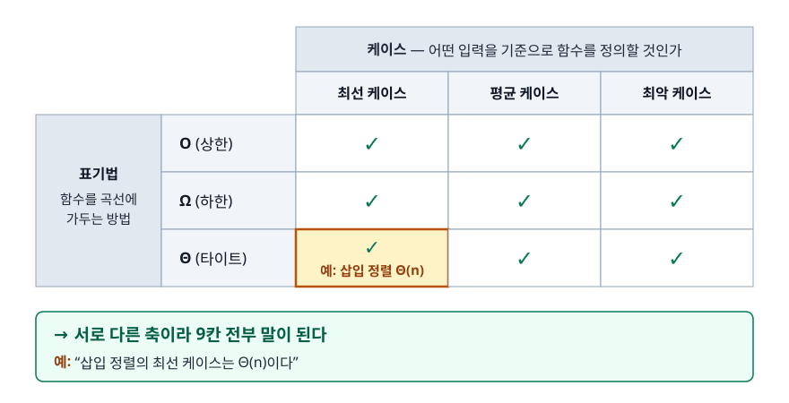
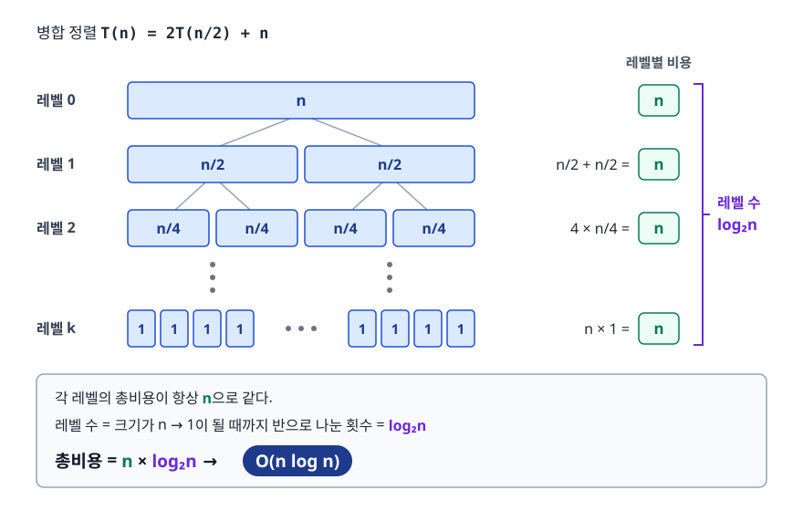
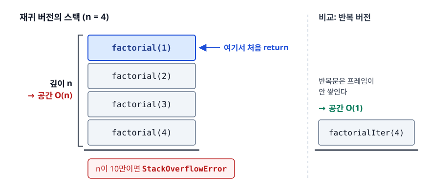

# 시간 복잡도와 점근 표기법 (Time Complexity & Asymptotic Notation)

> 시간 복잡도는 초 단위의 정확한 예측을 내주고 입력이 커질 때의 증가율을 얻는 거래입니다. 코드를 실행해 보지 않고도 "이 풀이가 제한 시간 안에 끝나는가"를 가늠하는 방법을 이 문서에서 다룹니다.

## 학습 목표

- [ ] 왜 실행 시간(초)이 아니라 증가율로 알고리즘을 비교하는지 설명할 수 있다
- [ ] O, Ω, Θ의 의미를 구분하고, 최선/평균/최악 케이스와 다른 축이라는 것을 이해한다
- [ ] 반복문·재귀 코드를 보고 시간 복잡도를 직접 계산할 수 있다
- [ ] 공간 복잡도에 재귀 스택이 포함된다는 것을 이해한다
- [ ] 입력 크기만 보고 필요한 알고리즘의 복잡도를 역산할 수 있다

## 선행 지식

- 없음 — 반복문과 재귀 함수를 읽을 수 있으면 이 문서부터 시작해도 됩니다.

---

## 1. 왜 필요한가

같은 문제를 푸는 코드 두 개가 있습니다. 어느 쪽이 더 좋은가? 가장 소박한 답은 "둘 다 돌려보고 초를 재면 된다"입니다. 그런데 이 방법은 실제로 쓸모가 없습니다.

- 내 노트북에서 2초 걸린 코드가 채점 서버에서는 0.4초에 끝납니다. **하드웨어가 다릅니다.**
- 원소 100개로 재면 A가 빠른데, 100만 개로 재면 B가 압도적으로 빠릅니다. **입력에 따라 순위가 뒤집힙니다.**
- JIT 워밍업, GC, 캐시 상태에 따라 같은 코드도 실행할 때마다 다르게 나옵니다. **측정이 재현되지 않습니다.**

그래서 우리가 비교하는 대상은 "몇 초 걸리는가"가 아니라 **입력이 커질 때 연산 횟수가 어떤 속도로 늘어나는가**입니다. 이 증가율은 CPU 모델이나 언어와 무관한, 알고리즘 자체의 성질입니다.

> **비유**: 자동차를 고를 때 "지금 시속 몇 km인가"가 아니라 "가속 페달을 밟으면 얼마나 빨리 붙는가"를 보는 것과 같습니다. 순간 속도는 도로 상태(하드웨어)에 좌우되지만, 가속 성능은 차 자체의 성질입니다.
>
> **비유의 한계**: 자동차는 가속이 좋으면 대체로 최고 속도도 높습니다. 하지만 알고리즘은 증가율이 나빠도 **작은 입력에서는 더 빠를 수 있습니다.** n이 10인데 O(n²) 삽입 정렬이 O(n log n) 병합 정렬보다 빠른 일은 흔합니다.

여기서 두 가지 관례가 나옵니다.

**상수 계수를 버립니다.** 3n이든 100n이든, n이 충분히 커지면 n² 앞에서는 둘 다 똑같이 무의미합니다. 상수는 하드웨어와 구현 디테일에 따라 바뀌는 값이라 알고리즘의 성질이 아닙니다.

**낮은 차수 항을 버립니다.** n² + 5n + 300에서 n = 100만이면 n²이 10¹², 5n이 500만입니다. 5n은 n²의 0.0005%밖에 안 됩니다. 지배항 하나만 남깁니다.

---

## 2. 점근 표기법 — O, Ω, Θ

### 정의

점근 표기법(Asymptotic Notation)은 함수를 곡선에 가두는 언어입니다. n이 충분히 커졌을 때 그 함수가 어느 곡선에 갇히는지를 말해 줍니다.

| 표기 | 읽는 법 | 의미 | 일상어로 |
|------|---------|------|---------|
| O(g(n)) | 빅오 | 어떤 상수 c와 n₀가 있어 n ≥ n₀에서 f(n) ≤ c·g(n) | 아무리 나빠도 이 곡선 아래 (상한) |
| Ω(g(n)) | 빅오메가 | 어떤 상수 c와 n₀가 있어 n ≥ n₀에서 f(n) ≥ c·g(n) | 아무리 좋아도 이 곡선 위 (하한) |
| Θ(g(n)) | 세타 | O와 Ω를 동시에 만족 | 위아래로 같은 곡선에 끼임 (딱 맞음) |

```
   실행 비용
      ↑
      │                   c1·g(n)   ← O : 이 위로는 못 올라감
      │                  /
      │                 /   f(n)    ← 알고리즘의 실제 비용
      │                /   /
      │               /   /   c2·g(n)  ← Ω : 이 아래로는 안 내려감
      │              /   /   /
      │             /   /   /
      │            /  //  /
      │           /_////
      └──────────┬────────────────────→ n
                n0
             (이 지점 이후로만 성립. 그 전은 신경 쓰지 않는다)
```

`n ≥ n₀에서만` 이라는 단서가 핵심입니다. 점근 표기법은 **작은 입력에서는 아무 말도 하지 않습니다.** "O(n log n)이 O(n²)보다 항상 빠르다"는 말이 틀린 이유가 여기 있습니다.

### 세 표기법의 관계

f(n) = 3n² + 5n인 알고리즘이 있다고 합시다.

- O(n²) — 맞습니다.
- O(n³) — **이것도 맞습니다.** 상한이므로 더 헐렁하게 잡아도 참입니다. 다만 쓸모가 없습니다.
- Ω(n²) — 맞습니다.
- Ω(n) — **이것도 맞습니다.** 하한이므로 더 낮게 잡아도 참입니다.
- Θ(n²) — 맞습니다. 위아래가 모두 n²이므로 가장 정확한 표현입니다.

수학적으로 가장 정확한 서술은 Θ입니다. 그런데 현업과 면접에서는 압도적으로 O를 씁니다. 이유는 두 가지입니다. 첫째, 우리가 궁금한 건 대개 "최악에 얼마나 느려질 수 있나"입니다. 둘째, Θ를 증명하려면 상한과 하한을 모두 보여야 해서 번거롭습니다. 그래서 실무에서 "이 알고리즘은 O(n log n)이다"라고 말할 때는 대부분 Θ(n log n)을 가리킵니다.

### 흔한 오해

> **"O는 최악, Ω는 최선, Θ는 평균이다"**

널리 퍼진 설명이지만 **틀렸습니다.** O/Ω/Θ는 *함수를 곡선에 가두는 방법*이고, 최선/평균/최악은 *어떤 입력을 기준으로 함수를 정의할 것인가*입니다. 서로 다른 축이라 조합해서 씁니다.

<!-- diagram:cs-time-complexity-1 -->


<!-- 위 그림이 대체한 원본 ASCII.
     내용을 고칠 때는 그림도 함께 갱신할 것.
```
                    │  최선 케이스   평균 케이스   최악 케이스
  ──────────────────┼──────────────────────────────────────
   O (상한)         │     ✓             ✓            ✓
   Ω (하한)         │     ✓             ✓            ✓
   Θ (타이트)       │     ✓             ✓            ✓

   → 9칸 전부 말이 된다. 예: "삽입 정렬의 최선 케이스는 Θ(n)이다"
```
-->

실제로 삽입 정렬은 이렇게 서술합니다.

- 최선(이미 정렬됨): Θ(n)
- 최악(역순): Θ(n²)
- 모든 경우를 아우르는 상한: O(n²)

그리고 "삽입 정렬은 Ω(n)이다"도 참입니다. 어떤 입력이든 배열을 최소 한 번은 훑어야 하기 때문입니다.

---

## 3. 시간 복잡도 계산하기

### 반복문 규칙

```java
// (1) 단일 루프 → n번 → O(n)
for (int i = 0; i < n; i++) sum += arr[i];

// (2) 중첩 루프, 안쪽도 n번 → n × n → O(n²)
for (int i = 0; i < n; i++)
    for (int j = 0; j < n; j++)
        count++;

// (3) 안쪽이 i까지만 → 0+1+2+...+(n-1) = n(n-1)/2 → 여전히 O(n²)
for (int i = 0; i < n; i++)
    for (int j = 0; j < i; j++)
        count++;

// (4) 매 회 절반 → log₂n번 → O(log n)
for (int i = n; i > 0; i /= 2) count++;

// (5) 바깥 O(n) × 안쪽 O(log n) → O(n log n)
for (int i = 0; i < n; i++)
    for (int j = n; j > 0; j /= 2)
        count++;

// (6) 나란히 있는 두 루프는 곱이 아니라 합 → O(n) + O(n²) = O(n²)
for (int i = 0; i < n; i++) a();
for (int i = 0; i < n; i++)
    for (int j = 0; j < n; j++) b();
```

(3)번을 O(n²/2)로 쓰지 않도록 주의합니다. 상수 1/2는 버립니다.

### 재귀는 재귀 트리로 센다

재귀는 "한 번 호출에 드는 비용 × 호출 횟수"를 트리로 그려서 셉니다. 병합 정렬의 `T(n) = 2T(n/2) + n`을 예로 들면,

<!-- diagram:cs-time-complexity-2 -->


<!-- 위 그림이 대체한 원본 ASCII.
     내용을 고칠 때는 그림도 함께 갱신할 것.
```
레벨 0 :            [ n ]                     비용 n
                   /      \
레벨 1 :        [n/2]    [n/2]                비용 n/2 + n/2 = n
                /   \    /   \
레벨 2 :    [n/4] [n/4][n/4] [n/4]            비용 4 × n/4 = n
              ...        ...
레벨 k :  [1][1][1][1] ... [1][1]             비용 n × 1 = n

  각 레벨의 총비용이 항상 n으로 같다.
  레벨 수 = 크기가 n → 1이 될 때까지 반으로 나눈 횟수 = log₂n
  총비용 = n × log₂n  →  O(n log n)
```
-->

같은 방식으로 몇 가지 패턴을 외워두면 편합니다.

| 점화식 | 결과 | 대표 예시 |
|--------|------|----------|
| T(n) = T(n/2) + O(1) | O(log n) | 이진 탐색 |
| T(n) = T(n-1) + O(1) | O(n) | 팩토리얼 재귀 |
| T(n) = 2T(n/2) + O(n) | O(n log n) | 병합 정렬 |
| T(n) = T(n-1) + O(n) | O(n²) | 퀵 정렬 최악 |
| T(n) = 2T(n-1) + O(1) | O(2ⁿ) | 하노이의 탑 |

표의 결론: **문제 크기를 나누면(n/2) 로그가 붙고, 하나씩 줄이면(n-1) 선형이 되며, 호출이 2갈래로 늘면서 크기가 하나씩만 줄면 지수가 됩니다.**

메모이제이션 없는 피보나치 재귀는 흔히 O(2ⁿ)으로 소개되지만, 점화식이 정확히는 `T(n) = T(n-1) + T(n-2) + O(1)`이라 실제 증가율은 황금비를 밑으로 하는 약 1.62ⁿ입니다. O(2ⁿ)은 그것을 덮는 헐렁한 상한이라 틀린 표기는 아닙니다.

### 분할 상환 분석 (Amortized Analysis)

`ArrayList.add()` 한 번의 최악 비용은 O(n)입니다. 내부 배열이 꽉 차면 더 큰 배열을 만들어 전부 복사해야 하기 때문입니다. 그런데 우리는 `ArrayList.add()`를 O(1)이라고 부릅니다. 왜일까요.

용량을 2배씩 늘린다고 하면, n개를 넣는 동안 발생한 복사 비용의 총합은

```
1 + 2 + 4 + 8 + ... + n/2 + n  <  2n
```

입니다. 이 비용을 n번의 add에 고르게 나누면 호출당 평균 2회 미만, 즉 <strong>분할 상환 O(1)</strong>입니다.

평균 케이스와 헷갈리면 안 됩니다. 평균 케이스는 "입력이 랜덤일 때의 기댓값"이라 운이 나쁘면 매번 느릴 수 있습니다. 분할 상환은 "연속된 n번의 총합이 반드시 이 값 이하"라는 **보장**입니다. 확률이 개입하지 않습니다.

---

## 4. 공간 복잡도 (Space Complexity)

공간 복잡도는 보통 **입력 자체를 제외한 추가 메모리(auxiliary space)** 를 셉니다. 정렬 함수에 넘긴 길이 n의 배열은 어차피 있어야 하는 것이므로 세지 않습니다. 알고리즘이 새로 잡는 공간만 셉니다.

가장 자주 놓치는 항목이 **재귀 호출 스택**입니다.

```java
// 시간 O(n), 공간 O(n)  ← 스택 프레임이 n개 쌓인다
long factorial(int n) {
    if (n <= 1) return 1;
    return n * factorial(n - 1);
}

// 시간 O(n), 공간 O(1)  ← 반복문은 프레임이 안 쌓인다
long factorialIter(int n) {
    long result = 1;
    for (int i = 2; i <= n; i++) result *= i;
    return result;
}
```

<!-- diagram:cs-time-complexity-3 -->


<!-- 위 그림이 대체한 원본 ASCII.
     내용을 고칠 때는 그림도 함께 갱신할 것.
```
재귀 버전의 스택 (n = 4)

┌──────────────────┐
│ factorial(1)     │  ← 여기서 처음 return
├──────────────────┤
│ factorial(2)     │
├──────────────────┤
│ factorial(3)     │   깊이 n → 공간 O(n)
├──────────────────┤
│ factorial(4)     │
└──────────────────┘
   n이 10만이면 StackOverflowError
```
-->

그래서 DFS를 재귀로 짜면 정점이 10만 개인 일자형 그래프에서 스택 오버플로가 납니다. 시간 복잡도만 보고 안심하면 안 됩니다.

시간과 공간은 자주 맞바꿉니다. 메모이제이션은 O(n) 메모리를 써서 O(2ⁿ)을 O(n)으로 줄이는 거래이고, 해시 테이블은 O(n) 메모리로 탐색을 O(n)에서 O(1)로 줄이는 거래입니다.

---

## 5. 입력 크기로 알고리즘 고르기

경쟁 프로그래밍과 코딩 테스트에서 가장 실용적인 기술입니다. 문제의 제한 조건에 적힌 n을 보면 **출제자가 의도한 복잡도가 역산됩니다.**

기준은 어림값 하나입니다. **1초에 대략 1억(10⁸) 번의 단순 연산.** 언어와 연산 종류에 따라 수 배씩 차이 나므로 정확한 수치가 아니라 자릿수 감각으로 씁니다.

| 입력 크기 n | 허용 복잡도 | 전형적인 접근 |
|------------|------------|--------------|
| n ≤ 11 | O(n!) | 순열 완전 탐색, 외판원 문제 완전 탐색 |
| n ≤ 20 | O(2ⁿ) | 부분집합 탐색, 비트마스크 DP |
| n ≤ 100 | O(n³) | 플로이드-워셜, 3중 반복 DP |
| n ≤ 3,000 | O(n²) | 2차원 DP, 모든 쌍 비교, LCS |
| n ≤ 200,000 | O(n log n) | 정렬, 우선순위 큐, 이진 탐색, 분할 정복 |
| n ≤ 5,000,000 | O(n) | 투 포인터, 슬라이딩 윈도우, 누적 합 |
| n ≥ 10⁹ | O(log n) / O(1) | 이진 탐색(파라메트릭 서치), 수식, 행렬 거듭제곱 |

표의 결론: **n이 10⁵을 넘으면 이중 반복문은 포기하고 정렬·해시·이진 탐색으로 O(n log n) 이하를 노려야 합니다.**

역방향 활용도 강력합니다. n이 20 이하로 이상하게 작으면 출제자가 "지수 시간 완전 탐색을 허용하겠다"고 신호를 준 것입니다. 반대로 n이 10⁹이면 n을 하나씩 훑는 순간 이미 틀린 풀이입니다.

### n이 2배가 되면

복잡도 클래스의 체감 차이는 이 표가 가장 잘 보여줍니다.

| 복잡도 | n → 2n일 때 실행 시간 | n이 1024 → 2048일 때 |
|--------|---------------------|---------------------|
| O(1) | 그대로 | 그대로 |
| O(log n) | 단계 1회 추가 | 10회 → 11회 |
| O(n) | 2배 | 2배 |
| O(n log n) | 2배보다 조금 더 | 약 2.2배 |
| O(n²) | 4배 | 4배 |
| O(2ⁿ) | 제곱 | 사실상 계산 불가 |

---

## 6. 실무에서는

**데이터베이스 인덱스.** 인덱스 없는 조회는 테이블 전체를 훑는 O(n)입니다. B-Tree 인덱스가 붙으면 O(log n)으로 줄어듭니다. 행이 100만 개일 때 100만 번 대 20번 정도의 차이라, 응답 시간이 초 단위에서 밀리초 단위로 바뀝니다. 인덱스가 필요한 이유는 결국 복잡도 문제입니다.

**자료구조 선택 실수.** `List.contains()`는 O(n)입니다. 리스트 10만 개를 순회하면서 매번 다른 리스트에 `contains()`를 호출하면 O(n²), 즉 100억 번이라 몇 분씩 걸립니다. 조회용 컬렉션을 `HashSet`으로 바꾸는 것만으로 O(n)이 되어 즉시 끝납니다. 실제 서비스 성능 이슈에서 가장 흔하게 마주치는 패턴입니다.

**같은 O인데 성능이 다른 경우.** 퀵 정렬과 병합 정렬은 둘 다 평균 O(n log n)이지만 실측은 퀵 정렬이 빠릅니다. 퀵 정렬은 제자리(in-place)에서 메모리를 순차 접근해 캐시 적중률이 높고, 병합 정렬은 매 병합마다 보조 배열을 오가며 캐시 미스를 냅니다. Big-O가 무시한 상수 계수가 여기에 숨어 있습니다. 그래서 Java의 `Arrays.sort()`도 기본 타입에는 Dual-Pivot 퀵 정렬, 객체 배열에는 TimSort를 씁니다.

**해시의 최악 케이스.** `HashMap.get()`은 평균 O(1)이지만 모든 키가 같은 버킷으로 몰리면 최악 O(n)입니다. 이 성질을 악용한 해시 충돌 DoS 공격이 실제로 존재합니다. 의도적으로 충돌하는 키를 대량 전송하는 방식입니다. Java 8 이후 `HashMap`은 한 버킷의 항목이 일정 수를 넘으면 연결 리스트를 트리로 바꿔 최악을 O(log n)으로 낮춥니다.

---

## 7. 면접 포인트

> 면접에서 이 주제가 나오면 이렇게 답한다

**Q. Big-O 표기법이 무엇인가요?**

A. 입력 크기가 커질 때 알고리즘의 비용이 증가하는 속도의 **상한**을 나타내는 표기법입니다. 상수 계수와 낮은 차수 항을 무시하기 때문에 하드웨어나 구현 언어와 무관하게 알고리즘 자체를 비교할 수 있습니다. 흔히 최악 케이스와 함께 쓰이지만 표기법 자체가 최악을 뜻하는 것은 아니고, "최선 케이스가 O(n)이다" 같은 서술도 성립합니다.
- 꼬리 질문: "그럼 Ω와 Θ는요?" → Ω는 하한, Θ는 상한과 하한이 같은 타이트 바운드. 최선/평균/최악과는 다른 축이며 셋 다 어떤 케이스에도 붙일 수 있다고 설명합니다.

**Q. Big-O가 같으면 성능도 같은가요?**

A. 아닙니다. Big-O는 증가율의 클래스만 나타내고 상수 계수를 버립니다. 실제 성능은 캐시 지역성, 메모리 할당 비용, 분기 예측 같은 하드웨어 요소가 좌우합니다. 퀵 정렬과 병합 정렬이 같은 O(n log n)인데도 제자리 정렬인 퀵 정렬이 대체로 빠른 것이 대표적인 예입니다.
- 꼬리 질문: "그럼 Big-O를 왜 보나요?" → 입력이 커질 때의 확장성을 판단하는 데는 여전히 유일하게 신뢰할 수 있는 지표라고 답합니다. 상수 차이는 몇 배지만 클래스 차이는 몇만 배입니다.

**Q. 입력이 최대 10만인 문제에서 O(n²) 풀이를 냈다면 어떻게 되나요?**

A. 100억 번 연산이라 대부분의 채점 환경에서 시간 초과입니다. n이 10만이면 O(n log n) 이하를 목표로 해야 하고, 보통 정렬 후 투 포인터, 해시 기반 조회, 이진 탐색 중 하나로 이중 반복문을 제거합니다.
- 꼬리 질문: "n이 20이면요?" → 지수 시간을 허용하겠다는 신호이므로 비트마스크나 백트래킹 완전 탐색을 우선 검토한다고 답합니다.

**Q. 공간 복잡도를 계산할 때 재귀는 어떻게 보나요?**

A. 재귀 호출 깊이만큼 스택 프레임이 쌓이므로 최대 깊이가 곧 추가 공간입니다. 퀵 정렬의 추가 공간을 평균 O(log n), 최악 O(n)으로 세는 것도 분할 깊이가 그대로 스택 깊이이기 때문입니다. 정점 10만 개짜리 그래프를 재귀 DFS로 탐색하면 스택 오버플로가 날 수 있는 것도 마찬가지입니다.
- 꼬리 질문: "해결책은?" → 명시적 스택을 쓰는 반복 구현으로 바꾸거나, 언어/런타임의 스택 크기를 늘리거나, 꼬리 재귀 형태로 바꿀 수 있으면 바꿉니다.

---

## 자주 하는 실수

| 실수 | 왜 틀렸나 | 올바른 이해 |
|------|----------|-----------|
| "O는 최악, Ω는 최선, Θ는 평균" | 표기법과 케이스는 별개의 축이다 | O/Ω/Θ는 곡선에 가두는 방식, 최선/평균/최악은 기준 입력. 9가지 조합이 모두 가능 |
| O(2n), O(n² + n)처럼 쓴다 | 상수와 낮은 차수는 정의상 무시된다 | O(n), O(n²)으로 정리해서 쓴다 |
| "정렬된 배열이니 O(log n)에 찾습니다"라고만 답한다 | 정렬 비용 O(n log n)이 빠졌다 | 한 번 찾을 거면 전체 O(n log n), 여러 번 찾을 거면 정렬 비용을 분할 상환한다 |
| 재귀 풀이의 공간을 O(1)로 계산 | 호출 스택이 깊이만큼 쌓인다 | 최대 재귀 깊이 = 추가 공간 |
| HashMap 조회를 무조건 O(1)로 단정 | 충돌이 몰리면 최악은 O(n) 또는 O(log n) | 평균 O(1), 최악은 별도로 언급 |
| n이 작은데 복잡도 낮은 알고리즘을 고집 | 점근 표기법은 작은 n에서는 아무것도 보장하지 않는다 | n이 수십 이하면 삽입 정렬처럼 상수가 작은 쪽이 실측이 빠르다 |

---

## 한 줄 정리

시간 복잡도는 "몇 초 걸리나"가 아니라 "입력이 커질 때 몇 배로 느려지나"를 재는 자입니다. 실전에서는 문제의 입력 크기를 보고 쓸 수 있는 알고리즘의 범위를 미리 좁히는 데 씁니다.

---

## 연관 개념

- [02-sorting.md](./02-sorting.md) - 복잡도 분석이 가장 잘 드러나는 사례집. 비교 정렬의 하한 Ω(n log n)
- [03-searching.md](./03-searching.md) - O(log n)이 실제로 어떻게 만들어지는지
- [qna-algorithm.md](./qna-algorithm.md) - 복잡도 관련 면접 질문과 답변 (Q1, Q6, Q11)
- [../data-structure/qna-data-structure.md](../data-structure/qna-data-structure.md) - 자료구조별 연산 복잡도
- [../operating-system/02-memory-management.md](../operating-system/02-memory-management.md) - 공간 복잡도가 실제 메모리에서 어떻게 소비되는지
