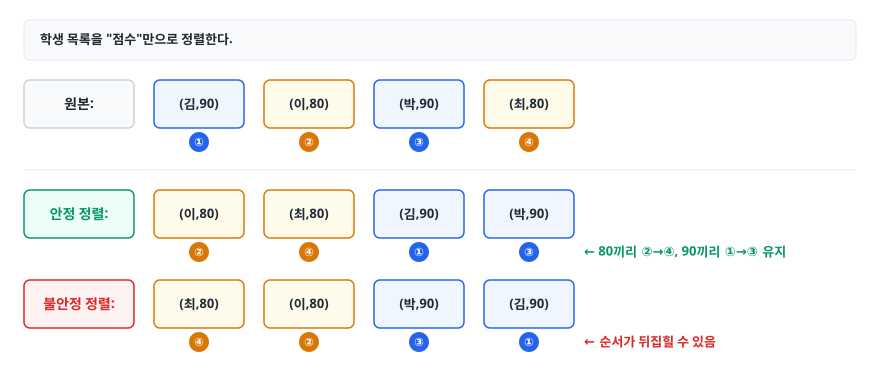
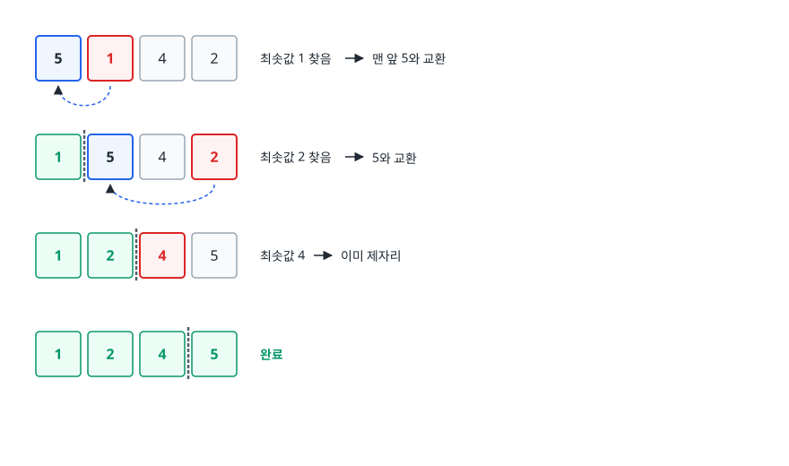
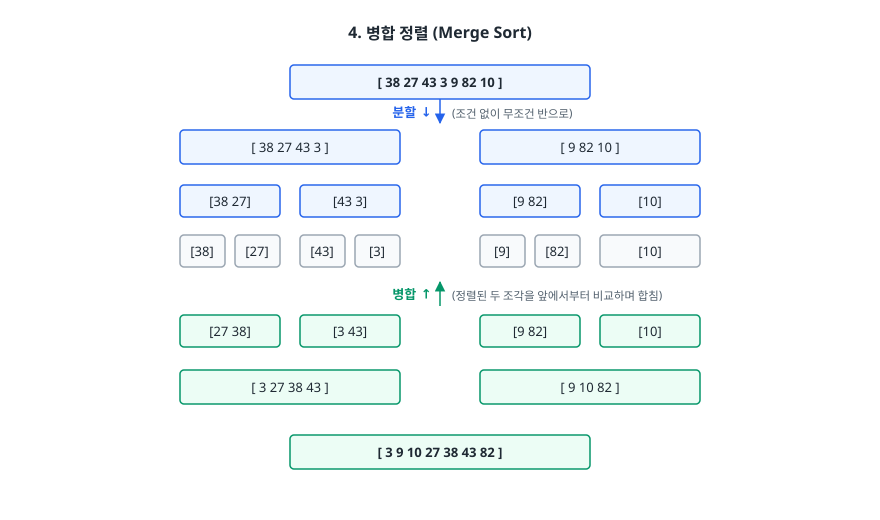
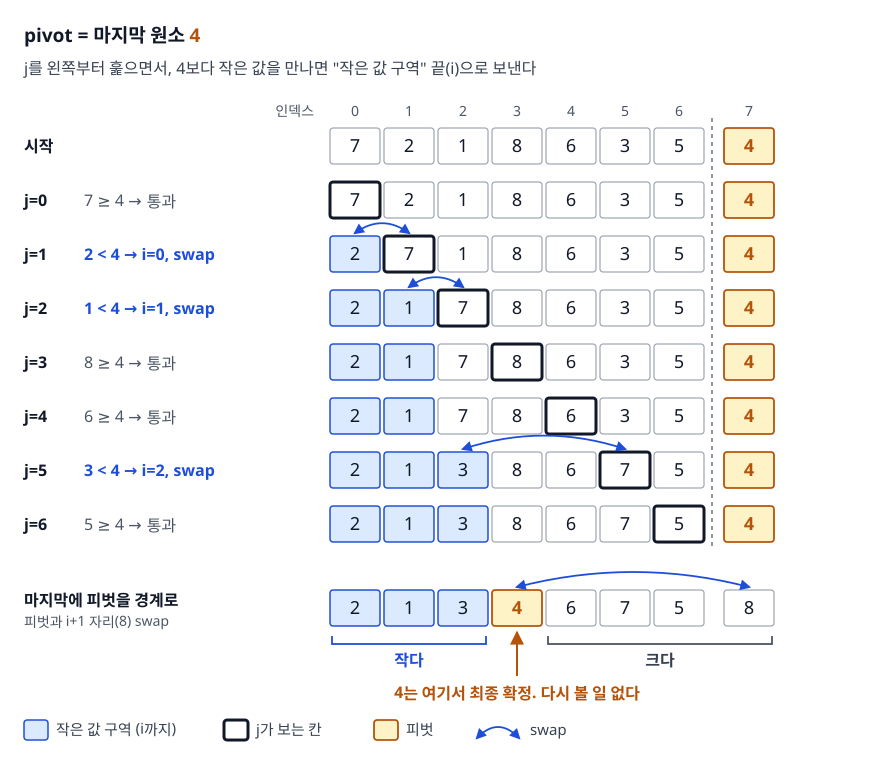
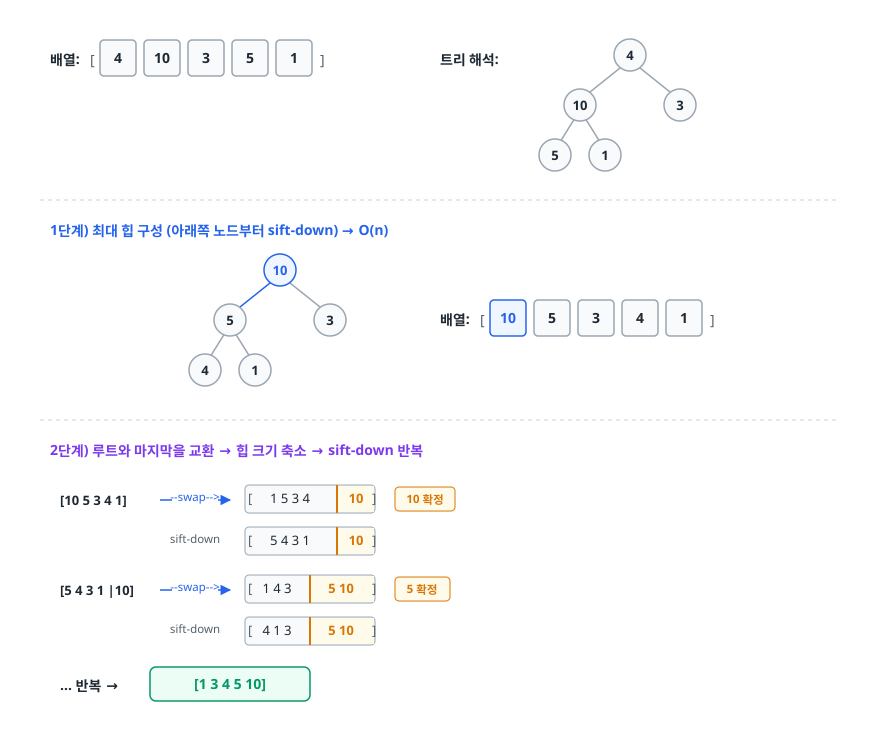

# 정렬 알고리즘 (Sorting Algorithms)

> 실무 라이브러리는 정렬 하나만 쓰지 않습니다. 여섯 가지 정렬의 동작 원리를 그림 없이 설명하는 데까지 가면 그 이유가 보입니다.

## 학습 목표

- [ ] 버블/선택/삽입 정렬이 왜 모두 O(n²)인데 성질이 다른지 설명할 수 있다
- [ ] 병합 정렬과 퀵 정렬의 분할 정복 방식 차이를 설명할 수 있다
- [ ] 안정 정렬(stable sort)이 실무에서 왜 필요한지 예를 들 수 있다
- [ ] 퀵 정렬의 최악 케이스와 피벗 전략을 설명할 수 있다
- [ ] 비교 기반 정렬의 하한이 왜 O(n log n)인지, 기수 정렬이 어떻게 그것을 우회하는지 안다
- [ ] Java/Python/C++/JS의 표준 정렬이 무엇을 쓰는지 답할 수 있다

## 선행 지식

- [01-time-complexity.md](./01-time-complexity.md) - 최선/최악 케이스와 재귀 트리 분석

---

## 1. 왜 필요한가

정렬 자체가 목적인 경우는 생각보다 드뭅니다. 정렬이 중요한 진짜 이유는 **다른 알고리즘의 전제 조건이기 때문**입니다.

- 이진 탐색은 정렬을 요구합니다. O(n) 탐색이 O(log n)이 됩니다.
- 중복 제거는 정렬하면 인접 비교 한 번으로 끝납니다. O(n²)이 O(n log n)이 됩니다.
- 투 포인터, 스위핑, 대부분의 그리디 알고리즘은 "정렬된 상태"에서 출발합니다.
- 데이터베이스의 `ORDER BY`, `GROUP BY`, 정렬 병합 조인이 전부 정렬 위에 서 있습니다.

그런데 정렬 알고리즘은 한 개가 아니라 수십 개입니다. 이미 정답이 나온 문제 같은데 왜 계속 새 정렬이 나올까요? **입력의 성질에 따라 최적이 달라지기 때문**입니다. 거의 정렬된 로그 데이터, 값의 범위가 좁은 점수 배열, 메모리에 못 올리는 100GB 파일은 각각 다른 전략을 요구합니다.

정렬 알고리즘을 평가하는 축은 네 가지입니다.

| 축 | 무엇을 보나 |
|----|-----------|
| 시간 복잡도 | 비교와 교환 횟수의 증가율. 최선/평균/최악을 따로 본다 |
| 공간 복잡도 | 입력 배열 외에 추가로 쓰는 메모리. O(1)이면 제자리(in-place) 정렬 |
| 안정성 | 같은 값의 원래 순서가 보존되는가 |
| 적응성 | 이미 어느 정도 정렬된 입력에서 빨라지는가 |

---

## 2. 안정 정렬이란 무엇이고 왜 중요한가

먼저 이것부터 정리해야 아래 설명이 편합니다.

**안정 정렬(Stable Sort)** 은 정렬 키가 같아서 우열을 가릴 수 없는 원소들끼리 입력에서의 앞뒤 관계를 그대로 물려받는 정렬입니다. 키가 같은 두 원소는 정렬 전에 앞에 있던 쪽이 정렬 후에도 앞에 옵니다.

<!-- diagram:cs-sorting-1 -->


<!-- 위 그림이 대체한 원본 ASCII.
     내용을 고칠 때는 그림도 함께 갱신할 것.
```
학생 목록을 "점수"만으로 정렬한다.

원본:          (김,90)  (이,80)  (박,90)  (최,80)
                 ①        ②        ③        ④

안정 정렬:     (이,80)  (최,80)  (김,90)  (박,90)
                 ②        ④        ①        ③     ← 80끼리 ②→④, 90끼리 ①→③ 유지

불안정 정렬:   (최,80)  (이,80)  (박,90)  (김,90)
                 ④        ②        ③        ①     ← 순서가 뒤집힐 수 있음
```
-->

둘 다 "점수순 정렬"로는 정답입니다. 그런데 실무에서 안정성이 필요한 순간이 있습니다.

**다중 키 정렬**이 대표적입니다. "부서별로 묶되 부서 안에서는 이름순"으로 정렬하고 싶다면, 안정 정렬을 쓸 경우 **이름으로 먼저 정렬한 뒤 부서로 다시 정렬**하기만 하면 됩니다. 부서 정렬 단계에서 같은 부서 안의 이름 순서가 보존되기 때문입니다. 불안정 정렬이라면 비교 함수 하나에 두 키를 모두 넣어야 합니다.

또 하나는 **UI의 예측 가능성**입니다. 사용자가 테이블 헤더를 클릭해 정렬했을 때, 값이 같은 행들이 매번 다른 순서로 튀어나오면 버그처럼 느껴집니다. ECMAScript가 2019년 사양부터 `Array.prototype.sort`의 안정성을 요구하게 된 배경이기도 합니다.

기본 타입(int, double) 배열에서는 안정성이 의미가 없습니다. 값 5와 값 5는 구분할 방법이 없어서 어느 쪽이 먼저 오든 결과가 동일합니다. 이 사실이 뒤에서 Java의 설계를 설명해 줍니다.

---

## 3. O(n²) 정렬 세 가지

### 버블 정렬 (Bubble Sort)

인접한 두 원소를 비교해 순서가 어긋나면 교환합니다. 한 번 훑을 때마다 가장 큰 값이 맨 뒤로 "떠오릅니다".

```
[ 5  1  4  2 ]  1회전 : (5,1) swap → (5,4) swap → (5,2) swap  ⇒ [1 4 2 |5]  최댓값 5 확정
[ 1  4  2 |5 ]  2회전 : (1,4) 유지  → (4,2) swap              ⇒ [1 2 |4 5]  4 확정
[ 1  2 |4  5 ]  3회전 : 교환이 한 번도 없음                    ⇒ 종료
```

교환 횟수가 세 알고리즘 중 가장 많아 실전에서는 쓰지 않습니다. 다만 "이번 회전에 교환이 한 번도 없었으면 종료"라는 플래그를 넣으면 이미 정렬된 입력에서 O(n)이 됩니다. 교육용 이상의 가치는 거의 없습니다.

### 선택 정렬 (Selection Sort)

남은 구간에서 최솟값을 찾아 맨 앞과 교환합니다.

<!-- diagram:cs-sorting-2 -->


<!-- 위 그림이 대체한 원본 ASCII.
     내용을 고칠 때는 그림도 함께 갱신할 것.
```
[ 5  1  4  2 ]  최솟값 1 찾음 → 맨 앞 5와 교환
[ 1 | 5  4  2 ] 최솟값 2 찾음 → 5와 교환
[ 1  2 | 4  5 ] 최솟값 4 → 이미 제자리
[ 1  2  4 | 5 ] 완료
```
-->

**교환 횟수가 정확히 n-1번**이라는 점이 특징입니다. 비교는 항상 n(n-1)/2번 하지만 실제 데이터 이동은 극히 적습니다. 그래서 원소 하나가 매우 크고(구조체 통째 복사) 비교는 싼 상황에서는 이론적 이점이 있습니다. 반면 입력이 이미 정렬돼 있어도 O(n²)입니다. 적응성이 없다는 뜻입니다. 멀리 있는 원소와 교환하므로 **불안정 정렬**이기도 합니다.

### 삽입 정렬 (Insertion Sort)

앞쪽의 이미 정렬된 구간에 새 원소를 알맞은 자리로 끼워 넣습니다.

> **비유**: 손에 든 카드를 정리하는 방식 그대로입니다. 왼쪽은 이미 순서를 맞춰 둔 카드고, 새로 뽑은 카드를 그 사이 제자리에 밀어 넣습니다.
>
> **비유의 한계**: 사람은 카드 전체를 한눈에 훑어 자리를 바로 짚습니다. 삽입 정렬은 오른쪽 끝부터 한 칸씩 비교하며 원소를 밀어냅니다. 카드 정리가 빨라 보이는 건 사람의 시야가 병렬로 동작해서지, 알고리즘이 O(n)이라서가 아닙니다.

```
[ 5 | 1  4  2 ]  1을 왼쪽으로 밀어 넣기 → [1 5 | 4 2]
[ 1  5 | 4  2 ]  4를 5 앞에 삽입        → [1 4 5 | 2]
[ 1  4  5 | 2 ]  2를 4 앞에 삽입        → [1 2 4 5]
```

```java
static void insertionSort(int[] a) {
    for (int i = 1; i < a.length; i++) {
        int key = a[i];
        int j = i - 1;
        // a[j] > key : 같을 때는 멈춘다 → 같은 값의 순서 보존 → 안정 정렬
        while (j >= 0 && a[j] > key) {
            a[j + 1] = a[j];
            j--;
        }
        a[j + 1] = key;
    }
}
```

삽입 정렬은 O(n²) 삼형제 중 유일하게 실무에서 살아남았습니다. 이유는 두 가지입니다.

1. **적응적입니다.** 이미 정렬된 입력이면 while 문이 한 번도 돌지 않아 O(n)입니다. "거의 정렬된" 데이터에서 압도적으로 빠릅니다.
2. **상수 계수가 작습니다.** 재귀 호출도, 메모리 할당도 없습니다. 그래서 n이 대략 수십 이하인 작은 배열에서는 병합/퀵 정렬보다 실측이 빠릅니다.

이 두 성질 때문에 TimSort와 introsort 같은 실무 하이브리드 정렬이 **작은 구간의 마무리를 삽입 정렬에 맡깁니다.**

---

## 4. 병합 정렬 (Merge Sort)

배열을 반으로 쪼개서 각각 정렬한 뒤, 정렬된 두 배열을 합칩니다. 분할 정복(Divide and Conquer)의 교과서입니다.

<!-- diagram:cs-sorting-3 -->


<!-- 위 그림이 대체한 원본 ASCII.
     내용을 고칠 때는 그림도 함께 갱신할 것.
```
                [ 38  27  43  3  9  82  10 ]
        분할 ↓        (조건 없이 무조건 반으로)
        [ 38 27 43 3 ]           [ 9 82 10 ]
        [38 27]  [43 3]          [9 82]  [10]
        [38][27] [43][3]         [9][82] [10]
        병합 ↑        (정렬된 두 조각을 앞에서부터 비교하며 합침)
        [27 38]  [3 43]          [9 82]  [10]
        [ 3 27 38 43 ]           [ 9 10 82 ]
                [ 3  9  10  27  38  43  82 ]
```
-->

핵심은 **병합(merge)이 O(n)** 이라는 것입니다. 두 배열이 이미 정렬돼 있으므로 각 배열의 맨 앞만 비교해 작은 쪽을 꺼내면 됩니다. 레벨은 log n개이고 각 레벨의 총 비용은 n입니다. 그래서 O(n log n)입니다.

```java
// [lo, hi) 반열린 구간. buf는 호출 전 한 번만 할당한다.
static void mergeSort(int[] a, int[] buf, int lo, int hi) {
    if (hi - lo <= 1) return;
    int mid = lo + (hi - lo) / 2;    // (lo + hi) / 2 는 큰 배열에서 오버플로 위험
    mergeSort(a, buf, lo, mid);
    mergeSort(a, buf, mid, hi);

    int i = lo, j = mid, k = lo;
    while (i < mid && j < hi) {
        // <= : 값이 같으면 왼쪽(원래 앞에 있던 것)을 먼저 → 안정 정렬
        buf[k++] = (a[i] <= a[j]) ? a[i++] : a[j++];
    }
    while (i < mid) buf[k++] = a[i++];
    while (j < hi)  buf[k++] = a[j++];
    System.arraycopy(buf, lo, a, lo, hi - lo);
}
```

**장점.** 입력이 무엇이든 항상 O(n log n)입니다. 최악 케이스가 없다는 것은 응답 시간 예측이 중요한 서버에서 큰 미덕입니다. 그리고 안정 정렬입니다.

**단점.** 병합용 보조 배열 O(n)이 필요합니다. 이 때문에 캐시 미스가 잦아 실측에서는 퀵 정렬보다 느린 경우가 많습니다.

**병합 정렬이 유리한 두 자리.**
- **연결 리스트 정렬**: 포인터만 바꿔 끼우면 되므로 추가 배열 없이 병합할 수 있습니다. 임의 접근이 안 되는 연결 리스트에서는 퀵 정렬이 오히려 불리합니다.
- **외부 정렬(External Sort)**: 100GB 파일처럼 메모리에 못 올리는 데이터는 조각내어 정렬한 뒤 디스크에서 순차적으로 병합합니다. 순차 접근만 하는 병합 정렬의 성질이 여기서 결정적입니다.

---

## 5. 퀵 정렬 (Quick Sort)

역시 분할 정복이지만 순서가 반대입니다. 병합 정렬은 *무조건 반으로 나누고 합칠 때 일합니다.* 퀵 정렬은 **나눌 때 일하고 합칠 때 아무것도 하지 않습니다.**

기준값(pivot)을 하나 고른 뒤, 피벗보다 작은 값은 왼쪽, 큰 값은 오른쪽으로 재배치합니다. 이 시점에 피벗은 이미 최종 위치에 있습니다.

<!-- diagram:cs-sorting-4 -->


<!-- 위 그림이 대체한 원본 ASCII.
     내용을 고칠 때는 그림도 함께 갱신할 것.
```
pivot = 마지막 원소 4

[ 7  2  1  8  6  3  5 | 4 ]

  j를 왼쪽부터 훑으면서, 4보다 작은 값을 만나면 "작은 값 구역" 끝(i)으로 보낸다

  j=0: 7 ≥ 4 → 통과
  j=1: 2 < 4 → i=0, swap  [ 2  7  1  8  6  3  5 | 4 ]
  j=2: 1 < 4 → i=1, swap  [ 2  1  7  8  6  3  5 | 4 ]
  j=3: 8 ≥ 4 → 통과
  j=4: 6 ≥ 4 → 통과
  j=5: 3 < 4 → i=2, swap  [ 2  1  3  8  6  7  5 | 4 ]
  j=6: 5 ≥ 4 → 통과
  마지막에 피벗을 경계로   [ 2  1  3 (4) 6  7  5  8 ]
                            작다  ↑↑   크다
                          4는 여기서 최종 확정. 다시 볼 일 없다
```
-->

```java
static void quickSort(int[] a, int lo, int hi) {   // [lo, hi] 닫힌 구간
    if (lo >= hi) return;
    int p = partition(a, lo, hi);
    quickSort(a, lo, p - 1);
    quickSort(a, p + 1, hi);
}

static int partition(int[] a, int lo, int hi) {
    int pivot = a[hi];
    int i = lo - 1;
    for (int j = lo; j < hi; j++) {
        if (a[j] < pivot) { i++; swap(a, i, j); }
    }
    swap(a, i + 1, hi);
    return i + 1;
}

static void swap(int[] a, int x, int y) { int t = a[x]; a[x] = a[y]; a[y] = t; }
```

### 최악 케이스

분할이 균등해야 재귀 깊이가 log n이 됩니다. 피벗이 매번 최솟값이나 최댓값으로 뽑히면 한쪽이 0개, 다른 쪽이 n-1개로 갈려 깊이가 n이 됩니다.

```
   균등 분할 (평균)              편향 분할 (최악)

       [ n ]                        [ n ]
      /     \                      /     \
   [n/2]   [n/2]                 []     [n-1]
   /  \    /  \                          /   \
 ...  ...  ... ...                     []   [n-2]
                                              ...
 깊이 log n × 레벨당 n            깊이 n × 레벨당 n
    = O(n log n)                     = O(n²)
```

위 코드처럼 **마지막 원소를 피벗으로 고정하면 이미 정렬된 배열이 정확히 최악 케이스**가 됩니다. 현실 데이터는 정렬돼 있거나 거의 정렬된 경우가 아주 흔하기 때문에 이건 이론적 걱정이 아니라 실제 사고입니다.

또 하나의 함정은 **중복 값**입니다. 위 Lomuto 방식은 모든 원소가 같은 배열에서도 O(n²)이 됩니다. `a[j] < pivot`이 한 번도 참이 되지 않아 분할이 항상 한쪽으로 쏠립니다.

### 피벗 전략

| 전략 | 방법 | 효과 | 한계 |
|------|------|------|------|
| 첫/끝 원소 고정 | 구현이 가장 단순 | 없음 | 정렬된 입력에서 O(n²) |
| 랜덤 피벗 | 매번 무작위 인덱스와 교환 후 진행 | 특정 입력을 저격당하지 않음 | 여전히 확률적으로 최악 가능 |
| Median-of-Three | 첫·중간·끝 세 값의 중앙값 사용 | 정렬/역정렬 입력을 깔끔히 회피 | 악의적으로 설계된 입력에는 뚫림 |
| 3-way 파티션 | 작다/같다/크다 세 구간으로 분할 | 중복이 많은 입력에서 O(n)에 근접 | 구현 복잡도 상승 |
| Introsort | 재귀 깊이가 한계를 넘으면 힙 정렬로 전환 | 최악을 O(n log n)으로 **보장** | 힙 정렬 구현이 추가로 필요 |

표의 결론: **직접 구현할 땐 median-of-three 또는 랜덤 피벗이 현실적인 최소 방어선이고, 최악을 진짜로 보장하려면 introsort처럼 폴백이 있어야 합니다.**

**퀵 정렬이 그럼에도 표준으로 쓰이는 이유.** 제자리 정렬이라 추가 메모리가 재귀 스택 O(log n)뿐이고, 파티션이 배열을 앞에서 뒤로 순차 접근해 캐시 적중률이 매우 높습니다. Big-O가 무시하는 상수 계수에서 병합 정렬을 크게 앞섭니다.

---

## 6. 힙 정렬 (Heap Sort)

배열을 완전 이진 트리로 해석해서(인덱스 i의 자식은 2i+1, 2i+2) 최대 힙을 만든 뒤, 루트(최댓값)를 맨 뒤로 보내는 것을 반복합니다.

<!-- diagram:cs-sorting-5 -->


<!-- 위 그림이 대체한 원본 ASCII (원본의 화살표 꼬리는 주석이 조기 종료되지 않도록 `--&gt;`로 표기).
     내용을 고칠 때는 그림도 함께 갱신할 것.
```
배열: [ 4  10  3  5  1 ]          트리 해석:      4
                                                /   \
                                              10     3
                                             /  \
                                            5    1

1단계) 최대 힙 구성 (아래쪽 노드부터 sift-down) → O(n)
                                               10
                                              /   \
                                             5     3      배열: [10 5 3 4 1]
                                            / \
                                           4   1

2단계) 루트와 마지막을 교환 → 힙 크기 축소 → sift-down 반복
   [10 5 3 4 1]  --swap--&gt;  [1 5 3 4 |10]   10 확정
                 sift-down  [5 4 3 1 |10]
   [5 4 3 1 |10] --swap--&gt;  [1 4 3 |5 10]   5 확정
                 sift-down  [4 1 3 |5 10]
   ... 반복 → [1 3 4 5 10]
```
-->

```java
static void heapSort(int[] a) {
    int n = a.length;
    for (int i = n / 2 - 1; i >= 0; i--) siftDown(a, n, i);   // 힙 구성: O(n)
    for (int end = n - 1; end > 0; end--) {
        swap(a, 0, end);        // 최댓값을 뒤에 확정
        siftDown(a, end, 0);    // 남은 힙 복구: O(log n)
    }
}

static void siftDown(int[] a, int size, int i) {
    while (true) {
        int largest = i, l = 2 * i + 1, r = 2 * i + 2;
        if (l < size && a[l] > a[largest]) largest = l;
        if (r < size && a[r] > a[largest]) largest = r;
        if (largest == i) return;
        swap(a, i, largest);
        i = largest;
    }
}
```

힙 정렬의 위치는 독특합니다. **최악에도 O(n log n)을 보장하면서 추가 공간이 O(1)** 입니다. 병합 정렬은 보장은 되지만 O(n) 공간을 쓰고, 퀵 정렬은 공간은 적지만 보장이 없습니다. 이 두 조건을 동시에 만족하는 알고리즘이 힙 정렬만 있는 것은 아닙니다(제자리 병합 기법이 연구돼 있습니다). 다만 구현이 단순하면서 실용적인 선택지는 사실상 힙 정렬뿐입니다.

그런데도 기본 정렬로 잘 안 쓰이는 이유는 **캐시 지역성이 나쁘기 때문**입니다. sift-down은 인덱스 i에서 2i+1로 점프해 배열 여기저기를 건너뜁니다. 실측에서 퀵 정렬보다 느린 게 보통이라, 주로 introsort의 안전장치나 우선순위 큐의 구현 원리로 쓰입니다. 참고로 힙 정렬도 **불안정 정렬**입니다.

---

## 7. 정렬 알고리즘 비교

| 알고리즘 | 최선 | 평균 | 최악 | 공간 | 안정성 | 그래서 언제 쓰나 |
|---------|------|------|------|------|--------|----------------|
| 버블 | O(n) | O(n²) | O(n²) | O(1) | 안정 | 쓰지 않는다 (교육용) |
| 선택 | O(n²) | O(n²) | O(n²) | O(1) | 불안정 | 교환 비용이 극단적으로 비쌀 때 |
| 삽입 | O(n) | O(n²) | O(n²) | O(1) | 안정 | n이 작거나 거의 정렬된 데이터. 하이브리드 정렬의 마무리 |
| 병합 | O(n log n) | O(n log n) | O(n log n) | O(n) | 안정 | 최악 보장 필요, 안정성 필요, 연결 리스트, 외부 정렬 |
| 퀵 | O(n log n) | O(n log n) | O(n²) | O(log n)\* | 불안정 | 평균 성능이 최우선인 일반 배열 정렬 |
| 힙 | O(n log n) | O(n log n) | O(n log n) | O(1) | 불안정 | 메모리가 빠듯하면서 최악 보장이 필요할 때 |
| Tim | O(n) | O(n log n) | O(n log n) | O(n) | 안정 | 실제 데이터 정렬의 사실상 표준 |
| 계수 | O(n+k) | O(n+k) | O(n+k) | O(n+k) | 안정 | 값의 범위 k가 n에 비해 작은 정수 |
| 기수 | O(d(n+k)) | O(d(n+k)) | O(d(n+k)) | O(n+k) | 안정 | 자리수 d가 작은 정수·고정 길이 문자열 |

\* 퀵 정렬의 공간은 재귀 스택이며 분할이 균등할 때 O(log n), 최악으로 쏠리면 O(n)입니다. 계수 정렬의 공간은 카운트 배열 O(k)에 안정성을 위한 출력 배열 O(n)을 더한 값입니다.

표의 결론: **직접 고른다면 "최악 보장이 필요하면 병합, 메모리가 없으면 힙, 그 외엔 퀵"이고, 실무에서는 대부분 언어 표준 정렬(TimSort/introsort)을 그냥 쓰면 됩니다.**

---

## 8. 비교하지 않는 정렬은 왜 더 빠른가

위 표에서 계수·기수 정렬만 O(n log n)보다 빠릅니다. 이건 규칙 위반이 아니라 **다른 게임을 하는 것**입니다.

비교 기반 정렬은 "a와 b 중 뭐가 큰가?"라는 예/아니오 질문만 던질 수 있습니다. 이때 가능한 정렬 결과는 n!가지이고, 예/아니오 질문 k번으로 구별할 수 있는 경우의 수는 2ᵏ가지입니다. 따라서

```
2ᵏ ≥ n!   →   k ≥ log₂(n!)  ≈  n log₂ n - 1.44n
```

즉 **어떤 비교 기반 정렬도 최악에 Ω(n log n)번의 비교가 필요합니다.** 이것이 비교 정렬의 이론적 하한이고, 병합·힙 정렬은 이 하한에 도달한 최적 알고리즘입니다.

계수 정렬과 기수 정렬은 비교를 하지 않습니다. 값을 **인덱스로 직접 사용**합니다. "값이 7이니까 7번 칸에 넣는다"는 방식이라 위 논증이 적용되지 않습니다. 대가는 **값의 성질에 제약이 생긴다**는 것입니다. 정수여야 하고, 값의 범위나 자리수가 작아야 합니다. 값의 범위가 10억이면 계수 정렬은 10억 칸짜리 배열을 잡아야 해서 쓸 수 없습니다.

기수 정렬의 구체적인 동작과 구현은 [qna-algorithm.md](./qna-algorithm.md)의 Q17에 정리돼 있습니다. 여기서 기억할 것은 하나입니다. **기수 정렬의 각 자리 정렬은 반드시 안정 정렬이어야 합니다.** 1의 자리로 정렬한 결과가 10의 자리 정렬에서 보존되지 않으면 전체가 무너지기 때문입니다.

---

## 9. 실무에서는 — 언어별 표준 정렬

라이브러리 정렬은 "이론적으로 예쁜 알고리즘"이 아니라 **하이브리드**입니다. 실제 데이터의 특성과 최악 케이스 방어를 모두 챙겨야 하기 때문입니다.

**Java.** 같은 `Arrays.sort()`인데 인자 타입에 따라 다른 알고리즘이 돕니다.

```java
int[] nums = {5, 2, 8, 1};
Arrays.sort(nums);              // 기본 타입 → Dual-Pivot Quick Sort

String[] names = {"b", "a"};
Arrays.sort(names);             // 객체 배열 → TimSort

List<String> list = new ArrayList<>(List.of("b", "a"));
list.sort(Comparator.naturalOrder());   // → TimSort
```

이유가 정확히 앞에서 다룬 내용입니다. 기본 타입은 값 자체를 비교하므로 **안정성이 무의미하고**, 제자리 정렬이라 캐시 효율이 좋은 퀵 정렬이 최선입니다. Dual-Pivot은 피벗을 두 개 골라 배열을 세 구간으로 나누는 변형입니다. 분할 한 번에 원소 두 개의 자리가 확정되고, 배열을 훑는 횟수도 줄어듭니다. 실측이 빠르다는 이유로 JDK가 기본 구현으로 채택했습니다. 반대로 객체 배열은 같은 키를 가진 서로 다른 객체가 존재할 수 있어 **안정성이 필수**이므로 TimSort를 씁니다.

**TimSort**는 병합 정렬과 삽입 정렬의 하이브리드입니다. 배열을 훑으며 이미 정렬된 구간(run)을 찾아내고, 짧은 구간은 삽입 정렬로 늘린 뒤, run들을 병합합니다. 실제 데이터에는 정렬된 조각이 흔하다는 관찰에서 출발한 설계입니다. 그래서 이미 정렬된 입력에서는 O(n)에 도달합니다.

**Python.** `list.sort()`와 `sorted()`가 TimSort입니다. 애초에 TimSort가 CPython을 위해 만들어졌습니다. 안정 정렬이 보장되므로 다중 키 정렬을 다음처럼 두 번에 나눠 쓸 수 있습니다.

```python
# 부서 오름차순, 같은 부서 안에서는 이름 오름차순
people.sort(key=lambda p: p.name)   # 보조 키 먼저
people.sort(key=lambda p: p.dept)   # 주 키 나중 → 안정 정렬이라 이름 순서 보존
```

**C++.** `std::sort`는 introsort 계열 구현이 일반적입니다. 퀵 정렬로 시작해 재귀가 너무 깊어지면 힙 정렬로 전환하고, 구간이 충분히 작아지면 삽입 정렬로 마무리합니다. 표준은 `std::sort`에 O(n log n) 최악 복잡도를 요구하지만 **안정성은 요구하지 않습니다.** 안정 정렬이 필요하면 `std::stable_sort`를 써야 합니다.

**JavaScript.** 가장 유명한 함정이 여기 있습니다.

```js
[10, 9, 1, 80].sort();
// → [1, 10, 80, 9]   숫자가 아니라 문자열로 비교한다

[10, 9, 1, 80].sort((a, b) => a - b);
// → [1, 9, 10, 80]   비교 함수를 반드시 넘겨야 한다
```

기본 비교자는 원소를 문자열로 변환한 뒤 비교하도록 사양에 정의돼 있습니다. 숫자 배열을 정렬할 때는 비교 함수를 생략하면 안 됩니다. 안정성은 ES2019 사양부터 요구되며, V8은 TimSort로 이를 구현합니다.

---

## 10. 면접 포인트

> 면접에서 이 주제가 나오면 이렇게 답한다

**Q. 퀵 정렬과 병합 정렬을 비교해 주세요.**

A. 둘 다 분할 정복이지만 일하는 시점이 반대입니다. 퀵 정렬은 피벗으로 나누는 단계에서 재배치를 끝내고 합칠 때 아무 일도 하지 않으며, 병합 정렬은 무조건 반으로 나눈 뒤 합치는 단계에서 정렬합니다. 그래서 퀵 정렬은 제자리 정렬이라 공간이 O(log n)이고 캐시 효율이 좋아 평균 실측이 빠릅니다. 다만 최악이 O(n²)이며 불안정합니다. 병합 정렬은 보조 배열 O(n)이 필요한 대신 항상 O(n log n)이 보장되고 안정 정렬입니다.
- 꼬리 질문: "그럼 어떤 걸 쓰나요?" → 일반 배열이면 퀵, 최악 응답 시간 보장이나 안정성이 필요하면 병합, 연결 리스트나 외부 정렬이면 병합이라고 답합니다.

**Q. 퀵 정렬의 최악의 경우는 언제이고 어떻게 피하나요?**

A. 피벗이 매번 최솟값 또는 최댓값으로 뽑혀 분할이 한쪽으로 완전히 쏠릴 때입니다. 마지막 원소를 피벗으로 고정하면 이미 정렬된 배열이 바로 최악 케이스가 되는데, 현실 데이터는 정렬돼 있는 경우가 흔해서 실제로 자주 부딪힙니다. 랜덤 피벗이나 median-of-three로 확률적으로 회피하고, 최악을 확실히 막으려면 introsort처럼 재귀 깊이 초과 시 힙 정렬로 전환합니다.
- 꼬리 질문: "중복 값이 많은 배열은요?" → 단순 파티션으로는 이것도 O(n²)이 되므로 작다/같다/크다로 나누는 3-way 파티션을 쓴다고 답합니다.

**Q. Java의 `Arrays.sort()`가 기본 타입과 객체 배열에 다른 알고리즘을 쓰는 이유는?**

A. 안정성의 필요 여부가 다르기 때문입니다. int 같은 기본 타입은 값이 같으면 완전히 동일해서 순서를 보존할 이유가 없고, 그래서 제자리이고 캐시 효율이 좋은 Dual-Pivot 퀵 정렬이 최선입니다. 객체는 정렬 키가 같아도 서로 다른 객체이므로 다중 키 정렬 같은 용례에서 안정성이 필요하고, 그래서 안정 정렬인 TimSort를 씁니다.
- 꼬리 질문: "TimSort가 왜 실제 데이터에서 빠른가요?" → 실제 데이터에 흔한 이미 정렬된 구간(run)을 찾아 병합하기 때문에 완전 정렬된 입력이면 O(n)까지 내려간다고 답합니다.

**Q. O(n log n)보다 빠른 정렬이 존재하나요?**

A. 비교 기반 정렬은 불가능합니다. 비교 결과가 예/아니오 두 갈래뿐이라 n!가지 순열을 구별하려면 최소 log₂(n!) ≈ n log n번의 비교가 필요하다는 하한이 증명돼 있습니다. 다만 계수 정렬이나 기수 정렬처럼 값을 인덱스로 직접 사용하는 방식은 비교를 하지 않으므로 이 하한을 우회해 O(n)에 가까워지기도 합니다. 대신 정수여야 하고 값의 범위나 자리수가 작아야 한다는 제약이 붙습니다.
- 꼬리 질문: "값 범위가 10억이면요?" → 계수 정렬은 10억 칸 배열이 필요해 불가능하고, 자리수 기준인 기수 정렬을 검토하거나 그냥 비교 정렬을 씁니다.

---

## 자주 하는 실수

| 실수 | 왜 틀렸나 | 올바른 이해 |
|------|----------|-----------|
| "퀵 정렬은 O(n log n)이다"라고만 답한다 | 평균만 말하고 최악 O(n²)을 빠뜨렸다 | 평균 O(n log n) / 최악 O(n²)을 항상 함께 말한다 |
| 퀵 정렬 공간 복잡도를 O(1)로 답한다 | 재귀 스택이 분할 깊이만큼 쌓인다 | 평균 O(log n), 최악 O(n) |
| 안정 정렬을 "정렬이 잘 되는 것"으로 이해 | stable은 정확성이 아니라 동일 키의 순서 보존 문제 | 불안정 정렬도 정렬 결과 자체는 정확하다 |
| 힙 정렬을 안정 정렬로 안다 | 루트와 마지막 원소를 멀리 교환하므로 순서가 깨진다 | 힙·퀵·선택 정렬은 불안정 |
| JS에서 `arr.sort()`로 숫자를 정렬 | 기본 비교자가 문자열로 변환해 비교한다 | `arr.sort((a, b) => a - b)` |
| 계수 정렬을 만능 O(n) 정렬로 생각 | 값의 범위 k만큼 메모리를 잡는다 | k가 n에 비해 작을 때만 유효 |
| 병합 정렬에서 매 재귀마다 보조 배열을 새로 할당 | 할당 비용이 log n번 × n으로 누적된다 | 보조 배열은 최상위에서 한 번만 잡아 재사용 |

---

## 한 줄 정리

정렬 알고리즘 선택은 "시간 복잡도가 뭐냐"가 아니라 **최악을 보장해야 하는가, 안정성이 필요한가, 추가 메모리를 쓸 수 있는가, 입력이 이미 정렬돼 있는가**의 네 질문에 답하는 일입니다. 실무 라이브러리는 이 답이 상황마다 달라서 하이브리드를 씁니다.

---

## 연관 개념

- [01-time-complexity.md](./01-time-complexity.md) - 재귀 트리로 O(n log n)을 유도하는 방법
- [03-searching.md](./03-searching.md) - 정렬이 전제 조건인 이진 탐색
- [qna-algorithm.md](./qna-algorithm.md) - 정렬 면접 질문 (Q2, Q6, Q8, Q17)
- [../data-structure/qna-data-structure.md](../data-structure/qna-data-structure.md) - 힙과 우선순위 큐의 구조
