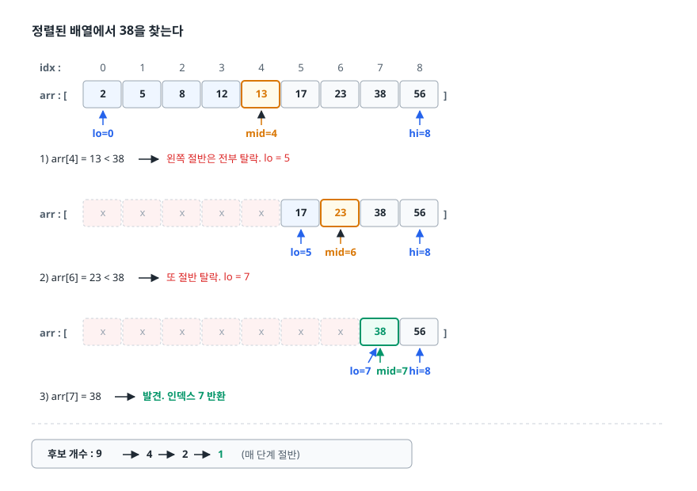
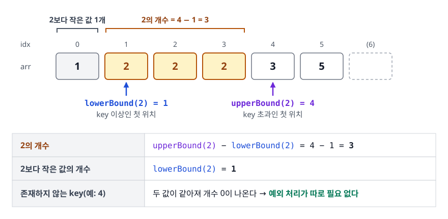
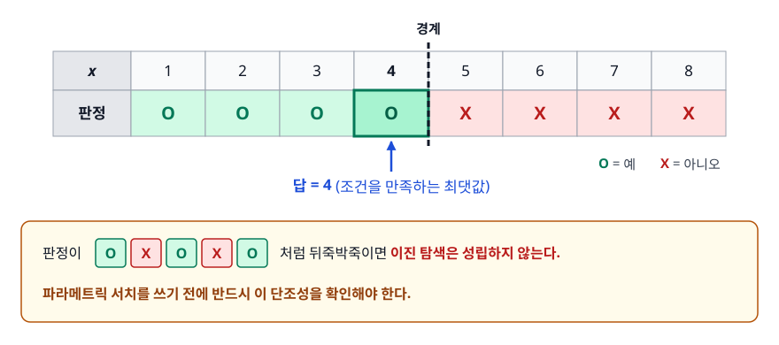
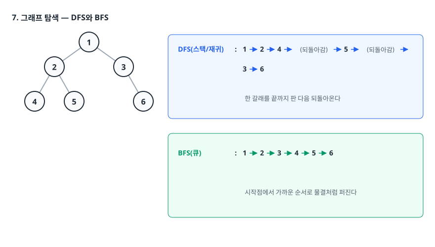
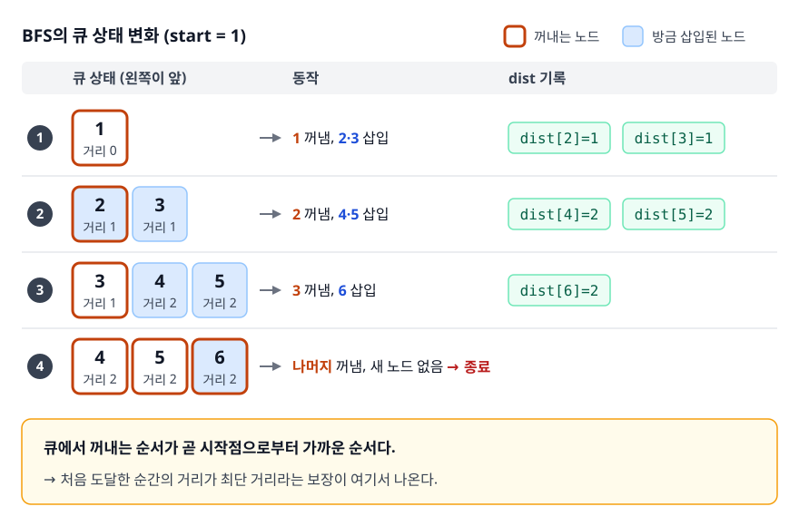
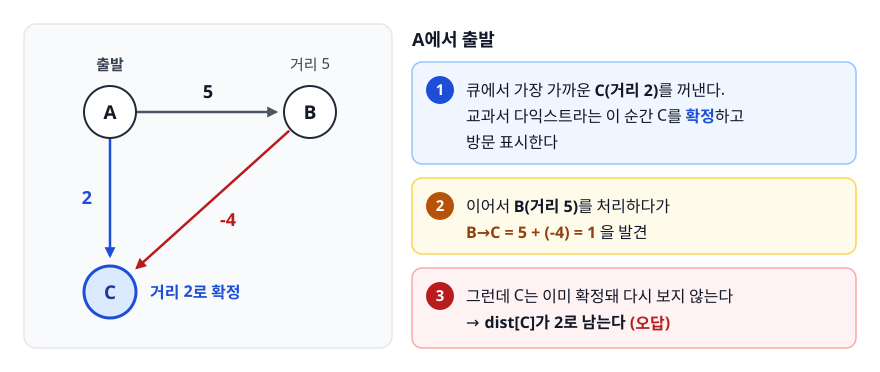

# 탐색 알고리즘 (Searching Algorithms)

> "찾는다"는 하나의 문제가 아니라, 데이터를 어떻게 배치해 뒀는지에 따라 완전히 다른 알고리즘이 되는 문제라는 것을 이해하게 됩니다.

## 학습 목표

- [ ] 이진 탐색의 전제 조건과 반복문 불변식(invariant)을 설명할 수 있다
- [ ] lower bound와 upper bound를 직접 구현하고 중복 값 개수를 셀 수 있다
- [ ] 파라메트릭 서치가 성립하는 조건(단조성)을 판단할 수 있다
- [ ] 해시 기반 탐색과 트리 기반 탐색의 트레이드오프를 설명할 수 있다
- [ ] DFS/BFS/다익스트라를 "탐색 범위를 어떤 순서로 넓히는가"의 차이로 설명할 수 있다

## 선행 지식

- [01-time-complexity.md](./01-time-complexity.md) - O(log n)이 무엇을 뜻하는지
- [02-sorting.md](./02-sorting.md) - 이진 탐색의 전제인 정렬

---

## 1. 왜 필요한가

"배열에서 값 찾기"는 반복문 한 줄이면 됩니다. 그런데도 탐색 알고리즘이 학문의 한 챕터를 차지하는 이유는, **탐색 비용이 데이터를 미리 어떻게 정리해 뒀는지에 대한 대가**이기 때문입니다.

- 아무 준비도 안 했다면 전부 뒤져봐야 합니다. O(n).
- 미리 정렬해 뒀다면 절반씩 버릴 수 있습니다. O(log n).
- 미리 해시 테이블에 넣어 뒀다면 계산 한 번으로 위치를 알 수 있습니다. 평균 O(1).

준비 비용과 탐색 비용은 서로 맞바꾸는 관계입니다. 한 번만 찾을 거라면 정렬(O(n log n))하고 이진 탐색(O(log n))하는 것보다 그냥 O(n)으로 훑는 게 빠릅니다. 반대로 100만 번 찾을 거라면 정렬 비용은 한 번뿐이므로 압도적으로 이득입니다. **탐색 알고리즘 선택은 "몇 번 찾을 것인가"에서 시작한다.**

> **비유** — 국어사전에서 단어를 찾을 때 첫 장부터 넘기지 않습니다. 가나다순이라는 사실을 알기 때문에 대충 중간을 펼치고 "찾는 단어가 앞이네" 하며 절반을 버립니다. 사전의 가나다순 배열이 곧 정렬이고, 이 판단이 곧 이진 탐색입니다.
> **비유의 한계** — 사람은 'ㅎ'으로 시작하면 뒤쪽을 펼치는 식으로 위치를 짐작합니다. 이건 이진 탐색이 아니라 값의 분포를 이용하는 보간 탐색에 가깝습니다. 이진 탐색은 값이 무엇이든 항상 정확히 가운데를 봅니다.

그리고 여기서 다루는 "탐색"은 배열에만 국한되지 않습니다. 미로에서 출구로 가는 경로를 찾는 것도, 지도에서 최단 경로를 찾는 것도 탐색입니다. **탐색 대상이 배열이면 이진 탐색, 그래프면 DFS/BFS/다익스트라**로 이름이 바뀔 뿐, "후보 공간을 어떤 순서로 줄여 나가는가"라는 질문은 같습니다.

---

## 2. 선형 탐색 (Linear Search)

처음부터 끝까지 하나씩 비교합니다. 시간 O(n), 공간 O(1).

무시하기 쉽지만 **전제 조건이 전혀 없다**는 것이 유일무이한 장점입니다. 정렬돼 있을 필요도, 임의 접근이 가능할 필요도 없습니다. 연결 리스트, 스트림, 파일 한 줄씩 읽기 같은 상황에서는 선택지가 이것뿐입니다.

선형 탐색이 오히려 정답인 경우도 있습니다. 원소 20개짜리 배열은 캐시에 통째로 올라가 순차 접근이 매우 빠르므로 이진 탐색의 인덱스 계산이 오히려 손해입니다. 탐색이 한 번뿐이면 정렬 비용 O(n log n)을 회수할 기회가 없고, 데이터가 계속 바뀌면 정렬 상태를 유지하는 비용이 탐색 이득을 넘어설 수 있습니다.

---

## 3. 이진 탐색 (Binary Search)

### 동작 원리

**정렬된** 배열에서 가운데 값을 보고 찾는 값이 어느 쪽에 있는지 판단해 나머지 절반을 통째로 버립니다.

<!-- diagram:cs-searching-1 -->


<!-- 위 그림이 대체한 원본 ASCII.
     내용을 고칠 때는 그림도 함께 갱신할 것.
```
정렬된 배열에서 38을 찾는다

 idx :    0    1    2    3    4    5    6    7    8
 arr : [  2    5    8   12   13   17   23   38   56 ]
          ↑                   ↑                   ↑
        lo=0               mid=4                hi=8
  1) arr[4] = 13 < 38  →  왼쪽 절반은 전부 탈락. lo = 5

 arr : [  x    x    x    x    x   17   23   38   56 ]
                                       ↑         ↑
                                  lo=5 mid=6    hi=8
  2) arr[6] = 23 < 38  →  또 절반 탈락. lo = 7

 arr : [  x    x    x    x    x    x    x   38   56 ]
                                            ↑    ↑
                                    lo=7 mid=7  hi=8
  3) arr[7] = 38 → 발견. 인덱스 7 반환

  후보 개수 : 9 → 4 → 2 → 1   (매 단계 절반)
```
-->

후보가 매 단계 절반이 되므로 n개를 1개로 줄이는 데 필요한 단계 수는 log₂n입니다. n이 10억이어도 30번이면 끝납니다. **입력이 10배로 늘어도 단계는 3~4번밖에 안 늘어난다**는 것이 O(log n)의 위력입니다.

### 두 가지 함정

**하나. 정렬은 전제 조건이지 결과가 아니다.** 정렬되지 않은 배열에 이진 탐색을 돌리면 오류가 나는 게 아니라 **조용히 틀린 답**을 냅니다. 있는 값을 없다고 하거나 엉뚱한 인덱스를 반환합니다. Java의 `Arrays.binarySearch` 문서도 "배열이 정렬돼 있지 않으면 결과는 정의되지 않는다"고 명시합니다.

**둘. 중간 인덱스 계산에서 오버플로가 난다.**

```java
int mid = (lo + hi) / 2;         // lo + hi 가 int 범위를 넘으면 음수가 된다
int mid = lo + (hi - lo) / 2;    // 항상 안전
```

`int`의 최댓값이 약 21억이므로 `lo + hi`가 이를 넘으려면 인덱스가 10억을 넘어야 합니다. 그만한 배열을 다룰 일은 드물어서 코딩 테스트에서는 잘 안 보이지만, 이진 탐색을 배열이 아닌 **값의 범위**에 적용하는 파라메트릭 서치(5장)에서는 lo와 hi가 10¹⁸까지 가는 일이 흔해서 현실적인 버그가 됩니다. 습관으로 후자를 씁니다.

---

## 4. 경계 찾기 — lower bound와 upper bound

### 왜 필요한가

기본 이진 탐색은 "값이 있는가"에는 답하지만 **중복 값 앞에서 무력하다.** `[1, 2, 2, 2, 3]`에서 2를 찾으면 인덱스 1, 2, 3 중 아무거나 반환됩니다. 구현에 따라 달라지므로 "2가 몇 개인가", "2가 처음 나오는 위치는 어디인가" 같은 질문에는 쓸 수 없습니다.

그래서 실무의 이진 탐색은 "값을 찾는다"가 아니라 **"조건이 바뀌는 경계를 찾는다"** 로 문제를 다시 정의합니다.

- **lower bound**: key **이상**인 값이 처음 나오는 위치
- **upper bound**: key **초과**인 값이 처음 나오는 위치

<!-- diagram:cs-searching-2 -->


<!-- 위 그림이 대체한 원본 ASCII.
     내용을 고칠 때는 그림도 함께 갱신할 것.
```
 idx :    0    1    2    3    4    5     (6)
 arr : [  1    2    2    2    3    5  ]
               ↑                   ↑
        lowerBound(2) = 1    upperBound(2) = 4

  2의 개수 = upperBound(2) - lowerBound(2) = 4 - 1 = 3
  2보다 작은 값의 개수 = lowerBound(2) = 1
  존재하지 않는 key(예: 4)면 두 값이 같아져 개수 0이 나온다 → 예외 처리가 따로 필요 없다
```
-->

### 구현

핵심은 **반열린 구간 [lo, hi)** 와 `lo < hi` 조건입니다. 기본 이진 탐색의 `lo <= hi`와 다릅니다.

```java
// key 이상인 첫 위치. 없으면 배열 길이를 반환한다.
static int lowerBound(int[] a, int key) {
    int lo = 0, hi = a.length;          // hi는 "끝 다음 칸"
    while (lo < hi) {
        int mid = lo + (hi - lo) / 2;
        if (a[mid] < key) lo = mid + 1; // mid는 확실히 답이 아니다 → 버린다
        else              hi = mid;     // mid는 답일 수도 있다 → 후보로 남긴다
    }
    return lo;
}

// key 초과인 첫 위치. 비교만 <= 로 바뀐다.
static int upperBound(int[] a, int key) {
    int lo = 0, hi = a.length;
    while (lo < hi) {
        int mid = lo + (hi - lo) / 2;
        if (a[mid] <= key) lo = mid + 1;
        else               hi = mid;
    }
    return lo;
}

static int countOf(int[] a, int key) {
    return upperBound(a, key) - lowerBound(a, key);
}
```

두 함수의 차이는 부등호 하나(`<` vs `<=`)뿐입니다. 외울 것은 이 구조입니다. **`lo`는 항상 "아직 답일 가능성이 있는 가장 왼쪽 후보"를 가리키고, 루프가 끝나 `lo == hi`가 되면 그 자리가 정답 경계다.** 이 불변식을 잡고 있으면 `mid + 1`인지 `mid`인지 헷갈리지 않습니다.

---

## 5. 파라메트릭 서치 (Parametric Search)

### 아이디어

배열이 아니라 **답의 범위**에 이진 탐색을 거는 기법입니다. 정확히는 문제를 바꿔치기합니다.

```
  최적화 문제 : "조건을 만족하는 최댓값 x는 얼마인가?"   ← 바로 풀기 어렵다
        ↓ 바꿔치기
  결정 문제   : "x일 때 조건을 만족하는가? (예/아니오)"  ← 계산하기 쉽다
```

결정 문제의 답이 **단조(monotonic)** 라면, 즉 어느 지점을 경계로 예/예/예/아니오/아니오처럼 한 번만 바뀐다면, 그 경계를 이진 탐색으로 찾을 수 있습니다.

<!-- diagram:cs-searching-3 -->


<!-- 위 그림이 대체한 원본 ASCII.
     내용을 고칠 때는 그림도 함께 갱신할 것.
```
  x  :  1    2    3    4    5    6    7    8
 판정:  O    O    O    O    X    X    X    X
                       ↑
                  답 = 4 (조건을 만족하는 최댓값)

  판정이  O X O X O 처럼 뒤죽박죽이면 이진 탐색은 성립하지 않는다.
  파라메트릭 서치를 쓰기 전에 반드시 이 단조성을 확인해야 한다.
```
-->

### 예제 — 랜선 자르기

길이가 제각각인 랜선 N개가 있습니다. 모두 같은 길이로 잘라 K개 이상을 만들려고 합니다. 만들 수 있는 최대 길이는?

길이를 1부터 하나씩 늘려 보면 O(최대 길이)라 답이 10⁹ 근처면 시간 초과입니다. 하지만 **"길이 x로 자르면 K개를 만들 수 있는가?"** 는 즉시 계산되고, x가 커질수록 개수는 단조 감소합니다.

```java
// x 길이로 잘랐을 때 만들 수 있는 개수가 k 이상인가?
static boolean canMake(long[] lines, long x, long k) {
    long count = 0;
    for (long len : lines) count += len / x;
    return count >= k;
}

static long maxLength(long[] lines, long k) {
    long lo = 1, hi = 0;
    for (long len : lines) hi = Math.max(hi, len);

    long answer = 0;
    while (lo <= hi) {
        long mid = lo + (hi - lo) / 2;
        if (canMake(lines, mid, k)) {
            answer = mid;      // 가능하니 기록해 두고
            lo = mid + 1;      // 더 길게 잘라 본다
        } else {
            hi = mid - 1;      // 너무 길다. 줄인다
        }
    }
    return answer;
}
```

전체 복잡도는 O(N log(최대 길이))다. 길이 범위가 10⁹이어도 판정 함수를 30번만 호출합니다.

파라메트릭 서치를 의심해야 하는 문제의 냄새가 있습니다. **"최댓값을 최소로", "최솟값을 최대로", "가능한 최대 크기"** 같은 표현이 나오고, 답의 범위가 넓은데 특정 값에 대한 검증은 쉬운 구조라면 거의 항상 이 기법입니다.

---

## 6. 해시 기반 탐색

정렬해서 절반씩 줄이는 대신, **키를 계산해 위치를 바로 알아내는** 접근입니다. 해시 함수가 키를 배열 인덱스로 변환하고, 그 칸을 직접 읽습니다. 비교 횟수가 입력 크기와 무관해서 평균 O(1)입니다.

대신 대가가 있습니다.

**최악은 O(1)이 아니다.** 서로 다른 키가 같은 인덱스로 매핑되는 충돌(collision)이 발생하고, 모든 키가 한 버킷에 몰리면 O(n)까지 떨어집니다. Java 8 이후 `HashMap`은 한 버킷의 항목이 많아지면 연결 리스트를 트리로 바꿔 최악을 O(log n)으로 낮췄습니다.

**순서 정보가 사라진다.** 이게 훨씬 중요한 제약입니다.

| 질문 | 해시 테이블 | 정렬 배열 + 이진 탐색 / 균형 트리 |
|------|-----------|--------------------------------|
| "키가 42인 항목?" | 평균 O(1) | O(log n) |
| "30 이상 50 이하인 항목 전부?" | **불가능** (전체 스캔 O(n)) | O(log n + 결과 개수) |
| "가장 작은 키?" | **불가능** (전체 스캔 O(n)) | O(log n) 이하 |
| "정렬된 순서로 순회" | **불가능** | O(n) |
| 최악 보장 | O(n) 또는 O(log n) | O(log n) |

표의 결론: **정확히 일치하는 키 하나만 찾으면 되면 해시, 범위·순서·정렬 순회가 필요하면 트리 계열이다.**

이 차이가 실제 시스템 설계를 가릅니다. 관계형 데이터베이스의 기본 인덱스가 해시가 아니라 B+Tree인 이유가 정확히 이것입니다. `WHERE id = 5`만 필요하면 해시가 더 빠르겠지만, 실제 쿼리에는 `BETWEEN`, `>`, `ORDER BY`, `LIKE 'abc%'`가 섞여 나옵니다. 이 모두를 하나의 인덱스로 처리하려면 순서가 보존돼야 합니다.

---

## 7. 그래프 탐색 — DFS와 BFS

배열에서는 후보가 일렬로 늘어서 있어 "절반 버리기"가 가능했습니다. 그래프에서는 그런 순서가 없습니다. 대신 **연결을 따라가며 방문할 곳을 넓혀 나간다.** 방문 순서를 무엇으로 정하느냐가 DFS와 BFS를 가릅니다.

<!-- diagram:cs-searching-4 -->


<!-- 위 그림이 대체한 원본 ASCII.
     내용을 고칠 때는 그림도 함께 갱신할 것.
```
        1
      /   \
     2     3
    / \     \
   4   5     6

 DFS(스택/재귀) : 1 → 2 → 4 → (되돌아감) → 5 → (되돌아감) → 3 → 6
                  한 갈래를 끝까지 판 다음 되돌아온다

 BFS(큐)        : 1 → 2 → 3 → 4 → 5 → 6
                  시작점에서 가까운 순서로 물결처럼 퍼진다
```
-->

<!-- diagram:cs-searching-5 -->


<!-- 위 그림이 대체한 원본 ASCII.
     내용을 고칠 때는 그림도 함께 갱신할 것.
```
 BFS의 큐 상태 변화 (start = 1)

   [1]          → 1 꺼냄, 2·3 삽입     dist[2]=1, dist[3]=1
   [2, 3]       → 2 꺼냄, 4·5 삽입     dist[4]=2, dist[5]=2
   [3, 4, 5]    → 3 꺼냄, 6 삽입       dist[6]=2
   [4, 5, 6]    → 나머지 꺼냄, 새 노드 없음 → 종료

   큐에서 꺼내는 순서가 곧 시작점으로부터 가까운 순서다.
   → 처음 도달한 순간의 거리가 최단 거리라는 보장이 여기서 나온다.
```
-->

```java
// 가중치 없는 그래프의 최단 거리
static int[] bfs(List<List<Integer>> graph, int start) {
    int n = graph.size();
    int[] dist = new int[n];
    Arrays.fill(dist, -1);                 // -1 = 아직 방문 안 함
    Deque<Integer> queue = new ArrayDeque<>();

    dist[start] = 0;
    queue.add(start);

    while (!queue.isEmpty()) {
        int cur = queue.poll();
        for (int next : graph.get(cur)) {
            if (dist[next] != -1) continue;
            dist[next] = dist[cur] + 1;
            queue.add(next);               // 큐에 "넣는 시점"에 방문 처리
        }
    }
    return dist;
}
```

**가장 흔한 BFS 버그는 방문 처리 시점이다.** 큐에서 꺼낼 때 방문 표시를 하면, 같은 노드가 여러 이웃을 통해 큐에 중복으로 들어갑니다. 정답이 틀리지는 않지만 큐 크기가 폭증해 메모리 초과나 시간 초과가 납니다. **넣는 시점에 표시**해야 합니다.

| 구분 | DFS | BFS |
|------|-----|-----|
| 자료구조 | 스택 (또는 재귀) | 큐 |
| 방문 순서 | 깊이 우선 | 시작점에서 가까운 순 |
| 공간 | 경로 길이에 비례 | 같은 레벨의 노드 수에 비례 |
| 최단 경로 | 보장 안 됨 | 보장 (모든 간선 비용이 같을 때) |
| 그래서 언제 | 모든 경로 열거, 백트래킹, 사이클 탐지, 위상 정렬 | 최소 이동 횟수, 레벨 단위 처리, 최단 경로 |

둘 다 시간 복잡도는 O(V + E)다. 모든 정점을 한 번씩 방문하고 모든 간선을 한 번씩 확인하기 때문입니다. 공간은 그래프 모양에 좌우됩니다. 일자로 긴 그래프는 DFS의 재귀 깊이가 위험하고, 옆으로 넓은 그래프는 BFS의 큐가 커집니다.

---

## 8. 다익스트라 — 가중치가 붙으면

BFS의 최단 경로 보장은 **모든 간선의 비용이 같다**는 가정 위에 있습니다. 큐에서 꺼내는 순서 = 거리 순서가 성립하기 때문입니다. 간선마다 비용이 다르면 이 등식이 깨집니다. 간선 3개를 거치는 경로(1+1+1=3)가 간선 1개짜리 경로(10)보다 짧을 수 있습니다.

해결책은 단순합니다. **큐를 우선순위 큐로 바꾼다.** "먼저 들어온 순서"가 아니라 "현재까지 알려진 거리가 가장 짧은 것"부터 꺼냅니다.

```java
// graph.get(u) = [{v, w}, ...] 형태의 인접 리스트
static long[] dijkstra(List<List<int[]>> graph, int start) {
    int n = graph.size();
    long[] dist = new long[n];
    Arrays.fill(dist, Long.MAX_VALUE);
    PriorityQueue<long[]> pq = new PriorityQueue<>((a, b) -> Long.compare(a[0], b[0]));

    dist[start] = 0;
    pq.add(new long[]{0, start});

    while (!pq.isEmpty()) {
        long[] cur = pq.poll();
        long d = cur[0];
        int u = (int) cur[1];
        if (d > dist[u]) continue;          // 이미 더 짧은 경로로 처리된 낡은 항목 → 폐기

        for (int[] e : graph.get(u)) {
            int v = e[0], w = e[1];
            if (dist[u] + w < dist[v]) {    // Relaxation (거리 완화)
                dist[v] = dist[u] + w;
                pq.add(new long[]{dist[v], v});
            }
        }
    }
    return dist;
}
```

우선순위 큐를 이진 힙으로 쓰면 O((V + E) log V)다. `if (d > dist[u]) continue;` 한 줄은 이미 갱신된 낡은 항목을 걸러내는 장치로, 이게 없으면 같은 정점을 여러 번 전부 펼쳐 느려집니다.

### 왜 음수 간선을 못 다루나

다익스트라는 그리디입니다. **"우선순위 큐에서 꺼낸 정점의 거리는 이미 최종 확정"** 이라는 가정 위에서 동작합니다. 앞으로 어떤 경로를 발견해도 더 짧아질 수 없다고 믿는 것입니다. 이 믿음은 "간선을 더 거치면 거리가 늘어나기만 한다", 즉 가중치가 음수가 아닐 때만 성립합니다.

<!-- diagram:cs-searching-6 -->


<!-- 위 그림이 대체한 원본 ASCII.
     내용을 고칠 때는 그림도 함께 갱신할 것.
```
          (5)
     A ─────────→ B
     │            │
     │(2)         │(-4)
     ↓            ↓
     C ←──────────┘

  A에서 출발:
   1) 큐에서 가장 가까운 C(거리 2)를 꺼낸다. 교과서 다익스트라는 이 순간 C를 확정하고 방문 표시한다
   2) 이어서 B(거리 5)를 처리하다가 B→C = 5 + (-4) = 1 을 발견
   3) 그런데 C는 이미 확정돼 다시 보지 않는다 → dist[C]가 2로 남는다 (오답)
```
-->

한 가지 짚어 둘 것이 있습니다. 위 코드처럼 정점을 꺼낼 때 방문 표시를 하지 않고 낡은 항목만 걸러내는 구현이라면, 이 예제에서는 C가 큐에 다시 들어가 dist[C]를 1로 고쳐 잡습니다. 그렇다고 음수 간선을 지원하게 된 것은 아닙니다. "꺼낸 정점은 확정"이라는 가정이 깨지는 순간 같은 정점이 몇 번이고 다시 큐에 들어갈 수 있어 정점 수에 비해 전개 횟수가 폭발하는 그래프를 만들 수 있고, 음수 사이클이 끼어 있으면 거리가 계속 줄어들어 아예 끝나지 않습니다. 결과가 맞는 것처럼 보여도 복잡도 보장이 사라진 상태입니다.

음수 간선이 있으면 벨만-포드를 씁니다. 모든 간선을 V-1번 반복 완화하는 방식이라 그리디 가정 자체가 없습니다. 대신 O(VE)로 느리고, V-1번 반복 후에도 완화가 일어나면 **음수 사이클**이 존재한다는 것까지 알아낼 수 있습니다.

| 알고리즘 | 그래프 조건 | 복잡도 | 그래서 언제 쓰나 |
|---------|-----------|--------|----------------|
| BFS | 모든 간선 비용이 같음 | O(V + E) | 미로 최소 이동 횟수 |
| 0-1 BFS (덱 사용) | 가중치가 0 또는 1 | O(V + E) | "벽 최소로 부수기" 유형 |
| 다익스트라 | 음수 간선 없음 | O((V + E) log V) | 일반적인 단일 시작점 최단 경로 |
| 벨만-포드 | 음수 간선 허용 | O(VE) | 음수 가중치, 음수 사이클 판정 |
| 플로이드-워셜 | 음수 간선 허용 (사이클 X) | O(V³) | 모든 정점 쌍, V가 수백 이하 |

표의 결론: **간선 비용이 전부 같으면 BFS로 충분하고(다익스트라를 쓰면 로그 배 손해), 음수가 없으면 다익스트라, 음수가 있으면 벨만-포드, 모든 쌍이 필요하고 V가 작으면 플로이드-워셜이다.**

---

## 9. 실무에서는

**데이터베이스 인덱스.** B+Tree 인덱스 탐색은 트리 높이만큼만 디스크 블록을 읽는 O(log n) 탐색입니다. 인덱스 없이 100만 행을 훑는 것과 20번 정도의 블록 접근은 응답 시간에서 초 단위와 밀리초 단위의 차이가 됩니다. 그리고 6장에서 본 이유로, 순서가 보존되기 때문에 범위 조회와 정렬까지 같은 인덱스로 처리합니다.

**git bisect.** 버그가 언제 들어왔는지 찾을 때 커밋을 하나씩 되짚지 않고 이진 탐색합니다. 커밋 1000개면 약 10번만 테스트하면 원인 커밋이 나옵니다. 여기서 배열은 커밋 목록이고, 정렬 조건은 "버그 없음/버그 있음"의 단조성입니다. 파라메트릭 서치와 정확히 같은 구조입니다.

**표준 라이브러리 API.** 직접 구현하기 전에 있는 걸 쓰는 게 낫습니다. 다만 반환값 규약이 언어마다 다릅니다.

```java
// Java: 못 찾으면 -(삽입 위치) - 1 을 반환한다
int r = Arrays.binarySearch(arr, key);
int insertionPoint = (r >= 0) ? r : -r - 1;
```

```python
# Python: bisect_left = lower bound, bisect_right = upper bound
from bisect import bisect_left, bisect_right
count = bisect_right(arr, key) - bisect_left(arr, key)
```

C++는 `std::lower_bound`, `std::upper_bound`, 둘을 한 번에 주는 `std::equal_range`가 있습니다. Java의 `Arrays.binarySearch`는 중복 값 중 어느 인덱스를 반환할지 정해져 있지 않으므로, 경계가 필요하면 4장처럼 직접 구현해야 합니다.

---

## 10. 면접 포인트

> 면접에서 이 주제가 나오면 이렇게 답한다

**Q. 이진 탐색의 전제 조건과 구현 시 주의점은?**
A. 배열이 정렬돼 있어야 하고 임의 접근이 O(1)이어야 합니다. 정렬돼 있지 않으면 오류가 아니라 조용히 틀린 답을 내기 때문에 더 위험합니다. 구현에서는 `(lo + hi) / 2`가 오버플로를 낼 수 있으므로 `lo + (hi - lo) / 2`로 쓰고, 종료 조건과 갱신 방식이 어긋나면 무한 루프에 빠지므로 "lo가 항상 답 후보의 왼쪽 경계"라는 불변식을 정해 놓고 작성합니다.
- 꼬리 질문: "정렬 비용까지 포함하면요?" → 한 번만 찾을 거면 정렬 O(n log n)이 더 비싸므로 그냥 O(n) 선형 탐색이 낫고, 여러 번 찾으면 정렬 비용을 분할 상환할 수 있다고 답합니다.

**Q. 정렬된 배열에서 특정 값의 개수를 O(log n)에 구하려면?**
A. lower bound와 upper bound를 각각 이진 탐색으로 구해 차이를 냅니다. lower bound는 key 이상인 첫 위치, upper bound는 key 초과인 첫 위치이고, 두 함수는 비교 부등호가 `<`냐 `<=`냐만 다릅니다. 값이 존재하지 않으면 두 값이 같아져 0이 나오므로 별도의 예외 처리도 필요 없습니다.
- 꼬리 질문: "라이브러리로는요?" → Python은 `bisect_left`/`bisect_right`, C++은 `lower_bound`/`upper_bound`가 그대로 대응된다고 답합니다.

**Q. 파라메트릭 서치란 무엇이고 언제 쓸 수 있나요?**
A. "조건을 만족하는 최댓값은?" 같은 최적화 문제를 "이 값에서 조건을 만족하는가?"라는 예/아니오 결정 문제로 바꾼 뒤, 그 답의 범위에 이진 탐색을 거는 기법입니다. 쓸 수 있는 조건은 결정 문제의 답이 단조여야 한다는 것입니다. 어느 지점을 경계로 예에서 아니오로 한 번만 바뀌어야 하며, 판정이 뒤죽박죽이면 성립하지 않습니다.
- 꼬리 질문: "복잡도는요?" → O(판정 함수 비용 × log(답의 범위))이고, 답의 범위가 10⁹여도 판정을 30번만 호출한다고 답합니다.

**Q. BFS와 다익스트라의 관계를 설명해 주세요.**
A. 다익스트라는 BFS를 가중치 그래프로 확장한 것입니다. BFS는 큐를 써서 먼저 들어온 순서로 꺼내는데, 모든 간선 비용이 같아야 그 순서가 거리 순서와 일치합니다. 간선 비용이 다르면 이 등식이 깨지므로 큐를 우선순위 큐로 바꿔 항상 현재까지 가장 가까운 정점부터 꺼내도록 한 것이 다익스트라입니다. 그래서 간선 비용이 모두 같은 문제에 다익스트라를 쓰면 결과는 맞지만 로그 배 손해입니다.
- 꼬리 질문: "음수 간선은 왜 안 되나요?" → 큐에서 꺼낸 정점의 거리가 최종 확정이라는 그리디 가정이 깨지기 때문이며, 이 경우 벨만-포드를 써야 한다고 답합니다.

**Q. 해시 인덱스 대신 B+Tree 인덱스를 쓰는 이유는?**
A. 해시는 단일 키 정확 일치 조회는 평균 O(1)로 더 빠르지만 순서 정보를 버립니다. 그래서 범위 조회, 정렬, 접두사 검색을 전혀 처리할 수 없습니다. 실제 쿼리에는 `BETWEEN`이나 `ORDER BY`가 섞여 나오기 때문에, 하나의 인덱스로 이를 모두 감당하려면 순서가 보존되는 트리 구조가 필요합니다.
- 꼬리 질문: "그럼 해시 인덱스는 언제 쓰나요?" → 등호 조회만 대량으로 발생하고 범위 조회가 없다는 게 확실한 경우로 한정됩니다.

---

## 자주 하는 실수

| 실수 | 왜 틀렸나 | 올바른 이해 |
|------|----------|-----------|
| 정렬 안 된 배열에 이진 탐색을 건다 | 예외가 아니라 조용히 틀린 답이 나온다 | 정렬은 결과가 아니라 전제. 반드시 먼저 확인 |
| `mid = (lo + hi) / 2` | lo+hi가 자료형 범위를 넘으면 음수가 된다 | `lo + (hi - lo) / 2` |
| 중복 값에서 기본 이진 탐색으로 첫 위치를 찾으려 함 | 어느 인덱스가 나올지 정해져 있지 않다 | lower bound로 경계를 찾는다 |
| BFS에서 큐에서 꺼낼 때 방문 처리 | 같은 노드가 큐에 중복으로 쌓인다 | 큐에 넣는 시점에 방문 표시 |
| 가중치가 다른 그래프에 BFS로 최단 경로 | BFS의 보장은 간선 비용이 모두 같을 때만 성립 | 다익스트라를 쓴다 |
| 음수 간선이 있는데 다익스트라 사용 | 확정된 정점을 다시 갱신하지 않아 오답 | 벨만-포드를 쓴다 |
| 다익스트라에서 낡은 큐 항목을 걸러내지 않음 | 같은 정점을 여러 번 전개해 느려진다 | `if (d > dist[u]) continue;` |
| "해시가 항상 O(1)이니 최고"라고 답한다 | 최악 O(n)이고 범위·정렬 질의가 불가능하다 | 요구 질의의 종류를 먼저 본다 |

---

## 한 줄 정리

탐색 알고리즘은 "정렬돼 있는가, 해시할 수 있는가, 간선 비용이 같은가" 같은 **전제 조건이 무엇인지**에 따라 결정되며, 그 전제를 만들어 두는 비용과 탐색을 몇 번 할 것인지를 저울질하는 것이 실전 판단입니다.

---

## 연관 개념

- [01-time-complexity.md](./01-time-complexity.md) - O(log n)의 의미와 입력 크기별 알고리즘 선택
- [02-sorting.md](./02-sorting.md) - 이진 탐색의 전제를 만드는 비용
- [qna-algorithm.md](./qna-algorithm.md) - 탐색 면접 질문 (Q3, Q4, Q13, Q15)
- [../data-structure/qna-data-structure.md](../data-structure/qna-data-structure.md) - 해시 테이블, 트리, 우선순위 큐의 내부 구조
