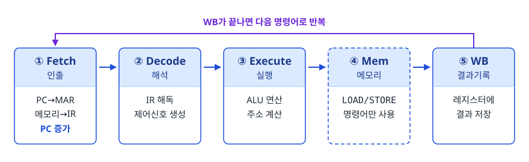
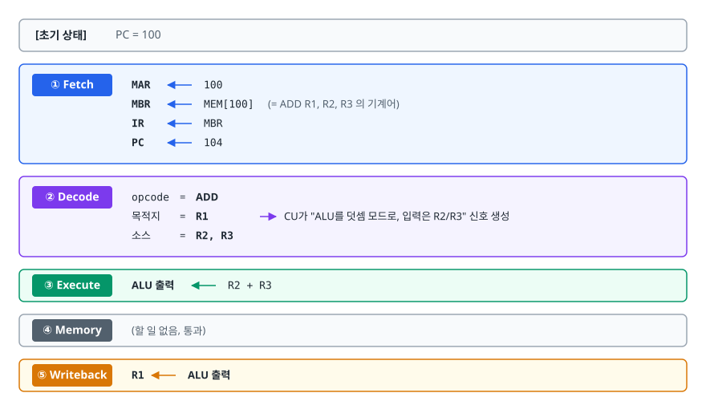
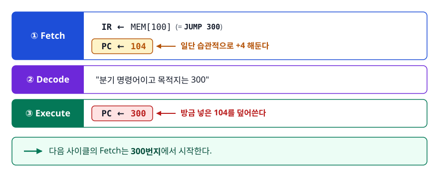
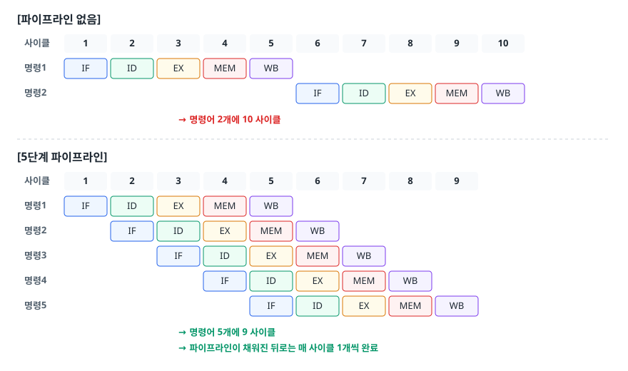
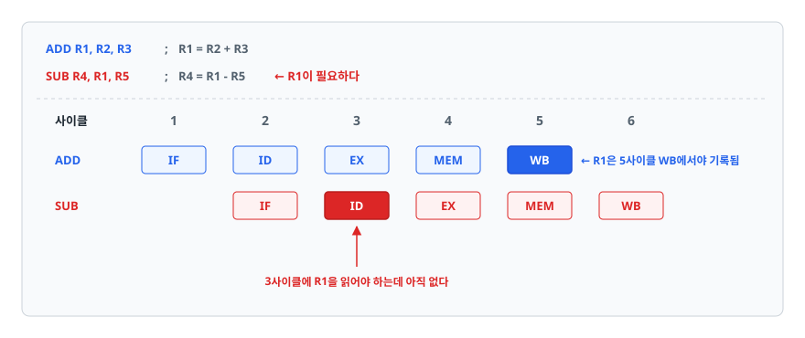

# CPU와 명령어 사이클 (CPU and Instruction Cycle)

> CPU가 "프로그램을 실행한다"는 말이 하드웨어 수준에서 정확히 무슨 일인지, 그리고 그 과정을 빠르게 만들려는 시도(파이프라인)가 왜 공짜가 아닌지 설명할 수 있게 됩니다.

## 학습 목표

- [ ] ALU·제어장치·레지스터가 각각 무엇을 담당하는지 구분할 수 있다
- [ ] 명령어 한 개가 Fetch → Decode → Execute → Memory → Writeback을 거치는 과정을 레지스터 단위로 추적할 수 있다
- [ ] 파이프라인이 지연 시간이 아니라 처리량을 높이는 기법이라는 것을 설명할 수 있다
- [ ] 데이터/제어/구조적 해저드를 구분하고 각각의 완화 기법을 말할 수 있다
- [ ] 클럭 속도만으로 CPU 성능을 비교하면 안 되는 이유를 IPC로 설명할 수 있다

## 선행 지식

없음 — 이 문서부터 시작해도 됩니다. 2진수와 메모리 주소 개념만 알면 충분합니다.

---

## 1. 왜 필요한가

컴퓨터가 처음부터 지금 같은 모습은 아니었습니다. 초창기 컴퓨터(ENIAC 등)는 계산 내용을 바꾸려면 케이블을 손으로 다시 꽂아야 했습니다. 계산기 한 대를 재배선하는 데 며칠이 걸렸습니다.

여기서 나온 발상이 **저장 프로그램 방식(stored-program)**, 흔히 말하는 **폰 노이만 구조(von Neumann architecture)**입니다. 핵심은 한 문장입니다.

> 프로그램(명령어)도 데이터와 똑같이 메모리에 숫자로 저장합니다.

이 결정이 모든 것을 바꿨습니다. 프로그램을 바꾸려면 메모리 내용만 바꾸면 됩니다. 대신 CPU에게는 새로운 임무가 생겼습니다. **메모리에서 명령어를 하나씩 꺼내 와서, 무슨 뜻인지 해석하고, 실행하고, 다음 명령어로 넘어가는 일을 끝없이 반복**해야 합니다. 이 반복 루프가 바로 **명령어 사이클(instruction cycle)**입니다.

CPU는 대단히 똑똑한 기계가 아니라, 아주 단순한 루프를 초당 수십억 번 돌리는 기계입니다. 우리가 짠 `for`문, 조건문, 함수 호출은 전부 이 루프 위에서 번역된 결과일 뿐입니다.

---

## 2. CPU의 3대 구성요소

### 정의

| 구성요소 | 하는 일 | 없으면 생기는 문제 |
|---------|--------|------------------|
| ALU (Arithmetic Logic Unit, 산술논리장치) | 덧셈·뺄셈 같은 산술 연산과 AND/OR/NOT/XOR 같은 논리 연산, 비교와 시프트를 실제로 수행 | 계산 자체를 못 한다 |
| CU (Control Unit, 제어장치) | 명령어를 해석해 "지금 ALU를 켜라", "메모리에서 읽어라" 같은 제어 신호를 만들어 뿌림 | 부품은 있는데 지휘자가 없어 아무 일도 일어나지 않는다 |
| 레지스터 (Register) | CPU 내부의 초고속 임시 저장소. 연산 대상과 결과, 다음 명령어 주소 등을 보관 | 매 연산마다 느린 메모리를 왕복해야 한다 |

이 셋은 CPU 내부의 배선(내부 버스)으로 이어져 있고, CPU와 메모리·입출력 장치 사이는 **시스템 버스(system bus)**로 연결됩니다. 시스템 버스는 역할에 따라 셋으로 나눠 생각합니다. 주소 버스(어디를 볼 것인가), 데이터 버스(실제 값), 제어 버스(읽기인가 쓰기인가).

**비유**: 주방으로 치면 ALU는 실제로 재료를 볶는 요리사, CU는 주문서를 읽고 "3번 화구 켜"라고 지시하는 주방장, 레지스터는 손이 바로 닿는 도마 위 그릇입니다. 창고(메모리)에 매번 갔다 오면 요리가 식습니다.

**비유의 한계**: 주방장은 스스로 판단하지만 CU는 판단하지 않습니다. 명령어 비트 패턴에 따라 정해진 제어 신호를 기계적으로 낼 뿐입니다. CPU에는 "생각"이 없습니다.

### 주요 레지스터

레지스터는 용도별로 이름이 붙어 있습니다. 면접에서 자주 묻는 것들만 정리합니다.

| 레지스터 | 저장하는 것 | 헷갈리기 쉬운 점 |
|---------|-----------|----------------|
| PC (Program Counter) | **다음에 실행할 명령어의 주소** | 명령어 자체가 아니라 "주소"다 |
| IR (Instruction Register) | **지금 실행 중인 명령어 그 자체** | PC와 짝을 이뤄 외우면 안 헷갈린다 |
| MAR (Memory Address Register) | 메모리에 접근할 때 쓸 주소 | PC 값이 여기로 복사된다 |
| MBR (Memory Buffer Register) | 메모리에서 읽어온/쓸 데이터 | MDR이라고도 부른다 |
| ACC (Accumulator) | 누산기. 연산 중간 결과 | 요즘 범용 레지스터 방식 CPU에서는 개념적 존재 |
| SP (Stack Pointer) | 현재 스택의 꼭대기 주소 | 함수 호출·복귀의 핵심 |

레지스터를 "메모리"라고 뭉뚱그려 말하면 감점 요인입니다. 레지스터는 CPU 다이 안에 있어 접근이 1 사이클 수준인 반면, 메인 메모리는 CPU 바깥의 별도 칩이고 수백 사이클이 걸립니다.

---

## 3. 명령어 사이클

### 동작 원리

명령어 한 개를 처리하는 과정은 보통 5단계로 나눕니다. 고전 교과서는 Fetch/Decode/Execute 3단계만 말하지만, 실제 파이프라인 설계는 메모리 접근과 결과 기록을 따로 뗍니다.

<!-- diagram:cs-cpu-instruction-cycle-1 -->


<!-- 위 그림이 대체한 원본 ASCII.
     내용을 고칠 때는 그림도 함께 갱신할 것.
```
        ┌──────────────────────────────────────────────┐
        │                                              │
        ▼                                              │
   ┌─────────┐   ┌─────────┐   ┌─────────┐   ┌─────────┐   ┌─────────┐
   │ ① Fetch │──▶│② Decode │──▶│③Execute │──▶│ ④ Mem   │──▶│  ⑤ WB   │
   │  인출    │   │  해석    │   │  실행    │   │ 메모리   │   │ 결과기록 │
   └─────────┘   └─────────┘   └─────────┘   └─────────┘   └─────────┘
    PC→MAR       IR 해독        ALU 연산      LOAD/STORE     레지스터에
    메모리→IR     제어신호 생성   주소 계산      만 사용        결과 저장
    PC 증가
```
-->

각 단계에서 벌어지는 일을 레지스터 수준으로 보면 이렇습니다.

**① Fetch (인출)**
1. PC가 가진 주소를 MAR로 복사합니다.
2. 주소 버스로 그 주소를 보내고 메모리가 돌려준 값을 MBR에 담습니다.
3. MBR의 내용을 IR로 옮깁니다. 이제 IR에 "실행할 명령어"가 들어 있습니다.
4. PC를 다음 명령어 주소로 증가시킵니다. 명령어 길이가 4바이트면 `PC = PC + 4`입니다.

PC 증가가 **Fetch 단계에서 미리 일어난다**는 점이 중요합니다. 나중에 분기 명령어를 이해할 때 이 순서가 열쇠가 됩니다.

**② Decode (해석)**
CU가 IR의 비트 패턴을 뜯어봅니다. 앞쪽 비트는 **opcode**(무슨 연산인가), 뒤쪽은 **operand**(어떤 레지스터/주소를 쓰는가)입니다. 이걸 보고 어떤 회로에 신호를 줄지 결정합니다.

**③ Execute (실행)**
ALU가 실제 연산을 합니다. `LOAD`/`STORE` 명령어라면 여기서 접근할 메모리 주소를 계산합니다.

**④ Memory Access**
메모리를 실제로 읽거나 씁니다. `ADD` 같은 레지스터 연산은 이 단계에서 할 일이 없어 그냥 통과합니다.

**⑤ Writeback**
결과를 목적지 레지스터에 기록합니다.

### 코드로 보기

`ADD R1, R2, R3` (R1 = R2 + R3) 한 줄이 주소 100번지에 있다고 합시다. 명령어 길이는 4바이트입니다.

<!-- diagram:cs-cpu-instruction-cycle-2 -->


<!-- 위 그림이 대체한 원본 ASCII.
     내용을 고칠 때는 그림도 함께 갱신할 것.
```
[초기 상태]  PC = 100

① Fetch     MAR ← 100
            MBR ← MEM[100]  (= ADD R1, R2, R3 의 기계어)
            IR  ← MBR
            PC  ← 104

② Decode    opcode  = ADD
            목적지   = R1
            소스     = R2, R3
            → CU가 "ALU를 덧셈 모드로, 입력은 R2/R3" 신호 생성

③ Execute   ALU 출력 ← R2 + R3

④ Memory    (할 일 없음, 통과)

⑤ Writeback R1 ← ALU 출력
```
-->

이번엔 `JUMP 300`입니다. 여기서 PC와 IR의 역할 차이가 극적으로 드러납니다.

<!-- diagram:cs-cpu-instruction-cycle-3 -->


<!-- 위 그림이 대체한 원본 ASCII.
     내용을 고칠 때는 그림도 함께 갱신할 것.
```
① Fetch     IR ← MEM[100] (= JUMP 300)
            PC ← 104        ← 일단 습관적으로 +4 해둔다

② Decode    "분기 명령어이고 목적지는 300"

③ Execute   PC ← 300        ← 방금 넣은 104를 덮어쓴다

다음 사이클의 Fetch는 300번지에서 시작한다.
```
-->

Fetch에서 무심코 올려둔 PC를 Execute에서 되돌리는 이 구조가, 뒤에서 볼 **제어 해저드**의 원인입니다.

### 흔한 오해

> "명령어 하나 = 클럭 하나"

아닙니다. 각 단계마다 최소 한 사이클씩 쓰이는 게 보통이고 메모리 접근이 끼면 훨씬 길어집니다. RISC 설계가 목표로 하는 "1 사이클에 1 명령어"는 **파이프라인이 꽉 찼을 때의 처리량**이지, 명령어 하나가 1 사이클에 끝난다는 뜻이 아닙니다.

---

## 4. 파이프라인

### 왜 필요한가

위 5단계를 순서대로만 처리하면 심각한 낭비가 생깁니다. Fetch가 진행되는 동안 ALU는 놀고 있고, Execute 중에는 명령어 인출 회로가 놀고 있습니다. 회로를 5개나 만들어 놓고 한 번에 하나만 쓰는 셈입니다.

**비유**: 빨래방에 세탁기·건조기·다림질대가 있는데, 첫 번째 빨래를 다림질할 때까지 두 번째 빨래를 세탁기에 넣지 않는 것과 같습니다. 첫 빨래가 건조기로 넘어가는 순간 세탁기는 비니까, 그때 다음 빨래를 넣으면 됩니다.

**비유의 한계**: 빨래는 서로 독립적이지만 명령어는 앞 명령어의 결과에 의존하는 경우가 많습니다. 그래서 해저드가 생깁니다.

### 동작 원리

<!-- diagram:cs-cpu-instruction-cycle-4 -->


<!-- 위 그림이 대체한 원본 ASCII.
     내용을 고칠 때는 그림도 함께 갱신할 것.
```
[파이프라인 없음]
사이클  1    2    3    4    5    6    7    8    9   10
명령1  IF   ID   EX   MEM  WB
명령2                      IF   ID   EX   MEM  WB
                → 명령어 2개에 10 사이클

[5단계 파이프라인]
사이클  1    2    3    4    5    6    7    8    9
명령1  IF   ID   EX   MEM  WB
명령2       IF   ID   EX   MEM  WB
명령3            IF   ID   EX   MEM  WB
명령4                 IF   ID   EX   MEM  WB
명령5                      IF   ID   EX   MEM  WB
                → 명령어 5개에 9 사이클
                → 파이프라인이 채워진 뒤로는 매 사이클 1개씩 완료
```
-->

여기서 반드시 짚고 갈 것이 있습니다. **명령어 하나가 처리되는 시간(latency)은 여전히 5 사이클로 똑같습니다.** 줄어든 것은 없습니다. 오히려 단계 사이에 값을 저장할 래치가 추가되어 아주 조금 늘어납니다.

파이프라인이 개선하는 것은 **처리량(throughput)**, 즉 단위 시간당 완료되는 명령어 수입니다. 이 구분을 정확히 말하는 것만으로도 면접에서 차이가 납니다.

---

## 5. 파이프라인 해저드

이상적으로는 매 사이클 1개씩 나와야 하는데, 현실에서는 파이프라인이 멈추거나 비워집니다. 원인은 세 가지입니다.

### 데이터 해저드 (Data Hazard)

앞 명령어의 결과를 뒤 명령어가 필요로 하는데, 아직 준비되지 않은 상황입니다.

<!-- diagram:cs-cpu-instruction-cycle-5 -->


<!-- 위 그림이 대체한 원본 ASCII.
     내용을 고칠 때는 그림도 함께 갱신할 것.
```
ADD R1, R2, R3    ; R1 = R2 + R3
SUB R4, R1, R5    ; R4 = R1 - R5   ← R1이 필요하다

사이클   1    2    3    4    5    6
ADD     IF   ID   EX   MEM  WB          ← R1은 5사이클 WB에서야 기록됨
SUB          IF   ID   EX   MEM  WB
                  ↑
                  3사이클에 R1을 읽어야 하는데 아직 없다
```
-->

**해결 1 — 포워딩(Forwarding, 우회 전달)**: R1의 값은 사실 3사이클 ALU 출력에 이미 존재합니다. 레지스터에 기록될 때까지 기다리지 말고 ALU 출력을 다음 명령어의 ALU 입력으로 직접 배선해 넘겨줍니다. 대부분의 데이터 해저드가 이걸로 해결됩니다.

**해결 2 — 스톨(Stall, 버블 삽입)**: 포워딩으로도 안 되는 경우가 있습니다. `LOAD` 직후 그 값을 쓰는 경우입니다. 메모리 값은 4단계(MEM)에서야 나오는데 다음 명령어는 3단계(EX)에서 필요로 하니 시간을 거스를 수 없습니다. 이때는 파이프라인을 한 사이클 멈춥니다(`load-use hazard`).

### 제어 해저드 (Control Hazard)

분기 명령어를 만나면 다음에 뭘 Fetch해야 할지 모릅니다. 앞에서 본 `JUMP 300`을 떠올려 봅시다. 분기 목적지는 Execute 단계에서야 확정되는데, 그 사이 파이프라인은 이미 다음 명령어들을 Fetch해 넣고 있습니다. 예측이 틀리면 잘못 들어온 명령어들을 전부 무효화(**flush**)해야 합니다.

**해결 — 분기 예측(Branch Prediction)**: "이 분기는 지난번에 참이었으니 이번에도 참일 것"처럼 과거 이력을 기록해 예측합니다. 현대 CPU의 분기 예측 적중률은 매우 높지만, 틀리면 이미 진행 중이던 명령어를 전부 버려야 해서 파이프라인 깊이에 비례하는 사이클이 날아갑니다. 요즘 고성능 코어는 파이프라인이 십수 단계에 이르므로 예측 실패 한 번의 대가가 작지 않습니다.

### 구조적 해저드 (Structural Hazard)

하드웨어 자원이 부족해서 두 단계가 동시에 같은 것을 쓰려는 경우입니다. 대표적으로 Fetch(명령어 읽기)와 Memory(데이터 읽기)가 같은 메모리 포트를 요구하는 상황입니다.

**해결 — 자원 복제**: 명령어 캐시(I-cache)와 데이터 캐시(D-cache)를 물리적으로 분리합니다. 이렇게 명령어와 데이터 경로를 나눈 구조를 **하버드 구조(Harvard architecture)**라고 하며, 현대 CPU는 L1에서 이 방식을 씁니다.

| 해저드 | 원인 | 주된 해결책 | 남는 비용 |
|--------|------|-----------|----------|
| 데이터 | 앞 명령어 결과 미완성 | 포워딩, 스톨 | load-use 시 1 사이클 |
| 제어 | 분기 목적지 미확정 | 분기 예측, 투기적 실행 | 예측 실패 시 파이프라인 전체 flush |
| 구조적 | 하드웨어 자원 경합 | 자원 복제(I/D 캐시 분리) | 칩 면적 증가 |

**언제 뭘 신경 쓰나**: 애플리케이션 개발자가 직접 손댈 수 있는 건 사실상 제어 해저드뿐입니다. 조건 분기를 예측 가능하게 만들거나 분기 자체를 없애는 것(분기 없는 코드, lookup table)이 유일하게 코드 레벨에서 통하는 수단입니다.

---

## 6. 클럭과 IPC

CPU 성능을 한 줄로 쓰면 이렇습니다.

```
프로그램 실행 시간 = (명령어 수) × (명령어당 사이클, CPI) × (사이클 1개의 시간)

                                     명령어 수
처리 속도 ∝ 클럭 주파수 × IPC ,   IPC = ─────────
                                     총 사이클 수
```

- **클럭 주파수(GHz)**: 초당 사이클 수. 3GHz는 초당 30억 사이클입니다.
- **IPC (Instructions Per Cycle)**: 한 사이클에 완료되는 명령어 수. CPI의 역수입니다. 파이프라인·**슈퍼스칼라(superscalar, 실행 유닛을 여러 개 두어 한 사이클에 여러 명령어 발행)**·**비순차 실행(out-of-order execution)**·분기 예측이 모두 IPC를 올리기 위한 기술입니다.

2000년대 초까지는 클럭 경쟁이 치열했습니다. 그런데 어느 순간 멈췄습니다. 이유는 전력입니다. CPU의 동적 소비 전력은 대략 `P ∝ C × V² × f`에 비례하는데, 주파수 `f`를 올리려면 안정 동작을 위해 전압 `V`도 올려야 하므로 전력은 거의 세제곱으로 뜁니다. 발열이 감당이 안 되는 지점, 이것이 **주파수 장벽(frequency wall)**입니다.

그래서 업계는 방향을 틀었습니다. 클럭 대신 **IPC를 올리고 코어를 늘리는** 쪽으로. "3.0GHz CPU가 3.5GHz CPU보다 빠를 수도 있다"는 말이 성립하는 이유가 여기 있습니다. 세대가 다르면 IPC가 다릅니다.

**코어를 늘리면 무조건 빨라지나?** 그렇지 않습니다. **암달의 법칙(Amdahl's Law)**이 상한을 정합니다.

```
             1
Speedup = ─────────────      P: 병렬화 가능한 비율, N: 코어 수
          (1-P) + P/N
```

P = 0.9(90% 병렬화 가능)라면 코어를 무한히 늘려도 최대 10배까지입니다. 나머지 10%의 직렬 구간이 천장이 됩니다. 여기에 락 경합, 컨텍스트 스위칭, 메모리 대역폭 한계까지 더해지면 실제 이득은 더 줄어듭니다. **성능 최적화의 핵심은 "코어를 더 쓰자"가 아니라 "직렬 구간을 줄이자"**입니다.

---

## 7. 실무에서는

**분기 예측이 눈에 보이는 순간.** 아래 두 코드는 하는 일이 같지만, 배열이 정렬되어 있을 때 눈에 띄게 빠릅니다.

```java
int[] data = new int[32768];
// ... 0~255 사이 난수로 채운다

// Arrays.sort(data);  ← 이 한 줄을 켜고 끄는 것만으로 실행 시간이 달라진다

long sum = 0;
for (int i = 0; i < 100000; i++) {
    for (int v : data) {
        if (v >= 128) {   // 정렬돼 있으면 이 분기가 "계속 거짓 → 계속 참"으로 규칙적
            sum += v;
        }
    }
}
```

정렬되지 않은 배열에서는 `v >= 128`이 사실상 동전 던지기라 분기 예측이 절반쯤 틀립니다. 매번 파이프라인을 비우니 느려집니다. 정렬하면 예측이 거의 다 맞습니다. **"알고리즘 복잡도가 같은데 왜 성능이 다르냐"는 질문의 답이 하드웨어에 있는 대표 사례**입니다.

**JIT 컴파일러와의 관계.** JVM의 HotSpot JIT은 실행 중 수집한 프로파일로 자주 타는 분기를 앞쪽에 배치하고 안 타는 경로는 아예 컴파일에서 빼버립니다(uncommon trap). 인터프리터보다 JIT 코드가 빠른 이유의 상당 부분이 분기 예측·파이프라인 친화적인 코드 배치입니다.

**스레드 풀 크기.** 앞의 암달의 법칙이 그대로 적용됩니다. CPU 집약적 작업은 코어 수 근처가 적정선이고, 그 이상 늘리면 컨텍스트 스위칭과 캐시 무효화 비용만 늘어납니다. I/O 대기가 긴 작업은 대기 중 다른 스레드가 CPU를 쓸 수 있으니 더 늘려도 되지만, 이때도 DB 커넥션 풀 같은 직렬 자원이 실질적 상한이 됩니다.

---

## 8. 면접 포인트

> 면접에서 이 주제가 나오면 이렇게 답합니다

**Q. 파이프라이닝이 무엇이고 왜 성능이 좋아지나요?**
A. 명령어 처리를 Fetch/Decode/Execute/Memory/Writeback 같은 단계로 쪼개고, 서로 다른 명령어가 각 단계를 동시에 점유하도록 겹쳐서 실행하는 기법입니다. 중요한 건 명령어 하나가 처리되는 지연 시간은 그대로이고 **단위 시간당 완료되는 명령어 수, 즉 처리량이 늘어난다**는 점입니다. 유휴 상태로 놀던 회로를 계속 일하게 만드는 것이 본질입니다.
- 꼬리 질문: "그럼 단계를 100개로 쪼개면 100배 빨라지나요?" → 아닙니다. 단계 사이 래치 오버헤드가 커지고, 무엇보다 분기 예측이 틀렸을 때 버려야 하는 사이클이 파이프라인 깊이에 비례해 늘어납니다. 깊은 파이프라인은 예측 실패 페널티가 커서 오히려 손해가 날 수 있습니다.

**Q. PC와 IR의 차이는 무엇인가요?**
A. PC는 **다음에 실행할 명령어의 주소**를 담고, IR은 **지금 실행 중인 명령어 자체**를 담습니다. Fetch 단계에서 PC가 가리키는 주소의 명령어를 읽어 IR에 넣고 PC를 증가시킵니다. `JUMP` 같은 분기 명령어는 Execute 단계에서 PC를 목적지 주소로 덮어쓰는 방식으로 동작합니다.
- 꼬리 질문: "분기 시 파이프라인에서 무슨 일이 생기나요?" → PC가 확정되기 전에 이미 다음 명령어들을 Fetch해 둔 상태이므로, 예측이 틀리면 그 명령어들을 전부 무효화(flush)해야 합니다. 이것이 제어 해저드입니다.

**Q. 클럭 속도가 높은 CPU가 항상 빠른가요?**
A. 아닙니다. 성능은 대략 `클럭 × IPC × 코어 수`로 결정되는데, 세대가 다르면 IPC가 크게 다릅니다. 비순차 실행, 슈퍼스칼라, 분기 예측 같은 마이크로아키텍처 개선으로 같은 클럭에서 더 많은 명령어를 처리할 수 있습니다. 게다가 전력이 주파수의 세제곱 가까이 증가해 클럭을 무한정 올릴 수 없기 때문에, 2000년대 중반 이후 업계는 클럭 대신 IPC와 코어 수로 방향을 틀었습니다.
- 꼬리 질문: "그럼 코어를 늘리면 되지 않나요?" → 암달의 법칙 때문에 직렬 구간이 상한을 만듭니다. 90%만 병렬화 가능하면 코어가 무한해도 최대 10배입니다.

**Q. 애플리케이션 개발자가 CPU 구조를 알아야 하는 이유는?**
A. 알고리즘 복잡도가 같은데 실측 성능이 몇 배씩 차이 나는 경우가 있는데 그 원인이 대부분 하드웨어 계층에 있기 때문입니다. 예측 불가능한 분기, 캐시 미스를 유발하는 메모리 접근 패턴, 락 경합으로 인한 직렬화가 대표적입니다. 프로파일링 결과를 해석하고 개선 방향을 잡으려면 이 계층을 알아야 합니다.

---

## 자주 하는 실수

| 실수 | 왜 틀렸나 | 올바른 이해 |
|------|----------|-----------|
| "PC는 현재 명령어를 저장한다" | PC는 주소만 담는다 | PC = 다음 명령어의 **주소**, IR = 현재 명령어 **본체** |
| "파이프라인은 명령어 하나를 빠르게 만든다" | 개별 지연 시간은 그대로거나 미세하게 늘어난다 | 파이프라인은 **처리량(throughput)** 개선 기법 |
| "RISC는 모든 명령어가 1 사이클" | 파이프라인이 꽉 찼을 때의 평균 처리량 얘기다 | 명령어 하나의 지연 시간은 여러 사이클 |
| "레지스터도 결국 메모리 아닌가" | 물리적 위치와 접근 비용이 근본적으로 다르다 | 레지스터는 CPU 다이 내부, 메인 메모리는 수백 배 느린 외부 칩 |
| "코어 수 2배 = 성능 2배" | 직렬 구간과 동기화 비용을 무시한 계산 | 암달의 법칙이 상한을 정한다 |
| "GHz가 높으면 무조건 빠른 CPU" | IPC와 코어 수를 빼먹은 비교 | 성능 ≈ 클럭 × IPC × 코어 수 × 효율 |

---

## 한 줄 정리

CPU는 메모리에서 명령어를 꺼내 해석하고 실행하는 단순한 루프를 초당 수십억 번 도는 기계이며, 그 루프를 겹쳐 돌려 처리량을 높인 것이 파이프라인, 겹칠 수 없게 만드는 방해 요소가 해저드입니다.

---

## 연관 개념

- [02-cache-memory.md](./02-cache-memory.md) - Fetch 단계에서 메모리 대기를 줄이는 캐시의 원리
- [04-error-detection-risc-cisc.md](./04-error-detection-risc-cisc.md) - 명령어 세트 설계 철학이 파이프라인 설계에 미치는 영향
- [qna-computer-architecture.md](./qna-computer-architecture.md) - 이 주제 면접 질문
- [컨텍스트 스위칭](../operating-system/03-context-switching.md) - 레지스터 상태 저장/복원이 실제로 얼마나 비싼지
- [프로세스와 스레드](../operating-system/01-process-thread.md) - 코어 수와 스레드 수의 관계
