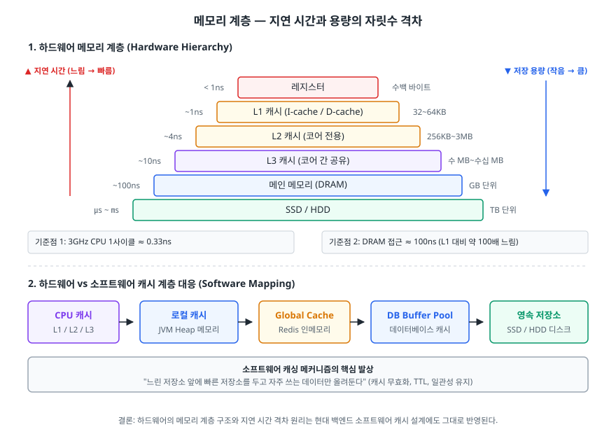
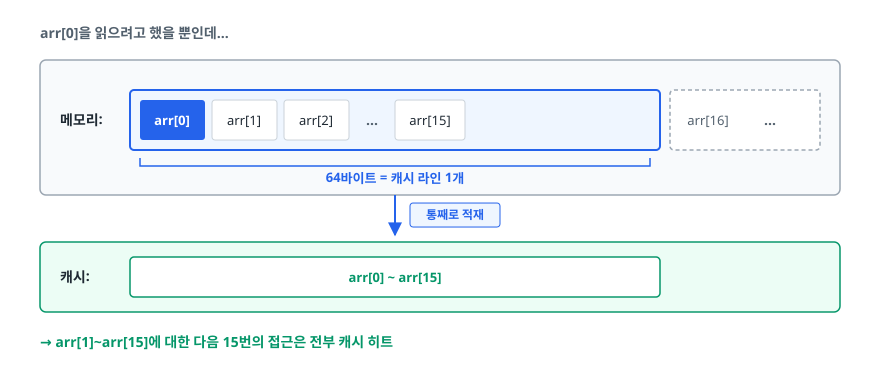
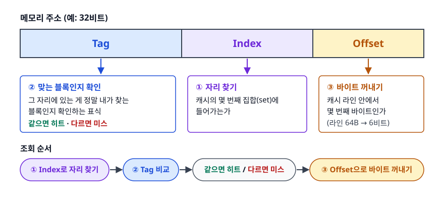
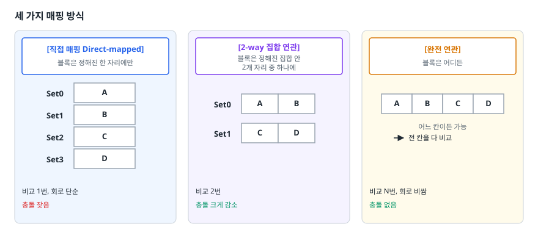
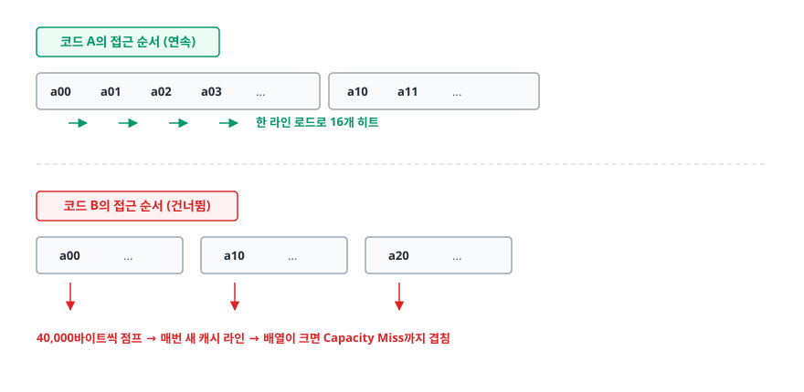
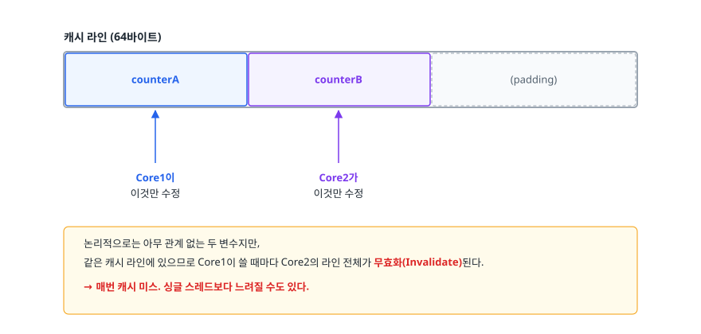

# 캐시 메모리와 메모리 계층 (Cache Memory & Memory Hierarchy)

> 이 문서를 마치면, 같은 시간 복잡도의 코드가 실측에서 몇 배씩 갈리는 이유와 CPU 옆에 작고 비싼 메모리를 굳이 여러 층으로 쌓아 두는 이유를 캐시로 설명할 수 있게 됩니다.

## 학습 목표

- [ ] 메모리 계층 구조가 속도·용량·비용의 타협 결과라는 것을 설명할 수 있다
- [ ] 시간적 지역성과 공간적 지역성을 구분하고 각각의 코드 예시를 들 수 있다
- [ ] 직접 매핑 / 집합 연관 / 완전 연관 매핑의 트레이드오프를 말할 수 있다
- [ ] 캐시 미스 3종류(Cold/Conflict/Capacity)를 원인별로 구분하고 대응책을 제시할 수 있다
- [ ] 자기 코드의 메모리 접근 패턴을 캐시 관점에서 평가하고 개선할 수 있다

## 선행 지식

- [01-cpu-instruction-cycle.md](./01-cpu-instruction-cycle.md) - 명령어 사이클의 Fetch/Memory 단계를 알면 캐시가 왜 그 자리에 있는지 이해하기 쉽습니다

---

## 1. 왜 필요한가

CPU는 빨라졌는데 메모리는 그만큼 빨라지지 못했습니다. 이 격차가 컴퓨터 구조 전체를 지배하는 문제입니다.

대략 감을 잡아 봅시다. 3GHz CPU의 한 사이클은 약 0.33ns입니다. 그런데 DRAM 접근은 대략 100ns 안팎입니다. **CPU 사이클 기준으로 300번쯤 놀아야 데이터가 도착합니다.** 이걸 그대로 두면 CPU가 아무리 빨라도 대부분의 시간을 대기로 소모합니다. 이 현상을 **메모리 장벽(memory wall)**이라 부릅니다.

그러면 메모리를 전부 SRAM처럼 빠른 소자로 바꾸면 되지 않을까요? 안 됩니다. SRAM은 비트 하나에 트랜지스터가 6개쯤 필요해서 밀도가 낮고 비싸며 전력도 많이 먹습니다. DRAM은 트랜지스터 1개와 커패시터 1개로 비트를 저장하므로 훨씬 싸고 조밀하지만 느립니다. 16GB를 전부 SRAM으로 만들면 가격과 칩 면적이 감당이 안 됩니다.

그래서 나온 절충이 **계층 구조**입니다. 빠르고 작고 비싼 것을 CPU 가까이, 느리고 크고 싼 것을 멀리 둡니다. 그리고 지금 당장 쓸 데이터만 위쪽으로 끌어올립니다.

**비유**: 책상 위(레지스터) → 책상 옆 책꽂이(L1/L2) → 방 안 책장(L3/DRAM) → 도서관(SSD). 지금 읽는 책만 책상에 올려두고, 다 보면 책꽂이로 돌려보냅니다.

**비유의 한계**: 사람은 무슨 책이 필요할지 스스로 판단합니다. 하지만 캐시는 미래를 모릅니다. "최근에 쓴 것과 그 근처가 또 쓰일 것"이라는 통계적 가정에만 의존합니다. 이 가정이 깨지는 코드에서는 캐시가 거의 무용지물이 됩니다.

---

## 2. 메모리 계층 구조

<!-- diagram:arch-memory-hierarchy -->


```
                     ▲ 빠름 / 작음 / 비쌈
        ┌────────────┴────────────┐
        │        레지스터           │   < 1ns      수백 바이트
        ├─────────────────────────┤
        │   L1 캐시 (코어 전용)      │   ~1ns       32~64KB
        │   I-cache / D-cache 분리  │
        ├─────────────────────────┤
        │   L2 캐시 (코어 전용)      │   ~4ns       256KB~1MB
        ├─────────────────────────┤
        │   L3 캐시 (코어 간 공유)    │   ~10ns      수 MB~수십 MB
        ├─────────────────────────┤
        │   메인 메모리 (DRAM)       │   ~100ns     GB 단위
        ├─────────────────────────┤
        │        SSD / HDD         │   ㎲ ~ ㎳     TB 단위
        └────────────┬────────────┘
                     ▼ 느림 / 큼 / 쌈
```

숫자는 제품마다 다르지만 **자릿수의 감각**이 중요합니다. L1 대비 DRAM은 약 100배, DRAM 대비 SSD는 또 수백 배 느립니다.

이 계층은 하드웨어에서 끝나지 않습니다. 백엔드 시스템도 똑같은 구조를 소프트웨어로 반복합니다.

```
CPU L1/L2/L3  →  애플리케이션 로컬 캐시(JVM Heap)  →  Redis  →  DB Buffer Pool  →  디스크
```

"느린 저장소 앞에 빠른 저장소를 두고 자주 쓰는 것만 올려둔다"는 발상은 동일합니다. 캐시 무효화 전략, TTL, 일관성 문제도 마찬가지입니다. 계층만 다를 뿐 같은 고민이 반복됩니다.

---

## 3. 지역성 원리

캐시가 통하는 이유는 순전히 **프로그램이 메모리를 무작위로 접근하지 않기 때문**입니다. 이 경향성을 지역성(locality)이라 합니다.

### 시간적 지역성 (Temporal Locality)

최근 접근한 데이터를 가까운 미래에 또 접근할 가능성이 높습니다.

```java
int sum = 0;
for (int i = 0; i < 1000; i++) {
    sum += arr[i];   // sum, i는 1000번 내내 반복 접근된다
}
```

`sum`과 `i`는 매 반복 읽고 씁니다. 이런 변수는 아예 레지스터에 상주하거나 최소한 L1에 눌러앉습니다.

### 공간적 지역성 (Spatial Locality)

접근한 주소 근처를 곧 접근할 가능성이 높습니다.

이 원리 때문에 캐시는 바이트 단위로 데이터를 가져오지 않습니다. **캐시 라인(cache line)** 단위, 대개 64바이트씩 통째로 끌어옵니다. `int`(4바이트)라면 한 번에 16개가 딸려 옵니다.

<!-- diagram:cs-cache-memory-1 -->


<!-- 위 그림이 대체한 원본 ASCII.
     내용을 고칠 때는 그림도 함께 갱신할 것.
```
arr[0]을 읽으려고 했을 뿐인데...

메모리:  [ arr[0] arr[1] arr[2] ... arr[15] ][ arr[16] ... ]
          └────────── 64바이트 = 캐시 라인 1개 ──────────┘
                              ↓ 통째로 적재
캐시:    [ arr[0] ~ arr[15] ]

→ arr[1]~arr[15]에 대한 다음 15번의 접근은 전부 캐시 히트
```
-->

배열 순차 접근이 빠른 이유가 이것입니다. 16번에 한 번만 메모리를 기다립니다.

### 두 지역성이 무너지는 코드

```java
// 캐시 친화적: 요소가 메모리에 연속 배치됨
int[] arr = new int[1_000_000];

// 캐시 비친화적: 박싱된 Integer 객체들이 힙 여기저기에 흩어짐
Integer[] boxed = new Integer[1_000_000];
```

`int[]`는 4바이트 값이 빈틈없이 이어져 있습니다. `Integer[]`는 배열 안에 **참조**가 들어 있고 실제 객체는 힙 곳곳에 흩어져 있습니다. 순회할 때마다 포인터를 따라 엉뚱한 주소로 점프하니, 캐시 라인 하나를 가져와도 그중 쓸모 있는 건 객체 하나뿐입니다.

같은 이유로 `ArrayList`가 `LinkedList`보다 순회가 빠릅니다. 빅오는 둘 다 O(N)이지만 상수 항이 캐시 미스 페널티만큼 다릅니다.

---

## 4. 캐시는 어떻게 찾는가 — 매핑 방식

캐시는 메인 메모리보다 훨씬 작습니다. 그래서 "메모리 어느 블록이 캐시 어느 자리에 들어갈 수 있는가"를 정하는 규칙이 필요합니다. 이게 매핑 방식입니다.

메모리 주소는 캐시 관점에서 세 조각으로 쪼개집니다.

<!-- diagram:cs-cache-memory-2 -->


<!-- 위 그림이 대체한 원본 ASCII.
     내용을 고칠 때는 그림도 함께 갱신할 것.
```
메모리 주소 (예: 32비트)
┌───────────────────┬──────────┬──────────┐
│       Tag         │  Index   │  Offset  │
└───────────────────┴──────────┴──────────┘
        │                │           │
        │                │           └─ 캐시 라인 안에서 몇 번째 바이트인가
        │                │              (라인 64B → 6비트)
        │                └───────────── 캐시의 몇 번째 집합(set)에 들어가는가
        └────────────────────────────── 그 자리에 있는 게 정말 내가 찾는 블록인지
                                        확인하는 표식
```
-->

조회 과정은 이렇습니다. Index로 자리를 찾아가고 → 그 자리에 저장된 Tag가 내 주소의 Tag와 같은지 비교하고 → 같으면 히트, 다르면 미스입니다. 그다음 Offset으로 라인 안에서 필요한 바이트를 꺼냅니다.

### 세 가지 매핑 방식

<!-- diagram:cs-cache-memory-3 -->


<!-- 위 그림이 대체한 원본 ASCII.
     내용을 고칠 때는 그림도 함께 갱신할 것.
```
[직접 매핑 Direct-mapped]           [2-way 집합 연관]              [완전 연관]
블록은 정해진 한 자리에만            블록은 정해진 집합 안             블록은 어디든
                                   2개 자리 중 하나에
Set0 │ A │                        Set0 │ A │ B │                 │ A │ B │ C │ D │
Set1 │ B │                        Set1 │ C │ D │                  어느 칸이든 가능
Set2 │ C │                                                        → 전 칸을 다 비교
Set3 │ D │

비교 1번, 회로 단순              비교 2번                        비교 N번, 회로 비쌈
충돌 잦음                        충돌 크게 감소                    충돌 없음
```
-->

| 방식 | 블록이 들어갈 자리 | 태그 비교 횟수 | 장점 | 단점 | 실제 쓰임 |
|------|-----------------|--------------|------|------|----------|
| 직접 매핑 | 딱 1곳 | 1 | 회로 단순, 빠르고 저렴 | Conflict Miss 빈발 | 단순 임베디드, 교과서 예제 |
| N-way 집합 연관 | 집합 내 N곳 | N | 충돌과 비용의 절충 | 교체 정책 필요 | **현대 CPU의 L1/L2 표준** |
| 완전 연관 | 어디든 | 전체 | Conflict Miss 없음 | 비교 회로 비용 폭증 | TLB처럼 항목 수가 적은 곳 |

**그래서 무엇을 쓰나**: 실제 CPU는 거의 예외 없이 집합 연관 매핑을 씁니다. L1은 8-way 안팎, 코어들이 공유하는 L3는 그보다 훨씬 높은 연관도를 두는 것이 보통입니다. 예를 들어 32KB / 64B 라인 / 8-way 구성이면 라인은 512개, 집합은 64개입니다. 주소에서 Offset 6비트, Index 6비트를 떼고 나머지가 Tag가 됩니다.

여러 자리가 있으면 "누구를 내보낼지" 정해야 합니다. 교체 정책으로는 **LRU(Least Recently Used)**나 그 근사 알고리즘이 쓰입니다. 완전한 LRU는 하드웨어로 구현하기 비싸서 pseudo-LRU를 쓰는 경우가 많습니다.

---

## 5. 캐시 미스 3종 (3C)

미스를 원인별로 나누면 대응책이 달라집니다.

| 종류 | 원인 | 비유 | 대응 |
|------|------|------|------|
| **Cold Miss** (강제 미스) | 이 데이터를 **처음** 만졌다 | 처음 온 도서관에서 아무 책도 책상에 없는 상태 | 프리페칭(prefetching), 캐시 워밍 |
| **Conflict Miss** (충돌 미스) | 캐시에 자리는 남는데, **하필 같은 집합**에 몰려 서로 밀어냄 | 도서관 좌석이 비었는데 배정된 자리가 한 곳뿐이라 계속 자리싸움 | 연관도(associativity) 증가, 데이터 배치 조정 |
| **Capacity Miss** (용량 미스) | 작업 집합(working set)이 캐시보다 커서 결국 밀려남 | 책상이 좁아서 아까 본 책을 도로 꽂아야 함 | 블로킹(loop tiling)으로 작업 집합 축소, 알고리즘 개선 |

Cold Miss는 원리상 피할 수 없습니다. 프로그램이 처음 손대는 데이터는 반드시 한 번은 미스입니다. 하드웨어 프리페처가 "이 코드가 순차 접근 중이구나" 하고 알아채 다음 라인을 미리 끌어오는 방식으로 완화할 뿐입니다.

Conflict Miss는 실무에서 은근히 함정입니다. 2의 거듭제곱 크기 배열을 스트라이드로 접근하면 여러 데이터가 같은 집합에 몰려서, 캐시 용량이 남았는데도 계속 미스가 납니다. 배열 크기에 패딩을 조금 더해 주는 것만으로 성능이 뛰는 사례가 여기서 나옵니다.

Capacity Miss의 정석적 해법은 **블로킹(loop tiling)**입니다. 큰 행렬을 캐시에 들어가는 작은 블록으로 쪼개서, 한 블록을 올려놓고 그 안에서 할 일을 다 끝낸 뒤 다음 블록으로 넘어갑니다. 행렬 곱셈 최적화의 기본기입니다.

---

## 6. 캐시 친화적으로 코드 짜기

### 접근 순서를 메모리 배치와 맞춘다

가장 유명한 사례입니다. 두 코드는 결과가 완전히 같습니다.

```java
int[][] arr = new int[10000][10000];

// 코드 A — 행 우선 순회
for (int i = 0; i < 10000; i++)
    for (int j = 0; j < 10000; j++)
        arr[i][j] = 1;

// 코드 B — 열 우선 순회
for (int j = 0; j < 10000; j++)
    for (int i = 0; i < 10000; i++)
        arr[i][j] = 1;
```

C 계열 언어와 Java는 2차원 배열을 **행 우선(row-major)**으로 배치합니다. `arr[0][0], arr[0][1], ..., arr[0][9999], arr[1][0], ...` 순서로 이어집니다.

<!-- diagram:cs-cache-memory-4 -->


<!-- 위 그림이 대체한 원본 ASCII.
     내용을 고칠 때는 그림도 함께 갱신할 것.
```
코드 A의 접근 순서 (연속)
[ a00 a01 a02 a03 ... ][ a10 a11 ... ]
  →   →   →   →           한 라인 로드로 16개 히트

코드 B의 접근 순서 (건너뜀)
[ a00 ... ][ a10 ... ][ a20 ... ]
  ↓          ↓          ↓
  40,000바이트씩 점프 → 매번 새 캐시 라인 → 배열이 크면 Capacity Miss까지 겹침
```
-->

코드 A가 코드 B보다 보통 수 배 빠릅니다. 알고리즘도 같고 연산 횟수도 같은데 순서만 바꿨을 뿐입니다. **"왜 느려요?"라는 질문에 캐시 미스를 의심할 줄 아는 것**이 실무 감각입니다.

### 흩어진 참조보다 연속 배열

- `int[]` > `Integer[]`, `ArrayList` > `LinkedList`
- 큐가 필요하면 `LinkedList` 대신 `ArrayDeque`
- 자주 함께 읽는 필드는 같은 객체에 모아 둡니다

### False Sharing을 피한다

멀티코어에서 특히 악질적인 문제입니다. 서로 다른 스레드가 **서로 다른 변수**를 만지는데도 성능이 급락하는 경우가 있습니다.

<!-- diagram:cs-cache-memory-5 -->


<!-- 위 그림이 대체한 원본 ASCII.
     내용을 고칠 때는 그림도 함께 갱신할 것.
```
캐시 라인 (64바이트)
┌──────────────────────────────────────┐
│  counterA  │  counterB  │  (padding) │
└──────────────────────────────────────┘
    ▲            ▲
  Core1이       Core2가
  이것만 수정    이것만 수정

논리적으로는 아무 관계 없는 두 변수지만,
같은 캐시 라인에 있으므로 Core1이 쓸 때마다
Core2의 라인 전체가 무효화(Invalidate)된다.
→ 매번 캐시 미스. 싱글 스레드보다 느려질 수도 있다.
```
-->

이것이 **False Sharing**입니다. 이 현상은 캐시 일관성을 캐시 라인 단위로 관리하기 때문에 생깁니다. 해결책은 스레드별 변수 사이에 패딩을 넣어 서로 다른 라인에 놓는 것입니다. Java에는 이를 자동으로 해 주는 `@Contended` 어노테이션이 있습니다. 다만 JDK 내부 전용이라, 애플리케이션 코드에서 쓰려면 `-XX:-RestrictContended`를 켜야 합니다. JDK 9 이후로는 모듈 접근까지 열어야 해서 실용적인 선택은 아닙니다. 실무에서는 스레드별 카운터를 따로 두고 나중에 합치는 `LongAdder`처럼 **이미 이 문제를 해결해 둔 자료구조를 쓰는 쪽**이 정답에 가깝습니다.

### 캐시 일관성은 언어 기능의 토대다

멀티코어에서 각 코어는 자기 L1 캐시를 가집니다. 한 코어가 값을 바꿔도 다른 코어 캐시에는 옛날 값이 남습니다. 이걸 하드웨어가 정리해 주는 프로토콜이 **MESI**(Modified / Exclusive / Shared / Invalid)입니다.

Java의 `volatile`, `synchronized`, `AtomicInteger`가 보장하는 **메모리 가시성(memory visibility)**은 전부 이 하드웨어 메커니즘 위에 얹힌 추상화입니다. `volatile` 변수를 쓰면 다른 코어의 해당 캐시 라인에 무효화 신호가 가고, 읽는 쪽은 최신 값을 다시 가져옵니다. 다만 `volatile`은 가시성만 보장하고 원자성은 보장하지 않습니다. `count++`는 읽기-수정-쓰기 3단계라 여전히 경쟁 상태가 생깁니다.

---

## 7. 실무에서는

**JVM 관점.** 스택은 스레드별로 LIFO로 같은 영역을 반복 사용하니 지역성이 매우 좋고, 사실상 L1에 상주합니다. 반면 힙은 GC가 객체를 옮기고 객체 그래프가 흩어져 있어 캐시 미스가 잦습니다. `HashMap` 순회가 `ArrayList` 순회보다 느린 이유도 같습니다. 버킷 배열은 연속이지만 체이닝된 노드들이 흩어져 있습니다.

**컨텍스트 스위칭의 숨은 비용.** 레지스터를 저장·복원하고 스케줄러를 도는 직접 비용 자체는 크지 않습니다. 진짜 비용은 그다음입니다. 새로 올라온 스레드 입장에서는 캐시와 TLB에 남아 있는 내용이 대부분 남의 것이라 **사실상 캐시가 비어 있는 상태에서 시작**합니다. 한동안 캐시 미스가 폭증하는 이 간접 비용이 직접 비용보다 훨씬 큽니다. 스레드를 무작정 늘리면 처리량이 오히려 떨어지는 이유 중 하나입니다.

**DB 인덱스.** B+Tree가 인덱스 자료구조로 쓰이는 것도 같은 논리의 확장입니다. 노드 하나를 디스크 페이지 크기(4KB, 16KB)에 맞춰 키를 최대한 많이 담으면 트리 높이가 낮아집니다. 트리 높이는 곧 디스크 I/O 횟수입니다. "느린 계층에 가는 횟수를 줄인다"는 원칙은 계층이 캐시든 디스크든 똑같이 적용됩니다.

**Redis 캐시 설계.** DB 앞에 Redis를 두는 것은 CPU 앞에 L1을 두는 것과 정확히 같은 발상입니다. 그래서 고민도 같습니다. 무엇을 올릴 것인가(지역성), 언제 내릴 것인가(교체 정책), 원본이 바뀌면 어떻게 할 것인가(일관성).

---

## 8. 면접 포인트

> 면접에서 이 주제가 나오면 이렇게 답한다

**Q. 캐시 메모리가 왜 필요한가요?**
A. CPU와 DRAM 사이에 100배 가까운 속도 격차가 있기 때문입니다. 3GHz CPU의 한 사이클은 0.33ns이고 DRAM 접근은 100ns 안팎입니다. 캐시가 없으면 CPU가 대부분의 시간을 메모리 대기로 소모합니다. 메모리 전체를 빠른 SRAM으로 만들면 되지만 비용과 밀도 때문에 불가능합니다. 그래서 작고 빠른 캐시를 CPU 옆에 두고, 지역성 원리에 기대 자주 쓰는 데이터만 올려 두는 방식으로 타협합니다.
- 꼬리 질문: "지역성이 없는 프로그램이면 어떻게 되나요?" → 캐시가 거의 무용지물이 되어 매번 DRAM 지연을 그대로 받습니다. 랜덤 접근이 많은 대용량 해시 테이블이나 포인터 추적이 많은 그래프 탐색이 그런 사례입니다.

**Q. 캐시 미스에는 어떤 종류가 있고 각각 어떻게 줄이나요?**
A. Cold(첫 접근), Conflict(같은 집합에 몰려 서로 밀어냄), Capacity(작업 집합이 캐시보다 큼) 세 가지입니다. Cold는 프리페칭으로 완화합니다. Conflict는 연관도를 높이거나 데이터 배치를 조정해 줄이고, Capacity는 블로킹처럼 작업 집합을 캐시 크기에 맞게 쪼개는 알고리즘 개선으로 대응합니다.
- 꼬리 질문: "연관도를 무한정 높이면 되지 않나요?" → 완전 연관이 되면 모든 태그를 병렬 비교해야 해서 비교기 회로 비용과 지연이 커집니다. 그래서 8-way 정도에서 절충합니다.

**Q. 시간 복잡도가 같은 두 코드의 실측 성능이 다를 수 있나요?**
A. 있습니다. 2차원 배열을 행 우선으로 도는 코드와 열 우선으로 도는 코드는 둘 다 O(N²)이고 연산 횟수도 같지만, 실측은 몇 배 차이 납니다. Java와 C 계열은 배열을 행 우선으로 배치하고, 캐시는 64바이트 라인 단위로 데이터를 가져옵니다. 그래서 행 우선 순회는 한 번의 미스로 이후 15번을 히트로 처리하고, 열 우선은 매번 새 라인을 가져와야 합니다.
- 꼬리 질문: "그럼 빅오 표기는 쓸모없나요?" → 아닙니다. 입력이 커질 때의 증가 추세는 빅오가 지배합니다. 캐시는 같은 복잡도 안에서 상수 항을 좌우합니다. 두 층위를 함께 봐야 합니다.

**Q. False Sharing이 무엇인가요?**
A. 서로 다른 스레드가 논리적으로 무관한 서로 다른 변수를 수정하는데도, 그 변수들이 같은 캐시 라인(64바이트)에 있어 코어 간 무효화가 계속 발생하는 현상입니다. 캐시 일관성 관리가 변수 단위가 아니라 캐시 라인 단위로 이뤄지기 때문에 생깁니다. 심하면 멀티스레드가 싱글스레드보다 느려지고, 변수 사이에 패딩을 넣거나 `LongAdder`처럼 스레드별로 분리했다 나중에 합치는 자료구조로 회피합니다.

---

## 자주 하는 실수

| 실수 | 왜 틀렸나 | 올바른 이해 |
|------|----------|-----------|
| "캐시는 바이트 단위로 가져온다" | 하드웨어는 라인 단위로 움직인다 | 보통 64바이트 캐시 라인 통째로 적재 |
| "L1이 크면 클수록 좋다" | 커질수록 접근 지연이 늘어난다 | 크기와 지연의 균형 때문에 L1은 작게, L2/L3로 계층화 |
| "Conflict Miss는 캐시가 꽉 차서 생긴다" | 자리가 남아도 발생한다 | 매핑 규칙상 같은 집합으로 몰려서 생기는 미스 |
| "LinkedList는 삽입이 O(1)이니 더 빠르다" | 인덱스로 접근하면 O(N)이고 순회는 캐시 미스투성이다 | 실무에서는 거의 항상 `ArrayList`/`ArrayDeque`가 유리 |
| "volatile을 붙이면 스레드 안전해진다" | 가시성만 보장한다 | 원자성은 별개다. `count++`에는 `AtomicInteger`나 락이 필요 |
| "캐시 최적화는 저수준 언어만의 문제" | 메모리 레이아웃은 언어와 무관하게 존재한다 | Java/Python도 배열 순회 순서, 자료구조 선택에서 그대로 영향받는다 |

---

## 한 줄 정리

캐시는 "최근에 쓴 것과 그 근처가 또 쓰인다"는 통계적 가정 위에 세워진 계층이며, 그 가정에 맞게 메모리를 접근하는 코드는 같은 알고리즘으로도 몇 배 빠릅니다.

---

## 연관 개념

- [01-cpu-instruction-cycle.md](./01-cpu-instruction-cycle.md) - 캐시가 메우려는 명령어 사이클의 메모리 대기
- [04-error-detection-risc-cisc.md](./04-error-detection-risc-cisc.md) - 서버용 ECC 메모리와 아키텍처별 메모리 모델 차이
- [qna-computer-architecture.md](./qna-computer-architecture.md) - 이 주제 면접 질문
- [가상 메모리](../operating-system/05-virtual-memory.md) - TLB도 결국 주소 변환 결과를 담는 캐시입니다
- [메모리 관리 (Stack vs Heap)](../operating-system/02-memory-management.md) - 스택과 힙의 캐시 친화성 차이
- [컨텍스트 스위칭](../operating-system/03-context-switching.md) - 캐시 무효화라는 숨은 비용
- [자료구조 QnA](../data-structure/qna-data-structure.md) - ArrayList와 LinkedList 비교
