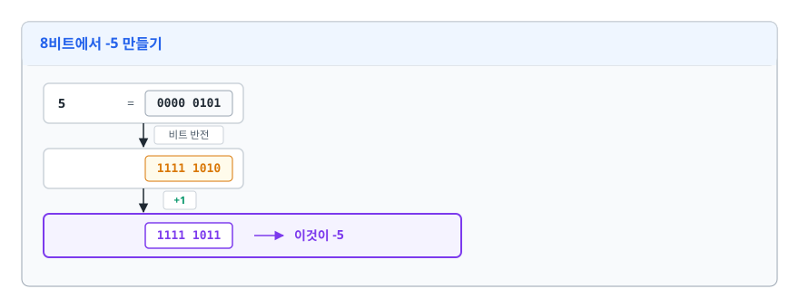
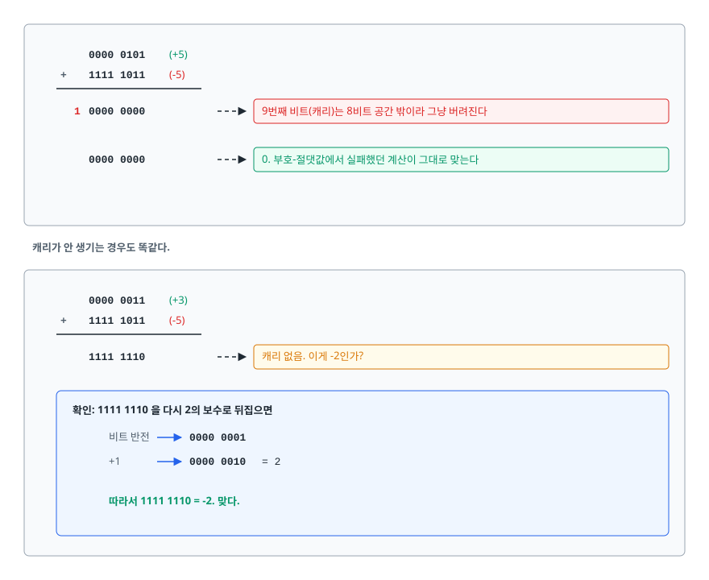
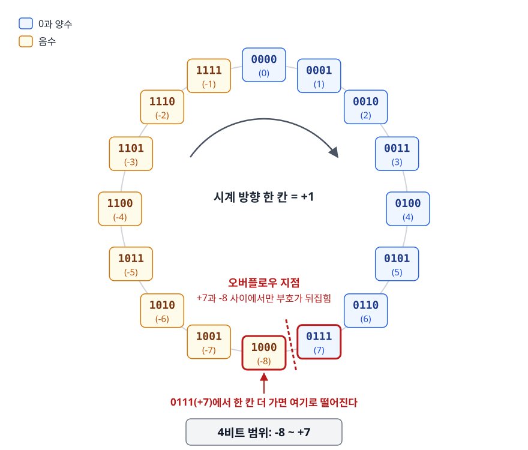
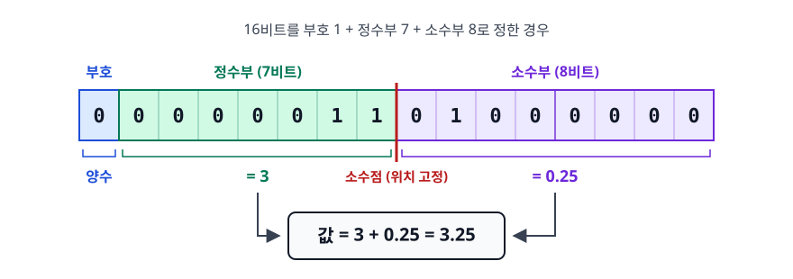
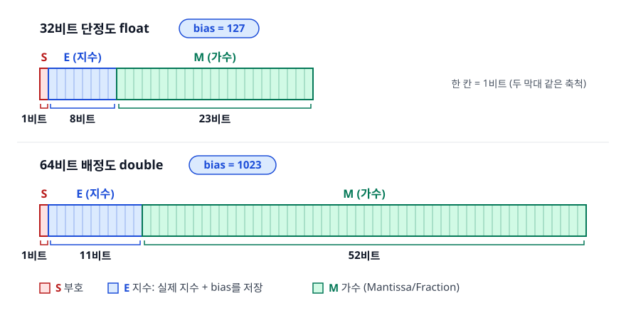
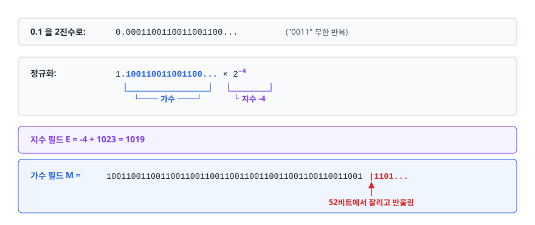
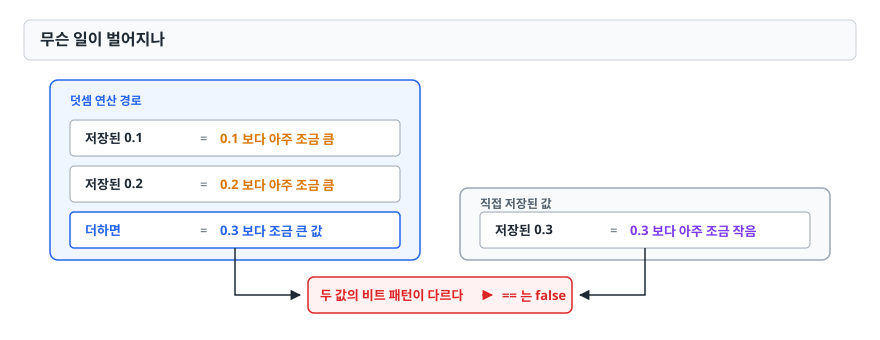

# 수 표현 방식 (Number Representation)

> 컴퓨터가 음수와 소수를 0과 1로 어떻게 흉내 내는지, 그리고 그 흉내에 어떤 구멍이 있어서 `0.1 + 0.2 != 0.3`이나 정수 오버플로우 같은 사고가 나는지 설명할 수 있게 됩니다.

## 학습 목표

- [ ] 2의 보수가 왜 부호-절댓값 방식보다 나은지 설명할 수 있다
- [ ] 정수 오버플로우가 어떤 코드에서 실제로 터지는지 예를 들 수 있다
- [ ] IEEE 754의 부호/지수/가수 구조를 그리고 값을 계산할 수 있다
- [ ] `0.1 + 0.2 != 0.3`의 원인을 이진 변환 관점에서 설명할 수 있다
- [ ] 금액을 다루는 코드에서 무엇을 써야 하고 무엇을 피해야 하는지 판단할 수 있다

## 선행 지식

없음 — 2진수 변환만 알면 됩니다. 모르면 "10진수 13 = 2진수 1101"만 확인하고 오면 충분합니다.

---

## 1. 왜 필요한가

컴퓨터의 저장 공간에는 0과 1밖에 없어서 마이너스 기호도 소수점도 물리적으로 저장할 방법이 없습니다. 그런데 우리는 `-5`도 쓰고 `3.14`도 씁니다. 이건 전부 **약속(인코딩)**, "이 비트 패턴은 이런 뜻으로 읽자"고 정해 놓은 규칙일 뿐입니다.

그 약속은 완벽할 수 없습니다. 비트 수가 유한하므로 표현할 수 있는 값의 개수도 유한하고 32비트로는 아무리 잘 짜도 42억 개 남짓의 서로 다른 값만 구분할 수 있습니다. 그런데 실수는 무한히 많습니다. **어떤 약속을 택하든 반드시 표현하지 못하는 값이 생깁니다.**

정수를 다루는 **2의 보수**, 실수를 다루는 **IEEE 754 부동 소수점**. 이 문서는 이 두 약속과 각각이 어디서 새는지를 봅니다. 새는 지점을 모르면 언젠가 정산 금액이 1원 틀린 버그를 만나게 됩니다.

---

## 2. 음수는 어떻게 저장하나 — 2의 보수

### 순진한 방법이 실패하는 이유

가장 먼저 떠오르는 건 **부호-절댓값(sign-magnitude)** 방식으로, 맨 앞 비트를 부호로 쓰고 나머지로 크기를 나타냅니다.

```
4비트 부호-절댓값
0101 = +5
1101 = -5
```

직관적이지만 두 가지 문제가 있습니다.

**문제 1 — 0이 둘입니다.** `0000`(+0)과 `1000`(-0). 같은 값에 두 표현이 있으면 비교 연산이 지저분해집니다.

**문제 2 — 덧셈 회로가 하나로 안 됩니다.** `+5`와 `-5`를 그냥 더해 봅시다.

<!-- diagram:cs-number-representation-1 -->


<!-- 위 그림이 대체한 원본 ASCII.
     내용을 고칠 때는 그림도 함께 갱신할 것.
```
  0101  (+5)
+ 1101  (-5)
──────
  10010  → 0을 기대했는데 엉뚱한 값
```
-->

그래서 별도 회로가 하나 붙습니다. 부호를 보고 "이건 사실 뺄셈이야"라고 판단하는 회로입니다. ALU는 복잡해지고 느려집니다.

### 2의 보수의 발상

**2의 보수(two's complement)**는 이 두 문제를 한 번에 해결합니다. 음수를 만드는 규칙은 단 두 단계입니다.

> 모든 비트를 뒤집고, 1을 더합니다.

<!-- diagram:cs-number-representation-2 -->


<!-- 위 그림이 대체한 원본 ASCII.
     내용을 고칠 때는 그림도 함께 갱신할 것.
```
8비트에서 -5 만들기

  5      = 0000 0101
  비트 반전 → 1111 1010
  +1     → 1111 1011  ← 이것이 -5
```
-->

이제 아까 실패했던 덧셈을 다시 해 봅시다.

<!-- diagram:cs-number-representation-3 -->


<!-- 위 그림이 대체한 원본 ASCII.
     내용을 고칠 때는 그림도 함께 갱신할 것.
```
   0000 0101   (+5)
+  1111 1011   (-5)
───────────────
 1 0000 0000   → 9번째 비트(캐리)는 8비트 공간 밖이라 그냥 버려진다
   0000 0000   → 0. 부호-절댓값에서 실패했던 계산이 그대로 맞는다

캐리가 안 생기는 경우도 똑같다.

   0000 0011   (+3)
+  1111 1011   (-5)
───────────────
   1111 1110   → 캐리 없음. 이게 -2인가?

확인:  1111 1110 을 다시 2의 보수로 뒤집으면
       비트 반전 → 0000 0001
       +1        → 0000 0010 = 2
       따라서 1111 1110 = -2. 맞다.
```
-->

**뺄셈 회로가 필요 없습니다.** `A - B`는 그냥 `A + (-B)`로 처리하면 되고, 덧셈기 하나로 전부 해결됩니다. 이게 2의 보수가 사실상 모든 CPU의 표준이 된 이유입니다.

### 비트 패턴을 원형으로 보기

2의 보수는 시계처럼 순환한다고 생각하면 이해가 쉽습니다.

<!-- diagram:cs-number-representation-4 -->


<!-- 위 그림이 대체한 원본 ASCII.
     내용을 고칠 때는 그림도 함께 갱신할 것.
```
                 0000 (0)
          1111        0001
          (-1)        (1)
      1110              0010
      (-2)              (2)
     1101                0011
     (-3)                (3)
     1100                0100
     (-4)                (4)
      1011              0101
      (-5)              (5)
          1010        0110
          (-6)        (6)
       1001         0111
       (-7)         (7)
             1000
             (-8)   ← 0111(+7)에서 한 칸 더 가면 여기로 떨어진다

4비트 범위: -8 ~ +7
```
-->

시계 방향으로 한 칸 = +1입니다. `0111`(+7)에서 한 칸 더 가면 `1000`이 되는데, 이 자리는 +8이 아니라 **-8**입니다. 반대로 `1111`(-1)에서 한 칸 더 가면 `0000`(0)으로 자연스럽게 이어집니다. 즉 순환 자체는 매끄럽고, 부호가 뒤집히는 지점이 딱 한 군데(+7과 -8 사이)뿐입니다.

**비유**: 12시간제 시계에서 시침을 뒤로 3칸 돌리는 것과 앞으로 9칸 돌리는 것은 결과가 같습니다. 2의 보수도 마찬가지로 "빼기"를 "돌아서 더하기"로 바꾼 것입니다.

**비유의 한계**: 시계는 어디로 넘어가도 유효한 시각이지만, 정수는 `0111`(최댓값)에서 한 칸 더 가면 `1000`(최솟값)이 되어 **의미가 뒤집힙니다**. 이게 오버플로우입니다.

### 알아둘 비대칭

n비트 2의 보수의 범위는 `-2^(n-1) ~ 2^(n-1) - 1`, 8비트는 -128 ~ 127, 32비트는 -2,147,483,648 ~ 2,147,483,647입니다. 음수 쪽이 하나 더 많습니다.

이 비대칭이 실제 버그를 만듭니다.

```java
System.out.println(Math.abs(Integer.MIN_VALUE));
// -2147483648  ← 절댓값을 구했는데 여전히 음수다
```

`Integer.MIN_VALUE`의 절댓값 `2147483648`은 int로 표현 자체가 불가능하니, `Math.abs`가 할 수 있는 게 없습니다.

---

## 3. 정수 오버플로우

표현 범위를 넘으면 조용히 반대편으로 넘어갑니다. **예외도 없고 경고도 없습니다.**

```java
int max = Integer.MAX_VALUE;   // 2147483647
System.out.println(max + 1);   // -2147483648
```

교과서에서는 이걸 신기한 현상 정도로 넘기지만, 실무에서는 진짜 사고가 납니다. 가장 유명한 사례가 **이진 탐색의 중간값 계산**입니다.

```java
// 문제가 있는 코드
int mid = (low + high) / 2;

// low = 1_500_000_000, high = 2_000_000_000 일 때
// low + high = 3_500_000_000 → int 범위 초과 → 음수가 됨
// mid가 음수 → ArrayIndexOutOfBoundsException

// 올바른 코드
int mid = low + (high - low) / 2;
```

`high - low`는 절대 오버플로우하지 않으므로 안전합니다. 이 버그는 Java 표준 라이브러리의 `Arrays.binarySearch`에도 오랫동안 숨어 있다가 2006년에야 수정됐습니다. 널리 쓰이는 코드도 이런 걸 놓칩니다.

**대응 방법**

| 방법 | 설명 | 언제 |
|------|------|------|
| 더 큰 타입 사용 | `int` → `long` | 값의 상한을 대략 알 때 가장 간단 |
| 오버플로우 검사 연산 | Java의 `Math.addExact`, `Math.multiplyExact` | 넘치면 `ArithmeticException`으로 즉시 실패시키고 싶을 때 |
| 무한 정밀도 타입 | Java `BigInteger`, Python의 기본 int | 값의 상한을 모를 때 (대신 느리다) |
| 뺄셈 형태로 변형 | `low + (high - low) / 2` | 중간값·차이 계산의 정석 |

```java
try {
    int result = Math.addExact(Integer.MAX_VALUE, 1);
} catch (ArithmeticException e) {
    // "integer overflow" — 조용히 틀린 값을 내는 것보다 훨씬 낫다
}
```

참고로 언어마다 정책이 다릅니다. Python의 정수는 자동으로 무한 정밀도로 커지므로 오버플로우가 없습니다(대신 느리다). Java와 C는 조용히 순환합니다. 자기가 쓰는 언어가 어느 쪽인지 아는 게 먼저입니다.

---

## 4. 소수는 어떻게 저장하나

### 고정 소수점 (Fixed Point)

가장 단순한 방법. 비트 자리마다 소수점 위치를 **미리 못 박아 둡니다.**

<!-- diagram:cs-number-representation-5 -->


<!-- 위 그림이 대체한 원본 ASCII.
     내용을 고칠 때는 그림도 함께 갱신할 것.
```
16비트, 부호 1 + 정수부 7 + 소수부 8 로 정한 경우

 부호  정수부(7)      소수부(8)
 ┌─┬───────────┬────────────────┐
 │0│ 0000011   │ 0100 0000      │
 └─┴───────────┴────────────────┘
      = 3          = 0.25
   → 값 3.25
```
-->

- **장점**: 연산이 정수 연산과 거의 같아 빠르고, 회로가 단순하며, 표현 가능한 값 안에서는 간격이 일정합니다.
- **단점**: 표현 범위가 좁습니다. 위 예에서는 정수부가 7비트뿐이라 128 이상을 못 씁니다.
- **쓰이는 곳**: DSP, 임베디드 제어, FPU가 없는 저가 마이크로컨트롤러.

### 부동 소수점 (Floating Point)

과학 표기법(`1.234 × 10^5`)을 이진수로 옮긴 것입니다. 소수점 위치를 **지수로 따로 저장**해 움직일 수 있게 만듭니다. 그래서 "부동(floating)"입니다.

```
값 = (-1)^부호 × 1.가수 × 2^(지수 - bias)
```

| 구분 | 고정 소수점 | 부동 소수점 | 그래서 언제 쓰나 |
|------|-----------|-----------|---------------|
| 소수점 위치 | 고정 | 지수에 따라 이동 | 값의 크기 범위를 미리 아는가로 갈린다 |
| 표현 범위 | 좁다 | 매우 넓다 (double은 약 ±1.8×10³⁰⁸) | 과학 계산은 부동 소수점 |
| 값 간격 | 균일 | 값이 클수록 성겨짐 | 균일한 정밀도가 필요하면 고정 소수점 |
| 연산 속도 | 빠름 | 전용 FPU 필요 | FPU 없는 임베디드는 고정 소수점 |
| 주 사용처 | DSP, 임베디드 | 일반 프로그래밍, 그래픽 | — |

한 줄로: **범위가 필요하면 부동 소수점입니다.** 정밀도를 예측할 수 있어야 하는 쪽이라면 고정 소수점이나 정수 환산으로 갑니다.

---

## 5. IEEE 754 뜯어보기

### 비트 배치

<!-- diagram:cs-number-representation-6 -->


<!-- 위 그림이 대체한 원본 ASCII.
     내용을 고칠 때는 그림도 함께 갱신할 것.
```
[32비트 단정도 float]
 ┌─┬──────────┬───────────────────────────┐
 │S│  E (8)   │        M (23)             │
 └─┴──────────┴───────────────────────────┘
  1     8               23                    bias = 127

[64비트 배정도 double]
 ┌─┬─────────────┬────────────────────────────────────────────┐
 │S│   E (11)    │                M (52)                      │
 └─┴─────────────┴────────────────────────────────────────────┘
  1      11                        52                            bias = 1023
```
-->

- **S (Sign)**: 0이면 양수, 1이면 음수.
- **E (Exponent)**: 지수를 담는데, 음수 지수도 표현해야 하므로 **bias를 더한 값**을 저장합니다. float는 실제 지수 + 127, double은 + 1023. 이렇게 하면 지수 필드를 부호 없는 정수로 비교하는 것만으로 크기 비교가 되어 하드웨어가 단순해집니다.
- **M (Mantissa/Fraction)**: 가수. 정규화하면 맨 앞이 항상 `1.`이므로 그 1은 저장하지 않습니다(**hidden bit**). 덕분에 23비트로 24비트만큼의 정밀도를 얻습니다.

### 값 계산해 보기

`0.1`을 double로 인코딩해 보겠습니다.

<!-- diagram:cs-number-representation-7 -->


<!-- 위 그림이 대체한 원본 ASCII.
     내용을 고칠 때는 그림도 함께 갱신할 것.
```
0.1 을 2진수로:  0.0001100110011001100...  ("0011" 무한 반복)

정규화:          1.100110011001100... × 2^-4
                 └──── 가수 ────┘      └ 지수 -4

지수 필드 E = -4 + 1023 = 1019
가수 필드 M = 100110011001100110011001100110011001100110011001100|1101...
                                                                  ↑
                                            52비트에서 잘리고 반올림
```
-->

**0.1은 이진법에서 순환 무한 소수입니다.** 분모가 2의 거듭제곱이 아닌 분수(0.1 = 1/10)는 이진 소수로 유한하게 적을 수 없습니다. 10진법에서 1/3이 0.333...으로 끝나지 않는 것과 같은 이유입니다.

52비트에서 잘라야 하므로, 저장된 값은 0.1이 아니라 0.1에 **가장 가까운 double**입니다. 그 값을 10진수로 전부 펼치면 이렇습니다.

```
0.1000000000000000055511151231257827021181583404541015625
```

`System.out.println(0.1)`이 `0.1`로 보이는 건 출력 루틴이 표기를 골라 주기 때문입니다. "이 double을 다시 읽었을 때 같은 값이 되는 가장 짧은 10진 표기"를 보여주는 것이지, 저장된 값이 정확히 0.1이라서가 아닙니다.

### 특수한 비트 패턴

지수 필드가 전부 0이거나 전부 1이면 특별한 의미를 갖습니다.

| 지수 필드 | 가수 필드 | 의미 |
|----------|----------|------|
| 전부 0 | 0 | ±0 (부호에 따라 +0.0과 -0.0이 따로 있다) |
| 전부 0 | 0이 아님 | 비정규 수(subnormal). 0 근처를 더 촘촘히 메운다 |
| 전부 1 | 0 | ±무한대(Infinity) |
| 전부 1 | 0이 아님 | NaN (Not a Number) |

이 때문에 생기는 함정들이 있습니다.

```java
double nan = 0.0 / 0.0;
System.out.println(nan == nan);              // false — NaN은 자기 자신과도 다르다
System.out.println(Double.isNaN(nan));       // true  — 이렇게 검사해야 한다

System.out.println(0.0 == -0.0);                          // true
System.out.println(Double.valueOf(0.0).equals(-0.0));     // false — equals는 비트로 비교

System.out.println(1.0 / 0.0);               // Infinity — 정수와 달리 예외가 아니다
System.out.println(1 / 0);                   // ArithmeticException
```

`NaN != NaN`은 정렬 함수나 `Set` 안에 들어가면 예측 불가능한 동작을 일으키므로, 실수를 키로 쓸 때는 항상 조심해야 합니다.

---

## 6. `0.1 + 0.2 != 0.3` 과 실무 대응

### 무슨 일이 벌어지나

```java
System.out.println(0.1 + 0.2);          // 0.30000000000000004
System.out.println(0.1 + 0.2 == 0.3);   // false
```

<!-- diagram:cs-number-representation-8 -->


<!-- 위 그림이 대체한 원본 ASCII.
     내용을 고칠 때는 그림도 함께 갱신할 것.
```
저장된 0.1  = 0.1 보다 아주 조금 큼
저장된 0.2  = 0.2 보다 아주 조금 큼
   더하면    = 0.3 보다 조금 큰 값
저장된 0.3  = 0.3 보다 아주 조금 작음
   → 두 값의 비트 패턴이 다르다 → == 는 false
```
-->

**유한 비트로 무한 소수를 담을 때 필연적으로 생기는 결과**입니다. 버그가 아닙니다. 언어를 바꿔도 IEEE 754를 쓰는 한 똑같습니다.

### 대응 1 — 허용 오차 비교 (과학·그래픽 계산)

```java
double a = 0.1 + 0.2;
double b = 0.3;
boolean equal = Math.abs(a - b) < 1e-9;   // true
```

간단하지만 임계값(epsilon)을 얼마로 둘지가 문제입니다. 다루는 값의 크기가 크게 달라지면 절대 오차 기준은 무너집니다. **금액 계산에는 쓰지 말 것.** "거의 같으면 같다"는 회계에서 통하지 않습니다.

### 대응 2 — 10진 고정밀 타입 (금융 표준)

Java의 `BigDecimal`은 값을 10진수 그대로 보관하므로 2진 변환 오차 자체가 없습니다.

```java
BigDecimal a = new BigDecimal("0.1");
BigDecimal b = new BigDecimal("0.2");
System.out.println(a.add(b));                       // 0.3 (정확히)
```

다만 함정이 세 개 있습니다.

```java
// 함정 1: double 생성자를 쓰면 이미 오염된 값이 들어간다
new BigDecimal(0.1);
// → 0.1000000000000000055511151231257827021181583404541015625
// 반드시 문자열 생성자 new BigDecimal("0.1") 또는 BigDecimal.valueOf(0.1)

// 함정 2: equals는 scale(소수 자릿수)까지 비교한다
new BigDecimal("1.0").equals(new BigDecimal("1.00"));         // false
new BigDecimal("1.0").compareTo(new BigDecimal("1.00")) == 0; // true  ← 값 비교는 이것

// 함정 3: 나눗셈은 반올림 모드를 명시해야 한다
new BigDecimal("1").divide(new BigDecimal("3"));
// → ArithmeticException (무한 소수라 결과를 표현할 수 없다)
new BigDecimal("1").divide(new BigDecimal("3"), 4, RoundingMode.HALF_UP);
// → 0.3333
```

DB까지 일관되게 가져가야 합니다. JPA 엔티티는 `BigDecimal`, 컬럼은 `DECIMAL`/`NUMERIC`입니다.

```java
@Column(precision = 19, scale = 4)
private BigDecimal amount;
```

Python이라면 `decimal.Decimal`, JavaScript라면 정수 환산이나 전용 라이브러리를 씁니다.

### 대응 3 — 정수 환산

금액을 "원"이 아니라 "전"이나 최소 화폐 단위의 정수로 다룹니다. 1,234.56원을 `123456`(단위: 전)으로 저장하는 식입니다.

- **장점**: 빠르고 단순합니다. `long` 하나면 됩니다.
- **단점**: 통화마다 소수 자릿수가 다릅니다(원은 0자리, 달러는 2자리, 일부 통화는 3자리). 다국가 서비스에서는 단위 관리가 금방 복잡해집니다. 나눗셈(할인율, 세금)에서 반올림 정책을 직접 정해야 합니다.

**언제 뭘 쓰나**: 정수 환산은 단일 통화에 단순 가감산 위주인 시스템에서 실용적입니다. 통화가 여럿이거나 이율·환율 같은 나눗셈이 끼면 `BigDecimal`로 가야 안전합니다.

### 왜 이렇게까지 하나

오차 하나는 10^-17 수준입니다. 문제는 **누적**입니다. 거래 100만 건에서 건당 0.0001원씩 어긋나면 100원이 사라지고, 회계 시스템은 대차가 1원이라도 안 맞으면 마감이 안 됩니다. 정산 배치가 실패하고, 원인 추적에 며칠이 듭니다. 애초에 부동 소수점을 안 쓰는 게 가장 쌉니다.

---

## 7. 실무에서는

**JSON으로 큰 정수를 보낼 때.** JavaScript의 `Number`는 double이라 안전하게 표현되는 정수 상한이 `Number.MAX_SAFE_INTEGER = 9007199254740991`(2⁵³ - 1)입니다. 그런데 서버의 `Long` ID나 Snowflake 방식 ID는 이 범위를 쉽게 넘습니다. 그대로 내려보내면 브라우저에서 **끝자리가 조용히 바뀝니다.**

```javascript
console.log(9007199254740993);  // 9007199254740992  ← 마지막 자리가 달라진다
```

API 응답에서 큰 ID를 **문자열로 직렬화**하면 해결됩니다. Spring이라면 `@JsonSerialize(using = ToStringSerializer.class)`를 붙이거나 필드 타입을 String으로 노출합니다. "가끔 특정 게시글만 조회가 안 된다"는 제보의 흔한 원인입니다.

**float를 언제 쓰나.** 메모리와 대역폭이 중요한 경우입니다. 대량의 좌표 데이터, 머신러닝 가중치, 3D 그래픽 버텍스는 float(또는 더 작은 타입)로 충분한 경우가 많습니다. 반대로 일반 비즈니스 로직에서 float를 쓸 이유는 거의 없는데 정밀도가 double보다 훨씬 낮으면서 얻는 게 없기 때문입니다.

**DB 컬럼 타입.** MySQL의 `FLOAT`/`DOUBLE`은 IEEE 754 그대로라 금액에 쓰면 안 됩니다. `DECIMAL(p, s)`을 씁니다. 이 타입은 내부적으로 10진 값을 정확히 보관하는 대신 연산이 느리므로, 통계 집계처럼 오차가 허용되는 곳에까지 굳이 DECIMAL을 강요할 필요는 없습니다.

---

## 8. 면접 포인트

> 면접에서 이 주제가 나오면 이렇게 답한다

**Q. 컴퓨터는 음수를 어떻게 표현하나요?**
A. 대부분 2의 보수를 씁니다. 양수의 모든 비트를 반전하고 1을 더해 음수를 만드는 방식입니다. 부호-절댓값 방식과 달리 0의 표현이 하나뿐이고, 무엇보다 **뺄셈을 별도 회로 없이 덧셈기 하나로 처리**할 수 있어 하드웨어가 단순해집니다. 대신 표현 범위가 비대칭이라 n비트에서 `-2^(n-1) ~ 2^(n-1)-1`이 되고, 이 때문에 `Math.abs(Integer.MIN_VALUE)`가 음수를 반환하는 것 같은 함정이 생깁니다.
- 꼬리 질문: "오버플로우가 실제로 문제가 된 사례가 있나요?" → 이진 탐색의 `(low + high) / 2`가 대표적입니다. 배열이 크면 합이 int 범위를 넘어 음수가 되고 인덱스 예외가 납니다. `low + (high - low) / 2`로 써야 합니다.

**Q. `0.1 + 0.2 == 0.3`이 false인 이유를 설명해 주세요.**
A. IEEE 754는 10진 소수를 2진 소수로 바꿔 저장하는데, 0.1과 0.2는 분모가 2의 거듭제곱이 아니라 이진법에서 순환 무한 소수가 됩니다. 가수부 비트가 유한하므로(double은 52비트) 뒤가 잘려 나가고 저장된 값은 0.1과 0.2에 가장 가까운 근사값입니다. 두 근사값의 합과 0.3의 근사값은 비트 패턴이 달라 `==` 비교가 실패합니다. 버그가 아니라 유한 비트의 필연적 결과입니다.
- 꼬리 질문: "그럼 금융 시스템에서는 어떻게 하나요?" → Java는 `BigDecimal`, DB는 `DECIMAL`/`NUMERIC`. `BigDecimal`은 반드시 문자열 생성자를 쓰고, 값 비교는 `equals`가 아니라 `compareTo`, 나눗셈은 `RoundingMode`를 명시합니다. 단순한 단일 통화 시스템이면 최소 단위 정수로 환산하는 방법도 씁니다.

**Q. IEEE 754 double의 구조를 설명해 주세요.**
A. 64비트를 부호 1비트, 지수 11비트, 가수 52비트로 나눕니다. 값은 `(-1)^S × 1.M × 2^(E - 1023)`입니다. 지수는 음수도 표현해야 하므로 1023을 더한 bias 형태로 저장하는데, 이렇게 하면 부호 없는 정수 비교만으로 크기 비교가 되어 하드웨어가 단순해집니다. 정규화하면 가수의 맨 앞이 항상 1이라 그 비트는 저장하지 않고(hidden bit) 52비트로 53비트만큼의 정밀도를 얻습니다.
- 꼬리 질문: "NaN이나 Infinity는 어떻게 표현되나요?" → 지수 필드를 전부 1로 채운 패턴을 예약해 둡니다. 가수가 0이면 무한대, 0이 아니면 NaN입니다. NaN은 자기 자신과의 `==` 비교도 false라서 `Double.isNaN()`으로 검사해야 합니다.

**Q. 백엔드에서 Long ID를 프론트로 보낼 때 주의할 점이 있나요?**
A. JavaScript의 `Number`는 double이라 안전 정수 범위가 2⁵³-1까지입니다. 서버의 64비트 Long ID가 이를 넘으면 브라우저에서 값이 조용히 바뀝니다. 예외도 안 나고 끝자리만 달라져서 발견이 늦습니다. API 응답에서 큰 ID는 문자열로 직렬화하는 것이 표준적인 대응입니다.

---

## 자주 하는 실수

| 실수 | 왜 틀렸나 | 올바른 이해 |
|------|----------|-----------|
| `new BigDecimal(0.1)` | double이 이미 오차를 품은 채로 들어온다 | `new BigDecimal("0.1")` 또는 `BigDecimal.valueOf(0.1)` |
| `bigDecimal.equals(other)`로 값 비교 | scale까지 비교해서 `1.0 != 1.00` | 값 비교는 `compareTo(other) == 0` |
| 금액을 `double`로 저장 | 누적 오차로 정산이 어긋난다 | `BigDecimal` + DB `DECIMAL`, 또는 최소 단위 정수 |
| `(low + high) / 2` | 큰 값에서 오버플로우 | `low + (high - low) / 2` |
| "부동 소수점 오차는 언어 버그" | IEEE 754를 쓰는 모든 언어가 동일하다 | 표준의 필연적 결과. 언어를 바꿔도 안 없어진다 |
| `nan == nan`으로 NaN 검사 | NaN은 자기 자신과도 다르다 | `Double.isNaN(x)` 사용 |
| 정수 오버플로우가 나면 에러가 날 것이다 | Java/C는 조용히 순환한다 | 필요하면 `Math.addExact` 등으로 명시적 검사 |

---

## 한 줄 정리

정수는 2의 보수 덕에 뺄셈 회로가 없어도 되지만 범위를 넘는 순간 조용히 순환합니다. 실수는 IEEE 754로 넓은 범위를 얻은 대신 10진 소수를 정확히 담지 못합니다. 그래서 돈처럼 정확성이 필요한 값에는 부동 소수점을 쓰지 않습니다.

---

## 연관 개념

- [01-cpu-instruction-cycle.md](./01-cpu-instruction-cycle.md) - 이 연산들을 실제로 수행하는 ALU
- [02-cache-memory.md](./02-cache-memory.md) - `int[]`와 `Integer[]`의 메모리 배치 차이
- [04-error-detection-risc-cisc.md](./04-error-detection-risc-cisc.md) - 비트가 물리적으로 뒤집히는 경우의 대응
- [qna-computer-architecture.md](./qna-computer-architecture.md) - 이 주제 면접 질문
- [Java QnA](../../02-backend-engineering/java-fundamentals/qna-java.md) - BigDecimal과 기본 타입
- [데이터베이스 QnA](../../02-backend-engineering/database/qna-database.md) - DECIMAL 컬럼 설계
