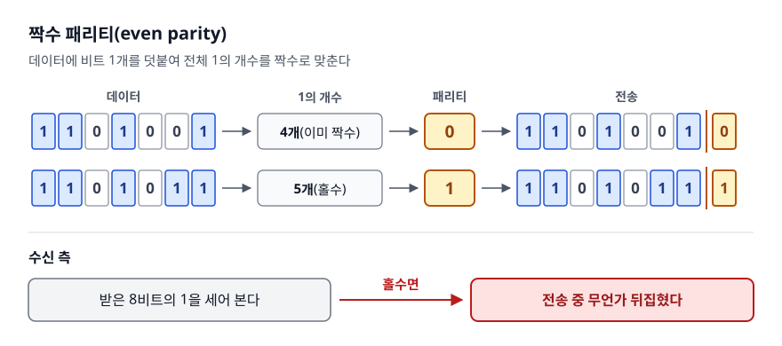
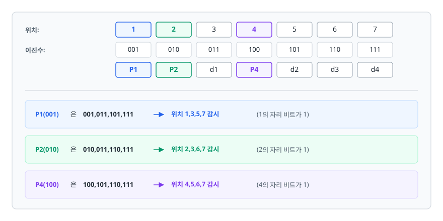
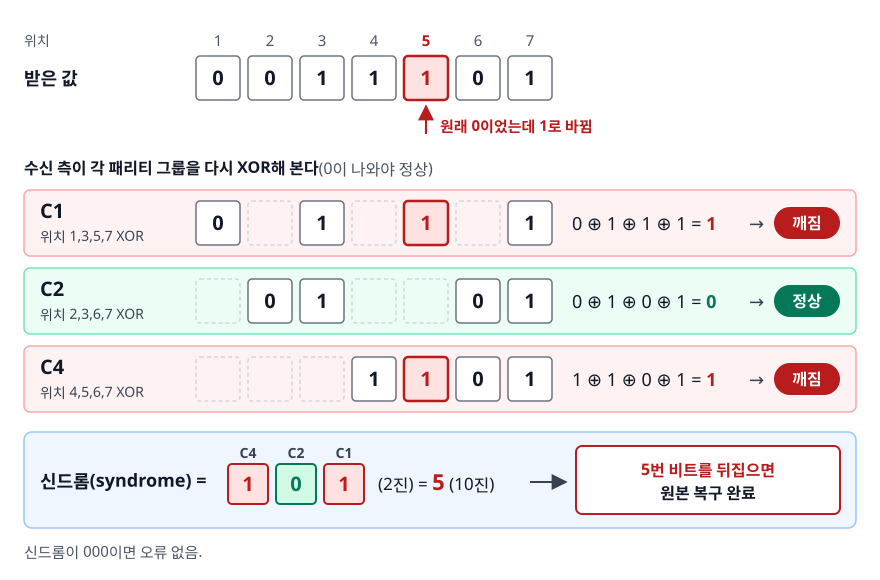
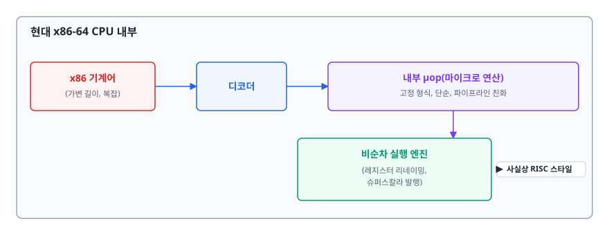

# 오류 검출·정정과 프로세서 설계 철학 (Error Detection & RISC vs CISC)

> 하드웨어가 조용히 틀렸을 때 그걸 어떻게 알아채고 고칠까요? "명령어를 몇 개 만들 것인가"라는 설계 선택은 오늘날의 ARM/x86 구도를 또 어떻게 만들었을까요? 이 문서는 그 두 질문을 차례로 설명합니다.

## 학습 목표

- [ ] 패리티 비트가 검출할 수 있는 것과 없는 것을 정확히 구분할 수 있다
- [ ] 해밍 코드가 오류 **위치**까지 알아내는 원리를 XOR로 설명할 수 있다
- [ ] ECC 메모리가 서버에서 표준인 이유를 말할 수 있다
- [ ] RISC와 CISC의 설계 철학 차이와, 현대 CPU에서 그 경계가 흐려진 이유를 설명할 수 있다
- [ ] 멀티 아키텍처 환경에서 백엔드 개발자가 실제로 마주치는 문제를 안다

## 선행 지식

- [01-cpu-instruction-cycle.md](./01-cpu-instruction-cycle.md) - 파이프라인을 알아야 RISC 설계의 동기가 이해됩니다
- [03-number-representation.md](./03-number-representation.md) - 비트 패턴과 XOR에 익숙하면 해밍 코드가 쉽습니다

---

## 1. 왜 필요한가

이 문서는 성격이 다른 두 주제를 묶었지만, 출발점은 같습니다. 둘 다 **"하드웨어는 이상적이지 않다"**는 사실에서 시작합니다.

앞의 문서들은 CPU와 메모리가 시킨 대로 정확히 동작한다고 가정했습니다. 현실은 다릅니다. DRAM 셀에 저장된 전하는 우주에서 날아온 고에너지 입자나 전기적 잡음 때문에 아주 드물게 뒤집힙니다(**soft error**, bit flip). 확률은 낮지만, 수천 대 서버가 수 TB 메모리를 24시간 돌리는 데이터센터에서는 "드물게"가 "매일"이 됩니다. 그래서 오류를 **검출**하고 나아가 **정정**하는 기술이 필요합니다.

두 번째 주제는 성능의 한계에서 옵니다. 트랜지스터 예산과 전력 예산은 유한합니다. "명령어를 복잡하고 강력하게 만들 것인가, 단순하고 빠르게 만들 것인가"라는 질문에는 정답이 없고 오직 **타협**만 있습니다. RISC와 CISC는 그 타협의 두 갈래입니다.

---

## 2. 패리티 비트

### 발상

데이터에 비트 1개를 덧붙여 **전체 1의 개수를 짝수(또는 홀수)로 맞춥니다.** 그것뿐입니다.

<!-- diagram:cs-error-detection-risc-cisc-1 -->


<!-- 위 그림이 대체한 원본 ASCII.
     내용을 고칠 때는 그림도 함께 갱신할 것.
```
[짝수 패리티(even parity)]

데이터 1101001 → 1의 개수 4개(이미 짝수) → 패리티 0
전송  1101001|0

데이터 1101011 → 1의 개수 5개(홀수)     → 패리티 1
전송  1101011|1

수신 측은 받은 8비트의 1을 세어 본다.
홀수면 → 전송 중 무언가 뒤집혔다.
```
-->

**비유**: 짐을 부칠 때 상자 개수를 짝수로 맞춰 보냅니다. 받는 쪽에서 홀수가 나오면 하나 잃어버렸다는 걸 아는 것과 같습니다.

**비유의 한계**: 상자라면 두 개를 잃어버려도 개수를 세어 보면 압니다. 하지만 패리티는 **두 비트가 동시에 뒤집히면 알아채지 못합니다**. 1의 개수가 다시 짝수로 돌아오기 때문입니다.

### 한계를 정확히

| 상황 | 검출 가능? | 이유 |
|------|-----------|------|
| 1비트 반전 | 가능 | 1의 개수 홀짝이 바뀐다 |
| 2비트 반전 | **불가능** | 홀짝이 원래대로 돌아온다 |
| 3비트 반전 | 가능 | 홀짝이 바뀐다 |
| 짝수 개 반전 | 불가능 | 위와 같은 이유 |
| 오류 위치 파악 | **불가능** | "어딘가 틀렸다"까지만 안다 |

핵심은 마지막 줄입니다. 위치를 모르면 **고칠 수 없습니다.** 검출만 되는 시스템이 할 수 있는 일은 "다시 보내 주세요"라고 요청하는 것뿐입니다. 그런데 메모리에는 재전송이라는 개념이 없습니다. 이미 값이 오염됐고 원본은 사라졌습니다.

---

## 3. 해밍 코드 — 위치까지 알아내기

### 발상

패리티 비트를 하나만 두는 대신 **여러 개를 겹치게 배치**합니다. 각 패리티가 서로 다른 비트 집합을 감시하도록 만들면, 어느 패리티들이 깨졌는지의 조합이 곧 **오류 위치의 이진수 표현**이 됩니다.

규칙은 두 가지입니다.

1. 패리티 비트는 **2의 거듭제곱 위치**(1, 2, 4, 8, ...)에 놓습니다.
2. 위치 `2^k`의 패리티는 **자기 위치 번호의 k번째 비트가 1인 모든 자리**를 감시합니다.

<!-- diagram:cs-error-detection-risc-cisc-2 -->


<!-- 위 그림이 대체한 원본 ASCII.
     내용을 고칠 때는 그림도 함께 갱신할 것.
```
위치:      1     2     3     4     5     6     7
이진수:  001   010   011   100   101   110   111
         P1    P2    d1    P4    d2    d3    d4

P1(001) 은 001,011,101,111 → 위치 1,3,5,7 감시  (1의 자리 비트가 1)
P2(010) 은 010,011,110,111 → 위치 2,3,6,7 감시  (2의 자리 비트가 1)
P4(100) 은 100,101,110,111 → 위치 4,5,6,7 감시  (4의 자리 비트가 1)
```
-->

감시 범위가 겹치는 방식을 조금 더 보겠습니다. 각 데이터 위치를 감시하는 패리티는 그 위치 번호를 이진수로 쪼갠 조합이 정합니다. 위치 5(=101)는 P4와 P1이 감시하고 P2는 감시하지 않습니다. 그래서 P4와 P1만 깨지면 답은 5 하나로 확정됩니다. 위치마다 감시자 조합이 전부 다르니 조합만 보고 위치를 역산할 수 있습니다.

### 코드로 보기 — 4비트 데이터 `1001` 보내기

먼저 보내는 쪽에서 패리티를 계산합니다. 각 패리티는 자기가 감시하는 자리들의 XOR입니다.

```
데이터 d1 d2 d3 d4 = 1, 0, 0, 1

위치:  1    2    3    4    5    6    7
값:    P1   P2   1    P4   0    0    1

P1 = (위치 3,5,7의 XOR) = 1 ⊕ 0 ⊕ 1 = 0
P2 = (위치 3,6,7의 XOR) = 1 ⊕ 0 ⊕ 1 = 0
P4 = (위치 5,6,7의 XOR) = 0 ⊕ 0 ⊕ 1 = 1

전송 코드워드:  0  0  1  1  0  0  1
```

이제 전송 중 **5번 비트가 뒤집혔다**고 해 봅시다. 수신 측은 어느 비트가 틀렸는지 모르는 상태에서 시작합니다.

<!-- diagram:cs-error-detection-risc-cisc-3 -->


<!-- 위 그림이 대체한 원본 ASCII.
     내용을 고칠 때는 그림도 함께 갱신할 것.
```
받은 값:  0  0  1  1  1  0  1
                     ↑ 원래 0이었는데 1로 바뀜

수신 측이 각 패리티 그룹을 다시 XOR해 본다 (0이 나와야 정상):

C1 = 위치 1,3,5,7 XOR = 0 ⊕ 1 ⊕ 1 ⊕ 1 = 1   → 깨짐
C2 = 위치 2,3,6,7 XOR = 0 ⊕ 1 ⊕ 0 ⊕ 1 = 0   → 정상
C4 = 위치 4,5,6,7 XOR = 1 ⊕ 1 ⊕ 0 ⊕ 1 = 1   → 깨짐

신드롬(syndrome) = C4 C2 C1 = 1 0 1 (2진) = 5 (10진)

→ 5번 비트를 뒤집으면 원본 복구 완료.
   신드롬이 000이면 오류 없음.
```
-->

깨진 패리티가 P4와 P1이고 P2는 멀쩡하다는 사실만으로 위치가 5로 좁혀집니다. P2가 감시하지 않는 자리 중에 P4와 P1이 동시에 감시하는 자리는 5번뿐이기 때문입니다.

이게 해밍 코드의 전부입니다. **깨진 패리티들의 위치 번호를 더한 값이 곧 오류 위치**입니다. 마법처럼 보이지만 실제로는 위치 번호를 이진수로 인코딩해 둔 것을 되읽는 것뿐입니다.

데이터 `m`비트에 패리티가 몇 개 필요한지는 `2^r ≥ m + r + 1`을 만족하는 최소 `r`입니다. 데이터 4비트면 r=3(2³=8 ≥ 8), 데이터 64비트면 r=7입니다.

### SECDED — 실제 ECC 메모리

기본 해밍 코드는 **1비트 정정**은 됩니다. 하지만 2비트가 뒤집히면 신드롬이 엉뚱한 위치를 가리켜서 **멀쩡한 비트를 망가뜨립니다.** 그래서 실제 ECC RAM은 전체를 감싸는 패리티 비트 하나를 더 붙입니다.

이 구성을 **SECDED(Single Error Correction, Double Error Detection)**라 부릅니다. 1비트 오류는 조용히 고치고, 2비트 오류는 "고칠 수 없지만 오류가 있다"고 보고합니다. 서버용 DIMM이 64비트 데이터에 8비트를 더해 72비트 폭으로 만들어지는 이유가 이것입니다.

| 기법 | 검출 | 정정 | 오버헤드 | 대표 사용처 |
|------|------|------|---------|-----------|
| 패리티 비트 | 1비트(홀수 개) | 불가 | 1비트 | 단순 직렬 통신, 구형 메모리 |
| 해밍 코드 (SECDED) | 2비트 | **1비트** | 64비트당 8비트 수준 | **서버 ECC RAM**, 항공우주 |
| CRC | 버스트 오류에 강함 | 불가 | 32비트 등 고정 | 이더넷 프레임, ZIP, 파일 전송 |
| 재전송 (ARQ) | 상위 계층에서 | 재전송으로 | 왕복 지연 | TCP |

**언제 뭘 쓰나**: 다시 보낼 수 있으면 검출만 하고 재전송하는 게 쌉니다(CRC + TCP). **다시 보낼 수 없으면 정정 능력을 사서 넣어야 합니다**(메모리, 저장 장치, 우주 탐사선). ECC 메모리가 서버에서 표준이고 소비자용 PC에서 흔치 않은 이유도 이 기준입니다. 게임 중 픽셀 하나가 잘못 그려지는 것과, 은행 잔액 비트가 뒤집히는 것은 대가가 다릅니다.

---

## 4. RISC와 CISC

### 왜 CISC가 먼저였나

CISC를 이해하려면 1970년대의 제약부터 봐야 합니다. 당시 메모리는 지금 감각으로 상상하기 어려울 만큼 비싸고 작았고, 컴파일러도 원시적이었습니다. 사람이 어셈블리를 직접 쓰는 일이 흔했습니다.

이 조건에서 합리적인 선택은 명확했습니다. **명령어 하나가 최대한 많은 일을 하게 만들자.** 그러면 프로그램 크기가 줄어 비싼 메모리를 아끼고, 어셈블리 작성도 편해집니다. "메모리에서 값을 읽어 더한 뒤 다시 메모리에 쓴다"를 한 명령어로 처리하는 식입니다. 이런 복잡한 명령어는 CPU 내부의 **마이크로코드(microcode)**가 여러 단계로 풀어서 실행했습니다.

이것이 **CISC(Complex Instruction Set Computer)**입니다. x86이 대표주자입니다.

### 그런데 문제가 드러났다

1980년대에 들어 상황이 바뀌었습니다. 메모리는 싸졌고 컴파일러는 똑똑해졌습니다. 그런데 실제로 측정해 보니 뜻밖의 사실이 드러났습니다. **컴파일러가 만드는 코드는 복잡한 명령어를 거의 쓰지 않았습니다.** 실행 시간 대부분은 소수의 단순한 명령어가 차지했습니다.

더 심각한 건 파이프라인이었습니다. 명령어 길이가 제각각이고(x86-64는 1~15바이트) 실행 시간도 제각각이면, 명령어 경계를 찾는 것부터 어렵고 파이프라인 단계를 균일하게 나눌 수도 없습니다. 여기서 나온 반격이 **RISC(Reduced Instruction Set Computer)**입니다.

> 자주 쓰는 단순한 명령어만 남기고 하드웨어를 극단적으로 단순화하자. 복잡한 일은 컴파일러가 단순 명령어를 조합해 처리하면 됩니다.

RISC 설계의 특징은 파이프라인을 위한 것이 대부분입니다.

- **고정 길이 명령어** (ARM A64는 전부 4바이트) → 디코딩이 단순하고 병렬화하기 쉽습니다
- **Load/Store 아키텍처** → 메모리 접근은 `LOAD`/`STORE`만 하고 연산은 레지스터끼리만 합니다. 덕분에 명령어당 메모리 접근 횟수가 예측 가능해집니다
- **많은 범용 레지스터** → 메모리 왕복을 줄입니다
- **단순한 주소 지정 방식**

### 비교

| 구분 | RISC (ARM, RISC-V) | CISC (x86-64) | 그래서 어떤 차이로 이어지나 |
|------|-------------------|---------------|------------------------|
| 명령어 개수 | 적고 단순 | 많고 복잡 | RISC는 같은 일에 더 많은 명령어가 필요 |
| 명령어 길이 | 고정 (A64: 4바이트) | 가변 (1~15바이트) | 고정 길이는 디코더 병렬화가 쉽다 |
| 메모리 접근 | Load/Store만 | 연산 명령어가 직접 접근 가능 | RISC는 파이프라인 단계가 균일해진다 |
| 디코더 복잡도 | 낮음 | 높음 | 디코더는 전력과 칩 면적을 먹는다 |
| 코드 밀도 | 상대적으로 낮음 | 높음 | CISC가 명령어 캐시에 더 유리한 면이 있다 |
| 전력 효율 | 유리 | 불리 | 모바일에서 ARM이 이긴 결정적 이유 |
| 주 사용처 | 모바일, 임베디드, 최근 서버·노트북 | PC, 워크스테이션, 전통적 서버 | — |

**한 줄 결론**: 설계 철학의 차이는 "복잡함을 하드웨어에 둘 것인가, 컴파일러에 둘 것인가"입니다. 하드웨어에 두면 코드가 짧아지고 컴파일러에 두면 하드웨어가 빨라집니다.

### 경계는 이미 흐려졌다 — 반드시 알아둘 것

면접에서 위 표만 외워 답하면 낡은 지식이라는 인상을 줍니다. 현대 CPU에서 RISC와 CISC의 구분은 **명령어 세트(ISA)라는 겉면에만 남아 있고 내부는 수렴했습니다.**

<!-- diagram:cs-error-detection-risc-cisc-4 -->


<!-- 위 그림이 대체한 원본 ASCII.
     내용을 고칠 때는 그림도 함께 갱신할 것.
```
현대 x86-64 CPU 내부

  x86 기계어           ┌──────────┐   내부 μop(마이크로 연산)
  (가변 길이,   ───▶  │  디코더   │  ───▶  고정 형식, 단순, 파이프라인 친화
   복잡)              └──────────┘             │
                                               ▼
                                    ┌────────────────────┐
                                    │  비순차 실행 엔진     │  ← 사실상 RISC 스타일
                                    │  (레지스터 리네이밍,  │
                                    │   슈퍼스칼라 발행)    │
                                    └────────────────────┘
```
-->

x86 CPU는 복잡한 명령어를 **마이크로 연산(micro-op, μop)**이라는 단순한 내부 명령어로 쪼갠 뒤, RISC와 다를 바 없는 파이프라인에서 실행합니다. 반대로 ARM도 세대를 거치며 벡터 연산이나 암호화 가속 같은 복잡한 명령어를 계속 추가해 왔습니다.

그래서 오늘날 성능·전력 차이의 원인은 "RISC냐 CISC냐"보다는 **디코더 비용, 공정, 마이크로아키텍처 설계, 메모리 서브시스템**에 있습니다. 다만 가변 길이 명령어 디코딩이 구조적으로 비싸고 병렬화하기 어렵다는 점은 x86이 지금도 안고 가는 부담입니다.

---

## 5. 실무에서는 — 멀티 아키텍처 시대

### Apple Silicon

애플은 2020년 M1을 시작으로 Mac을 Intel x86에서 자체 ARM 기반 칩으로 전환했습니다. 이유는 여러 겹입니다.

- **성능 대비 전력(performance per watt)**: 노트북에서 배터리와 발열은 곧 제품 경쟁력입니다
- **수직 통합**: 칩·OS·컴파일러(Clang/LLVM)를 모두 직접 통제하면 최적화 여지가 커집니다
- **iOS와의 명령어 세트 통일**: iPhone/iPad용 A 시리즈도 ARM이라 생태계가 하나로 묶입니다

전환의 진짜 난관은 성능이 아니라 **기존 x86 바이너리 호환성**이었습니다. 애플은 세 가지 해법을 함께 썼습니다.

1. **Rosetta 2**: x86-64 바이너리를 arm64로 번역합니다. 앱 설치 시점에 미리 번역해 두고, 실행 중 생성되는 코드(JIT 등)는 실행 시점에 번역합니다. 대부분의 앱이 사용자 조작 없이 그냥 돌아갑니다.
2. **Universal Binary 2**: 한 패키지에 x86-64용과 arm64용 바이너리를 모두 넣고 실행 환경에 맞는 쪽을 고릅니다.
3. **재컴파일**: 개발자가 arm64 타깃으로 다시 빌드하는 정공법입니다.

여기서 짚어 둘 지점이 하나 있습니다. x86은 **강한 메모리 순서(strong memory ordering)**를 보장하지만 ARM은 **약한 메모리 순서**를 택합니다. 멀티스레드 코드를 그대로 번역하면 x86에서 잘 돌던 코드가 ARM에서 미묘하게 깨질 수 있습니다. 애플은 이를 위해 칩에 x86 스타일 메모리 순서를 흉내 내는 모드를 넣고, Rosetta 프로세스에만 켜는 방식으로 해결했습니다. **아키텍처 차이는 명령어만의 문제가 아니라 동시성 의미론의 문제이기도 합니다.**

### 서버와 백엔드

같은 흐름이 서버로 번졌습니다. AWS Graviton 계열은 ARM Neoverse 기반 서버용 프로세서로, 전력 대비 성능과 가격 경쟁력을 앞세워 클라우드에서 점유율을 넓히고 있습니다. RISC-V처럼 로열티 없는 개방형 ISA도 임베디드를 중심으로 확산 중입니다.

백엔드 개발자가 실제로 부딪히는 지점은 이렇습니다.

**멀티 아키텍처 컨테이너 이미지.** 개발자는 Apple Silicon Mac(arm64), 배포 대상은 x86 서버(amd64)인 상황이 흔합니다. 로컬에서 잘 빌드된 이미지가 서버에서 `exec format error`로 죽습니다.

```bash
# 두 아키텍처용 이미지를 한 번에 빌드해 푸시
docker buildx build \
  --platform linux/amd64,linux/arm64 \
  -t myorg/myapp:1.0 --push .
```

**JVM 언어는 상대적으로 안전합니다.** 바이트코드가 아키텍처를 추상화하므로 순수 Java/Kotlin 코드는 재빌드가 필요 없습니다. 문제는 **네이티브 코드에 의존하는 라이브러리**입니다. JNI를 쓰는 압축·암호화 라이브러리, 네이티브 이미지 처리 도구 등은 아키텍처별 바이너리가 아티팩트에 포함되어 있어야 합니다. 없으면 런타임에 `UnsatisfiedLinkError`가 납니다.

**성능 특성이 다릅니다.** 벤치마크는 배포할 아키텍처에서 돌려야 의미가 있습니다. arm64 개발 머신에서 측정한 수치를 amd64 서버 용량 산정에 그대로 쓰면 틀립니다.

---

## 6. 면접 포인트

> 면접에서 이 주제가 나오면 이렇게 답한다

**Q. 패리티 비트와 ECC의 차이는 무엇인가요?**
A. 패리티 비트는 1비트를 추가해 1의 개수를 홀짝으로 맞추는 방식이라, **오류가 있다는 사실만** 알 수 있고 짝수 개 비트가 동시에 뒤집히면 그것조차 놓칩니다. ECC에 쓰이는 해밍 코드는 패리티 비트를 여러 개 겹쳐 배치해 **오류 위치까지 특정**하므로 1비트 오류를 자동으로 정정합니다. 실제 서버 메모리는 여기에 전체 패리티를 하나 더해 SECDED 구성을 만듭니다. 그러면 1비트는 고치고 2비트는 검출해 보고합니다.
- 꼬리 질문: "왜 서버에만 ECC를 쓰나요?" → 메모리는 재전송이 불가능하고 24시간 돌아가는 대규모 시스템에서는 확률 낮은 비트 플립도 실제로 발생합니다. 데이터 정합성 손상 비용이 ECC 원가보다 훨씬 크기 때문입니다.

**Q. 해밍 코드가 오류 위치를 어떻게 특정하나요?**
A. 패리티 비트를 1, 2, 4, 8처럼 2의 거듭제곱 위치에 놓고 각 패리티가 자기 위치 번호의 해당 비트가 1인 자리들만 감시하게 합니다. 수신 측에서 각 패리티 그룹을 다시 XOR해 보면 깨진 그룹들이 나오는데, 그 위치 번호를 더한 값이 곧 오류 비트의 위치입니다. 위치 번호를 이진수로 인코딩해 둔 것을 되읽는 구조라고 이해하면 됩니다.

**Q. RISC와 CISC의 차이를 설명해 주세요.**
A. CISC는 명령어 하나가 많은 일을 하도록 설계해 코드 밀도를 높이는 철학이고, RISC는 단순한 고정 길이 명령어만 두고 복잡한 처리는 컴파일러에 맡기는 철학입니다. RISC는 명령어 길이가 고정이고 메모리 접근이 Load/Store로 제한되어 파이프라인 단계를 균일하게 나누기 쉽습니다. 다만 현대 x86 CPU는 복잡한 명령어를 내부에서 마이크로 연산으로 쪼개 RISC와 유사한 파이프라인에서 실행하므로, 실제 성능 차이는 ISA보다 마이크로아키텍처와 공정에서 나옵니다.
- 꼬리 질문: "그런데도 ARM이 전력 효율에서 유리한 이유는?" → 가변 길이 명령어를 병렬로 디코딩하는 것이 구조적으로 비싸고 그 디코더가 전력과 칩 면적을 계속 소비하기 때문입니다. 고정 길이 ISA는 이 비용을 애초에 지지 않습니다.

**Q. Apple Silicon 전환에서 호환성 문제는 어떻게 해결됐나요?**
A. Rosetta 2가 x86-64 바이너리를 arm64로 번역합니다. 설치 시점에 미리 번역하고, 동적 생성 코드는 실행 시점에 처리하는 방식이라 사용자 개입이 거의 필요 없습니다. 여기에 두 아키텍처 바이너리를 함께 담는 Universal Binary와 개발자의 재컴파일이 병행됐습니다. 까다로웠던 건 명령어 번역보다 메모리 모델 차이인데, x86은 강한 메모리 순서를, ARM은 약한 메모리 순서를 택하기 때문에 멀티스레드 코드의 동작이 달라질 수 있어 하드웨어 차원의 보완이 필요했습니다.
- 꼬리 질문: "백엔드 개발자에게는 어떤 영향이 있나요?" → 개발 머신은 arm64, 배포 서버는 amd64인 경우가 흔해 멀티 아키텍처 컨테이너 이미지를 빌드해야 합니다. JVM 언어는 바이트코드 덕에 대체로 안전하지만 JNI 기반 네이티브 라이브러리는 아키텍처별 바이너리가 필요합니다.

---

## 자주 하는 실수

| 실수 | 왜 틀렸나 | 올바른 이해 |
|------|----------|-----------|
| "패리티 비트로 오류를 고칠 수 있다" | 위치를 모르므로 고칠 수 없다 | 패리티는 검출 전용. 정정하려면 해밍 코드 같은 ECC가 필요 |
| "패리티는 모든 오류를 잡는다" | 짝수 개 비트가 뒤집히면 못 잡는다 | 홀수 개 비트 반전만 검출 가능 |
| "ECC는 몇 비트든 고쳐 준다" | SECDED는 1비트 정정, 2비트 검출까지다 | 그 이상은 검출도 보장되지 않는다 |
| "CRC는 오류를 정정한다" | CRC는 검출용 코드다 | 검출 후 재전송으로 대응한다 (TCP 등) |
| "RISC는 무조건 빠르고 CISC는 느리다" | 현대 x86은 내부적으로 μop 기반 RISC 파이프라인이다 | ISA보다 마이크로아키텍처·공정이 성능을 좌우한다 |
| "RISC는 명령어당 1 사이클이다" | 파이프라인이 꽉 찼을 때의 처리량 얘기다 | 개별 명령어의 지연 시간은 여러 사이클 |
| "Java는 아키텍처 무관이니 신경 쓸 것 없다" | JNI 네이티브 라이브러리는 아키텍처별 빌드가 필요하다 | 순수 바이트코드만 이식성이 보장된다 |

---

## 한 줄 정리

오류 검출은 "틀렸다"까지만 알려 줍니다. 정정은 "어디가 틀렸는지"까지 알려 줍니다. RISC와 CISC는 복잡함을 하드웨어에 둘지 컴파일러에 둘지에 대한 서로 다른 답이었지만, 현대 CPU에서는 겉면만 남고 내부는 수렴했습니다.

---

## 연관 개념

- [01-cpu-instruction-cycle.md](./01-cpu-instruction-cycle.md) - 파이프라인이 RISC 설계를 이끈 동기
- [02-cache-memory.md](./02-cache-memory.md) - ECC가 지키는 그 메모리의 계층 구조
- [03-number-representation.md](./03-number-representation.md) - XOR과 비트 연산의 기초
- [qna-computer-architecture.md](./qna-computer-architecture.md) - 이 주제 면접 질문
- [네트워크 QnA](../network/qna-network.md) - CRC와 재전송 기반 오류 제어
