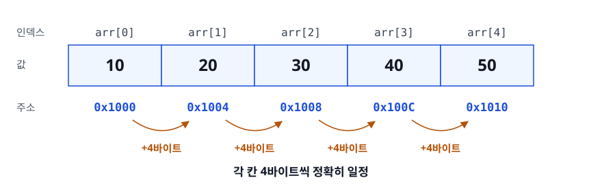
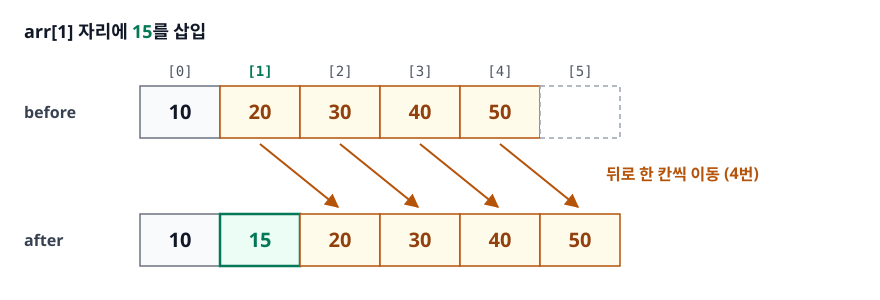
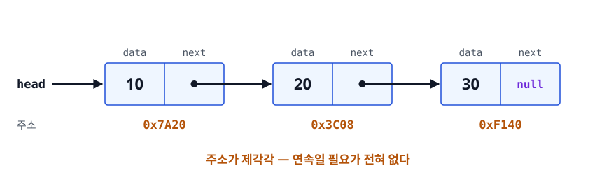
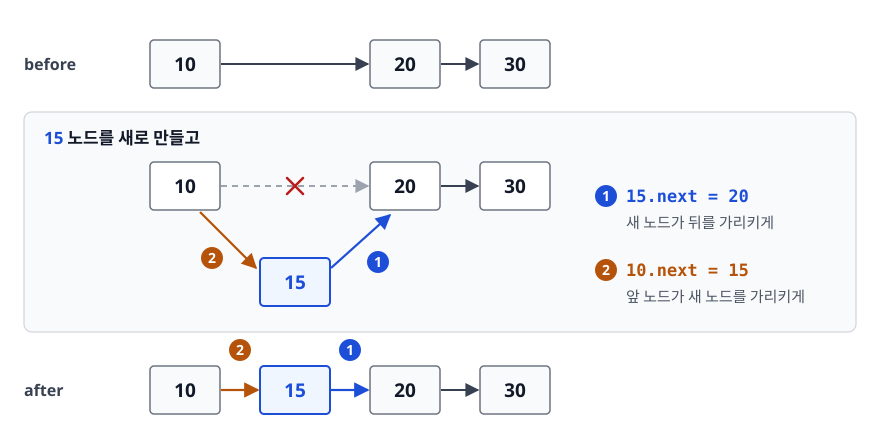
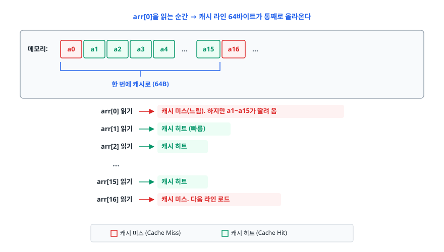
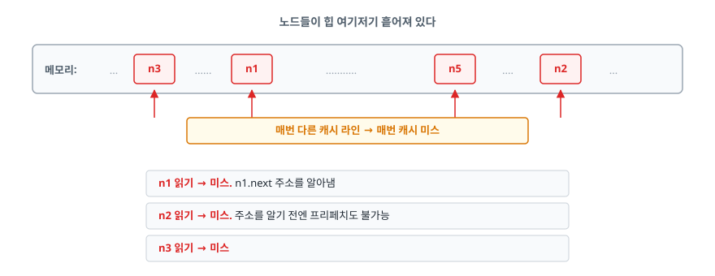

# 배열과 리스트 (Array & List)

> 난이도 ⭐ · 배열과 연결 리스트가 메모리에 어떻게 놓이는지, 그 차이가 왜 시간 복잡도 표만으로는
> 설명되지 않는 성능 차이를 만드는지, 그리고 동적 배열이 "무제한 크기"를 어떻게 흉내내는지 설명할 수 있게 된다.

## 학습 목표

- [ ] 배열의 O(1) 임의 접근이 어떤 계산식에서 나오는지 설명할 수 있다
- [ ] 연결 리스트의 삽입/삭제가 O(1)이라는 말에 숨은 전제를 지적할 수 있다
- [ ] 캐시 지역성(Cache Locality)이 실제 성능을 어떻게 뒤집는지 설명할 수 있다
- [ ] 동적 배열의 증분이 왜 amortized O(1)인지 계산으로 보일 수 있다
- [ ] 주어진 접근 패턴에 맞는 자료구조를 근거와 함께 고를 수 있다

## 선행 지식

- 없음 — 이 문서부터 시작해도 된다.
- 메모리 계층 구조를 이미 안다면 4장이 더 잘 읽힌다: [메모리 관리](../operating-system/02-memory-management.md)

---

## 1. 왜 필요한가

데이터를 여러 개 다루려면 "여러 값을 담을 그릇"이 필요하다. 변수 100개를 `a1, a2, ... a100`으로
만들 수는 없으니까. 그런데 그릇을 만드는 방법은 근본적으로 두 갈래뿐이다.

**한 덩어리로 붙여 놓기** — 메모리를 한 번에 크게 잡고 값들을 나란히 채운다. 위치 계산이 쉬운 대신,
중간에 뭔가 끼워 넣으려면 뒤를 전부 밀어야 하고, 처음에 잡은 공간이 모자라면 곤란해진다.

**흩어 놓고 화살표로 잇기** — 값 하나씩 따로 할당하고 "다음은 저기"라는 주소를 함께 저장한다.
중간에 끼워 넣기는 화살표만 고치면 되는 대신, 3번째 값을 보려면 첫 번째부터 화살표를 따라가야 한다.

전자가 배열(Array), 후자가 연결 리스트(Linked List)다. 둘은 서로의 약점을 정확히 맞바꾼 관계이고,
이후 나오는 거의 모든 자료구조는 이 둘 중 하나를 바닥에 깔고 만들어진다. 스택도, 큐도, 해시 테이블의
버킷도 마찬가지다. 그래서 이 둘의 차이를 정확히 아는 것이 자료구조 공부의 출발점이 된다.

---

## 2. 배열 — 연속된 메모리 한 덩어리

### 정의

배열은 **같은 타입의 원소를 메모리상 연속된 위치에 저장하는** 자료구조다. 여기서 중요한 단어는
"같은 타입"과 "연속"이다. 둘 다 O(1) 접근을 위한 전제 조건이다.

### 동작 원리 — 주소 계산

`int arr[5]`가 메모리 주소 `0x1000`부터 시작한다고 하자. `int`가 4바이트라면 이렇게 놓인다.

<!-- diagram:cs-array-list-1 -->


<!-- 위 그림이 대체한 원본 ASCII.
     내용을 고칠 때는 그림도 함께 갱신할 것.
```
      arr[0]   arr[1]   arr[2]   arr[3]   arr[4]
    ┌────────┬────────┬────────┬────────┬────────┐
    │   10   │   20   │   30   │   40   │   50   │
    └────────┴────────┴────────┴────────┴────────┘
     0x1000   0x1004   0x1008   0x100C   0x1010
        └────────┴────────┴────────┴────────┘
              각 칸 4바이트씩 정확히 일정
```
-->

`arr[3]`의 주소는 탐색이 아니라 **곱셈 한 번과 덧셈 한 번**으로 나온다.

```
주소 = 시작주소 + (인덱스 × 원소크기)
     = 0x1000 + (3 × 4)
     = 0x100C
```

인덱스가 0이든 100만이든 계산량은 똑같다. 이것이 O(1) 임의 접근(Random Access)의 정체다.
"빠르게 찾는 알고리즘"이 있는 게 아니라 **애초에 찾을 필요가 없다**.

### 대가: 중간 삽입/삭제

칸 간격이 정확히 일정해야 위 계산식이 성립한다. 그러니 중간에 값을 넣으려면 뒤쪽을 전부 한 칸씩
밀어서 간격을 다시 맞춰야 한다.

<!-- diagram:cs-array-list-2 -->


<!-- 위 그림이 대체한 원본 ASCII.
     내용을 고칠 때는 그림도 함께 갱신할 것.
```
arr[1] 자리에 15를 삽입

before:  [10][20][30][40][50][  ]
                └───┴───┴───┴──→ 뒤로 한 칸씩 이동 (4번)
after:   [10][15][20][30][40][50]
```
-->

맨 앞에 넣으면 n번, 맨 뒤에 넣으면 0번 이동한다. 평균 n/2번이라 O(n)이다.
**삭제도 같은 이유로 O(n)** 이다. 구멍을 남길 수 없으니 뒤를 당겨 와야 한다.

### 흔한 오해

> "배열은 크기가 고정이라 불편하다"

정확히는 **고정 크기 배열(fixed-size array)** 이 그렇다. `int[10]`, C의 `int arr[10]`이 여기 해당한다.
Java의 `ArrayList`, C++의 `std::vector`, Python의 `list`, JS의 `Array`는 모두 내부에 고정 크기
배열을 두고 꽉 차면 더 큰 배열로 갈아타는 **동적 배열(Dynamic Array)** 이다. 5장에서 자세히 본다.

---

## 3. 연결 리스트 — 흩어진 노드를 포인터로 잇기

### 정의

연결 리스트는 **값(data)과 다음 노드의 주소(next)를 한 묶음으로 가진 노드들을 사슬처럼 연결한**
자료구조다. 노드들이 메모리 어디에 있든 상관없다. 주소만 알고 있으면 되니까.

<!-- diagram:cs-array-list-3 -->


<!-- 위 그림이 대체한 원본 ASCII.
     내용을 고칠 때는 그림도 함께 갱신할 것.
```
head
 │
 ▼
┌──────┬──────┐   ┌──────┬──────┐   ┌──────┬──────┐
│  10  │  ●───┼──▶│  20  │  ●───┼──▶│  30  │ null │
└──────┴──────┘   └──────┴──────┘   └──────┴──────┘
 0x7A20            0x3C08            0xF140
    주소가 제각각 — 연속일 필요가 전혀 없다
```
-->

주소가 뒤죽박죽인 게 핵심이다. 새 노드를 만들 때 힙 어디에 자리가 나든 그냥 쓰면 된다.
배열처럼 "연속된 40바이트를 통째로 달라"고 요구하지 않는다.

### 동작 원리 — 삽입은 화살표 두 개

10과 20 사이에 15를 끼워 넣는다고 하자. 옮길 데이터가 없다. 화살표만 고친다.

<!-- diagram:cs-array-list-4 -->


<!-- 위 그림이 대체한 원본 ASCII.
     내용을 고칠 때는 그림도 함께 갱신할 것.
```
before:  [10]──▶[20]──▶[30]

         [15] 노드를 새로 만들고
           1) 15.next = 20        (새 노드가 뒤를 가리키게)
           2) 10.next = 15        (앞 노드가 새 노드를 가리키게)

after:   [10]──▶[15]──▶[20]──▶[30]
```
-->

n이 100만이어도 이 두 줄이면 끝난다. 이게 삽입 O(1)이다.

### 여기 숨은 전제

**"이미 10번 노드를 손에 쥐고 있을 때"** 만 O(1)이다. 10번 노드를 찾는 데 드는 비용은 별도다.
연결 리스트는 주소 계산식이 없으므로 head부터 next를 k번 따라가야 한다 — O(n).

그래서 정직하게 쓰면 이렇다.

| 상황 | 비용 |
|------|------|
| 노드 참조를 이미 갖고 있음 (iterator 등) | 삽입/삭제 O(1) |
| 인덱스만 알고 있음 (`list.add(500, x)`) | 탐색 O(n) + 삽입 O(1) = **O(n)** |
| 맨 앞/맨 뒤 (head/tail 포인터 유지 시) | O(1) |

면접에서 "연결 리스트 삽입은 O(1)"이라고만 답하면 십중팔구 "인덱스로 접근할 때도 그런가요?"가
따라온다. 위 구분을 먼저 말해 버리는 게 좋다.

### 변형

- **단일 연결 리스트(Singly Linked List)**: `next`만 있음. 뒤로 못 감.
- **이중 연결 리스트(Doubly Linked List)**: `prev`도 있음. 양방향 순회 가능하고, 노드 하나만 알면
  그 노드를 O(1)에 삭제할 수 있다. 대신 포인터가 하나 더라 메모리를 더 쓴다.
  Java의 `LinkedList`, LRU 캐시 구현에 쓰이는 게 이것이다.
- **원형 연결 리스트(Circular Linked List)**: 마지막 노드가 head를 가리킴. 라운드 로빈 스케줄링 같은
  "끝나면 처음으로" 패턴에 쓴다.

---

## 4. 캐시 지역성 — 복잡도 표가 배신하는 지점

여기가 이 문서에서 제일 중요한 부분이다. 복잡도만 보면 "중간 삽입이 잦으면 연결 리스트"라는 결론이
나오는데, 실제로 벤치마크를 돌리면 배열이 이기는 경우가 대단히 많다. 이유는 CPU와 메모리의
속도 차이에 있다.

### 비유

메모리를 **창고**, CPU 캐시를 **책상 위**라고 하자. CPU가 값 하나를 요청하면 창고 직원은
그것만 갖고 오지 않는다. **그 값이 든 상자를 통째로** 갖고 와서 책상에 올려 둔다.
다음에 필요한 값이 같은 상자 안에 있으면 창고까지 갈 필요가 없다.

(비유의 한계: 실제 캐시는 L1/L2/L3 여러 층이고 교체 정책도 있다. 여기서는 "덩어리 단위로 가져온다"는
성질만 빌려 왔다.)

이 "상자"가 **캐시 라인(Cache Line)** 이고, 오늘날 대부분의 x86/ARM CPU에서 64바이트다.
`int`가 4바이트니 캐시 라인 하나에 정수 16개가 들어간다.

### 배열을 순회할 때

<!-- diagram:cs-array-list-5 -->


<!-- 위 그림이 대체한 원본 ASCII.
     내용을 고칠 때는 그림도 함께 갱신할 것.
```
arr[0]을 읽는 순간 → 캐시 라인 64바이트가 통째로 올라온다

메모리:  [a0][a1][a2][a3][a4] ... [a15][a16] ...
         └──────────────────────────┘
              한 번에 캐시로 (64B)

arr[0] 읽기 → 캐시 미스(느림). 하지만 a1~a15가 딸려 옴
arr[1] 읽기 → 캐시 히트 (빠름)
arr[2] 읽기 → 캐시 히트
   ...
arr[15] 읽기 → 캐시 히트
arr[16] 읽기 → 캐시 미스. 다음 라인 로드
```
-->

미스 1번에 히트 15번. 게다가 CPU의 **프리페처(prefetcher)** 는 "주소가 규칙적으로 증가하네"를
감지해서 다음 라인을 미리 가져다 놓는다. 그래서 실제로는 미스조차 거의 체감되지 않는다.

### 연결 리스트를 순회할 때

<!-- diagram:cs-array-list-6 -->


<!-- 위 그림이 대체한 원본 ASCII.
     내용을 고칠 때는 그림도 함께 갱신할 것.
```
노드들이 힙 여기저기 흩어져 있다

메모리:  ...[n3]......[n1]...........[n5]....[n2]...
              ▲        ▲               ▲       ▲
              │        │               │       │
        매번 다른 캐시 라인 → 매번 캐시 미스

n1 읽기 → 미스. n1.next 주소를 알아냄
n2 읽기 → 미스. 주소를 알기 전엔 프리페치도 불가능
n3 읽기 → 미스
```
-->

더 나쁜 건 **다음 주소를 알려면 현재 노드를 먼저 읽어야 한다**는 점이다.
이걸 포인터 추적(pointer chasing)이라 부르는데, CPU가 미리 준비할 방법이 없어서 메모리 지연을
그대로 다 맞는다.

### 얼마나 차이 나나

CPU 사이클 기준으로 접근 비용은 대략 이런 규모다.

| 저장소 | 대략적인 지연 |
|--------|--------------|
| L1 캐시 | 수 사이클 |
| L2 캐시 | 십여 사이클 |
| L3 캐시 | 수십 사이클 |
| 메인 메모리(DRAM) | 수백 사이클 |

L1과 DRAM 사이에 두 자릿수 배율의 차이가 있다. 그래서 "O(n) 데이터 이동"이 "O(1) 포인터 변경"보다
빠른 역전이 흔하게 일어난다. `memmove`로 배열 원소를 미는 작업은 연속 메모리를 통째로 복사하는,
CPU가 가장 잘하는 종류의 일이다. 반면 연결 리스트의 O(1) 삽입은 그 노드까지 가는 O(n) 포인터 추적을
동반하고, 그 O(n)의 상수 계수가 아주 크다.

**정리하면**: 시간 복잡도는 n이 충분히 클 때의 증가율을 말할 뿐, 상수 계수를 말하지 않는다.
연결 리스트는 그 상수 계수가 배열보다 훨씬 크다.

---

## 5. 동적 배열(Dynamic Array)과 amortized O(1)

### 문제

배열은 크기가 고정인데, 우리는 `list.add()`를 몇 번 부를지 모르는 채로 코드를 쓴다.
동적 배열은 이 간극을 "꽉 차면 더 큰 배열로 이사"로 메운다.

### 동작 원리

```
capacity=4, size=4 인 상태에서 add(50) 호출

1) 더 큰 배열 할당
   old: [10][20][30][40]                 (capacity 4)
   new: [  ][  ][  ][  ][  ][  ][  ][  ] (capacity 8)

2) 전체 복사 — 여기가 O(n)
   [10][20][30][40][  ][  ][  ][  ]

3) 새 값 추가, 옛 배열은 GC 대상
   [10][20][30][40][50][  ][  ][  ]
```

### 왜 amortized O(1)인가

한 번의 확장은 분명 O(n)이다. 그런데 **확장은 자주 일어나지 않는다**는 게 핵심이다.
2배씩 늘린다고 하면, 용량 1에서 시작해 n개를 넣는 동안 발생한 총 복사 횟수는

```
1 + 2 + 4 + 8 + ... + n/2 + n  ≈  2n
```

등비수열의 합이라 **총 복사가 2n번을 넘지 않는다**. 이걸 n번의 add로 나누면 add 한 번당 평균 2회.
n과 무관한 상수다. 그래서 **분할 상환 O(1)(amortized O(1))** 이라고 부른다.

여기서 "평균"이라는 단어에 주의해야 한다. 확률적 평균이 아니라 **일련의 연산 전체를 놓고 나눈**
값이다. 개별 add는 여전히 O(n)이 걸릴 수 있다.

만약 **2배가 아니라 +1씩 늘렸다면** 매번 복사가 일어나 총 `1+2+3+...+n = n²/2`, add당 O(n)이 된다.
곱셈 증가가 본질이다.

### 언어별 증가 정책

| 구현체 | 증가율 | 비고 |
|--------|--------|------|
| Java `ArrayList` | 1.5배 (`old + (old >> 1)`) | 기본 용량 10, 첫 add 때 확보 |
| C++ `std::vector` (libstdc++) | 2배 | MSVC 표준 라이브러리는 1.5배 |
| Python `list` | 1.125배 근처 | 증가폭이 작아 메모리 낭비가 적음 |

증가율이 작으면 메모리 낭비가 적은 대신 복사가 잦고, 크면 반대다. 어느 쪽이든 곱셈 증가라
amortized O(1)은 유지된다.

### 코드로 보기

```java
// 크기를 미리 알면 재할당을 아예 없앨 수 있다
ArrayList<String> names = new ArrayList<>(10_000);  // 초기 용량 지정
for (int i = 0; i < 10_000; i++) {
    names.add("user" + i);                          // 재할당 0회
}

// 반대로, 이미 커진 리스트를 비워도 배열은 그대로다
names.clear();      // size=0. 하지만 내부 배열 capacity는 10,000 유지
names.trimToSize(); // 실제로 메모리를 회수하려면 이걸 호출
                    // trimToSize()는 List 인터페이스에 없다. ArrayList 타입이어야 호출된다
```

대량 데이터를 넣을 게 확실하면 초기 용량 지정은 실질적인 최적화다.
반대로 몇 개 안 들어갈 리스트에 큰 용량을 잡으면 메모리만 낭비한다.

---

## 6. 언제 무엇을 쓰나

| 기준 | 배열 / ArrayList | 연결 리스트 / LinkedList |
|------|-----------------|------------------------|
| 인덱스 접근 | **O(1)** | O(n) |
| 순차 순회 | **매우 빠름** (캐시 히트) | 느림 (포인터 추적) |
| 끝에 추가 | amortized O(1) | O(1) |
| 맨 앞 삽입/삭제 | O(n) | **O(1)** |
| 중간 삽입 (인덱스로) | O(n), 이동은 빠름 | O(n) 탐색 + O(1) |
| 중간 삽입 (참조 보유 시) | O(n) | **O(1)** |
| 원소당 메모리 | 값만 (+ 여유 용량) | 값 + 포인터 1~2개 + 객체 헤더 |
| 메모리 단편화 내성 | 큰 연속 블록 필요 | **조각난 메모리도 사용 가능** |

**한 줄 결론**: 특별한 이유가 없으면 동적 배열(ArrayList)을 쓴다. 연결 리스트는
"이미 위치를 가리키는 참조가 있고, 그 지점에서 삽입/삭제가 매우 잦으며, 인덱스 접근은 안 하는"
좁은 조건이 모두 맞을 때만 이긴다.

---

## 7. 실무에서는

**Java** — `ArrayList`가 사실상 표준이다. `LinkedList`는 List로 쓰기보다 `Deque` 구현체로
필요할 때 쓰는 편인데, 그마저도 `ArrayDeque`가 대부분 더 빠르다.
`LinkedList`의 진짜 쓸모는 "노드 참조를 직접 들고 O(1) 제거"인데, Java 컬렉션 API는 그 참조를
외부에 노출하지 않아서 장점을 살리기 어렵다.

**LRU 캐시** — 연결 리스트가 확실히 이기는 대표 사례다. 해시맵이 키에서 노드 참조를 O(1)로 주고,
그 노드를 이중 연결 리스트의 맨 앞으로 O(1)에 옮긴다. 탐색이 O(1)로 해결되니 연결 리스트의
약점이 사라진다. Java의 `LinkedHashMap`이 이 조합(해시 테이블 + 이중 연결 리스트)으로 만들어져 있어서,
`accessOrder=true`로 생성하면 접근 순서로 정렬되고 여기에 `removeEldestEntry`를 재정의해
가장 오래된 항목을 버리게 하면 LRU 캐시가 된다.

**게임/그래픽스** — 엔티티를 배열에 연속 배치하는 Structure of Arrays 패턴이 널리 쓰인다.
매 프레임 수만 개를 순회하므로 캐시 미스 한 번의 비용이 누적되면 프레임 드랍으로 직결된다.

**JavaScript** — `Array`는 명세상 인덱스도 문자열 프로퍼티 키인 객체의 특수한 형태다.
그래도 V8은 인덱스가 조밀하고 타입이 균일하면 내부적으로 연속 배열(packed elements)로 최적화한다.
중간에 `delete`를 쓰거나 인덱스를 띄엄띄엄 쓰면 dictionary mode로 떨어져 느려진다. 배열에서 원소를 뺄 때 `delete arr[i]` 대신
`splice`나 필터링을 쓰라는 조언이 여기서 나온다.

---

## 8. 면접 포인트

> 면접에서 이 주제가 나오면 이렇게 답한다

**Q. Array와 LinkedList의 차이를 설명해 주세요.**

A. 메모리 배치가 근본 차이입니다. Array는 연속된 공간에 저장되어 `시작주소 + 인덱스 × 원소크기`로
주소를 계산하므로 임의 접근이 O(1)이지만, 중간 삽입/삭제 시 원소를 밀어야 해서 O(n)입니다.
LinkedList는 노드가 흩어져 있고 포인터로 연결되므로 접근이 O(n)이지만, 해당 노드를 이미 알고 있다면
포인터만 바꿔 O(1)에 삽입/삭제할 수 있습니다. 다만 인덱스로 접근하는 경우엔 탐색 O(n)이 붙어서
결국 O(n)이라는 점을 함께 봐야 합니다.

- 꼬리 질문: "그럼 삽입이 잦으면 LinkedList가 낫겠네요?" → 복잡도상으로는 그렇지만 실측은 다르다.
  캐시 지역성과 포인터 추적 비용 때문에 중간 규모까지는 ArrayList가 이기는 경우가 많다고 답한다.

**Q. 실무에서 왜 대부분 ArrayList를 쓰나요?**

A. 세 가지입니다. 첫째, 연속 메모리라 캐시 라인 단위 로딩과 프리페칭의 이득을 받습니다.
둘째, 실제 삽입/삭제는 리스트 끝에서 일어나는 경우가 대부분이라 amortized O(1)이 적용됩니다.
셋째, LinkedList는 노드마다 객체 헤더와 포인터가 붙어 메모리 오버헤드가 크고, 그만큼 GC 부담도
늘어납니다. LinkedList가 이기려면 노드 참조를 직접 들고 있어야 하는데, Java 컬렉션 API로는
그 참조를 얻기가 어렵습니다.

- 꼬리 질문: "LinkedList가 확실히 유리한 경우는?" → LRU 캐시처럼 해시맵이 노드 참조를 O(1)로
  넘겨주는 구조. 탐색 비용이 사라지면 O(1) 삽입/삭제 이점만 남는다.

**Q. ArrayList의 add가 amortized O(1)이라는 게 무슨 뜻인가요?**

A. 개별 add는 재할당이 일어나면 O(n)이지만, 용량을 곱셈으로 늘리기 때문에 재할당이 드물게
발생합니다. 2배씩 늘린다고 하면 n개를 넣는 동안 총 복사량이 등비수열 합으로 2n을 넘지 않아,
add 한 번당 평균 상수 시간이 됩니다. 확률적 평균이 아니라 연산 시퀀스 전체를 나눈 값이라는 점에서
average와 구분해서 amortized라고 부릅니다.

- 꼬리 질문: "1씩 늘리면 어떻게 되나요?" → 매번 복사가 일어나 총 O(n²), add당 O(n)이 된다.
  곱셈 증가가 amortized O(1)의 조건이다.

**Q. 배열 중간 삭제를 O(1)로 만들 방법이 있나요?**

A. 순서를 보장하지 않아도 되는 경우엔 삭제할 자리에 마지막 원소를 옮기고 size를 1 줄이는
swap-and-pop으로 O(1)에 처리할 수 있습니다. 순서가 필요하면 삭제 표시(tombstone)만 남기고
나중에 한 번에 압축(compaction)하는 방법도 있습니다.

---

## 자주 하는 실수

| 실수 | 왜 틀렸나 | 올바른 이해 |
|------|----------|-----------|
| "LinkedList는 삽입이 항상 O(1)" | 삽입 지점을 찾는 탐색 비용을 빼먹었다 | 참조를 이미 보유했을 때만 O(1). 인덱스 기반은 O(n) |
| "복잡도가 낮으면 무조건 빠르다" | 복잡도는 증가율만 말하고 상수 계수를 말하지 않는다 | n이 작거나 상수 계수가 크면 역전된다. 실측이 근거 |
| "ArrayList는 크기 제한이 없다" | 내부는 여전히 배열이고 확장은 O(n) 복사다 | 크기를 알면 초기 용량을 지정해 재할당을 없앤다 |
| `clear()`로 메모리가 회수된다 | size만 0이 되고 내부 배열 capacity는 그대로다 | 실제 회수는 `trimToSize()` 또는 새 인스턴스 |
| 순회 중 `list.remove()` 호출 | 인덱스가 밀리거나 `ConcurrentModificationException` | `Iterator.remove()` 또는 `removeIf()` 사용 |
| "배열 삽입 O(n)이라 무조건 느림" | 연속 메모리 블록 복사는 CPU가 가장 잘하는 연산 | 수천 개 규모의 이동은 포인터 추적 한 번보다 쌀 수 있다 |

---

## 한 줄 정리

배열은 연속 배치로 주소를 계산해 O(1) 접근을 얻고 이동 비용을 치르며, 연결 리스트는 그 반대를
택하는데, 현대 CPU의 캐시 구조 때문에 실제 승부는 복잡도 표가 아니라 접근 패턴이 결정한다.

---

## 연관 개념

- [02-stack-queue.md](./02-stack-queue.md) - 배열/연결 리스트 위에 올라가는 첫 번째 추상 자료형
- [03-tree-graph.md](./03-tree-graph.md) - 노드와 포인터 개념을 2차원 이상으로 확장한 구조
- [04-hash-table.md](./04-hash-table.md) - 배열 인덱싱과 연결 리스트를 조합해 O(1) 검색을 만드는 법
- [qna-data-structure.md](./qna-data-structure.md) - 이 주제 면접 질문 (Q1, Q7)
- [메모리 관리](../operating-system/02-memory-management.md) - 연속 할당과 단편화가 왜 문제인지
- [시간 복잡도](../algorithm/01-time-complexity.md) - 빅오 표기법과 amortized 분석의 기초
