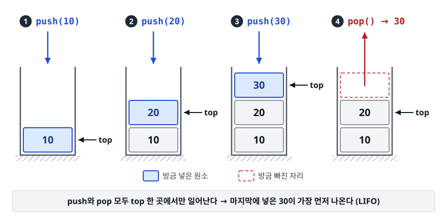
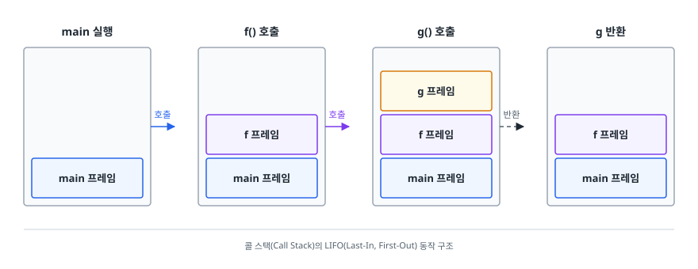
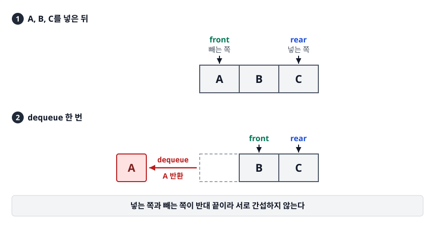
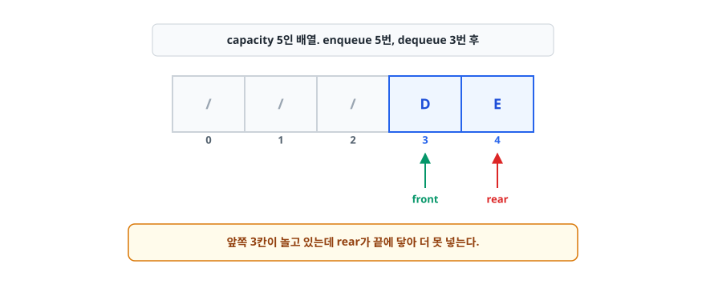
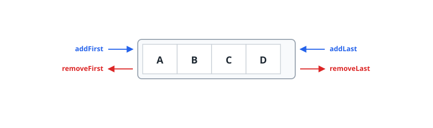
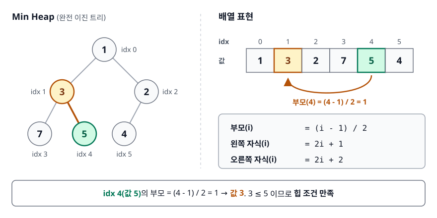
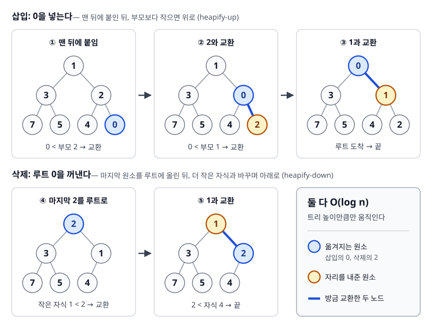

# 스택과 큐 (Stack & Queue)

> 난이도 ⭐ · 함수 호출, BFS, 작업 처리, 되돌리기는 모두 꺼내는 순서가 정해진 문제입니다. "무엇을 먼저 꺼낼 것인가"라는 규칙 하나로 자료구조가 갈리는데, 그 규칙이 이런 문제와 왜 정확히 맞아떨어지는지를 설명합니다.

## 학습 목표

- [ ] LIFO와 FIFO가 어떤 문제 구조와 대응되는지 설명할 수 있다
- [ ] 스택/큐를 배열로 구현할 때와 연결 리스트로 구현할 때의 트레이드오프를 말할 수 있다
- [ ] 원형 큐가 왜 필요한지, 가득 참과 비어 있음을 어떻게 구분하는지 설명할 수 있다
- [ ] 우선순위 큐가 왜 힙으로 구현되는지 설명할 수 있다
- [ ] Java에서 `Stack` 대신 `ArrayDeque`를 권하는 이유를 설명할 수 있다

## 선행 지식

- [01-array-list.md](./01-array-list.md) - 배열과 연결 리스트의 차이. 이 문서의 구현 파트가 그 위에 올라갑니다.

---

## 1. 왜 필요한가

배열이나 연결 리스트는 "아무 데나 넣고 아무 데나 뺄 수 있는" 자유로운 그릇입니다. 그런데 실제 프로그램에서 마주치는 문제 중 상당수는 **꺼내는 순서가 이미 정해져 있습니다**.

함수가 A → B → C 순으로 호출됐다면 반환은 반드시 C → B → A입니다. 중간에 B가 먼저 끝날 수 없습니다. 반대로 프린터에 인쇄 작업 세 개를 보냈다면 먼저 보낸 것부터 나와야 합니다. 나중에 보낸 게 먼저 나오면 그건 버그입니다. 이럴 때 "아무 위치나 접근 가능한" 자료구조를 쓰면 규칙을 코드 곳곳에서 손으로 지켜야 하고, 어겨도 컴파일러가 잡아 주지 않습니다.

스택과 큐는 **의도적으로 기능을 줄여서** 이 문제를 풉니다. 넣는 곳과 빼는 곳을 한 군데씩으로 못 박아 버립니다. 그러면 규칙 위반이 애초에 불가능해지고, 구현체는 그 제약을 이용해 모든 연산을 O(1)로 만들 수 있습니다. **제약이 곧 성능이자 안전장치**라는 게 이 두 구조의 핵심입니다. 이렇게 "저장 방식이 아니라 연산 규칙으로 정의된" 자료구조를
**추상 자료형(ADT, Abstract Data Type)** 이라고 부릅니다.

---

## 2. 스택 (Stack)

스택은 **한쪽 끝에서만 넣고 빼는** 자료구조입니다. 마지막에 들어간 것이 처음 나온다고 해서 LIFO(Last In First Out, 후입선출)라고 합니다.

비유하자면 식당 접시 더미입니다. 새 접시는 맨 위에 올리고 쓸 때도 맨 위 것을 집습니다. 맨 아래 접시를 빼려면 위를 다 치워야 합니다.

> **비유의 한계**: 접시는 물리적으로 아래에서도 뺄 수 있습니다. 스택은 API 자체가 그걸 허용하지 않습니다. "안 하는 것"이 아니라 "못 하는 것"입니다.

### 동작

<!-- diagram:cs-stack-queue-1 -->


<!-- 위 그림이 대체한 원본 ASCII.
     내용을 고칠 때는 그림도 함께 갱신할 것.
```
 push(10)   push(20)   push(30)   pop() → 30
                        ┌────┐
             ┌────┐     │ 30 │◀top  ┌────┐
  ┌────┐     │ 20 │◀top ├────┤      │ 20 │◀top
  │ 10 │◀top │ 10 │     │ 20 │      ├────┤
  ├────┤     ├────┤     ├────┤      │ 10 │
  │////│     │////│     │ 10 │      ├────┤
  └────┘     └────┘     └────┘      └────┘
```
-->

핵심 연산은 세 개입니다.

| 연산 | 하는 일 | 복잡도 |
|------|--------|--------|
| `push(x)` | 맨 위에 x를 올린다 | O(1) |
| `pop()` | 맨 위 원소를 빼서 반환한다 | O(1) |
| `peek()` / `top()` | 맨 위를 보기만 한다 (빼지 않음) | O(1) |

### 배열로 구현하기

`top` 인덱스 하나만 관리하면 됩니다.

```java
class ArrayStack {
    private int[] data = new int[16];
    private int top = -1;               // 비어 있으면 -1

    void push(int x) {
        if (top == data.length - 1) {   // 꽉 찼으면 확장
            data = Arrays.copyOf(data, data.length * 2);
        }
        data[++top] = x;
    }

    int pop() {
        if (top < 0) throw new NoSuchElementException("stack is empty");
        return data[top--];
    }

    int peek() {
        if (top < 0) throw new NoSuchElementException("stack is empty");
        return data[top];
    }
}
```

끝에서만 다루니 원소를 밀 일이 없습니다. 배열의 약점인 O(n) 이동이 애초에 발생하지 않습니다. 확장 비용은 [동적 배열의 amortized O(1)](./01-array-list.md) 논리로 분할 상환됩니다.

### 연결 리스트로 구현하기

head 쪽에서만 넣고 빼면 됩니다. `push`는 새 노드를 만들어 head로 삼고, `pop`은 head를 다음 노드로 옮기면 끝입니다. head 삽입/삭제는 연결 리스트가 O(1)로 잘하는 일이라 궁합이 좋습니다.

| 구현 | 장점 | 단점 |
|------|------|------|
| 배열 기반 | 캐시 지역성이 좋아 빠름, 원소당 메모리 적음 | 확장 시 O(n) 복사 발생 |
| 연결 기반 | 확장 비용 없음, 최대 크기 예측 불필요 | 노드마다 포인터/헤더 오버헤드, 캐시 미스 잦음 |

**언제 뭘 쓰나**: 특별한 이유가 없으면 배열 기반입니다. 원소 크기가 아주 크거나 최대 크기 편차가 극단적일 때만 연결 기반을 고려합니다.

### 실제 사용처

**콜 스택(Call Stack)** — 스택이 자료구조가 아니라 하드웨어/런타임 수준에서 구현된 사례입니다. 함수를 호출하면 지역 변수와 복귀 주소를 담은 스택 프레임(Stack Frame)이 쌓이고, 반환하면 걷힙니다. 재귀가 너무 깊으면 이 영역이 바닥나 `StackOverflowError`가 납니다.

<!-- diagram:cs-stack-queue-2 -->


<!-- 위 그림이 대체한 원본 ASCII.
     내용을 고칠 때는 그림도 함께 갱신할 것.
```
 main 실행       f() 호출        g() 호출        g 반환
┌─────────┐    ┌─────────┐    ┌─────────┐    ┌─────────┐
│         │    │         │    │ g 프레임│    │         │
│         │    │ f 프레임│    │ f 프레임│    │ f 프레임│
│main 프레임│  │main 프레임│  │main 프레임│  │main 프레임│
└─────────┘    └─────────┘    └─────────┘    └─────────┘
```
-->

**되돌리기/다시하기(Undo/Redo), 브라우저 뒤로/앞으로** — 스택 두 개를 씁니다. 작업을 하면 undo 스택에 쌓고 redo 스택을 비웁니다. Ctrl+Z는 undo에서 pop해 redo로 push하고, Ctrl+Y는 그 반대입니다. "undo 후 새 작업을 하면 redo가 사라지는" 동작이 이 구조에서 저절로 나옵니다. (브라우저의 History API는 실제로는 항목 리스트와 현재 위치 포인터입니다. 그래서 임의 위치 이동도 되지만, 동작의 뼈대는 두 스택 모델과 같습니다.)

**괄호 검사와 수식 파싱** — 여는 괄호는 push하고, 닫는 괄호를 만나면 pop해서 짝을 확인합니다. 끝났을 때 스택이 비어 있어야 올바른 식입니다. 컴파일러 구문 분석기가 이 원리를 씁니다.

**DFS(깊이 우선 탐색)** — "가장 최근에 발견한 정점부터 파고든다"가 곧 LIFO입니다. 재귀로 짜면 콜 스택이, 반복문으로 짜면 명시적 스택이 그 역할을 합니다.

---

## 3. 큐 (Queue)

큐는 **한쪽 끝에서 넣고 반대쪽 끝에서 빼는** 자료구조로, FIFO(First In First Out, 선입선출)입니다. 넣는 쪽을 rear/tail, 빼는 쪽을 front/head라고 부릅니다. 비유하자면 은행 대기 줄입니다. 먼저 온 사람이 먼저 창구에 가고, 새로 온 사람은 뒤에 섭니다.

> **비유의 한계**: 현실 줄에서는 사람이 나가면 뒤에 있던 사람들이 앞으로 걸어옵니다. 배열로 구현한 큐에서는 그 "걸어오기"가 O(n) 비용입니다. 그래서 4장의 원형 큐로 그 이동 자체를 없앱니다.

### 동작

<!-- diagram:cs-stack-queue-3 -->


<!-- 위 그림이 대체한 원본 ASCII.
     내용을 고칠 때는 그림도 함께 갱신할 것.
```
 A, B, C 를 넣은 뒤 dequeue 한 번

  front          rear              front      rear
    ▼             ▼                  ▼         ▼
  ┌───┬───┬───┐        dequeue     ┌───┬───┬───┐
  │ A │ B │ C │        ─────────▶  │   │ B │ C │
  └───┴───┴───┘        A 반환      └───┴───┴───┘

  넣는 쪽과 빼는 쪽이 반대 끝이라 서로 간섭하지 않는다
```
-->

연산은 `enqueue(x)`(뒤에 넣기), `dequeue()`(앞에서 빼기), `peek()`(맨 앞 보기) 세 개입니다. 전부 O(1)입니다. Java에서는 각각 `offer`, `poll`, `peek`이라는 이름을 씁니다.

### 실제 사용처

**BFS(너비 우선 탐색)** — "먼저 발견한 정점부터 처리한다"가 곧 FIFO입니다. 이 성질 때문에 가중치 없는 그래프에서 최단 경로가 보장됩니다. 자세한 건 [03-tree-graph.md](./03-tree-graph.md)에서 다룹니다.

**작업 큐 / 스레드 풀** — 요청을 큐에 넣고 워커 스레드들이 하나씩 꺼내 처리합니다. Java `ThreadPoolExecutor`가 내부에 `BlockingQueue`를 두고 이렇게 동작합니다. 큐가 비면 워커가 블로킹되고, 큐가 찬 상태에서 스레드도 최대치면 거부 정책이 발동합니다. 큐의 길이는 곧 **부하 흡수 버퍼**의 크기입니다.

**메시지 큐** — Kafka, RabbitMQ, AWS SQS 같은 미들웨어가 프로세스 사이에서 같은 역할을 합니다. 생산자와 소비자의 처리 속도가 달라도 큐가 완충해 주므로 시스템을 느슨하게 결합할 수 있습니다. 그 밖에 키보드 입력 버퍼, 프린터 스풀러, OS 라운드 로빈 스케줄러의 준비 큐도 전부 FIFO입니다.

---

## 4. 원형 큐 (Circular Queue)

배열로 큐를 순진하게 만들면 이런 일이 생깁니다.

<!-- diagram:cs-stack-queue-4 -->


<!-- 위 그림이 대체한 원본 ASCII.
     내용을 고칠 때는 그림도 함께 갱신할 것.
```
capacity 5인 배열. enqueue 5번, dequeue 3번 후

  ┌───┬───┬───┬───┬───┐
  │ / │ / │ / │ D │ E │
  └───┴───┴───┴───┴───┘
    0   1   2   3   4
              ▲       ▲
            front    rear

앞쪽 3칸이 놀고 있는데 rear가 끝에 닿아 더 못 넣는다.
```
-->

해결책은 두 가지입니다. dequeue할 때마다 전체를 앞으로 당기거나 — 그럼 dequeue가 O(n)이 됩니다 —
**rear가 끝에 닿으면 0번으로 되감는** 것입니다. 후자가 원형 큐입니다.

### 동작 원리

배열을 논리적으로 링처럼 취급하고 인덱스를 나머지 연산으로 감습니다. `rear = (rear + 1) % capacity`, `front = (front + 1) % capacity`. 위 상태에서 F를 넣으면 rear가 5가 아니라 0으로 돌아가 `[F][ ][ ][D][E]`가 되고 논리적인 순서는 여전히 D → E → F입니다.

### 가득 참과 비어 있음의 구분

여기가 원형 큐의 유일한 함정입니다. `front == rear`가 되는 순간이 두 번 있습니다 — 완전히 비었을 때와 완전히 찼을 때입니다. 인덱스만 봐서는 구분이 안 되므로 다음 중 하나를 씁니다.

| 방법 | 판정 | 대가 |
|------|------|------|
| 한 칸 비워 두기 | 빔: `front == rear` / 참: `(rear+1) % cap == front` | 용량 1칸 손해 |
| size 카운터 유지 | 빔: `size == 0` / 참: `size == cap` | 변수 하나 추가, 멀티스레드면 동기화 대상 |

가장 흔한 건 size 카운터입니다. 코드가 제일 읽기 쉽습니다.

```java
class CircularQueue {
    private final int[] data;
    private int front = 0, size = 0;

    CircularQueue(int capacity) { this.data = new int[capacity]; }

    boolean offer(int x) {
        if (size == data.length) return false;      // 가득 참
        data[(front + size) % data.length] = x;     // rear 위치를 계산으로 구함
        size++;
        return true;
    }

    int poll() {
        if (size == 0) throw new NoSuchElementException("queue is empty");
        int v = data[front];
        front = (front + 1) % data.length;
        size--;
        return v;
    }
}
```

용량이 2의 거듭제곱이면 `% cap`을 `& (cap - 1)`로 바꿀 수 있어 나눗셈보다 빠릅니다. LMAX Disruptor 같은 고성능 링 버퍼와 Java 8까지의 `ArrayDeque`가 이 방식을 썼습니다. (JDK 9 이후 `ArrayDeque`는 2의 거듭제곱 제약을 버리고 끝에 닿으면 0으로 되돌리는 조건 분기를 씁니다. 원형 배열인 건 그대로입니다.)

---

## 5. 덱 (Deque, Double-Ended Queue)

양쪽 끝에서 모두 넣고 뺄 수 있는 구조입니다. 발음은 "덱".

<!-- diagram:cs-stack-queue-5 -->


<!-- 위 그림이 대체한 원본 ASCII.
     내용을 고칠 때는 그림도 함께 갱신할 것.
```
addFirst ─▶ ┌───┬───┬───┬───┐ ◀─ addLast
            │ A │ B │ C │ D │
removeFirst ◀┴───┴───┴───┴───┘ ─▶ removeLast
```
-->

한쪽 끝만 쓰면 스택, 한쪽에서 넣고 반대쪽에서 빼면 큐입니다. 덱은 **스택과 큐를 모두 포함하는 상위 개념**입니다. 그래서 언어 표준 라이브러리는 스택/큐를 따로 두기보다 덱 하나로 통합하는 추세이고, Java의 `Deque` 인터페이스와 `ArrayDeque` 구현이 대표적입니다.

```java
Deque<Integer> stack = new ArrayDeque<>();
stack.push(1); stack.push(2);   // push = addFirst
stack.pop();                    // 2   — 앞쪽에서만 다루면 LIFO

Deque<Integer> queue = new ArrayDeque<>();
queue.offer(1); queue.offer(2); // offer = addLast
queue.poll();                   // 1   — 뒤로 넣고 앞에서 빼면 FIFO
```

---

## 6. 우선순위 큐 (Priority Queue)

큐는 먼저 온 순서로 처리합니다. 그런데 응급실은 그러면 안 됩니다. 나중에 온 중환자가 먼저입니다.
**들어온 순서가 아니라 우선순위로 꺼내는** 큐가 필요합니다. 정렬된 배열로 만들면 꺼내기는 O(1)인데 넣을 때 자리를 찾아 밀어야 해서 O(n)이고, 정렬 안 된 배열이면 넣기는 O(1)인데 꺼낼 때 최솟값을 찾느라 O(n)입니다. 둘 다 한쪽이 O(n)입니다. **힙(Heap)** 은 이 둘을 O(log n)으로 맞춰 균형을 잡습니다.

### 힙의 구조

힙은 **완전 이진 트리(Complete Binary Tree)** 이면서 **부모가 자식보다 항상 크거나(Max Heap), 항상 작은(Min Heap)** 구조입니다. 형제끼리는 순서가 없다는 점이 중요합니다. 전체 정렬이 아니라 "부모-자식 관계만" 지키므로 유지 비용이 쌉니다. 그리고 완전 이진 트리는 빈틈없이 채워지므로
**포인터 없이 배열로 표현할 수 있습니다.** 덕분에 메모리도 아끼고 캐시 지역성도 좋습니다.

<!-- diagram:cs-stack-queue-6 -->


<!-- 위 그림이 대체한 원본 ASCII.
     내용을 고칠 때는 그림도 함께 갱신할 것.
```
Min Heap                        배열 표현
       1                        idx:  0  1  2  3  4  5
      / \                            [1][3][2][7][5][4]
     3   2
    / \  /                      부모(i)      = (i - 1) / 2
   7  5 4                       왼쪽 자식(i)  = 2i + 1
                                오른쪽 자식(i)= 2i + 2

   idx 4(값 5)의 부모 = (4-1)/2 = 1 → 값 3.  3 ≤ 5 이므로 힙 조건 만족
```
-->

### 삽입과 삭제

삽입은 배열 맨 뒤에 붙인 뒤 부모보다 작으면 계속 위로 올라갑니다(heapify-up). 삭제는 루트를 꺼내고 마지막 원소를 루트에 올린 뒤 더 작은 자식과 바꾸며 내려갑니다(heapify-down). 둘 다 트리 높이만큼만 움직이므로 O(log n)입니다.

<!-- diagram:cs-stack-queue-7 -->


<!-- 위 그림이 대체한 원본 ASCII.
     내용을 고칠 때는 그림도 함께 갱신할 것.
```
삽입: 0을 넣는다                              삭제: 루트 0을 꺼낸다

 ① 맨 뒤에 붙임   ② 2와 교환   ③ 1과 교환      ④ 마지막 2를 루트로  ⑤ 1과 교환
      1              1            0                  2                  1
     / \            / \          / \                / \                / \
    3   2          3   0        3   1              3   1              3   2
   / \  / \       / \  / \     / \  / \           / \  /             / \  /
  7  5 4  0      7  5 4  2    7  5 4  2          7  5 4             7  5 4
```
-->

### 코드로 보기

```java
// Java 표준 라이브러리 — 내부가 배열 기반 이진 힙이다
PriorityQueue<Integer> minHeap = new PriorityQueue<>();
minHeap.offer(5); minHeap.offer(1); minHeap.offer(3);
minHeap.poll();   // 1  — 넣은 순서와 무관하게 가장 작은 값

PriorityQueue<Integer> maxHeap = new PriorityQueue<>(Comparator.reverseOrder());

// 커스텀 우선순위: 마감이 임박한 작업 먼저
record Task(String name, int deadline) {}
PriorityQueue<Task> tasks = new PriorityQueue<>(Comparator.comparingInt(Task::deadline));
```

### 주의할 점

`PriorityQueue`는 **루트만 정렬을 보장합니다.** `for-each`로 순회하면 정렬된 순서가 아니라 내부 배열 순서가 나오므로, 정렬된 결과가 필요하면 `poll()`을 반복해야 합니다. 또 **동점 처리 순서가 보장되지 않아서** 우선순위가 같은 원소들 사이의 FIFO까지 원하면 비교자에 삽입 순번을 2차 기준으로 넣어야 합니다. `contains(x)`와 `remove(x)`가 O(n)인 것도 기억해 둘 만합니다. 힙은 임의 원소를 빨리 찾는 구조가 아닙니다.

| 연산 | 복잡도 |
|------|--------|
| `peek()` (최소/최대 조회) | O(1) |
| `offer()` (삽입) | O(log n) |
| `poll()` (최소/최대 제거) | O(log n) |
| `contains()`, `remove(Object)` | O(n) |

**언제 쓰나**: 다익스트라 최단 경로(가장 가까운 정점부터), 작업 스케줄러(마감 임박 순), Top-K 문제(크기 k 힙을 유지하며 O(n log k)), 힙 정렬에 씁니다.

---

## 7. 실무에서는

Java에서 스택이 필요할 때 `java.util.Stack`을 쓰면 안 된다는 조언이 유명한데, 이유는 두 가지입니다.

**첫째, `push`/`pop`/`peek` 같은 주요 연산이 전부 `synchronized`입니다.** JDK 1.0 시절 `Vector`를 상속한 탓입니다. 단일 스레드에서도 락 획득 비용을 내는데, 개별 메서드 동기화라 "peek 후 pop" 같은 복합 연산은 어차피 원자적이지 않습니다. 안전하지도 않으면서 비용만 냅니다.

**둘째, `Vector` 상속으로 캡슐화가 깨져 있습니다.** `stack.get(0)`, `stack.add(0, x)` 같은 List 메서드 호출이 그대로 컴파일되어 LIFO 규칙을 강제한다는 존재 이유가 무너집니다. 심지어 인덱스 0은 top이 아니라 바닥이라 헷갈리기까지 합니다.

| 필요한 것 | 권장 구현체 | 이유 |
|----------|-----------|------|
| 단일 스레드 스택/큐 | `ArrayDeque` | 원형 배열 기반, 동기화 없음, `Deque`만 노출 |
| `null`을 담아야 하는 큐 | `LinkedList` | `ArrayDeque`는 `null` 금지(빔 신호와 충돌) |
| 우선순위 처리 | `PriorityQueue` | 배열 기반 이진 힙 |
| 생산자-소비자 | `ArrayBlockingQueue` 등 | 비면 `take()`가, 차면 `put()`이 블로킹 |
| 논블로킹 동시 접근 | `ConcurrentLinkedDeque` | 락 없는 동시성 |

---

## 8. 면접 포인트

> 면접에서 이 주제가 나오면 이렇게 답한다

**Q. Stack과 Queue의 차이와 활용 사례를 말해 주세요.**

A. 꺼내는 순서 규칙이 다릅니다. Stack은 LIFO, Queue는 FIFO입니다. 이 규칙이 문제 구조와 대응되는 게 중요한데, 함수 호출은 나중에 부른 게 먼저 끝나야 하니 콜 스택이 LIFO이고 DFS도 같은 이유로 스택을 씁니다. 반대로 작업 대기열이나 BFS는 먼저 들어온 것을 먼저 처리해야 하므로 큐입니다. BFS가 최단 경로를 보장하는 것도 FIFO 덕에 가까운 정점부터 방문하기 때문입니다.

- 꼬리 질문: "둘 다 O(1)인 이유는?" → 접근 지점이 끝으로 고정되어 있어 원소 이동이 필요 없습니다. 배열의 O(n) 삽입/삭제는 중간을 건드릴 때 생기는 비용인데, 그 경우가 없습니다.

**Q. Java에서 `Stack` 대신 `ArrayDeque`를 권하는 이유는?**

A. `Stack`은 `Vector`를 상속해서 주요 연산이 전부 `synchronized`입니다. 단일 스레드에서도 락 비용을 내는데 복합 연산이 원자적인 것도 아니라 실익이 없고, `get(index)` 같은 List 메서드가 노출되어 LIFO 제약도 깨집니다. `ArrayDeque`는 원형 배열 기반이라 캐시 효율이 좋고 동기화가 없으며, `Deque`만 노출해 오용을 막습니다. 다만 `null`을 허용하지 않습니다.

- 꼬리 질문: "멀티스레드라면?" → `ArrayDeque`도 스레드 안전하지 않습니다. `ConcurrentLinkedDeque`나 `BlockingQueue` 계열을 씁니다.

**Q. 원형 큐가 왜 필요하고, 가득 참과 비어 있음을 어떻게 구분하나요?**

A. 배열 큐에서 dequeue를 반복하면 앞쪽 공간이 노는데, 이를 재사용하려고 전체를 당기면 O(n)이 됩니다. 원형 큐는 인덱스를 `% capacity`로 되감아 이동 없이 앞 공간을 씁니다. 문제는 `front == rear`가 빈 상태와 꽉 찬 상태 양쪽에서 성립한다는 점인데, 한 칸을 비워 두거나 size 카운터로 구분합니다.

- 꼬리 질문: "실제로 쓰이는 데가 있나요?" → `ArrayDeque` 내부, 네트워크 링 버퍼, 오디오 버퍼 등. 고성능 링 버퍼는 용량을 2의 거듭제곱으로 잡아 `% cap`을 비트 AND로 바꾸는 것이 정석입니다.

**Q. 우선순위 큐는 왜 힙으로 구현하나요?**

A. 정렬 배열은 삽입 O(n), 미정렬 배열은 추출 O(n)이라 한쪽이 항상 느립니다. 힙은 전체 정렬 대신 "부모가 자식보다 작다"는 부분 순서만 유지해서 삽입과 추출을 모두 O(log n)으로 맞춥니다. 완전 이진 트리라 포인터 없이 배열로 표현되고, 부모는 `(i-1)/2`, 자식은 `2i+1`, `2i+2`로 계산됩니다. 최솟값 조회는 루트라서 O(1)입니다.

- 꼬리 질문: "힙을 순회하면 정렬된 순서인가요?" → 아닙니다. 루트만 보장됩니다. 정렬 결과가 필요하면 `poll()`을 반복해야 하고 그게 힙 정렬입니다.

---

## 자주 하는 실수

| 실수 | 왜 틀렸나 | 올바른 이해 |
|------|----------|-----------|
| `Queue<Integer> q = new LinkedList<>()` 관례적 사용 | 동작은 하지만 노드마다 객체 할당·캐시 미스 | `ArrayDeque`가 대부분 더 빠르다 |
| `PriorityQueue`를 순회하면 정렬됨 | 힙은 루트만 보장하는 부분 순서다 | 정렬이 필요하면 `poll()` 반복 |
| 우선순위가 같으면 FIFO일 것 | 힙은 안정 정렬이 아니다 | 삽입 순번을 2차 비교 기준으로 넣어야 보장된다 |
| `ArrayDeque`에 `null` 저장 | `poll()`의 "비었음" 신호와 충돌해 `NullPointerException` | 값이 없음은 `Optional`이나 센티널로 표현 |
| 원형 큐에서 `front == rear`면 비었다고 판단 | 꽉 찬 상태에서도 같은 조건이 성립 | size 카운터 또는 한 칸 비우기로 구분 |
| 재귀 DFS를 무한정 깊게 | 콜 스택 고갈 → `StackOverflowError` | 깊이가 크면 명시적 스택으로 반복문 전환 |

---

## 한 줄 정리

스택과 큐는 "넣고 빼는 위치를 하나로 못 박는" 제약으로 모든 연산을 O(1)로 만들고 규칙 위반을 구조적으로 차단하는 추상 자료형입니다. 덱은 이 둘을 포함하고, 힙은 여기에 우선순위 개념을 얹은 것입니다.

---

## 연관 개념

- [01-array-list.md](./01-array-list.md) - 스택/큐의 바닥에 깔리는 두 가지 저장 방식
- [03-tree-graph.md](./03-tree-graph.md) - DFS는 스택, BFS는 큐를 쓰는 이유
- [04-hash-table.md](./04-hash-table.md) - 순서 대신 키로 꺼내는 자료구조
- [qna-data-structure.md](./qna-data-structure.md) - 이 주제 면접 질문 (Q2, Q5, Q11)
- [프로세스와 스레드](../operating-system/01-process-thread.md) - 스택 영역과 콜 스택 프레임
- [알고리즘 QnA](../algorithm/qna-algorithm.md) - BFS/DFS를 쓰는 문제 유형
