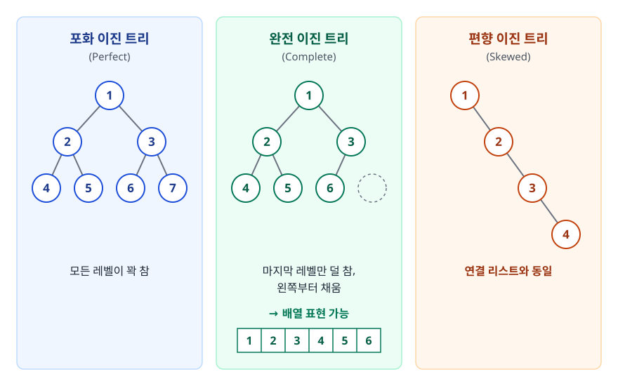
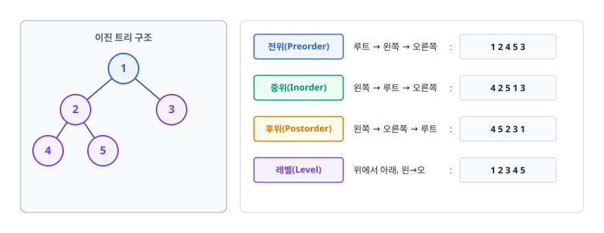
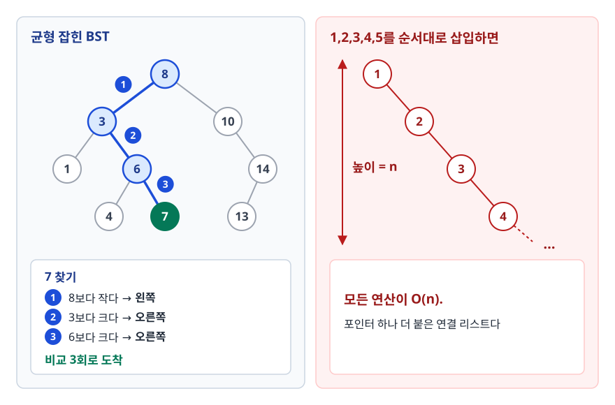
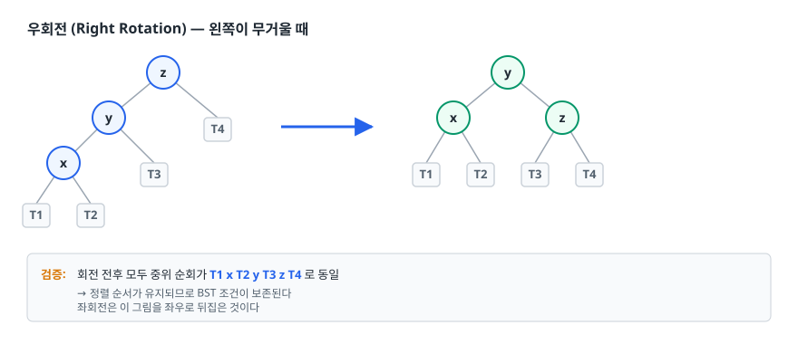
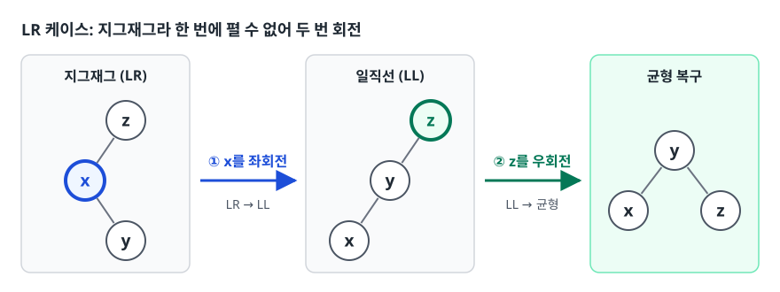
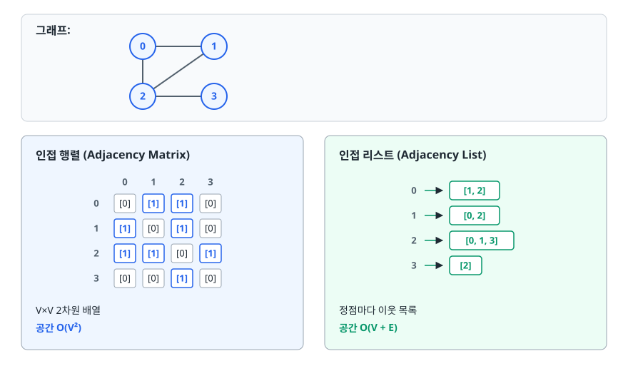
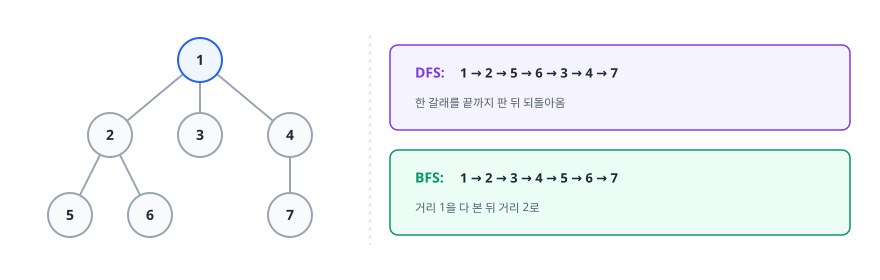

# 트리와 그래프 (Tree & Graph)

> 난이도 ⭐⭐ · 계층 관계와 네트워크 관계를 자료구조로 어떻게 표현할까요? 트리가 균형을 잃으면
> 왜 연결 리스트로 퇴화하는지, 그리고 탐색 순서 하나만 바꿔도 풀리는 문제가 어떻게 달라지는지를
> 이 문서에서 설명합니다.

## 학습 목표

- [ ] 트리와 그래프의 구조적 차이를 정의 수준에서 구분할 수 있다
- [ ] BST가 편향되는 상황과 그 결과를 설명할 수 있다
- [ ] AVL과 Red-Black Tree의 회전이 무엇을 복구하는지 설명할 수 있다
- [ ] 인접 행렬과 인접 리스트를 그래프 밀도에 따라 선택할 수 있다
- [ ] DFS와 BFS 중 문제에 맞는 것을 근거와 함께 고를 수 있다
- [ ] 전위/중위/후위 순회의 쓰임새를 각각 하나씩 댈 수 있다

## 선행 지식

- [01-array-list.md](./01-array-list.md) - 노드와 포인터 개념
- [02-stack-queue.md](./02-stack-queue.md) - DFS는 스택, BFS는 큐를 쓴다

---

## 1. 왜 필요한가

배열과 리스트가 표현하는 건 **일렬로 늘어선 관계**뿐입니다. 그런데 현실의 데이터는 대부분 일렬이 아닙니다.

파일 시스템에서 폴더는 여러 하위 폴더를 갖고, 하위 폴더는 다시 자기 하위를 갖습니다. HTML의 `<div>`도
마찬가지고, 조직도와 카테고리, 댓글의 대댓글도 그렇습니다. 이런 것이 **한 방향으로 갈라지는 계층 구조**입니다.
루트가 하나 있고 각 노드의 부모는 정확히 하나이며, 돌아오는 길은 없습니다. 이걸 트리라고 부릅니다.

지하철 노선도는 다릅니다. 역 A에서 B로 갈 수 있고 B에서 A로도 갈 수 있으며, 빙 돌아 제자리로
오는 경로도 있습니다. 루트라 부를 만한 것도 없습니다. SNS의 친구 관계, 웹 페이지의 링크, 도로망도
같은 성질이고, 이런 **자유로운 연결 관계**가 그래프입니다. 트리는 그래프의 특수한 경우 —
정확히는 **사이클이 없고 연결된 그래프** — 이고, 제약이 하나 더 붙은 만큼 더 많은 걸 보장할 수
있어서 검색 같은 작업을 더 빠르게 만들 수 있습니다.

| 구분 | 트리 | 그래프 |
|------|------|--------|
| 사이클 | 없음 | 있을 수 있음 |
| 루트 | 있음 | 개념 자체가 없음 |
| 간선 수 | 정점 N개면 정확히 N-1개 | 0개부터 N(N-1)/2개까지 (무방향 단순 그래프 기준) |
| 두 노드 사이 경로 | 유일 | 여러 개이거나 없을 수도 |
| 방향 | 부모 → 자식 | 방향/무방향 모두 가능 |
| 대표 사례 | DOM, 파일 시스템, 조직도 | 지도, SNS, 의존성 그래프 |

**언제 뭘 쓰나**: "상위-하위" 관계가 명확하고 순환이 생길 수 없다면 트리를 씁니다. 임의의 두 대상이
서로 연결될 수 있으면 그래프입니다.

---

## 2. 이진 트리 (Binary Tree)

**자식을 최대 두 개까지만** 갖는 노드로 이루어진 트리가 이진 트리입니다. 두 자식은 왼쪽(left)과
오른쪽(right)으로 구분합니다. 자식 수를 2로 제한하는 이유는 단순합니다. 매 단계에서 선택지를 둘로
나눌 수 있으면 n개를 log₂n번 만에 좁힐 수 있고, 구현도 포인터 두 개로 끝납니다.

### 형태에 따른 분류

<!-- diagram:cs-tree-graph-1 -->


<!-- 위 그림이 대체한 원본 ASCII.
     내용을 고칠 때는 그림도 함께 갱신할 것.
```
포화 이진 트리          완전 이진 트리          편향 이진 트리
(Perfect)              (Complete)              (Skewed)

      1                     1                      1
    /   \                 /   \                     \
   2     3               2     3                     2
  / \   / \             / \   /                       \
 4   5 6   7           4  5  6                         3
                                                        \
모든 레벨이 꽉 참      마지막 레벨만 덜 참,             4
                       왼쪽부터 채움
                       → 배열 표현 가능              연결 리스트와 동일
```
-->

완전 이진 트리가 중요한 이유는 **빈틈이 없어서 배열로 표현할 수 있다**는 데 있습니다(힙이 이 성질을 씁니다).
편향 트리는 반대로 트리의 이점을 전부 잃은 상태입니다. 이걸 막는 것이 3장의 핵심 주제입니다.

### 트리 순회 3종

트리는 일렬이 아니라서 "처음부터 끝까지"라는 순서가 자명하지 않습니다. **루트를 언제 방문하느냐**에 따라
세 가지가 나옵니다. 왼쪽을 오른쪽보다 먼저 보는 건 셋 다 같습니다.

<!-- diagram:cs-tree-graph-2 -->


<!-- 위 그림이 대체한 원본 ASCII.
     내용을 고칠 때는 그림도 함께 갱신할 것.
```
      1          전위(Preorder)  루트 → 왼쪽 → 오른쪽  :  1 2 4 5 3
     / \         중위(Inorder)   왼쪽 → 루트 → 오른쪽  :  4 2 5 1 3
    2   3        후위(Postorder) 왼쪽 → 오른쪽 → 루트  :  4 5 2 3 1
   / \           레벨(Level)     위에서 아래, 왼→오    :  1 2 3 4 5
  4   5
```
-->

```java
void traverse(Node n) {
    if (n == null) return;
    // visit(n);          ← 여기서 처리하면 전위
    traverse(n.left);
    // visit(n);          ← 여기서 처리하면 중위
    traverse(n.right);
    // visit(n);          ← 여기서 처리하면 후위
}
```

`visit(n)` 한 줄의 위치만 바뀌는데 쓰임새가 완전히 달라집니다.

| 순회 | 성질 | 쓰이는 곳 |
|------|------|----------|
| 전위 | 부모를 자식보다 먼저 처리 | 트리 복사, 직렬화, 디렉터리 구조 출력 |
| 중위 | **BST에서 오름차순 정렬** | 정렬된 목록 얻기, 범위 조회 |
| 후위 | 자식을 부모보다 먼저 처리 | 트리 삭제(자식부터 지워야 함), 디렉터리 용량 합산, 후위 표기식 계산 |
| 레벨 | 깊이 순 | 최단 깊이 탐색, 트리 시각화 |

"디렉터리 용량을 구하려면 하위 폴더 크기를 먼저 알아야 한다" — 이게 후위 순회를 써야 하는 이유입니다.
반대로 "폴더 이름을 트리 모양으로 출력"은 부모를 먼저 찍어야 하니 전위입니다. 레벨 순회만 재귀로
안 되고 큐가 필요합니다. 이게 곧 BFS입니다.

---

## 3. 이진 탐색 트리와 균형

### BST의 정의

이진 탐색 트리는 **왼쪽 서브트리의 모든 값 < 노드 값 < 오른쪽 서브트리의 모든 값**을 만족하는 이진 트리입니다.
"왼쪽 자식 하나만" 작으면 안 됩니다. **서브트리 전체**가 작아야 합니다.

<!-- diagram:cs-tree-graph-3 -->


<!-- 위 그림이 대체한 원본 ASCII.
     내용을 고칠 때는 그림도 함께 갱신할 것.
```
 균형 잡힌 BST                     1,2,3,4,5를 순서대로 삽입하면

        8                            1
      /   \                           \
     3      10                         2
    / \       \                         \
   1   6       14                         3
      / \      /                           \
     4   7   13                              4  ... 높이 = n

 7 찾기: 8보다 작다→왼쪽, 3보다 크다→오른쪽,     모든 연산이 O(n).
         6보다 크다→오른쪽. 비교 3회로 도착      포인터 하나 더 붙은 연결 리스트다
```
-->

왼쪽처럼 균형이 잡혀 있으면 한 번 비교할 때마다 후보의 절반이 사라집니다. 이진 탐색을 트리로
구현한 것입니다. **중위 순회하면 1 3 4 6 7 8 10 13 14** — 정렬된 순서가 나옵니다.

### 편향 문제

BST의 O(log n)은 **트리 높이가 log n일 때**의 이야기입니다. 그런데 높이는 삽입 순서에 좌우됩니다.
위 오른쪽처럼 정렬된 값을 순서대로 넣으면 한쪽으로만 자식이 붙어서 높이가 n이 되고, 모든 연산이 O(n)으로
퇴화하는 겁니다. **정렬된 데이터를 넣는 건 아주 흔한 일**이라 더 심각합니다. DB에서 ID 순으로 읽어와 넣거나
타임스탬프 순으로 로그를 넣으면, 그게 그대로 최악의 경우입니다. "운이 나쁠 때"가 아니라 "평범한 입력"에서 터집니다.

그래서 삽입/삭제 때 **스스로 모양을 고치는** 트리가 필요합니다. 이런 트리를 자가 균형 이진 탐색 트리
(Self-Balancing BST)라고 부르고, AVL과 Red-Black Tree가 대표입니다.

### 회전 (Rotation)

균형을 고치는 유일한 도구가 회전입니다. **부모-자식 관계를 바꾸되 BST 조건은 그대로 지킵니다.**
포인터 몇 개만 손대므로 O(1)입니다.

<!-- diagram:cs-tree-graph-4 -->


<!-- 위 그림이 대체한 원본 ASCII.
     내용을 고칠 때는 그림도 함께 갱신할 것.
```
우회전 (Right Rotation) — 왼쪽이 무거울 때

      z                         y
     / \                      /   \
    y   T4      ──▶          x     z
   / \                      / \   / \
  x   T3                  T1  T2 T3  T4
 / \
T1  T2

검증: 회전 전후 모두 중위 순회가 T1 x T2 y T3 z T4 로 동일
      → 정렬 순서가 유지되므로 BST 조건이 보존된다
      좌회전은 이 그림을 좌우로 뒤집은 것이다
```
-->

### AVL 트리

**모든 노드에서** `BF = 왼쪽 높이 - 오른쪽 높이`가 -1, 0, 1 중 하나여야 합니다. 삽입/삭제 후 이
범위를 벗어나면 회전으로 복구합니다. 어느 쪽이 어떻게 기울었느냐에 따라 네 가지 경우가 있습니다.

| 경우 | 상황 | 처리 |
|------|------|------|
| LL | 왼쪽 자식의 왼쪽이 무거움 | 우회전 1회 |
| RR | 오른쪽 자식의 오른쪽이 무거움 | 좌회전 1회 |
| LR | 왼쪽 자식의 **오른쪽**이 무거움 | 왼쪽 자식을 좌회전 → 전체 우회전 |
| RL | 오른쪽 자식의 **왼쪽**이 무거움 | 오른쪽 자식을 우회전 → 전체 좌회전 |

LR과 RL은 지그재그 모양이라 한 번에 펼 수 없어서 두 번 회전합니다.
먼저 한 번 회전해 일직선(LL/RR) 모양으로 만든 뒤에야 펼 수 있습니다.

<!-- diagram:cs-tree-graph-5 -->


<!-- 위 그림이 대체한 원본 ASCII.
     내용을 고칠 때는 그림도 함께 갱신할 것.
```
LR 케이스:  z          z            y
           /          /           /   \
          x    ──▶   y     ──▶   x     z
           \        /
            y      x        ① x를 좌회전   ② z를 우회전
```
-->

### Red-Black Tree

AVL처럼 높이 차 1을 고집하면 갱신마다 균형을 되돌리는 작업이 잦습니다. 특히 삭제에서는 회전이 루트까지 연쇄될 수 있습니다.
Red-Black Tree는 **더 느슨한 조건**으로 높이를 제한해 이 재조정을 줄입니다. 각 노드에 빨강/검정 색을 두고 다음을 지킵니다.

```
1. 모든 노드는 빨강 또는 검정이다
2. 루트는 검정이다
3. 모든 리프(NIL)는 검정이다
4. 빨강 노드의 자식은 반드시 검정이다  (빨강이 연속될 수 없다)
5. 임의의 노드에서 그 아래 모든 리프까지 가는 경로의 검정 노드 수가 같다
```

4번과 5번이 함께 작동하면 "가장 긴 경로가 가장 짧은 경로의 두 배를 넘지 못한다"가 됩니다. 검정 노드
수는 어느 경로나 같습니다(5번). 빨강은 연속될 수 없으니(4번) 최대 절반까지만 끼어들 수 있습니다.
그래서 높이가 O(log n)으로 묶입니다.

### AVL vs Red-Black

| 구분 | AVL | Red-Black |
|------|-----|-----------|
| 균형 조건 | 높이 차 ≤ 1 (엄격) | 최장/최단 경로 ≤ 2배 (느슨) |
| 트리 높이 | 더 낮음 | 조금 더 높음 |
| 검색 | 조금 더 빠름 | 조금 더 느림 |
| 삽입 시 회전 | 1회(단일 또는 이중)로 끝남 | 2회 이내 |
| 삭제 시 회전 | 루트까지 올라가며 O(log n)회까지 | 3회 이내 |
| 대표 구현 | 읽기 위주 인메모리 인덱스 | Java `TreeMap`/`TreeSet`, C++ `std::map` |

**언제 뭘 쓰나**: 읽기가 압도적으로 많은 쪽에는 AVL이 낫습니다. 삽입/삭제가 섞여 들어오면 Red-Black입니다.
범용 라이브러리는 사용 패턴을 미리 알 수 없어서 대부분 Red-Black을 고릅니다.
디스크 기반이라면 얘기가 또 달라집니다. 노드 하나가 곧 디스크 I/O 한 번이라 높이를 더 낮춰야 합니다.
그래서 노드 하나에 키를 수백 개 담는 B-Tree/B+Tree를 씁니다. DB 인덱스가 그렇습니다.
자세한 건 [B-Tree 인덱스](../../02-backend-engineering/database/05-indexing-btree.md)에서 다룹니다.

---

## 4. 그래프의 표현

**정점(Vertex)** 은 개체(사람, 도시, 웹 페이지), **간선(Edge)** 은 관계(친구, 도로, 링크)입니다.
간선에 방향이 있으면 **방향 그래프**(팔로우, 작업 의존성), 없으면 **무방향 그래프**(친구 관계)입니다.
간선에 붙은 값이 **가중치(Weight)**입니다. 한 정점에 붙은 간선 수는 **차수(Degree)** 입니다.

### 두 가지 저장 방식

<!-- diagram:cs-tree-graph-6 -->


<!-- 위 그림이 대체한 원본 ASCII.
     내용을 고칠 때는 그림도 함께 갱신할 것.
```
그래프:  0 ── 1
         │  ╱
         │ ╱
         2 ── 3

인접 행렬 (Adjacency Matrix)        인접 리스트 (Adjacency List)

     0  1  2  3                      0 → [1, 2]
  0 [0][1][1][0]                     1 → [0, 2]
  1 [1][0][1][0]                     2 → [0, 1, 3]
  2 [1][1][0][1]                     3 → [2]
  3 [0][0][1][0]

  V×V 2차원 배열                     정점마다 이웃 목록
  공간 O(V²)                         공간 O(V + E)
```
-->

| 기준 | 인접 행렬 | 인접 리스트 |
|------|----------|------------|
| 공간 | O(V²) — 간선이 없어도 고정 | O(V + E) — 실제 간선만큼만 |
| "u와 v가 연결됐나?" | **O(1)** — `matrix[u][v]` | O(deg(u)) — 목록을 훑어야 함 |
| u의 이웃 전부 순회 | O(V) — 없는 것까지 다 확인 | **O(deg(u))** — 있는 것만 |
| 간선 추가/삭제 | O(1) | 추가 O(1), 삭제는 탐색 필요 |
| 전체 순회(DFS/BFS) | O(V²) | **O(V + E)** |
| 구현 난이도 | 매우 쉬움 | 조금 번거로움 |

**언제 뭘 쓰나**: 그래프 밀도로 가릅니다. 간선 수 E가 V²에 가까운 **밀집 그래프(dense)** 이거나
"두 정점이 연결됐나"를 아주 자주 물어야 하면 인접 행렬입니다. 대부분의 현실 그래프처럼 E가 V²보다
훨씬 작은 **희소 그래프(sparse)** 면 인접 리스트를 씁니다. 사용자 1억 명에 평균 친구 수가 수백 명인 SNS를
인접 행렬로 만들면 10¹⁶칸이 필요하고 그중 거의 전부가 0입니다. 실무 기본값은 인접 리스트입니다.

---

## 5. DFS와 BFS

두 탐색의 차이는 딱 하나입니다. **다음에 방문할 후보를 어디에 담아 두느냐.**
스택에 담으면 가장 최근 것부터 꺼내니 깊이로 파고듭니다(DFS). 큐에 담으면 먼저 발견한 것부터
꺼내니 가까운 곳부터 훑습니다(BFS). 나머지 코드는 사실상 같습니다.

<!-- diagram:cs-tree-graph-7 -->


<!-- 위 그림이 대체한 원본 ASCII.
     내용을 고칠 때는 그림도 함께 갱신할 것.
```
        1        DFS: 1 → 2 → 5 → 6 → 3 → 4 → 7   한 갈래를 끝까지 판 뒤 되돌아옴
      / | \      BFS: 1 → 2 → 3 → 4 → 5 → 6 → 7   거리 1을 다 본 뒤 거리 2로
     2  3  4
    / \    |
   5   6   7
```
-->

### 왜 BFS만 최단 경로를 보장하나

BFS는 시작점에서 **거리가 가까운 정점부터 순서대로** 방문합니다. 거리 1인 정점을 전부 처리한 뒤에야
거리 2로 넘어가므로 어떤 정점에 처음 도달한 순간의 거리가 곧 최단 거리입니다. DFS는 운 나쁘면 멀리
돌아서 먼저 도착할 수 있으니 이 보장이 없습니다. 단, **간선 가중치가 모두 같을 때**만입니다. 가중치가
제각각이면 "간선 개수가 적은 경로"와 "비용이 싼 경로"가 달라지므로 다익스트라를 써야 합니다.

### 코드

```java
// 인접 리스트: graph.get(u) 가 u의 이웃 목록

void dfs(int u, boolean[] visited) {                 // DFS — 재귀
    visited[u] = true;
    process(u);
    for (int v : graph.get(u)) {
        if (!visited[v]) dfs(v, visited);
    }
}

int[] bfs(int start, int V) {                        // BFS — 큐. dist가 최단 거리
    int[] dist = new int[V];
    Arrays.fill(dist, -1);
    Deque<Integer> queue = new ArrayDeque<>();
    dist[start] = 0;
    queue.offer(start);

    while (!queue.isEmpty()) {
        int u = queue.poll();
        for (int v : graph.get(u)) {
            if (dist[v] == -1) {          // 아직 방문 안 함
                dist[v] = dist[u] + 1;    // 넣는 시점에 거리를 확정한다
                queue.offer(v);
            }
        }
    }
    return dist;
}
```

BFS에서 **큐에 넣는 시점에 방문 표시를 해야 합니다.** 꺼낼 때 표시하면 같은 정점이 큐에 여러 번
들어가 중복 처리되고 심한 경우 메모리가 터집니다. 자주 나오는 버그입니다.

### 비교와 선택

| 기준 | DFS | BFS |
|------|-----|-----|
| 보조 자료구조 | 스택 (또는 재귀) | 큐 |
| 메모리 | O(높이) — 현재 경로만 | O(너비) — 한 레벨 전체 |
| 최단 경로 | 보장 안 됨 | **보장됨** (가중치 동일 시) |
| 시간 복잡도 | O(V + E) | O(V + E) |
| 위험 | 깊으면 `StackOverflowError` | 넓으면 큐가 메모리 압박 |

**DFS가 맞는 문제**: 백트래킹(N-Queen, 스도쿠), 사이클 탐지, 위상 정렬, 연결 요소 세기, 경로 열거.
**BFS가 맞는 문제**: 최단 거리/최소 이동 횟수, 레벨별 처리, 시작점에서 k칸 이내 찾기.

한 줄 감별법: 문제에 "**최소 몇 번**"이 들어 있으면 BFS를, "**모든 경우**"나
"**가능한지 여부**"면 DFS를 먼저 떠올립니다.

---

## 6. 실무에서는

**브라우저 DOM** — HTML 문서가 트리입니다. `document.querySelector`는 이 트리를 순회해 노드를 찾고,
CSS 선택자 매칭은 부모 방향으로 거슬러 올라가며 판정합니다.

**Java `TreeMap` / `TreeSet`** — Red-Black Tree 기반이라 항상 정렬 상태를 유지합니다.
`HashMap`은 O(1)이지만 순서가 없고, `TreeMap`은 O(log n)인 대신 `firstKey()`, `headMap()`,
`subMap()` 같은 범위 조회가 가능합니다. 정렬이나 범위 질의에 O(log n)을 지불하는 셈입니다.

**빌드 도구와 패키지 매니저** — 모듈 의존성이 방향 그래프입니다. 빌드 순서를 정하는 게
위상 정렬(DFS 응용)이고, 순환 의존성 오류는 사이클 탐지 결과입니다. 지도 길찾기도 도로망 그래프에
다익스트라나 A*를 돌립니다. 가중치가 있으므로 단순 BFS로는 안 됩니다.

**데이터베이스 인덱스** — B+Tree입니다. 균형 트리라는 점은 같지만, 디스크 블록 단위 I/O에 맞춰
노드 하나에 키를 수백 개 담습니다. 트리 높이가 3~4로 유지되니 디스크 접근 횟수가 최소로 줄어듭니다.

---

## 7. 면접 포인트

> 면접에서 이 주제가 나오면 이렇게 답한다

**Q. 트리와 그래프의 차이를 설명해 주세요.**

A. 트리는 사이클이 없고 연결된 그래프의 특수한 경우입니다. 루트가 하나 있고 각 노드의 부모가
하나뿐이라 계층 구조를 표현합니다. 정점이 N개면 간선은 정확히 N-1개이고, 두 노드 사이 경로는
유일합니다. 그래프는 이런 제약이 없어서 사이클도 가능하고 루트 개념도 없습니다. 쓰임새도 갈립니다.
트리는 DOM이나 파일 시스템처럼 포함 관계가 명확한 곳에, 그래프는 SNS나 지도처럼 씁니다.

- 꼬리 질문: "트리인지 확인하려면?" → 연결되어 있고 간선이 정확히 V-1개면 트리입니다.
  또는 DFS로 순회하며 사이클이 없는지 확인합니다.

**Q. BST가 편향되면 어떻게 되고, 어떻게 해결하나요?**

A. 정렬된 데이터를 순서대로 삽입하면 한쪽으로만 자식이 붙어 높이가 n이 되고, 모든 연산이 O(n)으로
퇴화합니다. 사실상 연결 리스트가 됩니다. 그런데 정렬된 입력은 드문 상황이 아닙니다. 오히려 흔합니다.
AVL이나 Red-Black Tree 같은 자가 균형 트리를 쓰면 됩니다. 삽입/삭제 때 회전 연산으로
높이를 O(log n)으로 유지합니다. 회전은 중위 순회 순서를 보존하므로 BST 조건이 깨지지 않습니다.

- 꼬리 질문: "회전이 BST 조건을 안 깨는 걸 어떻게 보장하죠?" → 회전 전후의 중위 순회 결과가
  동일하기 때문입니다. 중위 순회가 오름차순이면 BST이므로 조건이 보존됩니다.

**Q. AVL과 Red-Black Tree는 어떻게 다른가요?**

A. 균형 기준의 엄격함이 다릅니다. AVL은 모든 노드에서 좌우 높이 차가 1 이하여야 하고,
Red-Black은 색 규칙으로 최장 경로가 최단 경로의 두 배를 넘지 않게만 합니다. AVL이 높이가 더 낮아
검색은 조금 빠릅니다. 회전 횟수는 삽입에서 둘 다 상수 회로 끝납니다. 삭제에서는 AVL이 루트까지 올라가며
O(log n)번 회전하기도 합니다. 반면 Red-Black은 3회 이내입니다. 갱신이 잦은 범용 라이브러리는 그래서
Red-Black을 고릅니다. Java `TreeMap`이나 C++ `std::map`이 그렇습니다.

- 꼬리 질문: "DB 인덱스는 왜 이런 걸 안 쓰나요?" → 디스크는 블록 단위로 읽으므로 노드당 키가
  하나인 이진 트리는 I/O 낭비가 큽니다. 팬아웃을 키운 B+Tree로 트리 높이를 3~4로 낮춥니다.

**Q. 인접 행렬과 인접 리스트 중 무엇을 쓰나요?**

A. 그래프 밀도가 기준입니다. 간선 수가 V²에 가까운 밀집 그래프이거나 두 정점의 연결 여부를 O(1)로
자주 확인해야 하면 인접 행렬이 낫습니다. 하지만 현실 그래프는 대부분 희소해서 인접 리스트가
기본 선택입니다. 공간이 O(V+E)로 줄고, 무엇보다 DFS/BFS 전체 순회가 O(V²)에서 O(V+E)로 내려갑니다.

- 꼬리 질문: "그 중간은 없나요?" → 인접 집합(정점별 `HashSet`)을 쓰면 연결 확인도 평균 O(1)이고
  공간도 O(V+E)입니다. 대신 상수 계수와 메모리 오버헤드가 늘어납니다.

**Q. DFS와 BFS 중 어떤 걸 선택하나요?**

A. 최단 경로나 최소 이동 횟수를 구해야 하면 BFS입니다. BFS는 거리가 가까운 정점부터 방문하므로
처음 도달한 순간이 곧 최단 거리입니다. 다만 간선 가중치가 모두 같을 때만 성립합니다.
가중치가 다르면 다익스트라를 씁니다. 반면 모든 경로 열거, 백트래킹, 사이클 탐지, 위상 정렬이
필요하면 DFS입니다. 메모리는 DFS가 O(높이), BFS가 O(너비)입니다.

- 꼬리 질문: "DFS 재귀가 깊어서 스택 오버플로가 나면?" → 명시적 스택을 쓴 반복문으로 바꿉니다.
  JVM이라면 `-Xss`로 스택 크기를 늘릴 수도 있지만 근본 해결은 아닙니다.

---

## 자주 하는 실수

| 실수 | 왜 틀렸나 | 올바른 이해 |
|------|----------|-----------|
| BST 조건을 "왼쪽 자식 < 부모"로만 검사 | 서브트리 **전체**가 조건을 만족해야 한다 | 유효성 검사는 각 노드에 허용 범위(min, max)를 넘기며 재귀 |
| BFS에서 큐를 꺼낼 때 방문 표시 | 같은 정점이 큐에 여러 번 들어간다 | **넣는 시점에** 표시한다 |
| 무방향 그래프에 간선을 한쪽만 추가 | u→v만 생기고 v→u가 없다 | `addEdge`에서 양쪽 리스트에 모두 추가 |
| 가중치 그래프에 BFS로 최단 경로 | BFS는 간선 **개수**를 최소화할 뿐 | 가중치가 다르면 다익스트라 |
| "균형 트리는 항상 완벽히 대칭" | AVL도 높이 차 1은 허용한다 | 높이가 O(log n)으로 묶이면 충분하다 |
| 트리 삭제를 전위 순회로 | 부모를 지우면 자식 참조를 잃는다 | 후위 순회로 자식부터 정리 |

---

## 한 줄 정리

트리는 사이클 없는 계층 구조로 검색을 O(log n)까지 줄여 주지만, 균형을 잃으면 연결 리스트로
퇴화하므로 회전으로 높이를 유지해야 합니다. 그래프는 밀도로 표현을 고르고, 문제 성격으로
DFS와 BFS 중 하나를 선택하면 됩니다.

---

## 연관 개념

- [01-array-list.md](./01-array-list.md) - 노드와 포인터, 완전 이진 트리의 배열 표현
- [02-stack-queue.md](./02-stack-queue.md) - DFS의 스택, BFS의 큐, 힙과 우선순위 큐
- [04-hash-table.md](./04-hash-table.md) - 순서를 포기하고 O(1)을 얻는 대안
- [qna-data-structure.md](./qna-data-structure.md) - 이 주제 면접 질문 (Q4, Q6, Q10, Q11, Q12, Q13)
- [B-Tree 인덱스](../../02-backend-engineering/database/05-indexing-btree.md) - 디스크에 맞춘 균형 트리
- [알고리즘 QnA](../algorithm/qna-algorithm.md) - 그래프 알고리즘 문제 유형
