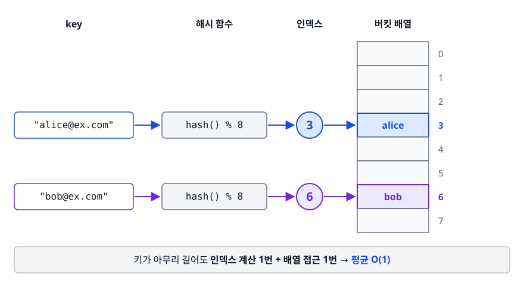
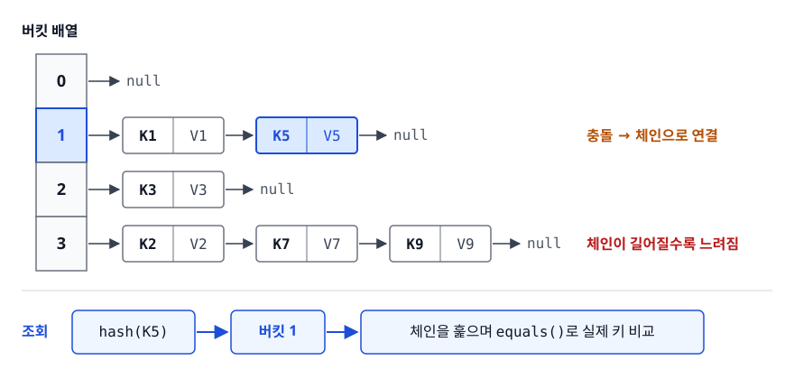
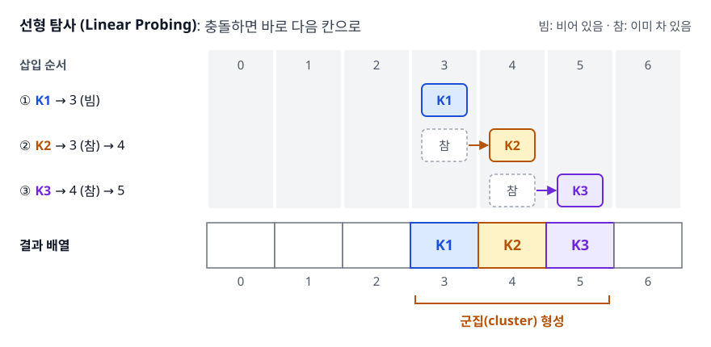
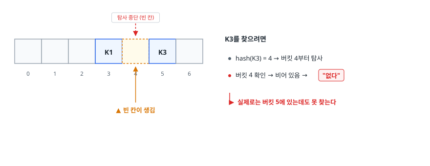
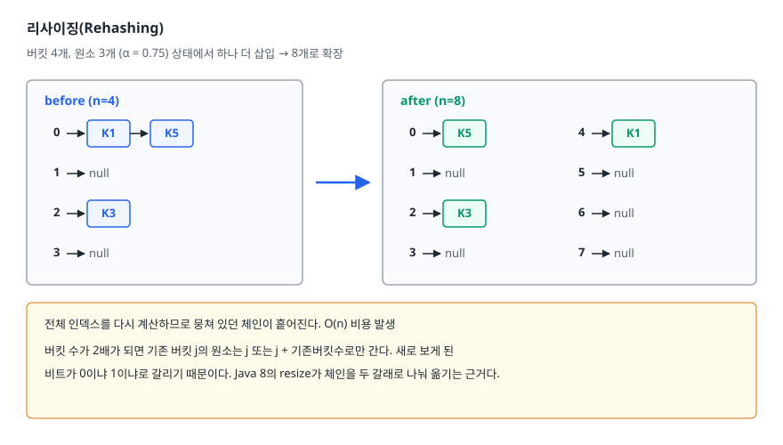
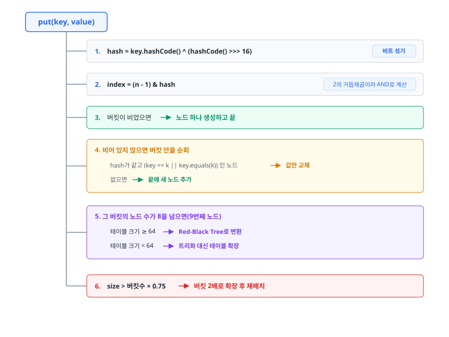

# 해시 테이블 (Hash Table)

> 난이도 ⭐⭐ · 키를 배열 인덱스로 바꾸는 발상 하나로 어떻게 평균 O(1) 검색이 나오는지,
> 그 O(1)이 무너지는 조건은 무엇인지, 그리고 Java HashMap이 그 무너짐을 어떻게 막는지 설명할 수 있게 됩니다.

## 학습 목표

- [ ] 해시 테이블이 O(1)을 얻는 원리를 배열 인덱싱과 연결지어 설명할 수 있다
- [ ] 좋은 해시 함수의 조건을 나열하고 이유를 댈 수 있다
- [ ] 체이닝과 개방 주소법의 트레이드오프, 로드 팩터의 영향을 설명할 수 있다
- [ ] Java HashMap의 버킷 → 리스트 → 트리 전환 과정을 설명할 수 있다
- [ ] equals와 hashCode를 함께 재정의해야 하는 이유를 동작 과정으로 설명할 수 있다

## 선행 지식

- [01-array-list.md](./01-array-list.md) - 배열의 O(1) 인덱싱, 연결 리스트
- [03-tree-graph.md](./03-tree-graph.md) - Red-Black Tree (HashMap의 트리화를 이해하려면 필요)

---

## 1. 왜 필요한가

배열에서 "값 42가 어디 있지?"를 찾으려면 처음부터 훑어야 한다 — O(n). 정렬해 두고 이진 탐색을
하면 O(log n)이지만 정렬 상태를 계속 유지해야 합니다. 여기서 한 가지 관찰을 해 보자.
배열의 **인덱스 접근은 이미 O(1)** 입니다. `arr[7]`은 탐색이 아니라 주소 계산이니까.

> **찾으려는 값 자체로부터 인덱스를 계산해 낼 수 있다면?**

학번이 1~1000번인 학생 정보라면 크기 1001짜리 배열을 만들고 학번을 그대로 인덱스로 쓰면 조회가
O(1)입니다. 문제는 키가 학번처럼 작은 정수가 아닐 때입니다. 이메일 주소, URL, 임의의 객체 —
이런 걸 인덱스로 쓸 수는 없습니다.

**해시 함수(Hash Function)** 가 이 간극을 메웁니다. 임의의 키를 정해진 범위의 정수로 뭉개서
배열 인덱스로 만들어 줍니다. 이 배열을 **해시 테이블**, 각 칸을 **버킷(Bucket)** 이라 부릅니다.

<!-- diagram:cs-hash-table-1 -->


<!-- 위 그림이 대체한 원본 ASCII.
     내용을 고칠 때는 그림도 함께 갱신할 것.
```
   key                해시 함수              버킷 배열
"alice@ex.com"  ──▶  hash() % 8  ──▶  3   ──▶  ┌───┐ 0
                                                ├───┤ ⋮
"bob@ex.com"    ──▶  hash() % 8  ──▶  6   ──▶  ├───┤ 3 ◀── alice
                                                ├───┤ ⋮
                                                ├───┤ 6 ◀── bob
                                                └───┘ 7
```
-->

키가 아무리 길어도 인덱스 계산은 한 번, 그다음은 배열 접근 한 번. 이것이 평균 O(1)의 정체입니다.
비유하자면 도서관 청구기호입니다. 책 제목을 보고 규칙에 따라 번호를 만들면, 그 번호가 가리키는 서가로
곧장 가면 됩니다. 서가를 하나씩 뒤질 필요가 없습니다.
(비유의 한계: 청구기호는 사람이 의미를 담아 설계하지만, 해시 함수는 의미를 일부러 파괴합니다.
비슷한 키가 비슷한 버킷에 가면 오히려 몰림이 생겨 나쁘다.)

---

## 2. 해시 함수가 갖춰야 할 것

**1. 결정적(Deterministic)** — 같은 키는 언제 넣어도 같은 값이 나와야 합니다. 실행 도중 값이
바뀌면 방금 넣은 데이터도 못 찾습니다.

**2. 빨라야 한다** — 해시 계산이 느리면 O(1)이라는 말이 무의미합니다. 그래서 자료구조용 해시는
SHA-256 같은 암호학적 해시와 목표가 다릅니다. 암호학적 해시는 역산 불가능성이, 해시 테이블은
속도와 분산이 중요합니다.

**3. 고르게 흩어져야 한다(Uniform Distribution)** — 제일 중요합니다. 아무리 빨라도 모든 키가 버킷
3번에 몰리면 그냥 연결 리스트입니다. 나아가 **입력이 조금만 달라도 결과가 크게 달라야**(Avalanche)
`"user1"`과 `"user2"`가 인접 버킷에 몰리지 않고 흩어집니다.

### 실제 예: Java의 String.hashCode

```java
public int hashCode() {          // "abc" → 'a'*31² + 'b'*31 + 'c'  (실제 JDK는 값을 캐싱한다)
    int h = 0;
    for (char c : value) h = 31 * h + c;
    return h;
}
```

31을 곱하는 이유는 홀수 소수라 정보 손실이 적고, `31 * h`가 `(h << 5) - h`로 최적화되기 때문입니다.
자릿수마다 다른 가중치를 주므로 `"ab"`와 `"ba"`가 다른 값을 갖습니다.

### 인덱스로 바꾸기

해시값은 int 전체 범위(음수 포함)라 그대로 인덱스로 못 씁니다. `index = hash % bucketCount`처럼
버킷 개수로 나눈 나머지를 취합니다. 버킷 개수를 **소수(prime)** 로 잡는 구현이 많은데, 키가 특정
배수 패턴을 가질 때 몰림을 줄이기 위해서입니다. 반면 Java `HashMap`은 **2의 거듭제곱**을 써서
`% n`을 `& (n-1)`로 바꿉니다. 훨씬 빠르지만 하위 비트만 인덱스에 반영되는 약점이 생기는데,
이걸 다음 방법으로 보완합니다.

```java
// java.util.HashMap 의 해시 분산 처리
static final int hash(Object key) {
    int h;
    return (key == null) ? 0 : (h = key.hashCode()) ^ (h >>> 16);
}
```

상위 16비트를 하위로 내려 XOR합니다. 이렇게 하면 원래 상위 비트에만 차이가 있던 두 키도
하위 비트에 그 차이가 반영되어 서로 다른 버킷으로 갑니다. 나눗셈을 비트 연산으로 바꿔 얻은 속도를,
비트 섞기 한 줄로 지켜 내는 설계입니다.

---

## 3. 충돌 (Collision)

키의 가짓수는 사실상 무한한데 버킷은 유한합니다. 서로 다른 키가 같은 버킷으로 가는 일은
**드문 사고가 아니라 필연**입니다. 생일 문제와 같은 계산을 해 보면, 버킷이 100만 개여도 키를 1000개쯤 넣는
순간 어딘가에서 충돌이 날 확률이 40%에 가깝고 1200개면 절반을 넘습니다. 버킷 수에 비하면 턱없이 적은
양인데도 그렇습니다. 그래서 해시 테이블 설계의 절반은 "충돌을 어떻게 처리할 것인가"다.

### 방법 1: 분리 연결법 (Separate Chaining)

같은 버킷에 여러 개가 오면 **그 자리에 목록을 만들어 이어 붙입니다.**

<!-- diagram:cs-hash-table-2 -->


<!-- 위 그림이 대체한 원본 ASCII.
     내용을 고칠 때는 그림도 함께 갱신할 것.
```
버킷 배열
 0 │ → null
 1 │ → [K1|V1] → [K5|V5] → null                 충돌 → 체인으로 연결
 2 │ → [K3|V3] → null
 3 │ → [K2|V2] → [K7|V7] → [K9|V9] → null       체인이 길어질수록 느려짐

조회: hash(K5) → 버킷 1 → 체인을 훑으며 equals()로 실제 키 비교
```
-->

버킷을 찾는 건 O(1)이고, 체인 안에서 키를 찾는 데 체인 길이만큼 걸립니다. 평균 체인 길이는
`저장된 원소 수 / 버킷 수`이며 이를 **로드 팩터(Load Factor) α**라 부릅니다. 따라서 조회 비용은
대략 `1 + α`이고, α를 상수로 유지하면 O(1)이 됩니다.

### 방법 2: 개방 주소법 (Open Addressing)

체인을 만들지 않고 **비어 있는 다른 버킷을 찾아갑니다.** 모든 데이터가 배열 안에 삽니다.

<!-- diagram:cs-hash-table-3 -->


<!-- 위 그림이 대체한 원본 ASCII.
     내용을 고칠 때는 그림도 함께 갱신할 것.
```
선형 탐사 (Linear Probing): 충돌하면 바로 다음 칸으로

K1 → 3 (빔)        ┌───┬───┬───┬────┬────┬────┬───┐
K2 → 3 (참) → 4    │   │   │   │ K1 │ K2 │ K3 │   │
K3 → 4 (참) → 5    └───┴───┴───┴────┴────┴────┴───┘
                     0   1   2    3    4    5    6
                                  └─── 군집(cluster) 형성
```
-->

| 방식 | 다음 위치 | 특징 |
|------|----------|------|
| 선형 탐사(Linear Probing) | `(h + 1) % n`, `(h + 2) % n` ... | 캐시 지역성 최고. 대신 **1차 군집**이 심함 |
| 제곱 탐사(Quadratic Probing) | `(h + 1²) % n`, `(h + 2²) % n` ... | 1차 군집 완화. 같은 해시끼리는 여전히 뭉침(2차 군집) |
| 이중 해싱(Double Hashing) | `(h + i × h₂(key)) % n` | 키마다 보폭이 달라 군집이 가장 적음. 계산 비용 증가 |

**1차 군집(Primary Clustering)** 이란 채워진 칸이 한 덩어리로 뭉치면서, 그 근처에 해시된 키가
덩어리 전체를 지나야 하는 현상입니다. 덩어리가 커질수록 새 키가 거기 붙을 확률도 올라가 악순환이 됩니다.

### 개방 주소법의 삭제 문제

여기가 진짜 함정입니다. 위 예에서 K2를 그냥 지우면 이렇게 됩니다.

<!-- diagram:cs-hash-table-4 -->


<!-- 위 그림이 대체한 원본 ASCII.
     내용을 고칠 때는 그림도 함께 갱신할 것.
```
  ┌───┬───┬───┬────┬────┬────┬───┐   K3를 찾으려면
  │   │   │   │ K1 │    │ K3 │   │     버킷 3 확인 → K1이 아님
  └───┴───┴───┴────┴────┴────┴───┘     버킷 4 확인 → 비어 있음 → "없다"
                  ▲ 빈 칸이 생김        실제로는 버킷 5에 있는데도 못 찾는다
```
-->

탐사가 빈 칸에서 멈추기 때문입니다. 그래서 삭제한 자리에 "여기는 비었지만 지나가라"는 표식,
즉 **묘비(Tombstone)** 를 남겨야 합니다. 묘비가 쌓이면 실제 데이터가 적어도 탐사가 길어지므로
주기적으로 테이블을 재구축해야 합니다.

| 기준 | 분리 연결법 | 개방 주소법 |
|------|------------|------------|
| 로드 팩터 | 1을 넘어도 동작 | **반드시 1 미만** (자리가 없으면 삽입 불가) |
| 삭제 | 노드 제거로 간단 | 묘비 필요, 관리 복잡 |
| 캐시 지역성 | 나쁨 (포인터 추적) | **좋음** (배열 내부에서 해결) |
| 메모리 | 노드마다 포인터 오버헤드 | 추가 포인터 없음. 대신 빈 칸 낭비 |
| 성능 저하 시점 | 완만하게 나빠짐 | α가 0.7을 넘으면 **급격히** 나빠짐 |
| 최악의 경우 | 한 체인에 몰림 → O(n) | 군집 폭주 → O(n) |
| 대표 구현 | Java `HashMap`, C++ `unordered_map` | Python `dict`, Rust `HashMap` |

**언제 뭘 쓰나**: 삭제가 잦고 로드 팩터 관리가 부담스러우면 체이닝, 메모리가 빠듯하고 캐시 성능이 중요하며
로드 팩터를 낮게 유지할 수 있으면 개방 주소법. 쓰는 라이브러리가 어느 쪽인지 알면 성능 특성이 예측됩니다.

---

## 4. 로드 팩터와 리사이징

`로드 팩터 α = 저장된 원소 수 / 버킷 개수`. α는 **시간과 공간의 조절 손잡이**입니다.
α가 작으면 충돌이 적어 빠르지만 빈 버킷이 많아 메모리를 낭비하고, α가 크면 그 반대입니다.

개방 주소법에서는 이 관계가 특히 가파릅니다. 선형 탐사의 실패 탐색 근사식 `(1 + 1/(1-α)²) / 2`에 대입하면
α가 0.5일 때 약 2.5회, 0.75일 때 약 8.5회, 0.9일 때 약 50회입니다. 0.75에서 0.9로 올렸을 뿐인데 여섯 배입니다.
"메모리 좀 아끼자"는 판단이 성능 절벽으로 이어지는 지점이 있습니다.

### 리사이징(Rehashing)

α가 기준을 넘으면 **버킷 배열을 키우고 전부 다시 배치합니다.**
버킷 개수가 바뀌면 `hash % n` 결과가 달라지므로, 기존 원소를 그냥 옮길 수 없고 인덱스를 다시
계산해야 합니다. 그래서 rehashing이라 부릅니다.

<!-- diagram:cs-hash-table-5 -->


<!-- 위 그림이 대체한 원본 ASCII.
     내용을 고칠 때는 그림도 함께 갱신할 것.
```
버킷 4개, 원소 3개 (α = 0.75) 상태에서 하나 더 삽입 → 8개로 확장

before (n=4)                  after (n=8)
 0 → [K1] → [K5]               0 → [K5]      4 → [K1]
 1 → null            ──▶       1 → null      5 → null
 2 → [K3]                      2 → [K3]      6 → null
 3 → null                      3 → null      7 → null

   전체 인덱스를 다시 계산하므로 뭉쳐 있던 체인이 흩어진다. O(n) 비용 발생
   버킷 수가 2배가 되면 기존 버킷 j의 원소는 j 또는 j + 기존버킷수로만 간다. 새로 보게 된
   비트가 0이냐 1이냐로 갈리기 때문이다. Java 8의 resize가 체인을 두 갈래로 나눠 옮기는 근거다.
```
-->

리사이징은 O(n)이지만 용량을 2배씩 늘리므로 [동적 배열과 같은 논리](./01-array-list.md)로 **amortized O(1)** 이
유지됩니다. 다만 리사이징 순간에는 응답이 튀므로, 지연에 민감하면 예상 크기를 미리 지정해 아예 없애는 게 낫습니다.

```java
// 1000개를 넣을 예정이라면 1000 / 0.75 = 1334 이상의 버킷이 필요하다.
// HashMap이 2의 거듭제곱으로 올림하므로 결과적으로 2048 버킷이 잡힌다.
Map<String, User> users = new HashMap<>(2048);
// Java 19+ 라면: HashMap.newHashMap(1000)
```

초기 용량은 "저장할 원소 수"가 아니라 **버킷 수**라는 점에 주의합니다. 1000을 그대로 넘기면 2의 거듭제곱으로
올림되어 1024 버킷이 잡히고, 임계값이 `1024 × 0.75 = 768`이라 768개를 넘는 순간 리사이징이 일어납니다.

---

## 5. 실무에서는 — Java HashMap의 내부 동작

### 기본 상수

| 항목 | 값 | 의미 |
|------|-----|------|
| 기본 버킷 수 | 16 | 첫 put 시점에 할당 (지연 초기화) |
| 기본 로드 팩터 | 0.75 | 시간/공간 절충값 |
| TREEIFY_THRESHOLD | 8 | 한 버킷의 노드가 이 수를 넘어서면(9번째가 붙는 순간) 트리화 검토 |
| UNTREEIFY_THRESHOLD | 6 | 트리 노드가 이하로 줄면 다시 리스트로 |
| MIN_TREEIFY_CAPACITY | 64 | 트리화를 허용하는 최소 테이블 크기 |

### put의 흐름

<!-- diagram:cs-hash-table-6 -->


<!-- 위 그림이 대체한 원본 ASCII.
     내용을 고칠 때는 그림도 함께 갱신할 것.
```
put(key, value)
   │
   ├─ 1. hash = key.hashCode() ^ (hashCode() >>> 16)   비트 섞기
   ├─ 2. index = (n - 1) & hash                        2의 거듭제곱이라 AND로 계산
   ├─ 3. 버킷이 비었으면 → 노드 하나 생성하고 끝
   │
   ├─ 4. 비어 있지 않으면 버킷 안을 순회
   │      hash가 같고 (key == k || key.equals(k)) 인 노드 → 값만 교체
   │      없으면 → 끝에 새 노드 추가
   │
   ├─ 5. 그 버킷의 노드 수가 8 이상이면
   │      테이블 크기 ≥ 64  → Red-Black Tree로 변환
   │      테이블 크기 < 64  → 트리화 대신 테이블 확장
   │
   └─ 6. size > 버킷수 × 0.75  → 버킷 2배로 확장 후 재배치
```
-->

### 왜 8인가, 왜 64인가

**8**: 해시가 고르게 분포한다는 가정 아래 한 버킷에 노드가 8개 쌓일 확률은 통계적으로 극히 낮습니다.
그 정도로 쌓였다는 건 해시가 나쁘거나 공격을 받고 있다는 신호입니다. 트리 노드는 메모리를 더 쓰므로
평소에는 리스트로 두고 이상 신호가 있을 때만 전환하는 게 이득입니다.

**64**: 테이블이 작을 때 버킷이 붐비는 건 해시가 나빠서가 아니라 **버킷이 부족해서**일 가능성이
높습니다. 트리로 바꿔 봐야 근본 해결이 안 되므로 테이블을 키우는 쪽을 택합니다.

### 트리화가 막아 주는 것

```
트리화 없이:  버킷 5 → [K1] → [K2] → ... → [Kn]     조회 O(n)
트리화 이후:  버킷 5 → Red-Black Tree               조회 O(log n)
```

이게 실전에서 왜 중요하냐면, **HashDoS 공격** 때문입니다. 공격자가 같은 버킷으로 가는 키를 대량으로 만들어
보내면 해시 테이블이 연결 리스트로 퇴화하고, 조회마다 O(n)이 걸려 CPU가 마비됩니다. 트리화는 최악을
O(n)에서 O(log n)으로 묶어 이 공격의 위력을 크게 줄입니다. (Rust의 `HashMap`이 기본 해셔로 SipHash를
쓰는 것도 같은 문제의 다른 해법입니다. 무작위 시드를 섞어 공격자가 충돌 키를 예측하지 못하게 만든다.)

### 스레드 안전성

`HashMap`은 스레드 안전하지 않습니다. 여러 스레드가 동시에 put하면 갱신이 덮어써져 데이터가 유실되고,
리사이징이 겹치면 자료구조 자체가 깨집니다. Java 7까지는 리사이징 중 체인이 뒤집히며 순환이 생겨 조회가
무한 루프에 빠지는 사례가 유명했습니다. 멀티스레드에서는 버킷 단위로 잠금 범위를 좁힌 `ConcurrentHashMap`을
씁니다. `Collections.synchronizedMap`처럼 맵 전체를 잠그는 방식보다 처리량이 훨씬 좋습니다.

---

## 6. equals와 hashCode 계약

HashMap의 검색은 **두 단계**입니다. 이 하나만 기억하면 나머지는 저절로 따라옵니다.

```
1단계  hashCode()  →  어느 버킷으로 갈지 결정
2단계  equals()    →  그 버킷 안에서 진짜 그 키인지 확인
```

hashCode가 같다고 같은 키는 아니므로(충돌이 있으니까) 2단계가 필요하고,
버킷이 다르면 equals를 부를 기회조차 없으므로 1단계가 먼저입니다.

### 한쪽만 재정의하면

```java
class User {
    final String id;
    User(String id) { this.id = id; }

    @Override
    public boolean equals(Object o) {          // equals만 재정의
        return o instanceof User u && id.equals(u.id);
    }
    // hashCode()는 재정의하지 않음 → Object의 기본 구현(객체 identity 기반)이 쓰인다
}

Map<User, String> map = new HashMap<>();
map.put(new User("u1"), "Alice");
map.get(new User("u1"));                       // null !!
```

`new User("u1")` 두 개는 equals로는 같지만 hashCode가 다릅니다. 서로 다른 버킷으로 가므로
**equals가 호출조차 되지 않습니다.** 논리적으로 같은 키인데 못 찾습니다. 반대로 hashCode만 재정의하면
같은 버킷까지는 도달하지만, equals가 참조 비교라서 "같은 버킷의 다른 키"로 판정되어 역시 못 찾습니다.

### 계약

```
1. equals()가 true인 두 객체는 반드시 같은 hashCode()를 반환해야 한다.   (필수)
2. hashCode()가 같다고 equals()가 true일 필요는 없다.                   (충돌 허용)
3. 객체의 상태가 변하지 않는 한 hashCode()는 항상 같은 값이어야 한다.     (일관성)
```

1번이 깨지면 조회가 실패합니다. 2번은 충돌이 정상이라는 뜻입니다. 3번은 다음 절의 함정과 연결됩니다.
구현할 때 지켜야 할 원칙은 하나입니다. **두 메서드가 같은 필드 집합을 써야 합니다.**

```java
class User {
    private final String id;
    private final String email;

    @Override
    public boolean equals(Object o) {
        if (this == o) return true;
        if (!(o instanceof User other)) return false;
        return Objects.equals(id, other.id) && Objects.equals(email, other.email);
    }

    @Override
    public int hashCode() {
        return Objects.hash(id, email);       // equals와 동일한 필드
    }
}

record User(String id, String email) {}       // Java 16+: 둘 다 자동 생성
```

### 가변 키 함정 — 계약 3번을 어기면

```java
class MutableKey { String name; /* name 기반 equals/hashCode */ }

MutableKey k = new MutableKey("A");
map.put(k, "value");     // hash("A") → 버킷 3에 저장
k.name = "B";            // 키의 필드를 바꿈
map.get(k);              // hash("B") → 버킷 7 조회 → null
map.containsKey(k);      // false. 넣은 키인데도 찾을 수 없다
```

객체는 여전히 버킷 3에 있는데 해시가 바뀌어 버킷 7을 뒤집니다. 데이터가 맵 안에 갇힙니다. 그래서 **맵의 키와
셋의 원소는 불변 객체를 쓰는 것이 원칙**이고, `String`, `Integer`, `record`가 좋은 키인 이유가 여기 있습니다.
`HashSet`도 내부가 `HashMap`이라 넣은 뒤 원소의 필드를 바꾸면 중복 제거가 깨집니다.

---

## 7. 면접 포인트

> 면접에서 이 주제가 나오면 이렇게 답한다

**Q. HashMap의 동작 원리를 설명해 주세요.**

A. 키의 `hashCode()`로 해시값을 얻고, 버킷 개수로 나눈 나머지를 인덱스로 삼아 버킷을 결정합니다.
Java는 버킷 수가 2의 거듭제곱이라 `(n-1) & hash`로 계산하고, 하위 비트만 반영되는 문제를 막으려고
`hashCode ^ (hashCode >>> 16)`으로 상위 비트를 섞습니다. 조회할 때도 같은 방식으로 버킷을 찾은 뒤
그 안에서 `equals()`로 실제 키를 비교합니다. 버킷 찾기가 O(1)이라 평균 O(1)이고, 한 버킷에 몰리면
최악 O(n)이 됩니다.

- 꼬리 질문: "왜 나머지 연산 대신 AND를 쓰나요?" → 버킷 수가 2의 거듭제곱이면
  `hash % n == hash & (n-1)`이 성립하고, 나눗셈보다 비트 연산이 훨씬 빠릅니다.

**Q. 해시 충돌은 어떻게 해결하나요?**

A. 분리 연결법과 개방 주소법이 있습니다. 분리 연결법은 같은 버킷에 온 원소를 연결 리스트로 이어
붙이는 방식으로, 로드 팩터가 1을 넘어도 동작하고 삭제가 간단합니다. 개방 주소법은 충돌 시 다른 빈
버킷을 탐사하며 선형 탐사, 제곱 탐사, 이중 해싱이 있습니다. 캐시 효율이 좋지만 로드 팩터가 1 미만
이어야 하고, 삭제할 때 묘비를 남기지 않으면 탐사가 끊겨 데이터를 못 찾습니다.
Java HashMap은 분리 연결법을 씁니다.

- 꼬리 질문: "선형 탐사의 단점은?" → 1차 군집. 채워진 칸이 덩어리로 뭉치면 그 근처 키가
  덩어리 전체를 지나야 하고, 덩어리가 커질수록 더 커지는 악순환이 생깁니다.

**Q. Java 8에서 HashMap이 어떻게 개선됐나요?**

A. 한 버킷의 노드가 8개 이상이고 테이블 크기가 64 이상이면 연결 리스트를 Red-Black Tree로
변환합니다. 최악의 조회가 O(n)에서 O(log n)으로 개선되고, 노드가 6개 이하로 줄면 리스트로
되돌립니다. 테이블이 64 미만일 때 트리화하지 않는 이유는 그 상황의 충돌이 해시 품질보다 버킷
부족 탓일 가능성이 높기 때문입니다. 실전에서는 의도적으로 충돌을 유발하는 HashDoS 공격의
영향을 줄여 줍니다.

- 꼬리 질문: "그럼 항상 트리로 두면 안 되나요?" → 트리 노드가 메모리를 더 쓰고, 정상적인 해시라면
  버킷당 노드가 1~2개라 트리의 이점이 없습니다. 이상 상황에서만 전환하는 게 합리적입니다.

**Q. equals와 hashCode를 왜 함께 재정의해야 하나요?**

A. HashMap이 2단계로 키를 찾기 때문입니다. hashCode로 버킷을 결정하고, 그 버킷 안에서 equals로
실제 키를 비교합니다. equals만 재정의하면 논리적으로 같은 객체가 다른 버킷으로 가서 equals가
호출될 기회조차 없고, hashCode만 재정의하면 같은 버킷에 도달해도 equals가 참조 비교라 다른 키로
판정됩니다. 그래서 "equals가 true면 hashCode도 같아야 한다"는 계약이 있고, 두 메서드는 같은 필드
집합을 써야 합니다.

- 꼬리 질문: "키로 가변 객체를 쓰면?" → 넣은 뒤 필드를 바꾸면 해시가 달라져 다른 버킷을 뒤지게
  되고, 객체가 맵 안에 갇혀 조회도 삭제도 안 됩니다. 키는 불변 객체를 씁니다.

---

## 자주 하는 실수

| 실수 | 왜 틀렸나 | 올바른 이해 |
|------|----------|-----------|
| hashCode가 같으면 같은 객체 | 충돌 때문에 다른 키도 같은 해시를 가질 수 있다 | 최종 판정은 항상 `equals()` |
| `hashCode()`를 항상 0으로 반환 | 계약은 지키지만 전부 한 버킷 → O(n) | 필드를 고루 반영해 흩어지게 만든다 |
| 가변 객체를 맵의 키로 사용 | 필드 변경 시 해시가 바뀌어 원소가 갇힌다 | 불변 객체 또는 `record` 사용 |
| `HashMap`은 순서를 보장한다 | 순서는 버킷 배치의 부산물이고 리사이징으로 바뀐다 | 삽입 순서는 `LinkedHashMap`, 정렬은 `TreeMap` |
| 멀티스레드에서 `HashMap` 공유 | 리사이징 중 데이터 유실·무한 루프 가능 | `ConcurrentHashMap` 사용 |
| 로드 팩터를 0.95로 올려 메모리 절약 | 체인이 길어져 조회가 느려지고, 개방 주소법이면 탐사 횟수가 폭증한다 | 0.75 근처가 시간/공간 절충점 |
| 대량 데이터를 기본 생성자로 넣기 | 리사이징이 여러 번 반복돼 O(n) 복사가 누적 | 예상 크기를 초기 용량으로 지정 |

---

## 한 줄 정리

해시 테이블은 키를 배열 인덱스로 변환해 평균 O(1) 접근을 얻는 자료구조이며, 그 O(1)은
"해시가 고르게 흩어지고 로드 팩터가 관리될 때"라는 조건 위에 서 있고, equals/hashCode 계약은
그 조건을 사용자 코드 쪽에서 지키기 위한 약속입니다.

---

## 연관 개념

- [01-array-list.md](./01-array-list.md) - 배열 인덱싱의 O(1), 리사이징의 amortized 분석
- [02-stack-queue.md](./02-stack-queue.md) - 순서 규칙으로 정의되는 자료구조와의 대비
- [03-tree-graph.md](./03-tree-graph.md) - 트리화에 쓰이는 Red-Black Tree, 정렬이 필요할 때의 `TreeMap`
- [qna-data-structure.md](./qna-data-structure.md) - 이 주제 면접 질문 (Q3, Q8, Q9)
- [Java 기초 QnA](../../02-backend-engineering/java-fundamentals/qna-java.md) - `equals`/`hashCode`와 컬렉션 프레임워크
- [캐싱](../../09-system-design/caching/README.md) - 해시 기반 키-값 저장소의 확장판
