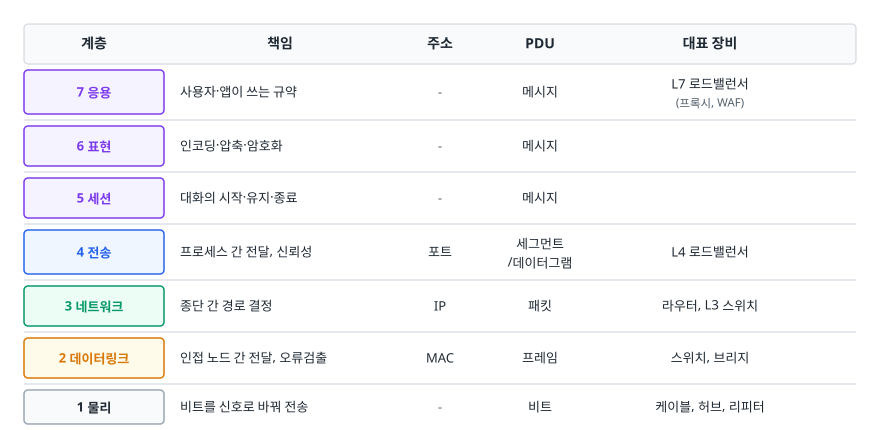
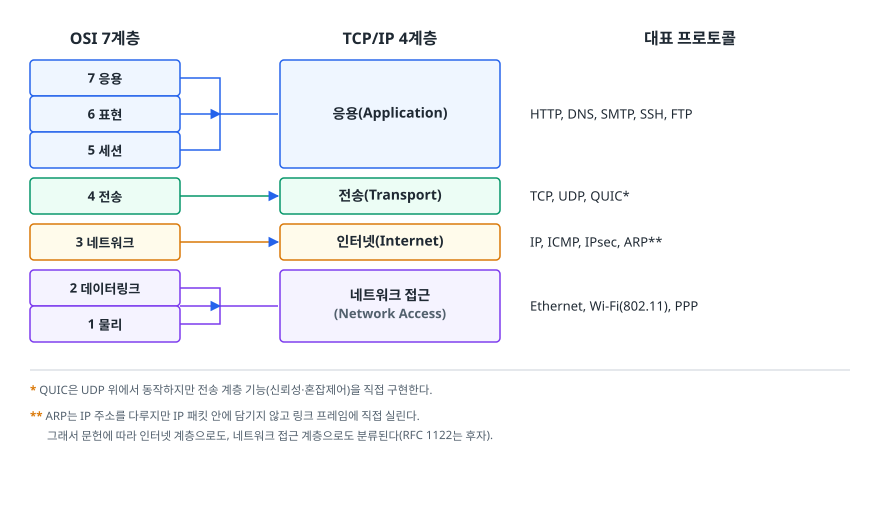
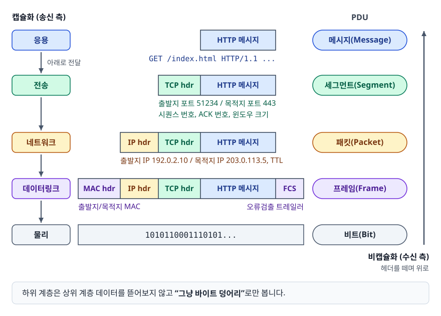
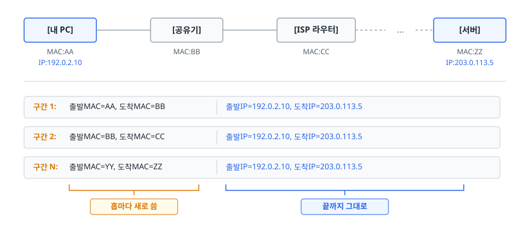
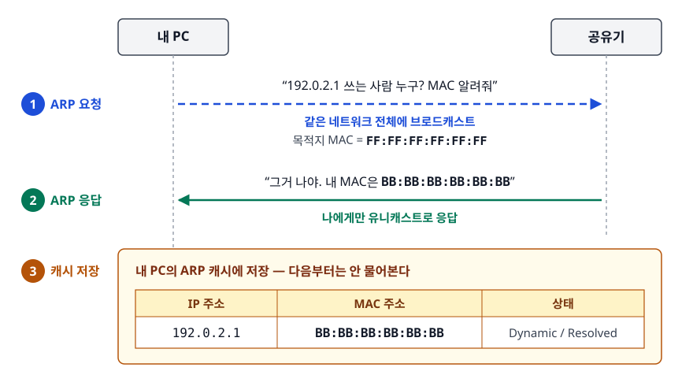

# OSI 7계층과 TCP/IP 4계층 (OSI Reference Model & TCP/IP Model)

> 네트워크를 왜 계층으로 쪼갰는지, 각 계층이 무엇을 책임지는지, 데이터가 내려가면서 어떤 헤더가 붙는지를 설명할 수 있게 됩니다.

## 학습 목표

- [ ] 네트워크를 계층으로 분리한 이유를 두 가지 이상 근거로 설명할 수 있다
- [ ] OSI 7계층 각각의 책임 · 주소 체계 · PDU · 대표 장비를 짝지을 수 있다
- [ ] TCP/IP 4계층과 OSI 7계층의 대응 관계를 그릴 수 있다
- [ ] 캡슐화 과정을 PDU 이름과 함께 순서대로 설명할 수 있다
- [ ] "이 문제는 몇 계층 문제인가"를 판단해 디버깅 범위를 좁힐 수 있다

## 선행 지식

없음 — 네트워크 문서 중 이 문서부터 시작해도 됩니다.

---

## 1. 왜 계층으로 나눴나

계층 모델이 없다고 상상해 보자. "브라우저가 서버에서 HTML을 받아온다"는 하나의 기능을 만들려면
전기 신호를 케이블에 어떻게 실을지, 여러 대가 붙은 랜선에서 누구 신호인지 어떻게 구분할지,
서울에서 버지니아까지 어느 경로로 보낼지, 중간에 유실되면 어떻게 다시 보낼지,
그리고 HTML을 어떤 형식으로 주고받을지를 **하나의 프로그램이 전부** 처리해야 합니다.

여기서 생기는 문제가 세 가지입니다.

**첫째, 교체가 불가능합니다.** Wi-Fi가 새로 나왔다고 브라우저를 다시 짜야 한다면 아무도 새 기술을 못 만듭니다.
**둘째, 조합 폭발이 일어납니다.** 프로토콜 5개 × 전송 매체 5개 = 25가지 구현을 따로 만들어야 합니다.
**셋째, 고장 지점을 못 찾습니다.** 페이지가 안 열릴 때 랜선 문제인지 DNS 문제인지 서버 코드 문제인지 구분할 방법이 없습니다.

계층화(Layering)는 이 셋을 한 번에 해결합니다. 각 계층은 **바로 아래 계층이 제공하는 서비스만 사용**하고,
**바로 위 계층에 자기 서비스만 제공**합니다. 내부 구현은 서로 모릅니다.
그래서 이더넷을 Wi-Fi로 바꿔도 HTTP는 코드 한 줄 안 바뀌고, 문제가 생기면
"어느 계층까지는 정상인가"를 아래에서 위로 확인하며 범위를 좁힐 수 있습니다.

> **비유** — 국제 택배. 내가 쓴 편지(응용)는 봉투에 담겨 "몇 층 몇 호 김OO 담당자" 표시가 붙고(전송),
> 그 봉투는 "서울시 강남구 ..." 주소가 적힌 상자에 들어가고(네트워크), 상자는 구간마다 다른 배송 기사가
> 트럭에 싣고 옮긴다(데이터링크). 편지 쓴 사람은 트럭 기종을 몰라도 되고, 기사는 편지 내용을 몰라도 됩니다.
>
> **비유의 한계** — 택배 상자는 한 번 포장하면 도착할 때까지 그대로지만, 네트워크에서 데이터링크 헤더(L2)는
> **라우터를 지날 때마다 뜯기고 새로 붙습니다.** 뒤(5절)에서 이 부분을 따로 짚습니다.

---

## 2. OSI 7계층

OSI(Open Systems Interconnection) 모델은 ISO가 만든 **참조 모델**입니다.
실제 인터넷이 이 모델대로 구현된 것은 아니고, "네트워크 기능을 이렇게 나눠서 이야기하자"는 공용 언어에 가깝습니다.

<!-- diagram:cs-osi-tcp-ip-1 -->


<!-- 위 그림이 대체한 원본 ASCII.
     내용을 고칠 때는 그림도 함께 갱신할 것.
```
      계층                책임                    주소      PDU        대표 장비
┌───────────────┐
│ 7 응용        │ 사용자·앱이 쓰는 규약        -        메시지      L7 로드밸런서
├───────────────┤                                                    (프록시, WAF)
│ 6 표현        │ 인코딩·압축·암호화           -        메시지
├───────────────┤
│ 5 세션        │ 대화의 시작·유지·종료        -        메시지
├───────────────┤
│ 4 전송        │ 프로세스 간 전달, 신뢰성    포트     세그먼트     L4 로드밸런서
├───────────────┤                                     /데이터그램
│ 3 네트워크    │ 종단 간 경로 결정           IP       패킷        라우터, L3 스위치
├───────────────┤
│ 2 데이터링크  │ 인접 노드 간 전달, 오류검출  MAC     프레임      스위치, 브리지
├───────────────┤
│ 1 물리        │ 비트를 신호로 바꿔 전송      -       비트        케이블, 허브, 리피터
└───────────────┘
```
-->

### 1계층 — 물리 (Physical)

0과 1을 **실제 물리 현상**으로 바꿉니다. 구리선이면 전압, 광케이블이면 빛의 세기, 무선이면 전파입니다.
"어떤 전압을 몇 나노초 유지해야 1로 읽히는가", "커넥터 핀 배치는 어떻게 되는가" 같은 규격이 여기 속합니다.
이 계층은 데이터의 **의미를 전혀 모릅니다.** 허브(Hub)가 받은 신호를 모든 포트로 그대로 뿌리는 이유가 그래서입니다.

### 2계층 — 데이터링크 (Data Link)

물리 계층은 신호를 흘려보낼 뿐, "어디부터 어디까지가 한 덩어리인지"도 "누구한테 온 건지"도 모릅니다.
데이터링크 계층이 비트 스트림을 **프레임(Frame)** 단위로 잘라내고,
**MAC 주소(Media Access Control address)** 로 같은 네트워크 안의 특정 장비를 지목합니다.
프레임 끝에는 FCS(Frame Check Sequence) 라는 검사값이 붙어서, 전송 중 비트가 뒤집히면 그 프레임을 버립니다.

핵심은 이 계층의 통신 범위가 **인접한 한 구간(hop)** 이라는 점입니다. 서울에서 도쿄까지 가는 것이 아니라
"내 노트북 → 공유기"까지만 책임집니다. 스위치(Switch)는 MAC 주소 테이블을 학습해서
프레임을 해당 포트로만 보내기 때문에, 허브와 달리 불필요한 트래픽을 만들지 않습니다.

### 3계층 — 네트워크 (Network)

MAC 주소만으로는 전 세계를 찾아갈 수 없습니다. MAC은 제조사가 박아 넣은 값이라 위치 정보가 없기 때문입니다.
네트워크 계층은 **IP 주소**라는 위치 기반 주소를 도입하고, 라우터가 라우팅 테이블을 보고
"이 목적지는 저쪽 인터페이스로 보내라"를 결정합니다. 이것이 **라우팅(Routing)** 입니다.

IP는 의도적으로 **최선형 전달(best-effort)** 입니다. 순서도 보장하지 않고, 유실돼도 재전송하지 않습니다.
"일단 최대한 보내본다"까지만 하고, 신뢰성은 위 계층에 떠넘깁니다.
이 단순함 덕분에 라우터가 초당 수억 개 패킷을 처리할 수 있습니다.

ICMP(ping이 쓰는 프로토콜), ARP(IP를 MAC으로 변환) 도 이 근처에서 동작합니다.

### 4계층 — 전송 (Transport)

3계층까지 오면 "어느 컴퓨터"까지는 도착합니다. 하지만 그 컴퓨터에서는 브라우저, 게임, 메신저가 동시에 돌고 있습니다.
전송 계층은 **포트 번호(Port)** 로 "그 컴퓨터의 어느 프로세스"인지를 구분합니다.
여기서부터 통신 주체가 기계가 아니라 **프로세스**가 됩니다.

동시에 신뢰성 여부를 고릅니다. TCP는 순서 보장 · 재전송 · 흐름 제어 · 혼잡 제어를 얹고,
UDP는 포트 구분과 체크섬만 붙이고 끝냅니다. 자세한 내용은 [03-tcp-udp.md](./03-tcp-udp.md).

### 5계층 — 세션 (Session)

"대화"의 단위를 관리합니다. 언제 시작하고, 끊어지면 어디서부터 다시 이어받고, 언제 끝낼지를 정합니다.
실제 인터넷 스택에는 이 계층에 딱 대응하는 독립 프로토콜이 드물고,
로그인 세션이나 RPC 세션처럼 애플리케이션 내부에서 처리되는 경우가 대부분입니다.

### 6계층 — 표현 (Presentation)

보내는 쪽과 받는 쪽의 **표현 형식**을 맞춥니다. 문자 인코딩(UTF-8), 이미지 포맷(JPEG, PNG),
데이터 직렬화(JSON, Protobuf), 압축(gzip), 암호화가 여기에 해당합니다.
TLS를 "6계층"으로 분류하는 설명이 많은데, 엄밀히는 TCP 위·응용 아래에 끼어 있어 5~6계층 사이로 보는 편이 정확합니다.

### 7계층 — 응용 (Application)

사용자가 실제로 쓰는 프로토콜. HTTP, DNS, SMTP, FTP, SSH, WebSocket이 여기 있습니다.
주의할 점은 7계층이 "브라우저 자체"가 아니라 **브라우저가 사용하는 통신 규약**이라는 것입니다.
크롬은 애플리케이션이고, 크롬이 말하는 HTTP가 7계층 프로토콜입니다.

---

## 3. TCP/IP 4계층

OSI가 나오기 전에 이미 인터넷은 TCP/IP로 돌아가고 있었습니다. 그래서 실제 구현 스택은 4계층으로 더 뭉툭합니다.

<!-- diagram:cs-osi-tcp-ip-2 -->


<!-- 위 그림이 대체한 원본 ASCII.
     내용을 고칠 때는 그림도 함께 갱신할 것.
```
   OSI 7계층                 TCP/IP 4계층              대표 프로토콜
┌──────────────┐
│ 7 응용       │ ┐
├──────────────┤ │
│ 6 표현       │ ├──────►  응용(Application)      HTTP, DNS, SMTP, SSH, FTP
├──────────────┤ │
│ 5 세션       │ ┘
├──────────────┤
│ 4 전송       │ ────────►  전송(Transport)        TCP, UDP, QUIC*
├──────────────┤
│ 3 네트워크   │ ────────►  인터넷(Internet)       IP, ICMP, IPsec, ARP**
├──────────────┤
│ 2 데이터링크 │ ┐
├──────────────┤ ├──────►  네트워크 접근          Ethernet, Wi-Fi(802.11), PPP
│ 1 물리       │ ┘         (Network Access)

*  QUIC은 UDP 위에서 동작하지만 전송 계층 기능(신뢰성·혼잡제어)을 직접 구현한다.
** ARP는 IP 주소를 다루지만 IP 패킷 안에 담기지 않고 링크 프레임에 직접 실린다.
   그래서 문헌에 따라 인터넷 계층으로도, 네트워크 접근 계층으로도 분류된다(RFC 1122는 후자).
```
-->

5·6·7을 하나로 합친 이유는 현실적입니다. HTTP 하나만 봐도 세션 관리(Keep-Alive),
표현 협상(Content-Encoding: gzip), 응용 규약(GET /path)을 **한 프로토콜이 다 하고 있습니다.**
이걸 억지로 세 계층으로 쪼개봐야 얻는 게 없습니다.

| 구분 | OSI 7계층 | TCP/IP 4계층 |
|------|-----------|--------------|
| 성격 | 참조 모델(이론) | 구현 스택(현실) |
| 만들어진 순서 | 모델 먼저 → 구현 시도 | 구현 먼저 → 모델 정리 |
| 계층 수 | 7 | 4 |
| 쓰이는 곳 | 개념 설명, 장비 분류(L4/L7 스위치), 면접 | 실제 인터넷 전 구간 |

**그래서 뭘 쓰나** — 대화할 때는 OSI 번호(L4 로드밸런서, L7 라우팅)를 쓰고,
실제 동작을 따질 때는 TCP/IP 스택으로 생각하면 됩니다. 두 모델은 경쟁 관계가 아니라 용도가 다릅니다.

---

## 4. 캡슐화와 PDU

<!-- diagram:net-encapsulation -->


각 계층은 위에서 받은 데이터를 **뜯어보지 않고** 자기 헤더만 앞에 붙여서 아래로 내립니다.
이것이 **캡슐화(Encapsulation)** 이고, 각 계층에서 다루는 데이터 덩어리를 **PDU(Protocol Data Unit)** 라 부릅니다.

```
[응용]      GET /index.html HTTP/1.1 ...                       → 메시지(Message)
              │  아래로 전달
              ▼
[전송]   ┌────────┬──────────────────────────────┐
         │ TCP hdr│  HTTP 메시지                  │            → 세그먼트(Segment)
         └────────┴──────────────────────────────┘
          출발지 포트 51234 / 목적지 포트 443
          시퀀스 번호, ACK 번호, 윈도우 크기
              │
              ▼
[네트워크] ┌───────┬────────┬──────────────────────────────┐
           │ IP hdr│ TCP hdr│  HTTP 메시지                  │  → 패킷(Packet)
           └───────┴────────┴──────────────────────────────┘
            출발지 IP 192.0.2.10 / 목적지 IP 203.0.113.5, TTL
              │
              ▼
[데이터링크] ┌────────┬───────┬────────┬──────────────┬─────┐
             │ MAC hdr│ IP hdr│ TCP hdr│ HTTP 메시지  │ FCS │ → 프레임(Frame)
             └────────┴───────┴────────┴──────────────┴─────┘
              출발지/목적지 MAC + 오류검출 트레일러
              │
              ▼
[물리]      1010110001110101...                              → 비트(Bit)
```

수신 측은 정확히 반대로 올라갑니다. 프레임의 FCS를 검사하고 MAC 헤더를 떼고,
IP 헤더를 보고 자기 것이 맞으면 떼고, TCP 헤더의 포트를 보고 해당 소켓에 데이터를 넣습니다.
이 과정이 **비캡슐화(Decapsulation)** 다.

여기서 중요한 사실 하나. **하위 계층은 상위 계층 데이터를 "그냥 바이트 덩어리"로만 봅니다.**
라우터는 내가 보낸 HTTP 본문이 뭔지 모르고 알 필요도 없습니다. 이 무관심이 계층화의 핵심입니다.

---

## 5. 홉마다 바뀌는 것, 안 바뀌는 것

초심자가 가장 자주 헷갈리는 지점입니다.

<!-- diagram:cs-osi-tcp-ip-3 -->


<!-- 위 그림이 대체한 원본 ASCII.
     내용을 고칠 때는 그림도 함께 갱신할 것.
```
[내 PC] ──── [공유기] ──── [ISP 라우터] ──── ... ──── [서버]
 MAC:AA        MAC:BB          MAC:CC                  MAC:ZZ
 IP:192.0.2.10                                         IP:203.0.113.5

구간 1: 출발MAC=AA, 도착MAC=BB │ 출발IP=192.0.2.10, 도착IP=203.0.113.5
구간 2: 출발MAC=BB, 도착MAC=CC │ 출발IP=192.0.2.10, 도착IP=203.0.113.5
구간 N: 출발MAC=YY, 도착MAC=ZZ │ 출발IP=192.0.2.10, 도착IP=203.0.113.5
        └──── 홉마다 새로 씀 ───┘ └──── 끝까지 그대로 ─────┘
```
-->

- **IP 주소(L3)는 종단 간(end-to-end)** — 출발지에서 목적지까지 변하지 않습니다. (NAT를 거치면 출발지 IP가 바뀌지만, 그건 라우터가 의도적으로 고쳐 쓰는 예외다)
- **MAC 주소(L2)는 홉 간(hop-by-hop)** — 라우터는 프레임을 받아 L2 헤더를 버리고, 다음 홉의 MAC으로 새 프레임을 만들어 내보냅니다.
- IP 헤더의 **TTL(Time To Live)** 은 홉을 지날 때마다 1씩 줄고, 0이 되면 폐기됩니다. 라우팅 루프에 빠진 패킷이 영원히 떠도는 걸 막는 장치입니다. `traceroute`/`tracert`가 바로 이 TTL을 1, 2, 3…으로 올려가며 경로를 알아냅니다.

### 그럼 다음 홉의 MAC은 어떻게 아는가 — ARP

여기서 자연스럽게 이어지는 질문이 있습니다. 라우터로 보내려면 라우터의 MAC 주소를 알아야 하는데,
내가 아는 건 IP뿐입니다. 이 간극을 메우는 것이 **ARP(Address Resolution Protocol)** 다.

<!-- diagram:cs-osi-tcp-ip-4 -->


<!-- 위 그림이 대체한 원본 ASCII.
     내용을 고칠 때는 그림도 함께 갱신할 것.
```
① 내 PC:  "192.0.2.1 쓰는 사람 누구? MAC 알려줘"
          → 같은 네트워크 전체에 브로드캐스트 (목적지 MAC = FF:FF:FF:FF:FF:FF)

② 공유기: "그거 나야. 내 MAC은 BB:BB:BB:BB:BB:BB"
          → 나에게만 유니캐스트로 응답

③ 내 PC:  ARP 캐시에 (192.0.2.1 → BB:BB:...) 저장. 다음부터는 안 물어본다
```
-->

목적지가 같은 네트워크 안이면 그 장비의 MAC을, 바깥이면 **기본 게이트웨이(라우터)의 MAC**을 찾습니다.
목적지 IP는 여전히 최종 서버지만 목적지 MAC은 라우터인 상태, 이것이 3계층과 2계층이
서로 다른 주소를 쓰는 이유를 가장 잘 보여주는 장면입니다.

```bash
arp -a          # ARP 캐시 확인 (Windows / Linux / macOS 공통)
```

---

## 6. 계층별 장비, 그리고 로드밸런서

| 장비 | 동작 계층 | 판단 기준 | 특징 |
|------|-----------|-----------|------|
| 허브(Hub) | L1 | 없음 | 받은 신호를 모든 포트에 복사. 충돌 발생. 현재는 거의 안 씀 |
| 스위치(Switch) | L2 | MAC 주소 | MAC 테이블 학습 후 해당 포트로만 전달 |
| 라우터(Router) | L3 | IP 주소 | 라우팅 테이블 기반 경로 선택, 서로 다른 네트워크 연결 |
| L4 로드밸런서 | L4 | IP + 포트 | 패킷 내용을 안 봐서 빠름. TCP 연결을 그대로 뒤로 넘김 |
| L7 로드밸런서 | L7 | URL, 헤더, 쿠키 | `/api/*`는 A서버, `/img/*`는 B서버 식의 라우팅 가능. TLS 종료도 담당 |

**"L4 vs L7 로드밸런서 뭘 쓰나"** — 단순 분산에 최대 처리량이 필요하면 L4,
경로·헤더 기반 라우팅이나 TLS 종료·압축 같은 부가 기능이 필요하면 L7입니다.
AWS의 NLB가 L4, ALB가 L7에 해당합니다.

---

## 7. 실무에서는

계층 모델의 실전 가치는 **장애 범위를 반씩 잘라내는 것**입니다. "사이트가 안 열려요"를 받으면 아래에서 위로 올라갑니다.

```bash
# L3 — 목적지까지 IP 패킷이 도달하는가
ping 203.0.113.5

# L3 — 어디까지 갔다가 막히는가 (TTL을 올려가며 경로 추적)
tracert example.com          # Windows
traceroute example.com       # Linux/macOS

# L7(DNS) — 이름이 IP로 풀리는가
nslookup example.com

# L4 — 그 포트가 열려 있고 TCP 연결이 되는가
Test-NetConnection example.com -Port 443     # PowerShell

# L7(HTTP) — 요청/응답이 오가는가. -v로 연결·TLS·헤더 단계를 전부 보여준다
curl -v https://example.com
```

`ping`은 되는데 `curl`이 안 되면 L1~L3는 정상이고 L4 이상의 문제입니다. 방화벽이 443을 막았거나,
서버 프로세스가 죽었거나, TLS 인증서가 만료됐거나 셋 중 하나로 좁혀집니다.
반대로 `ping`부터 안 되면 애플리케이션 코드를 아무리 봐도 소용없습니다.

패킷 자체를 봐야 할 때는 Wireshark나 `tcpdump`를 씁니다. Wireshark가 한 패킷을
"Frame → Ethernet → IPv4 → TCP → HTTP" 트리로 펼쳐 보여주는 것이 곧 캡슐화 구조 그 자체입니다.

---

## 8. 면접 포인트

> 면접에서 이 주제가 나오면 이렇게 답한다

**Q. OSI 7계층을 설명해 주세요.**

A. 이름만 나열하면 감점입니다. **책임 + 주소 체계 + PDU**를 묶어서 답합니다.
"물리는 비트를 신호로 바꾸고, 데이터링크는 MAC 주소로 인접 노드까지 프레임을 보내며 FCS로 오류를 검출합니다.
네트워크는 IP 주소로 종단까지 패킷을 라우팅하고, 전송은 포트로 프로세스를 구분하며 TCP면 신뢰성까지 보장합니다.
세션·표현·응용은 각각 대화 관리, 인코딩/암호화, 사용자 프로토콜을 담당하고 TCP/IP 모델에서는 하나로 합쳐집니다."
- 꼬리 질문: "왜 굳이 계층을 나눴나요?" → 기술 교체 독립성(이더넷→Wi-Fi 바꿔도 HTTP 불변), 조합 폭발 억제, 장애 범위 격리 세 가지로 답합니다.

**Q. OSI와 TCP/IP 모델의 차이는 뭔가요?**

A. OSI는 ISO가 만든 이론적 참조 모델이고, TCP/IP는 실제 인터넷이 돌아가는 구현 스택입니다.
OSI의 5·6·7이 TCP/IP에서는 응용 하나로 합쳐지는데, HTTP 하나가 세션 관리(Keep-Alive)와
표현 협상(Content-Encoding)과 응용 규약을 전부 처리하고 있어서 굳이 쪼갤 실익이 없기 때문입니다.
- 꼬리 질문: "그럼 OSI는 왜 아직 배우나요?" → L4/L7 로드밸런서처럼 장비·서비스 분류 용어가 OSI 번호를 그대로 쓰고, 장애 진단 시 계층별로 좁혀나가는 사고 틀로 유용합니다.

**Q. 캡슐화 과정을 PDU와 함께 설명해 주세요.**

A. 응용의 메시지에 TCP 헤더(포트, 시퀀스 번호)가 붙어 세그먼트가 되고,
IP 헤더(출발지/목적지 IP, TTL)가 붙어 패킷이 되고, MAC 헤더와 FCS 트레일러가 붙어 프레임이 되며,
물리 계층에서 비트 스트림으로 나갑니다. 수신 측은 역순으로 헤더를 제거하는 비캡슐화를 수행합니다.
- 꼬리 질문: "패킷과 프레임의 차이는?" → 패킷은 L3 단위로 IP 주소를 갖고 종단까지 유지되며, 프레임은 L2 단위로 MAC 주소를 갖고 홉마다 새로 만들어집니다.

**Q. 라우터를 지날 때 IP 주소와 MAC 주소는 어떻게 되나요?**

A. IP 주소는 종단 간 주소라 출발지·목적지 모두 바뀌지 않습니다(NAT 예외).
MAC 주소는 홉 단위 주소라서 라우터가 기존 L2 헤더를 버리고 다음 홉용으로 새로 붙입니다.
동시에 IP 헤더의 TTL이 1 감소하며, 0이 되면 패킷은 폐기됩니다.
- 꼬리 질문: "TTL은 왜 있나요?" → 라우팅 루프에 걸린 패킷이 무한히 순환하는 것을 막기 위해서입니다. traceroute는 이 성질을 역이용해 경로를 알아냅니다.

---

## 자주 하는 실수

| 실수 | 왜 틀렸나 | 올바른 이해 |
|------|----------|-----------|
| "라우터는 MAC 주소를 안 본다" | 라우터도 L2 프레임을 받아야 하므로 MAC을 읽는다 | 라우터는 MAC으로 프레임을 수신하고, **경로 결정은 IP로** 한 뒤, 새 MAC 헤더를 붙여 내보낸다 |
| "MAC 주소가 목적지까지 그대로 간다" | MAC은 같은 네트워크 안에서만 의미가 있다 | MAC은 홉마다 교체됩니다. 끝까지 유지되는 건 IP다 |
| "TLS는 6계층 프로토콜이다" | OSI에 정확히 대응하는 자리가 없다 | TCP 위, 응용 아래에 끼어 동작합니다. "6계층쯤"은 편의상 분류일 뿐 |
| "스위치는 IP를 보고 전달한다" | 그건 라우터(또는 L3 스위치)의 일이다 | 일반 스위치는 MAC 테이블만 본다 |
| "OSI 7계층이 실제로 구현되어 있다" | 인터넷은 TCP/IP 스택으로 구현됐다 | OSI는 설명용 참조 모델이다 |
| PDU 이름을 뒤섞음 | 계층마다 이름이 정해져 있다 | 메시지 → 세그먼트(UDP는 데이터그램) → 패킷 → 프레임 → 비트 |

---

## 한 줄 정리

계층 모델은 "각 계층이 아래 계층을 신뢰하고 위 계층을 신경 쓰지 않는다"는 약속이며,
데이터는 내려가며 헤더를 입고(캡슐화) 올라가며 헤더를 벗는다(비캡슐화).

---

## 연관 개념

- [03-tcp-udp.md](./03-tcp-udp.md) - 4계층에서 신뢰성을 어떻게 만들어내는가
- [02-http-https.md](./02-http-https.md) - 7계층 대표 프로토콜 HTTP의 구조
- [04-dns-resolution.md](./04-dns-resolution.md) - 도메인이 IP로 바뀌는 과정
- [05-ssl-tls-handshake.md](./05-ssl-tls-handshake.md) - TCP와 HTTP 사이에 끼어드는 암호화 계층
- [qna-network.md](./qna-network.md) - 네트워크 면접 질문 모음 (Q6, Q17이 이 주제)
- [../../09-system-design/scalability/qna-scalability.md](../../09-system-design/scalability/qna-scalability.md) - L4/L7 로드밸런서와 확장 전략
