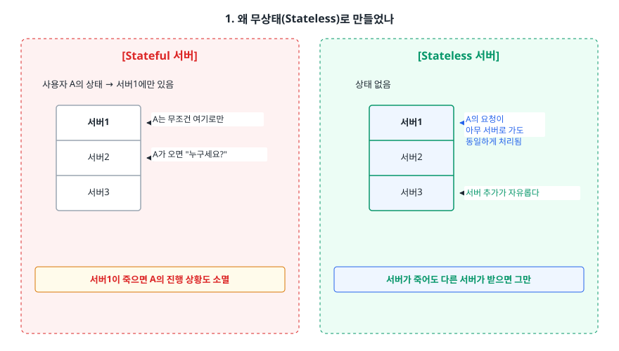
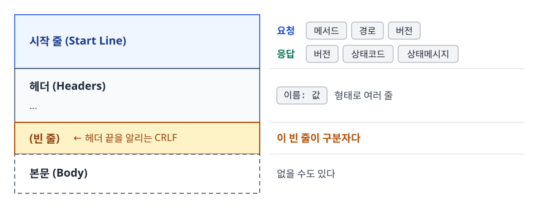
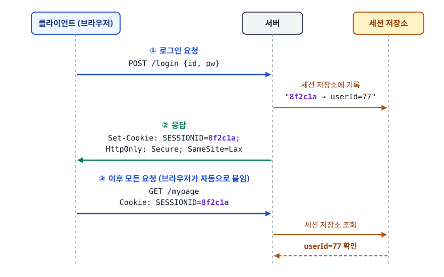
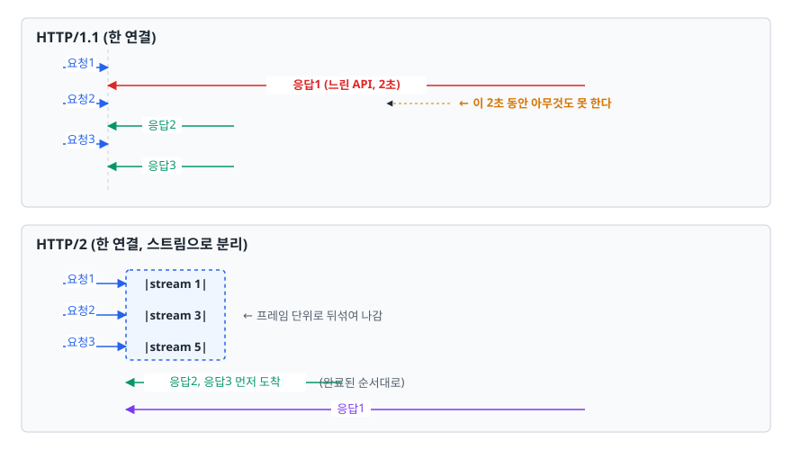

# HTTP와 HTTPS (HyperText Transfer Protocol)

> HTTP는 상태를 기억하지 않는 대신 확장성을 얻었고, 그 대가로 쿠키·세션이 필요해졌습니다. HTTP/1.1에서 3까지 무엇이 바뀌었는지도 이 문서에서 설명합니다.

## 학습 목표

- [ ] 무상태성(Stateless)의 이유와 그로 인한 트레이드오프를 설명할 수 있다
- [ ] HTTP 요청/응답 메시지를 직접 손으로 쓸 수 있다
- [ ] 메서드의 안전성(Safe)과 멱등성(Idempotent)을 구분해 설명할 수 있다
- [ ] 상태 코드를 상황에 맞게 고를 수 있다 (301 vs 308, 401 vs 403 등)
- [ ] 쿠키 속성(HttpOnly, Secure, SameSite)이 각각 무엇을 막는지 안다
- [ ] HTTP/1.1 · 2 · 3의 문제와 해결책을 연결지어 설명할 수 있다

## 선행 지식

- [01-osi-tcp-ip.md](./01-osi-tcp-ip.md) - HTTP가 7계층이라는 것, 그 아래 TCP가 있다는 것

---

## 1. 왜 무상태(Stateless)로 만들었나

HTTP를 설계할 때 선택지는 두 개였습니다. 서버가 "이 사용자는 지금 3단계 결제 화면을 보고 있다"를 기억하게 만들 것인가(Stateful), 아니면 매 요청을 완전히 독립된 사건으로 취급할 것인가(Stateless).

HTTP는 후자를 골랐습니다. 이유는 **확장성**입니다.

<!-- diagram:cs-http-https-1 -->


<!-- 위 그림이 대체한 원본 ASCII.
     내용을 고칠 때는 그림도 함께 갱신할 것.
```
[Stateful 서버]                        [Stateless 서버]

 사용자 A의 상태 → 서버1에만 있음        상태 없음
 ┌──────┐                              ┌──────┐
 │ 서버1│ ← A는 무조건 여기로만          │ 서버1│ ← A의 요청이
 ├──────┤                              ├──────┤    아무 서버로 가도
 │ 서버2│ ← A가 오면 "누구세요?"         │ 서버2│    동일하게 처리됨
 ├──────┤                              ├──────┤
 │ 서버3│                              │ 서버3│ ← 서버 추가가 자유롭다
 └──────┘                              └──────┘
 서버1이 죽으면 A의 진행 상황도 소멸        서버가 죽어도 다른 서버가 받으면 그만
```
-->

서버가 상태를 안 들고 있으면 요청을 어느 서버가 처리하든 결과가 같습니다. 그래서 트래픽이 늘면 서버를 늘리기만 하면 되고(수평 확장), 서버 한 대가 죽어도 세션이 날아가지 않습니다. 응답을 캐싱하기도 쉬워집니다. 요청만 보고 응답이 결정되니까 중간 프록시가 그 응답을 저장해 뒀다 재사용할 수 있습니다.

대가도 명확합니다. **매 요청마다 "나 누구야"를 다시 말해야 합니다.** 로그인 상태를 유지하려면 클라이언트가 무언가를 계속 들고 다녀야 하는데, 그게 5절의 쿠키입니다.

> **비유**: 무인 민원 발급기. 창구 직원(Stateful)은 내 얼굴을 기억하지만 그 직원이 퇴근하면 처음부터입니다. 발급기(Stateless)는 매번 신분증을 넣어야 하지만, 기계를 열 대로 늘려도 아무 데나 가면 됩니다.
>
> **비유의 한계**: 발급기는 여전히 내부 DB를 조회합니다. HTTP가 무상태라는 건 **프로토콜 수준** 이야기입니다. 애플리케이션이 DB에 사용자 데이터를 저장하는 것과는 별개입니다.

---

## 2. 요청과 응답의 구조

HTTP/1.1 메시지는 사람이 읽을 수 있는 텍스트입니다. 구조가 단순해서 손으로 써볼 수 있습니다.

<!-- diagram:cs-http-https-2 -->


<!-- 위 그림이 대체한 원본 ASCII.
     내용을 고칠 때는 그림도 함께 갱신할 것.
```
┌─────────────────────────────────────────┐
│ 시작 줄 (Start Line)                    │  요청: 메서드 경로 버전
├─────────────────────────────────────────┤  응답: 버전 상태코드 상태메시지
│ 헤더 (Headers)                          │  이름: 값  형태로 여러 줄
│ ...                                     │
├─────────────────────────────────────────┤
│ (빈 줄)  ← 헤더 끝을 알리는 CRLF         │  이 빈 줄이 구분자다
├─────────────────────────────────────────┤
│ 본문 (Body)                             │  없을 수도 있다
└─────────────────────────────────────────┘
```
-->

실제 요청:

```http
POST /api/orders HTTP/1.1
Host: shop.example.com
Content-Type: application/json
Content-Length: 34
Cookie: SESSIONID=8f2c1a...; theme=dark
Accept: application/json

{"productId": 1024, "quantity": 2}
```

실제 응답:

```http
HTTP/1.1 201 Created
Content-Type: application/json; charset=utf-8
Location: /api/orders/55130
Cache-Control: no-store
Set-Cookie: SESSIONID=8f2c1a...; HttpOnly; Secure; SameSite=Lax

{"orderId": 55130, "status": "PENDING"}
```

`Host` 헤더는 HTTP/1.1에서 필수입니다. 하나의 IP에 여러 도메인이 올라가는 가상 호스팅에서 서버가 "어느 사이트로 온 요청인지" 구분할 방법이 이것뿐이기 때문입니다. HTTP/1.0에는 이 헤더가 없어서 IP 하나당 사이트 하나만 운영할 수 있었습니다.

직접 확인하려면:

```bash
# 요청/응답 헤더를 모두 출력 (> 는 보낸 것, < 는 받은 것)
curl -v https://example.com

# 헤더만 보기 (HEAD 요청)
curl -I https://example.com

# 본문과 함께 POST
curl -X POST https://httpbin.org/post \
  -H "Content-Type: application/json" \
  -d '{"a":1}'
```

---

## 3. 메서드 — 안전성과 멱등성

메서드를 고를 때 기준은 두 가지 성질입니다.

- **안전(Safe)**: 서버의 리소스를 변경하지 않습니다. 읽기 전용입니다.
- **멱등(Idempotent)**: 같은 요청을 1번 보내든 100번 보내든 **서버의 최종 상태**가 같습니다.

멱등성을 "응답이 매번 같다"로 오해하는 경우가 많습니다. 응답 코드는 달라질 수 있습니다. `DELETE /users/1`은 첫 요청이 204, 두 번째가 404일 수 있지만 "1번 사용자가 없다"는 최종 상태는 동일하므로 멱등입니다.

| 메서드 | 용도 | 안전 | 멱등 | 본문 | 캐시 |
|--------|------|:----:|:----:|:----:|:----:|
| GET | 조회 | O | O | X | O |
| HEAD | 헤더만 조회 | O | O | X | O |
| OPTIONS | 지원 메서드/CORS 사전 확인 | O | O | X | X |
| POST | 생성, 비정형 처리 | X | X | O | 조건부 |
| PUT | 전체 교체 | X | O | O | X |
| PATCH | 부분 수정 | X | X | O | X |
| DELETE | 삭제 | X | O | 선택 | X |

**그래서 언제 뭘 쓰나** — 조회는 GET, 생성은 POST가 기본입니다. 클라이언트가 리소스 ID까지 정해서 통째로 덮어쓸 때만 PUT을 쓰고, 일부 필드만 고칠 땐 PATCH를 씁니다.

멱등성이 실무에서 중요한 이유는 **재시도**입니다. 네트워크 타임아웃이 났을 때 GET·PUT·DELETE는 안심하고 다시 보내도 되지만, POST는 결제가 두 번 될 수 있어서 함부로 재시도하면 안 됩니다. 그래서 결제 API는 보통 클라이언트가 만든 고유 키(Idempotency-Key 같은 헤더)를 받아 서버가 중복 요청을 걸러내는 방식으로 POST에 멱등성을 인위적으로 부여합니다.

---

## 4. 상태 코드

첫 자리가 분류입니다. 1xx 정보, 2xx 성공, 3xx 리다이렉트, 4xx 클라이언트 잘못, 5xx 서버 잘못.

| 코드 | 이름 | 언제 쓰나 |
|------|------|-----------|
| 200 | OK | 일반 성공. 본문 있음 |
| 201 | Created | 생성 성공. `Location` 헤더에 새 리소스 URI를 담는다 |
| 204 | No Content | 성공했지만 보낼 본문이 없다 (DELETE 응답에 자주) |
| 301 | Moved Permanently | 영구 이동. 브라우저가 캐싱하므로 되돌리기 어렵다 |
| 302 | Found | 임시 이동. 히스토리상 POST를 GET으로 바꾸는 구현이 많다 |
| 304 | Not Modified | 캐시가 아직 유효함. 본문을 안 보내 대역폭을 아낀다 |
| 307 | Temporary Redirect | 302와 같되 **메서드를 반드시 유지** |
| 308 | Permanent Redirect | 301과 같되 **메서드를 반드시 유지** |
| 400 | Bad Request | 요청 형식 자체가 잘못됨 |
| 401 | Unauthorized | **인증 안 됨.** "당신이 누군지 모르겠다" |
| 403 | Forbidden | **인가 없음.** "누군지는 알겠는데 권한이 없다" |
| 404 | Not Found | 리소스 없음 |
| 405 | Method Not Allowed | 경로는 맞는데 그 메서드는 지원 안 함 |
| 409 | Conflict | 현재 상태와 충돌 (중복 가입, 동시 수정 등) |
| 429 | Too Many Requests | 레이트 리밋 초과. `Retry-After` 헤더를 같이 준다 |
| 500 | Internal Server Error | 서버 코드에서 처리 못 한 예외 |
| 502 | Bad Gateway | 프록시/게이트웨이가 뒷단에서 잘못된 응답을 받음 |
| 503 | Service Unavailable | 일시적 과부하·점검 |
| 504 | Gateway Timeout | 뒷단 응답이 제 시간에 안 옴 |

**401과 403의 구분**은 면접 단골입니다. 토큰이 없거나 만료됐으면 401, 토큰은 유효한데 그 사용자가 접근할 수 없는 자원이면 403입니다.

**502와 504의 구분**도 자주 나옵니다. 둘 다 리버스 프록시(Nginx 등)가 내는 코드인데, 502는 백엔드가 아예 죽었거나 이상한 응답을 준 것이고, 504는 백엔드가 살아는 있지만 너무 느린 것입니다.

---

## 5. 쿠키와 세션

무상태 HTTP에서 로그인을 유지하려면 클라이언트가 식별자를 들고 다녀야 합니다. 서버가 `Set-Cookie`로 발급하면 브라우저가 저장했다가 같은 도메인 요청마다 `Cookie` 헤더로 자동 첨부합니다.

<!-- diagram:cs-http-https-3 -->


<!-- 위 그림이 대체한 원본 ASCII.
     내용을 고칠 때는 그림도 함께 갱신할 것.
```
① 로그인 요청
   POST /login  {id, pw}
   ────────────────────────────────►  [서버]
                                       세션 저장소에
                                       "8f2c1a → userId=77" 기록
② 응답
   Set-Cookie: SESSIONID=8f2c1a; HttpOnly; Secure; SameSite=Lax
   ◄────────────────────────────────

③ 이후 모든 요청 (브라우저가 자동으로 붙임)
   GET /mypage
   Cookie: SESSIONID=8f2c1a
   ────────────────────────────────►  세션 저장소 조회 → userId=77 확인
```
-->

쿠키에 `userId=77`을 그대로 넣으면 사용자가 값을 78로 고쳐서 남의 계정이 됩니다. 그래서 쿠키에는 **식별자만** 담고 실제 사용자 정보는 서버가 들고 있는 구조를 씁니다. 이것이 세션 방식입니다.

### 쿠키 속성이 각각 막는 것

| 속성 | 하는 일 | 없으면 생기는 문제 |
|------|---------|-------------------|
| `HttpOnly` | JavaScript의 `document.cookie` 접근 차단 | XSS로 삽입된 스크립트가 세션 쿠키를 통째로 탈취 |
| `Secure` | HTTPS 연결에서만 전송 | 카페 와이파이에서 평문 HTTP 요청 한 번에 쿠키 노출 |
| `SameSite=Lax/Strict` | 다른 사이트에서 시작된 요청에 쿠키 미첨부 | CSRF — 악성 사이트가 사용자 브라우저로 내 서비스에 요청 |
| `Domain` / `Path` | 쿠키를 보낼 범위 제한 | 불필요한 하위 도메인·경로까지 쿠키가 새어 나감 |
| `Max-Age` / `Expires` | 만료 시점 지정 | 없으면 브라우저 종료 시 삭제되는 세션 쿠키가 된다 |

`SameSite=None`을 쓰려면 `Secure`가 반드시 함께 있어야 합니다. 크로스 사이트로 쿠키를 보내는 만큼 최소한 암호화는 강제하는 것입니다.

### 세션 방식의 약점

서버가 세션을 메모리에 들고 있으면, 서버를 2대로 늘리는 순간 "1번 서버에서 로그인했는데 2번 서버로 가면 로그아웃"이 됩니다. 해결책은 세 가지입니다.

- **Sticky Session** — 로드밸런서가 같은 사용자를 같은 서버로 고정. 간단하지만 그 서버가 죽으면 세션도 죽고 부하가 한쪽으로 쏠립니다.
- **세션 클러스터링** — 서버끼리 세션을 복제. 서버 수가 늘수록 복제 비용이 커집니다.
- **외부 세션 스토어** — Redis 등에 세션을 몰아 저장. 현재 가장 널리 쓰이는 방식.

---

## 6. HTTP/1.1 → HTTP/2 → HTTP/3

### HTTP/1.1이 겪던 문제

HTTP/1.0은 요청 하나마다 TCP 연결을 새로 맺고 끊었습니다. 3-way 핸드셰이크 비용을 매번 냈다는 뜻입니다. HTTP/1.1이 Keep-Alive(지속 연결)로 이걸 해결했지만, 더 큰 문제가 남았습니다.

**한 연결에서는 요청을 보낸 순서대로 응답을 받아야 합니다.** 파이프라이닝으로 요청을 몰아 보낼 수는 있어도 응답 순서는 못 바꿉니다. 앞 응답이 느리면 뒤 응답들이 전부 대기합니다. 이것이 **HOL 블로킹(Head-of-Line Blocking)** 입니다.

<!-- diagram:cs-http-https-4 -->


<!-- 위 그림이 대체한 원본 ASCII.
     내용을 고칠 때는 그림도 함께 갱신할 것.
```
HTTP/1.1 (한 연결)
요청1 ─►
      ◄──────────── 응답1 (느린 API, 2초)
요청2 ─►                                    ← 이 2초 동안 아무것도 못 한다
      ◄─ 응답2
요청3 ─►
      ◄─ 응답3

HTTP/2 (한 연결, 스트림으로 분리)
요청1 ─► │stream 1│
요청2 ─► │stream 3│  ← 프레임 단위로 뒤섞여 나감
요청3 ─► │stream 5│
      ◄─ 응답2, 응답3 먼저 도착 (완료된 순서대로)
      ◄──────────── 응답1
```
-->

브라우저는 이 한계를 도메인당 6개 정도의 병렬 연결로 우회했습니다. 개발자들은 이미지 스프라이트나 도메인 샤딩 같은 편법을 썼습니다.

### HTTP/2가 바꾼 것

- **바이너리 프레이밍** — 텍스트 파싱을 버리고 고정 형식 프레임으로 바꿔 파싱이 빠르고 오류가 적습니다.
- **멀티플렉싱** — 하나의 TCP 연결 안에 여러 **스트림(Stream)** 을 만들고 프레임을 섞어 보냅니다. 응답 순서 제약이 사라집니다.
- **HPACK 헤더 압축** — 정적/동적 테이블로 반복 헤더를 인덱스 번호로 대체합니다. 매 요청 붙는 쿠키·User-Agent 오버헤드가 크게 줍니다.
- **스트림 우선순위** — CSS를 이미지보다 먼저 받도록 힌트를 줄 수 있습니다.
- **서버 푸시** — 요청 전에 서버가 리소스를 미리 보내는 기능. 실제로는 이미 캐시된 리소스를 중복 전송하는 문제가 커서 주요 브라우저가 지원을 걷어냈고, 지금은 `103 Early Hints`로 "이 리소스를 미리 받아두라"고 힌트만 주는 방식이 선호됩니다.

### HTTP/2가 못 푼 것, 그리고 HTTP/3

HTTP/2는 **애플리케이션 계층**의 HOL 블로킹을 없앴습니다. 그런데 그 아래 TCP는 여전히 "바이트 스트림을 순서대로 전달"하는 프로토콜입니다. 패킷 하나가 유실되면 TCP는 재전송이 도착할 때까지 그 뒤 데이터를 애플리케이션에 올려주지 않습니다. 한 연결에 스트림을 다 몰아넣었으니, **패킷 하나 유실이 모든 스트림을 멈춥니다.** 이것이 **TCP 수준의 HOL 블로킹**입니다. 연결을 하나로 줄인 대가로 오히려 손실 환경에서 더 취약해집니다.

HTTP/3는 TCP를 버리고 UDP 위에 만든 **QUIC**을 씁니다.

- 신뢰성·순서 보장·혼잡 제어를 QUIC이 직접 구현하되, **스트림별로 독립적으로** 관리합니다. 스트림 3의 패킷이 유실돼도 스트림 5는 그대로 진행됩니다.
- **TLS 1.3이 프로토콜에 내장**되어 있습니다. TCP 핸드셰이크 + TLS 핸드셰이크를 따로 하던 것을 한 번에 끝내 1-RTT로 연결이 섭니다. 재접속 시엔 0-RTT도 가능합니다.
- **연결 ID**로 연결을 식별하므로, 와이파이에서 LTE로 바뀌어 IP가 변해도 연결이 끊기지 않습니다(연결 마이그레이션).

브라우저는 처음엔 HTTP/2로 접속했다가, 서버가 준 `Alt-Svc` 헤더를 보고 다음부터 HTTP/3로 전환합니다.

| 항목 | HTTP/1.1 | HTTP/2 | HTTP/3 |
|------|----------|--------|--------|
| 전송 계층 | TCP | TCP | UDP + QUIC |
| 메시지 형식 | 텍스트 | 바이너리 프레임 | 바이너리 프레임 |
| 다중화 | 없음 (연결 여러 개로 우회) | 스트림 멀티플렉싱 | 스트림 멀티플렉싱 |
| 앱 계층 HOL | 있음 | 해결 | 해결 |
| 전송 계층 HOL | 있음 | **있음** | 해결 |
| 헤더 압축 | 없음 | HPACK | QPACK |
| 암호화 | 선택 (HTTPS일 때만) | 사실상 필수 | 프로토콜에 내장 |
| 연결 수립 | TCP 1-RTT (+TLS) | TCP 1-RTT (+TLS) | 1-RTT, 재접속 0-RTT |

**그래서 뭘 쓰나** — 새로 만드는 서비스라면 HTTP/2 이상을 켭니다. 손실률이 높은 모바일 환경 비중이 크면 HTTP/3의 이득이 특히 큽니다. 다만 UDP를 막는 네트워크가 아직 있어서 HTTP/2 폴백은 항상 열어둡니다.

---

## 7. HTTPS는 무엇을 보장하나

HTTPS는 새로운 프로토콜이 아니라 **HTTP를 TLS 위에 얹은 것**입니다(포트 443). TLS가 보장하는 건 정확히 세 가지입니다.

| 보장 | 막는 공격 | 어떻게 |
|------|-----------|--------|
| 기밀성(Confidentiality) | 도청 | 대칭키로 본문·헤더 암호화 |
| 무결성(Integrity) | 변조 | 메시지 인증 태그로 한 비트만 바뀌어도 탐지 |
| 인증(Authentication) | 위장(피싱, 중간자) | CA가 서명한 인증서로 "이 도메인의 진짜 서버"임을 증명 |

세 번째가 특히 중요합니다. 암호화만 있고 인증이 없으면 공격자가 중간에서 "내가 서버다"라며 자기 키로 암호화 연결을 맺어버릴 수 있습니다. 이게 중간자 공격(MITM)입니다.

**HTTPS가 보장하지 않는 것**도 분명히 알아야 합니다.

- 서버 애플리케이션 자체의 안전 — SQL 인젝션이나 XSS는 HTTPS와 무관합니다.
- 접속 사실의 은폐 — 목적지 IP는 그대로 보이고, TLS 핸드셰이크의 SNI에 도메인이 평문으로 실립니다. "무엇을 봤는지"는 가려도 "어디에 접속했는지"는 대체로 드러납니다.
- 트래픽 크기·타이밍 — 패킷 크기 패턴으로 어떤 페이지를 봤는지 추정하는 연구들이 있습니다.

핸드셰이크 절차와 인증서 체인은 [05-ssl-tls-handshake.md](./05-ssl-tls-handshake.md)에서 자세히 다룹니다.

---

## 8. 실무에서는

- **HSTS** — 서버가 `Strict-Transport-Security` 헤더를 주면 브라우저가 그 도메인을 이후 항상 HTTPS로만 접속합니다. "http://로 접속 → 301로 https 이동" 사이의 첫 요청이 가로채이는 틈을 막습니다.
- **캐시 헤더** — `Cache-Control: max-age`로 재검증 없이 쓸 기간을 주고, `ETag`/`Last-Modified`로 조건부 요청을 만들어 변경 없으면 304를 받습니다. 정적 자산은 파일명에 해시를 넣고 `max-age=31536000, immutable`을 주는 패턴이 흔합니다.
- **CORS** — 브라우저의 동일 출처 정책 때문에 다른 출처 API를 부를 때 `Access-Control-Allow-Origin` 등의 응답 헤더가 필요합니다. 일부 요청은 OPTIONS 프리플라이트가 먼저 나갑니다.
- **압축** — `Accept-Encoding: gzip, br`에 맞춰 서버가 압축 응답을 줍니다. 이미 압축된 이미지·동영상은 다시 압축해봐야 손해입니다.

---

## 9. 면접 포인트

> 면접에서 이 주제가 나오면 이렇게 답한다

**Q. HTTP가 무상태라는 게 무슨 의미이고, 왜 그렇게 설계했나요?**

A. 서버가 이전 요청의 문맥을 기억하지 않고 각 요청을 독립적으로 처리한다는 뜻입니다. 어떤 서버가 요청을 받아도 결과가 같아서 이점이 세 가지 생깁니다. 수평 확장이 자유롭고, 서버 장애 시 다른 서버가 그대로 받을 수 있고, 중간 프록시가 응답을 캐싱하기도 쉽습니다. 대신 로그인 유지 같은 연속성은 클라이언트가 쿠키·토큰으로 식별자를 들고 다니며 해결합니다.
- 꼬리 질문: "그럼 세션을 서버에 저장하면 무상태가 깨지는 것 아닌가요?" → 프로토콜은 여전히 무상태입니다. 다만 애플리케이션이 상태를 갖게 되므로 확장성 이점이 줄고, 그래서 Redis 같은 외부 스토어로 상태를 서버 밖으로 빼내는 것입니다.

**Q. 멱등성이 뭐고 왜 중요한가요?**

A. 같은 요청을 여러 번 보내도 서버의 최종 상태가 동일한 성질입니다. GET·PUT·DELETE는 멱등이고 POST·PATCH는 아닙니다. 중요한 이유는 재시도 안전성입니다. 타임아웃이 났을 때 멱등 메서드는 그냥 다시 보내면 됩니다. POST는 중복 처리 위험이 있어서, 클라이언트가 생성한 고유 키를 서버가 기억해 중복을 걸러내는 식의 별도 설계가 필요합니다.
- 꼬리 질문: "DELETE가 두 번째엔 404를 주는데도 멱등인가요?" → 멱등성은 응답 코드가 아니라 서버 상태의 동일성을 말합니다. "그 리소스가 없다"는 상태는 두 경우 모두 같으므로 멱등입니다.

**Q. HTTP/2가 HOL 블로킹을 해결했다는데, HTTP/3는 왜 또 나왔나요?**

A. HTTP/2가 해결한 건 애플리케이션 계층의 HOL입니다. 그 아래 TCP는 여전히 순서 보장 스트림이라 패킷 하나가 유실되면 재전송이 올 때까지 그 뒤 모든 데이터가 애플리케이션으로 올라가지 못합니다. 연결을 하나로 합쳐 놓았으니 유실 하나가 전체 스트림을 멈춥니다. HTTP/3는 UDP 기반 QUIC 위에서 스트림별로 독립적인 재전송·흐름 제어를 하므로 이 문제가 사라지고, TLS 1.3이 내장돼 연결 수립도 빠릅니다.
- 꼬리 질문: "그럼 HTTP/3가 항상 더 빠른가요?" → 손실이 거의 없는 안정적 유선망에서는 차이가 작고, UDP를 차단하는 네트워크도 있어 HTTP/2 폴백이 필요합니다. 이득이 큰 쪽은 손실·지연이 큰 모바일 환경입니다.

**Q. 쿠키에 HttpOnly, Secure, SameSite를 왜 붙이나요?**

A. 각각 다른 공격을 막습니다. HttpOnly는 JavaScript 접근을 차단해 XSS로 세션 쿠키가 탈취되는 걸 막고, Secure는 HTTPS에서만 전송해 평문 노출을 막으며, SameSite는 다른 사이트발 요청에 쿠키를 안 붙여 CSRF를 막습니다. 세 가지는 서로 대체 관계가 아니라 함께 걸어야 합니다.
- 꼬리 질문: "SameSite=Strict와 Lax 차이는?" → Strict는 외부 링크로 들어올 때조차 쿠키를 안 보내 로그인 상태가 풀린 것처럼 보입니다. Lax는 최상위 내비게이션 GET에는 허용해 사용성과 방어를 절충합니다.

---

## 자주 하는 실수

| 실수 | 왜 틀렸나 | 올바른 이해 |
|------|----------|-----------|
| "멱등 = 응답이 항상 같다" | 응답 코드는 달라질 수 있다 | 서버의 **최종 상태**가 같은 것이 멱등이다 |
| 권한 부족에 401을 반환 | 401은 인증(누구인지) 실패다 | 인증 실패 401, 인가 실패 403 |
| "HTTPS면 안전하다" | 전송 구간만 보호한다 | 서버 취약점(XSS, 인젝션)은 그대로다 |
| "HTTP/2는 서버 푸시가 핵심" | 실제로는 폐기 수순을 밟았다 | 핵심은 멀티플렉싱과 HPACK. 프리로드 힌트는 103 Early Hints |
| 쿠키에 사용자 ID를 그대로 저장 | 클라이언트가 값을 고칠 수 있다 | 추측 불가능한 세션 식별자나 서명된 토큰을 쓴다 |
| POST를 무조건 재시도 | 중복 생성·중복 결제가 난다 | 멱등 키를 설계하거나 PUT으로 바꿀 수 있는지 검토 |
| "301과 302는 그냥 영구/임시 차이" | 둘 다 POST가 GET으로 바뀔 수 있다 | 메서드를 지켜야 하면 307/308을 쓴다 |

---

## 한 줄 정리

HTTP는 확장성을 위해 상태를 버렸고, 그 대가로 쿠키가 생겼습니다. 버전이 바뀌어 온 역사는 "하나의 연결에서 얼마나 많은 요청을 막힘 없이 처리하는가"를 푸는 과정이었습니다.

---

## 연관 개념

- [01-osi-tcp-ip.md](./01-osi-tcp-ip.md) - HTTP가 어느 계층에서 무엇 위에 얹혀 있는지
- [03-tcp-udp.md](./03-tcp-udp.md) - HTTP/2의 TCP HOL 블로킹이 왜 생기는지의 근본
- [05-ssl-tls-handshake.md](./05-ssl-tls-handshake.md) - HTTPS의 S가 실제로 하는 일
- [qna-network.md](./qna-network.md) - Q2, Q5, Q7, Q8, Q9, Q10이 이 주제
- [../../05-api-design/qna-api-design.md](../../05-api-design/qna-api-design.md) - REST 설계와 상태 코드 선택
- [../../08-security/qna-security.md](../../08-security/qna-security.md) - XSS, CSRF와 쿠키 방어 속성
