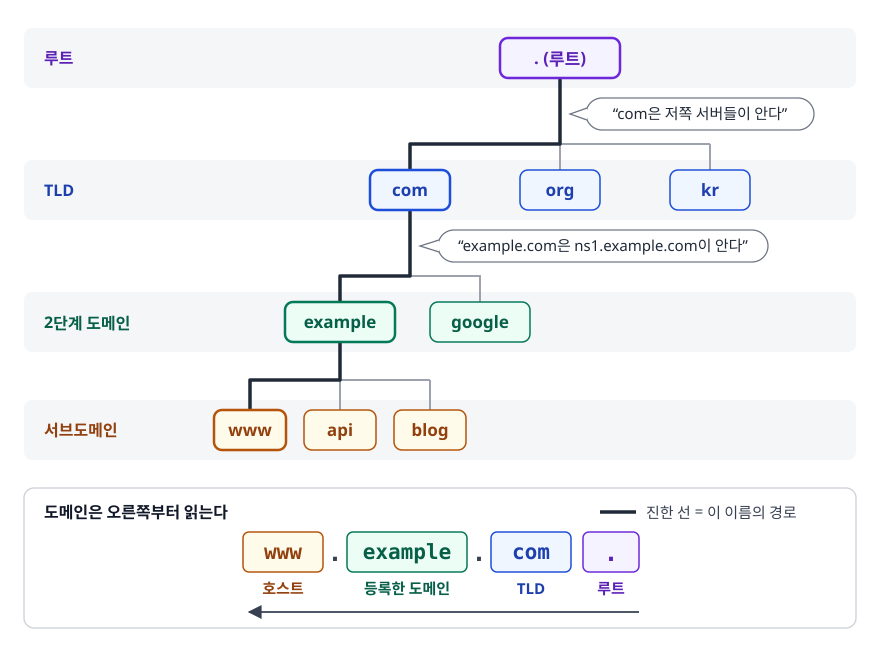
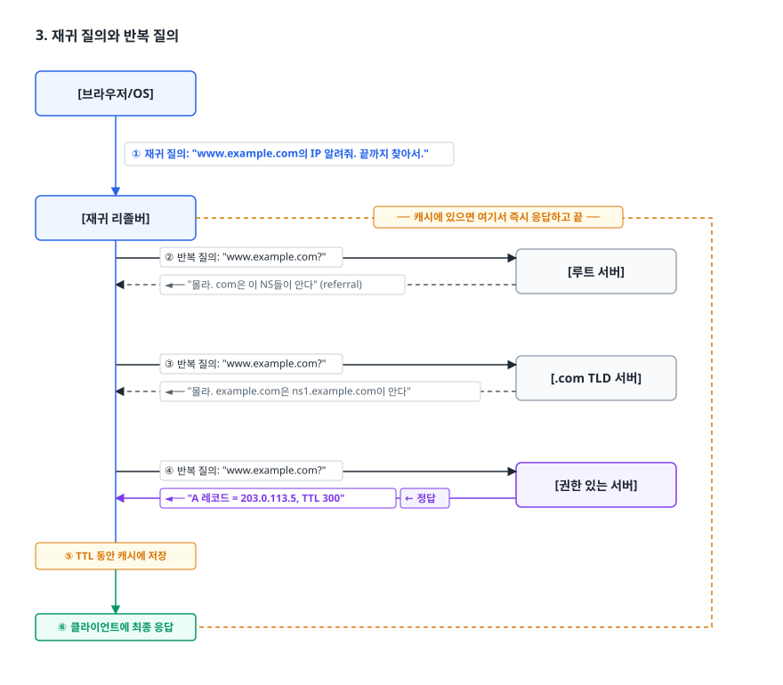
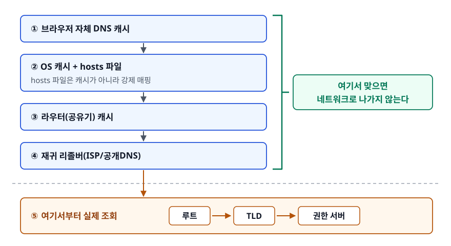
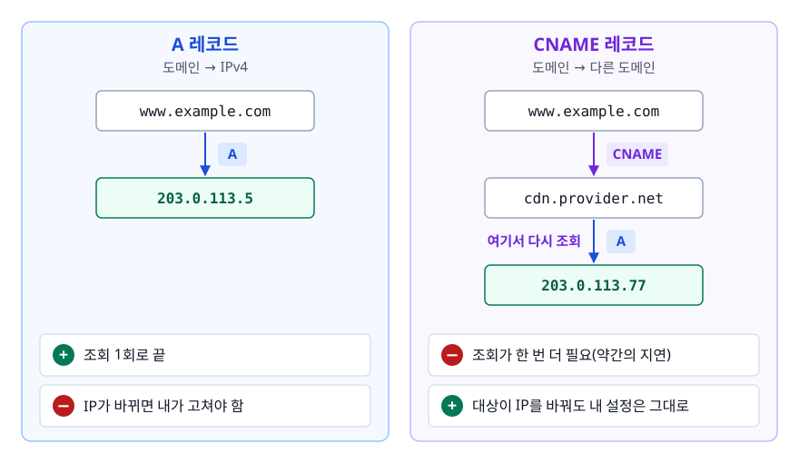
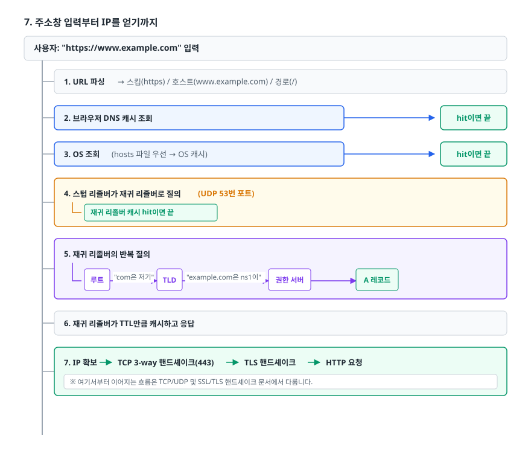

# DNS 이름 해석 (DNS Resolution)

> 주소창에 도메인을 치는 순간부터 IP 주소를 손에 넣기까지 어떤 서버들이 어떤 순서로 개입하는지, 캐시가 어디에 몇 겹으로 깔려 있는지를 설명할 수 있게 된다.

## 학습 목표

- [ ] DNS가 왜 계층형 분산 구조로 만들어졌는지 설명할 수 있다
- [ ] 재귀 질의와 반복 질의의 주체와 차이를 구분할 수 있다
- [ ] A / AAAA / CNAME / MX / NS 레코드를 상황에 맞게 고를 수 있다
- [ ] TTL을 길게/짧게 잡을 때의 트레이드오프를 설명할 수 있다
- [ ] 도메인 입력부터 IP 획득까지를 캐시 계층을 포함해 순서대로 말할 수 있다
- [ ] `dig` / `nslookup`으로 직접 조회하고 결과를 읽을 수 있다

## 선행 지식

- [01-osi-tcp-ip.md](./01-osi-tcp-ip.md) - IP 주소가 무엇인지
- [03-tcp-udp.md](./03-tcp-udp.md) - DNS가 왜 주로 UDP를 쓰는지 이해하는 데 도움

---

## 1. 왜 필요한가

인터넷 초기에는 `HOSTS.TXT`라는 파일 하나에 모든 호스트 이름과 IP를 적어두고,
각 기관이 주기적으로 그 파일을 내려받아 쓰는 방식이었다. 호스트가 수백 대일 땐 굴러갔지만
수천 대가 되자 무너졌다. 이유는 셋이다.

- **갱신 병목** — 새 호스트 하나 추가하려면 중앙 파일을 고치고 전 세계가 다시 내려받아야 한다.
- **이름 충돌** — 누가 어떤 이름을 쓸지 중앙에서 다 관리해야 한다.
- **단일 장애점** — 그 파일을 배포하는 곳이 죽으면 끝이다.

DNS(Domain Name System)는 이 문제를 **위임(Delegation)** 으로 푼다.
루트는 `.com`을 누가 관리하는지만 알고, `.com` 관리자는 `example.com`을 누가 관리하는지만 알고,
`example.com` 관리자가 `www.example.com`의 IP를 안다.
각자 자기 구역만 책임지므로, 내가 `blog.example.com`을 추가할 때 세상 누구의 허락도 필요 없다.

> **비유** — 회사 대표번호 → 부서 → 담당자로 이어지는 전화 연결. 대표 교환원은 모든 직원 번호를 외우지 않고
> "인사팀은 3번"만 안다. 인사팀에서 담당자 내선을 알려준다.
>
> **비유의 한계** — 전화는 교환원이 직접 연결해주지만, DNS의 루트·TLD 서버는 **연결해주지 않고 주소만 알려준다.**
> 실제로 다시 전화를 거는 건 리졸버 몫이다(3절의 반복 질의).

---

## 2. 계층 구조와 등장인물

<!-- diagram:cs-dns-resolution-1 -->


<!-- 위 그림이 대체한 원본 ASCII.
     내용을 고칠 때는 그림도 함께 갱신할 것.
```
                          . (루트)
                          │  "com은 저쪽 서버들이 안다"
        ┌─────────────────┼─────────────────┐
       com               org               kr          ← TLD
        │  "example.com은 ns1.example.com이 안다"
   ┌────┴────┐
 example   google                                      ← 2단계 도메인
    │
 ┌──┴──┬────────┐
www   api   blog                                       ← 서브도메인
```
-->

도메인은 오른쪽부터 읽는다. `www.example.com.`의 맨 끝 점이 루트이고,
`com`이 TLD, `example`이 등록한 도메인, `www`가 호스트다.

| 서버 | 역할 | 누가 운영하나 |
|------|------|--------------|
| 스텁 리졸버(Stub Resolver) | OS/브라우저 안의 최소 클라이언트. 재귀 리졸버에 물어보기만 한다 | 운영체제 |
| 재귀 리졸버(Recursive Resolver) | 답을 끝까지 찾아오는 대행자. 캐시를 갖는다 | ISP, 사내망, 공개 DNS(8.8.8.8, 1.1.1.1 등) |
| 루트 서버(Root) | TLD 서버 위치를 알려준다 | 13개 논리 주소(a~m.root-servers.net), 애니캐스트로 전 세계에 다수의 실제 서버 |
| TLD 서버 | `.com`, `.kr` 등 해당 TLD 안의 도메인이 어느 네임서버에 위임됐는지 안다 | 레지스트리 |
| 권한 있는 서버(Authoritative) | 그 도메인의 실제 레코드를 보유. **최종 정답의 출처** | 도메인 소유자 또는 DNS 호스팅 업체 |

"13개"는 서버 대수가 아니라 **주소 개수**다. 애니캐스트 덕분에 같은 IP로 요청해도
지리적으로 가장 가까운 실제 서버가 응답한다.

---

## 3. 재귀 질의와 반복 질의

두 개념을 헷갈리는 이유는 **같은 조회 안에서 둘 다 일어나기 때문**이다. 주체가 다르다.

- **재귀 질의(Recursive Query)** — "최종 답을 구해서 가져와라"라고 **책임을 통째로 위임**하는 질의. 클라이언트 → 재귀 리졸버 구간이 여기다.
- **반복 질의(Iterative Query)** — "네가 아는 만큼만 답해라"라는 질의. 답을 모르면 "저쪽에 물어봐"라고 다음 서버를 알려준다(referral). 재귀 리졸버 → 루트/TLD/권한 서버 구간이 전부 이것이다.

<!-- diagram:cs-dns-resolution-2 -->


<!-- 위 그림이 대체한 원본 ASCII.
     내용을 고칠 때는 그림도 함께 갱신할 것.
```
[브라우저/OS]
    │
    │ ① 재귀 질의: "www.example.com의 IP 알려줘. 끝까지 찾아서."
    ▼
[재귀 리졸버]  ── 캐시에 있으면 여기서 즉시 응답하고 끝 ──┐
    │                                                     │
    │ ② 반복 질의: "www.example.com?"                      │
    ├────────────────────────────────► [루트 서버]         │
    │ ◄── "몰라. com은 이 NS들이 안다" (referral)           │
    │                                                     │
    │ ③ 반복 질의: "www.example.com?"                      │
    ├────────────────────────────────► [.com TLD 서버]     │
    │ ◄── "몰라. example.com은 ns1.example.com이 안다"      │
    │                                                     │
    │ ④ 반복 질의: "www.example.com?"                      │
    ├────────────────────────────────► [권한 있는 서버]     │
    │ ◄── "A 레코드 = 203.0.113.5, TTL 300"  ← 정답        │
    │                                                     │
    │ ⑤ TTL 동안 캐시에 저장                                │
    ▼                                                     │
 ⑥ 클라이언트에 최종 응답 ◄────────────────────────────────┘
```
-->

이 구조가 중요한 이유는 **부하 분산**이다. 루트 서버가 전 세계 모든 조회를 다 받아야 한다면 진작 무너졌다.
재귀 리졸버가 결과를 캐시하기 때문에 루트까지 올라가는 질의는 실제로 극히 일부다.

---

## 4. 캐시는 몇 겹인가

<!-- diagram:cs-dns-resolution-3 -->


<!-- 위 그림이 대체한 원본 ASCII.
     내용을 고칠 때는 그림도 함께 갱신할 것.
```
① 브라우저 자체 DNS 캐시     ─┐
② OS 캐시 + hosts 파일        │ 여기서 맞으면 네트워크로 나가지 않는다
③ 라우터(공유기) 캐시         │
④ 재귀 리졸버(ISP/공개DNS)   ─┘
⑤ ── 여기서부터 루트 → TLD → 권한 서버 실제 조회 ──
```
-->

`hosts` 파일은 캐시가 아니라 **강제 매핑**이다. DNS 조회 이전에 참조되며,
여기 적힌 항목은 실제 DNS 값이 무엇이든 우선한다. 로컬 개발에서 `127.0.0.1 dev.myapp.com`을
넣어 쓰는 이유가 이것이다. 위치는 리눅스·macOS가 `/etc/hosts`,
윈도우가 `C:\Windows\System32\drivers\etc\hosts`다.

```bash
# 캐시 확인/삭제 (Windows)
ipconfig /displaydns
ipconfig /flushdns

# 캐시 삭제 (macOS)
sudo dscacheutil -flushcache
```

캐시가 여러 겹이라는 사실은 실무에서 함정이 된다.
"IP를 바꿨는데 왜 아직 옛날 서버로 가지?"의 원인은 대부분 이 중 하나가 옛 값을 붙들고 있어서다.
브라우저를 껐다 켜도 재귀 리졸버 캐시는 그대로다.

**부정 캐싱(Negative Caching)** 도 있다. "그런 도메인 없음(NXDOMAIN)"이라는 답도 캐시된다.
도메인을 새로 만들었는데 그 직전에 조회한 적이 있으면 한동안 안 잡히는 이유다.
이 캐시 시간은 SOA 레코드의 minimum 값을 따른다.

---

## 5. 레코드 타입

DNS는 도메인 → IP만 하는 게 아니다. 도메인에 붙은 **여러 종류의 정보**를 저장하는 분산 DB에 가깝다.

| 타입 | 매핑 | 예시 | 언제 쓰나 |
|------|------|------|-----------|
| `A` | 도메인 → IPv4 | `example.com. 300 IN A 203.0.113.5` | 가장 기본. 서버 IP 지정 |
| `AAAA` | 도메인 → IPv6 | `example.com. 300 IN AAAA 2001:db8::1` | IPv6 지원 |
| `CNAME` | 도메인 → 다른 도메인 | `www.example.com. IN CNAME example.com.` | CDN·SaaS 연결. 대상이 IP를 바꿔도 내가 안 고쳐도 됨 |
| `NS` | 도메인 → 네임서버 | `example.com. IN NS ns1.dnsprovider.net.` | 하위 구역 위임 |
| `MX` | 도메인 → 메일 서버(+우선순위) | `example.com. IN MX 10 mail.example.com.` | 이메일 수신 서버 지정 |
| `TXT` | 도메인 → 임의 문자열 | SPF, DKIM, 도메인 소유 증명 | 메일 인증, 서비스 인증 |
| `SOA` | 구역 관리 정보 | 시리얼, 갱신 주기, 부정 캐싱 TTL | 구역마다 반드시 하나 |
| `PTR` | IP → 도메인 (역방향) | 메일 서버 신뢰도 검증 | 스팸 필터링 |
| `SRV` | 서비스 → 호스트+포트 | `_sip._tcp.example.com.` | 서비스 디스커버리 |
| `CAA` | 도메인 → 허용 CA | 지정한 CA만 인증서 발급 가능 | 오발급 방지 |

### CNAME과 A의 진짜 차이

<!-- diagram:cs-dns-resolution-4 -->


<!-- 위 그림이 대체한 원본 ASCII.
     내용을 고칠 때는 그림도 함께 갱신할 것.
```
[A 레코드]                       [CNAME 레코드]
www.example.com → 203.0.113.5    www.example.com → cdn.provider.net
                                                    │ (여기서 다시 조회)
                                                    ▼
                                                 A 203.0.113.77

조회 1회로 끝                     조회가 한 번 더 필요(약간의 지연)
IP가 바뀌면 내가 고쳐야 함         대상이 IP를 바꿔도 내 설정은 그대로
```
-->

CNAME에는 두 가지 제약이 있고, 둘 다 실무에서 자주 부딪힌다.

1. **루트 도메인(zone apex)에는 설정할 수 없다.** `example.com` 자체에는 SOA와 NS 레코드가 반드시 있어야 하는데, CNAME은 다른 레코드와 공존할 수 없기 때문이다. 그래서 `www.example.com`은 CNAME으로 CDN에 붙일 수 있어도 `example.com`은 안 된다.
2. **다른 레코드와 함께 둘 수 없다.** `www`에 CNAME과 TXT를 같이 두면 안 된다.

1번 때문에 DNS 호스팅 업체들이 ALIAS/ANAME 같은 자체 레코드를 제공한다.
겉보기엔 apex에 CNAME을 건 것처럼 동작하지만, 실제로는 DNS 서버가 대상 도메인을 대신 조회해
A 레코드로 응답해 주는 방식이다. 표준 레코드가 아니라 업체별 기능이다.

---

## 6. TTL — 캐시를 얼마나 믿을 것인가

모든 레코드에는 TTL(Time To Live)이 붙는다. 캐시가 이 값을 신뢰하고,
초 단위로 카운트다운하다 0이 되면 버린 뒤 다시 조회한다.

| TTL | 장점 | 단점 |
|-----|------|------|
| 길게 (예: 86400 = 하루) | 캐시 적중률 높음, 권한 서버 부하 감소, 조회 지연 감소 | IP 변경 반영이 최대 그 시간만큼 늦다 |
| 짧게 (예: 60~300) | 변경이 빠르게 전파, 장애 시 신속한 우회 | 조회 빈도 급증, 지연·비용 증가 |

**그래서 어떻게 하나** — 안정적으로 운영 중인 레코드는 길게 두고,
IP를 바꿀 계획이 있으면 **바꾸기 전에 미리 TTL을 낮춘다.** 순서가 핵심이다.

```
D-2일:  TTL을 86400 → 300으로 변경          (기존 TTL이 만료되며 서서히 전파)
D-Day:  IP 변경                              (5분 안에 대부분 전파됨)
D+1일:  안정화 확인 후 TTL을 다시 86400으로
```

TTL을 당일에 낮춰봐야 소용없다. 이미 하루짜리로 캐시된 리졸버들은 하루가 지나야 새 TTL을 본다.

**중요한 오해 하나** — TTL은 *권고*다. 리졸버가 반드시 지킨다는 보장이 없다.
일부 리졸버나 브라우저는 자체 최소/최대값을 적용한다. 그래서 IP를 바꿀 때는
"TTL 지났으니 이제 옛 서버 꺼도 되겠지"가 아니라, 옛 서버를 얼마간 더 살려두는 게 안전하다.

---

## 7. 주소창 입력부터 IP를 얻기까지

<!-- diagram:cs-dns-resolution-5 -->


<!-- 위 그림이 대체한 원본 ASCII.
     내용을 고칠 때는 그림도 함께 갱신할 것.
```
사용자: "https://www.example.com" 입력
  │
  ├─ 1. URL 파싱 → 스킴(https) / 호스트(www.example.com) / 경로(/)
  │
  ├─ 2. 브라우저 DNS 캐시 조회 ────────────► hit이면 끝
  │
  ├─ 3. OS 조회 (hosts 파일 우선 → OS 캐시) ─► hit이면 끝
  │
  ├─ 4. 스텁 리졸버가 재귀 리졸버로 질의 (UDP 53번 포트)
  │       └─ 재귀 리졸버 캐시 hit이면 끝
  │
  ├─ 5. 재귀 리졸버의 반복 질의
  │       루트 → "com은 저기" → TLD → "example.com은 ns1이" → 권한 서버 → A 레코드
  │
  ├─ 6. 재귀 리졸버가 TTL만큼 캐시하고 응답
  │
  └─ 7. IP 확보 → TCP 3-way 핸드셰이크(443) → TLS 핸드셰이크 → HTTP 요청
```
-->

여기서부터 이어지는 흐름은 [03-tcp-udp.md](./03-tcp-udp.md)와 [05-ssl-tls-handshake.md](./05-ssl-tls-handshake.md)에서 다룬다.

### DNS는 UDP인가 TCP인가

기본은 **UDP 53번**이다. 질의 하나 응답 하나로 끝나는 짧은 거래에
3-way 핸드셰이크를 하는 건 배보다 배꼽이 크기 때문이다.
응답이 UDP 한 패킷에 안 들어갈 만큼 크면(예: 많은 레코드, DNSSEC 서명) 잘렸다는 표시(TC 비트)를 주고,
클라이언트가 **TCP 53번**으로 다시 물어본다. 구역 전송(Zone Transfer)도 TCP를 쓴다.

요즘은 프라이버시 문제로 암호화된 DNS도 쓰인다. **DoT(DNS over TLS, 853)** 와
**DoH(DNS over HTTPS, 443)** 가 대표적이다. 평문 UDP DNS는 중간에서 조회 내용이 그대로 보이고
응답을 위조하기도 쉽기 때문이다.

---

## 8. 직접 확인하기

```bash
# 가장 기본 — A 레코드만 간단히
dig example.com A +short

# 특정 리졸버에 직접 물어보기 (캐시 우회 확인용)
dig @1.1.1.1 example.com

# 루트부터 권한 서버까지 반복 질의 과정을 그대로 보여준다 — 3절을 눈으로 확인
dig +trace example.com

# 레코드 타입별 조회
dig example.com NS +short
dig example.com MX +short
dig example.com TXT +short

# 권한 서버에 직접 질의 (캐시 없는 진짜 현재 값)
dig @ns1.example.com example.com

# Windows 기본 도구
nslookup example.com
nslookup -type=MX example.com
```

`dig` 응답에서 봐야 할 곳:

- `ANSWER SECTION` 각 줄의 두 번째 필드(도메인 다음에 오는 숫자)가 **남은 TTL**이다. 재조회할 때 이 값이 줄어들어 있으면 캐시에서 온 응답이라는 뜻이다.
- `flags:` 에 `aa`가 있으면 권한 있는 서버의 직접 응답, 없으면 캐시된 응답이다.
- `Query time` 이 0ms에 가까우면 캐시 적중이다.

---

## 9. 실무에서는

- **CDN 연결** — `www.example.com`을 CDN이 준 도메인으로 CNAME 걸어두면, CDN이 사용자 위치에 따라 서로 다른 엣지 IP를 응답한다. 내가 IP를 관리할 필요가 없어진다.
- **GeoDNS / 지연 기반 라우팅** — 권한 서버가 질의를 보낸 리졸버의 위치를 보고 가까운 리전 IP를 응답하는 방식. 클라우드 DNS 서비스의 기본 기능이다.
- **DNS 기반 헬스체크와 페일오버** — 특정 IP가 응답하지 않으면 응답 목록에서 빼는 구성. 다만 TTL과 캐시 때문에 전환이 즉각적이지 않아, 빠른 장애 전환이 필요하면 로드밸런서 레벨에서 처리하는 편이 낫다.
- **DNS Prefetch** — 페이지에 `<link rel="dns-prefetch" href="//api.example.com">`을 넣으면 브라우저가 미리 조회해 둔다. 서드파티 도메인이 많은 페이지에서 첫 요청 지연을 줄인다.
- **마이크로서비스 서비스 디스커버리** — 쿠버네티스는 클러스터 내부 DNS로 `service.namespace.svc.cluster.local` 같은 이름을 해석한다. 컨테이너 IP가 계속 바뀌는 환경에서 이름으로 찾게 해주는 것이 DNS 본연의 역할과 정확히 같다.

---

## 10. 면접 포인트

> 면접에서 이 주제가 나오면 이렇게 답한다

**Q. DNS 조회 과정을 설명해 주세요.**

A. 캐시부터 훑는다. 브라우저 캐시 → OS 캐시(hosts 파일 우선) → 재귀 리졸버 캐시 순으로 확인하고,
모두 없으면 재귀 리졸버가 루트 → TLD → 권한 있는 서버로 반복 질의를 수행한다.
루트는 TLD 서버를, TLD는 해당 도메인의 네임서버를 알려주고, 권한 서버가 최종 레코드를 응답한다.
재귀 리졸버는 결과를 TTL만큼 캐시하고 클라이언트에 돌려준다.
- 꼬리 질문: "왜 캐시를 여러 겹 두나요?" → 루트·TLD 서버가 전 세계 질의를 다 받으면 감당이 안 된다. 캐시가 대부분을 흡수해 실제 상위 서버 도달 질의를 극소수로 줄인다.

**Q. 재귀 질의와 반복 질의의 차이는 뭔가요?**

A. 질의를 받은 서버가 최종 답까지 책임지면 재귀, 자기가 아는 다음 서버만 알려주면 반복이다.
클라이언트에서 재귀 리졸버로 가는 구간이 재귀 질의이고, 재귀 리졸버가 루트·TLD·권한 서버에
차례로 묻는 구간은 전부 반복 질의다. 하나의 조회 안에서 두 방식이 결합돼 동작한다.
- 꼬리 질문: "루트 서버는 왜 재귀 질의를 안 받나요?" → 받으면 전 세계 조회의 부하를 루트가 다 떠안게 되고, 루트는 위임 정보만 갖고 있어 최종 답을 알지도 못한다.

**Q. CNAME과 A 레코드는 언제 각각 쓰나요?**

A. 내가 직접 IP를 관리하는 서버라면 A를, CDN이나 SaaS처럼 대상 쪽 IP가 바뀔 수 있으면 CNAME을 쓴다.
CNAME은 조회가 한 단계 더 필요해 미세한 지연이 있지만, 대상이 IP를 바꿔도 내 설정을 안 고쳐도 된다는 이점이 크다.
단 루트 도메인에는 CNAME을 쓸 수 없고 다른 레코드와 공존도 안 되므로, apex는 A나 업체별 ALIAS를 쓴다.
- 꼬리 질문: "왜 루트 도메인엔 CNAME이 안 되나요?" → 루트 도메인엔 SOA와 NS가 반드시 있어야 하는데 CNAME은 다른 레코드와 함께 존재할 수 없기 때문이다.

**Q. 서버 IP를 바꿀 때 어떻게 무중단으로 전환하나요?**

A. 변경 며칠 전에 TTL을 300초 이하로 낮춰 기존 긴 TTL 캐시가 자연스럽게 만료되도록 하고,
그다음 IP를 교체한다. 전환 후에도 TTL을 무시하는 리졸버가 있으니 기존 서버를 얼마간 유지한다.
안정화된 뒤 TTL을 원래 값으로 되돌린다.
- 꼬리 질문: "TTL을 아주 짧게 유지하면 안 되나요?" → 조회 빈도와 권한 서버 부하, 응답 지연이 늘고 DNS 비용도 커진다. 평상시엔 길게, 변경 전후에만 짧게가 정석이다.

---

## 자주 하는 실수

| 실수 | 왜 틀렸나 | 올바른 이해 |
|------|----------|-----------|
| "DNS는 도메인을 IP로 바꾸는 것뿐" | MX, TXT, SRV 등은 IP와 무관하다 | 도메인에 딸린 정보를 저장하는 분산 DB다 |
| "루트 서버가 IP를 알려준다" | 루트는 TLD 위치만 안다 | 최종 답은 항상 권한 있는 서버에서 나온다 |
| "루트 서버는 13대뿐" | 애니캐스트로 같은 주소를 공유하는 실제 서버가 전 세계에 흩어져 있다 | 13은 논리적 주소 개수다 |
| 변경 당일 TTL을 낮춤 | 이미 캐시된 항목은 옛 TTL을 따른다 | 변경 며칠 전에 미리 낮춰야 효과가 있다 |
| "브라우저 재시작하면 캐시가 다 비워진다" | 재귀 리졸버 캐시는 그대로다 | 캐시는 최소 4겹이다. 내 손이 닿는 건 앞 두 겹뿐 |
| 루트 도메인에 CNAME 설정 시도 | 표준상 불가능하다 | A 레코드 또는 호스팅 업체의 ALIAS/ANAME |
| "hosts 파일도 캐시다" | 캐시가 아니라 강제 매핑이다 | DNS 조회 전에 참조되며 실제 DNS 값을 무시한다 |

---

## 한 줄 정리

DNS는 위임으로 관리를 나누고 캐시로 부하를 흡수하는 분산 이름 시스템이며,
"안 바뀐다" 쪽에 걸수록 빠르고 "곧 바꾼다" 쪽에 걸수록 유연하다는 TTL 트레이드오프가 그 중심에 있다.

---

## 연관 개념

- [01-osi-tcp-ip.md](./01-osi-tcp-ip.md) - IP 주소와 계층 구조
- [03-tcp-udp.md](./03-tcp-udp.md) - DNS가 UDP를 고른 이유, TCP로 넘어가는 경우
- [02-http-https.md](./02-http-https.md) - IP를 얻은 다음에 벌어지는 일
- [05-ssl-tls-handshake.md](./05-ssl-tls-handshake.md) - 도메인 이름이 인증서 검증에서 다시 등장한다
- [qna-network.md](./qna-network.md) - Q4, Q12가 이 주제
- [../../09-system-design/caching/qna-caching.md](../../09-system-design/caching/qna-caching.md) - 캐시 계층과 TTL 설계 일반론
