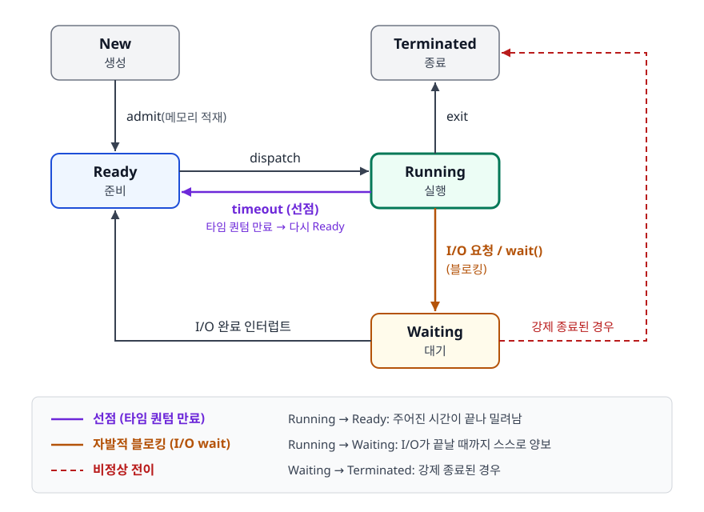

# 프로세스와 스레드 (Process & Thread)

> 프로그램이 실행되면 OS가 무엇을 만들어 주는지, 그 안에서 실행 흐름이 어떻게 여러 갈래로 나뉘는지를 메모리 구조 수준에서 설명할 수 있게 된다.

## 학습 목표

- [ ] 프로세스와 스레드의 차이를 메모리 구조 관점에서 설명할 수 있다
- [ ] 멀티 프로세스 vs 멀티 스레드 선택 기준을 제시할 수 있다
- [ ] 동시성과 병렬성의 차이를 이해한다
- [ ] PCB에 무엇이 담기는지, 프로세스 상태가 어떻게 전이되는지 설명할 수 있다
- [ ] 스레드가 Stack만 독립으로 갖는다는 사실이 왜 동기화 문제로 이어지는지 설명할 수 있다

## 선행 지식

없음 — 운영체제 학습은 이 문서부터 시작해도 된다.

---

## 1. 왜 필요한가

초창기 컴퓨터는 프로그램 하나를 처음부터 끝까지 돌리고, 끝나면 다음 프로그램을 올렸다. 문제는 프로그램이
디스크에서 데이터를 읽는 동안 CPU가 아무 일도 못 하고 놀았다는 것이다. 디스크 접근은 CPU 연산보다
수십만 배 느리기 때문에, 이 방식은 비싼 CPU를 대부분 놀리는 셈이었다.

그래서 "여러 프로그램을 메모리에 동시에 올려두고, 하나가 I/O를 기다리면 다른 것에 CPU를 주자"는 발상이
나왔다. 이걸 하려면 OS가 **각 실행 중인 프로그램의 상태를 따로 관리**해야 한다. 어디까지 실행했는지,
레지스터 값이 뭐였는지, 어떤 메모리를 쓰고 있는지. 이 관리 단위가 바로 **프로세스(Process)** 다.

그런데 프로세스만으로는 부족했다. 웹 서버가 요청 1000개를 동시에 처리하려고 프로세스 1000개를 띄우면
메모리가 감당하지 못한다. 요청 처리 코드는 어차피 같은데 코드와 데이터를 1000벌 복사할 이유가 없다.
"메모리는 공유하되 실행 흐름만 여러 개"라는 요구가 생겼고, 그 답이 **스레드(Thread)** 다.

정리하면 이렇다.

- 프로세스: **자원을 격리**하기 위해 만들어진 단위
- 스레드: **자원을 공유하면서 실행만 나누기** 위해 만들어진 단위

이 한 문장의 차이가 이 문서 전체의 모든 결론을 만들어낸다.

---

## 2. 프로세스 (Process)

### 정의

프로세스는 **실행 중인 프로그램**으로, 운영체제로부터 자원을 할당받는 작업의 단위이다.

프로그램은 디스크에 놓인 정적인 파일이고, 프로세스는 그 파일이 메모리에 올라와 CPU를 배정받는 능동적인
실체다. `notepad.exe`를 세 번 실행하면 프로그램은 하나지만 프로세스는 셋이다.

### 프로세스 메모리 구조

```
┌─────────────────┐
│      Stack      │  ← 지역 변수, 함수 호출 정보
├─────────────────┤
│        ↓        │
│                 │
│        ↑        │
├─────────────────┤
│       Heap      │  ← 동적 할당 메모리
├─────────────────┤
│       Data      │  ← 전역 변수, 정적 변수
├─────────────────┤
│       Code      │  ← 실행할 코드
└─────────────────┘
```

Stack은 높은 주소에서 아래로, Heap은 낮은 주소에서 위로 자란다. 가운데 빈 공간을 공유하는 이 구조는
"둘 중 어느 쪽이 많이 필요할지 미리 모르니 양끝에서 자라게 하자"는 실용적 설계다.

각 영역이 하는 일은 [02-memory-management.md](./02-memory-management.md)에서 자세히 다룬다.

### 특징

- 각 프로세스는 **독립적인 메모리 공간**을 가짐
- 프로세스 간 통신(IPC)이 필요 (파이프, 소켓, 공유 메모리 등)
- 하나의 프로세스가 죽어도 다른 프로세스에 영향 없음

### PCB — OS가 프로세스를 기억하는 방법

OS는 프로세스마다 **PCB(Process Control Block)** 라는 구조체를 커널 메모리에 하나씩 만들어 둔다.
CPU를 뺏겼다가 다시 받았을 때 "아까 하던 그 지점"으로 정확히 복귀하려면 이 정보가 필요하다.

| PCB 항목 | 내용 | 왜 필요한가 |
|----------|------|-------------|
| PID | 프로세스 식별자 | 프로세스를 지목해서 신호를 보내거나 종료시키려면 필요 |
| 프로세스 상태 | New/Ready/Running/Waiting/Terminated | 스케줄러가 실행 후보를 고를 때 본다 |
| Program Counter | 다음에 실행할 명령어 주소 | 재개 지점을 잃지 않기 위해 |
| CPU 레지스터 | 범용 레지스터, 스택 포인터 | 연산 중간값이 날아가면 계산이 깨진다 |
| 메모리 관리 정보 | 페이지 테이블 베이스 주소 등 | 주소 공간을 되돌리기 위해 |
| I/O 상태 정보 | 열린 파일 목록, 소켓 | 종료 시 자원을 회수하기 위해 |
| 계정 정보 | 사용한 CPU 시간, 우선순위 | 스케줄링 판단 근거 |

PCB의 존재가 [03-context-switching.md](./03-context-switching.md)에서 말하는 "상태 저장/복원"의 실체다.

### 프로세스 상태 전이

<!-- diagram:os-process-state -->


```
                  ┌──────────┐
      생성        │   New    │
                  └────┬─────┘
                       │ admit (메모리 적재)
                       ▼
   dispatch       ┌──────────┐        exit      ┌────────────┐
  ┌───────────────│  Ready   │                  │ Terminated │
  │               └──────────┘                  └────────────┘
  │                    ▲                              ▲
  ▼                    │ I/O 완료 인터럽트             │
┌──────────┐  timeout  │                              │
│ Running  │───────────┘                              │
└────┬─────┘  (타임 퀀텀 만료 → 다시 Ready)            │
     │                                                │
     │ I/O 요청 / wait()                              │
     ▼                                                │
┌──────────┐                                          │
│ Waiting  │──────────────────────────────────────────┘
└──────────┘   (강제 종료된 경우)
```

여기서 중요한 지점 하나. **Running → Ready** 화살표는 CPU를 다 쓴 게 아니라 시간이 끝나서 밀려난
것이고, **Running → Waiting** 은 스스로 "I/O 끝날 때까지 나 빼주세요"라고 양보한 것이다. 앞의 것이
선점(preemption), 뒤의 것이 블로킹이다. 이 구분이 [06-cpu-scheduling.md](./06-cpu-scheduling.md)의
선점형/비선점형 이야기로 이어진다.

### 흔한 오해

**"프로세스가 죽으면 자식 프로세스도 같이 죽는다"** — 반드시 그렇지는 않다. 부모가 먼저 종료되면
자식은 고아 프로세스(orphan)가 되고, 리눅스에서는 init(PID 1)이 입양한다. 반대로 자식이 먼저 죽었는데
부모가 `wait()`으로 종료 상태를 수거하지 않으면 좀비 프로세스(zombie)가 되어 PCB만 남는다. 좀비는
메모리를 거의 쓰지 않지만 PID를 점유하므로 대량 발생 시 새 프로세스를 못 만드는 사태가 생긴다.

---

## 3. 스레드 (Thread)

### 정의

스레드는 프로세스 내에서 **실행의 단위**이다. 하나의 프로세스는 여러 스레드를 가질 수 있다.

프로세스를 만들 때 OS는 기본 스레드(main thread) 하나를 함께 만든다. 즉 "스레드 없는 프로세스"는
없고, 우리가 흔히 말하는 싱글 스레드 프로그램도 실은 스레드가 하나인 프로세스다.

### 스레드 메모리 구조

```
프로세스
┌─────────────────────────────────────┐
│  Code  │  Data  │  Heap (공유)      │
├─────────────────────────────────────┤
│ Stack1 │ Stack2 │ Stack3  (독립)    │
│ (T1)   │ (T2)   │ (T3)              │
└─────────────────────────────────────┘
```

### 특징

- **Code, Data, Heap** 영역을 공유
- **Stack**만 독립적으로 할당
- 공유 자원으로 인한 동기화 이슈 발생 가능

### 왜 Stack만 독립인가

함수 호출 정보와 지역 변수는 "이 실행 흐름이 지금 어디까지 왔는지"를 담는다. 흐름이 여러 개면 이
기록도 여러 벌이어야 한다. T1이 `calculate()` 안에 있는데 T2가 같은 Stack을 쓰면 T1의 리턴 주소가
덮여서 프로그램이 엉뚱한 곳으로 점프한다. 그래서 Stack만은 반드시 분리한다.

반대로 Heap과 Data는 "프로그램 전체가 공유하는 상태"라서 나눌 이유가 없다. 그런데 나누지 않았기
때문에 두 스레드가 같은 객체를 동시에 건드릴 수 있고, 여기서 경쟁 상태가 터진다.
자세한 내용은 [04-deadlock-race-condition.md](./04-deadlock-race-condition.md)에서 다룬다.

### 코드로 보기

```java
public class SharedVsLocal {
    static int shared = 0;   // Data 영역 - 모든 스레드가 공유

    public static void main(String[] args) throws InterruptedException {
        Runnable task = () -> {
            int local = 0;              // Stack - 스레드마다 별개
            for (int i = 0; i < 100_000; i++) {
                local++;
                shared++;               // 여기서 경쟁 상태 발생
            }
            System.out.println("local  = " + local);   // 항상 100000
        };

        Thread t1 = new Thread(task);
        Thread t2 = new Thread(task);
        t1.start(); t2.start();
        t1.join();  t2.join();

        System.out.println("shared = " + shared);      // 200000보다 작게 나온다
    }
}
```

`local`은 스레드마다 Stack에 따로 있으니 언제나 정확히 100000이다. `shared`는 Data 영역에 하나뿐이라
두 스레드가 동시에 읽고 쓰면서 갱신이 유실된다. 같은 반복문 안의 두 줄인데 결과가 갈리는 이 지점이
"Stack만 독립"이라는 문장의 실제 의미다.

### 흔한 오해

**"스레드를 늘리면 늘린 만큼 빨라진다"** — CPU 코어 수를 넘어서면 그때부터는 컨텍스트 스위칭
오버헤드만 늘어난다. CPU 집약 작업은 코어 수 근처가 최적이고, I/O 대기가 많은 작업은 그보다 많이
잡아도 이득이 있다. 무조건 많이 잡는 설정은 오히려 처리량을 떨어뜨린다.

---

## 4. 프로세스 vs 스레드 비교

| 구분 | 프로세스 | 스레드 |
|------|----------|--------|
| 정의 | 자원 할당의 단위 | 실행의 단위 |
| 메모리 | 독립적 공간 | Code/Data/Heap 공유 |
| 통신 | IPC 필요 (비용 높음) | 공유 메모리 (비용 낮음) |
| 컨텍스트 스위칭 | 비용 높음 | 비용 낮음 |
| 안정성 | 높음 (독립적) | 낮음 (하나 죽으면 전체 영향) |
| 생성 시간 | 느림 | 빠름 |
| 제어 블록 | PCB | TCB (Thread Control Block) |
| 크래시 전파 | 없음 | 프로세스 전체로 전파 |
| 디버깅 난이도 | 상대적으로 쉬움 | 재현 어려운 경합 버그 발생 |

**그래서 언제 뭘 쓰나**: 격리와 안정성이 최우선이면 프로세스, 처리량과 메모리 효율이 최우선이면 스레드.
"어느 쪽이 우월한가"가 아니라 "무엇을 포기할 수 있는가"의 문제다.

---

## 5. 동시성 vs 병렬성

### 동시성 (Concurrency)

- 여러 작업이 **번갈아가며** 실행되는 것처럼 보이는 것
- 단일 코어에서도 가능 (시분할)

### 병렬성 (Parallelism)

- 여러 작업이 **실제로 동시에** 실행되는 것
- 멀티 코어 필요

```
동시성 (단일 코어)
T1: ████░░░░████░░░░████
T2: ░░░░████░░░░████░░░░
    ────────────────────→ 시간

병렬성 (멀티 코어)
Core1: ████████████████████
Core2: ████████████████████
       ────────────────────→ 시간
```

**비유**: 동시성은 요리사 한 명이 라면 물 올려놓고 그 사이에 계란을 부치는 것이고, 병렬성은 요리사
두 명이 각자 다른 냄비를 맡는 것이다. 전자는 손이 하나라 실제로는 한 번에 한 가지만 하지만 전체
소요 시간은 줄어든다.

**비유의 한계**: 요리사는 "물이 끓는지" 스스로 판단해 돌아가지만, CPU는 스스로 판단하지 않는다.
타이머 인터럽트가 강제로 끊어주거나 프로세스가 I/O로 자진 양보해야 전환이 일어난다.

동시성은 **구조**의 문제이고 병렬성은 **자원**의 문제다. 동시성 있게 설계한 프로그램을 멀티 코어에
올리면 병렬성이 따라오지만, 반대는 성립하지 않는다.

---

## 6. 사용자 스레드와 커널 스레드

우리가 코드에서 만드는 스레드가 곧바로 OS 스케줄러가 아는 스레드는 아니다. 둘을 어떻게 대응시키느냐에
따라 세 가지 모델이 있다.

| 모델 | 매핑 | 장점 | 단점 |
|------|------|------|------|
| 1:1 | 사용자 스레드 1개 = 커널 스레드 1개 | 진짜 병렬 실행, 블로킹이 다른 스레드에 영향 없음 | 스레드 생성 비용이 커널 호출 비용만큼 든다 |
| N:1 | 사용자 스레드 N개 = 커널 스레드 1개 | 생성/전환이 매우 저렴 | 한 스레드가 블로킹되면 전부 멈춤, 멀티 코어 활용 불가 |
| M:N | 사용자 스레드 M개를 커널 스레드 N개에 다중화 | 저렴하면서 병렬성도 확보 | 런타임 스케줄러 구현이 복잡 |

리눅스의 pthread와 Java의 플랫폼 스레드는 1:1이다. Go의 고루틴과 Java 21의 가상 스레드(Virtual
Thread)는 M:N에 가깝다. 가상 스레드는 블로킹 I/O를 만나면 캐리어 스레드에서 자신을 떼어내고(unmount)
다른 가상 스레드에 자리를 내주기 때문에, 스레드 수만 늘려서는 얻을 수 없던 동시성 규모를 만든다.

여기서 얻을 교훈은 "스레드가 비싸다"는 말이 절대적이지 않다는 것이다. 비싼 건 커널 스레드이고,
사용자 공간에서 스케줄링되는 경량 스레드는 이야기가 다르다.

---

## 7. 실무에서는

### 멀티 프로세스 선택

- **크롬 브라우저**: 탭마다 독립 프로세스 (안정성)
- **PHP-FPM**: 요청당 프로세스 (격리)

크롬이 메모리를 많이 먹는다는 악명은 이 설계의 청구서다. 탭 하나가 렌더링 버그로 죽어도 브라우저
전체가 내려가지 않고, 악성 사이트가 렌더러 프로세스를 장악해도 샌드박스 밖으로 나가기 어렵다.
사용자 경험에서 "탭 하나 때문에 작업 전부 날아감"이 주는 손해가 메모리 비용보다 크다고 본 것이다.

PHP-FPM은 다른 이유다. PHP 생태계의 확장 라이브러리 중 스레드 안전하지 않은 것이 많았고, 요청마다
프로세스를 새로 쓰면 이전 요청이 남긴 전역 상태나 메모리 누수가 다음 요청에 넘어가지 않는다.
"매번 깨끗한 상태에서 시작한다"는 보장을 격리로 산 셈이다.

### 멀티 스레드 선택

- **Java Spring**: 스레드 풀 활용 (성능)
- **Node.js Worker Threads**: CPU 집약적 작업 분리

Tomcat은 요청마다 스레드를 새로 만들지 않고 미리 만들어 둔 풀에서 꺼내 쓴다. 스레드 생성/소멸 비용을
없애고 동시 실행 스레드 수에 상한을 두어 과부하 시 시스템이 무너지지 않게 한다. 풀 크기를 무한정
키우지 않는 이유가 바로 컨텍스트 스위칭 비용이다.

Node.js는 반대 방향의 사례다. JS 실행은 단일 스레드로 두되 I/O는 논블로킹으로 처리해서, 스레드를
늘리지 않고도 대량의 동시 연결을 감당한다. 다만 이미지 리사이징 같은 CPU 집약 작업이 들어오면 이벤트
루프가 막히므로, 이때만 Worker Threads로 빼낸다.

---

## 8. 면접 포인트

> 면접에서 이 주제가 나오면 이렇게 답한다

**Q. 프로세스와 스레드의 차이를 설명해주세요.**

A. 프로세스는 자원 할당의 단위로 독립된 메모리 공간(Code, Data, Heap, Stack)을 받고, 스레드는 실행의
단위로 프로세스 안에서 Code, Data, Heap을 공유하고 Stack만 따로 가집니다. 이 메모리 공유 구조 때문에
스레드 간 통신은 별도 IPC 없이 빠르지만, 같은 데이터를 동시에 건드려 정합성이 깨지는 동기화 문제가
생깁니다. 또 한 스레드가 비정상 종료하면 프로세스 전체가 영향을 받아 안정성은 프로세스보다 낮습니다.

- 꼬리 질문: "그럼 스레드는 왜 Stack만 따로 갖나요?" → 함수 호출 정보와 리턴 주소가 실행 흐름별로
  달라야 하기 때문. 공유하면 서로의 리턴 주소를 덮어써 제어 흐름이 깨진다는 점을 든다.

**Q. 크롬 브라우저는 왜 멀티 프로세스를 채택했나요?**

A. 탭 하나의 크래시나 보안 취약점이 다른 탭과 브라우저 전체로 번지지 않게 격리하기 위해서입니다.
프로세스는 주소 공간이 분리돼 있어 한쪽이 죽어도 나머지가 살아남고, 렌더러 프로세스를 낮은 권한
샌드박스에 가둬 악성 코드의 피해 범위를 제한할 수 있습니다. 대신 프로세스마다 메모리를 따로 쓰므로
사용량이 늘어나는데, 브라우저에서는 그 비용보다 안정성과 보안이 더 중요하다고 판단한 것입니다.

- 꼬리 질문: "그럼 서버는 왜 반대로 스레드를 쓰나요?" → 서버는 동일 코드로 수만 요청을 처리하므로
  코드/힙 공유 이득이 크고, 요청 간 격리는 애플리케이션 레벨(트랜잭션, 요청 스코프)에서 확보 가능.

**Q. 동시성과 병렬성의 차이는 무엇인가요?**

A. 동시성은 여러 작업을 번갈아 실행해 동시에 처리되는 것처럼 보이게 하는 것으로 단일 코어에서도
시분할로 구현됩니다. 병렬성은 여러 작업이 물리적으로 같은 순간에 실행되는 것이라 멀티 코어가
필수입니다. 동시성은 프로그램을 어떻게 구조화했느냐의 문제이고, 병렬성은 하드웨어 자원이 얼마나
있느냐의 문제입니다.

- 꼬리 질문: "단일 코어에서 멀티스레드를 쓰면 의미가 있나요?" → CPU 집약 작업만 있으면 이득이 거의
  없지만, I/O 대기가 섞여 있으면 한 스레드가 기다리는 동안 다른 스레드가 CPU를 쓰므로 전체 처리
  시간이 줄어든다.

**Q. 멀티 프로세스와 멀티 스레드 중 무엇을 선택하시겠습니까?**

A. 판단 축을 두 개로 나눕니다. 첫째, 작업 간 격리가 얼마나 중요한가. 한 작업의 실패가 다른 작업을
망가뜨리면 안 되는 경우라면 프로세스입니다. 둘째, 작업들이 큰 상태를 공유하는가. 공유 데이터가 크고
자주 오간다면 IPC 복사 비용 때문에 스레드가 유리합니다. 실무에서는 프로세스로 격리 경계를 나누고 각
프로세스 안에서 스레드 풀을 쓰는 혼합 구조가 흔합니다.

- 꼬리 질문: "가상 스레드가 나온 뒤에도 이 기준이 유효한가요?" → 스레드 쪽 비용이 크게 낮아져
  "스레드가 비싸니 아껴 쓴다"는 전제는 약해졌지만, 격리 관련 판단 기준은 그대로다.

---

## 자주 하는 실수

| 실수 | 왜 틀렸나 | 올바른 이해 |
|------|----------|-------------|
| "스레드는 Heap도 따로 가진다" | Heap은 프로세스 단위 자원이라 모든 스레드가 같은 힙을 본다 | 독립인 것은 Stack(그리고 스레드 로컬 저장소)뿐 |
| "프로세스가 스레드보다 항상 느리다" | 실행 속도가 아니라 생성·전환 비용의 문제 | 실행 자체는 차이가 없고, 생성/스위칭/통신 비용에서 갈린다 |
| "동시성 = 병렬성" | 단일 코어에서도 동시성은 성립한다 | 동시성은 설계 구조, 병렬성은 물리적 동시 실행 |
| "스레드 풀 크기는 클수록 좋다" | 코어 수를 넘으면 스위칭 오버헤드와 메모리만 증가 | 작업 성격(CPU/IO 비율)에 맞춰 실측으로 정한다 |
| "프로그램과 프로세스는 같은 말" | 프로그램은 디스크의 정적 파일 | 같은 프로그램에서 여러 프로세스가 생길 수 있다 |
| "멀티스레드는 항상 락이 필요하다" | 공유 상태를 건드릴 때만 필요하다 | 불변 객체나 스레드 로컬만 쓰면 락 없이도 안전하다 |

---

## 한 줄 정리

프로세스는 자원을 격리하려고 만든 단위이고 스레드는 그 자원을 공유한 채 실행만 나누려고 만든 단위라서,
성능과 안정성의 모든 트레이드오프가 이 "격리냐 공유냐"에서 파생된다.

---

## 연관 개념

- [02-memory-management.md](./02-memory-management.md) - Stack/Heap 영역이 실제로 어떻게 쓰이는지
- [03-context-switching.md](./03-context-switching.md) - 프로세스/스레드 전환 비용이 갈리는 이유
- [04-deadlock-race-condition.md](./04-deadlock-race-condition.md) - 메모리 공유가 만드는 동시성 문제
- [06-cpu-scheduling.md](./06-cpu-scheduling.md) - Ready 상태의 프로세스 중 누구에게 CPU를 줄지
- [07-ipc-synchronization.md](./07-ipc-synchronization.md) - 격리된 프로세스끼리 통신하는 방법
- [qna-os.md](./qna-os.md) - Q1, Q9에 이 주제의 면접 질문이 정리되어 있다
- [Virtual Threads](../../02-backend-engineering/java-fundamentals/05-java21-virtual-threads.md) - M:N 경량 스레드의 실제 구현
