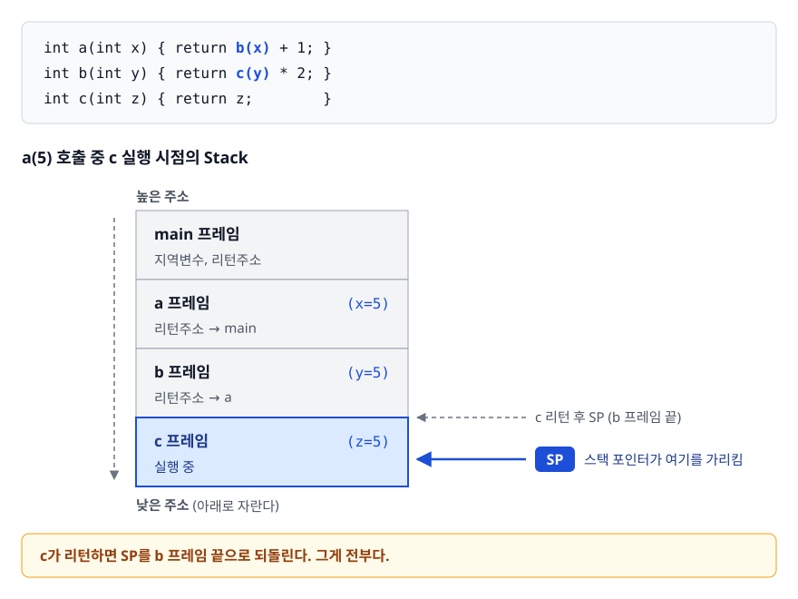
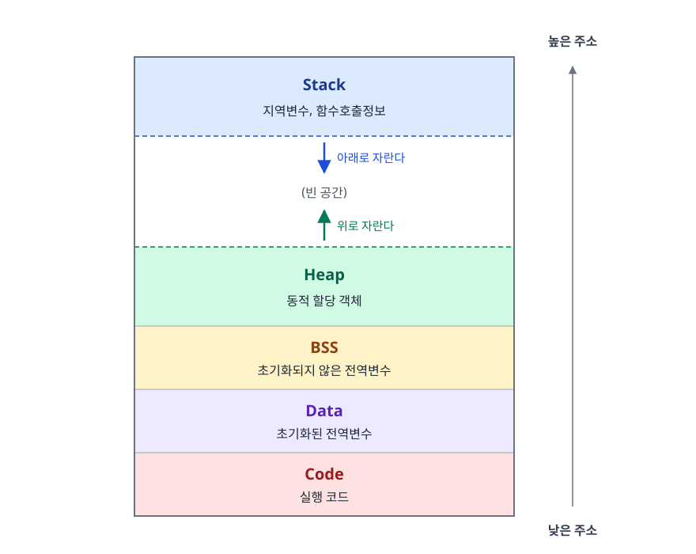
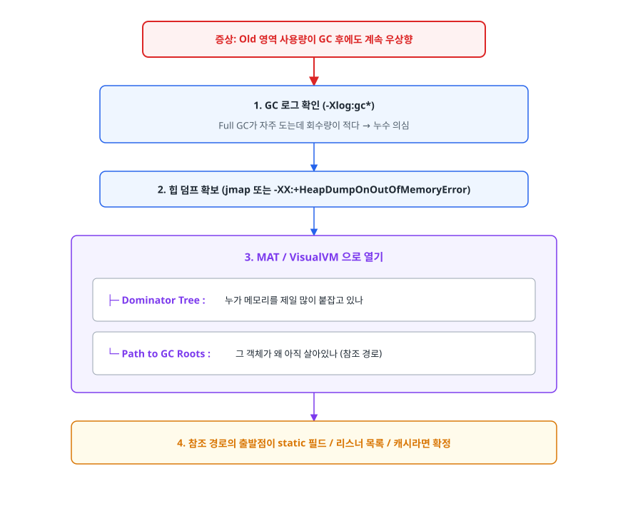

# 메모리 관리 전략: Stack vs Heap

> 변수 하나를 선언했을 때 그 값이 어디에 놓이고 언제 사라지는지, 그리고 왜 어떤 에러는 StackOverflowError이고 어떤 에러는 OutOfMemoryError인지 설명할 수 있게 됩니다.

## 학습 목표

- [ ] Stack과 Heap의 차이를 할당 시점·관리 방식·스레드 공유 관점에서 설명할 수 있다
- [ ] 메모리 누수의 원인과 해결책을 안다
- [ ] StackOverflowError와 OutOfMemoryError를 구분할 수 있다
- [ ] 스택 프레임이 쌓이고 사라지는 과정을 그림으로 설명할 수 있다
- [ ] GC가 있는 언어에서도 메모리 누수가 생기는 이유를 설명할 수 있다

## 선행 지식

- [01-process-thread.md](./01-process-thread.md) - 프로세스 메모리 구조와 스레드가 공유하는 영역

---

## 1. 왜 나눠 놓았나

메모리를 한 덩어리로 쓰면 안 되는 걸까? 문제는 데이터마다 **살아있어야 하는 기간이 다르다**는 것입니다.

함수 안의 지역 변수는 함수가 끝나면 필요 없습니다. 수명이 함수 호출과 정확히 일치하니, 함수가 끝날 때
자동으로 치워주면 관리 비용이 0에 가깝습니다. 반면 "사용자 목록"처럼 함수가 끝나도 계속 남아야 하는
데이터는 자동으로 치우면 안 됩니다. 언제 지울지 프로그램이 결정해야 합니다.

수명이 예측 가능한 것과 그렇지 않은 것을 같은 곳에 두면, 예측 가능한 쪽까지 비싼 관리 비용을 물게
됩니다. 그래서 메모리를 성격별로 갈랐습니다.

- **Stack**: 수명이 호출 구조에 종속된 데이터. 포인터 하나 밀고 당기면 끝나므로 극단적으로 빠릅니다.
- **Heap**: 수명이 프로그램 논리에 달린 데이터. 임의 시점에 할당·해제되므로 관리 비용이 듭니다.
- **Data/BSS**: 프로그램 실행 내내 사는 데이터. 시작할 때 확보하고 끝날 때 반납합니다.
- **Code**: 절대 안 바뀌는 명령어. 읽기 전용으로 막아두면 버그와 공격을 동시에 예방합니다.

**비유**: Stack은 카페테리아 쟁반 더미입니다. 위에서만 놓고 위에서만 집으므로 어느 쟁반이 어디 있는지
찾을 필요가 없습니다. Heap은 창고 선반입니다. 아무 자리에나 놓을 수 있어 유연하지만, 빈 자리를 찾고
나중에 치우는 관리자가 필요합니다.

**비유의 한계**: 실제 Heap은 단순한 선반이 아니라 크기별 프리 리스트와 아레나로 나뉜 정교한 구조이며,
JVM은 여기에 세대(Young/Old) 구분까지 얹습니다.

---

## 2. Stack 영역

### 특성

- **컴파일 타임**에 크기 결정 (또는 런타임에 동적 확장)
- **LIFO (후입선출)** 구조
- **스레드마다 독립적**으로 할당
- 자동으로 메모리 할당/해제

### 저장되는 데이터

- 지역 변수
- 매개변수
- 함수 호출 정보 (리턴 주소)

### 동작 원리 — 스택 프레임

함수를 호출하면 **스택 프레임(Stack Frame)** 한 칸이 쌓입니다. 함수가 리턴하면 그 칸이 통째로 사라집니다.
"해제"라는 별도 작업이 없고, 스택 포인터 레지스터를 원위치로 되돌리는 것이 곧 해제입니다.

<!-- diagram:cs-memory-management-1 -->


<!-- 위 그림이 대체한 원본 ASCII.
     내용을 고칠 때는 그림도 함께 갱신할 것.
```
int a(int x) { return b(x) + 1; }
int b(int y) { return c(y) * 2; }
int c(int z) { return z;        }

a(5) 호출 중 c 실행 시점의 Stack

높은 주소
┌───────────────────────────┐
│  main 프레임               │
│   - 지역변수, 리턴주소      │
├───────────────────────────┤
│  a 프레임   (x=5)          │
│   - 리턴주소 → main        │
├───────────────────────────┤
│  b 프레임   (y=5)          │
│   - 리턴주소 → a           │
├───────────────────────────┤
│  c 프레임   (z=5)  ← SP    │  스택 포인터가 여기를 가리킴
└───────────────────────────┘
낮은 주소   (아래로 자란다)

c가 리턴하면 SP를 b 프레임 끝으로 되돌린다. 그게 전부다.
```
-->

이 구조 때문에 Stack 할당은 명령어 한두 개 수준으로 끝나고, 단편화도 생기지 않습니다. 대신 **아래에
있는 프레임을 먼저 치울 수 없습니다**. 함수가 리턴한 뒤에도 살아있어야 하는 값은 Stack에 둘 수 없는
근본적인 이유입니다.

### 장점

- 메모리 할당/해제가 빠름
- 동기화 문제 없음 (스레드 독립)

### 주의사항

```java
// StackOverflowError 예시
public void recursiveMethod() {
    recursiveMethod(); // 무한 재귀 → 스택 오버플로우
}
```

### 흔한 오해

**"Stack에는 객체가 저장된다"** — Java에서 `Person p = new Person()`을 하면 Stack에는 참조(주소)만
들어가고 객체 본체는 Heap에 있습니다. C/C++에서는 `Person p;`로 스택에 객체를 직접 놓을 수 있어 언어마다
다르지만, Java·C#·Python 같은 언어에서 객체 본체는 항상 Heap입니다.

**"재귀는 항상 StackOverflowError를 낸다"** — 깊이가 스택 한계 안이면 아무 문제 없습니다. 문제는 종료
조건이 잘못됐거나 입력 크기에 비례해 깊이가 무한정 늘어나는 경우입니다. 예를 들어 리스트 100만 개를
재귀로 순회하면 논리는 맞아도 스택이 터집니다. 이럴 땐 반복문이나 명시적 스택 자료구조로 바꿉니다.

---

## 3. Heap 영역

### 특성

- **런타임**에 동적으로 할당
- 모든 스레드가 **공유**
- GC(가비지 컬렉터)가 메모리 관리 (Java)
- 수동 해제 필요 (C/C++)

### 저장되는 데이터

- 객체 인스턴스
- 동적 배열
- 전역적으로 접근 가능한 데이터

### 동작 원리 — 왜 Stack보다 느린가

Heap 할당은 "빈 자리 찾기"부터 시작합니다. 할당과 해제가 임의 순서로 일어나므로 중간중간 구멍이 생기고,
요청 크기에 맞는 구멍을 골라야 합니다. 여기에 여러 스레드가 동시에 요청하면 락 경합까지 붙습니다.

현대 런타임은 이 비용을 줄이려고 여러 기법을 씁니다. JVM은 각 스레드에게 Eden 영역의 작은 조각을
전용으로 떼어주는 TLAB(Thread Local Allocation Buffer)를 써서, 대부분의 할당을 포인터 증가 한 번으로
처리합니다. 그래서 "Heap 할당은 느리다"는 말은 원리상 맞지만, 실제 체감 차이는 생각보다 작습니다.
진짜 비용은 할당이 아니라 **회수(GC)** 쪽에 있습니다.

### 주의사항

```java
// OutOfMemoryError 예시
List<byte[]> list = new ArrayList<>();
while (true) {
    list.add(new byte[1024 * 1024]); // 1MB씩 계속 할당
}
```

### 흔한 오해

**"GC가 있으니 메모리 관리는 신경 안 써도 된다"** — GC는 *도달 불가능한* 객체만 회수합니다. 참조가
살아있으면 다시는 안 쓸 객체라도 절대 회수되지 않습니다. GC 언어의 메모리 누수는 "해제를 깜빡한 것"이
아니라 "참조를 끊는 걸 깜빡한 것"입니다.

---

## 4. Stack vs Heap 비교

| 구분 | Stack | Heap |
|------|-------|------|
| 할당 시점 | 컴파일 타임 | 런타임 |
| 크기 | 제한적 (보통 1MB) | 상대적으로 큼 |
| 속도 | 빠름 | 느림 |
| 관리 | 자동 | GC 또는 수동 |
| 스레드 | 독립적 | 공유 |
| 에러 | StackOverflowError | OutOfMemoryError |
| 해제 순서 | LIFO 강제 | 임의 순서 |
| 단편화 | 없음 | 발생 가능 |
| 동기화 | 불필요 | 할당 시 내부 동기화 필요 |

표의 "할당 시점"은 짚고 넘어갈 필요가 있습니다. Stack도 실제로 공간을 잡는 것은 실행 시점입니다.
컴파일 타임에 정해지는 것은 **프레임 하나의 크기**이고, 크기를 미리 알기 때문에 실행 시점에는
스택 포인터를 그만큼 밀기만 하면 된다는 뜻입니다. Heap은 얼마를 달라고 할지가 실행해 봐야 정해집니다.

**그래서 언제 뭘 쓰나**: 값의 수명이 함수 호출 범위 안에서 끝나면 Stack, 호출을 넘어 살아남아야 하면
Heap. Java에서는 이 선택을 직접 하지 않지만, "이 객체가 왜 아직 살아있는가"를 추적할 때 이 기준이
그대로 쓰입니다.

---

## 5. 메모리 구조 시각화

<!-- diagram:cs-memory-management-2 -->


<!-- 위 그림이 대체한 원본 ASCII.
     내용을 고칠 때는 그림도 함께 갱신할 것.
```
┌───────────────────────────────────┐  높은 주소
│            Stack                  │
│    (지역변수, 함수호출정보)         │
│              ↓                    │
├───────────────────────────────────┤
│           (빈 공간)               │
├───────────────────────────────────┤
│              ↑                    │
│            Heap                   │
│       (동적 할당 객체)             │
├───────────────────────────────────┤
│            BSS                    │
│      (초기화되지 않은 전역변수)     │
├───────────────────────────────────┤
│            Data                   │
│       (초기화된 전역변수)          │
├───────────────────────────────────┤
│            Code                   │
│         (실행 코드)               │
└───────────────────────────────────┘  낮은 주소
```
-->

BSS와 Data를 나눈 이유가 궁금할 수 있습니다. 초기값이 있는 전역 변수는 그 값을 실행 파일에 실어야 하지만,
`int arr[1000000];`처럼 0으로 시작하는 변수는 "이만큼 필요하다"는 크기 정보만 있으면 됩니다. 후자를
BSS로 빼면 실행 파일 크기가 4MB 줄어듭니다. 로더가 실행 시점에 0으로 채워줍니다.

여기서 말하는 주소는 모두 **가상 주소**입니다. 실제 물리 메모리 배치와는 다르며, 그 변환 과정은
[05-virtual-memory.md](./05-virtual-memory.md)에서 다룹니다.

---

## 6. 두 에러 구분하기

| | StackOverflowError | OutOfMemoryError |
|---|---|---|
| 터지는 곳 | 스레드별 Stack | 프로세스 공용 Heap |
| 주 원인 | 무한/과도한 재귀, 거대한 지역 배열 | 메모리 누수, 힙 대비 과도한 데이터 적재 |
| 발생 속도 | 수 밀리초 안에 즉시 | 서서히, 보통 운영 중 수 시간~수 일 |
| 스택 트레이스 | 같은 프레임이 반복해서 찍힘 | 마지막 할당 지점만 찍혀 원인 파악이 어려움 |
| 1차 진단 | 스택 트레이스의 반복 패턴 | 힙 덤프 + Dominator Tree |
| 대응 | 재귀를 반복문으로, 종료 조건 수정 | 참조 끊기, 캐시 정책, 힙 크기 재검토 |

**결론**: StackOverflowError는 거의 항상 코드 로직 버그입니다. OutOfMemoryError는 로직이 맞아도 발생할 수
있어 원인 규명에 도구가 필요합니다. 전자는 스택 트레이스만 봐도 답이 나오고, 후자는 힙 덤프를 떠야 합니다.

---

## 7. 메모리 누수 (Memory Leak)

### 원인

1. 사용 완료된 객체 참조를 끊지 않음
2. 리스너/콜백 등록 후 해제하지 않음
3. 캐시에 데이터 무한 저장

### 대표 시나리오를 코드로

```java
public class LeakExamples {

    // 1) static 컬렉션: 클래스가 언로드되기 전까지 GC 대상이 아니다
    private static final Map<String, byte[]> CACHE = new HashMap<>();

    public void handle(String key, byte[] data) {
        CACHE.put(key, data);   // 넣기만 하고 제거하지 않으면 계속 쌓인다
    }

    // 2) 리스너 미해제
    public void subscribe(EventBus bus) {
        bus.register(this);     // unregister가 없으면 bus가 this를 영원히 붙잡는다
    }

    // 3) 리소스 미반납 - 스트림 객체와 OS 파일 디스크립터를 함께 붙잡는다
    public void badRead(String path) throws IOException {
        InputStream in = new FileInputStream(path);
        in.read();
        // close() 없음. 예외가 나면 더더욱 닫히지 않는다
    }

    // 3의 수정: try-with-resources는 예외가 나도 close를 보장한다
    public void goodRead(String path) throws IOException {
        try (InputStream in = new FileInputStream(path)) {
            in.read();
        }
    }
}
```

핵심은 세 경우 모두 **"누군가 아직 참조를 들고 있다"** 는 한 문장으로 설명된다는 점입니다. static 필드,
이벤트 버스, 미반납 리소스는 모두 GC Root에서 도달 가능한 경로를 만듭니다.

### 진단 절차

<!-- diagram:cs-memory-management-3 -->


<!-- 위 그림이 대체한 원본 ASCII.
     내용을 고칠 때는 그림도 함께 갱신할 것.
```
증상: Old 영역 사용량이 GC 후에도 계속 우상향
   │
   ▼
1. GC 로그 확인 (-Xlog:gc*)
   Full GC가 자주 도는데 회수량이 적다 → 누수 의심
   │
   ▼
2. 힙 덤프 확보 (jmap 또는 -XX:+HeapDumpOnOutOfMemoryError)
   │
   ▼
3. MAT / VisualVM 으로 열기
   ├─ Dominator Tree : 누가 메모리를 제일 많이 붙잡고 있나
   └─ Path to GC Roots : 그 객체가 왜 아직 살아있나 (참조 경로)
   │
   ▼
4. 참조 경로의 출발점이 static 필드 / 리스너 목록 / 캐시라면 확정
```
-->

`-XX:+HeapDumpOnOutOfMemoryError` 옵션을 미리 켜 두면 OOM이 터지는 순간의 덤프가 자동으로 남습니다.
운영 환경에서 재현이 어려운 누수를 잡을 때 이 옵션 하나가 며칠을 아껴줍니다.

### 해결책

1. **힙 덤프 분석**: MAT, VisualVM 등 도구 사용
2. **WeakReference 활용**: GC 대상이 될 수 있도록
3. **리소스 정리**: try-with-resources, finally 블록
4. **캐시에 상한과 만료를 건다**: 크기 제한과 TTL이 없는 캐시는 누수와 구분되지 않는다

참조 강도별 차이를 알아두면 선택이 쉬워집니다.

| 참조 종류 | GC 동작 | 쓰는 곳 |
|-----------|---------|---------|
| Strong (일반 참조) | 절대 회수 안 함 | 기본 |
| Soft | 메모리가 부족할 때 회수 | 있으면 좋은 캐시 |
| Weak | 다음 GC 때 바로 회수 | 키가 사라지면 값도 버릴 매핑 |
| Phantom | 회수 직전 알림만 | 네이티브 자원 정리 훅 |

**결론**: 캐시라면 Soft/Weak를 고려하되, 실무에서는 직접 구현하기보다 크기 제한과 만료 정책을 갖춘
캐시 라이브러리를 쓰는 편이 안전합니다.

---

## 8. 실무에서는

**스레드 수와 Stack 크기의 곱이 곧 메모리입니다.** JVM에서 스레드 하나당 스택은 `-Xss`로 정하며 64비트
HotSpot 기본값은 1MB 수준입니다. 스레드를 2000개 만들면 스택만으로 2GB 가까이 잡아먹습니다. 요청당 스레드
모델에서 동시 접속이 늘 때 힙이 아니라 스택 때문에 죽는 사례가 여기서 나옵니다.

**컨테이너에서는 힙 크기 계산이 달라집니다.** 예전 JVM은 컨테이너 메모리 제한을 못 보고 호스트 전체
메모리를 기준으로 힙을 잡아 OOM Killer에 죽는 일이 잦았습니다. 요즘 JVM은 cgroup 제한을 인식하지만,
`-XX:MaxRAMPercentage`로 명시하는 편이 예측 가능합니다. 컨테이너 메모리는 힙 + 메타스페이스 + 스레드
스택 + 네이티브 버퍼의 합이라는 점을 잊지 말아야 합니다.

**힙을 키우는 게 항상 답은 아닙니다.** 누수가 원인이면 힙을 키워도 터지는 시점만 뒤로 밀립니다. 오히려
힙이 커지면 한 번의 GC가 훑어야 할 범위가 넓어져 정지 시간이 길어질 수 있습니다. 원인을 밝히기 전에
`-Xmx`부터 올리는 것은 진단이 아니라 유예입니다.

---

## 9. 면접 포인트

> 면접에서 이 주제가 나오면 이렇게 답한다

**Q. Stack과 Heap의 차이를 설명해주세요.**

A. Stack은 함수 호출 구조에 맞춰 LIFO로 관리되는 영역으로, 지역 변수와 매개변수, 리턴 주소가
저장되고 스레드마다 독립적으로 할당됩니다. 스택 포인터만 움직이면 되므로 할당과 해제가 매우 빠르고
동기화도 필요 없습니다. Heap은 런타임에 동적으로 할당되는 영역으로 객체 인스턴스가 저장되며, 모든
스레드가 공유하기 때문에 할당 시 내부 동기화가 필요하고 회수는 GC나 수동 해제로 이뤄집니다.

- 꼬리 질문: "Java에서 `new`로 만든 객체의 참조 변수는 어디 있나요?" → 지역 변수라면 참조는 Stack,
  객체 본체는 Heap. 필드라면 참조도 객체와 함께 Heap에 있습니다.

**Q. StackOverflowError와 OutOfMemoryError는 각각 언제 발생하나요?**

A. StackOverflowError는 스레드의 스택 공간이 소진됐을 때로, 종료 조건이 잘못된 재귀 호출이 가장
흔한 원인입니다. 호출마다 프레임이 쌓이다 한계를 넘으면 발생합니다. OutOfMemoryError는 힙에 더 이상
객체를 할당할 수 없을 때 발생하며, 참조가 남아 GC가 회수하지 못하는 메모리 누수나 애초에 데이터양
대비 힙이 작을 때 나타납니다. 전자는 스택 트레이스의 반복 패턴만 봐도 원인이 보이지만, 후자는 힙
덤프 분석이 필요합니다.

- 꼬리 질문: "OOM이 났는데 힙 덤프가 없다면?" → GC 로그의 회수량 추이와 Old 영역 점유율로 누수
  여부를 판단하고, `-XX:+HeapDumpOnOutOfMemoryError`를 켜서 재발 시 확보합니다.

**Q. GC가 있는데도 메모리 누수가 나는 이유는 무엇인가요?**

A. GC는 도달 불가능한 객체만 회수하기 때문입니다. 다시는 사용하지 않을 객체라도 어딘가에서 참조를
들고 있으면 GC 입장에서는 살아있는 객체입니다. static 컬렉션에 계속 넣기만 하는 경우, 리스너를
등록하고 해제하지 않는 경우, 상한 없는 캐시가 대표적입니다. 진단은 힙 덤프를 떠서 Dominator Tree로
점유 상위 객체를 찾고 Path to GC Roots로 참조 경로를 추적하는 순서로 합니다.

- 꼬리 질문: "WeakReference를 쓰면 다 해결되나요?" → 참조 강도를 낮추는 건 수단일 뿐, 어떤 데이터를
  언제 버릴지 정책이 먼저입니다. 만료·크기 정책이 없으면 약한 참조도 근본 해결이 아닙니다.

---

## 자주 하는 실수

| 실수 | 왜 틀렸나 | 올바른 이해 |
|------|----------|-------------|
| "Java 객체는 Stack에 저장된다" | Stack에는 참조만 들어간다 | 객체 본체는 Heap, 지역 참조 변수만 Stack |
| "OOM은 힙을 키우면 해결된다" | 누수가 원인이면 시점만 미룬다 | 원인 규명이 먼저, 힙 조정은 그다음 |
| "Stack 크기는 프로세스당 하나" | 스레드마다 별도로 잡힌다 | 스레드 수 × 스택 크기가 전체 소비량 |
| "close()를 안 해도 GC가 치워준다" | GC는 힙만 관리하고 OS 자원은 모른다 | 파일 디스크립터·소켓은 명시적으로 닫아야 한다 |
| "메모리 사용량이 늘면 누수다" | 캐시 예열이나 정상적인 부하 증가일 수 있다 | GC 이후에도 기저선이 계속 올라가야 누수 |
| "static은 편하니 많이 쓰자" | 클래스가 살아있는 한 참조가 유지된다 | 컬렉션을 static으로 둘 땐 제거 경로를 반드시 설계 |

---

## 한 줄 정리

Stack은 수명이 호출 구조에 묶인 데이터를 공짜에 가깝게 관리하는 영역이고 Heap은 수명이 논리에 달린
데이터를 유연하게 담는 대신 회수 비용을 치르는 영역이라, 두 영역에서 나는 에러는 원인도 진단법도 다릅니다.

---

## 연관 개념

- [01-process-thread.md](./01-process-thread.md) - 스레드가 Stack만 독립으로 갖는 이유
- [05-virtual-memory.md](./05-virtual-memory.md) - 이 주소들이 실제 물리 메모리로 변환되는 과정
- [07-ipc-synchronization.md](./07-ipc-synchronization.md) - 공유 Heap에 여러 스레드가 접근할 때의 규칙
- [qna-os.md](./qna-os.md) - Q5에 Stack/Heap 면접 질문이 정리되어 있다
- [가비지 컬렉션](../../02-backend-engineering/java-fundamentals/03-garbage-collection.md) - Heap을 GC가 회수하는 방식
- [Java 메모리 모델](../../02-backend-engineering/java-fundamentals/02-memory-model.md) - JVM 런타임 데이터 영역
- [qna-java.md](../../02-backend-engineering/java-fundamentals/qna-java.md) - JVM 메모리 구조와 GC 질문
