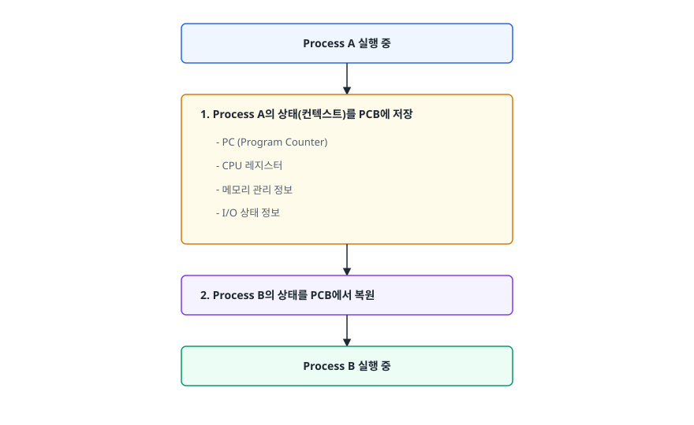
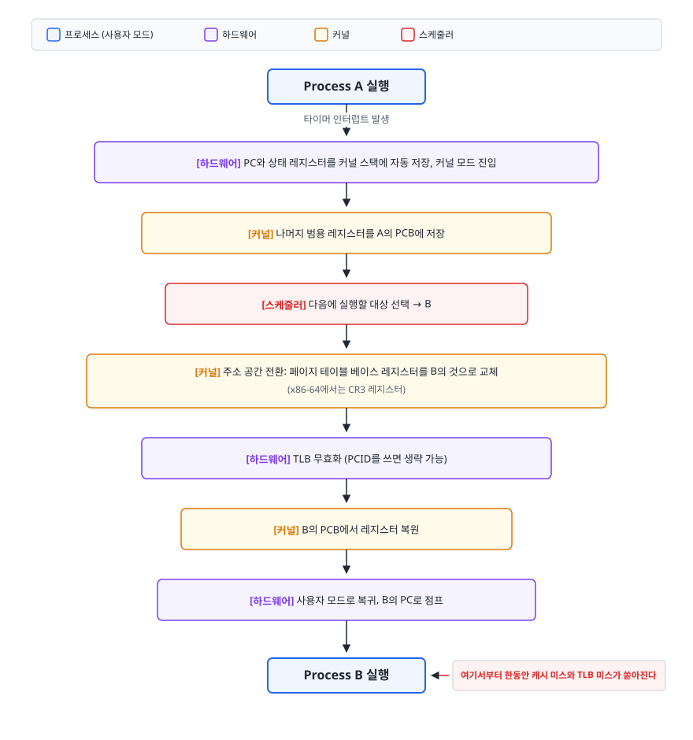
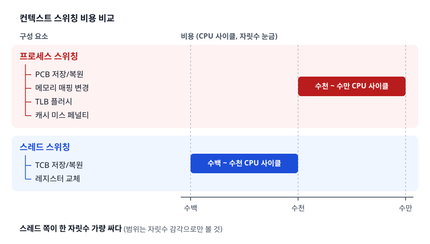

# 컨텍스트 스위칭 (Context Switching)

> CPU 하나로 여러 작업을 돌리기 위해 OS가 치르는 대가가 무엇이고, 그 대가가 프로세스와 스레드에서 왜 다른지를 TLB와 캐시 수준까지 설명할 수 있게 됩니다.

## 학습 목표

- [ ] 컨텍스트 스위칭의 개념과 발생 시점을 설명할 수 있다
- [ ] 프로세스 vs 스레드 스위칭 비용 차이의 원인을 안다
- [ ] 성능 최적화 관점에서 스위칭 비용을 이해한다
- [ ] 직접 비용과 간접 비용을 구분해서 설명할 수 있다
- [ ] 스위칭이 과도한지 실제로 어떻게 확인하는지 안다

## 선행 지식

- [01-process-thread.md](./01-process-thread.md) - PCB와 프로세스 상태 전이
- [05-virtual-memory.md](./05-virtual-memory.md) - 페이지 테이블과 TLB (3~4장을 이해하려면 필요)

---

## 1. 왜 필요한가

CPU 코어 하나는 한순간에 명령어 하나만 실행합니다. 그런데 지금 이 순간 우리 컴퓨터에서는 수백 개의
프로세스가 "동시에" 돌고 있습니다. 이 착시를 만드는 유일한 방법은 **아주 빠르게 번갈아 실행하는 것**입니다.

문제는 CPU가 상태를 기억하지 못한다는 점입니다. 레지스터는 한 벌뿐이고, Program Counter도 하나입니다.
A를 잠시 멈추고 B를 돌리면 A의 계산 중간값이 B의 값으로 덮입니다. 그래서 전환 직전에 A의 상태를
어딘가 안전한 곳으로 옮겨 적고, B의 상태를 되돌려 놓아야 합니다. 이 저장·복원 절차가 컨텍스트
스위칭입니다.

즉 컨텍스트 스위칭은 우리가 원해서 하는 일이 아니라, **하드웨어 자원이 하나뿐인데 논리적 실행 흐름은
여럿이라서 어쩔 수 없이 치르는 세금**입니다. 세금이니 줄이는 게 목표지만, 완전히 안 낼 수는 없습니다.

**비유**: 책상 하나에서 세 과목을 공부하는 상황입니다. 수학을 접고 영어를 펴려면 수학 책과 필기를
치우고 영어 책을 꺼내야 합니다. 이 정리 시간 자체는 공부가 아닙니다. 5분마다 과목을 바꾸면 정리만 하다
하루가 갑니다.

**비유의 한계**: 책상 정리는 눈에 보이지만, 컨텍스트 스위칭의 진짜 비용은 저장/복원 자체가 아니라
눈에 안 보이는 캐시와 TLB가 식는 데서 나옵니다. 이 점은 4장에서 다룹니다.

---

## 2. 컨텍스트 스위칭이란?

### 정의

운영체제 커널이 CPU 제어권을 하나의 프로세스(또는 스레드)에서 다른 것으로 넘기는 과정

### 발생 시점

- 타임 슬라이스 만료
- I/O 요청으로 인한 대기
- 인터럽트 발생
- 시스템 콜 호출

이 네 가지를 성격으로 다시 묶으면 이해가 쉽습니다.

| 유형 | 발생 상황 | 누가 결정하나 |
|------|-----------|---------------|
| 자발적 (voluntary) | I/O 요청, `sleep()`, 락 대기, `wait()` | 프로세스 스스로 CPU를 내놓는다 |
| 비자발적 (involuntary) | 타임 퀀텀 만료, 더 높은 우선순위 작업 도착 | 스케줄러가 강제로 빼앗는다 |

리눅스에서 `/proc/<pid>/status`의 `voluntary_ctxt_switches`와 `nonvoluntary_ctxt_switches`가 정확히
이 둘을 셉니다. 자발적 스위칭이 많으면 I/O나 락 대기가 잦다는 뜻이고, 비자발적 스위칭이 많으면 CPU를
두고 경쟁이 심하다는 뜻이라 튜닝 방향이 완전히 달라집니다.

**주의**: 시스템 콜을 호출한다고 반드시 컨텍스트 스위칭이 일어나는 것은 아닙니다. 시스템 콜은
"모드 전환(user → kernel)"이고, 컨텍스트 스위칭은 "실행 주체 교체"입니다. 같은 프로세스가 커널 모드로
들어갔다 바로 돌아오면 스위칭은 없습니다. 자세한 구분은
[08-system-call-interrupt.md](./08-system-call-interrupt.md)에서 다룹니다.

---

## 3. 컨텍스트 스위칭 과정

<!-- diagram:cs-context-switching-1 -->


<!-- 위 그림이 대체한 원본 ASCII.
     내용을 고칠 때는 그림도 함께 갱신할 것.
```
┌─────────────────────────────────────────────────────┐
│                    Process A 실행 중                 │
└─────────────────────────────────────────────────────┘
                         │
                         ▼
┌─────────────────────────────────────────────────────┐
│  1. Process A의 상태(컨텍스트)를 PCB에 저장          │
│     - PC (Program Counter)                          │
│     - CPU 레지스터                                   │
│     - 메모리 관리 정보                               │
│     - I/O 상태 정보                                  │
└─────────────────────────────────────────────────────┘
                         │
                         ▼
┌─────────────────────────────────────────────────────┐
│  2. Process B의 상태를 PCB에서 복원                  │
└─────────────────────────────────────────────────────┘
                         │
                         ▼
┌─────────────────────────────────────────────────────┐
│                    Process B 실행 중                 │
└─────────────────────────────────────────────────────┘
```
-->

두 단계 사이에 실제로는 더 많은 일이 끼어듭니다. 프로세스 간 전환일 때의 전체 흐름은 이렇습니다.

<!-- diagram:cs-context-switching-2 -->


<!-- 위 그림이 대체한 원본 ASCII.
     내용을 고칠 때는 그림도 함께 갱신할 것.
```
Process A 실행
      │
      │ 타이머 인터럽트 발생
      ▼
[하드웨어] PC와 상태 레지스터를 커널 스택에 자동 저장, 커널 모드 진입
      │
      ▼
[커널] 나머지 범용 레지스터를 A의 PCB에 저장
      │
      ▼
[스케줄러] 다음에 실행할 대상 선택 → B
      │
      ▼
[커널] 주소 공간 전환: 페이지 테이블 베이스 레지스터를 B의 것으로 교체
      │                (x86-64에서는 CR3 레지스터)
      ▼
[하드웨어] TLB 무효화 (PCID를 쓰면 생략 가능)
      │
      ▼
[커널] B의 PCB에서 레지스터 복원
      │
      ▼
[하드웨어] 사용자 모드로 복귀, B의 PC로 점프
      │
      ▼
Process B 실행  ← 여기서부터 한동안 캐시 미스와 TLB 미스가 쏟아진다
```
-->

마지막 줄이 핵심입니다. 스위칭은 "끝났다"고 해서 끝나지 않습니다. **B가 다시 원래 속도를 회복하기까지
걸리는 시간**까지가 진짜 비용입니다.

---

## 4. 프로세스 vs 스레드 컨텍스트 스위칭

### 프로세스 간 스위칭 (비용 높음)

| 작업 | 설명 |
|------|------|
| 메모리 주소 공간 전환 | 페이지 테이블 교체 필요 |
| TLB 플러시 | 가상 주소 → 물리 주소 캐시 무효화 |
| CPU 캐시 미스 | L1, L2, L3 캐시 적중률 저하 |

### 스레드 간 스위칭 (비용 낮음)

| 작업 | 설명 |
|------|------|
| 레지스터만 교체 | Stack 포인터, PC 등 |
| 메모리 공유 | TLB 플러시 불필요 |
| 캐시 유지 | 공유 메모리로 캐시 적중률 유지 |

### 왜 이런 차이가 나는가

프로세스마다 가상 주소 공간이 다르다는 사실 하나에서 모든 차이가 나옵니다.

프로세스 A의 가상 주소 `0x400000`과 프로세스 B의 `0x400000`은 완전히 다른 물리 메모리를 가리킵니다.
이 매핑 정보를 담은 것이 페이지 테이블이고, CPU는 페이지 테이블 베이스 레지스터로 "지금 유효한 매핑"을
가리킵니다. 프로세스를 바꾸면 이 레지스터를 갈아 끼워야 합니다.

문제는 그다음입니다. TLB는 "가상 주소 → 물리 주소" 변환 결과를 캐싱해 두는 하드웨어인데, 여기 들어있는
`0x400000 → 물리 0x8A2000` 같은 항목이 프로세스가 바뀐 순간 **거짓말이 됩니다**. 그대로 두면 B가 A의
메모리를 읽는 대참사가 나므로 무효화해야 합니다. 무효화하면 B는 메모리를 건드릴 때마다 페이지 테이블을
다시 걸어야 하고, 이 조회는 메모리 접근을 여러 번 유발합니다.

L1/L2 캐시도 마찬가지입니다. 캐시에 남아있던 A의 데이터는 B에게 아무 쓸모가 없습니다. B는 자기 데이터를
메모리에서 다시 끌어와야 하고, 이 동안 CPU는 대기합니다.

반면 같은 프로세스 안의 스레드끼리는 주소 공간이 동일합니다. 페이지 테이블도 그대로, TLB도 그대로,
캐시에 있는 힙 데이터도 여전히 유효합니다. 바꿀 것은 레지스터 묶음과 스택 포인터 정도입니다.

현대 CPU는 여기에 완화책을 뒀습니다. TLB 항목마다 주소 공간 식별자(x86의 PCID, ARM의 ASID)를 함께
저장하면 프로세스가 바뀌어도 통째로 비울 필요 없이 식별자로 구분할 수 있습니다. 그래서 "프로세스 전환 =
무조건 TLB 전체 플러시"는 오래된 CPU 기준의 설명입니다. 다만 TLB 용량은 한정적이라 여러 프로세스의
항목이 서로를 밀어내는 압박은 여전합니다.

---

## 5. 비용 비교

<!-- diagram:cs-context-switching-3 -->


<!-- 위 그림이 대체한 원본 ASCII.
     내용을 고칠 때는 그림도 함께 갱신할 것.
```
컨텍스트 스위칭 비용 비교
├── 프로세스 스위칭: 수천 ~ 수만 CPU 사이클
│   ├── PCB 저장/복원
│   ├── 메모리 매핑 변경
│   ├── TLB 플러시
│   └── 캐시 미스 페널티
│
└── 스레드 스위칭: 수백 ~ 수천 CPU 사이클
    ├── TCB 저장/복원
    └── 레지스터 교체
```
-->

이 범위는 자릿수 감각으로만 받아들여야 합니다. CPU 세대, 캐시 크기, 보안 완화책 적용 여부, 워크로드에
따라 크게 달라지므로 "정확히 몇 사이클"을 외우는 건 의미가 없습니다. 기억할 것은 **스레드 쪽이 한 자릿수
가량 싸다**는 관계뿐입니다. 대신 비용을 두 종류로 나눠 이해하는 편이 훨씬 쓸모 있습니다.

| 구분 | 내용 | 특징 |
|------|------|------|
| 직접 비용 (direct) | 레지스터 저장/복원, 스케줄러 실행, 페이지 테이블 교체 | 측정하기 쉽고 상대적으로 작다 |
| 간접 비용 (indirect) | 캐시·TLB·분기 예측기가 식어서 회복될 때까지의 성능 저하 | 측정하기 어렵고 종종 직접 비용보다 크다 |

간접 비용이 크다는 사실이 실무 판단을 바꿉니다. "스위칭 자체는 마이크로초밖에 안 되는데 뭐가 문제냐"고
생각하기 쉽지만, 캐시 지역성이 깨진 뒤 수십 마이크로초 동안 느려진 채로 도는 것이 진짜 손해입니다.
CPU 친화도 설정이 효과를 내는 이유도 여기 있습니다. 같은 코어로 되돌아가면 그 코어의 L1/L2에 내 데이터가
아직 남아있을 확률이 높습니다.

---

## 6. 최적화 전략

1. **스레드 풀 사용**: 스레드 생성/소멸 비용 절감
2. **비동기 I/O**: 블로킹으로 인한 스위칭 최소화
3. **CPU 친화도 설정**: 특정 코어에 스레드 바인딩
4. **캐시 효율성 고려**: 데이터 지역성 활용

각 전략이 무엇을 노리는지 정리하면 이렇습니다.

| 전략 | 줄이는 비용 | 대가 |
|------|-------------|------|
| 스레드 풀 | 생성/소멸 비용, 과도한 동시 실행 | 풀 크기를 잘못 잡으면 처리량 저하나 대기 폭증 |
| 비동기 논블로킹 I/O | 자발적 스위칭 | 코드 복잡도 증가, 디버깅 난이도 상승 |
| CPU 친화도 (`taskset`, `sched_setaffinity`) | 간접 비용(캐시 미스) | 부하 불균형, 특정 코어 과열 |
| 배치 처리 | 스위칭 횟수 자체 | 응답 지연 증가 |
| 가상 스레드 / 코루틴 | 커널 스위칭을 사용자 공간 전환으로 대체 | 네이티브 블로킹 호출과 궁합 문제 |

마지막 항목을 조금 더 보자. Java 21의 가상 스레드는 블로킹 I/O를 만나면 캐리어 스레드에서 자신을
떼어내고 다른 가상 스레드에 자리를 넘깁니다. 이 전환은 커널이 아니라 JVM 안에서 일어나므로 페이지 테이블
교체도 TLB 무효화도 없습니다. "블로킹 코드를 그대로 쓰면서 스위칭 비용은 낮추는" 접근입니다.

다만 만능은 아닙니다. 커널 수준에서 진짜로 막히는 호출(일부 파일 I/O, 네이티브 라이브러리 호출)은
캐리어 스레드를 붙잡아 두므로 이 경우 이득이 사라집니다. 도구의 전제 조건을 아는 것이 도구를 아는 것보다
중요합니다.

---

## 7. 실무에서는

### 서버 모델 선택이 갈리는 지점

Java 진영이 요청당 스레드를 쓰고 PHP-FPM이 요청당 프로세스를 쓰는 차이는 취향이 아니라 지금까지 본
비용 구조에서 나옵니다. 같은 코드로 수만 요청을 처리하는 서버에서는 코드와 힙을 공유하는 이득이 크고,
요청 사이 전환에서 페이지 테이블 교체와 TLB 무효화를 매번 피할 수 있습니다. PHP-FPM은 반대로 요청마다
상태를 완전히 버리는 격리를 택하고 그 비용을 지불한 쪽입니다.

크롬은 같은 저울을 정반대로 기울인 사례입니다. 탭마다 프로세스를 띄우면 스위칭 비용도 메모리도 늘지만,
탭 하나의 크래시나 취약점이 나머지로 번지지 않습니다. 사용자 입장에서는 "탭 하나 때문에 작업 전부
날아감"의 손해가 더 크다고 본 것입니다. **스위칭 비용은 언제나 격리 가치와 함께 저울에 오릅니다.**

### 스위칭이 과도한지 확인하는 법

이론만 알고 측정을 못 하면 소용이 없습니다. 리눅스 기준으로 순서는 이렇습니다.

```bash
# 1) 시스템 전체 초당 컨텍스트 스위칭 수 (cs 컬럼)
vmstat 1

# 2) 특정 프로세스의 자발/비자발 스위칭 (cswch/s, nvcswch/s)
pidstat -w -p <PID> 1

# 3) 프로세스 누적값 스냅샷
grep ctxt_switches /proc/<PID>/status
```

`vmstat`의 `cs`가 높은데 `us`(사용자 CPU)는 낮고 `sy`(시스템 CPU)가 높다면 실제 일보다 관리에 시간을
쓰고 있다는 신호입니다. `pidstat -w`에서 `cswch/s`(자발)가 지배적이면 I/O나 락 대기가 원인이고,
`nvcswch/s`(비자발)가 지배적이면 실행 가능한 스레드가 코어 수보다 훨씬 많다는 뜻입니다. 전자는 비동기화나
락 범위 축소로, 후자는 스레드 풀 크기 축소로 접근합니다.

Java 애플리케이션이라면 스레드 덤프도 같이 봅니다. `BLOCKED` 상태 스레드가 다수라면 락 경합이 자발적
스위칭을 만들어내고 있는 것이므로, 동기화 범위를 줄이거나 lock-free 자료구조로 바꾸는 쪽이 답입니다.

---

## 8. 면접 포인트

> 면접에서 이 주제가 나오면 이렇게 답한다

**Q. 컨텍스트 스위칭이란 무엇이고 언제 발생하나요?**

A. 커널이 CPU 제어권을 현재 실행 중인 프로세스나 스레드에서 다른 것으로 넘기는 과정입니다. 현재
작업의 Program Counter, 레지스터, 메모리 관리 정보, I/O 상태를 PCB에 저장하고 다음 작업의 상태를
복원합니다. 발생 시점은 크게 자발적인 경우와 비자발적인 경우로 나뉘는데, I/O 요청이나 락 대기로
스스로 CPU를 내놓는 것이 자발적이고 타임 퀀텀 만료나 더 높은 우선순위 작업 도착으로 밀려나는 것이
비자발적입니다.

- 꼬리 질문: "시스템 콜을 호출하면 항상 컨텍스트 스위칭이 일어나나요?" → 아닙니다. 시스템 콜은 모드
  전환이고, 같은 프로세스가 커널 작업을 마치고 바로 돌아오면 실행 주체는 바뀌지 않습니다.

**Q. 프로세스 스위칭이 스레드 스위칭보다 비싼 이유를 설명해주세요.**

A. 프로세스마다 가상 주소 공간이 다르기 때문입니다. 전환할 때 페이지 테이블 베이스 레지스터를 새
프로세스 것으로 바꿔야 하고, TLB에 캐싱된 주소 변환 정보가 무효해져 무효화가 필요합니다. 이후 새
프로세스가 메모리에 접근할 때마다 TLB 미스가 발생해 페이지 테이블을 다시 조회해야 하고, CPU 캐시에
남아있던 이전 프로세스 데이터도 쓸모없어져 캐시 적중률이 급락합니다. 스레드끼리는 같은 주소 공간을
쓰므로 이 과정이 전부 생략되고 레지스터와 스택 포인터 정도만 교체합니다.

- 꼬리 질문: "요즘 CPU도 프로세스 전환마다 TLB를 전부 비우나요?" → PCID/ASID를 지원하는 CPU는 TLB
  항목에 주소 공간 식별자를 붙여 전체 플러시를 피합니다. 다만 TLB 용량 경쟁은 남습니다.

**Q. 컨텍스트 스위칭 오버헤드를 줄이려면 어떻게 하나요?**

A. 먼저 자발적 스위칭이 많은지 비자발적 스위칭이 많은지 측정합니다. `pidstat -w`로 구분할 수 있는데,
자발적 스위칭이 많으면 I/O 블로킹이나 락 경합이 원인이므로 비동기 I/O 전환이나 락 범위 축소로
접근합니다. 비자발적 스위칭이 많으면 실행 가능한 스레드가 코어 수보다 과도하다는 뜻이라 스레드 풀
크기를 줄입니다. 추가로 CPU 친화도를 설정해 캐시 지역성을 살리는 방법도 있습니다.

- 꼬리 질문: "스레드 풀 크기는 어떻게 정하나요?" → CPU 집약 작업은 코어 수 근처, I/O 대기가 많으면
  그보다 크게 잡되 실측이 원칙. 대기 비율이 높을수록 코어 수 대비 배수를 키웁니다.

---

## 자주 하는 실수

| 실수 | 왜 틀렸나 | 올바른 이해 |
|------|----------|-------------|
| "컨텍스트 스위칭 = 시스템 콜" | 시스템 콜은 모드 전환일 뿐 | 실행 주체가 바뀌어야 스위칭 |
| "스위칭 비용 = 레지스터 저장 시간" | 캐시·TLB가 식는 간접 비용을 빠뜨렸다 | 회복까지 걸리는 시간이 종종 더 크다 |
| "프로세스 전환은 항상 TLB 전체 플러시" | PCID/ASID로 회피 가능 | 현대 CPU에서는 선택적 무효화가 가능 |
| "스레드를 늘리면 처리량이 는다" | 코어 수를 넘으면 스위칭 오버헤드가 지배 | 대기 비율을 고려한 적정 지점이 있다 |
| "cs 값이 높으면 무조건 문제" | I/O 중심 서비스는 원래 높을 수 있다 | 자발/비자발 비율과 sy 비중을 함께 봐야 판단 가능 |

---

## 한 줄 정리

컨텍스트 스위칭은 코어 하나로 여러 흐름을 돌리기 위해 내는 세금이며, 그 세금의 큰 몫은 저장·복원
자체가 아니라 주소 공간이 바뀌면서 캐시와 TLB가 식는 간접 비용에서 나옵니다.

---

## 연관 개념

- [01-process-thread.md](./01-process-thread.md) - PCB와 상태 전이 기본
- [05-virtual-memory.md](./05-virtual-memory.md) - 페이지 테이블과 TLB 상세
- [06-cpu-scheduling.md](./06-cpu-scheduling.md) - 타임 퀀텀 설정이 스위칭 횟수를 결정합니다
- [08-system-call-interrupt.md](./08-system-call-interrupt.md) - 모드 전환과 스위칭의 차이
- [qna-os.md](./qna-os.md) - Q2에 이 주제의 면접 질문이 정리되어 있습니다
- [Virtual Threads](../../02-backend-engineering/java-fundamentals/05-java21-virtual-threads.md) - 커널 스위칭을 사용자 공간 전환으로 대체하는 접근
- [캐시 메모리](../computer-architecture/02-cache-memory.md) - 스위칭 간접 비용의 근원인 캐시 계층
