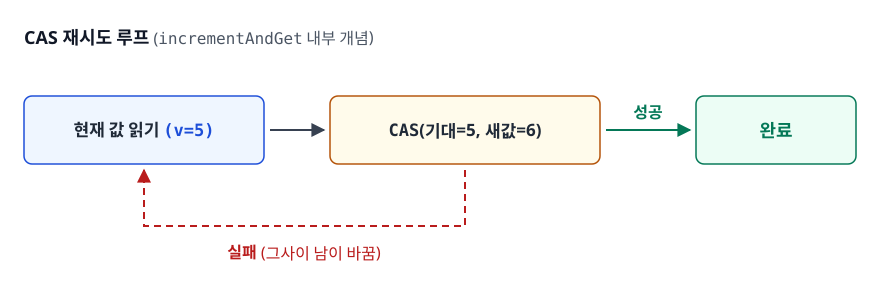
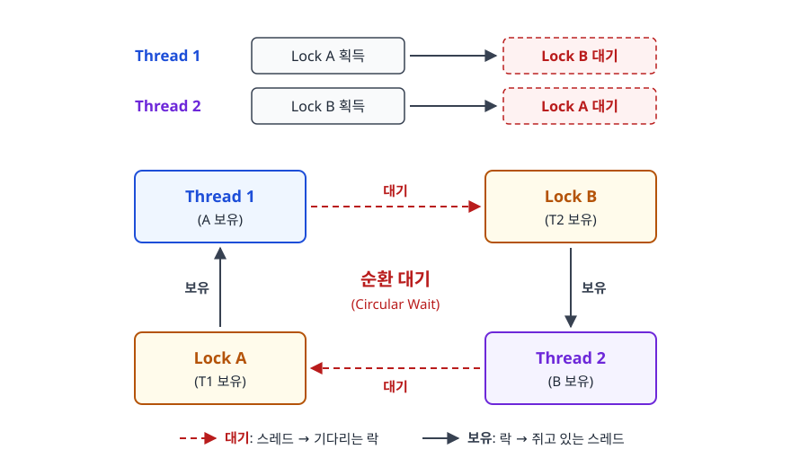

# 교착 상태(Deadlock)와 경쟁 상태(Race Condition)

> 자원을 나눠 쓰는 여러 실행 흐름에는 두 가지 대표적 고장이 따라옵니다 — 데이터가 깨지는 문제, 그리고 아무도 전진하지 못하는 문제입니다. 이 둘의 원인과 대응을 구분해서 설명할 수 있게 됩니다.

## 학습 목표

- [ ] 데드락의 4가지 필요 조건을 설명할 수 있다
- [ ] 경쟁 상태와 해결 방법을 안다
- [ ] 동기화 메커니즘을 이해한다
- [ ] 데드락과 라이브락, 기아를 구분할 수 있다
- [ ] 실무에서 락 순서를 어떻게 강제하는지 설명할 수 있다

## 선행 지식

- [01-process-thread.md](./01-process-thread.md) - 스레드가 Heap/Data를 공유한다는 사실
- [07-ipc-synchronization.md](./07-ipc-synchronization.md) - 뮤텍스·세마포어의 동작 원리 (같이 읽으면 좋습니다)

---

## 1. 왜 필요한가

싱글 스레드 프로그램에서는 "지금 값이 뭔지"가 항상 명확합니다. 코드를 위에서 아래로 읽으면 상태 변화가 그대로 보입니다. 멀티 스레드가 되면 이 전제가 무너집니다. 내가 값을 읽은 다음 쓰기 전에, 다른 스레드가 같은 값을 읽고 쓸 수 있기 때문입니다.

여기서 두 종류의 고장이 나옵니다.

- **경쟁 상태**: 동시에 접근해서 데이터가 깨집니다. 프로그램은 계속 돌지만 결과가 틀립니다.
- **교착 상태**: 서로 양보하지 않아 아무도 전진하지 못합니다. 결과가 틀리지는 않는데 거기서 멈춰 있습니다.

경쟁 상태를 막으려고 락을 걸면 데드락 위험이 생깁니다. 그렇다고 데드락을 피하려고 락을 줄이면 경쟁 상태 위험이 돌아옵니다. 둘의 관계가 그래서 재밌습니다. 동시성 제어란 이 둘 사이에서 균형점을 찾는 일입니다.

> **비유**: 좁은 외길에서 차 두 대가 마주쳤습니다. 서로 밀어붙이면 사고(경쟁 상태)가 나고, 서로 안 물러나면 정체(교착 상태)가 됩니다. 해법은 "누가 먼저 지나갈지 규칙을 정하는 것"이고, 그 규칙이 곧 동기화입니다.
>
> **비유의 한계**: 차는 상대를 보고 판단합니다. 하지만 스레드는 상대의 존재를 모릅니다. 프로그래머가 미리 규칙을 코드에 심어두지 않으면 스레드는 영원히 서로를 인지하지 못합니다.

---

## 2. 경쟁 상태 (Race Condition)

### 정의

같은 코드, 같은 입력을 줘도 어떤 날은 맞고 어떤 날은 틀린다면 그 코드에는 경쟁 상태가 있습니다. 경쟁 상태란 실행 결과가 **어느 스레드가 먼저 도착했느냐에 따라 달라지는** 상태를 말합니다.

"동시에 접근하면 무조건 문제"인 것은 아닙니다. 여러 스레드가 읽기만 한다면 순서가 어떻든 결과는 같습니다. **최소 한 쪽이 쓰기를 할 때** 문제가 생깁니다.

### 예시

```java
// 경쟁 상태 발생 예시
public class Counter {
    private int count = 0;

    public void increment() {
        count++;  // 원자적이지 않음: read → modify → write
    }
}

// 두 스레드가 동시에 increment() 호출 시
// 예상: count = 2
// 실제: count = 1 (경쟁 상태로 인한 오류)
```

### 왜 `count++` 가 안전하지 않은가

한 줄짜리 코드가 CPU 입장에서는 세 단계로 나뉩니다.

<!-- diagram:cs-deadlock-race-condition-1 -->


<!-- 위 그림이 대체한 원본 ASCII.
     내용을 고칠 때는 그림도 함께 갱신할 것.
```
count++ 의 실제 동작

  1. LOAD   count 값을 메모리에서 레지스터로 읽는다
  2. ADD    레지스터 값에 1을 더한다
  3. STORE  결과를 메모리에 다시 쓴다

count = 0 인 상태에서 두 스레드가 끼어들면

  시간 →
  T1:  LOAD(0)          ADD(1)              STORE(1)
  T2:          LOAD(0)          ADD(1)                 STORE(1)
                                                        │
  최종 count = 1  ← 두 번 증가시켰는데 1만 늘었다  ──────┘
```
-->

T2가 T1의 STORE 전에 LOAD를 해 버려서 T1의 작업 결과가 통째로 덮여 사라졌습니다. 이것을 **갱신 유실 (lost update)** 이라 부릅니다. 이 창은 나노초 단위라 개발 환경에서는 거의 재현되지 않고, 트래픽이 오른 운영 환경에서 처음 드러나는 경우가 많습니다. 그래서 동시성 버그가 무섭습니다.

### 원자성과 가시성은 다른 문제다

경쟁 상태를 이야기할 때 흔히 원자성만 보는데, 실제로는 두 가지 보장이 필요합니다.

| 보장 | 의미 | 깨지면 생기는 일 | 해결 도구 |
|------|------|------------------|-----------|
| 원자성 (Atomicity) | 중간에 끼어들 수 없다 | 갱신 유실 | `synchronized`, 락, CAS |
| 가시성 (Visibility) | 내가 쓴 값을 다른 스레드가 본다 | 무한 루프, 낡은 값 참조 | `volatile`, `synchronized`, 락 |

가시성 문제는 CPU 캐시 자체보다 컴파일러·JIT 최적화와 CPU의 스토어 버퍼에서 생깁니다(코어 간 캐시 일관성은 하드웨어가 맞춰 줍니다). T2가 한 번 읽은 값을 레지스터에 담아 두고 다시 읽지 않거나, T1의 쓰기가 아직 스토어 버퍼에 머물러 있으면 T2는 옛날 값을 봅니다. 컴파일러와 CPU의 명령어 재배치도 여기 가세합니다.

```java
public class VisibilityProblem {
    private boolean running = true;         // volatile이 없으면 위험
    // private volatile boolean running = true;   ← 이렇게 고친다

    public void run() {
        while (running) { }                  // 다른 스레드가 stop()을 불러도
    }                                        // 끝나지 않을 수 있다

    public void stop() {
        running = false;
    }
}
```

`volatile`은 이 변수를 레지스터에 담아 두지 못하게 하고 필요한 메모리 배리어를 넣어, 한 스레드가 이 변수에 쓴 값을 그 뒤에 읽는 다른 스레드가 반드시 보도록 보장합니다. 단, **가시성만 보장하고 원자성은 보장하지 않습니다.** `volatile int count`에 `count++`를 하면 여전히 갱신 유실이 발생합니다. 이 구분은 면접 단골입니다.

### 해결 방법

#### 1) synchronized 키워드

```java
public synchronized void increment() {
    count++;
}
```

#### 2) ReentrantLock

```java
private final ReentrantLock lock = new ReentrantLock();

public void increment() {
    lock.lock();
    try {
        count++;
    } finally {
        lock.unlock();
    }
}
```

`unlock()`을 `finally`에 두는 것은 선택이 아니라 필수입니다. 중간에 예외가 나면 락이 영원히 잠긴 채로 남아 이후 모든 스레드가 멈춥니다.

#### 3) Atomic 클래스 (CAS 연산)

```java
private AtomicInteger count = new AtomicInteger(0);

public void increment() {
    count.incrementAndGet();  // Compare-And-Swap 사용
}
```

CAS는 "현재 값이 내가 읽었던 값과 같으면 새 값으로 바꾼다"를 CPU 명령어 하나로 처리합니다. 다르면 실패를 알려 주고, 실패하면 다시 읽어서 재시도합니다. 락을 잡지 않으므로 대기 자체가 없습니다.

<!-- diagram:cs-deadlock-race-condition-2 -->


<!-- 위 그림이 대체한 원본 ASCII.
     내용을 고칠 때는 그림도 함께 갱신할 것.
```
CAS 재시도 루프 (incrementAndGet 내부 개념)

  ┌──────────────────────┐
  │ 현재 값 읽기 (v=5)    │◄────────┐
  └──────────┬───────────┘         │
             ▼                     │
  ┌──────────────────────┐         │
  │ CAS(기대=5, 새값=6)   │         │ 실패 (그사이 남이 바꿈)
  └──────────┬───────────┘         │
             │                     │
      성공 ──┴── 실패 ─────────────┘
        │
        ▼
      완료
```
-->

경합이 적으면 첫 시도에 성공해서 락보다 빠릅니다. 반대로 경합이 심하면 실패-재시도가 반복되며 CPU를 태웁니다. 이럴 때 Java에서는 `LongAdder`가 유리합니다. 여러 내부 셀에 나눠 더해 두었다가 읽을 때만 합산하는 구조입니다.

### 흔한 오해

**"synchronized를 붙이면 안전하다"** — 무엇에 붙였는지가 중요합니다. 인스턴스 메서드의 `synchronized`는 그 인스턴스를 락으로 쓰므로, 인스턴스가 여러 개면 서로를 막지 못합니다. 또 서버가 여러 대인 분산 환경에서는 JVM 내부 락이 아무 의미가 없습니다. DB 락이나 분산 락이 필요합니다.

---

## 3. 교착 상태 (Deadlock)

### 정의

각자가 상대방이 쥐고 있는 것을 기다리느라 **아무도 다음 줄로 넘어가지 못하는** 상태입니다. 경쟁 상태와 달리 값이 깨지지는 않습니다. 다만 영원히 멈춰 있을 뿐입니다.

### 데드락 발생 조건 (4가지 모두 충족 시)

| 조건 | 무엇을 뜻하나 | 이 조건을 깨려면 |
|------|---------------|------------------|
| **상호 배제** (Mutual Exclusion) | 그 자원을 쓰는 동안 다른 쪽은 못 쓴다 | 자원을 공유 가능하게 만들면 애초에 기다릴 일이 없다 |
| **점유 대기** (Hold and Wait) | 이미 쥔 것을 놓지 않은 채로 다음 것을 기다린다 | 전부 한 번에 잡거나, 못 잡으면 쥔 것도 놓게 한다 |
| **비선점** (No Preemption) | 쥔 쪽이 스스로 놓기 전에는 빼앗을 수 없다 | 타임아웃을 걸어 일정 시간 뒤 강제로 반납시킨다 |
| **순환 대기** (Circular Wait) | 대기 관계를 따라가면 원을 그리며 제자리로 돌아온다 | 자원에 번호를 매기고 오름차순으로만 잡게 한다 |

네 조건은 "and" 관계라서 하나만 깨져도 데드락은 성립하지 않습니다. 그래서 오른쪽 열이 그대로 뒤에 나올 예방 기법의 목록입니다.

### 데드락 예시

<!-- diagram:cs-deadlock-race-condition-3 -->


<!-- 위 그림이 대체한 원본 ASCII.
     내용을 고칠 때는 그림도 함께 갱신할 것.
```
Thread 1: Lock A 획득 → Lock B 대기
Thread 2: Lock B 획득 → Lock A 대기

┌──────────┐         ┌──────────┐
│ Thread 1 │ ──────► │  Lock B  │
│  (A 보유) │         │ (T2 보유) │
└──────────┘         └──────────┘
     ▲                     │
     │                     │
     │                     ▼
┌──────────┐         ┌──────────┐
│  Lock A  │ ◄────── │ Thread 2 │
│ (T1 보유) │         │  (B 보유) │
└──────────┘         └──────────┘
```
-->

코드로 옮기면 이렇습니다. 계좌 이체처럼 두 자원을 함께 잠가야 하는 상황에서 흔히 나옵니다.

```java
// 데드락이 나는 코드
public void transfer(Account from, Account to, long amount) {
    synchronized (from) {
        synchronized (to) {
            from.withdraw(amount);
            to.deposit(amount);
        }
    }
}
// transfer(A, B, 100) 과 transfer(B, A, 50) 이 동시에 실행되면
// 한쪽은 A→B 순서로, 다른 쪽은 B→A 순서로 잠가 순환 대기가 생긴다

// 해결: 전역 순서를 정해 항상 같은 방향으로만 잠근다
public void safeTransfer(Account from, Account to, long amount) {
    Account first  = from.getId() < to.getId() ? from : to;
    Account second = from.getId() < to.getId() ? to   : from;
    synchronized (first) {
        synchronized (second) {
            from.withdraw(amount);
            to.deposit(amount);
        }
    }
}
```

두 코드의 차이는 단 두 줄입니다. 그런데 아래 코드에서는 순환 대기가 원리적으로 불가능합니다. 모든 스레드가 ID 오름차순으로만 잠그면 "T1은 A→B, T2는 B→A" 같은 상황 자체가 생기지 않습니다.

### 데드락 · 라이브락 · 기아 구분

셋 다 "일이 진행되지 않는" 증상이지만 원인이 다릅니다.

| 현상 | 상태 | 원인 | 대표 해법 |
|------|------|------|-----------|
| 데드락 (Deadlock) | 완전히 멈춤, CPU 사용 0 | 순환 대기 | 락 순서 강제, 타임아웃 |
| 라이브락 (Livelock) | 계속 움직이는데 진전 없음 | 서로 양보만 반복 | 재시도 간격에 무작위 지연 |
| 기아 (Starvation) | 일부만 계속 못 받음 | 우선순위 편향, 불공정 락 | 에이징, 공정성 옵션 |

라이브락은 복도에서 마주 본 두 사람이 같은 방향으로 계속 비켜서는 상황입니다. 락을 잡았다 놓기를 반복하니 CPU는 쉬지 않고 바쁜데, 정작 끝나는 일은 하나도 없습니다. `tryLock` 실패 시 무조건 즉시 재시도하는 코드에서 흔히 나옵니다. 지수 백오프에 무작위 지연을 섞으면 대체로 풀립니다.

기아는 [06-cpu-scheduling.md](./06-cpu-scheduling.md)에서 에이징과 함께 자세히 다룹니다.

---

## 4. 데드락 해결 전략

### 예방 (Prevention)

4가지 조건 중 하나를 원천 차단합니다.

| 조건 제거 | 방법 | 현실성 |
|----------|------|--------|
| 상호 배제 | 공유 가능한 자원으로 설계 | 읽기 전용 데이터나 불변 객체에만 가능 |
| 점유 대기 | 필요한 모든 자원을 한 번에 요청 | 자원 활용률이 떨어지고 기아 위험 |
| 비선점 | 타임아웃 후 자원 반납 | `tryLock(timeout)`으로 실무 적용 쉬움 |
| 순환 대기 | 자원에 순서 부여, 순서대로만 획득 | 가장 널리 쓰이는 실용적 방법 |

### 회피 (Avoidance)

- **은행원 알고리즘**: 안전 상태 유지
- 자원 요청 시 데드락 가능성 검사

은행원 알고리즘은 "이 요청을 들어줘도 모든 프로세스가 언젠가 끝날 수 있는 순서가 존재하는가"를 매번 검사합니다. 이론은 우아합니다. 다만 각 프로세스의 **최대 자원 요구량을 미리 알아야** 한다는 전제가 현실 프로그램에서 거의 성립하지 않아 실무에서는 교과서 밖으로 잘 나오지 않습니다.

### 탐지 및 복구 (Detection & Recovery)

- 주기적으로 데드락 탐지
- 발견 시 스레드 종료 또는 자원 선점

대기 그래프에서 사이클을 찾아내면 한쪽 트랜잭션을 희생자로 골라 롤백시킵니다. DBMS가 이 전략의 대표 주자입니다. 애플리케이션은 그 트랜잭션만 다시 시도하면 되므로 전체를 멈추는 것보다 훨씬 쌉니다. MySQL InnoDB의 `Deadlock found when trying to get lock`이나 PostgreSQL의 `deadlock detected` 오류가 바로 이 탐지기가 일한 흔적입니다.

### 무시 (Ostrich Algorithm)

- 데드락 발생 확률이 낮으면 무시
- 발생 시 시스템 재시작

이름은 우스꽝스럽습니다. 그런데도 가장 널리 쓰이는 전략입니다. 범용 OS에서 모든 자원 요청을 검사하려면 상시 오버헤드가 발생하는데, 데드락은 드물게 일어납니다. 드문 사건을 막으려고 항상 비용을 내는 것보다, 터졌을 때 프로세스를 죽이는 편이 총비용이 낮습니다. **공학적 판단으로서의 방치**입니다.

---

## 5. 동기화 도구 비교

| 도구 | 특징 | 사용 사례 |
|------|------|----------|
| **synchronized** | 간단, 암묵적 락 | 단순한 동기화 |
| **ReentrantLock** | 명시적, tryLock 가능 | 타임아웃 필요 시 |
| **Semaphore** | 동시 접근 수 제한 | 커넥션 풀 |
| **Atomic** | Lock-free, CAS | 카운터, 플래그 |
| **volatile** | 가시성만 보장 (원자성 없음) | 상태 플래그 |
| **ConcurrentHashMap** | 세분화된 락 + CAS | 다중 스레드 캐시 |
| **LongAdder** | 셀 분할로 경합 분산 | 고경합 카운터 |

**그래서 언제 뭘 쓰나**: 단순 동기화는 `synchronized`, 타임아웃이나 인터럽트 대응이 필요하면 `ReentrantLock`, 단일 변수 갱신은 `Atomic`, 경합이 극심한 카운터는 `LongAdder`를 씁니다. 자료구조 전체를 잠그기 전에 이미 동시성을 고려해 만들어진 컬렉션이 있는지부터 확인합니다.

각 도구의 내부 원리는 [07-ipc-synchronization.md](./07-ipc-synchronization.md)에서 다룹니다.

---

## 6. 실무에서는

**데드락 진단**: Java에서는 `jstack <PID>` 또는 `jcmd <PID> Thread.print`로 스레드 덤프를 뜨면 JVM이 `Found one Java-level deadlock:` 이라는 문구와 함께 어느 스레드가 어느 락을 들고 무엇을 기다리는지 직접 알려줍니다. 덕분에 데드락 진단은 다른 동시성 버그보다 쉽습니다.

**DB 레벨의 데드락**: 애플리케이션 코드에 락이 하나도 없어도 데드락은 납니다. 트랜잭션 두 개가 서로 다른 순서로 같은 행들을 UPDATE하면 그대로 순환 대기가 만들어집니다. 대응은 코드에서와 동일합니다. 여러 행을 갱신할 때 **항상 같은 순서(예: 기본 키 오름차순)로 접근**하도록 쿼리를 짜고, 트랜잭션 범위는 짧게 유지합니다.

**타임아웃을 기본값으로 두기**: 락이든 커넥션이든 HTTP 호출이든, 무한 대기를 허용하는 순간 장애가 전파됩니다. `tryLock(3, TimeUnit.SECONDS)`처럼 상한을 두면 데드락이 나도 시스템 전체가 아니라 해당 요청만 실패합니다. 비선점 조건을 깨는 가장 현실적인 방법이기도 합니다.

**락을 잡은 채 외부 호출 금지**: 락을 들고 HTTP 요청이나 DB 쿼리를 날리면 그 응답이 늦는 순간 락 대기가 줄줄이 쌓입니다. 락 구간은 메모리 상태 변경 정도로 짧게 유지하고, 느린 작업은 락 밖으로 빼는 것이 원칙입니다.

---

## 7. 면접 포인트

> 면접에서 이 주제가 나오면 이렇게 답한다

**Q. 데드락의 4가지 조건을 설명하고, 실무에서 어떻게 막나요?**

A. 상호 배제, 점유 대기, 비선점, 순환 대기 네 가지가 모두 충족될 때 데드락이 발생합니다. 뒤집으면 하나만 깨도 막을 수 있습니다. 실무에서 가장 많이 쓰는 방법은 순환 대기를 깨는 자원 순서 부여입니다. 모든 락에 전역 순서를 정하고, 항상 그 순서로만 획득하면 순환 구조 자체가 만들어지지 않습니다. 계좌 이체라면 계좌 ID 오름차순으로 잠그는 식이고, DB에서는 트랜잭션이 항상 기본 키 오름차순으로 행을 잠그게 합니다. 보조 수단으로 `tryLock`에 타임아웃을 걸어 비선점 조건도 함께 완화합니다.

- 꼬리 질문: "은행원 알고리즘은 왜 실무에서 안 쓰나요?" → 각 프로세스의 최대 자원 요구량을 사전에 알아야 하는데, 현실 프로그램에서 그 값을 알 수 없습니다. 매 요청마다 안전 상태 검사 비용도 큽니다.

**Q. 경쟁 상태를 해결하는 방법을 여러 개 말해보세요.**

A. `synchronized`로 임계 구역을 감싸는 방법, `ReentrantLock`으로 명시적 락을 걸며 타임아웃이나 인터럽트를 함께 쓰는 방법, `AtomicInteger` 같은 CAS 기반 클래스로 락 없이 원자적으로 갱신하는 방법이 있습니다. 경합 정도와 필요한 제어 수준을 보고 고릅니다. 단일 변수이고 경합이 낮으면 CAS가 가장 빠릅니다. 경합이 심하면 `LongAdder`처럼 경합을 분산하는 구조가 낫습니다. 여러 변수를 함께 일관되게 바꿔야 하면 락이 필요합니다.

- 꼬리 질문: "`volatile`만 쓰면 안 되나요?" → `volatile`은 가시성만 보장합니다. `count++`처럼 읽고-고치고-쓰는 연산은 여전히 원자적이지 않아 갱신 유실이 납니다.

**Q. 데드락과 라이브락의 차이는 무엇인가요?**

A. 데드락은 스레드들이 서로의 자원을 기다리며 완전히 멈춘 상태로, CPU를 전혀 쓰지 않고 스레드 덤프를 뜨면 `BLOCKED` 상태로 잡힙니다. 라이브락은 스레드들이 계속 상태를 바꾸며 동작하지만 서로 양보만 반복해 실질적 진전이 없는 상태입니다. CPU는 바쁘게 도는데 처리량이 0이라 겉보기 증상이 다릅니다. 데드락은 락 순서 강제로, 라이브락은 재시도에 무작위 백오프를 넣어 대칭을 깨는 방식으로 해결합니다.

- 꼬리 질문: "기아는 어디에 속하나요?" → 둘 다 아닙니다. 시스템은 진전하는데 특정 스레드만 계속 자원을 못 받는 상태이고, 공정성 옵션이나 에이징으로 해결합니다.

**Q. 분산 환경에서도 `synchronized`로 충분한가요?**

A. 아닙니다. `synchronized`는 하나의 JVM 안에서만 유효하기 때문에 서버가 여러 대로 늘어나는 순간 각 서버가 독립적으로 임계 구역에 진입합니다. 재고 차감 같은 작업이라면 초과 판매가 발생합니다. 이럴 때는 DB의 비관적 락이나 유니크 제약, 또는 Redis 기반 분산 락처럼 **모든 인스턴스가 공유하는 지점**에서 상호 배제를 걸어야 합니다.

- 꼬리 질문: "분산 락의 위험은 무엇인가요?" → 락을 쥔 노드가 죽으면 영구 점유가 되므로 만료 시간이 필수입니다. 다만 그 만료 시간이 작업 시간보다 짧으면 두 노드가 동시에 임계 구역에 들어갈 수 있습니다.

---

## 자주 하는 실수

| 실수 | 왜 틀렸나 | 올바른 이해 |
|------|----------|-------------|
| "`volatile`을 붙이면 동기화 완료" | 가시성만 보장, 원자성은 없음 | 복합 연산에는 락이나 CAS가 필요 |
| "데드락은 락을 쓸 때만 생긴다" | DB 트랜잭션, 스레드 풀 고갈에서도 발생 | 자원을 기다리는 모든 구조에서 가능 |
| "`synchronized`면 서버가 여러 대여도 안전" | JVM 단위 락이라 인스턴스 간 상호 배제 불가 | 분산 환경은 DB 락이나 분산 락 |
| "`lock()` 후 `unlock()`만 쓰면 된다" | 예외 발생 시 영구 잠김 | `unlock()`은 반드시 `finally`에 |
| "동기화 범위는 넓을수록 안전" | 처리량이 급락하고 데드락 확률도 올라감 | 꼭 필요한 최소 구간만 잠근다 |
| "테스트에서 안 나오면 경쟁 상태는 없다" | 타이밍 의존이라 재현되지 않을 뿐 | 코드 리뷰와 정적 분석으로 잡아야 한다 |

---

## 한 줄 정리

경쟁 상태는 동시에 접근해서 값이 깨지는 문제이고, 교착 상태는 서로가 서로를 기다리다 멈추는 문제입니다. 그런데 전자를 막는 락이 후자를 부릅니다. 그래서 락은 최소 범위로 잡고, 획득 순서를 전역으로 통일하는 것이 실무의 기본기입니다.

---

## 연관 개념

- [01-process-thread.md](./01-process-thread.md) - 스레드가 메모리를 공유해서 생기는 문제
- [06-cpu-scheduling.md](./06-cpu-scheduling.md) - 기아와 에이징
- [07-ipc-synchronization.md](./07-ipc-synchronization.md) - 뮤텍스·세마포어·모니터의 동작 원리
- [qna-os.md](./qna-os.md) - Q3, Q4, Q7에 이 주제의 면접 질문이 정리되어 있습니다
- [트랜잭션 격리 수준](../../02-backend-engineering/database/04-transaction-isolation.md) - DB 레벨의 동시성 제어와 데드락
- [Spring @Transactional 함정](../../02-backend-engineering/spring-framework/06-transactional-pitfalls.md) - 트랜잭션 범위와 락 유지 시간
- [qna-java.md](../../02-backend-engineering/java-fundamentals/qna-java.md) - Java 동시성 API 관련 질문
