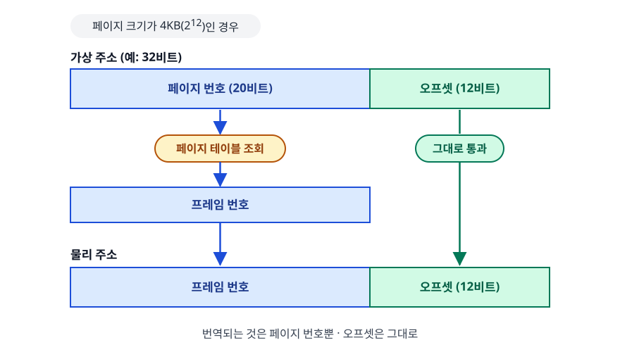
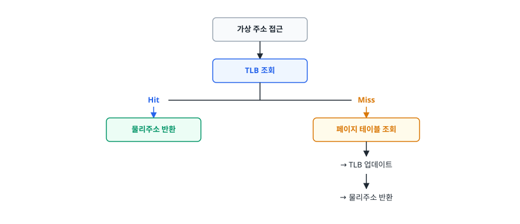
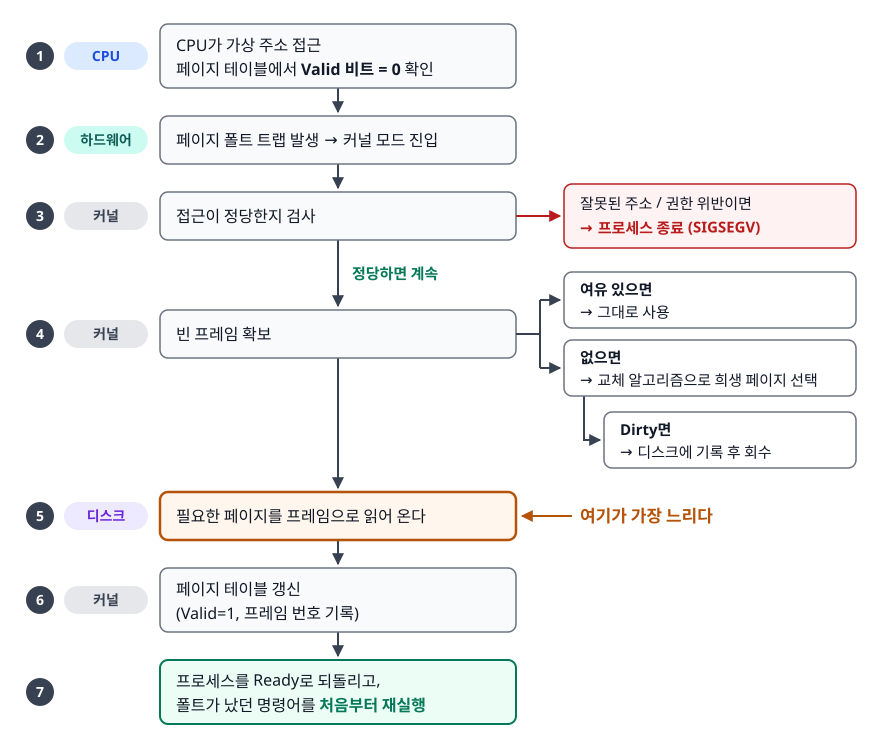
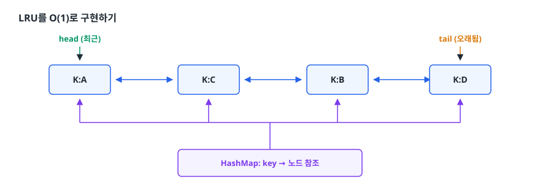
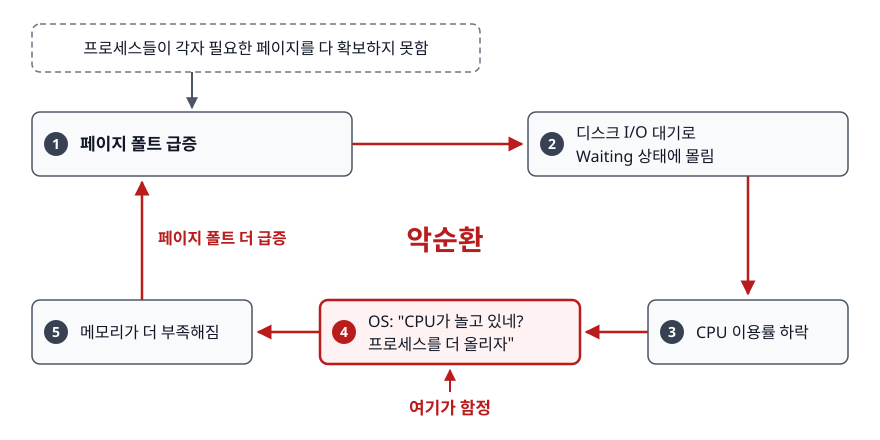

# 가상 메모리 (Virtual Memory)

> 프로그램이 쓰는 주소가 실제 RAM 주소가 아니라는 사실에서 출발해, 페이지 테이블·TLB·페이지 폴트·스래싱이 왜 필요하고 어떻게 맞물리는지 설명할 수 있게 됩니다.

## 학습 목표

- [ ] 가상 메모리의 개념과 필요성을 설명할 수 있다
- [ ] 주소 변환 과정과 TLB의 역할을 안다
- [ ] 페이지 폴트 처리 과정을 단계별로 설명할 수 있다
- [ ] 페이지 교체 알고리즘을 비교하고 LRU 구현 방법을 안다
- [ ] 스래싱을 Working Set 개념과 함께 설명할 수 있다

## 선행 지식

- [02-memory-management.md](./02-memory-management.md) - 프로세스 메모리 영역 구조
- [01-process-thread.md](./01-process-thread.md) - 프로세스가 독립된 주소 공간을 갖는다는 사실

---

## 1. 왜 필요한가

가상 메모리가 없던 시절을 상상해 보자. 프로그램은 물리 주소를 직접 썼습니다. 여기서 세 가지 문제가
동시에 터집니다.

**첫째, 프로그램이 물리 메모리보다 크면 못 돌린다.** 개발자가 직접 프로그램을 조각내 필요한 부분만
올리고 내리는 오버레이(overlay) 기법을 손으로 짜야 했습니다.

**둘째, 프로세스끼리 서로의 메모리를 침범한다.** 프로그램 A가 실수로 `0x1000`에 쓰면 그게 마침 B의
데이터일 수 있습니다. 버그 하나가 시스템 전체를 무너뜨립니다.

**셋째, 어디에 적재될지 미리 알 수 없다.** 같은 프로그램을 두 번 실행하면 두 번째는 다른 주소에
올라가므로, 코드 안의 모든 주소를 실행 시점에 고쳐야 합니다.

가상 메모리는 이 셋을 **주소 한 겹을 더 두는 것**으로 한꺼번에 해결했습니다. 프로세스는 자기만의 가상
주소를 쓰고 하드웨어(MMU)가 실행 순간마다 물리 주소로 번역합니다. 번역표를 프로세스마다 따로 두면 격리가
되고, 표에 "지금은 디스크에 있음"을 표시할 수 있으니 물리 메모리보다 큰 공간도 흉내 낼 수 있으며,
어디에 적재되든 표만 고치면 되니 주소도 고정됩니다.

**비유**: 회사 대표번호와 내선번호의 관계입니다. 명함에는 "대표번호 + 내선 301"만 적으면 되고, 실제
자리가 3층에서 5층으로 옮겨져도 교환기 설정만 바꾸면 명함을 다시 찍을 필요가 없습니다.

**비유의 한계**: 교환기는 사람이 가끔 설정을 바꾸지만, MMU는 **메모리 접근 명령어마다** 번역합니다.
그래서 번역 속도가 시스템 전체 성능을 좌우하고, 그 때문에 TLB라는 캐시가 필요해집니다.

---

## 2. 가상 메모리란?

### 정의

프로그램이 보는 주소와 RAM의 실제 주소를 분리하고 그 사이를 하드웨어가 실시간으로 이어 붙이는 기법입니다.
프로세스는 넓은 메모리를 혼자 통째로 쓴다고 믿지만 실제로는 필요한 조각만 물리 메모리에 올라와 있습니다.

### 무엇을 얻는가

- **용량**: 실제 RAM보다 넓은 주소 공간을 프로세스에게 줄 수 있다
- **격리**: 번역표가 프로세스마다 다르므로 남의 메모리를 가리킬 방법 자체가 없다
- **재배치 자유**: 어느 물리 프레임에 올라가든 표만 고치면 되므로 적재 위치를 미리 정할 필요가 없다

여기에 두 가지를 덧붙일 수 있습니다. **페이지 단위 권한 설정**은 코드 영역을 읽기+실행, 데이터 영역을
읽기+쓰기로 나눠 데이터에 심어진 코드가 실행되는 공격을 하드웨어가 막게 합니다. **공유와 지연 복사**는
여러 프로세스가 물리 프레임 하나를 공유하고 페이지 테이블만 각자 가리키게 해 메모리를 절약합니다.

후자의 대표 사례가 **Copy-on-Write(CoW)** 다. `fork()`로 프로세스를 복제할 때 메모리를 실제로
복사하지 않고 페이지 테이블만 복제한 뒤 모든 페이지를 읽기 전용으로 표시하고, 둘 중 하나가 쓰기를
시도하는 순간에만 그 페이지를 복사합니다. 대부분의 `fork()`는 곧바로 `exec()`으로 이어지므로 이
최적화 덕분에 낭비되는 복사가 사라집니다.

---

## 3. 주소 변환

### 가상 주소 → 물리 주소

<!-- diagram:cs-virtual-memory-1 -->


<!-- 위 그림이 대체한 원본 ASCII.
     내용을 고칠 때는 그림도 함께 갱신할 것.
```
┌─────────────────┐
│   가상 주소      │
│  (프로세스가 사용) │
└────────┬────────┘
         │
         ▼
┌─────────────────┐
│   페이지 테이블   │
│ (가상→물리 매핑)  │
└────────┬────────┘
         │
         ▼
┌─────────────────┐
│   물리 주소      │
│  (실제 RAM 위치)  │
└─────────────────┘
```
-->

### 페이징 (Paging)

- 가상 메모리를 고정 크기 **페이지**로 분할
- 물리 메모리를 고정 크기 **프레임**으로 분할
- 일반적인 페이지 크기: 4KB

### 주소가 쪼개지는 방식

가상 주소는 통째로 번역되지 않습니다. **페이지 번호**와 **오프셋**으로 나뉘고, 번역되는 것은 페이지
번호뿐입니다.

<!-- diagram:cs-virtual-memory-2 -->


<!-- 위 그림이 대체한 원본 ASCII.
     내용을 고칠 때는 그림도 함께 갱신할 것.
```
페이지 크기가 4KB(2^12)인 경우

가상 주소 (예: 32비트)
┌──────────────────────┬──────────────┐
│   페이지 번호 (20비트) │ 오프셋(12비트) │
└──────────┬───────────┴───────┬──────┘
           │                   │
           │ 페이지 테이블 조회  │ 그대로 통과
           ▼                   │
┌──────────────────────┐       │
│   프레임 번호          │       │
└──────────┬───────────┘       │
           │                   │
           ▼                   ▼
물리 주소
┌──────────────────────┬──────────────┐
│   프레임 번호          │ 오프셋(12비트) │
└──────────────────────┴──────────────┘
```
-->

오프셋이 그대로 통과하는 이유는 페이지와 프레임의 크기가 같아서 페이지 안의 상대 위치가 프레임
안에서도 같은 위치이기 때문입니다. 덕분에 번역표는 페이지 개수만큼만 있으면 됩니다.

페이지 테이블 항목(PTE)에는 프레임 번호 말고도 여러 비트가 함께 들어갑니다.

| 비트 | 의미 | 쓰임 |
|------|------|------|
| Valid / Present | 이 페이지가 물리 메모리에 있는가 | 0이면 페이지 폴트 발생 |
| Protection (R/W/X) | 읽기·쓰기·실행 허용 여부 | 위반 시 보호 폴트 |
| Reference (Accessed) | 최근에 접근했는가 | 페이지 교체 알고리즘의 판단 근거 |
| Dirty (Modified) | 적재 후 수정됐는가 | 0이면 교체 시 디스크 기록 생략 가능 |

Dirty 비트가 실질적인 성능 차이를 만듭니다. 읽기만 한 페이지는 디스크 사본과 동일하므로 그냥 버리면 되고,
수정된 페이지만 디스크에 다시 써야 합니다.

### 다단계 페이지 테이블

64비트 주소 공간에서 페이지 테이블을 한 겹으로 두면 표 자체가 감당 못 할 크기가 됩니다. 그래서 실제
시스템은 테이블을 여러 단계로 나누고 실제로 쓰이는 구간의 하위 테이블만 만듭니다. 대가는 명확합니다.
TLB 미스가 나면 페이지 테이블을 한 번이 아니라 단계 수만큼 걸어야 하고, 이 비용이 TLB의 중요성을
결정적으로 키웁니다.

---

## 4. TLB (Translation Lookaside Buffer)

### 역할

페이지 테이블의 **캐시** 역할 (주소 변환 속도 향상)

### 동작 과정

<!-- diagram:cs-virtual-memory-3 -->


<!-- 위 그림이 대체한 원본 ASCII.
     내용을 고칠 때는 그림도 함께 갱신할 것.
```
가상 주소 접근
       │
       ▼
   TLB 조회
       │
   ┌───┴───┐
   │       │
Hit │       │ Miss
   │       │
   ▼       ▼
물리주소   페이지 테이블 조회
반환      → TLB 업데이트
          → 물리주소 반환
```
-->

### 왜 이게 결정적인가

TLB가 없으면 데이터를 한 번 읽을 때마다 **페이지 테이블 조회 + 실제 데이터 접근**이 모두 메모리
접근이고, 다단계 테이블이면 조회만 여러 번이라 접근 횟수가 몇 배로 늘어납니다.

TLB는 최근 변환 결과를 CPU 안에 담아두고, 적중하면 페이지 테이블을 아예 건드리지 않습니다. 프로그램은
보통 좁은 범위의 메모리를 반복해서 쓰기 때문에(지역성) 적중률이 매우 높습니다. 거꾸로 **메모리를 넓게
흩어서 접근하는 코드는 TLB 적중률이 떨어져 느려집니다. 대용량 메모리를 다루는 데이터베이스나 JVM에서
**huge page**(4KB 대신 2MB 페이지)를 쓰는 이유도 같은 맥락으로, 페이지 하나가 커지면 같은 메모리를
훨씬 적은 TLB 항목으로 덮을 수 있습니다.

### 컨텍스트 스위칭과 TLB

- 프로세스 간 스위칭 시 TLB **플러시** 필요
- 스레드 간 스위칭 시 TLB **유지** (같은 주소 공간)

현대 CPU는 TLB 항목에 주소 공간 식별자(x86의 PCID, ARM의 ASID)를 붙여 전체 플러시를 피합니다. 식별자가
다르면 서로의 항목을 잘못 쓸 일이 없기 때문입니다. 다만 TLB 용량은 한정적이라 여러 프로세스가 항목을
두고 경쟁하는 압박은 남습니다. 자세한 비용 분석은
[03-context-switching.md](./03-context-switching.md)를 참고합니다.

---

## 5. 페이지 폴트 (Page Fault)

### 발생 상황

요청한 페이지가 물리 메모리에 **없을 때** 발생

### 처리 과정

1. 페이지 폴트 인터럽트 발생
2. 디스크에서 해당 페이지 로드
3. 페이지 테이블 업데이트
4. 프로세스 재실행

### 단계별로 자세히

<!-- diagram:cs-virtual-memory-4 -->


<!-- 위 그림이 대체한 원본 ASCII.
     내용을 고칠 때는 그림도 함께 갱신할 것.
```
CPU가 가상 주소 접근 → 페이지 테이블에서 Valid 비트 = 0 확인
      │
      ▼
[하드웨어] 페이지 폴트 트랩 발생 → 커널 모드 진입
      │
      ▼
[커널] 접근이 정당한지 검사
      │  ├─ 잘못된 주소 / 권한 위반이면 → 프로세스 종료 (SIGSEGV)
      │  └─ 정당하면 계속
      ▼
[커널] 빈 프레임 확보
      │  ├─ 여유 있으면 그대로 사용
      │  └─ 없으면 교체 알고리즘으로 희생 페이지 선택
      │       └─ Dirty면 디스크에 기록 후 회수
      ▼
[디스크] 필요한 페이지를 프레임으로 읽어 온다  ← 여기가 가장 느리다
      │
      ▼
[커널] 페이지 테이블 갱신 (Valid=1, 프레임 번호 기록)
      │
      ▼
프로세스를 Ready로 되돌리고, 폴트가 났던 명령어를 처음부터 재실행
```
-->

마지막 줄이 중요합니다. 명령어를 "이어서" 하는 게 아니라 **처음부터 다시** 실행합니다. 그래야 중간에
끊긴 명령어가 반쪽만 적용되는 사태를 막을 수 있습니다.

### 모든 페이지 폴트가 나쁜 것은 아니다

| 종류 | 설명 | 비용 |
|------|------|------|
| Minor fault | 페이지가 이미 물리 메모리에 있고 매핑만 없는 경우 (공유 라이브러리, CoW 등) | 낮음 (디스크 접근 없음) |
| Major fault | 디스크에서 실제로 읽어와야 하는 경우 | 매우 높음 |

프로그램 시작 시 대량의 minor fault는 정상입니다. 문제는 **major fault가 지속적으로 많은 경우**이고 이건
스왑이 돌고 있다는 신호입니다. `vmstat`의 `si`/`so`나 `ps -o min_flt,maj_flt`로 확인합니다.

---

## 6. 페이지 교체 알고리즘

### FIFO (First In First Out)

- 가장 오래된 페이지 교체
- 구현 간단, 성능 보통

### LRU (Least Recently Used)

- 가장 오래 사용되지 않은 페이지 교체
- 성능 좋음, 구현 복잡

### LFU (Least Frequently Used)

- 사용 빈도가 가장 낮은 페이지 교체

### 비교

| 알고리즘 | 장점 | 단점 |
|---------|------|------|
| FIFO | 구현 간단 | Belady's Anomaly |
| LRU | 성능 좋음 | 오버헤드 |
| LFU | 빈도 고려 | 최근성 무시 |
| Clock (2차 기회) | LRU 근사, 오버헤드 낮음 | 정확도는 LRU보다 떨어짐 |

**그래서 언제 뭘 쓰나**: 이론적 최적은 미래를 아는 OPT지만 구현 불가능합니다. 실제 OS는 접근마다
리스트를 재정렬하는 비용을 감당할 수 없어 참조 비트로 근사하는 Clock 계열을 씁니다. 반면 애플리케이션
레벨 캐시는 접근 빈도가 훨씬 낮아 LRU를 정확히 구현해도 괜찮습니다.

### Belady's Anomaly

보통은 메모리를 늘리면 페이지 폴트가 줍니다. 그런데 FIFO에서는 **프레임 수를 늘렸는데 폴트가 늘어나는**
역설이 생길 수 있습니다. "언제 들어왔는가"만 볼 뿐 "얼마나 쓸모 있는가"를 반영하지 않기 때문이며, LRU는
스택 알고리즘이라는 성질 덕분에 이 현상이 없습니다.

### LRU를 O(1)로 구현하기

`HashMap + 이중 연결 리스트` 조합이 정석입니다.

<!-- diagram:cs-virtual-memory-5 -->


<!-- 위 그림이 대체한 원본 ASCII.
     내용을 고칠 때는 그림도 함께 갱신할 것.
```
      head (최근)                              tail (오래됨)
        │                                          │
        ▼                                          ▼
   ┌────────┐   ┌────────┐   ┌────────┐   ┌────────┐
   │  K:A   │◄─►│  K:C   │◄─►│  K:B   │◄─►│  K:D   │
   └────────┘   └────────┘   └────────┘   └────────┘
        ▲            ▲            ▲            ▲
        └────────────┴──────┬─────┴────────────┘
                            │
                   HashMap: key → 노드 참조
```
-->

- 조회: HashMap으로 노드를 O(1)에 찾고, 그 노드를 리스트에서 떼어 head로 옮깁니다. 이중 연결 리스트라
  앞뒤 노드를 알고 있어 분리·삽입이 O(1)입니다.
- 삽입: head에 새 노드를 넣습니다. 용량을 넘으면 tail 노드를 제거하고 HashMap에서도 지웁니다.

단일 연결 리스트로는 안 됩니다. 노드를 떼어내려면 앞 노드를 알아야 하는데 찾는 데 O(n)이 걸리기
때문입니다. Java의 `LinkedHashMap`은 접근 순서 모드와 `removeEldestEntry` 오버라이드로 간단한 LRU
캐시를 만들 수 있고, 만료·통계·동시성까지 필요하면 Caffeine 같은 전용 캐시 라이브러리를 씁니다.

---

## 7. 스래싱 (Thrashing)

### 정의

메모리를 채우고 비우는 뒷일이 정작 해야 할 계산을 밀어내 버린 상태입니다. 페이지를 올리면 다른 페이지가
밀려나고 밀려난 페이지가 곧바로 다시 필요해지는 순환에 갇혀, CPU 사용률은 낮은데 시스템은 응답하지 않습니다.

### 원인

- 활성 프로세스들이 요구하는 메모리 합계가 물리 메모리를 넘어섰다
- 그 결과 어느 프로세스도 자기 작업에 필요한 최소 페이지 수를 확보하지 못한다

### 악순환의 구조

스래싱이 무서운 이유는 OS의 정상적인 판단이 상황을 악화시키기 때문입니다.

<!-- diagram:cs-virtual-memory-6 -->


<!-- 위 그림이 대체한 원본 ASCII.
     내용을 고칠 때는 그림도 함께 갱신할 것.
```
프로세스들이 각자 필요한 페이지를 다 확보하지 못함
            │
            ▼
     페이지 폴트 급증 → 디스크 I/O 대기로 Waiting 상태에 몰림
            │
            ▼
      CPU 이용률 하락
            │
            ▼
OS: "CPU가 놀고 있네? 프로세스를 더 올리자"   ← 여기가 함정
            │
            ▼
메모리가 더 부족해짐 ────► 페이지 폴트 더 급증 (악순환)
```
-->

CPU 이용률만 보고 다중 프로그래밍 정도를 올리는 정책이 문제를 증폭시킵니다. 그래서 해법은 "CPU가 아니라
**메모리 요구량**을 보고 판단하자"는 방향으로 갑니다.

### Working Set 모델

Working Set은 **최근 시간 Δ 동안 프로세스가 참조한 페이지들의 집합**입니다. 지금 이 프로세스가 활발히
쓰는 메모리의 크기라고 보면 됩니다.

각 프로세스에 자기 Working Set 크기만큼의 프레임을 보장하면 폴트가 거의 나지 않습니다. 따라서 OS는
**모든 활성 프로세스의 Working Set 합이 물리 메모리를 넘지 않도록** 다중 프로그래밍 정도를 조절하고,
넘치면 일부 프로세스를 통째로 스왑 아웃해 나머지를 살립니다.

`PFF(Page Fault Frequency)` 기법은 같은 목표에 더 직접적으로 접근합니다. 폴트율이 상한을 넘으면 프레임을
더 주고 하한 아래로 내려가면 회수합니다. 결과 지표만 보고 조절하므로 구현이 간단합니다.

### 해결책

메모리 증설이 근본 해법이고, 그 전까지는 다중 프로그래밍 정도를 낮추거나 Working Set·PFF로 프레임
배분을 조절해 버팁니다.

---

## 8. 실무에서는

**스왑 설정**: 스래싱은 대개 "서버 메모리를 넘기는 설정"으로 나타납니다. JVM 힙을 물리 메모리에 가깝게
잡으면 GC가 힙 전체를 훑는 순간 스왑이 돌면서 정지 시간이 초 단위로 튑니다. 그래서 DB나 JVM 서버에서는
스왑을 끄거나 `vm.swappiness`를 낮추는 경우가 많습니다. 느리게 사느니 빠르게 실패하고 고치자는 판단입니다.

**메모리 지표 읽기**: 프로세스의 RSS(실제 물리 메모리 점유)와 VSZ(가상 주소 공간 크기)는 크게 다를
수 있습니다. 매핑만 해두고 아직 건드리지 않은 영역은 물리 프레임을 차지하지 않으므로, VSZ가 크다고 메모리를
그만큼 쓰는 것이 아닙니다. 용량 산정은 RSS 기준으로 합니다.

---

## 9. 면접 포인트

> 면접에서 이 주제가 나오면 이렇게 답한다

**Q. 가상 메모리가 왜 필요한가요?**

A. 세 가지 문제를 동시에 풉니다. 첫째, 자주 쓰지 않는 페이지는 디스크에 두고 필요할 때만 올리는
Demand Paging으로 물리 메모리보다 큰 프로그램을 실행합니다. 둘째, 프로세스마다 독립된 주소 공간을
줘서 서로의 메모리를 침범할 수 없게 격리합니다. 셋째, 페이지 단위로 권한을 설정해 잘못된 접근을
하드웨어가 차단합니다. `fork()`의 Copy-on-Write 같은 메모리 절약 최적화도 여기서 나옵니다.

- 꼬리 질문: "Demand Paging의 단점은?" → 첫 접근 때마다 페이지 폴트가 나므로 프로그램 시작 직후
  지연이 있고, 메모리가 부족하면 major fault가 폭증해 스래싱으로 이어집니다.

**Q. 페이지 폴트가 발생하면 어떤 일이 일어나나요?**

A. 페이지 테이블의 Valid 비트가 0이면 하드웨어가 트랩을 걸어 커널로 진입합니다. 커널은 접근이 정당한지
확인하고, 잘못된 주소면 프로세스를 종료시킵니다. 정당하면 빈 프레임을 확보하는데 여유가 없으면 교체
알고리즘으로 희생 페이지를 골라 내보내고, 이때 Dirty 비트가 켜져 있으면 디스크에 기록한 뒤 회수합니다.
그다음 필요한 페이지를 읽어 올리고 페이지 테이블을 갱신한 후, 폴트가 났던 명령어를 재실행합니다.

- 꼬리 질문: "페이지 폴트가 많으면 무조건 문제인가요?" → 아닙니다. 매핑만 없는 minor fault는 디스크
  접근이 없어 저렴합니다. 문제는 디스크를 실제로 읽는 major fault가 지속적으로 많은 경우입니다.

**Q. TLB는 무엇이고 컨텍스트 스위칭과 어떤 관계가 있나요?**

A. TLB는 가상 주소를 물리 주소로 변환한 결과를 CPU 안에 캐싱하는 하드웨어입니다. TLB가 없으면 메모리를
한 번 읽을 때마다 페이지 테이블을 먼저 조회해야 해서 메모리 접근이 몇 배로 늘어납니다. 프로세스 간
스위칭에서는 주소 공간이 바뀌어 기존 항목이 무효해지므로 무효화가 필요하고, 이후 TLB 미스가 쏟아지며
성능이 일시적으로 떨어집니다. 스레드 간 스위칭은 같은 주소 공간이라 이 비용이 없습니다.

- 꼬리 질문: "요즘 CPU는 어떻게 개선했나요?" → PCID/ASID로 TLB 항목에 주소 공간 식별자를 붙여
  전체 플러시를 피합니다.

**Q. 스래싱이 무엇이고 어떻게 해결하나요?**

A. 페이지 폴트가 과도해서 CPU가 실제 연산보다 페이지 교체에 시간을 더 쓰는 상태입니다. 물리 메모리
대비 프로세스가 너무 많아 필요한 최소 페이지조차 확보하지 못할 때 발생하고, CPU 이용률이 떨어지는 것을
보고 OS가 프로세스를 더 올리면 악화되는 악순환이 있습니다. 해결은 Working Set 크기만큼 프레임을
보장하고 합이 물리 메모리를 넘으면 일부를 스왑 아웃하는 방식이며, 근본적으로는 메모리 증설입니다.

- 꼬리 질문: "리눅스에서 스래싱을 어떻게 확인하나요?" → `vmstat`의 `si`/`so` 컬럼으로 스왑 in/out을
  보고, major fault 수치와 CPU의 `wa`(I/O 대기) 비중을 함께 확인합니다.

---

## 자주 하는 실수

| 실수 | 왜 틀렸나 | 올바른 이해 |
|------|----------|-------------|
| "가상 메모리 = 스왑 영역" | 스왑은 가상 메모리를 구현하는 한 수단일 뿐 | 가상 메모리는 주소 추상화 전체를 가리킨다 |
| "페이지 폴트는 항상 디스크 I/O" | minor fault는 디스크를 건드리지 않는다 | major/minor를 구분해야 진단이 된다 |
| "OS가 LRU를 그대로 구현한다" | 접근마다 갱신하는 비용을 커널이 감당 못 한다 | 참조 비트 기반 Clock 계열로 근사한다 |
| "메모리를 늘리면 폴트는 항상 준다" | FIFO에서는 Belady's Anomaly가 있다 | LRU 같은 스택 알고리즘에서만 보장된다 |
| "스왑이 있으면 메모리 부족은 문제없다" | 디스크는 RAM보다 몇 자릿수 느리다 | 스왑은 완충재일 뿐 대체재가 아니다 |

---

## 한 줄 정리

가상 메모리는 주소에 한 겹의 번역을 끼워 넣어 격리·보호·확장을 한꺼번에 얻는 기법이고, 그 번역을
빠르게 유지하는 TLB와 번역 실패를 처리하는 페이지 폴트 경로가 실제 성능을 결정합니다.

---

## 연관 개념

- [02-memory-management.md](./02-memory-management.md) - 프로세스 메모리 영역과 Stack/Heap
- [03-context-switching.md](./03-context-switching.md) - TLB 플러시가 스위칭 비용에 미치는 영향
- [08-system-call-interrupt.md](./08-system-call-interrupt.md) - 페이지 폴트가 트랩으로 처리되는 원리
- [qna-os.md](./qna-os.md) - Q6, Q8, Q18에 이 주제의 면접 질문이 정리되어 있다
