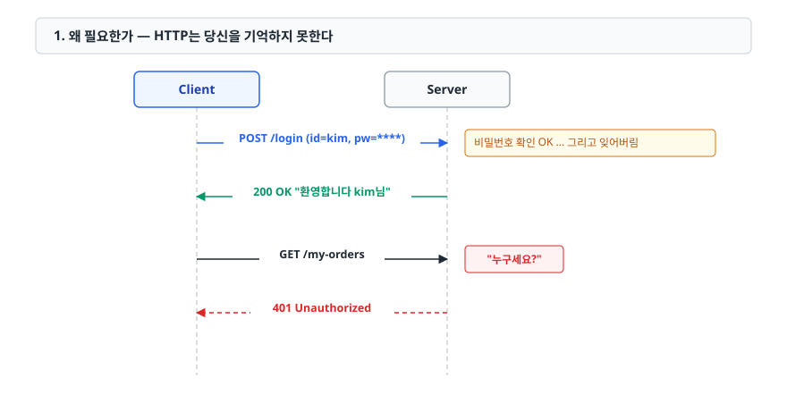
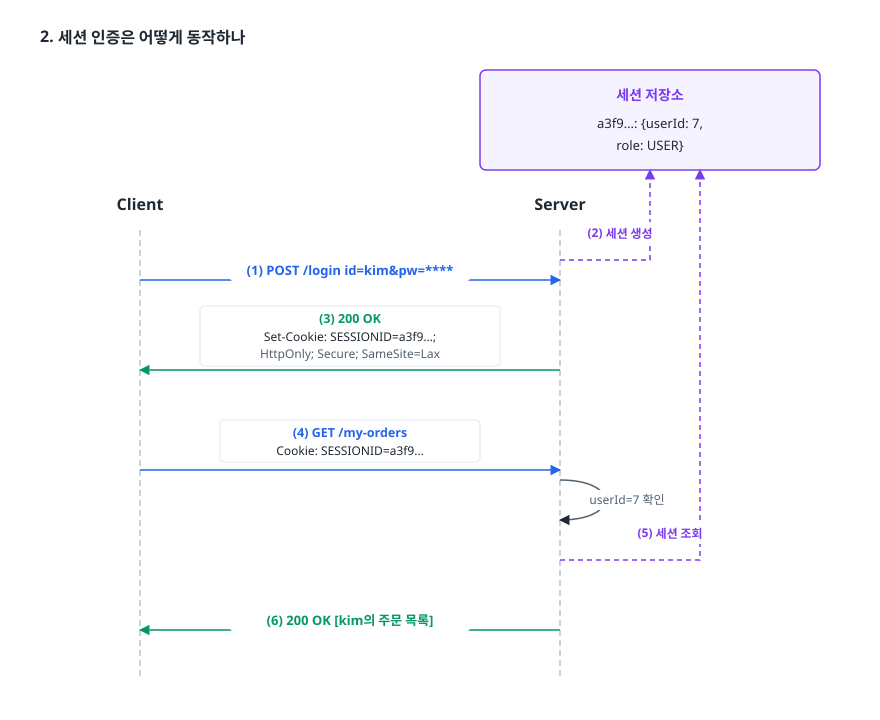
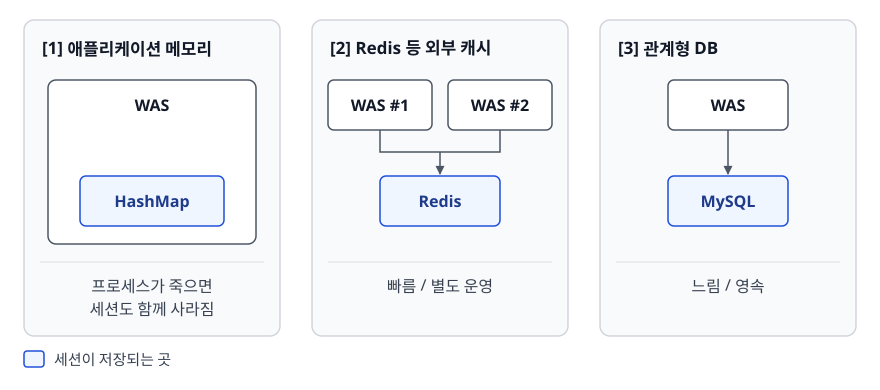
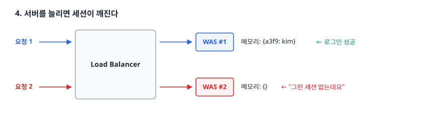
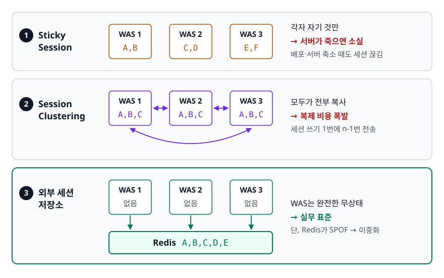
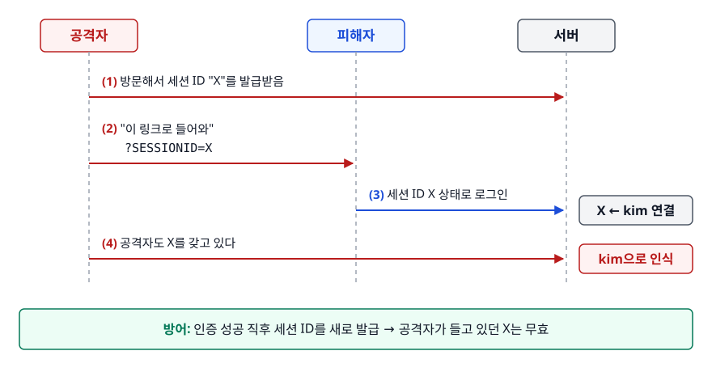

# 세션 기반 인증 (Session-based Authentication)

> HTTP는 방금 로그인한 사람도 잊습니다. 그 망각을 서버 쪽 기억장치로 메우는 방식이 세션 인증이고, 이 문서에서는 세션이 어디에 저장되는지, 서버를 늘리면 왜 깨지는지, 쿠키 속성 한 줄이 어떤 공격을 막는지를 짚습니다.

## 학습 목표

- [ ] HTTP의 무상태성(Statelessness)이 로그인 기능에 만드는 문제를 설명할 수 있다
- [ ] 로그인부터 로그아웃까지 세션 인증 흐름을 단계별로 그릴 수 있다
- [ ] 세션 저장소를 메모리 / Redis / DB 중에서 고르는 기준을 댈 수 있다
- [ ] 서버를 여러 대로 늘렸을 때 세션이 깨지는 이유와 세 가지 해법의 트레이드오프를 비교할 수 있다
- [ ] HttpOnly / Secure / SameSite가 각각 어떤 공격을 막는지 설명할 수 있다
- [ ] 세션 고정(Session Fixation) 공격과 방어를 설명할 수 있다

## 선행 지식

- 없음 — 이 문서부터 시작해도 됩니다. HTTP 요청과 응답에 "헤더"라는 게 있다는 정도만 알면 충분합니다.

---

## 1. 왜 필요한가 — HTTP는 당신을 기억하지 못한다

HTTP는 **무상태(Stateless) 프로토콜**입니다. 요청 하나를 처리하고 나면 서버는 그 요청을 전혀 기억하지 않습니다. 같은 사람이 1초 뒤에 다시 요청을 보내도, 서버 입장에서는 완전히 처음 보는 요청입니다.

이 설계 덕분에 서버는 단순하고 튼튼해집니다. 아무것도 기억하지 않으니 껐다 켜도, 여러 대로 늘려도 문제가 없습니다. 문제는 로그인이 등장하는 순간 생깁니다.

<!-- diagram:be-session-based-1 -->


<!-- 위 그림이 대체한 원본 ASCII.
     내용을 고칠 때는 그림도 함께 갱신할 것.
```
  Client                                Server
    │  POST /login  (id=kim, pw=****)     │
    ├────────────────────────────────────►│  비밀번호 확인 OK … 그리고 잊어버림
    │  200 OK  "환영합니다 kim님"          │
    │◄────────────────────────────────────┤
    │  GET /my-orders                     │
    ├────────────────────────────────────►│  "누구세요?"
    │  401 Unauthorized                   │
    │◄────────────────────────────────────┤
```
-->

그렇다고 요청마다 아이디와 비밀번호를 같이 보내게 할 수는 없습니다. 비밀번호가 네트워크를 수십 번 오가면 노출 확률이 그만큼 올라갑니다. 클라이언트도 비밀번호를 계속 들고 있어야 합니다.

**해결 아이디어**: 로그인 검증은 딱 한 번만 하고 그 결과를 서버가 기억합니다. 그리고 그 기억을 가리키는
**표(ticket)** 하나를 클라이언트에게 줍니다. 이후로는 비밀번호 대신 그 표만 내밉니다. 이 "서버 쪽 기억"이 **세션**(Session)이고, "표"가 **세션 ID**(Session ID)입니다.

> **비유**: 클럽 입구에서 신분증을 확인받고 손목에 팔찌를 채워주는 것과 같습니다. 입장할 때 한 번만 신분증을 검사하고, 그 뒤로는 팔찌만 보여주면 됩니다. 팔찌에는 이름이 적혀 있지 않고 카운터 명단과 대조해야 누구인지 압니다.
>
> **비유의 한계**: 팔찌는 복제가 어렵습니다. 하지만 세션 ID는 문자열이라 복사가 자유롭습니다. 훔친 사람이 그대로 붙여넣으면 그 사람이 곧 나입니다. 그래서 **세션 ID를 어떻게 전달하고 보관하느냐**가 이 방식의 절반을 차지합니다.

---

## 2. 세션 인증은 어떻게 동작하나

<!-- diagram:be-session-based-2 -->


<!-- 위 그림이 대체한 원본 ASCII.
     내용을 고칠 때는 그림도 함께 갱신할 것.
```
                                    ┌──────────────────────────┐
                                    │      세션 저장소          │
                                    │  a3f9…: {userId: 7,      │
                                    │          role: USER}     │
                                    └────────────┬─────────────┘
                                   (2) 세션 생성 │ (5) 세션 조회
  Client                                   Server│
    │ (1) POST /login  id=kim&pw=****         ├──┘
    ├────────────────────────────────────────►│
    │ (3) 200 OK                              │
    │     Set-Cookie: SESSIONID=a3f9…;        │
    │       HttpOnly; Secure; SameSite=Lax    │
    │◄────────────────────────────────────────┤
    │ (4) GET /my-orders                      │
    │     Cookie: SESSIONID=a3f9…             │
    ├────────────────────────────────────────►├──┐ userId=7 확인
    │ (6) 200 OK  [kim의 주문 목록]            │◄─┘
    │◄────────────────────────────────────────┤
```
-->

1. **로그인 요청** — 아이디와 비밀번호를 보냅니다. 이 한 번만 비밀번호가 네트워크를 탑니다.
2. **세션 생성** — 서버가 검증에 성공하면 예측 불가능한 랜덤 세션 ID를 만들고, 저장소에 `세션 ID → {사용자 정보, 만료 시각}`을 기록합니다.
3. **쿠키로 전달** — 응답의 `Set-Cookie` 헤더에 세션 ID를 실어 보냅니다.
4. **자동 재전송** — 이후 같은 도메인으로 가는 요청에 브라우저가 `Cookie` 헤더를 **자동으로** 붙입니다. 개발자가 코드를 쓰지 않아도 붙는다는 점이 중요합니다. 편리한 동시에 CSRF의 원인이 됩니다(5장).
5. **세션 조회** — 세션 ID로 저장소를 뒤져 사용자 정보를 꺼냅니다. 없거나 만료됐으면 401을 돌려줍니다.
6. **응답** — 인증된 사용자로 처리합니다.

### 세션 ID는 추측할 수 없어야 한다

순번(`1`, `2`, `3`)이나 사용자 ID를 그대로 쓰면 숫자만 바꿔 가며 남의 세션에 올라탈 수 있습니다. OWASP는 세션 ID 길이를 최소 128비트, 실질 엔트로피를 최소 64비트로 권장합니다. 직접 만든다면 반드시 암호학적 난수 생성기(`SecureRandom` 등)를 써야 합니다. `java.util.Random`은 안 됩니다. 시드를 알면 다음 값이 예측되기 때문입니다.

실제로는 직접 만들 일이 거의 없습니다. 프레임워크가 자체 생성기를 갖고 있습니다.

| 플랫폼 | 기본 쿠키 이름 | | 플랫폼 | 기본 쿠키 이름 |
|--------|---------------|---|--------|---------------|
| Java 서블릿(Tomcat 등) | `JSESSIONID` | | Express(express-session) | `connect.sid` |
| PHP | `PHPSESSID` | | Django | `sessionid` |

### 코드로 보기

```java
@PostMapping("/login")
public String login(@RequestParam String userId,
                    @RequestParam String password,
                    HttpServletRequest request) {
    User user = userService.authenticate(userId, password);   // 실패 시 예외

    HttpSession session = request.getSession();  // 없으면 이 시점에 생성된다
    request.changeSessionId();                   // 세션 고정 공격 방어 (6장)

    session.setAttribute("userId", user.getId());
    session.setMaxInactiveInterval(30 * 60);                  // 30분 유휴 만료
    return "redirect:/";
}

@PostMapping("/logout")
public String logout(HttpSession session) {
    session.invalidate();        // 저장소에서 실제로 제거한다
    return "redirect:/";
}
```

순서에 주의해야 합니다. `changeSessionId()`는 **이미 세션이 붙어 있는 요청에만** 쓸 수 있어, 세션 없이 부르면 `IllegalStateException`이 납니다. 세션 객체를 새로 만들지 않고 ID만 바꾸므로 위 `session` 참조는 계속 유효합니다.

Node.js(Express)에서는 미들웨어가 같은 일을 합니다.

```js
const session = require('express-session');

app.use(session({
  name: 'sid',
  secret: process.env.SESSION_SECRET,
  resave: false,               // 변경 없으면 저장소에 다시 쓰지 않음
  saveUninitialized: false,    // 로그인 전 방문자에게 세션을 만들지 않음
  cookie: { httpOnly: true, secure: true, sameSite: 'lax', maxAge: 30 * 60 * 1000 },
}));

app.post('/login', async (req, res) => {
  const user = await authenticate(req.body.userId, req.body.password);
  req.session.regenerate(() => {        // 세션 고정 방어
    req.session.userId = user.id;
    res.redirect('/');
  });
});
```

`saveUninitialized: false`가 중요합니다. `true`로 두면 **로그인하지 않은 방문자에게도** 세션이 만들어져 저장소가 빈 세션으로 가득 찹니다. 봇 트래픽이 많은 서비스에서 메모리가 터지는 흔한 원인입니다.

### 흔한 오해

**"쿠키와 세션은 대립하는 기술이다"** — 아닙니다. 세션은 *서버가 상태를 갖는 방식*이고, 쿠키는 *세션 ID를 나르는 운반 수단*입니다. 쿠키 대신 URL에 세션 ID를 붙이는 방식(`;jsessionid=…`)도 존재합니다. 하지만 링크 공유나 Referer 헤더로 세션 ID가 새 나가서 지금은 쓰지 않습니다.

---

## 3. 세션을 어디에 저장할 것인가

<!-- diagram:be-session-based-3 -->


<!-- 위 그림이 대체한 원본 ASCII.
     내용을 고칠 때는 그림도 함께 갱신할 것.
```
[1] 애플리케이션 메모리        [2] Redis 등 외부 캐시       [3] 관계형 DB
┌──────────────┐             ┌──────────┐ ┌──────────┐    ┌──────────┐
│  WAS         │             │  WAS #1  │ │  WAS #2  │    │  WAS     │
│ ┌──────────┐ │             └────┬─────┘ └────┬─────┘    └────┬─────┘
│ │ HashMap  │ │                  └──────┬─────┘               │
│ └──────────┘ │                    ┌────▼────┐           ┌────▼────┐
└──────────────┘                    │  Redis  │           │  MySQL  │
 프로세스가 죽으면                   └─────────┘           └─────────┘
 세션도 함께 사라짐                  빠름 / 별도 운영        느림 / 영속
```
-->

| 저장소 | 속도 | 재시작 후 생존 | 스케일아웃 | 언제 쓰나 |
|--------|------|--------------|-----------|----------|
| 애플리케이션 메모리 | 가장 빠름 | 소실 | 불가(별도 장치 필요) | 로컬 개발, 단일 서버 내부 도구 |
| Redis 등 외부 캐시 | 빠름 | Redis는 설정에 따라 유지, Memcached는 소실 | 자연스럽게 가능 | **대부분의 웹 서비스 기본값** |
| 관계형 DB | 느림 | 유지 | 가능 | 세션 조회가 드물고 감사 로그가 필요할 때 |

한 줄 결론: **서버가 한 대뿐이고 재배포 때 로그아웃돼도 괜찮다면 메모리, 그 외 대부분은 Redis**입니다. DB 세션은 요청마다 디스크 I/O가 발생합니다. 트래픽이 조금만 늘어도 병목이 됩니다.

Redis가 잘 맞는 이유는 세 가지입니다. TTL이 내장돼 있어 만료 세션을 애플리케이션이 청소할 필요가 없습니다. 인메모리라 요청마다 붙는 조회 지연이 작고, 세션은 정확히 `ID → 객체` 조회라 키-값 구조와 맞아떨어집니다.

### 안티패턴: 세션에 무거운 객체를 담는다

```java
// 안티패턴
session.setAttribute("user", user);              // 연관 엔티티가 줄줄이 딸려온 객체
session.setAttribute("cart", cartWithProducts);  // 장바구니 + 상품 상세 전체
session.setAttribute("searchResults", results);  // 검색 결과 500건
```

**왜 문제인가**

- 세션 하나가 수백 KB가 됩니다. 동시 접속자 1만 명이면 수 GB입니다.
- 외부 저장소를 쓰면 요청마다 이 덩어리를 **직렬화 → 네트워크 전송 → 역직렬화**합니다. 세션 조회가 DB 쿼리보다 느려지는 역전이 일어납니다.
- 담아둔 객체는 그 시점의 스냅샷입니다. DB에서 권한이 바뀌어도 세션 속 `user.role`은 옛날 값 그대로입니다.

**개선**

```java
// 세션에는 식별자와 자주 쓰는 소량의 값만
session.setAttribute("userId", user.getId());
session.setAttribute("role", user.getRole());   // 권한 변경 시 세션도 갱신하는 로직 필요

// 나머지는 필요할 때 조회한다. 캐시가 필요하면 세션이 아니라 캐시 계층에서 푼다.
User user = userService.findById((Long) session.getAttribute("userId"));
```

세션은 "**이 요청을 보낸 사람이 누구인가**"만 담는 곳입니다. 사용자별 데이터 캐시로 쓰기 시작하면 반드시 용량과 정합성 문제가 따라옵니다.

---

## 4. 서버를 늘리면 세션이 깨진다

트래픽이 늘어 WAS를 2대로 늘렸더니 사용자가 갑자기 로그아웃됩니다.

<!-- diagram:be-session-based-4 -->


<!-- 위 그림이 대체한 원본 ASCII.
     내용을 고칠 때는 그림도 함께 갱신할 것.
```
   요청 1 ──►┌─────────────────┐──► WAS #1  메모리: {a3f9: kim}  ← 로그인 성공
             │  Load Balancer  │
   요청 2 ──►└─────────────────┘──► WAS #2  메모리: {}          ← "그런 세션 없는데요"
```
-->

세션은 WAS #1의 메모리에만 있는데 로드밸런서가 요청을 번갈아 보냅니다.
**서버가 상태를 들고 있으면 서버를 자유롭게 늘릴 수 없다** — 이것이 Stateful의 대가입니다. 해법은 셋입니다.

<!-- diagram:be-session-based-5 -->


<!-- 위 그림이 대체한 원본 ASCII.
     내용을 고칠 때는 그림도 함께 갱신할 것.
```
 Sticky Session              Session Clustering          외부 세션 저장소
 ┌───┐ ┌───┐ ┌───┐          ┌───┐◄─►┌───┐◄─►┌───┐        ┌───┐ ┌───┐ ┌───┐
 │ 1 │ │ 2 │ │ 3 │          │ 1 │   │ 2 │   │ 3 │        │ 1 │ │ 2 │ │ 3 │
 │A,B│ │C,D│ │E,F│          │ABC│   │ABC│   │ABC│        └─┬─┘ └─┬─┘ └─┬─┘
 └───┘ └───┘ └───┘          └───┘   └───┘   └───┘          └─────┼─────┘
 각자 자기 것만               모두가 전부 복사           ┌─────────▼─────────┐
 → 서버가 죽으면 소실         → 복제 비용 폭발           │ Redis  A,B,C,D,E  │
                                                       └───────────────────┘
```
-->

**1. Sticky Session** — 로드밸런서가 "이 사용자는 계속 WAS #1로"를 고정합니다. 클라이언트 IP 해시나 로드밸런서가 심는 별도 쿠키로 대상을 정합니다. 애플리케이션 코드를 한 줄도 안 고쳐도 되는 것이 장점입니다. 대신 WAS #1이 죽으면 거기 붙어 있던 세션이 **전부 소실**됩니다. 부하가 고르게 분산되지 않고, 배포할 때마다 세션이 끊겨 무중단 배포와 상성이 나쁩니다. 오토스케일링으로 서버를 줄일 때도 같은 문제가 생깁니다.

**2. Session Clustering** — WAS끼리 세션을 서로 복사합니다. 서버 한 대가 죽어도 다른 서버가 그 세션을 이미 갖고 있고, 별도 인프라도 필요 없습니다. 문제는 **서버 수가 늘수록 비용이 폭발**한다는 데 있습니다. 모든 노드가 모든 노드에게 복제하면 세션 쓰기 한 번이 n-1번의 네트워크 전송을 유발하고, 클러스터 전체 트래픽은 서버 수의 제곱에 비례해 늘어납니다. 메모리도 서버 수만큼 낭비됩니다. 4~5대까지는 버티지만 그 이상은 무리입니다.

**3. 외부 세션 저장소** — 모든 WAS가 공용 Redis를 바라봅니다. WAS는 세션을 들고 있지 않으므로 **완전한 무상태**가 됩니다. 서버를 마음대로 늘리고 줄이고 재배포해도 세션은 멀쩡합니다. 실무 표준입니다. 단점은 Redis가 **SPOF**(Single Point of Failure, 단일 장애점)가 된다는 것입니다. WAS 10대가 멀쩡해도 Redis 하나가 죽으면 전원이 로그아웃됩니다. 톨게이트가 하나뿐인 고속도로와 같습니다.

그래서 Redis 자체를 이중화합니다. 두 개념이 섞여 있으니 구분해야 합니다.

| 구분 | Replication (복제) | Sharding (샤딩) |
|------|-------------------|-----------------|
| 하는 일 | 같은 데이터를 여러 노드에 복사 | 데이터를 키 기준으로 여러 노드에 분산 |
| 노드별 데이터 | 전부 동일 | 서로 다름 |
| 해결하는 문제 | 장애 대비 (Master 다운 시 승격) | 용량과 처리량 분산 |
| 해결 못 하는 문제 | 쓰기 부하 (여전히 Master 한 대) | 노드 하나 죽으면 그 조각 유실 |

Redis Cluster는 둘을 함께 씁니다. 데이터를 샤딩해 여러 노드에 나누고, 각 샤드마다 복제본을 둬서 장애에도 대응합니다. "Redis 클러스터링을 한다"는 말은 보통 이 구성을 뜻합니다.

한 줄 결론: **세션 클러스터링은 서버가 적을 때만, 실무 기본값은 외부 저장소 + 저장소 자체의 이중화**입니다.

---

## 5. 쿠키 속성 — 한 줄이 공격 하나를 막는다

```http
Set-Cookie: SESSIONID=a3f9c1e2…; Max-Age=1800; Path=/; HttpOnly; Secure; SameSite=Lax
```

| 속성 | 하는 일 | 없으면 생기는 일 |
|------|--------|----------------|
| `HttpOnly` | JS의 `document.cookie`로 읽지 못하게 한다 | XSS 한 방에 세션 ID가 공격자 서버로 전송된다 |
| `Secure` | HTTPS 연결에서만 전송한다 | 공용 와이파이에서 평문 요청 하나만 새도 세션이 털린다 |
| `SameSite` | 다른 사이트에서 시작된 요청에 쿠키를 붙일지 결정 | CSRF에 그대로 노출된다 |
| `Domain` | 지정하면 서브도메인에도 전송된다 | 지정하지 않는 편이 안전하다(호스트 전용 쿠키) |
| `Max-Age`/`Expires` | 브라우저 저장 기한. 없으면 브라우저를 닫을 때 삭제 | 길수록 탈취 후 악용 기간이 길어진다 |

`SameSite` 값은 셋입니다.

- **`Strict`** — 다른 사이트에서 출발한 요청에는 절대 쿠키를 붙이지 않습니다. 이메일 링크로 들어와도 로그아웃 상태로 보여 사용자 경험이 나쁩니다.
- **`Lax`** — 최상위 화면 이동(주소창이 바뀌는 링크 클릭 등)의 GET 요청에만 붙입니다. ``, `<form method=post>`, `fetch` 같은 크로스 사이트 요청에는 붙지 않아 CSRF 시나리오 대부분이 막힙니다. Chrome 계열은 `SameSite`를 지정하지 않은 쿠키를 `Lax`로 취급합니다. 하지만 브라우저마다 기본값과 적용 시점이 달라서, **생략하지 말고 명시적으로 지정**하는 편이 안전합니다.
- **`None`** — 항상 전송합니다. **`Secure`를 함께 지정하지 않으면 브라우저가 쿠키를 거부합니다.**

### 안티패턴: 로컬에서 되니까 그대로 배포

```js
// 안티패턴 — 개발 편의 설정이 운영에 그대로 올라간 경우
cookie: {
  httpOnly: false,     // "프론트에서 로그인 여부 확인하려고요"
  secure: false,       // "로컬은 http라서요"
  sameSite: 'none',    // "CORS 에러 나서 바꿨어요"
}
```

**왜 문제인가**

- `httpOnly: false` — 세션 ID가 JS에 노출됩니다. 사이트 어딘가에 XSS가 하나만 있으면 전 사용자 세션이 털립니다. 로그인 여부는 쿠키를 읽지 말고 서버가 내려주는 사용자 정보 API로 판단하면 됩니다.
- `secure: false` — 중간자가 평문 요청을 가로채면 그대로 세션 ID를 얻습니다.
- `sameSite: 'none'` + `secure: false` — 애초에 브라우저가 쿠키를 저장하지 않습니다. "로그인이 안 된다"며 헤매게 되는 대표적 조합입니다.

**개선**

```js
const isProd = process.env.NODE_ENV === 'production';

cookie: {
  httpOnly: true,        // 환경과 무관하게 항상 true
  secure: isProd,        // 로컬만 완화, 운영은 강제
  sameSite: 'lax',       // 크로스 도메인이 정말 필요할 때만 none + secure
  maxAge: 30 * 60 * 1000,
}
```

환경에 따라 완화할 대상은 **`secure` 하나로 제한**하는 것이 좋습니다. `httpOnly`까지 끄기 시작하면 로컬에서만 재현되는 보안 결함이 생깁니다.

---

## 6. 세션 고정 (Session Fixation)

로그인 전후로 세션 ID를 바꾸지 않으면 이런 공격이 성립합니다.

<!-- diagram:be-session-based-6 -->


<!-- 위 그림이 대체한 원본 ASCII.
     내용을 고칠 때는 그림도 함께 갱신할 것.
```
 공격자                        피해자                        서버
   │ (1) 방문해서 세션 ID "X"를 발급받음 ──────────────────────►│
   │ (2) "이 링크로 들어와" (?SESSIONID=X)                      │
   ├───────────────────────────►│                              │
   │                            │ (3) 세션 ID X 상태로 로그인   │
   │                            ├─────────────────────────────►│  X ← kim 연결
   │ (4) 공격자도 X를 갖고 있다 ────────────────────────────────►│  kim으로 인식
```
-->

**공격자가 미리 알고 있는 세션 ID로 피해자가 로그인해버린다**는 점이 핵심입니다. 세션 ID를 훔칠 필요 없이 미리 심어두면 됩니다. 방어는 간단합니다. **인증에 성공한 직후 세션 ID를 새로 발급**하면 공격자가 들고 있던 ID는 아무 의미가 없어집니다. 서블릿에서는 `request.changeSessionId()`가 세션 데이터를 유지한 채 ID만 바꿉니다.

Spring Security를 쓰면 로그인 성공 시 세션 ID 교체가 기본으로 동작합니다. 직접 로그인 로직을 짤 때 빠뜨리기 쉬운 부분입니다. 함께 지켜야 할 것들:

- **로그아웃 시 `session.invalidate()`** — 쿠키만 지우고 서버 세션을 남겨두면, 이전에 세션 ID를 탈취당했을 경우 로그아웃해도 공격자는 계속 로그인 상태입니다.
- **세션 ID를 URL에 담지 않기** — Referer 헤더, 브라우저 히스토리, 접근 로그로 줄줄이 샙니다.
- **유휴 만료와 절대 만료를 함께** — 활동이 없으면 30분 뒤 만료, 활동이 있어도 12시간 뒤에는 재로그인.

---

## 7. 실무에서는

**Spring 생태계** — `spring-session-data-redis`를 의존성에 추가하고 설정 클래스에 `@EnableRedisHttpSession`을 붙이면 `HttpSession` API는 그대로 둔 채 저장소만 Redis로 바뀝니다. 애플리케이션 코드를 고치지 않고 스케일아웃에 대응할 수 있는 것이 이 방식의 장점입니다.

**세션이 유리한 상황** — 관리자가 특정 사용자를 **즉시 강제 로그아웃**시켜야 하거나(금융, 어드민, 커머스 백오피스), 권한 변경이 **다음 요청부터 바로** 반영돼야 하거나, 클라이언트가 브라우저 하나뿐이고 도메인이 통일돼 있을 때입니다. 반대로 여러 도메인·모바일 앱·서비스 간 인증 전파가 필요하면 토큰 쪽이 편합니다. 자세한 비교는 [02-jwt-token.md](./02-jwt-token.md)에서 다룹니다.

브라우저에는 세션 쿠키를 쓰고 내부 마이크로서비스 호출에는 짧은 수명의 토큰을 쓰는 하이브리드도 흔합니다. "세션 아니면 JWT" 같은 이분법은 실무에 잘 맞지 않습니다.

---

## 8. 면접 포인트

> 면접에서 이 주제가 나오면 이렇게 답한다

**Q. 세션 기반 인증이 무엇이고 왜 필요한가요?**

A. HTTP가 무상태라서 서버는 이전 요청을 기억하지 못합니다. 그래서 로그인 검증은 한 번만 하고 그 결과를 서버 저장소에 기록한 뒤, 이를 가리키는 랜덤한 세션 ID만 쿠키로 내려줍니다. 이후 요청에는 브라우저가 이 쿠키를 자동으로 붙이고, 서버는 저장소를 조회해 사용자를 식별합니다. 비밀번호가 네트워크를 반복해서 오가지 않게 하면서 상태를 유지하는 방법입니다.

- 꼬리 질문: "세션 ID를 순번으로 발급하면?" → 다음 번호를 넣어보는 것만으로 남의 세션에 접근할 수 있습니다. 암호학적 난수로 128비트 이상을 써야 합니다.

**Q. 서버를 여러 대로 늘리면 어떤 문제가 생기고 어떻게 해결하나요?**

A. 세션이 특정 서버 메모리에만 있으면 로드밸런서가 다른 서버로 요청을 보냈을 때 세션을 찾지 못해 로그아웃됩니다. 해결책은 세 가지입니다. Sticky Session은 같은 사용자를 같은 서버로 고정하는데, 그 서버가 죽으면 세션이 통째로 사라지고 무중단 배포와 충돌합니다. Session Clustering은 서버끼리 복제하는데, 서버 수가 늘수록 복제 비용이 제곱으로 커집니다. 실무 표준은 Redis 같은 외부 저장소를 두는 것이고, 대신 Redis가 SPOF가 되므로 Redis Cluster로 이중화합니다.

- 꼬리 질문: "Redis 복제와 샤딩은 뭐가 다른가요?" → 복제는 같은 데이터를 여러 대에 두는 장애 대비이고, 샤딩은 데이터를 나눠 담는 용량·처리량 분산입니다. Redis Cluster는 둘을 함께 씁니다.

**Q. 세션 쿠키에 HttpOnly와 SameSite를 왜 붙이나요?**

A. 서로 다른 공격을 막습니다. `HttpOnly`는 JS에서 쿠키를 읽지 못하게 해 XSS가 발생해도 세션 ID가 탈취되지 않게 합니다. `SameSite`는 다른 사이트에서 시작된 요청에 쿠키를 자동으로 붙이지 않게 해 CSRF를 막습니다. CSRF가 성립하는 이유는 "브라우저가 쿠키를 자동 전송한다"는 데 있습니다. 여기에 HTTPS에서만 전송하는 `Secure`까지 세 개를 기본 세트로 봅니다.

- 꼬리 질문: "SameSite=Lax만으로 CSRF가 완전히 막히나요?" → 상태 변경을 GET으로 처리하는 API가 남아 있으면 뚫립니다. 상태 변경은 POST/PUT/DELETE로 두고 CSRF 토큰을 함께 쓰는 다층 방어가 안전합니다.

**Q. 세션 고정 공격이 무엇인가요?**

A. 공격자가 미리 발급받은 세션 ID를 피해자에게 심어두고, 피해자가 그 세션 ID 상태로 로그인하게 만드는 공격입니다. 서버가 로그인 시 기존 세션 ID를 그대로 쓰면 그 ID에 피해자 계정이 연결되고, 같은 ID를 가진 공격자도 로그인 상태가 됩니다. 방어는 인증 성공 직후 세션 ID를 새로 발급하는 것입니다.

---

## 자주 하는 실수

| 실수 | 왜 틀렸나 | 올바른 이해 |
|------|----------|-----------|
| 로그아웃에서 쿠키만 삭제 | 서버 세션이 살아 있어 탈취된 ID로 계속 접근 가능 | `invalidate()`로 저장소의 세션을 제거 |
| 세션에 엔티티 통째로 저장 | 용량 폭증 + 직렬화 비용 + 데이터가 옛날 값으로 굳음 | 식별자와 소량의 값만, 나머지는 조회 |
| `saveUninitialized: true` 방치 | 로그인 안 한 방문자·봇에게도 세션 생성 | 로그인 시점에만 세션 생성 |
| Sticky Session이면 확장 끝 | 서버 장애·배포·스케일인에서 세션 소실 | 외부 저장소로 무상태화 |
| Redis 세션 도입으로 안심 | Redis 단일 노드는 그 자체가 SPOF | 복제·샤딩으로 Redis도 이중화 |
| `SameSite=None`만 설정 | `Secure`가 없으면 브라우저가 쿠키를 거부 | `None`은 `Secure`와 항상 세트 |
| 로그인 후 세션 ID 유지 | 세션 고정 공격 성립 | 인증 성공 직후 ID 재발급 |

---

## 한 줄 정리

세션 인증은 "서버가 기억하고 클라이언트는 표만 들고 다니는" 방식입니다. 그 대가로 **상태를 어디에 둘 것인가**와
**표를 어떻게 안전하게 나를 것인가**, 두 가지 문제를 계속 풀어야 합니다.

---

## 연관 개념

- [02-jwt-token.md](./02-jwt-token.md) - 서버가 기억하지 않는 반대편 접근, 그리고 그 대가
- [03-oauth2.md](./03-oauth2.md) - 남의 서비스에 인증을 위임하는 방식
- [qna-authentication.md](./qna-authentication.md) - 이 주제 면접 질문 모음
- [08-security/qna-security.md](../../08-security/qna-security.md) - XSS, CSRF 등 웹 취약점 상세
- [09-system-design/scalability/qna-scalability.md](../../09-system-design/scalability/qna-scalability.md) - 스케일아웃과 무상태 아키텍처
- [09-system-design/caching/qna-caching.md](../../09-system-design/caching/qna-caching.md) - Redis 운영과 캐시 전략
