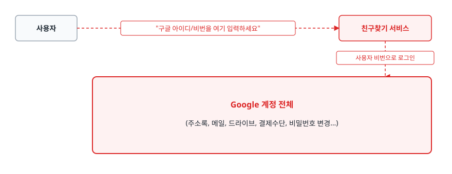
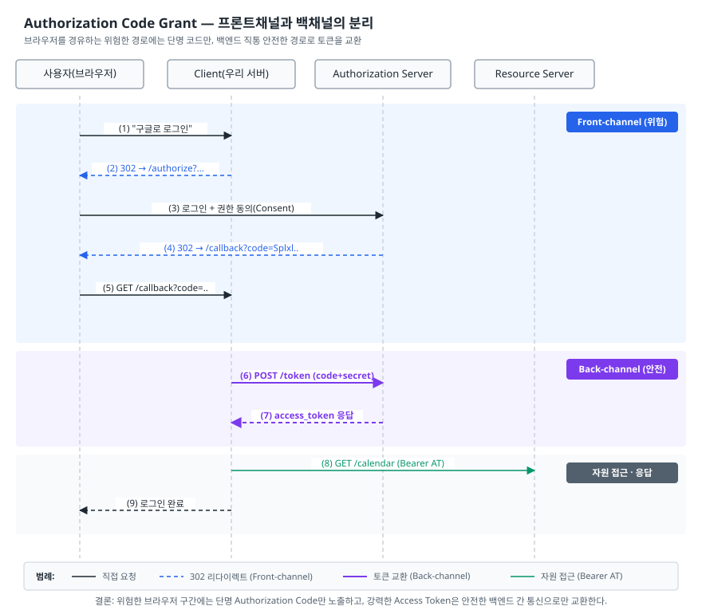
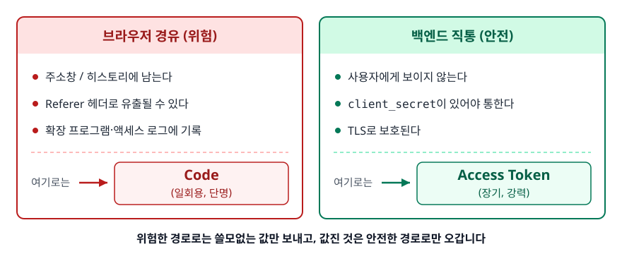
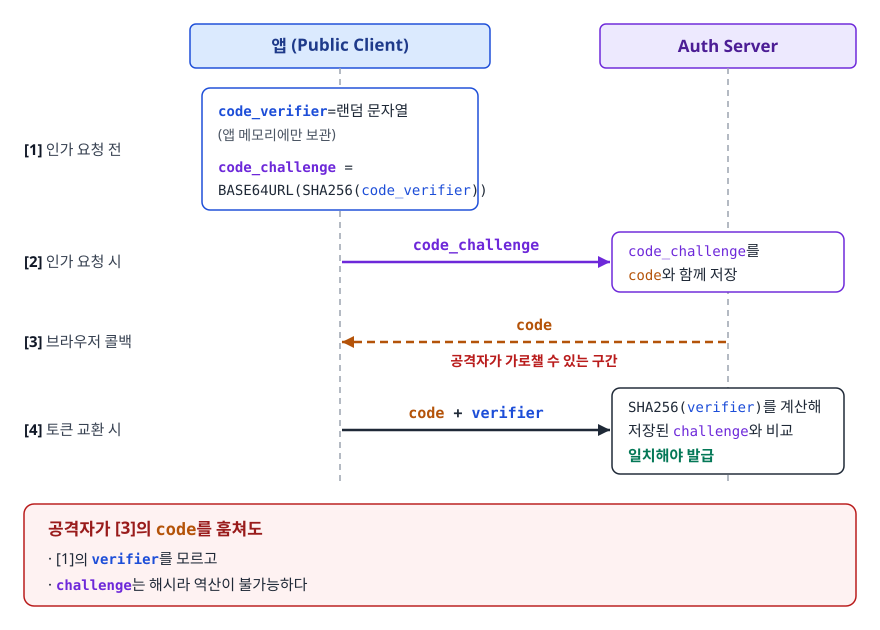
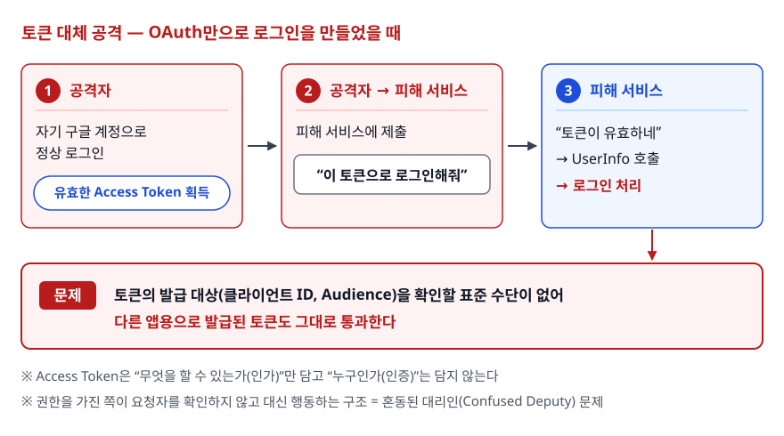
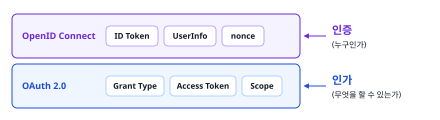
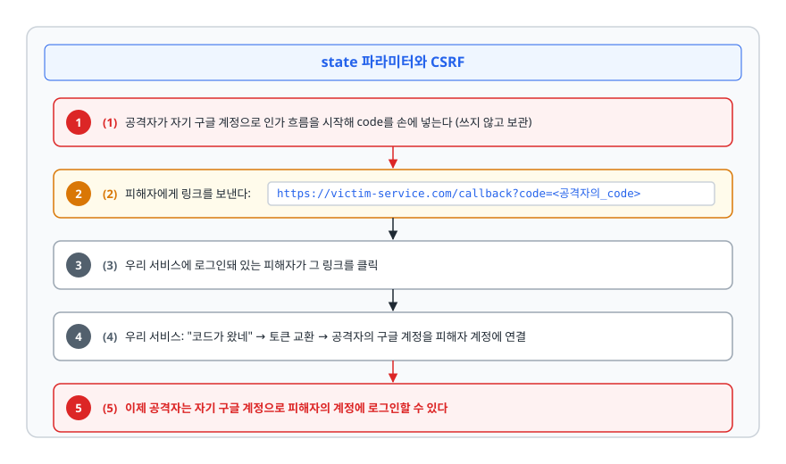
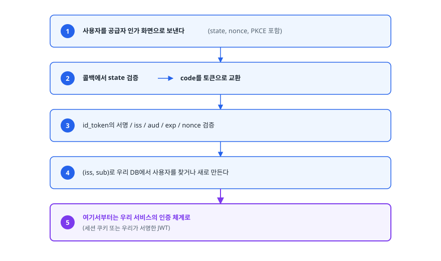

# OAuth 2.0 (Open Authorization 2.0)

> OAuth 2.0은 "비밀번호를 넘기지 않고 권한만 빌려주는" 프로토콜입니다. 소셜 로그인 버튼을 눌렀을 때 브라우저와 두 서버 사이에서 무슨 일이 벌어지는지, 코드와 토큰을 왜 두 단계로 나눴는지, OAuth만으로 로그인을 만들면 왜 안 되는지까지, 이 문서를 읽고 나면 설명할 수 있게 됩니다.

## 학습 목표

- [ ] OAuth 2.0이 등장하기 전의 문제(비밀번호 위임)를 설명할 수 있다
- [ ] 4가지 역할을 구분하고 각각이 실제 서비스에서 누구인지 짚을 수 있다
- [ ] Authorization Code Grant 흐름을 HTTP 요청 단위로 그리고, Code와 Token을 분리한 이유를 설명할 수 있다
- [ ] PKCE가 메우는 구멍과 Grant Type들의 용도, 폐기된 것들의 폐기 사유를 안다
- [ ] OAuth(인가)와 OIDC(인증)의 차이를 설명하고 ID Token 검증 항목을 나열할 수 있다
- [ ] `state` 파라미터가 막는 공격을 설명할 수 있다

## 선행 지식

- [02-jwt-token.md](./02-jwt-token.md) - ID Token이 JWT라서, 서명 검증 개념을 알면 훨씬 수월합니다

---

## 1. 왜 필요한가 — 비밀번호를 통째로 넘기는 시대

2000년대 중반, 어떤 서비스가 "당신의 Gmail 주소록을 가져와 친구를 찾아드립니다"라고 하면 방법은 하나뿐이었습니다. **사용자가 Gmail 아이디와 비밀번호를 그 서비스에 입력하는 것.**

<!-- diagram:be-oauth2-1 -->


<!-- 위 그림이 대체한 원본 ASCII.
     내용을 고칠 때는 그림도 함께 갱신할 것.
```
  사용자 ── "구글 아이디/비번을 여기 입력하세요" ──► 친구찾기 서비스
                                                        │ 사용자 비번으로 로그인
                                                        ▼
                                    Google 계정 전체 (주소록, 메일, 드라이브,
                                                     결제수단, 비밀번호 변경…)
```
-->

문제는 다섯 가지입니다. **범위를 제한할 수 없고**(사진만 필요한 서비스가 메일까지 봅니다), **기간을 제한할 수 없고**,
**철회하려면 비밀번호를 바꿔야 하며**(그 비밀번호를 준 다른 모든 서비스가 함께 끊깁니다), **서비스가 비밀번호를 저장하고**(그 서비스가 털리면 구글 계정도 털립니다), **2단계 인증과 공존할 수 없습니다.**

OAuth 2.0은 이 다섯을 한 번에 풉니다. **비밀번호는 원래 주인(구글)에게만 입력하고, 제3자 서비스에는 "주소록 읽기 권한"이라는 제한된 표(Access Token)만 줍니다.**

> **비유**: 호텔 발렛파킹 키와 같습니다. 마스터 키를 넘기면 트렁크도 글로브박스도 열리지만, 발렛 키는 시동을 걸고 주차만 할 수 있습니다. 게다가 언제든 발렛 키만 무효화할 수 있습니다.
>
> **비유의 한계**: 발렛 키는 물리적으로 기능이 제한됩니다. 하지만 Access Token의 권한 제한은 **리소스 서버가 스코프를 성실히 검사해야만** 성립합니다. 토큰 자체에는 문을 못 여는 물리적 장치가 없습니다.

---

## 2. 4가지 역할

| 역할 | 정의 | "구글로 로그인" | "구글 캘린더 읽기" |
|------|------|----------------|-------------------|
| **Resource Owner** | 리소스의 주인 | 로그인하려는 사용자 | 캘린더 주인인 사용자 |
| **Client** | 권한을 빌리려는 앱 | 우리 서비스 | 우리 서비스 |
| **Authorization Server** | 사용자를 인증하고 토큰 발급 | Google 계정 서버 | Google 계정 서버 |
| **Resource Server** | 보호된 리소스를 제공 | (UserInfo 엔드포인트) | Google Calendar API |

헷갈리기 쉬운 지점이 두 가지 있습니다. **"Client"는 프론트엔드가 아닙니다.** OAuth에서 Client는 *등록된 애플리케이션*을 뜻하며 백엔드일 수도 SPA일 수도 있습니다. 이 구분이 뒤에서 PKCE 필요성으로 이어집니다. 그리고 **Authorization Server와 Resource Server는 같은 회사일 수 있습니다.** 구글은 둘 다 운영하지만 프로토콜상으로는 분리된 역할입니다.

Client는 사전에 Authorization Server에 **등록**돼 있어야 합니다. 등록 과정에서 허용할 `redirect_uri` 목록을 직접 신고하고, 그 대가로 `client_id`(공개 식별자)와 경우에 따라 `client_secret`(비밀 키)을 발급받습니다.

---

## 3. Authorization Code Grant — 표준 흐름

<!-- diagram:auth-oauth2-code-grant -->


<!-- 위 그림이 대체한 원본 ASCII.
     내용을 고칠 때는 그림도 함께 갱신할 것.
```
  사용자(브라우저)   Client(우리 서버)   Authorization Server    Resource Server
 (1) │ "구글로 로그인" ►│                       │                       │
 (2) │◄ 302 → /authorize?client_id=..&state=..&code_challenge=..      │
 (3) │ 로그인 + "이 앱이 캘린더를 읽어도 될까요?" 동의(Consent)         │
     ├──────────────────────────────────────►│                       │
 (4) │◄ 302 → https://myapp.com/callback?code=Splxl..&state=..        │
 (5) │ GET /callback?code=..&state=..         │                       │
     ├───────────────►│ (6) POST /token       │                       │
     │                │   code + client_secret + code_verifier        │
     │                ├──────────────────────►│                       │
     │                │ (7) access_token (+ id_token, refresh_token)  │
     │                │◄──────────────────────┤                       │
     │                │ (8) GET /calendar   Authorization: Bearer AT  │
     │                ├─────────────────────────────────────────────►│
 (9) │◄ 로그인 완료    │◄─────────────────────────────────────────────┤
```
-->

(1)~(5)는 브라우저를 거치고 **(6)(7)은 서버 대 서버 통신**(Back-channel)입니다. 이 구분이 핵심입니다.

### 실제 HTTP로 보기

```http
GET /authorize?response_type=code&client_id=my-app-1234
    &redirect_uri=https%3A%2F%2Fmyapp.com%2Fcallback&scope=openid%20email%20profile
    &state=8f4c2a1e9b7d3056
    &code_challenge=E9Melhoa2OwvFrEMTJguCHaoeK1t8URWbuGJSstw-cM&code_challenge_method=S256 HTTP/1.1
Host: auth.example.com
```

(실제 요청은 한 줄입니다. 위는 읽기 편하도록 파라미터마다 줄을 나눴습니다.)

| 파라미터 | 역할 |
|----------|------|
| `redirect_uri` | 결과를 돌려줄 주소. **사전 등록된 값과 정확히 일치**해야 한다 |
| `scope` | 요청하는 권한 범위. 사용자 동의 화면에 이 내용이 표시된다 |
| `state` | CSRF 방지용 일회성 랜덤값 (7장) |
| `code_challenge` | 코드 가로채기를 막는 PKCE용 값 (5장) |

사용자가 동의하면 브라우저가 `redirect_uri`로 돌아옵니다. 그다음부터는 **우리 백엔드가 직접** 요청합니다.

```http
POST /token HTTP/1.1
Host: auth.example.com
Content-Type: application/x-www-form-urlencoded

grant_type=authorization_code&code=SplxlOBeZQQYbYS6WxSbIA
&redirect_uri=https%3A%2F%2Fmyapp.com%2Fcallback
&client_id=my-app-1234&client_secret=SERVER_ONLY_SECRET
&code_verifier=dBjftJeZ4CVP-mB92K27uhbUJU1p1r_wW1gFWFOEjXk
```

응답은 JSON이며 `access_token`, `token_type`, `expires_in`, `refresh_token`, 그리고 `openid` 스코프를 요청했다면 `id_token`이 함께 들어 있습니다.

### 왜 코드를 한 번 거치나

"바로 Access Token을 주면 안 되나?"가 자연스러운 질문입니다. 답은 **브라우저를 통과하는 값과 서버끼리 주고받는 값을 분리하기 위해서**입니다.

<!-- diagram:be-oauth2-2 -->


<!-- 위 그림이 대체한 원본 ASCII.
     내용을 고칠 때는 그림도 함께 갱신할 것.
```
   브라우저 경유 (위험)                 백엔드 직통 (안전)
   ─────────────────                   ──────────────────
   주소창 / 히스토리에 남는다            사용자에게 보이지 않는다
   Referer 헤더로 유출될 수 있다         client_secret이 있어야 통한다
   확장 프로그램·액세스 로그에 기록       TLS로 보호된다

   여기로는 ▶ Code(일회용, 단명)        여기로는 ▶ Access Token(장기, 강력)
```
-->

Authorization Code에는 세 겹의 안전장치가 있습니다. **일회용**이라 한 번 교환되면 무효고(재사용이 감지되면 그 코드로 발급된 토큰까지 폐기하도록 권고됩니다), **수명이 매우 짧아** 로그를 뒤져 찾아냈을 땐 이미 죽어 있으며, **`client_secret`이 있어야 교환**되므로 코드만 훔쳐서는 쓸모가 없습니다. 즉 **위험한 경로로는 쓸모없는 값만 보내고, 값진 것은 안전한 경로로만 오갑니다.**

### 안티패턴: 토큰 교환을 프론트엔드에서

```js
// 안티패턴 — SPA 번들에 secret이 박혀 있다
await fetch('https://auth.example.com/token', {
  method: 'POST',
  body: new URLSearchParams({ grant_type: 'authorization_code', code,
    client_id: 'my-app-1234', client_secret: 'SERVER_ONLY_SECRET' }),
});
```

**왜 문제인가** — 프론트엔드 번들은 사용자에게 전송되는 파일입니다. 개발자 도구 Sources 탭만 열면 보입니다. 난독화해도 소용없습니다. 실행 시점에는 반드시 평문이어야 하기 때문입니다. secret이 노출되면 공격자가 **우리 앱인 척** 토큰을 발급받을 수 있습니다. 모바일 앱도 APK/IPA를 디컴파일하면 나옵니다.

**개선** — 백엔드가 있다면 코드만 백엔드로 넘기고 교환은 백엔드에서 합니다(secret은 서버에만 둡니다). 백엔드가 없다면 앱을 "Public Client"로 등록하고 `client_secret` 대신 PKCE로 소유권을 증명합니다.

---

## 4. 다른 Grant Type들

| Grant Type | 누가 쓰나 | 상태 |
|-----------|----------|------|
| **Authorization Code** (+ PKCE) | 웹 앱, SPA, 모바일 — 사용자가 개입하는 거의 모든 경우 | **표준. 기본으로 이것** |
| **Client Credentials** | 서버가 자기 자신의 권한으로 API 호출(배치, 서버 간 통신) | 현역. 사용자 개입이 없을 때 |
| **Refresh Token** | 만료된 Access Token 재발급 | 현역. 다른 Grant의 보조 |
| **Device Authorization** | TV·콘솔처럼 입력이 어려운 기기. 화면의 코드를 폰으로 승인 | 현역 |
| **Implicit** | 과거 SPA용. 리다이렉트로 Access Token을 직접 받음 | **폐기 권고** |
| **Resource Owner Password Credentials** | 앱이 아이디/비번을 직접 받아 토큰과 교환 | **폐기 권고** |

Implicit이 폐기된 이유는 명확합니다. Access Token이 **URL 프래그먼트에 실려 브라우저를 통과**하기 때문입니다. 3장의 "브라우저 경유는 위험하다"는 원칙을 정면으로 위반합니다. 애초에 Implicit이 만들어진 이유는 SPA가 다른 도메인의 토큰 엔드포인트를 직접 호출할 수 없던 시절의 제약 때문이었습니다. 인가 서버들이 토큰 엔드포인트에 CORS를 허용하고 PKCE가 자리 잡으면서 SPA도 Authorization Code를 쓸 수 있게 되자 존재 이유가 사라졌습니다.

ROPC(Password Grant)는 **OAuth가 없애려던 문제 그 자체**입니다. 앱이 비밀번호를 직접 받는 순간 1장의 다섯 문제가 전부 돌아오고, 2단계 인증과도 공존할 수 없습니다. OAuth 2.1 초안은 Implicit과 ROPC를 제거하고, 모든 Authorization Code 흐름에 PKCE를 요구하며, `redirect_uri`를 문자열 완전 일치로 비교하도록 못 박는 방향으로 진행 중입니다.

---

## 5. PKCE — Public Client의 구멍 메우기

`client_secret`을 안전하게 보관할 수 있는 Client를 **Confidential Client**, 그럴 수 없는 쪽을 **Public Client**라 합니다. SPA와 모바일 앱이 Public Client입니다.

Public Client는 secret이 없으니 코드를 토큰으로 바꿀 때 "내가 진짜 그 앱이다"를 증명할 수단이 없습니다. 공격자가 리다이렉트 과정에서 코드를 가로채면 그대로 토큰을 받아갑니다. 특히 모바일에서는 커스텀 URL 스킴(`myapp://callback`)을 **악성 앱이 똑같이 등록**해 코드를 가로챌 수 있습니다. 해결 아이디어는 이렇습니다. secret을 미리 심어둘 수 없다면 **요청할 때마다 그 자리에서 만들면 됩니다.**

<!-- diagram:be-oauth2-7 -->


<!-- 위 그림이 대체한 원본 ASCII.
     내용을 고칠 때는 그림도 함께 갱신할 것.
```
 [1] 인가 요청 전   code_verifier  = 랜덤 문자열 (앱 메모리에만 보관)
                   code_challenge = BASE64URL(SHA256(code_verifier))
 [2] 인가 요청 시   ──── code_challenge ────► Auth Server (code와 함께 저장)
 [3] 브라우저 콜백  ◄──── code ─────────────
 [4] 토큰 교환 시   ──── code + verifier ───► SHA256(verifier)를 계산해
                                              저장된 challenge와 비교, 일치해야 발급

 공격자가 [3]의 code를 훔쳐도 [1]의 verifier를 모르고, challenge는 해시라 역산이 불가능하다.
```
-->

`code_verifier`는 43~128자의 랜덤 문자열이고, `code_challenge`는 그 SHA-256 해시를 Base64URL로 인코딩한 값입니다. RFC 7636 문서의 예제로 직접 확인할 수 있습니다.

```bash
printf '%s' 'dBjftJeZ4CVP-mB92K27uhbUJU1p1r_wW1gFWFOEjXk' \
  | openssl dgst -sha256 -binary | openssl base64 -A | tr '+/' '-_' | tr -d '='
# E9Melhoa2OwvFrEMTJguCHaoeK1t8URWbuGJSstw-cM
```

브라우저에서는 `crypto.getRandomValues()`로 verifier를 만들고 `crypto.subtle.digest('SHA-256', …)`로 challenge를 계산합니다. `code_challenge_method`는 반드시 `S256`을 씁니다. 스펙에 `plain`(해시 없이 그대로 전송)도 있지만, 그러면 인가 요청을 엿본 공격자가 verifier를 그대로 알게 되어 방어가 무의미해집니다.

**중요한 오해 정리**: PKCE는 `client_secret`을 대체하는 게 아니라 **코드 가로채기(Authorization Code Interception)를 막는 장치**입니다. 그래서 Confidential Client도 함께 쓰는 것이 권장됩니다. "백엔드가 있으니 PKCE는 필요 없다"는 말은 절반만 맞습니다.

---

## 6. OAuth(인가) vs OIDC(인증)

OAuth의 Access Token은 "**무엇을 할 수 있는가**"를 담습니다. "**누구인가**"를 담지 않습니다. 이 차이가 실제 공격으로 이어집니다.

<!-- diagram:be-oauth2-3 -->


<!-- 위 그림이 대체한 원본 ASCII.
     내용을 고칠 때는 그림도 함께 갱신할 것.
```
[토큰 대체 공격 — OAuth만으로 로그인을 만들었을 때]

 공격자가 자기 구글 계정으로 정상 로그인 → 유효한 Access Token 획득
   └─► 피해 서비스에 "이 토큰으로 로그인해줘"라고 제출
       └─► 서비스: "토큰이 유효하네" → UserInfo 호출 → 로그인 처리
           문제: 토큰의 발급 대상을 확인할 표준 수단이 없어
                 다른 앱용으로 발급된 토큰도 그대로 통과한다
```
-->

문제는 **Access Token만 받아서는 "이 토큰이 어느 앱을 위해 발급됐는지"를 확인할 방법이 마땅치 않다**는 데 있습니다. 토큰이 불투명한 문자열(opaque string)인 경우가 많아 서비스는 그 안을 볼 수 없고, UserInfo 응답 형식도 공급자마다 제각각입니다. 공급자에 따라 토큰 내부 정보를 되묻는 Introspection(RFC 7662) 엔드포인트를 제공하기도 하지만, 선택 확장이라 어디서나 기대할 수는 없습니다. 이렇게 권한을 가진 쪽이 요청자가 누구인지 확인하지 않고 대신 행동해 버리는 구조를 **혼동된 대리인(Confused Deputy)** 문제라 부릅니다.

**OpenID Connect**(OIDC)는 OAuth 2.0 위에 얇게 얹은 인증 표준입니다. 핵심은 `id_token` 하나입니다.

<!-- diagram:be-oauth2-4 -->


<!-- 위 그림이 대체한 원본 ASCII.
     내용을 고칠 때는 그림도 함께 갱신할 것.
```
     ┌──────────────────────────────────────────┐
     │ OpenID Connect: ID Token/UserInfo/nonce  │  ← 인증 (누구인가)
     ├──────────────────────────────────────────┤
     │ OAuth 2.0: Grant Type/Access Token/Scope │  ← 인가 (무엇을 할 수 있는가)
     └──────────────────────────────────────────┘
```
-->

`scope`에 `openid`를 포함해 요청하면 토큰 응답에 `id_token`이 함께 옵니다. 이것은 **JWT**입니다.

| 검증 항목 | 확인 내용 | 빠뜨리면 |
|----------|----------|---------|
| 서명 | 발급자 공개키(JWKS)로 검증되는가 | 위조 토큰이 통과 |
| `iss` | 내가 신뢰하는 발급자인가 | 아무나 만든 토큰을 받는다 |
| `aud` | **내 `client_id`와 같은가** | 다른 앱용 토큰이 통과 = 토큰 대체 공격 |
| `exp` | 만료되지 않았는가 | 오래된 토큰이 통과 |
| `nonce` | 내가 인가 요청에 넣은 값과 같은가 | 재생(replay) 공격 |
| `sub` | (식별자로 사용) 공급자 내 사용자 고유 ID | — |

`aud` 검증이 토큰 대체 공격을 정확히 막는 지점입니다. 공격자가 다른 앱용 ID Token을 가져와도 `aud`가 우리 `client_id`가 아니므로 거부됩니다. OIDC는 상호운용성도 개선했습니다. `https://<발급자>/.well-known/openid-configuration`을 조회하면 인가·토큰·UserInfo 엔드포인트와 JWKS 주소가 JSON으로 나오고(**Discovery**), 발급자 공개키가 표준 형식(**JWKS**)으로 제공돼 키 교체도 `kid`로 자동 대응됩니다.

### 안티패턴: id_token의 페이로드만 읽고 믿기

```js
// 안티패턴
const payload = JSON.parse(atob(idToken.split('.')[1]));
const user = await findOrCreateUser({ email: payload.email });
```

**왜 문제인가** — 서명을 검증하지 않았습니다. 공격자가 `{"email":"admin@ourservice.com"}`을 직접 Base64로 인코딩해 보내면 그대로 관리자 계정으로 로그인됩니다. `iss`와 `aud`도 확인하지 않아 다른 발급자·다른 앱의 토큰까지 받습니다. `email`을 식별자로 쓴 것도 문제입니다. 이메일은 바뀌고 소유가 검증되지 않을 수 있으므로 사용자 식별은 **`iss` + `sub` 조합**을 써야 합니다.

**개선**

```js
const JWKS = createRemoteJWKSet(new URL('https://auth.example.com/jwks'));   // jose

async function verifyIdToken(idToken, expectedNonce) {
  const { payload } = await jwtVerify(idToken, JWKS, {
    issuer: 'https://auth.example.com',
    audience: process.env.OAUTH_CLIENT_ID,       // aud 검증 — 토큰 대체 공격 차단
  });
  if (payload.nonce !== expectedNonce) throw new Error('nonce mismatch');
  return findOrCreateUser({ provider: payload.iss, providerId: payload.sub });
}
```

직접 구현하기보다 검증된 라이브러리(각 언어의 OIDC 클라이언트, Spring Security의 OAuth2 클라이언트 등)에 맡기는 편이 안전합니다. 직접 짜면 `aud` 검증이나 알고리즘 고정을 빠뜨리기 쉽습니다.

---

## 7. state 파라미터와 CSRF

`state`가 없으면 이런 공격이 성립합니다.

<!-- diagram:be-oauth2-5 -->


<!-- 위 그림이 대체한 원본 ASCII.
     내용을 고칠 때는 그림도 함께 갱신할 것.
```
 (1) 공격자가 자기 구글 계정으로 인가 흐름을 시작해 code를 손에 넣는다 (쓰지 않고 보관)
 (2) 피해자에게 링크를 보낸다:  https://victim-service.com/callback?code=<공격자의_code>
 (3) 우리 서비스에 로그인돼 있는 피해자가 그 링크를 클릭
 (4) 우리 서비스: "코드가 왔네" → 토큰 교환 → 공격자의 구글 계정을 피해자 계정에 연결
 (5) 이제 공격자는 자기 구글 계정으로 피해자의 계정에 로그인할 수 있다
```
-->

**로그인 CSRF** 또는 **계정 연결 하이재킹**이라 부릅니다. 콜백 요청이 **정말 우리가 시작한 흐름의 결과인지** 확인하지 않았기 때문에 뚫립니다. 방어는 인가 요청 때 예측 불가능한 랜덤값 `state`를 만들어 **서버 세션에 저장**하고 함께 보낸 뒤, 콜백으로 돌아온 값과 비교하는 것입니다.

```js
app.get('/auth/login', (req, res) => {
  const state = crypto.randomBytes(16).toString('hex');
  const nonce = crypto.randomBytes(16).toString('hex');
  req.session.oauthState = state;               // 쿠키가 아니라 서버 세션에 보관
  req.session.oauthNonce = nonce;

  const url = new URL('https://auth.example.com/authorize');
  url.search = new URLSearchParams({
    response_type: 'code', client_id: process.env.OAUTH_CLIENT_ID,
    redirect_uri: 'https://myapp.com/auth/callback',
    scope: 'openid email profile', state, nonce,
  });
  res.redirect(url.toString());
});

app.get('/auth/callback', async (req, res) => {
  const saved = req.session.oauthState;
  req.session.oauthState = null;                // 일회용: 즉시 폐기
  if (!saved || saved !== req.query.state) return res.status(400).send('invalid state');
  // 검증을 통과했을 때만 토큰 교환 진행
});
```

`state`는 상수나 사용자 ID처럼 **예측 가능한 값이면 안 됩니다.** 쿠키에 담아 그 쿠키와 비교하면 공격자가 양쪽을 동시에 심을 수 있으므로 반드시 **서버 측 세션**에 두어야 하며, 검증 후 **즉시 폐기**해야 합니다.

| 파라미터 | 어디에 담겨 돌아오나 | 무엇을 막나 |
|----------|-------------------|-----------|
| `state` | 콜백 URL의 쿼리 파라미터 | 콜백 단계의 CSRF (남의 코드가 내 세션에 주입되는 것) |
| `nonce` | **ID Token 안의 클레임** | ID Token 재생 공격 (예전 토큰 재사용) |

### 안티패턴: redirect_uri를 느슨하게 등록

`https://myapp.com/*` 처럼 와일드카드로 등록하거나 앞부분만 비교하는 경우입니다.

**왜 문제인가** — 앱 어딘가에 오픈 리다이렉트 취약점이 있다면(`https://myapp.com/go?to=https://evil.com` 같은 페이지), 공격자는 `redirect_uri=https://myapp.com/go?to=https://evil.com`으로 인가 요청을 만들 수 있습니다. 등록 규칙이 앞부분만 비교하면 통과하고 코드는 공격자 서버로 넘어갑니다.

**개선** — 등록할 때 **경로까지 포함한 완전한 URI**를 넣고 비교는 문자열 완전 일치로 합니다. 여러 환경이 필요하면 와일드카드 대신 URI를 여러 개 등록하고, 앱 내부에 오픈 리다이렉트가 없는지도 별도로 점검합니다.

---

## 8. 실무에서는

소셜 로그인에서 우리 서비스가 하는 일은 이렇습니다.

<!-- diagram:be-oauth2-6 -->


<!-- 위 그림이 대체한 원본 ASCII.
     내용을 고칠 때는 그림도 함께 갱신할 것.
```
 1. 사용자를 공급자 인가 화면으로 보낸다 (state, nonce, PKCE 포함)
 2. 콜백에서 state 검증 → code를 토큰으로 교환
 3. id_token의 서명 / iss / aud / exp / nonce 검증
 4. (iss, sub)로 우리 DB에서 사용자를 찾거나 새로 만든다
 5. 여기서부터는 우리 서비스의 인증 체계로 (세션 쿠키 또는 우리가 서명한 JWT)
```
-->

**5번이 중요합니다.** 구글의 Access Token을 우리 서비스의 인증 수단으로 계속 쓰지 않습니다. 구글 토큰은 "구글 API를 호출할 권한"이지 "우리 서비스의 로그인 상태"가 아닙니다.

캘린더 동기화처럼 사용자 대신 주기적으로 API를 호출해야 한다면 Refresh Token을 저장해야 합니다. 저장 시 암호화하고, 사용자가 연동을 해제하면 공급자의 토큰 폐기(revocation) 엔드포인트를 호출해 실제로 끊어줍니다. DB에서 행만 지우면 토큰은 여전히 살아 있습니다. 스코프는 처음부터 전부 요구하지 말고 필요한 시점에 추가로 요청하는 점진적 동의가 동의율에 유리합니다.

---

## 9. 면접 포인트

> 면접에서 이 주제가 나오면 이렇게 답한다

**Q. OAuth 2.0이 해결하는 문제가 무엇인가요?**

A. 사용자의 비밀번호를 제3자 앱에 넘기지 않고도 특정 권한만 위임하는 문제입니다. 예전에는 다른 서비스의 데이터를 쓰려면 그 서비스의 아이디와 비밀번호를 앱에 입력해야 했는데, 그러면 범위와 기간을 제한할 수 없고 철회하려면 비밀번호를 바꿔야 했습니다. OAuth는 비밀번호를 원 소유 서비스에만 입력하게 하고, 앱에는 스코프와 만료가 붙은 Access Token만 발급합니다.

- 꼬리 질문: "OAuth로 로그인을 구현하면 되나요?" → 안 됩니다. 토큰에 "누구인지"에 대한 검증 가능한 정보가 없습니다. 로그인은 OIDC로.

**Q. Authorization Code Grant에서 왜 코드를 한 번 거치나요?**

A. 브라우저를 통과하는 경로와 서버끼리 통신하는 경로를 분리하기 위해서입니다. 브라우저 리다이렉트는 주소창, 히스토리, Referer, 액세스 로그에 값이 남습니다. 그래서 이 경로로는 Authorization Code만 보냅니다. 이 코드는 일회용이고 수명이 짧으며, `client_secret` 없이는 쓸모없는 값입니다. 실제 Access Token은 백엔드가 secret과 함께 직접 요청해서 받습니다.

- 꼬리 질문: "코드가 재사용되면?" → 일회용으로 처리하고, 재사용이 감지되면 그 코드로 발급된 토큰까지 폐기합니다.

**Q. SPA나 모바일 앱에서 PKCE가 왜 필요한가요?**

A. 이들은 Public Client라서 `client_secret`을 안전하게 보관할 수 없습니다. 번들이나 APK를 뜯으면 나오기 때문입니다. 그러면 코드를 가로챈 공격자를 막을 수단이 사라집니다. PKCE는 요청할 때마다 `code_verifier`라는 일회성 난수를 만들고 그 SHA-256 해시인 `code_challenge`만 인가 요청에 실어 보냅니다. 토큰 교환 때 원본 verifier를 제출하면 인가 서버가 해시해 비교합니다. 코드를 훔쳐도 verifier를 모르면 토큰을 받을 수 없습니다.

- 꼬리 질문: "백엔드가 있으면 PKCE는 안 써도 되나요?" → 권장되지 않습니다. secret의 대체재가 아니라 코드 가로채기 방어책입니다.

**Q. OAuth와 OIDC의 차이는 무엇인가요?**

A. OAuth는 인가, OIDC는 인증입니다. OAuth의 Access Token은 "무엇을 할 수 있는가"만 담고 있어서 누가 발급받은 토큰인지, 어느 앱을 위해 발급됐는지를 표준 방식으로는 검증할 수 없습니다. 그래서 이것만으로 로그인을 만들면 다른 앱용 토큰이 통과하는 토큰 대체 공격에 노출됩니다. OIDC는 OAuth 위에 ID Token을 추가한 표준입니다. ID Token은 JWT라서 서명을 검증할 수 있고, `iss`로 발급자를, `aud`로 이 토큰이 우리 앱용인지 확인할 수 있습니다. 사용자 식별에는 `sub`를 씁니다.

- 꼬리 질문: "ID Token 검증에서 무엇을 확인하나요?" → 서명(JWKS 공개키), `iss`, `aud`, `exp`, 인가 요청에 넣었던 `nonce`.

**Q. `state` 파라미터는 왜 필요한가요?**

A. 콜백 요청이 정말 우리가 시작한 인가 흐름의 결과인지 확인하기 위해서입니다. 없으면 공격자가 자기 계정으로 얻은 Authorization Code를 담은 콜백 URL을 피해자에게 클릭시켜 공격자의 소셜 계정을 피해자 계정에 연결시킬 수 있고, 이후 공격자가 자기 소셜 계정으로 피해자 계정에 로그인하게 됩니다. 인가 요청 시 랜덤 `state`를 만들어 서버 세션에 저장하고 콜백에서 돌아온 값과 비교한 뒤 폐기하면 막힙니다.

- 꼬리 질문: "`nonce`와는?" → `state`는 콜백 쿼리로 돌아와 CSRF를, `nonce`는 ID Token 안에 담겨 돌아와 재생 공격을 막습니다.

---

## 자주 하는 실수

| 실수 | 왜 틀렸나 | 올바른 이해 |
|------|----------|-----------|
| OAuth를 인증 프로토콜로 이해 | Access Token은 신원을 표준적으로 증명하지 못한다 | 로그인은 OIDC의 ID Token으로 |
| Access Token으로 사용자 신원 판단 | 다른 앱용 토큰이 통과할 수 있다 | `aud`를 검증할 수 있는 ID Token 사용 |
| ID Token 페이로드만 디코딩해 사용 | 서명 미검증 = 위조 토큰 통과 | JWKS로 서명 + `iss`/`aud`/`exp`/`nonce` 검증 |
| `email`을 사용자 식별자로 사용 | 이메일은 변경되고 소유 검증이 보장되지 않는다 | `iss` + `sub` 조합 |
| SPA 번들에 `client_secret` 포함 | 사용자에게 전송되는 파일이라 반드시 노출된다 | 백엔드에서 교환하거나 PKCE 사용 |
| `redirect_uri`를 와일드카드로 등록 | 오픈 리다이렉트와 결합해 코드 탈취 | 완전 일치 비교, 필요한 URI를 개별 등록 |
| `state`를 생략하거나 고정값 사용 | 로그인 CSRF로 계정 연결 하이재킹 | 요청마다 난수 생성 + 세션 보관 + 일회용 |
| `code_challenge_method=plain` | 인가 요청을 엿보면 verifier가 그대로 노출 | `S256` 고정 |
| 연동 해제 시 DB 행만 삭제 | 공급자 쪽 토큰은 여전히 유효 | 공급자의 토큰 폐기 엔드포인트 호출 |

---

## 한 줄 정리

OAuth 2.0은 비밀번호 대신 **범위와 기간이 제한된 토큰을 위임**하는 인가 프로토콜이고, 위험한 브라우저 경로에는 쓸모없는 코드만 흘리는 설계이며, "누구인가"까지 안전하게 알고 싶다면 그 위에 OIDC를 얹어야 합니다.

---

## 연관 개념

- [01-session-based.md](./01-session-based.md) - 소셜 로그인 이후 우리 서비스가 발급하는 세션
- [02-jwt-token.md](./02-jwt-token.md) - ID Token의 실체인 JWT 구조와 서명 검증
- [qna-authentication.md](./qna-authentication.md) - 이 주제 면접 질문 모음
- [08-security/qna-security.md](../../08-security/qna-security.md) - CSRF, 오픈 리다이렉트 등 웹 취약점
- [05-api-design/qna-api-design.md](../../05-api-design/qna-api-design.md) - API 인증 설계와 REST 원칙
