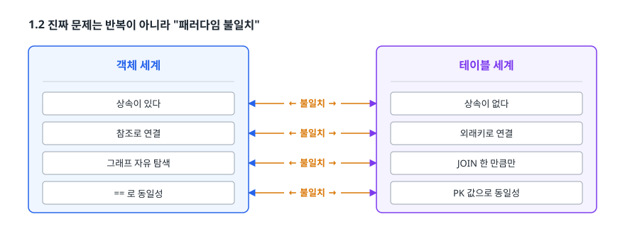
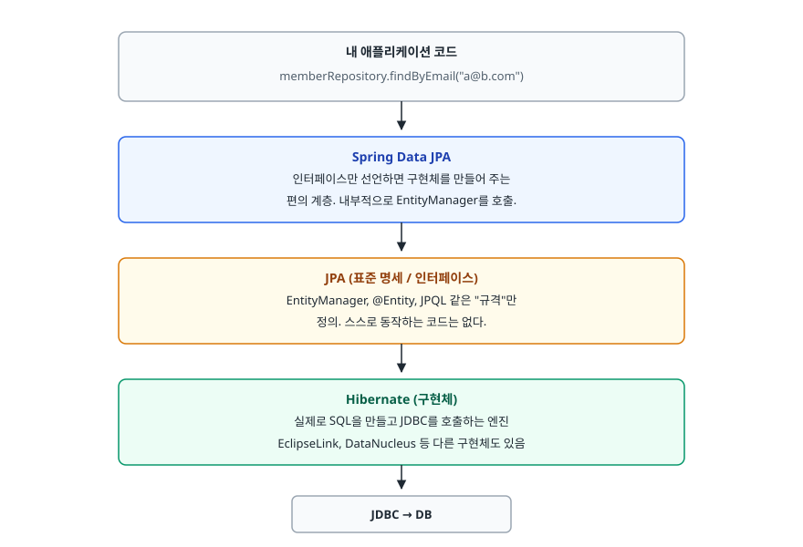
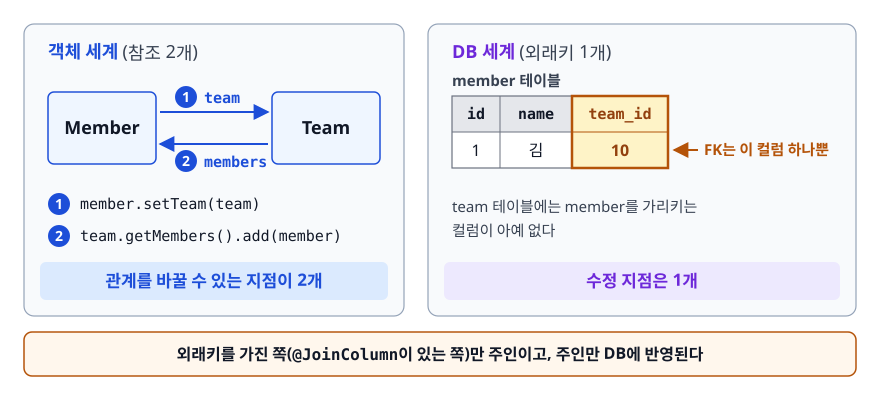

# JPA와 ORM (Java Persistence API & Object-Relational Mapping)

> 객체와 테이블은 원래 잘 맞지 않는다. ORM이 그 간격을 어떻게 메우는지, 그리고 그 대가로 무엇을 감수해야 하는지 설명할 수 있게 된다.

## 학습 목표

- [ ] 객체-관계 패러다임 불일치가 무엇인지 네 가지 관점으로 설명할 수 있다
- [ ] JPA, Hibernate, Spring Data JPA가 각각 무엇이고 어떤 계층에 있는지 구분할 수 있다
- [ ] 양방향 연관관계에서 연관관계 주인이 필요한 이유를 DB 구조로 설명할 수 있다
- [ ] JPQL, QueryDSL, 네이티브 쿼리를 상황에 맞게 선택할 수 있다

## 선행 지식

- SQL의 `SELECT`, `JOIN`, 외래키 개념
- Java 클래스와 상속, 컬렉션(`List`, `Set`)

---

## 1. 왜 필요한가

### 1.1 JDBC만 쓰던 시절의 코드

회원 한 명을 조회하는 코드다.

```java
String sql = "select id, name, email, team_id from member where id = ?";
try (PreparedStatement ps = conn.prepareStatement(sql)) {
    ps.setLong(1, memberId);
    ResultSet rs = ps.executeQuery();
    if (!rs.next()) return null;

    Member member = new Member();
    member.setId(rs.getLong("id"));
    member.setName(rs.getString("name"));
    member.setEmail(rs.getString("email"));
    // team까지 필요하면 team_id로 쿼리를 한 번 더 날리고, 또 변환하고...
    return member;
}
```

문제는 코드가 길다는 게 아니다. **컬럼을 하나 추가할 때마다 SQL 문자열, `rs.getXxx` 호출, setter 호출 세 군데를 동시에 고쳐야 한다**는 점이다. 한 군데를 빼먹으면 컴파일은 통과하고 런타임에 값이 `null`로 들어온다. 실무에서 이 반복 작업이 전체 백엔드 코드의 상당 부분을 차지했다.

### 1.2 진짜 문제는 반복이 아니라 "패러다임 불일치"

객체지향과 관계형 모델은 각자 다른 목적으로 설계됐다. 그래서 구조적으로 어긋나는 지점이 있다. 이걸 **패러다임 불일치(Paradigm Mismatch)** 라고 부른다.

<!-- diagram:be-jpa-orm-1 -->


<!-- 위 그림이 대체한 원본 ASCII.
     내용을 고칠 때는 그림도 함께 갱신할 것.
```
   객체 세계                          테이블 세계
┌──────────────────┐              ┌──────────────────┐
│ 상속이 있다      │  ← 불일치 →  │ 상속이 없다      │
│ 참조로 연결      │  ← 불일치 →  │ 외래키로 연결    │
│ 그래프 자유 탐색 │  ← 불일치 →  │ JOIN 한 만큼만   │
│ == 로 동일성     │  ← 불일치 →  │ PK 값으로 동일성 │
└──────────────────┘              └──────────────────┘
```
-->

**상속** — 자바에서는 `Item`을 상속한 `Book`, `Album`을 자연스럽게 만든다. 테이블에는 상속이 없어서 개발자가 직접 "부모/자식 테이블로 쪼갤지, 한 테이블에 다 넣고 구분 컬럼을 둘지"를 정하고 그에 맞는 SQL을 손으로 짜야 했다.

**연관관계** — 객체는 `member.getTeam()`처럼 **참조를 따라간다**. 테이블은 `member.team_id`라는 **값을 들고 JOIN을 한다**. 방향도 다르다. 객체 참조는 단방향이지만(Member가 Team을 알아도 Team은 Member를 모를 수 있다), 외래키는 JOIN을 어느 쪽에서든 걸 수 있어 사실상 양방향이다.

**객체 그래프 탐색** — `member.getTeam().getLeader().getName()`이 동작하려면 세 테이블을 미리 JOIN해 왔어야 한다. 하지만 조회 메서드를 호출한 쪽은 어디까지 JOIN해 왔는지 알 수 없다. 결국 "이 메서드가 반환한 객체는 team까지만 채워져 있음" 같은 주석에 의존하게 된다.

**동일성** — 같은 회원을 두 번 조회하면 JDBC는 서로 다른 `Member` 인스턴스 두 개를 만든다. `m1 == m2`는 `false`다. 객체 입장에서는 같은 회원인데 다른 객체다.

### 1.3 그래서 ORM

ORM(Object-Relational Mapping)은 이 불일치를 프레임워크가 대신 처리해주는 기술이다. 개발자는 "이 클래스가 이 테이블"이라고 **매핑 정보만 선언**하고, SQL 생성과 결과 변환은 ORM에게 맡긴다.

> **비유** — ORM은 서로 다른 언어를 쓰는 두 사람 사이의 통역사다. 개발자는 객체 언어로 말하고, ORM이 그걸 SQL로 옮겨 DB에게 전달한다.
>
> **비유의 한계** — 통역사는 들은 문장을 그대로 옮기지만, ORM은 **SQL을 스스로 만들어낸다**. 어떤 SQL이 나가는지 모르면 의도치 않게 쿼리가 수백 번 나갈 수 있다. ORM을 쓴다고 SQL을 몰라도 되는 게 아니라, 오히려 "내 코드가 어떤 SQL을 만드는가"를 읽을 줄 알아야 한다.

---

## 2. JPA, Hibernate, Spring Data JPA는 각각 무엇인가

이름이 비슷해서 헷갈리지만 세 개는 층이 다르다.

<!-- diagram:be-jpa-orm-2 -->


<!-- 위 그림이 대체한 원본 ASCII.
     내용을 고칠 때는 그림도 함께 갱신할 것.
```
┌────────────────────────────────────────────────┐
│  내 애플리케이션 코드                          │
│  memberRepository.findByEmail("a@b.com")       │
└───────────────────┬────────────────────────────┘
                    ↓
┌────────────────────────────────────────────────┐
│  Spring Data JPA                               │
│  인터페이스만 선언하면 구현체를 만들어 주는     │
│  편의 계층. 내부적으로 EntityManager를 호출.    │
└───────────────────┬────────────────────────────┘
                    ↓
┌────────────────────────────────────────────────┐
│  JPA (표준 명세 / 인터페이스)                   │
│  EntityManager, @Entity, JPQL 같은 "규격"만     │
│  정의. 스스로 동작하는 코드는 없다.             │
└───────────────────┬────────────────────────────┘
                    ↓
┌────────────────────────────────────────────────┐
│  Hibernate (구현체)                             │
│  실제로 SQL을 만들고 JDBC를 호출하는 엔진       │
│  EclipseLink, DataNucleus 등 다른 구현체도 있음 │
└───────────────────┬────────────────────────────┘
                    ↓
                  JDBC → DB
```
-->

| 이름 | 정체 | 없으면 어떻게 되나 |
|------|------|-------------------|
| JPA | 자바 진영의 ORM **표준 인터페이스** | 구현체마다 API가 달라져 갈아탈 수 없다 |
| Hibernate | JPA를 실제로 구현한 **엔진** | JPA 인터페이스만으로는 아무것도 실행되지 않는다 |
| Spring Data JPA | Repository 인터페이스를 자동 구현해 주는 **편의 계층** | `EntityManager`를 직접 다루며 CRUD 보일러플레이트를 손으로 짜야 한다 |

면접에서는 이렇게 한 줄로 정리하면 된다. **"JPA는 규격, Hibernate는 그 규격의 구현, Spring Data JPA는 Hibernate 위에 얹은 생산성 도구."**

---

## 3. 엔티티 매핑

### 3.1 기본 매핑

```java
@Entity
@Table(name = "member")
public class Member {

    @Id
    @GeneratedValue(strategy = GenerationType.IDENTITY)
    private Long id;

    @Column(name = "name", nullable = false, length = 20)
    private String name;

    @Column(unique = true)
    private String email;

    @Enumerated(EnumType.STRING)   // ORDINAL은 쓰지 말 것 (아래 설명)
    private MemberStatus status;

    protected Member() {}          // JPA는 기본 생성자를 요구한다
}
```

`@Enumerated`의 기본값은 `EnumType.ORDINAL`이고, 이건 enum의 **순서 번호(0, 1, 2...)** 를 DB에 저장한다. enum 중간에 상수를 하나 추가하면 이미 저장된 데이터의 의미가 통째로 바뀐다. 그래서 실무에서는 예외 없이 `EnumType.STRING`을 쓴다.

기본 생성자가 필요한 이유는 Hibernate가 리플렉션으로 객체를 만들기 때문이다. `public`일 필요는 없어서 `protected`로 막아 두면 외부에서 빈 객체를 만드는 걸 방지할 수 있다.

### 3.2 기본키 생성 전략

| 전략 | 동작 | 주로 쓰는 DB |
|------|------|-------------|
| `IDENTITY` | DB의 auto increment에 위임 | MySQL, MariaDB |
| `SEQUENCE` | DB 시퀀스 객체에서 번호를 받아옴 | PostgreSQL, Oracle, H2 |
| `TABLE` | 키 전용 테이블을 만들어 번호 관리 | 모든 DB (성능상 잘 안 씀) |
| `AUTO` | 방언(Dialect)에 따라 위 중 하나를 자동 선택 | 프로토타입 단계 |

`IDENTITY`에는 성능상 중요한 특징이 하나 있다. **ID를 DB가 정해주기 때문에, `persist()` 시점에 INSERT를 즉시 실행해야 한다.** 영속성 컨텍스트가 엔티티를 관리하려면 식별자가 반드시 필요한데, INSERT를 하기 전에는 식별자를 알 방법이 없기 때문이다. 그래서 `IDENTITY`에서는 쓰기 지연이 사실상 동작하지 않는다. 자세한 건 [영속성 컨텍스트](./02-persistence-context.md) 문서에서 다룬다.

---

## 4. 연관관계 매핑

### 4.1 단방향부터

"회원은 하나의 팀에 속한다"를 매핑해 보자. 테이블에서는 `member.team_id`가 외래키다.

```java
@Entity
public class Member {
    @Id @GeneratedValue
    private Long id;

    @ManyToOne(fetch = FetchType.LAZY)   // 다(Member) 대 일(Team)
    @JoinColumn(name = "team_id")        // 이 필드가 team_id 컬럼과 매핑
    private Team team;
}
```

`@ManyToOne`의 기본 fetch 전략은 `EAGER`다. 즉시 로딩은 예측 불가능한 JOIN과 N+1을 만들기 때문에, **`@ManyToOne`과 `@OneToOne`에는 명시적으로 `LAZY`를 적어주는 것이 실무 표준**이다. (`@OneToMany`, `@ManyToMany`의 기본값은 이미 `LAZY`다.)

### 4.2 양방향과 연관관계 주인

"팀에서 소속 회원 목록도 보고 싶다"면 반대 방향 참조를 추가한다.

```java
@Entity
public class Team {
    @Id @GeneratedValue
    private Long id;

    @OneToMany(mappedBy = "team")        // "나는 주인이 아니다"
    private List<Member> members = new ArrayList<>();
}
```

여기서 초심자가 반드시 걸리는 지점이 나온다. **왜 한쪽에만 `mappedBy`를 붙여야 하나?**

<!-- diagram:be-jpa-orm-3 -->


<!-- 위 그림이 대체한 원본 ASCII.
     내용을 고칠 때는 그림도 함께 갱신할 것.
```
객체 세계 (참조 2개)                  DB 세계 (외래키 1개)

┌──────────┐   team    ┌──────────┐   member 테이블
│  Member  │ ────────▶ │   Team   │   ┌────┬──────┬─────────┐
│          │ ◀──────── │          │   │ id │ name │ team_id │
└──────────┘  members  └──────────┘   ├────┼──────┼─────────┤
                                      │  1 │ 김   │   10    │ ← FK는 이 컬럼 하나뿐
관계를 바꿀 수 있는 지점이 2개         └────┴──────┴─────────┘

                                      team 테이블에는 member를 가리키는
                                      컬럼이 아예 없다. 수정 지점은 1개.
```
-->

객체에서는 `member.setTeam(team)`으로도, `team.getMembers().add(member)`로도 관계를 바꿀 수 있다. 그런데 DB에 반영해야 할 값은 `member.team_id` 딱 하나다. **둘 중 어느 쪽을 보고 `team_id`를 정할 것인가?** JPA는 이 모호함을 규칙으로 잘라냈다. **외래키를 실제로 가진 쪽(= `@JoinColumn`이 있는 쪽)만 주인이고, 주인만 DB에 반영된다.** `mappedBy`는 "나는 주인이 아니고, 저쪽의 이 필드가 주인이다"라는 선언이다.

### 4.3 안티패턴: 주인이 아닌 쪽만 세팅하기

```java
// 안티패턴
Team team = new Team("개발팀");
em.persist(team);

Member member = new Member("김개발");
team.getMembers().add(member);   // 주인이 아닌 쪽만 건드림
em.persist(member);
```

**왜 문제인가.** 커밋 후 DB를 열어 보면 `member.team_id`가 `NULL`이다. `Team.members`는 `mappedBy`가 붙은 읽기 전용 필드라 Hibernate가 아예 쳐다보지 않는다. 더 나쁜 건, 같은 트랜잭션 안에서는 `team.getMembers()`가 방금 add한 member를 그대로 돌려주기 때문에 **테스트가 통과해버린다**는 점이다. 트랜잭션이 끝나고 새로 조회했을 때야 데이터가 사라진 걸 발견한다.

```java
// 개선: 주인 쪽을 세팅하되, 양쪽을 함께 맞추는 편의 메서드를 둔다
@Entity
public class Member {

    @ManyToOne(fetch = FetchType.LAZY)
    @JoinColumn(name = "team_id")
    private Team team;

    public void changeTeam(Team team) {
        if (this.team != null) {              // 기존 팀에서 먼저 빼고
            this.team.getMembers().remove(this);
        }
        this.team = team;                     // 주인 세팅 → DB에 반영됨
        team.getMembers().add(this);          // 반대편 동기화 → 메모리 정합성
    }
}

// 사용
member.changeTeam(team);
```

주인 세팅만으로 DB는 정확해지지만, 같은 트랜잭션 안에서 `team.getMembers()`를 읽으면 방금 추가한 회원이 안 보인다(1차 캐시에 있는 Team 객체의 컬렉션은 갱신되지 않으므로). 그래서 **양쪽을 함께 맞춰주는 편의 메서드**를 두는 것이 관례다.

### 4.4 cascade와 orphanRemoval은 신중하게

```java
@OneToMany(mappedBy = "order", cascade = CascadeType.ALL, orphanRemoval = true)
private List<OrderItem> orderItems = new ArrayList<>();
```

`cascade`는 부모의 영속화/삭제를 자식에게 전파하고, `orphanRemoval`은 컬렉션에서 빠진 자식을 DELETE한다. 편해 보이지만 **부모가 자식의 생명주기를 단독으로 소유할 때만** 써야 한다. `Order`와 `OrderItem`처럼 주문이 사라지면 주문 항목도 의미가 없는 관계는 적합하다. 반대로 `Team`과 `Member`에 걸면, 팀 하나를 지웠을 때 회원이 통째로 삭제된다. 회원은 팀과 무관하게 존재해야 하는 데이터인데도.

---

## 5. JPQL, QueryDSL, 네이티브 쿼리 중 무엇을 쓸까

Spring Data JPA의 메서드 이름 기반 쿼리(`findByEmailAndStatus`)는 조건이 두세 개까지는 훌륭하다. 그 이상으로 가면 메서드 이름이 문장이 되고, 동적 조건은 아예 표현할 수 없다. 그때부터 아래 세 가지를 고민하게 된다.

### JPQL — 엔티티를 대상으로 하는 객체 지향 쿼리

```java
@Query("select m from Member m where m.age > :age and m.team.name = :teamName")
List<Member> findAdults(@Param("age") int age, @Param("teamName") String teamName);
```

테이블이 아니라 **엔티티와 필드 이름**으로 쓴다. Hibernate가 이걸 실제 SQL로 번역한다. 다만 문자열이라서 오타는 컴파일 시점에 잡히지 않고, 애플리케이션이 뜰 때(혹은 실행 시점에) 터진다.

### QueryDSL — 자바 코드로 쓰는 쿼리

```java
public List<Member> search(String name, Integer minAge) {
    QMember m = QMember.member;
    return queryFactory
            .selectFrom(m)
            .where(nameEq(m, name), ageGoe(m, minAge))   // null이면 조건에서 제외됨
            .fetch();
}

private BooleanExpression nameEq(QMember m, String name) {
    return name != null ? m.name.eq(name) : null;
}

private BooleanExpression ageGoe(QMember m, Integer minAge) {
    return minAge != null ? m.age.goe(minAge) : null;
}
```

`where()`에 `null`을 넘기면 그 조건은 무시된다. 이 특성 덕분에 **동적 쿼리를 if문 없이** 쓸 수 있다. 필드 이름이 `QMember` 클래스의 필드로 존재하므로 오타는 컴파일 에러다. 대신 빌드 설정으로 Q 타입 생성(annotation processor)을 붙여야 하고, 엔티티를 바꾸면 Q 타입을 다시 생성해야 한다.

### 네이티브 쿼리 — SQL 그대로

```java
@Query(value = "select * from member m "
             + "where match(m.bio) against (:keyword in boolean mode)",
       nativeQuery = true)
List<Member> searchByBio(@Param("keyword") String keyword);
```

DB 고유 기능(윈도우 함수의 일부 문법, 풀텍스트 검색, 힌트, 벤더 전용 함수)은 JPQL로 표현할 수 없다. 이럴 때만 내려간다.

### 선택 기준

| 기준 | JPQL | QueryDSL | 네이티브 쿼리 |
|------|------|----------|--------------|
| 오타 검출 시점 | 실행/기동 시점 | 컴파일 시점 | 실행 시점 |
| 동적 조건 | 문자열 조립 필요, 지저분함 | 가장 깔끔함 | 매우 어려움 |
| DB 독립성 | 있음 | 있음 | 없음 |
| 추가 빌드 설정 | 불필요 | 필요(Q 타입 생성) | 불필요 |
| DB 전용 기능 | 불가 | 제한적 | 자유롭게 가능 |
| 그래서 언제 | 조건이 고정된 정적 쿼리 | 검색 필터처럼 조건이 변하는 쿼리 | JPQL로 표현 불가능한 SQL |

기본은 JPQL, 동적 조건이 생기면 QueryDSL, 두 방법 모두로 표현이 안 될 때만 네이티브 쿼리. 이 순서로 내려가면 된다.

---

## 6. 실무에서는

**MyBatis와의 공존.** 국내 SI/금융권에서는 SQL을 직접 통제하려는 요구가 강해 MyBatis 비중이 여전히 높다. 두 개를 섞어 쓰는 프로젝트도 흔한데, 이때 **JPA와 MyBatis가 같은 트랜잭션 안에서 같은 테이블을 건드리면 위험하다.** MyBatis가 날린 UPDATE는 JPA의 1차 캐시를 모르기 때문에, JPA가 들고 있는 엔티티 값과 DB 값이 어긋난다. 읽기는 MyBatis, 쓰기는 JPA처럼 역할을 나누는 편이 안전하다.

**SQL 로그는 무조건 켠다.** ORM을 쓰는 개발자의 첫 번째 의무는 자기 코드가 만든 SQL을 보는 것이다.

```yaml
spring:
  jpa:
    properties:
      hibernate:
        format_sql: true
logging:
  level:
    org.hibernate.SQL: debug
```

**조회 전용 API는 엔티티를 반환하지 않는다.** 목록 화면처럼 읽기만 하는 API는 DTO로 직접 조회하는 편이 낫다. 필요한 컬럼만 SELECT하므로 네트워크와 메모리를 아끼고, 엔티티를 컨트롤러 밖으로 내보내지 않아 지연 로딩 사고도 막을 수 있다.

---

## 7. 면접 포인트

> 면접에서 이 주제가 나오면 이렇게 답한다

**Q. JPA와 Hibernate의 차이가 뭔가요?**

A. JPA는 자바의 ORM 표준 명세, 즉 인터페이스 모음입니다. 실제로 SQL을 만들고 실행하는 코드는 없습니다. Hibernate는 그 명세를 구현한 엔진 중 가장 널리 쓰이는 구현체입니다. 표준에 맞춰 개발하면 구현체를 교체할 수 있다는 게 JPA를 쓰는 이유 중 하나입니다.
- 꼬리 질문: "그럼 Spring Data JPA는요?" → JPA 위에 얹힌 편의 계층이고, Repository 인터페이스만 선언하면 구현체를 런타임에 만들어 준다. 내부적으로는 결국 `EntityManager`를 호출한다고 답한다.

**Q. 양방향 연관관계에서 연관관계 주인이 왜 필요한가요?**

A. 객체는 양쪽에서 관계를 수정할 수 있지만 DB에는 외래키 컬럼이 하나뿐이라, 어느 쪽 변경을 기준으로 외래키를 갱신할지 정해야 합니다. JPA는 외래키를 실제로 가진 쪽을 주인으로 삼고, 반대편은 `mappedBy`를 붙여 읽기 전용으로 만듭니다. 주인이 아닌 쪽만 수정하면 DB에는 아무 변화가 없습니다.
- 꼬리 질문: "그럼 반대편 컬렉션은 왜 관리하나요?" → 같은 트랜잭션 안에서 객체 그래프의 정합성을 유지하기 위해서다. 그래서 편의 메서드로 양쪽을 함께 세팅한다.

**Q. ORM의 단점은 무엇이라고 생각하나요?**

A. 개발자가 SQL을 직접 쓰지 않기 때문에 어떤 쿼리가 나가는지 놓치기 쉽다는 점입니다. 대표적인 게 N+1 문제이고, 통계성 쿼리나 대량 배치처럼 SQL 튜닝이 필요한 영역에서는 오히려 제약이 됩니다. 그래서 SQL 로그를 항상 확인하고, 필요한 곳에서는 QueryDSL이나 네이티브 쿼리로 내려가는 판단이 필요합니다.
- 꼬리 질문: "N+1이 뭔가요?" → [N+1 문제](./03-n-plus-one-problem.md) 문서 내용으로 이어간다.

---

## 자주 하는 실수

| 실수 | 왜 틀렸나 | 올바른 이해 |
|------|----------|-----------|
| `@ManyToOne`을 기본값 그대로 둔다 | 기본값이 `EAGER`라 의도치 않은 JOIN과 N+1이 생긴다 | ToOne 관계에는 명시적으로 `LAZY`를 지정한다 |
| `team.getMembers().add(member)`만 하고 저장한다 | 주인이 아닌 쪽이라 외래키가 갱신되지 않는다 | 주인(`member.setTeam`)을 세팅하고 편의 메서드로 양쪽을 맞춘다 |
| `@Enumerated`를 기본값으로 쓴다 | 기본값 `ORDINAL`은 enum 순서를 저장해서, 상수를 중간에 넣으면 기존 데이터 의미가 바뀐다 | 항상 `EnumType.STRING` |
| 모든 연관관계에 `cascade = ALL`을 건다 | 부모 삭제가 무관한 자식까지 지운다 | 부모가 자식의 생명주기를 단독 소유할 때만 사용 |
| `@ManyToMany`로 다대다를 매핑한다 | 중간 테이블에 컬럼(수량, 등록일 등)을 추가할 수 없고 생성되는 SQL을 통제하기 어렵다 | 중간 엔티티를 만들어 `@ManyToOne` 두 개로 푼다 |

---

## 한 줄 정리

ORM은 객체와 테이블의 구조적 불일치를 매핑 정보로 메워 주는 기술이고, JPA는 그 표준, Hibernate는 구현체, Spring Data JPA는 생산성 계층이다. 편해지는 만큼 "내 코드가 만든 SQL"을 읽는 책임이 생긴다.

---

## 연관 개념

- [영속성 컨텍스트](./02-persistence-context.md) - JPA가 엔티티를 관리하는 메커니즘
- [N+1 문제](./03-n-plus-one-problem.md) - 연관관계 매핑이 만드는 대표적 성능 함정
- [인덱싱과 B-Tree](./05-indexing-btree.md) - ORM이 만든 쿼리가 느릴 때 확인할 것
- [qna-database.md](./qna-database.md) - 데이터베이스/JPA 면접 질문 모음
- [qna-spring.md](../spring-framework/qna-spring.md) - `@Transactional`과 Spring 계층 구조 질문
