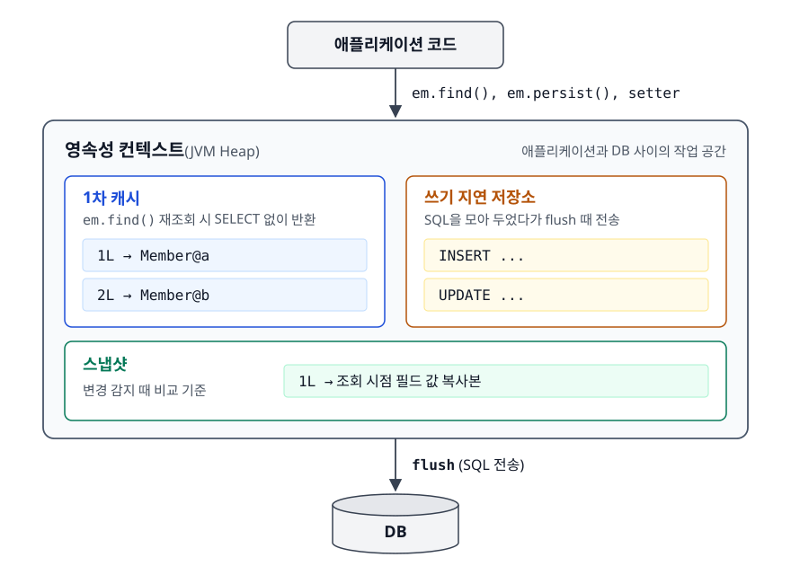
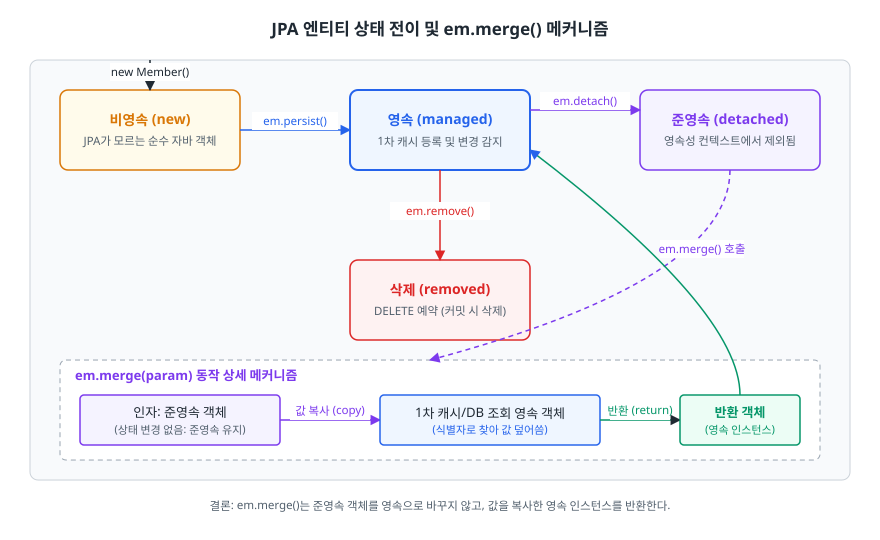
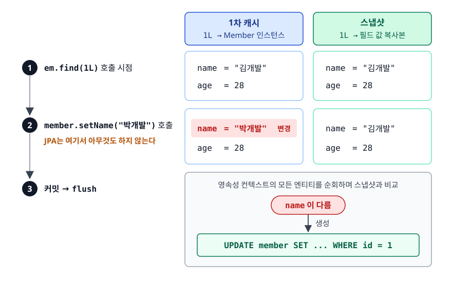
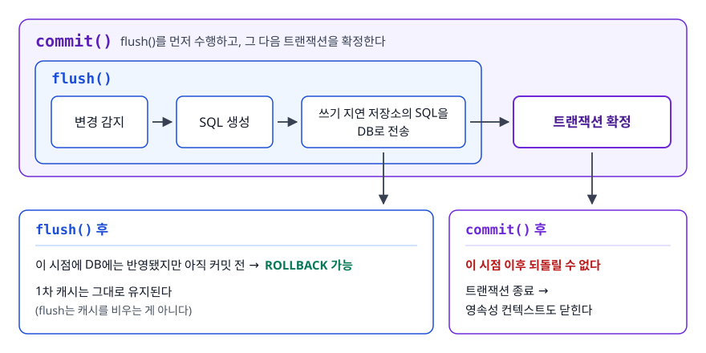
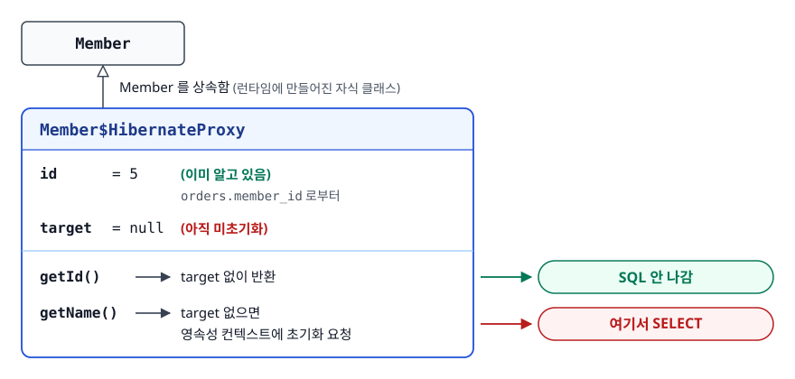
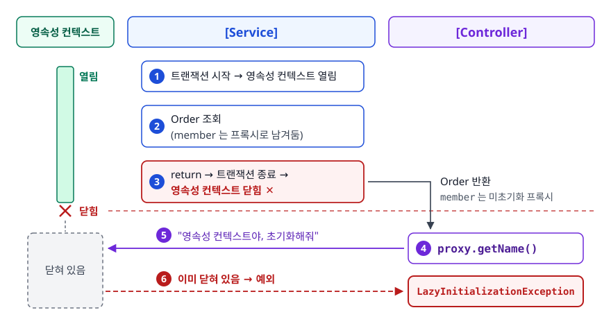

# 영속성 컨텍스트 (Persistence Context)

> `em.update()`는 없는데 왜 값을 바꾸기만 해도 저장될까요? 트랜잭션이 끝난 엔티티를 건드리면 왜 예외가 터질까요? 이 두 질문을 하나의 원리로 설명합니다.

## 학습 목표

- [ ] 영속성 컨텍스트가 어떤 문제를 풀기 위해 존재하는지 설명할 수 있다
- [ ] 엔티티의 네 가지 상태와 상태를 바꾸는 연산을 구분할 수 있다
- [ ] 1차 캐시, 동일성 보장, 쓰기 지연, 변경 감지, 지연 로딩이 각각 어떻게 동작하는지 설명할 수 있다
- [ ] flush와 commit의 차이를 정확히 말할 수 있다
- [ ] `LazyInitializationException`의 원인을 진단하고 올바른 해결책을 고를 수 있다

## 선행 지식

- [JPA와 ORM](./01-jpa-orm.md) - 엔티티 매핑과 연관관계

---

## 1. 왜 필요한가

JDBC로 짜면 이런 코드가 나옵니다.

```java
Member m1 = memberDao.findById(1L);   // SELECT 1회
Member m2 = memberDao.findById(1L);   // SELECT 또 1회 (같은 데이터인데)

m1.setName("변경");
memberDao.update(m1);                 // UPDATE 1회

m1 == m2;                             // false — 서로 다른 인스턴스
```

문제는 이렇습니다. **같은 데이터를 여러 번 읽으면 그때마다 DB에 갑니다.** **같은 회원인데 객체가 여러 개라 어느 게 최신인지 알 수 없습니다.** 게다가 **어디서 값을 바꿨는지 추적하려면 `update()` 호출을 개발자가 빠짐없이 챙겨야 합니다.**

JPA는 이걸 **애플리케이션과 DB 사이에 "작업 공간"을 하나 두는 방식**으로 해결합니다. 그 공간이 영속성 컨텍스트입니다.

<!-- diagram:be-persistence-context-1 -->


<!-- 위 그림이 대체한 원본 ASCII.
     내용을 고칠 때는 그림도 함께 갱신할 것.
```
  애플리케이션 코드
        │
        │  em.find(), em.persist(), setter
        ▼
┌───────────────────────────────────────────┐
│         영속성 컨텍스트 (JVM Heap)        │
│                                           │
│  1차 캐시             쓰기 지연 저장소    │
│  ┌───────────────┐   ┌─────────────────┐  │
│  │ 1L → Member@a │   │ INSERT ...      │  │
│  │ 2L → Member@b │   │ UPDATE ...      │  │
│  └───────────────┘   └─────────────────┘  │
│  스냅샷                                   │
│  ┌───────────────────────────────┐        │
│  │ 1L → 조회 시점 필드 값 복사본 │        │
│  └───────────────────────────────┘        │
└───────────────────┬───────────────────────┘
                    │  flush (SQL 전송)
                    ▼
                  [ DB ]
```
-->

> **비유**: 도서관에서 책을 빌려와 앉는 **개인 열람석**입니다. 한 번 가져온 책은 자리에 두면 되니 다시 서고까지 갈 필요가 없습니다(1차 캐시). 반납할 때는 한꺼번에 정리해 돌려주고(쓰기 지연), 책에 붙인 포스트잇은 반납 시점에 사서가 확인합니다(변경 감지).
>
> **비유의 한계**: 열람석은 내가 직접 정리합니다. 영속성 컨텍스트는 **커밋 시점에 자동으로** 정리합니다. "내가 저장 명령을 안 내렸으니 안 저장되겠지"라는 감각으로 코드를 짜면 의도치 않은 UPDATE가 나갑니다.

**중요한 전제 하나.** Spring 환경에서 영속성 컨텍스트의 생존 범위는 기본적으로 **트랜잭션과 같습니다.** `@Transactional`이 붙은 메서드가 시작할 때 만들어지고 끝날 때 닫힙니다. 이 문서의 거의 모든 동작에는 "트랜잭션 안에서"라는 조건이 붙습니다.

---

## 2. 엔티티의 네 가지 상태

<!-- diagram:be-persistence-context -->


<!-- 위 그림이 대체한 원본 ASCII.
     내용을 고칠 때는 그림도 함께 갱신할 것.
```
        new Member()
             │
             ▼
       ┌──────────┐
       │  비영속   │  JPA가 존재를 모름. 그냥 자바 객체.
       │ (new)    │
       └────┬─────┘
            │ em.persist()  /  em.find()로 조회된 것도 영속
            ▼
       ┌──────────┐  ─── em.detach(), em.clear(), em.close() ──▶ ┌──────────┐
       │   영속    │                                              │  준영속   │
       │(managed) │  ◀────────────── em.merge() ───────────────── │(detached)│
       └────┬─────┘                                              └──────────┘
            │ em.remove()
            ▼
       ┌──────────┐
       │   삭제    │  DELETE 예약 상태. 커밋 시 실제 삭제.
       │(removed) │
       └──────────┘
```
-->

| 상태 | 영속성 컨텍스트가 관리하나 | 변경 감지 | DB에 행이 있나 |
|------|:---:|:---:|:---:|
| 비영속(new) | X | X | X |
| 영속(managed) | O | O | 아직 없을 수도 있음(커밋 전) |
| 준영속(detached) | X | X | O |
| 삭제(removed) | O | - | 커밋 시 제거됨 |

```java
Member member = new Member("김개발");   // 비영속
em.persist(member);                     // 영속 — 1차 캐시 등록, 스냅샷 생성
em.detach(member);                      // 준영속 — 관리 대상에서 제외
member.setName("바꿔도 소용없음");        // 아무 일도 일어나지 않는다
```

상태 전이도에서 한 가지를 오해하기 쉽습니다. `em.merge()`는 **준영속 엔티티를 그 자리에서 영속으로 되돌리는 메서드가 아닙니다.** 같은 식별자의 영속 엔티티를 찾아(없으면 DB에서 조회해) 값을 복사한 뒤 **그 영속 인스턴스를 반환**합니다. 인자로 넘긴 객체는 여전히 준영속이므로 이후 작업은 반환값으로 이어가야 합니다.

준영속은 일부러 만드는 상태가 아니라 **자연스럽게 발생하는 상태**입니다. `@Transactional` 서비스 메서드가 엔티티를 반환하는 순간, (뒤에 나올 OSIV를 꺼 두었다면) 그 엔티티는 컨트롤러 입장에서 준영속입니다. 이게 `LazyInitializationException`의 무대입니다.

---

## 3. 1차 캐시와 동일성 보장

```java
@Transactional
public void sameInstance() {
    Member m1 = em.find(Member.class, 1L);   // SELECT 실행 → 1차 캐시에 저장
    Member m2 = em.find(Member.class, 1L);   // SELECT 없음 → 캐시에서 반환

    System.out.println(m1 == m2);            // true
}
```

같은 트랜잭션 안에서 같은 식별자로 조회하면 **항상 같은 인스턴스**가 나옵니다. 자바 컬렉션에서 같은 키로 꺼내면 같은 객체가 나오는 것과 같은 감각으로 엔티티를 다룰 수 있다는 뜻입니다.

주의할 점 두 가지입니다.

**1차 캐시는 트랜잭션 범위입니다.** 다른 트랜잭션, 다른 요청과 공유되지 않습니다. 여러 트랜잭션이 공유하는 캐시(정확히는 `EntityManagerFactory` 단위)는 2차 캐시입니다. 따로 켜야 하는 별개의 기능입니다. "1차 캐시 덕분에 DB 부하가 줄어든다"는 말은 **한 트랜잭션 안에서 같은 엔티티를 여러 번 조회할 때만** 유효합니다.

**JPQL은 1차 캐시를 거치지 않습니다.** `em.find()`는 캐시를 먼저 보지만 `select m from Member m where ...` 같은 JPQL은 무조건 DB로 SQL을 날립니다. 조건에 맞는 행이 무엇인지는 DB만 알기 때문입니다. 다만 결과를 영속성 컨텍스트에 넣을 때, **이미 같은 식별자의 엔티티가 캐시에 있으면 DB에서 읽은 값을 버리고 캐시의 인스턴스를 반환합니다.** 동일성을 깨뜨리지 않기 위한 규칙입니다.

---

## 4. 쓰기 지연

```java
@Transactional
public void writeBehind() {
    em.persist(new Member("A"));   // SQL 안 나감 (전략에 따라 다름, 아래 참고)
    em.persist(new Member("B"));   // SQL 안 나감
    em.persist(new Member("C"));   // SQL 안 나감
}   // 커밋 시점에 INSERT 3개를 한 번에 전송
```

SQL을 모아 뒀다가 flush 시점에 몰아서 보냅니다. 여기에 JDBC 배치(`hibernate.jdbc.batch_size`)까지 켜야 여러 INSERT를 한 번의 통신으로 묶어 네트워크 왕복을 줄일 수 있습니다.

**단, `GenerationType.IDENTITY`에서는 쓰기 지연이 동작하지 않습니다.** 영속성 컨텍스트는 엔티티를 식별자로 관리하는데, IDENTITY는 DB가 INSERT를 실행해야 식별자를 알려줍니다. 그래서 `persist()` 호출 즉시 INSERT가 나갑니다. MySQL을 쓰면서 "쓰기 지연 덕분에 성능이 좋다"고 말하면, 꼬리 질문에서 무너지기 쉽습니다.

---

## 5. 변경 감지 (Dirty Checking)

JPA에는 `em.update()`가 없습니다. 값만 바꾸면 커밋 시점에 UPDATE가 나갑니다.

```java
@Transactional
public void changeName(Long id, String newName) {
    Member member = memberRepository.findById(id).orElseThrow();
    member.setName(newName);
    // save() 호출 없음. 그런데 UPDATE가 나간다.
}
```

원리는 **스냅샷 비교**입니다.

<!-- diagram:be-persistence-context-2 -->


<!-- 위 그림이 대체한 원본 ASCII.
     내용을 고칠 때는 그림도 함께 갱신할 것.
```
[ em.find(1L) 호출 시점 ]
1차 캐시                        스냅샷
┌──────────────────────┐       ┌──────────────────────┐
│ 1L → Member 인스턴스  │       │ 1L → 필드 값 복사본  │
│      name = "김개발" │       │      name = "김개발" │
│      age  = 28       │       │      age  = 28       │
└──────────────────────┘       └──────────────────────┘

[ member.setName("박개발") 호출 ]  ← JPA는 여기서 아무것도 하지 않는다
┌──────────────────────┐       ┌──────────────────────┐
│      name = "박개발" │       │      name = "김개발" │
│      age  = 28       │       │      age  = 28       │
└──────────────────────┘       └──────────────────────┘

[ 커밋 → flush ]
  영속성 컨텍스트의 모든 엔티티를 순회하며 스냅샷과 비교
  name 이 다름 → UPDATE member SET ... WHERE id = 1  생성
```
-->

여기서 나오는 성질 세 가지를 기억해야 합니다.

**영속 상태에서만 동작합니다.** 준영속 엔티티는 스냅샷이 없으므로 아무리 setter를 호출해도 UPDATE가 나가지 않습니다.

**기본 UPDATE는 모든 컬럼을 포함합니다.** `name`만 바꿔도 SQL에는 전체 컬럼이 들어갑니다. SQL 모양이 항상 같아야 DB가 실행 계획을 재사용할 수 있고, JDBC 배치로도 묶기 쉽기 때문입니다. 컬럼이 아주 많고 변경 컬럼이 적은 테이블이라면 `@DynamicUpdate`로 바꾼 컬럼만 보낼 수 있습니다. 다만 매번 다른 SQL이 만들어지는 비용도 함께 생기므로, 기본값을 벗어날 근거가 있을 때만 씁니다.

**"조회했을 뿐인데 UPDATE가 나가는" 사고가 여기서 나옵니다.** 조회 메서드 안에서 엔티티 값을 잠깐 만졌다면(로깅용 필드 갱신, 방어 로직에서의 기본값 세팅 등) 그대로 DB에 반영됩니다. 읽기 전용 트랜잭션에는 `@Transactional(readOnly = true)`를 붙여 둡니다. Spring이 Hibernate 세션의 flush 모드를 `MANUAL`로 바꿔 커밋 시점의 flush 자체를 생략합니다. 그래서 실수로 값을 건드려도 UPDATE가 나가지 않습니다.

---

## 6. flush와 commit은 다르다

두 단어가 자주 섞여 쓰이지만 하는 일이 다릅니다.

<!-- diagram:be-persistence-context-3 -->


<!-- 위 그림이 대체한 원본 ASCII.
     내용을 고칠 때는 그림도 함께 갱신할 것.
```
flush()                              commit()
─────────────────────────────        ─────────────────────────────
변경 감지 → SQL 생성                 flush() 를 먼저 수행하고
쓰기 지연 저장소의 SQL을 DB로 전송   그 다음 트랜잭션을 확정한다

이 시점에 DB에는 반영됐지만          이 시점 이후 되돌릴 수 없다
아직 커밋 전 → ROLLBACK 가능

1차 캐시는 그대로 유지된다           트랜잭션 종료 →
(flush는 캐시를 비우는 게 아니다)    영속성 컨텍스트도 닫힌다
```
-->

| | flush | commit |
|---|---|---|
| 하는 일 | 쌓인 SQL을 DB로 전송(동기화) | 트랜잭션 확정 |
| 이후 롤백 | 가능 | 불가능 |
| 1차 캐시 | 유지됨 | 컨텍스트가 닫히며 사라짐 |
| 자동 발생 시점 | 커밋 직전, JPQL 실행 직전 | `@Transactional` 메서드 정상 종료 시 |

**JPQL 실행 직전에 flush가 자동으로 일어나는 이유**가 중요합니다.

```java
em.persist(new Member("신규회원"));                      // 아직 DB에 INSERT 전
List<Member> all = em.createQuery("select m from Member m", Member.class)
                     .getResultList();                   // ← 여기서 flush 발생
// flush가 없었다면 방금 persist한 회원이 결과에 빠졌을 것이다
```

JPQL은 DB에 SQL을 날려 결과를 받아옵니다. 메모리에만 있고 DB에는 없는 데이터는 조회되지 않습니다. 그래서 Hibernate는 쿼리를 실행하기 전에 먼저 flush해서 메모리와 DB를 맞춥니다. `FlushModeType.COMMIT`으로 바꾸면 이 자동 flush를 끌 수 있습니다. 하지만 위 상황에서 조회 결과가 누락되니 정확히 알고 써야 합니다.

---

## 7. 지연 로딩과 프록시

```java
Order order = em.find(Order.class, 1L);
// SELECT * FROM orders WHERE id = 1   ← member는 안 가져옴

Member member = order.getMember();
// SQL 없음. 프록시 객체만 반환.

String name = member.getName();
// SELECT * FROM member WHERE id = ?   ← 이 순간 초기화
```

프록시는 **엔티티를 상속해서 런타임에 만들어진 가짜 객체**입니다. 내부에 실제 객체 참조(`target`)를 들고 있는데, 처음에는 비어 있습니다. 식별자를 제외한 메서드를 호출하는 순간 영속성 컨텍스트에게 "초기화해 달라"고 요청합니다. 그때 SELECT가 실행됩니다.

<!-- diagram:be-persistence-context-4 -->


<!-- 위 그림이 대체한 원본 ASCII.
     내용을 고칠 때는 그림도 함께 갱신할 것.
```
┌─────────────────────────────────────┐
│  Member$HibernateProxy              │  ← Member 를 상속함
│    id      = 5      (이미 알고 있음)│     orders.member_id 로부터
│    target  = null   (아직 미초기화) │
│                                     │
│    getId()   → target 없이 반환     │  ← SQL 안 나감
│    getName() → target 없으면        │
│                영속성 컨텍스트에    │  ← 여기서 SELECT
│                초기화 요청          │
└─────────────────────────────────────┘
```
-->

`getId()`가 SQL을 부르지 않는 건 프록시를 만들 때 이미 외래키 값으로 식별자를 알고 있기 때문입니다. 그래서 "연관 엔티티의 ID만 필요한 경우"는 지연 로딩을 써도 추가 쿼리가 없습니다.

프록시는 원본 클래스가 아니라 **자식 클래스**이므로 타입 비교에 주의합니다.

```java
member.getClass() == Member.class   // false — 프록시 클래스다
member instanceof Member            // true  — 상속했으므로
```

---

## 8. LazyInitializationException

가장 자주 만나는 JPA 예외입니다. 원인은 한 줄로 정리됩니다. **영속성 컨텍스트가 닫힌 뒤에 초기화되지 않은 프록시를 건드렸습니다.**

```java
// Service
@Transactional
public Order findOrder(Long id) {
    return orderRepository.findById(id).orElseThrow();
}   // ← 여기서 트랜잭션 종료 = 영속성 컨텍스트 닫힘

// Controller
public String detail(Long id) {
    Order order = orderService.findOrder(id);   // order.member 는 미초기화 프록시
    return order.getMember().getName();          // LazyInitializationException
}
```

<!-- diagram:be-persistence-context-5 -->


<!-- 위 그림이 대체한 원본 ASCII.
     내용을 고칠 때는 그림도 함께 갱신할 것.
```
[Service]  트랜잭션 시작 → 영속성 컨텍스트 열림
              │
              ├─ Order 조회 (member 는 프록시로 남겨둠)
              │
           return → 트랜잭션 종료 → 영속성 컨텍스트 닫힘 ✕
              │
[Controller]  │
              └─ proxy.getName()
                    │
                    └─ "영속성 컨텍스트야, 초기화해줘"
                          → 이미 닫혀 있음 → 예외
```
-->

### 해결책과 각각의 대가

**1) fetch join / `@EntityGraph`로 필요한 연관을 미리 가져온다 (권장)**

```java
@Query("select o from Order o join fetch o.member where o.id = :id")
Optional<Order> findWithMember(@Param("id") Long id);
```

애초에 프록시를 만들지 않으므로 예외가 발생할 여지가 없습니다. 다만 무엇을 함께 가져올지 쿼리마다 정해야 하고, 컬렉션을 여러 개 fetch join할 때는 별도의 제약이 있습니다. 이 부분은 [N+1 문제](./03-n-plus-one-problem.md) 문서에서 다룹니다.

**2) 트랜잭션 안에서 DTO로 변환해 반환한다 (실무 표준)**

```java
@Transactional(readOnly = true)
public OrderResponse findOrder(Long id) {
    Order order = orderRepository.findById(id).orElseThrow();
    return new OrderResponse(
            order.getId(),
            order.getMember().getName(),   // 트랜잭션 안이라 안전하게 초기화
            order.getTotalPrice()
    );
}
```

엔티티를 계층 밖으로 내보내지 않는다는 원칙만 지키면 이 예외는 구조적으로 발생하지 않습니다.

**3) 안티패턴: 컨트롤러에 `@Transactional`을 붙인다**

```java
// 안티패턴
@Transactional
@GetMapping("/orders/{id}")
public String detail(@PathVariable Long id, Model model) { ... }
```

**왜 문제인가.** 메서드 본문 안의 예외는 사라지지만, 트랜잭션이 컨트롤러 메서드 전체로 넓어집니다(메서드가 반환된 뒤의 뷰 렌더링·응답 직렬화는 여전히 트랜잭션 밖입니다). DB 커넥션을 그만큼 오래 붙잡으니 트래픽이 몰리면 커넥션 풀이 먼저 마릅니다. 게다가 프레젠테이션 계층이 트랜잭션 경계를 갖는 건 책임 분리가 깨지는 설계입니다. 위 2)번으로 해결하는 게 맞습니다.

**4) OSIV(Open Session In View)**

Spring Boot에는 `spring.jpa.open-in-view` 설정이 있고 기본값이 `true`입니다. 켜져 있으면 영속성 컨텍스트를 컨트롤러/뷰 구간까지 열어 두기 때문에 지연 로딩이 동작합니다. 애플리케이션을 기동하면 이 설정과 관련된 경고 로그가 출력됩니다. 그 이유가 바로 3)번과 같은 커넥션 점유 문제입니다. 트래픽이 많은 API 서버라면 `false`로 끄고, 지연 로딩은 서비스 계층 안에서 끝내는 구조가 안전합니다.

---

## 9. 실무에서는

**벌크 연산은 영속성 컨텍스트를 우회합니다.**

```java
@Modifying(clearAutomatically = true)
@Query("update Member m set m.point = m.point + :bonus where m.grade = :grade")
int addBonus(@Param("bonus") int bonus, @Param("grade") Grade grade);
```

이 UPDATE는 DB에 바로 실행되지만, 1차 캐시에 있는 엔티티들은 예전 값을 그대로 들고 있습니다. 이후 같은 트랜잭션에서 엔티티를 읽으면 **DB와 다른 값**을 보게 됩니다. `clearAutomatically = true`로 실행 후 컨텍스트를 비우거나, 벌크 연산을 트랜잭션의 마지막에 배치합니다.

**`readOnly = true`를 조회 메서드의 기본값으로 삼습니다.** flush가 생략되므로 의도치 않은 UPDATE를 원천 차단합니다. DB 이중화 환경에서는 읽기 전용 트랜잭션을 리플리카로 라우팅하는 근거로도 쓰입니다.

**`save()`를 호출해야 저장된다고 착각하지 않습니다.** Spring Data JPA의 `save()`는 새 엔티티면 `persist`, 그렇지 않으면 `merge`를 호출합니다. 이미 영속 상태인 엔티티라면 `merge`가 1차 캐시에서 같은 인스턴스를 찾아 그대로 돌려줍니다. 그래서 결국 아무 일도 일어나지 않습니다. 변경 감지가 이미 처리하고 있기 때문입니다. 조회한 엔티티를 수정한 뒤 `save()`를 호출하는 코드는 동작에는 문제가 없지만, 변경 감지를 이해하지 못한 신호로 읽힙니다.

---

## 10. 면접 포인트

> 면접에서 이 주제가 나오면 이렇게 답한다

**Q. 영속성 컨텍스트가 무엇이고 어떤 이점이 있나요?**

A. 엔티티를 관리하는 애플리케이션과 DB 사이의 중간 저장소입니다. 1차 캐시로 같은 트랜잭션 내 반복 조회를 줄이고, 같은 식별자로는 같은 인스턴스를 반환해 동일성을 보장합니다. SQL을 모아 커밋 시점에 보내는 쓰기 지연과, 스냅샷 비교로 UPDATE를 자동 생성하는 변경 감지도 여기서 나옵니다.
- 꼬리 질문: "생명주기가 어떻게 되나요?" → Spring에서는 기본적으로 트랜잭션과 동일합니다. 트랜잭션 시작 시 생성되고 종료 시 닫힙니다.

**Q. `em.update()`도 없는데 왜 UPDATE 쿼리가 나가나요?**

A. 영속성 컨텍스트가 엔티티를 조회할 때 필드 값을 스냅샷으로 복사해 둡니다. 커밋 시 flush가 일어나면서 현재 엔티티 값과 스냅샷을 비교하고, 달라진 필드가 있으면 UPDATE SQL을 만들어 전송합니다. 준영속 엔티티는 스냅샷이 없으므로 이 동작이 일어나지 않습니다.
- 꼬리 질문: "변경된 필드만 UPDATE하나요?" → 기본은 전체 컬럼입니다. SQL 모양을 고정하면 실행 계획 재사용과 배치 처리에 유리하기 때문입니다. 필요하면 `@DynamicUpdate`로 바꿀 수 있습니다.

**Q. flush와 commit의 차이는 무엇인가요?**

A. flush는 쌓아 둔 SQL을 DB로 보내 상태를 동기화하는 것이고, commit은 트랜잭션을 확정하는 것입니다. flush 이후에도 롤백이 가능하고 1차 캐시는 유지됩니다. commit은 내부적으로 flush를 먼저 수행한 뒤 트랜잭션을 끝냅니다. JPQL 실행 직전에도 자동 flush가 일어나는데, 아직 DB에 없는 변경분이 조회 결과에서 빠지는 걸 막기 위해서입니다.
- 꼬리 질문: "flush하면 1차 캐시가 비워지나요?" → 아닙니다. 비우는 건 `clear()`입니다.

**Q. `LazyInitializationException`은 왜 발생하고 어떻게 해결하나요?**

A. 트랜잭션이 끝나 영속성 컨텍스트가 닫힌 뒤 초기화되지 않은 프록시에 접근했기 때문입니다. 해결은 크게 두 갈래입니다. 필요한 연관을 fetch join이나 `@EntityGraph`로 미리 가져오거나, 트랜잭션 안에서 DTO로 변환해 반환합니다. 컨트롤러에 `@Transactional`을 붙이거나 OSIV에 의존하는 방식은 커넥션 점유 시간이 길어져 권장하지 않습니다.
- 꼬리 질문: "OSIV를 끄면 뭐가 달라지나요?" → 지연 로딩이 서비스 계층 밖에서 동작하지 않으므로 조회에 필요한 데이터를 트랜잭션 안에서 모두 확정해야 합니다.

---

## 자주 하는 실수

| 실수 | 왜 틀렸나 | 올바른 이해 |
|------|----------|-----------|
| 1차 캐시를 애플리케이션 캐시로 이해한다 | 트랜잭션 범위라 요청 간 공유되지 않는다 | 전역 캐시는 2차 캐시이며 별개 기능이다 |
| JPQL도 1차 캐시에서 조회된다고 생각한다 | 조건에 맞는 행은 DB만 알기에 항상 SQL이 나간다 | 결과를 캐시에 넣을 때 기존 인스턴스가 있으면 그쪽을 반환할 뿐이다 |
| 수정 후 `save()`를 호출해야 저장된다고 생각한다 | 영속 엔티티는 변경 감지로 이미 반영된다 | 조회-수정 흐름에서 `save()`는 불필요하다 |
| 준영속 엔티티의 setter가 반영될 거라 기대한다 | 스냅샷이 없어 변경 감지 대상이 아니다 | 트랜잭션 안에서 수정하거나 `merge`가 **반환한** 영속 인스턴스를 수정한다 |
| 벌크 UPDATE 후 같은 트랜잭션에서 엔티티를 읽는다 | 1차 캐시에는 옛날 값이 남아 있다 | `clearAutomatically`를 쓰거나 벌크 연산을 마지막에 둔다 |
| `Member`를 그대로 컨트롤러까지 반환한다 | 지연 로딩 예외와 응답 스펙 결합 문제가 동시에 생긴다 | 트랜잭션 안에서 DTO로 변환해 반환한다 |

---

## 한 줄 정리

영속성 컨텍스트는 트랜잭션 동안 엔티티를 붙잡아 두는 작업 공간입니다. 1차 캐시·동일성 보장·쓰기 지연·변경 감지·지연 로딩은 모두 "엔티티를 메모리에서 관리한다"는 하나의 전제에서 나온 결과입니다.

---

## 연관 개념

- [JPA와 ORM](./01-jpa-orm.md) - 엔티티 매핑과 연관관계 주인
- [N+1 문제](./03-n-plus-one-problem.md) - 지연 로딩이 만드는 대표적 성능 문제
- [트랜잭션과 격리 수준](./04-transaction-isolation.md) - 영속성 컨텍스트의 경계를 정하는 트랜잭션
- [qna-database.md](./qna-database.md) - 영속성 컨텍스트/프록시 면접 질문
- [qna-spring.md](../spring-framework/qna-spring.md) - `@Transactional` 프록시와 전파 속성
