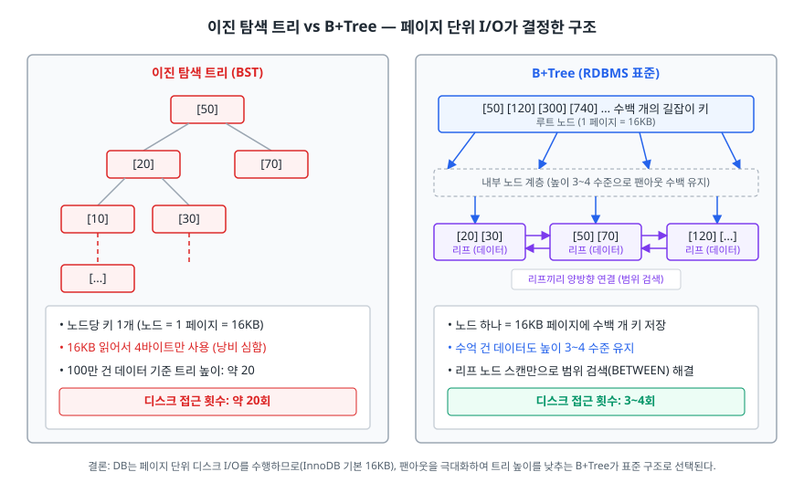
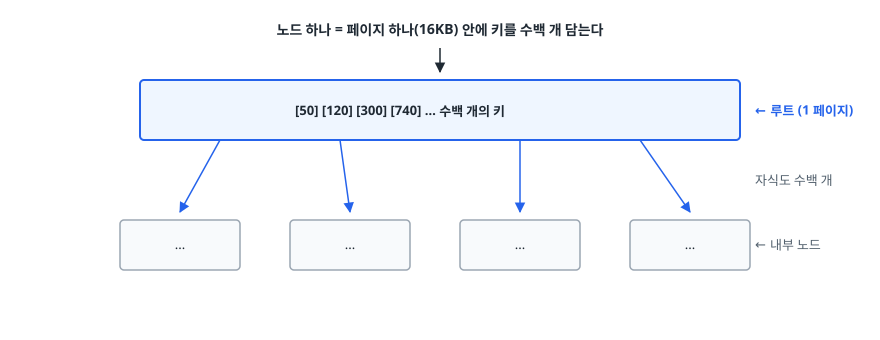
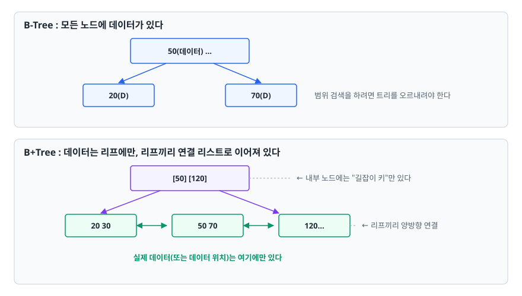
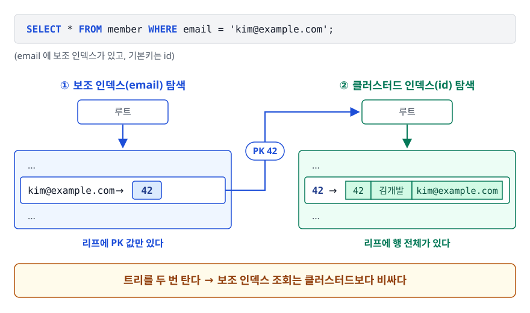
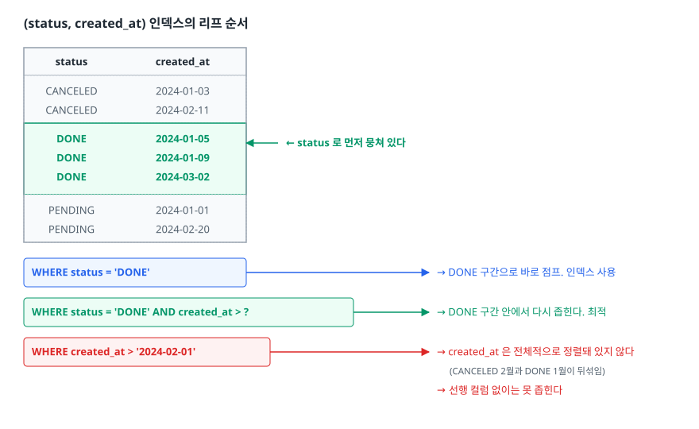
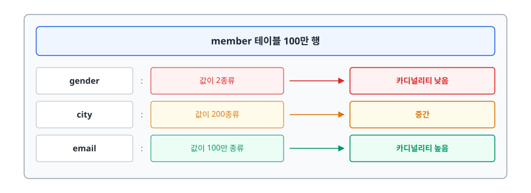

# 인덱싱과 B-Tree (Indexing & B-Tree)

> 인덱스의 모양은 디스크가 정합니다. 왜 하필 B-Tree인지를 디스크 관점에서 설명하고, 내가 쓴 쿼리가 인덱스를 타는지 `EXPLAIN`으로 확인하는 방법도 다룹니다.

## 학습 목표

- [ ] 인덱스 자료구조로 해시나 이진 탐색 트리가 아닌 B+Tree가 선택된 이유를 설명할 수 있다
- [ ] 클러스터드 인덱스와 논클러스터드 인덱스의 조회 경로 차이를 그릴 수 있다
- [ ] 복합 인덱스의 컬럼 순서를 근거를 갖고 정할 수 있다
- [ ] 인덱스를 타지 못하는 쿼리 패턴을 발견하고 고칠 수 있다
- [ ] `EXPLAIN` 결과에서 `type`과 `Extra`를 읽고 문제를 진단할 수 있다

## 선행 지식

- SQL의 `WHERE`, `ORDER BY`, `JOIN`
- 트리 자료구조의 기본 개념(노드, 높이, 탐색)

---

## 1. 왜 필요한가

인덱스가 없으면 DB는 조건에 맞는 행을 찾기 위해 **테이블의 모든 행을 처음부터 끝까지 읽습니다.** 이걸 풀 테이블 스캔(Full Table Scan)이라 합니다. 행이 100만 개면 100만 번 비교합니다.

```sql
SELECT * FROM member WHERE email = 'kim@example.com';
```

문제는 비교 횟수가 아니라 **디스크에서 데이터를 읽어오는 비용**입니다. CPU가 값을 비교하는 시간은 나노초 단위지만, 디스크에서 데이터를 가져오는 건 그보다 몇 자릿수 느립니다. 100만 행이 디스크 위 수만 개 블록에 흩어져 있다면, 그 블록을 전부 메모리로 올리는 시간이 쿼리 시간의 거의 전부를 차지합니다.

**인덱스는 "정렬된 사본"을 따로 만들어 두는 기술입니다.** 정렬돼 있으면 전부 읽지 않고 이분 탐색처럼 좁혀 들어갈 수 있습니다.

> **비유**: 500쪽짜리 전공서에서 "가상 메모리"를 찾을 때 1쪽부터 넘기는 대신 책 뒤 색인을 보는 것과 같습니다. 색인은 가나다순으로 정렬돼 있어 금방 찾고, 거기 적힌 쪽 번호로 바로 이동합니다.
>
> **비유의 한계**: 책 색인은 한 번 만들면 그대로입니다. DB 인덱스는 **INSERT/UPDATE/DELETE가 일어날 때마다 함께 갱신**됩니다. 색인을 10개 만든 책은 새 문장을 추가할 때마다 색인 10개를 고쳐야 하는 셈입니다. 인덱스가 공짜가 아닌 이유가 여기 있습니다.

---

## 2. 왜 하필 B-Tree인가

<!-- diagram:db-bst-vs-bplustree -->


### 2.1 해시 인덱스는 왜 기본이 아닌가

해시 테이블은 등호 비교가 평균 O(1)입니다. 그런데 해시는 **순서를 보존하지 않습니다.**

```sql
WHERE age = 30           -- 해시 인덱스로 가능
WHERE age BETWEEN 20 AND 30   -- 불가능. 해시값은 원래 순서와 무관하다
ORDER BY age             -- 불가능
WHERE name LIKE 'kim%'   -- 불가능
```

실무 쿼리의 상당수가 범위 조건, 정렬, 접두사 검색입니다. 등호만 빠른 자료구조로는 부족합니다.

### 2.2 이진 탐색 트리는 왜 안 되는가

균형 잡힌 이진 탐색 트리도 O(log n)이고 순서도 보존합니다. 문제는 **디스크의 동작 방식**입니다.

DB는 디스크에서 1바이트를 읽을 수 없습니다. 항상 **페이지(블록)** 단위로 읽습니다. InnoDB의 기본 페이지 크기는 16KB입니다. 즉 4바이트짜리 정수 하나를 읽으려 해도 16KB를 통째로 메모리에 올립니다.

이진 트리는 노드 하나에 키가 하나뿐입니다. 100만 개 데이터라면 트리 높이가 약 20이고, 노드를 따라 내려갈 때마다 페이지를 하나씩 읽으므로 **디스크 접근이 20번** 필요합니다. 16KB를 읽어서 4바이트만 쓰고 버리는 걸 20번 반복하는 셈입니다.

### 2.3 B-Tree의 아이디어: 노드 하나를 페이지 하나로 채운다

<!-- diagram:be-indexing-btree-1 -->


<!-- 위 그림이 대체한 원본 ASCII.
     내용을 고칠 때는 그림도 함께 갱신할 것.
```
      노드 하나 = 페이지 하나(16KB) 안에 키를 수백 개 담는다
                       ↓
   ┌──────────────────────────────────────────────┐
   │  [50] [120] [300] [740] ... 수백 개의 키      │  ← 루트 (1 페이지)
   └───┬──────┬───────┬────────┬──────────────────┘
       │      │       │        │  자식도 수백 개
       ▼      ▼       ▼        ▼
   ┌───────┐ ┌──────┐ ┌──────┐ ┌──────┐
   │ ...   │ │ ...  │ │ ...  │ │ ...  │             ← 내부 노드
   └───────┘ └──────┘ └──────┘ └──────┘
```
-->

자식 수(팬아웃, fan-out)가 수백이면 트리 높이가 급격히 낮아집니다. 한 노드가 자식을 수백 개 가질 수 있으므로, 수억 건 규모의 테이블에서도 **높이는 대체로 3~4 수준**입니다. 즉 디스크 접근 3~4번이면 원하는 값에 도달합니다. 게다가 루트와 상위 노드는 자주 쓰여서 메모리 버퍼 풀에 상주하는 경우가 많아, 실제 디스크 접근은 그보다도 적습니다.

**B-Tree가 이진 트리보다 "이론적으로 빠른 알고리즘"이라서 선택된 게 아닙니다.** 디스크가 페이지 단위로 동작한다는 물리적 제약에 맞춰 설계된 자료구조라서 선택된 것입니다.

### 2.4 B-Tree와 B+Tree의 차이

대부분의 RDBMS가 실제로 쓰는 건 B-Tree의 변형인 **B+Tree**입니다.

<!-- diagram:be-indexing-btree-2 -->


<!-- 위 그림이 대체한 원본 ASCII.
     내용을 고칠 때는 그림도 함께 갱신할 것.
```
B-Tree : 모든 노드에 데이터가 있다
   ┌────────────────┐
   │ 50(데이터) ... │
   └───┬────────┬───┘
       ▼        ▼
   ┌──────┐  ┌──────┐
   │20(D) │  │70(D) │      범위 검색을 하려면 트리를 오르내려야 한다
   └──────┘  └──────┘

B+Tree : 데이터는 리프에만, 리프끼리 연결 리스트로 이어져 있다
   ┌────────────────┐
   │ [50] [120]     │        ← 내부 노드에는 "길잡이 키"만 있다
   └───┬────────┬───┘
       ▼        ▼
   ┌──────┐  ┌──────┐  ┌──────┐
   │20 30 │◀▶│50 70 │◀▶│120...│   ← 리프끼리 양방향 연결
   └──────┘  └──────┘  └──────┘
      실제 데이터(또는 데이터 위치)는 여기에만 있다
```
-->

두 가지 이점이 있습니다. **내부 노드가 가벼워집니다.** 데이터를 안 들고 키만 들기 때문에 한 페이지에 더 많은 키가 들어가고, 팬아웃이 커져 트리가 더 낮아집니다.

**범위 검색과 정렬이 빨라집니다.** `WHERE age BETWEEN 20 AND 40`이면 20이 있는 리프를 찾은 뒤 **연결 리스트를 따라 옆으로 훑기만** 하면 됩니다. `ORDER BY`도 리프 순서대로 읽으면 이미 정렬된 결과입니다.

---

## 3. 클러스터드 인덱스와 논클러스터드 인덱스

### 3.1 무엇이 다른가

**클러스터드 인덱스(Clustered Index)** 는 인덱스의 리프에 **실제 행 데이터가 통째로** 들어 있습니다. 즉 인덱스가 곧 테이블입니다. 테이블이 그 키 순서로 물리 정렬되어 있으므로 테이블당 하나만 존재할 수 있습니다.

**논클러스터드 인덱스(Non-Clustered Index, 보조 인덱스)** 는 리프에 **행을 찾아갈 수 있는 값**만 들어 있습니다. 여러 개 만들 수 있습니다.

InnoDB에서는 **기본키가 자동으로 클러스터드 인덱스**가 됩니다. 기본키를 안 만들면 첫 번째 `UNIQUE NOT NULL` 인덱스를 쓰고, 그것도 없으면 숨겨진 내부 ID를 만들어 씁니다.

### 3.2 조회 경로

<!-- diagram:be-indexing-btree-3 -->


<!-- 위 그림이 대체한 원본 ASCII.
     내용을 고칠 때는 그림도 함께 갱신할 것.
```
SELECT * FROM member WHERE email = 'kim@example.com';
  (email 에 보조 인덱스가 있고, 기본키는 id)

  ① 보조 인덱스(email) 탐색                 ② 클러스터드 인덱스(id) 탐색
  ┌──────────────────────────┐             ┌──────────────────────────┐
  │  ...                     │             │  ...                     │
  │  [kim@example.com → 42]  │ ──── 42 ──▶ │  [42 → (42, 김개발,      │
  │  ...                     │             │        kim@example.com)] │
  └──────────────────────────┘             └──────────────────────────┘
   리프에 PK 값만 있다                       리프에 행 전체가 있다

  트리를 두 번 탄다 → 보조 인덱스 조회는 클러스터드보다 비싸다
```
-->

보조 인덱스의 리프에는 PK 값이 들어 있고, 실제 데이터를 가져오려면 **그 PK로 클러스터드 인덱스를 다시 탐색**해야 합니다. 이 2단계 조회 때문에 보조 인덱스는 기본키 조회보다 느립니다. 여기서 두 가지 실무 규칙이 나옵니다.

**기본키는 작고 단조 증가하는 값으로.** 모든 보조 인덱스의 리프가 PK 값을 복사해서 들고 있으므로, PK가 크면 모든 보조 인덱스가 함께 커집니다. 또 클러스터드 인덱스는 PK 순서로 정렬돼 있어서, 랜덤한 값(예: 순서가 없는 UUID)을 PK로 쓰면 INSERT할 때마다 페이지 중간에 끼워 넣게 되어 페이지 분할이 잦아집니다. `BIGINT` auto increment가 널리 쓰이는 이유입니다.

**커버링 인덱스(Covering Index)로 2단계를 없앨 수 있습니다.** 쿼리가 필요로 하는 컬럼이 전부 인덱스 안에 있으면 ①에서 끝납니다.

```sql
CREATE INDEX idx_email_name ON member (email, name);

-- 이 쿼리는 email과 name만 필요하다 → 인덱스만 읽고 끝난다
SELECT name FROM member WHERE email = 'kim@example.com';
-- EXPLAIN Extra 에 "Using index" 가 찍힌다
```

---

## 4. 복합 인덱스와 선행 컬럼 규칙

```sql
CREATE INDEX idx_abc ON orders (status, created_at, amount);
```

복합 인덱스는 **`status`로 먼저 정렬하고, 같은 `status` 안에서 `created_at`으로 정렬하고, 그 안에서 `amount`로 정렬**된 하나의 트리입니다. 전화번호부가 성으로 정렬되고 같은 성 안에서 이름으로 정렬된 것과 같습니다.

<!-- diagram:be-indexing-btree-4 -->


<!-- 위 그림이 대체한 원본 ASCII.
     내용을 고칠 때는 그림도 함께 갱신할 것.
```
(status, created_at) 인덱스의 리프 순서

  status     created_at
  ─────────────────────
  CANCELED   2024-01-03
  CANCELED   2024-02-11
  DONE       2024-01-05      ← status 로 먼저 뭉쳐 있다
  DONE       2024-01-09
  DONE       2024-03-02
  PENDING    2024-01-01
  PENDING    2024-02-20

WHERE status = 'DONE'                    → DONE 구간으로 바로 점프. 인덱스 사용
WHERE status = 'DONE' AND created_at > ? → DONE 구간 안에서 다시 좁힌다. 최적
WHERE created_at > '2024-02-01'          → created_at 은 전체적으로 정렬돼 있지 않다
                                            (CANCELED 2월과 DONE 1월이 뒤섞임)
                                            → 선행 컬럼 없이는 못 좁힌다
```
-->

이것이 **최좌측 접두사 규칙(Leftmost Prefix Rule)** 입니다. `(a, b, c)` 인덱스는 `(a)`, `(a, b)`, `(a, b, c)` 조건에 쓸 수 있지만 `(b)`, `(c)`, `(b, c)`만으로는 쓸 수 없습니다.

### 컬럼 순서를 정하는 기준

1. **등호(`=`) 조건 컬럼을 앞에, 범위(`>`, `<`, `BETWEEN`, `LIKE 'x%'`) 조건 컬럼을 뒤에.** 범위 조건이 걸리는 순간 그 다음 컬럼은 인덱스로 좁히는 데 쓰이지 못합니다. `WHERE created_at > ? AND status = ?`에 `(created_at, status)` 인덱스를 걸면, created_at 범위 안에서 status는 정렬돼 있지 않아 걸러내는 역할밖에 못 합니다.
2. **선택도가 좋은(값이 다양한) 컬럼을 앞에.** 앞에서 많이 걸러낼수록 뒤에서 훑을 양이 줄어듭니다.
3. **`ORDER BY` 컬럼을 인덱스 순서에 맞춥니다.** WHERE 조건과 정렬 순서가 인덱스 순서와 일치하면 별도 정렬 작업(`Using filesort`)이 사라집니다.

**인덱스 개수도 줄어듭니다.** `(a, b, c)` 하나면 `(a)`, `(a, b)` 조건을 모두 커버합니다. `(a)` 인덱스와 `(a, b)` 인덱스를 따로 만드는 건 중복입니다.

---

## 5. 인덱스를 타지 못하는 쿼리 패턴

인덱스는 **컬럼 값 그 자체**로 정렬돼 있습니다. 그래서 컬럼을 가공하는 순간 정렬이 무의미해집니다.

### 5.1 컬럼에 함수/연산을 적용한다

```sql
-- 안티패턴
SELECT * FROM orders WHERE YEAR(created_at) = 2024;
SELECT * FROM member WHERE SUBSTRING(phone, 1, 3) = '010';
SELECT * FROM product WHERE price * 1.1 > 11000;
```

**왜 문제인가.** 인덱스에는 `created_at` 값이 정렬돼 있지, `YEAR(created_at)` 값이 정렬돼 있지 않습니다. DB는 모든 행에 함수를 적용해 봐야 하므로 풀 스캔이 됩니다.

```sql
-- 개선: 컬럼은 그대로 두고 반대쪽을 가공한다
SELECT * FROM orders
WHERE created_at >= '2024-01-01' AND created_at < '2025-01-01';

SELECT * FROM member WHERE phone LIKE '010%';

SELECT * FROM product WHERE price > 11000 / 1.1;
```

MySQL 8.0에는 함수 기반 인덱스가 있어서 `YEAR(created_at)`에 인덱스를 직접 걸 수도 있지만, 대부분은 위처럼 조건을 바꿔 쓰는 편이 단순하고 빠릅니다.

### 5.2 앞이 열린 LIKE

```sql
-- 안티패턴
SELECT * FROM member WHERE name LIKE '%길동';
```

**왜 문제인가.** 인덱스는 앞에서부터 정렬돼 있습니다. 시작 문자를 모르면 어디부터 볼지 정할 수 없어 전부 훑어야 합니다.

```sql
-- 개선 1: 접두사 검색으로 바꿀 수 있다면 바꾼다
SELECT * FROM member WHERE name LIKE '길동%';

-- 개선 2: 진짜 부분 문자열 검색이 필요하면 전문 검색을 쓴다
--         MySQL의 FULLTEXT 인덱스, 혹은 Elasticsearch 같은 검색 엔진
```

### 5.3 암묵적 타입 변환

```sql
-- phone 컬럼이 VARCHAR 인데
SELECT * FROM member WHERE phone = 01012345678;   -- 숫자 리터럴
```

**왜 문제인가.** 문자열과 숫자를 비교하면 MySQL은 **문자열 쪽을 숫자로 변환**합니다. 즉 `CAST(phone AS ...) = 01012345678`이 되어 컬럼에 함수를 씌운 것과 같은 상황이 됩니다. 인덱스를 못 탑니다. 반대로 컬럼이 `INT`이고 값이 문자열이면 값 쪽이 변환되므로 인덱스를 탑니다. 방향에 따라 결과가 다르다는 게 함정입니다.

```sql
-- 개선
SELECT * FROM member WHERE phone = '01012345678';
```

JPA를 쓸 때는 엔티티 필드 타입과 컬럼 타입이 어긋나 있으면 이 문제가 조용히 발생할 수 있습니다.

### 5.4 그 외

- `WHERE status != 'DONE'`, `NOT IN` — 부정 조건은 범위를 좁히지 못해 인덱스 효과가 거의 없습니다.
- `WHERE a = 1 OR b = 2` — a와 b에 각각 인덱스가 있어도 옵티마이저가 인덱스 병합을 선택하지 못하면 풀 스캔이 됩니다. `UNION`으로 나눠 쓰는 게 나을 때가 있습니다.
- `WHERE col IS NULL` — MySQL InnoDB는 NULL도 인덱스에 저장하므로 사용 가능합니다. "NULL은 인덱스를 못 탄다"는 말은 Oracle의 단일 컬럼 인덱스 동작이 일반화된 오해입니다.

---

## 6. 카디널리티와 선택도

**카디널리티(Cardinality)** 는 그 컬럼에 있는 **서로 다른 값의 개수**입니다.

<!-- diagram:be-indexing-btree-5 -->


<!-- 위 그림이 대체한 원본 ASCII.
     내용을 고칠 때는 그림도 함께 갱신할 것.
```
member 테이블 100만 행

  gender    : 값이 2종류        → 카디널리티 낮음
  city      : 값이 200종류      → 중간
  email     : 값이 100만 종류   → 카디널리티 높음
```
-->

**선택도(Selectivity)** 는 `서로 다른 값의 개수 / 전체 행 수`입니다. 1에 가까울수록 조건 하나로 결과가 확 줄어듭니다.

```sql
WHERE email = 'kim@example.com'   -- 100만 행 중 1행. 인덱스가 압도적으로 유리
WHERE gender = 'M'                -- 100만 행 중 약 50만 행
```

`gender`처럼 카디널리티가 낮은 컬럼에 인덱스를 걸면 오히려 느려질 수 있습니다. 인덱스로 50만 개의 PK를 얻은 뒤 그걸로 클러스터드 인덱스를 50만 번 재탐색해야 하는데, 이 랜덤 접근 비용이 테이블을 순차적으로 한 번 훑는 것보다 비싸기 때문입니다. **읽어야 할 행이 전체의 상당 비율(경험적으로 20% 내외 이상)이 되면 옵티마이저는 풀 스캔을 고릅니다.** 인덱스를 만들어도 안 쓰이는 상황이 여기서 나옵니다.

다만 낮은 카디널리티 컬럼이 무조건 쓸모없는 건 아닙니다. `(status, created_at)`처럼 **복합 인덱스의 선행 컬럼**으로 쓰이거나, 값 분포가 크게 치우쳐서(예: 전체의 0.1%만 `PENDING`) 그 값을 주로 조회한다면 충분히 효과가 있습니다.

---

## 7. EXPLAIN 읽는 법

```sql
EXPLAIN SELECT * FROM orders WHERE status = 'DONE' AND created_at > '2024-01-01';
```

주요 컬럼만 보면 됩니다.

| 컬럼 | 의미 | 볼 때 주의할 점 |
|------|------|----------------|
| `type` | 접근 방식 | 가장 중요. 아래 표 참고 |
| `key` | 실제로 사용된 인덱스 | `NULL`이면 인덱스를 안 탔다 |
| `key_len` | 사용된 인덱스 바이트 수 | 복합 인덱스 중 몇 개 컬럼까지 썼는지 짐작할 수 있다 |
| `rows` | 읽을 것으로 추정한 행 수 | 추정치입니다. 실제 결과 건수와 비교해 봅니다 |
| `filtered` | 조건 통과 예상 비율(%) | 낮으면 많이 읽고 대부분 버린다는 뜻 |
| `Extra` | 부가 정보 | `Using filesort`, `Using temporary`가 보이면 점검 |

### type — 위로 갈수록 좋다

| type | 의미 |
|------|------|
| `const` | PK/UNIQUE 등호 조회로 행 1개 확정. 가장 빠르다 |
| `eq_ref` | 조인에서 상대 테이블의 PK/UNIQUE로 행 1개씩 매칭 |
| `ref` | 인덱스 등호 조회. 결과가 여러 행일 수 있다 |
| `range` | 인덱스 범위 스캔(`BETWEEN`, `>`, `IN`) |
| `index` | 인덱스 전체를 처음부터 끝까지 훑습니다. 테이블 풀 스캔보다 낫지만 좋은 건 아니다 |
| `ALL` | 테이블 풀 스캔. 작은 테이블이 아니면 개선 대상 |

실무에서는 **`ALL`이 보이면 일단 의심하고, `range` 이상이면 대체로 괜찮다**고 봅니다. 단 `range`여도 `rows`가 수십만이면 범위가 너무 넓다는 뜻이니 조건을 더 좁힐 방법을 찾습니다.

### Extra에서 자주 보는 값

- `Using index` — 커버링 인덱스. 테이블에 접근하지 않고 인덱스만으로 해결했습니다. 좋은 신호입니다.
- `Using index condition` — 인덱스 컨디션 푸시다운. 조건 일부를 인덱스 단계에서 미리 걸러 테이블 접근을 줄였습니다.
- `Using where` — 인덱스로 가져온 뒤 추가로 조건을 검사했습니다. 그 자체로 나쁘진 않습니다.
- `Using filesort` — 인덱스 순서로 정렬을 해결하지 못해 별도 정렬을 수행했습니다. `ORDER BY` 컬럼을 인덱스에 포함시키면 사라질 수 있습니다.
- `Using temporary` — 임시 테이블을 만들었습니다. `GROUP BY`와 `ORDER BY` 대상이 다를 때 자주 나옵니다. 데이터가 크면 부담이 됩니다.

MySQL 8.0.18부터는 `EXPLAIN ANALYZE`로 **추정치가 아니라 실제 실행 시간과 실제 처리 행 수**를 볼 수 있습니다. 추정 `rows`와 실제가 크게 다르면 통계 정보가 낡았다는 신호이니 `ANALYZE TABLE`을 검토합니다.

---

## 8. 실무에서는

**인덱스를 만드는 순서.** 먼저 느린 쿼리를 특정하고(슬로우 쿼리 로그), `EXPLAIN`으로 원인을 확인한 뒤, 인덱스를 만들고, 다시 `EXPLAIN`으로 개선을 확인합니다. "WHERE에 자주 나오니 일단 걸어 두자"는 접근은 쓰기 성능과 저장 공간만 갉아먹습니다.

**쓰기 비용을 잊지 않습니다.** 인덱스가 5개면 INSERT 한 번에 인덱스 5개를 함께 갱신합니다. 로그 테이블이나 이벤트 수집 테이블처럼 쓰기가 압도적인 테이블은 인덱스를 최소로 유지합니다.

**운영 중 인덱스 추가는 계획하고 합니다.** 큰 테이블에 인덱스를 만들면 시간이 오래 걸리고 부하가 발생합니다. MySQL 8.0은 온라인 DDL로 대부분의 인덱스 추가를 서비스 중단 없이 처리하지만, 그래도 트래픽이 적은 시간대에 하는 것이 안전합니다.

**ORM을 쓸 때도 결국 SQL입니다.** JPA가 만든 쿼리가 느리면 원인은 대개 인덱스이거나 N+1입니다. 쿼리 개수 문제는 [N+1 문제](./03-n-plus-one-problem.md), 쿼리 한 방의 속도 문제는 인덱스로 나눠 접근하면 진단이 빨라집니다.

---

## 9. 면접 포인트

> 면접에서 이 주제가 나오면 이렇게 답한다

**Q. 인덱스는 왜 B-Tree(B+Tree)를 쓰나요?**

A. 디스크가 페이지 단위로 읽힌다는 제약 때문입니다. 이진 트리는 노드마다 키가 하나라 트리가 높고, 페이지를 읽어 극히 일부만 쓰게 됩니다. B-Tree는 노드 하나를 페이지 하나로 채워 자식을 수백 개 갖기 때문에 트리 높이가 3~4 수준으로 낮아지고, 디스크 접근 횟수가 그만큼 줄어듭니다. 해시 인덱스는 등호는 빠르지만 순서를 보존하지 않아 범위 검색과 정렬을 못 해서 기본이 될 수 없습니다.
- 꼬리 질문: "B+Tree가 B-Tree보다 나은 점은?" → 데이터를 리프에만 두어 내부 노드가 가벼워지고, 리프끼리 연결 리스트로 이어져 범위 검색과 정렬이 순차 접근으로 처리됩니다.

**Q. 클러스터드 인덱스와 논클러스터드 인덱스의 차이는 무엇인가요?**

A. 클러스터드 인덱스는 리프에 실제 행 데이터가 들어 있어 인덱스 자체가 테이블이고, 테이블당 하나만 존재합니다. InnoDB에서는 기본키가 이 역할을 합니다. 논클러스터드 인덱스는 리프에 기본키 값만 있어서, 실제 데이터를 가져오려면 그 기본키로 클러스터드 인덱스를 한 번 더 탐색해야 합니다. 이 2단계 때문에 보조 인덱스 조회가 더 비쌉니다.
- 꼬리 질문: "그 2단계를 없앨 수 있나요?" → 쿼리에 필요한 컬럼이 전부 인덱스에 포함되면 인덱스만 읽고 끝납니다. 커버링 인덱스이고 `EXPLAIN`에 `Using index`로 나타납니다.

**Q. 복합 인덱스 `(a, b, c)`가 있을 때 `WHERE b = ?`는 인덱스를 타나요?**

A. 타지 못합니다. 복합 인덱스는 a로 먼저 정렬하고 같은 a 안에서 b로 정렬한 하나의 트리라, a를 모르면 b가 전체적으로 정렬돼 있지 않습니다. 이걸 최좌측 접두사 규칙이라고 합니다. `(a)`, `(a, b)`, `(a, b, c)` 조합은 사용 가능합니다.
- 꼬리 질문: "컬럼 순서는 어떤 기준으로 정하나요?" → 등호 조건 컬럼을 앞, 범위 조건 컬럼을 뒤에 둡니다. 범위 조건이 걸린 다음 컬럼은 인덱스로 좁히는 데 쓰이지 못하기 때문입니다. 선택도가 좋은 컬럼을 앞에 두는 것도 기준입니다.

**Q. 인덱스를 많이 만들면 안 되는 이유는?**

A. 쓰기 비용과 공간 때문입니다. INSERT, UPDATE, DELETE마다 관련 인덱스를 전부 갱신해야 하고, 노드 분할이 일어나면 비용이 더 커집니다. 또 인덱스마다 별도 저장 공간을 쓰고, 옵티마이저가 후보를 고르는 비용도 늘어납니다. 카디널리티가 낮은 컬럼은 인덱스를 만들어도 옵티마이저가 풀 스캔을 선택해 아예 안 쓰이기도 합니다.

---

## 자주 하는 실수

| 실수 | 왜 틀렸나 | 올바른 이해 |
|------|----------|-----------|
| "카디널리티가 낮은 컬럼에 인덱스가 좋다"고 외운다 | 방향이 반대입니다. 카디널리티는 서로 다른 값의 개수입니다 | 값이 다양한(카디널리티가 높은) 컬럼일수록 인덱스 효과가 크다 |
| `WHERE YEAR(created_at) = 2024`로 조회한다 | 컬럼을 가공하면 인덱스 정렬이 무의미해진다 | 범위 조건(`>= '2024-01-01' AND < '2025-01-01'`)으로 바꾼다 |
| `(a)` 인덱스와 `(a, b)` 인덱스를 둘 다 만든다 | `(a, b)`가 `(a)` 조건을 이미 커버한다 | 중복 인덱스를 정리해 쓰기 비용을 줄인다 |
| 인덱스를 만들었으니 무조건 쓰인다고 생각한다 | 옵티마이저가 비용을 계산해 풀 스캔이 낫다고 판단할 수 있다 | `EXPLAIN`의 `key` 컬럼으로 실제 사용 여부를 확인한다 |
| `type: index`를 보고 인덱스를 잘 탔다고 안심한다 | `index`는 인덱스 전체를 훑는다는 뜻이다 | `ref`나 `range`인지 확인한다 |
| 랜덤한 값을 기본키로 쓴다 | 클러스터드 인덱스 중간에 삽입되어 페이지 분할이 잦고, 모든 보조 인덱스가 그 값을 복사해 커진다 | 작고 단조 증가하는 값을 기본키로 쓴다 |

---

## 한 줄 정리

인덱스는 디스크가 페이지 단위로 동작한다는 제약에 맞춰 설계된 B+Tree 기반 정렬 사본이고, 컬럼을 가공하지 않고 선행 컬럼부터 좁혀 들어가는 쿼리만 그 혜택을 받습니다.

---

## 연관 개념

- [N+1 문제](./03-n-plus-one-problem.md) - 쿼리 개수 문제와 쿼리 속도 문제는 원인이 다릅니다
- [트랜잭션과 격리 수준](./04-transaction-isolation.md) - 인덱스가 없으면 락 범위가 넓어집니다
- [JPA와 ORM](./01-jpa-orm.md) - ORM이 만든 SQL을 확인하는 법
- [qna-database.md](./qna-database.md) - 인덱스/B-Tree/JOIN 면접 질문
- [qna-data-structure.md](../../01-computer-science-fundamentals/data-structure/qna-data-structure.md) - 트리와 해시 테이블 기초
