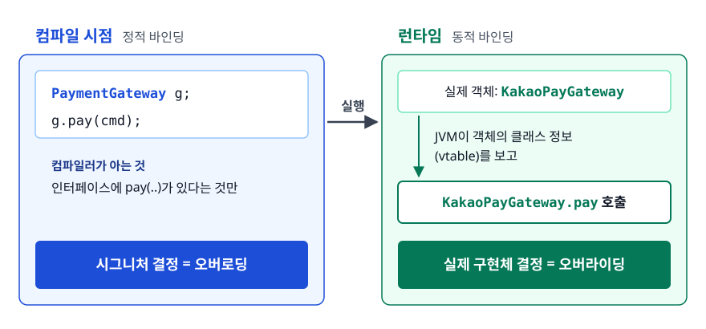
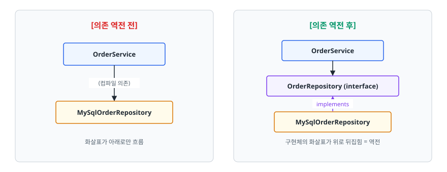

# 객체지향과 SOLID (OOP & SOLID Principles)

> 캡슐화·상속·다형성·추상화가 각각 어떤 문제를 푸는 도구인지 설명합니다. 이어서 SOLID 다섯 원칙을 위반 코드와 개선 코드로 대조해 말할 수 있게 됩니다.

## 학습 목표

- [ ] OOP 4대 특성이 각각 어떤 고통을 없애려고 나왔는지 코드로 설명할 수 있다
- [ ] SOLID 위반 코드를 보고 어떤 원칙을 어겼는지 진단할 수 있다
- [ ] 상속보다 조합(Composition)을 먼저 고려해야 하는 이유를 말할 수 있다
- [ ] 인터페이스와 추상 클래스 중 무엇을 쓸지 근거를 대고 고를 수 있다

## 선행 지식

- 클래스·인터페이스·상속의 문법 수준 이해면 충분합니다. 이 문서부터 시작해도 됩니다.

---

## 1. 왜 필요한가

객체지향은 현실 세계를 코드로 옮기려고 나온 게 아닙니다. **변경 비용을 낮추기 위해** 나왔습니다.

```java
// 절차지향 스타일 - 결제 수단이 늘어날 때마다 이 메서드를 계속 열어야 한다
public void pay(String type, int amount) {
    if ("CARD".equals(type))       { /* 카드사 승인 요청 */ }
    else if ("KAKAO".equals(type)) { /* 카카오페이 API */ }
    else if ("NAVER".equals(type)) { /* 네이버페이 API */ }
}
```

여기서 문제가 세 가지 생깁니다.

1. **분기 폭발**: 결제 수단 N개 × 기능 M개 = N×M 개의 분기가 코드 곳곳에 흩어집니다. 환불·취소 메서드에도 같은 if-else가 복사됩니다.
2. **변경 영향 범위 예측 불가**: 카카오페이 로직 하나 고치려고 열었는데 카드 결제까지 같이 배포됩니다.
3. **데이터 무결성 보호 실패**: `amount`를 아무나 음수로 바꿔도 막을 곳이 없습니다.

OOP의 네 가지 특성은 이 문제들에 대한 각각의 처방입니다. 4대 특성을 암기하지 말고 **처방전으로** 읽어야 합니다.

| 특성 | 없으면 생기는 고통 | 처방 |
|------|------------------|------|
| 캡슐화 | 데이터가 아무 데서나 훼손됨 | 상태를 감추고 검증된 통로로만 바꾸게 함 |
| 추상화 | 쓰는 쪽이 내부 구현을 다 알아야 함 | 필요한 약속만 남기고 나머지를 가림 |
| 다형성 | if-else 분기가 코드 전역에 복사됨 | 타입이 알아서 자기 동작을 고르게 함 |
| 상속 | 공통 코드를 복붙해야 함 | 공통을 위로 올려 재사용 |

---

## 2. 캡슐화 (Encapsulation)

이 필드 값이 언제 어디서 이상해졌는지 모르겠다는 문제를 풉니다.

```java
// 안티패턴 - 필드 공개
public class Account {
    public long balance;
}
account.balance -= 10_000;   // 잔액 검사 없음. 마이너스 통장이 그냥 만들어진다
```

**왜 문제인가**: 필드가 public이면 **잔액을 바꾸는 코드가 프로젝트 전체에 몇 군데인지 알 수 없습니다.** 버그가 났을 때 용의자가 수백 곳입니다. 검증 로직을 나중에 추가하려 해도 붙일 자리가 없습니다.

```java
// 개선
public class Account {
    private long balance;

    public void withdraw(long amount) {
        if (amount <= 0)      throw new IllegalArgumentException("출금액은 양수여야 합니다");
        if (balance < amount) throw new IllegalStateException("잔액 부족");
        this.balance = balance - amount;
    }

    public long getBalance() { return balance; }
}
```

이제 잔액이 변하는 통로는 `withdraw` 하나뿐입니다. 버그 용의자가 수백 곳에서 한 곳으로 줄었습니다.

> **비유**: 자동차 운전대와 페달. 운전자는 엔진 내부를 몰라도 되고 함부로 만질 수도 없습니다.
>
> **비유의 한계**: 자동차 보닛은 물리적으로 잠기지만 Java의 `private`은 리플렉션으로 뚫립니다. 캡슐화는 *컴파일러가 강제하는 약속*입니다. *물리적 차단*이 아닙니다.

### 흔한 오해

**필드를 private으로 하고 getter/setter를 만들면 캡슐화다** — 아닙니다. 모든 필드에 setter를 열어두면 `public` 필드와 다를 게 없습니다. 이름만 `setBalance()`로 바뀌었을 뿐 검증이 없다면 캡슐화가 아닙니다. 접근 제어자가 캡슐화를 만들어주지는 않습니다. 원칙은 하나입니다. **객체에게 데이터를 달라고 하지 말고 일을 시켜라.**

```java
account.setBalance(account.getBalance() - price);  // 규칙이 밖에 있다 - 실패
account.withdraw(price);                           // 규칙이 객체 안에 산다
```

---

## 3. 상속 (Inheritance) — 그리고 그 함정

`Dog`, `Cat`이 각자 `name`, `age`, `eat()`을 들고 있을 필요는 없습니다. 상속은 이 공통 코드 복붙을 없앱니다.

상속은 OOP 4대 특성 중 **가장 오용됩니다**. 상속의 정체는 **is-a 관계 선언 + 부모의 모든 public 계약 승계**인데, 코드 재사용 수단으로만 보고 쓰기 때문입니다.

```java
// 안티패턴 - 재사용이 탐나서 상속
public class Stack<E> extends ArrayList<E> {
    public void push(E e) { add(e); }
    public E pop() { return remove(size() - 1); }
}

Stack<String> stack = new Stack<>();
stack.add(0, "몰래 끼워넣기");   // ArrayList의 메서드가 그대로 열려 있다
```

**왜 문제인가**: `Stack`은 맨 위에서만 넣고 뺀다는 불변식을 지켜야 하는데 `ArrayList`를 상속하는 순간 `add(int, E)`, `remove(int)`, `set(...)` 같은 구멍이 전부 공개됩니다. 자식이 부모의 계약을 좁힐 방법이 없습니다.

```java
// 개선 - 조합(Composition)
public class Stack<E> {
    private final List<E> items = new ArrayList<>();  // 상속이 아니라 보유

    public void push(E e) { items.add(e); }
    public E pop() {
        if (items.isEmpty()) throw new NoSuchElementException();
        return items.remove(items.size() - 1);
    }
}
```

외부에 노출되는 API는 이제 내가 고른 것만입니다. 내부 자료구조를 `LinkedList`로 바꿔도 밖은 영향이 없습니다.

**판단 기준**: B는 A의 일종인가? 여기에 자신 있게 예라고 답할 수 없으면 상속하지 않습니다. `Stack`은 `ArrayList`를 *쓰는* 클래스입니다. `ArrayList`의 일종은 아닙니다.

---

## 4. 다형성 (Polymorphism)

1절에서 본 if-else 분기 폭발이 여기서 사라집니다.

```java
public interface PaymentGateway {
    boolean supports(PayMethod method);
    PaymentResult pay(PaymentCommand command);
}

public class KakaoPayGateway implements PaymentGateway {
    public boolean supports(PayMethod method) { return method == PayMethod.KAKAO; }
    public PaymentResult pay(PaymentCommand command) { /* 카카오 API */ }
}

public class PaymentService {
    private final List<PaymentGateway> gateways;   // 구현체 목록을 주입받는다

    public PaymentResult pay(PaymentCommand command) {
        return gateways.stream()
                .filter(g -> g.supports(command.method()))
                .findFirst()
                .orElseThrow(() -> new IllegalArgumentException("지원하지 않는 결제 수단"))
                .pay(command);
    }
}
```

토스페이를 추가할 때 `PaymentService`는 **한 글자도 바뀌지 않습니다**. 새 클래스 파일 하나만 추가하면 됩니다.

### 동작 원리 — 정적 바인딩 vs 동적 바인딩

<!-- diagram:be-oop-solid-1 -->


<!-- 위 그림이 대체한 원본 ASCII.
     내용을 고칠 때는 그림도 함께 갱신할 것.
```
   컴파일 시점                              런타임
┌──────────────────────┐            ┌──────────────────────────┐
│ PaymentGateway g;    │            │ 실제 객체: KakaoPayGateway│
│ g.pay(cmd);          │  ──실행──▶ │ JVM이 객체의 클래스 정보  │
│ 컴파일러는 인터페이스에│            │ (vtable)를 보고           │
│ pay(..)가 있다는 것만 │            │ KakaoPayGateway.pay 호출  │
└──────────────────────┘            └──────────────────────────┘
   시그니처 결정 = 오버로딩            실제 구현체 결정 = 오버라이딩
```
-->

**오버로딩(Overloading)은 컴파일 타임**에, **오버라이딩(Overriding)은 런타임**에 결정됩니다. 확장 가능성은 후자에서 나옵니다. 면접에서 다형성이라고 하면 사실상 오버라이딩 기반의 동적 디스패치를 가리킵니다.

---

## 5. 추상화 (Abstraction)

이 기능을 쓰려면 알아야 할 것의 양을 줄입니다. JDBC가 교과서 같은 예입니다. 애플리케이션은 `Connection`, `PreparedStatement`, `ResultSet` 세 인터페이스만 알면 MySQL이든 PostgreSQL이든 똑같이 씁니다. 드라이버 JAR을 갈아끼우고 URL만 바꾸면 됩니다.

추상화는 **구현이 바뀌어도 이 약속이 안 깨지는가**로 판단합니다. **구현을 감췄는가**는 기준이 못 됩니다.

```java
// 나쁜 추상화 - 이름만 추상적이고 구현 기술이 새어나온다
List<User> findByMySqlNativeQuery(String sql);
void flushHibernateSession();

// 좋은 추상화 - 저장소가 무엇이든 성립하는 약속
Optional<User> findById(UserId id);
void save(User user);
```

위쪽은 MongoDB로 갈아끼우는 순간 컴파일이 깨집니다. 감추는 데 실패한 것입니다. 이걸 **추상화 누수(Leaky Abstraction)** 라고 합니다.

---

## 6. SOLID — 위반 코드에서 개선 코드로

SOLID는 지켜야 할 규칙 5개가 아닙니다. **코드 냄새를 진단하는 다섯 개의 렌즈**입니다.

### SRP (Single Responsibility Principle) — 단일 책임

**정의**: 클래스를 변경할 이유는 하나여야 합니다.

```java
// 안티패턴 - 파일 입출력 때문에 IOException까지 주문 메서드 시그니처로 새어 나온다
public void placeOrder(OrderRequest req) throws IOException {
    Order order = new Order(req);
    orderRepository.save(order);

    mailSender.send(req.email(), "주문 완료", "<h1>주문 완료</h1>" + order.getId());

    Files.writeString(Path.of("settlement.csv"),
            order.getId() + "," + order.getAmount() + "\n", StandardOpenOption.APPEND);
}
```

**왜 문제인가**: 이 클래스는 세 가지 이유로 바뀝니다. 주문 정책, 메일 템플릿, 정산 포맷. 마케팅팀에서 메일 문구 하나 고쳐달라고 하면 주문 로직까지 다시 배포해야 합니다. 테스트도 지옥입니다. 주문 저장만 검증하고 싶은데 메일 서버와 파일 시스템을 흉내 내야 합니다.

```java
// 개선 - 책임 분리 + 이벤트로 결합 끊기
public void placeOrder(OrderRequest req) {
    Order order = new Order(req);
    orderRepository.save(order);
    eventPublisher.publish(new OrderPlacedEvent(order.getId(), req.email()));
}

class OrderMailListener   { void on(OrderPlacedEvent e) { /* 메일만 */ } }
class SettlementRecorder  { void on(OrderPlacedEvent e) { /* 정산만 */ } }
```

**주의**: SRP를 메서드 잘게 쪼개기로 이해하면 곤란합니다. 클래스 10개짜리 기능을 100개로 만들면 오히려 추적이 어려워집니다. **변경을 요청하는 사람이 같은가**로 나눕니다. 클래스 크기는 기준이 아닙니다.

### OCP (Open-Closed Principle) — 개방-폐쇄

**정의**: 확장에는 열려 있고 수정에는 닫혀 있어야 합니다.

```java
// 안티패턴 - 등급이 추가될 때마다 이 메서드를 연다
public int discount(Grade grade, int price) {
    if (grade == Grade.BRONZE) return price;
    else if (grade == Grade.SILVER) return (int) (price * 0.95);
    else if (grade == Grade.GOLD) return (int) (price * 0.9);
    return price;
}
```

**왜 문제인가**: 등급을 추가하려면 *이미 테스트를 통과해 운영 중인 코드*를 수정해야 합니다. 수정하면 기존 등급까지 회귀 테스트 대상이 됩니다. 이런 분기가 할인, 배송비, 포인트 적립에 각각 복사되어 있다는 게 더 나쁩니다.

```java
// 개선 - enum에 정책을 들려보낸다
public enum Grade {
    BRONZE(1.00), SILVER(0.95), GOLD(0.90);

    private final double discountRate;
    Grade(double discountRate) { this.discountRate = discountRate; }

    public int applyDiscount(int price) { return (int) (price * discountRate); }
}

int payable = grade.applyDiscount(price);   // 호출부에서 분기가 사라졌다
```

정책이 복잡해 enum에 담기 힘들면 `DiscountPolicy` 인터페이스 + 구현체(전략 패턴)로 갑니다. 어느 쪽이든 **새 케이스 = 새 파일 추가**여야 합니다. 기존 파일 수정으로 가면 안 됩니다.

### LSP (Liskov Substitution Principle) — 리스코프 치환

**정의**: 자식 타입은 부모 타입이 있던 자리에 넣어도 프로그램이 여전히 옳게 동작해야 합니다.

```java
// 안티패턴 - 수학적으로는 정사각형이 직사각형인데...
public class Rectangle {
    protected int width, height;
    public void setWidth(int w)  { this.width = w; }
    public void setHeight(int h) { this.height = h; }
    public int area() { return width * height; }
}

public class Square extends Rectangle {
    @Override public void setWidth(int w)  { this.width = w; this.height = w; }
    @Override public void setHeight(int h) { this.width = h; this.height = h; }
}

void test(Rectangle r) {          // Rectangle에는 통과, Square를 넣으면 실패
    r.setWidth(5);
    r.setHeight(4);
    assert r.area() == 20;        // Square라면 16
}
```

**왜 문제인가**: `Rectangle`의 암묵적 계약은 "너비와 높이는 독립적으로 변한다"인데 `Square`가 이걸 깼습니다. **상속 관계는 계약의 호환성으로 판단해야 합니다. 현실의 분류를 그대로 옮기면 안 됩니다.**

실무에서는 **부모에 없던 예외를 자식이 던지는** 형태로 더 자주 나타납니다. `List.of()`가 반환하는 불변 리스트에 `add()`를 호출하면 `UnsupportedOperationException`이 나는 것이 그 예입니다. JDK가 실용성을 위해 감수한 절충이지만 내 코드에서는 피해야 합니다. 두 경우 모두 해법은 같습니다. 상속 계층을 억지로 만들지 말고 별도 타입으로 분리하거나 불변 값 객체로 만들면 됩니다.

### ISP (Interface Segregation Principle) — 인터페이스 분리

**정의**: 클라이언트는 자기가 쓰지 않는 메서드에 의존하면 안 됩니다.

```java
// 안티패턴 - 뚱뚱한 인터페이스
public interface MultiFunctionDevice {
    void print(Document doc);
    void scan(Document doc);
    void fax(Document doc);
}

public class SimplePrinter implements MultiFunctionDevice {
    public void print(Document doc) { /* 정상 */ }
    public void scan(Document doc) { throw new UnsupportedOperationException(); }
    public void fax(Document doc)  { throw new UnsupportedOperationException(); }
}
```

**왜 문제인가**: 컴파일은 되지만 런타임에 터집니다. 게다가 `fax()` 시그니처가 바뀌면 팩스를 쓰지도 않는 `SimplePrinter`까지 재컴파일·재배포 대상이 됩니다. 위에서 본 LSP 위반이기도 합니다.

```java
// 개선
public interface Printer { void print(Document doc); }
public interface Scanner { void scan(Document doc); }
public interface Fax     { void fax(Document doc); }

// 각자 필요한 능력만 골라 구현한다
public class SimplePrinter implements Printer {
    public void print(Document doc) { /* 이 하나면 끝 */ }
}
public class OfficeMachine implements Printer, Scanner, Fax { /* 세 메서드 모두 구현 */ }
```

Java의 `Runnable`, `Comparable`, `AutoCloseable`이 모두 메서드 하나짜리인 것은 우연이 아닙니다.

### DIP (Dependency Inversion Principle) — 의존 역전

**정의**: 상위 모듈이 하위 모듈에 의존하면 안 됩니다. 둘 다 추상에 의존해야 합니다.

```java
// 안티패턴 - 정책이 세부 기술에 묶여 있다
public class OrderService {
    private final MySqlOrderRepository repository = new MySqlOrderRepository();
    private final SmtpMailSender mailSender = new SmtpMailSender();
}

// 개선 - 인터페이스 타입으로 주입받는다
public class OrderService {
    private final OrderRepository repository;   // 인터페이스
    private final MailSender mailSender;        // 인터페이스
}
```

**왜 문제인가**: `OrderService`는 주문 규칙이라는 상위 정책인데 MySQL과 SMTP라는 하위 기술을 직접 알고 있습니다. 단위 테스트에서 가짜 저장소로 바꿔치울 수도 없고, DB를 옮기면 정책 코드가 바뀝니다.

<!-- diagram:be-oop-solid-2 -->


<!-- 위 그림이 대체한 원본 ASCII.
     내용을 고칠 때는 그림도 함께 갱신할 것.
```
[의존 역전 전]                    [의존 역전 후]

 OrderService                      OrderService
      │                                 │
      ▼  (컴파일 의존)                   ▼
 MySqlOrderRepository              OrderRepository (interface)
                                        ▲
                                        │ implements
                                   MySqlOrderRepository

  화살표가 아래로만 흐름            구현체의 화살표가 위로 뒤집힘 = 역전
```
-->

역전은 **의존 화살표의 방향이 뒤집힌다**는 뜻입니다. 그래서 `OrderRepository` 인터페이스를 구현 패키지가 아니라 **도메인 패키지에 두어야** 진짜 역전이 됩니다. Spring의 DI 컨테이너는 이 구조를 편하게 조립해주는 도구일 뿐, DI를 쓴다고 자동으로 DIP가 지켜지는 건 아닙니다.

---

## 7. 인터페이스 vs 추상 클래스

Java 8 이후 인터페이스가 `default` 메서드를 갖게 되면서 이제 추상 클래스는 필요 없는 것 아니냐는 질문이 나옵니다. 여전히 **상태(state)가** 둘을 가릅니다.

| 기준 | 인터페이스 | 추상 클래스 |
|------|-----------|------------|
| 다중 상속 | 여러 개 구현 가능 | 하나만 상속 가능 |
| 인스턴스 필드 | 불가 (`public static final` 상수만) | 가능 |
| 생성자 | 없음 | 있음 (자식이 `super(...)` 호출) |
| 메서드 구현 | `default`·`static`(Java 8+), `private`(Java 9+) | 자유 |
| 표현하는 관계 | "~을 할 수 있다" (can-do) | "~의 일종이다" (is-a) |
| 대표 예 | `Comparable`, `AutoCloseable` | `AbstractList`, `InputStream` |

**선택 기준**: 하위 타입들이 **공유할 상태와 생성 규칙**이 있으면 추상 클래스, **능력만 약속**하면 되면 인터페이스입니다. 확신이 안 서면 인터페이스로 시작하는 게 낫습니다. 인터페이스를 추상 클래스로 바꾸는 것보다 그 반대가 훨씬 어렵습니다. `List` 인터페이스와 `AbstractList`처럼 **둘 다 제공**하고 구현자가 고르게 하는 패턴도 흔합니다.

**`default` 메서드의 용도**를 오해하면 안 됩니다. 인터페이스에도 로직을 넣자는 뜻이 아닙니다. 이미 배포된 인터페이스에 메서드를 추가할 수 있게 해주는 **하위 호환 장치**입니다. 기존 구현체는 깨지지 않습니다. `Collection.stream()`이 Java 8에 추가될 수 있었던 것도 이 덕분입니다.

---

## 8. 실무에서는

- **Spring의 `@Transactional`, `@Async`** 는 프록시 객체를 만들어 원본 앞에 끼워 넣습니다. 이게 가능한 이유가 다형성입니다. 인터페이스 기반 JDK 동적 프록시와 상속 기반 CGLIB 프록시를 모두 지원합니다.
- **JDBC / JPA**: `EntityManager`라는 추상에만 의존하고 Hibernate 같은 구현을 갈아끼웁니다. DIP의 실제 적용 사례입니다.
- **Java 17의 `sealed`**: 허용된 구현체를 명시하면 "확장에 열려 있다"를 의도적으로 닫을 수 있습니다. 결제 결과처럼 케이스가 확정된 도메인에서는 무제한 확장보다 컴파일러의 완전성 검사가 더 값집니다. 아래 예시처럼 `default` 없이 완전성을 검사받는 패턴 매칭 `switch`는 **Java 21에서 정식 기능이 됐습니다**(그 이전에는 프리뷰).

```java
public sealed interface PaymentResult permits Approved, Declined, Pending { }

// permits에 적힌 타입은 final / sealed / non-sealed 중 하나여야 한다. record는 암묵적으로 final이다.
public record Approved(String approvalNo) implements PaymentResult { }
public record Declined(String reason)     implements PaymentResult { }
public record Pending()                   implements PaymentResult { }

String message = switch (result) {          // 모든 케이스를 다뤘는지 컴파일러가 검사
    case Approved a -> "승인 " + a.approvalNo();
    case Declined d -> "거절 " + d.reason();
    case Pending  p -> "대기";
};
```

---

## 9. 면접 포인트

> 면접에서 이 주제가 나오면 이렇게 답한다

**Q. 상속과 조합 중 무엇을 먼저 고려하나요?**

A. 조합을 먼저 고려합니다. 상속은 부모의 모든 public 계약을 자식이 물려받기 때문에 부모가 바뀌면 자식이 조용히 깨질 수 있습니다. 조합은 필요한 기능만 골라 위임하므로 노출 범위를 내가 통제합니다. `Stack`을 `ArrayList` 상속으로 만들면 `add(index, e)` 같은 구멍이 열리는데 내부에 `List`를 필드로 두면 그런 문제가 없습니다.
- 꼬리 질문: "그럼 상속은 언제 쓰나요?" → "is-a 관계가 명확하고 부모가 상속을 염두에 두고 설계됐을 때입니다. 확장 방법이 문서화돼 있지 않은 클래스는 상속하지 않습니다."

**Q. OCP를 실무 코드에서 지킨 경험이 있나요?**

A. 결제 수단별 분기가 서비스 레이어 여러 곳에 흩어져 있던 코드를 `PaymentGateway` 인터페이스와 구현체 구조로 바꾼 적이 있습니다. 구현체를 `List`로 주입받으므로 새 결제사를 붙일 때 클래스 하나만 추가하고 기존 코드는 손대지 않습니다. 회귀 테스트 범위가 크게 줄었습니다.
- 꼬리 질문: "OCP를 지키면 항상 좋은가요?" → "아닙니다. 확장 지점을 미리 만들면 추상화 비용이 듭니다. 변경이 실제로 반복될 조짐이 보일 때 도입하는 편이 낫습니다."

**Q. 인터페이스와 추상 클래스의 차이를 선택 기준으로 설명해주세요.**

A. 결정적 차이는 인스턴스 상태를 가질 수 있느냐입니다. 하위 타입들이 공통 필드와 생성 규칙을 공유해야 하면 추상 클래스, 능력만 약속하면 되면 인터페이스입니다. Java는 클래스 다중 상속이 안 되므로 추상 클래스를 쓰면 상속 카드 한 장을 소모한다는 점도 고려합니다.
- 꼬리 질문: "default 메서드가 생겼으니 추상 클래스는 필요 없지 않나요?" → "인터페이스는 인스턴스 필드가 없어 상태 공유가 안 됩니다. 그리고 default는 로직 재사용보다 기존 구현체를 깨지 않고 메서드를 추가하기 위한 하위 호환 장치입니다."

**Q. DIP에서 '역전'되는 게 정확히 무엇인가요?**

A. 의존 화살표의 방향입니다. 원래 상위 정책이 하위 구현을 향해 화살표가 내려가는데, 인터페이스를 상위 모듈 쪽에 두면 구현체가 그 인터페이스를 향해 화살표를 위로 올립니다. 그래서 인터페이스를 어느 패키지에 두느냐가 중요합니다. 구현체 패키지에 두면 역전이 일어나지 않습니다.

---

## 자주 하는 실수

| 실수 | 왜 틀렸나 | 올바른 이해 |
|------|----------|-----------|
| 모든 필드에 getter/setter를 만들고 "캡슐화했다"고 함 | 검증 없는 setter는 public 필드와 동일 | 상태를 바꾸는 의미 있는 메서드(`withdraw`)를 노출 |
| 코드 재사용을 위해 상속 | 부모의 모든 계약까지 물려받아 불변식이 깨짐 | 조합 후 필요한 것만 위임 |
| 인터페이스를 구현체 패키지에 둠 | 의존 화살표가 여전히 아래로 향해 DIP 미성립 | 인터페이스는 사용하는 상위 모듈이 소유 |
| SOLID 준수 자체를 목표로 클래스를 과하게 쪼갬 | 추상화 비용이 이득을 넘어섬 | 변경이 반복되는 축을 찾아 그 축으로만 분리 |
| "Spring DI를 쓰니 DIP를 지킨 것" | DI는 조립 도구일 뿐 의존 방향과 무관 | 구체 클래스 타입으로 주입받으면 여전히 위반 |
| `@Override` 생략 | 오타나 시그니처 불일치가 새 메서드 정의로 통과 | 항상 붙여 컴파일러 검증을 받는다 |

---

## 한 줄 정리

OOP 4대 특성과 SOLID는 외울 규칙이 아니라 진단 도구입니다. **변경이 왔을 때 몇 개의 파일을 열게 되는가**를 줄이는 데 씁니다.

---

## 연관 개념

- [02-memory-model.md](./02-memory-model.md) - 객체가 실제로 메모리 어디에 어떻게 놓이는지
- [04-call-by-value-reference.md](./04-call-by-value-reference.md) - 캡슐화를 완성하는 방어적 복사와 불변 객체
- [qna-java.md](./qna-java.md) - OOP·SOLID·인터페이스 관련 면접 질문
- [../../04-design-patterns/qna-design-patterns.md](../../04-design-patterns/qna-design-patterns.md) - 전략·팩토리 등 SOLID를 구현하는 패턴들
- [../spring-framework/qna-spring.md](../spring-framework/qna-spring.md) - DI 컨테이너가 DIP를 어떻게 조립하는지
