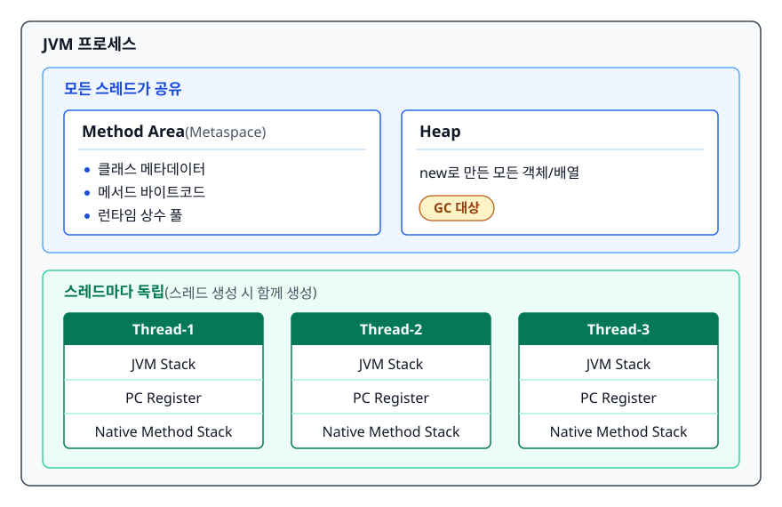
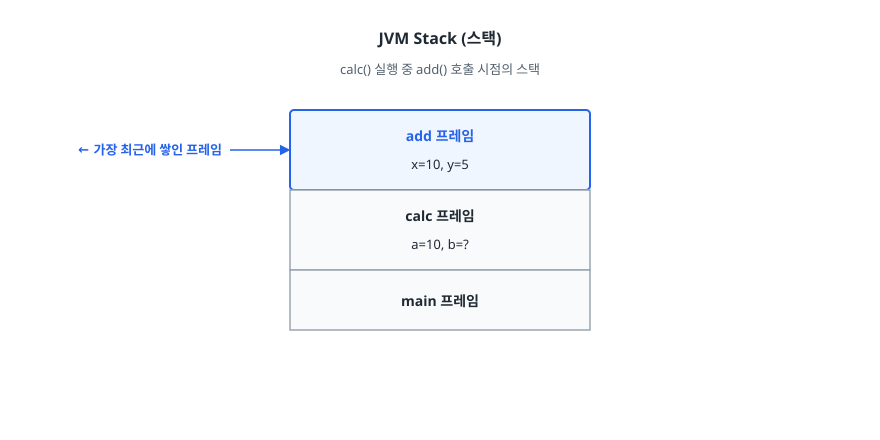
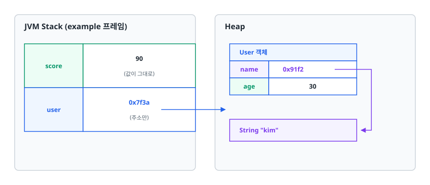
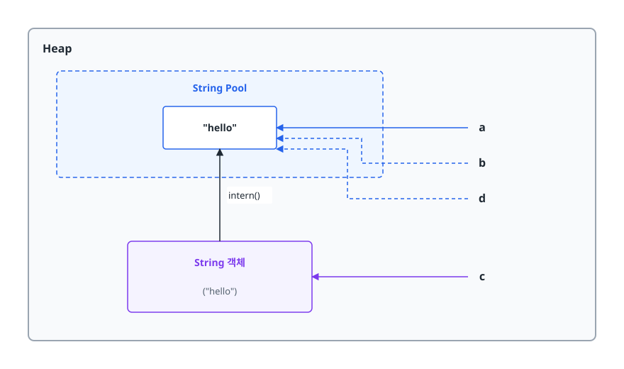

# Java 메모리 모델 (JVM Memory Model)

> JVM이 코드를 실행하면서 데이터를 어디에 놓는지 그림으로 그릴 수 있게 되고, 원시 타입·참조 타입·String Pool·오토박싱에서 생기는 버그의 원인을 메모리 관점으로 설명할 수 있게 된다.

## 학습 목표

- [ ] Runtime Data Area의 5개 영역과 스레드 공유 여부를 구분할 수 있다
- [ ] 원시 타입과 참조 타입이 각각 어디에 저장되는지 그림으로 설명할 수 있다
- [ ] String Pool이 왜 존재하고 `==` 비교가 왜 위험한지 말할 수 있다
- [ ] 오토박싱이 만드는 성능 저하와 `NullPointerException`을 예측할 수 있다
- [ ] `StackOverflowError`와 `OutOfMemoryError`가 각각 어느 영역에서 나는지 안다

## 선행 지식

- [../../01-computer-science-fundamentals/operating-system/01-process-thread.md](../../01-computer-science-fundamentals/operating-system/01-process-thread.md) - 프로세스 메모리 구조와 스레드별 스택 개념
- [01-oop-solid.md](./01-oop-solid.md) - 객체와 참조라는 말에 익숙하면 읽기 편하다

---

## 1. 왜 알아야 하는가

Java는 `malloc`/`free`가 없다. 그래서 "메모리는 JVM이 알아서 해주는 것"으로 넘어가기 쉽다. 하지만 실무에서 만나는 아래 증상들은 전부 메모리 구조를 모르면 원인 추적이 불가능하다.

- 배포 후 며칠 지나면 `OutOfMemoryError: Java heap space`로 서버가 죽는다
- 재귀 함수를 고쳤더니 `StackOverflowError`가 난다
- `Integer` 두 개를 `==`로 비교했는데 값이 같은데도 `false`가 나온다 (그런데 작은 숫자로 테스트하면 `true`가 나온다)
- 반복문 안에서 `Long` 변수를 더했더니 예상보다 10배 느리다

이 문서는 이 네 증상의 원인을 전부 한 장의 그림 위에서 설명한다.

---

## 2. Runtime Data Area 전체 구조

JVM이 프로그램을 실행할 때 쓰는 메모리는 다섯 영역으로 나뉜다. 나누는 기준은 **스레드끼리 공유하는가**다.

<!-- diagram:be-memory-model-1 -->


<!-- 위 그림이 대체한 원본 ASCII.
     내용을 고칠 때는 그림도 함께 갱신할 것.
```
┌──────────────────────────── JVM 프로세스 ────────────────────────────┐
│                                                                      │
│  ┌──────────── 모든 스레드가 공유 ────────────┐                       │
│  │                                            │                       │
│  │   ┌────────────────┐  ┌────────────────┐  │                       │
│  │   │  Method Area   │  │      Heap      │  │                       │
│  │   │  (Metaspace)   │  │                │  │                       │
│  │   │                │  │  new로 만든    │  │                       │
│  │   │ 클래스 메타데이터│  │  모든 객체/배열 │  │                       │
│  │   │ 메서드 바이트코드│  │                │  │                       │
│  │   │ 런타임 상수 풀   │  │  ← GC 대상     │  │                       │
│  │   └────────────────┘  └────────────────┘  │                       │
│  └────────────────────────────────────────────┘                      │
│                                                                      │
│  ┌────────── 스레드마다 독립 (스레드 생성 시 함께 생성) ──────────┐    │
│  │                                                              │    │
│  │   Thread-1              Thread-2              Thread-3       │    │
│  │  ┌──────────┐          ┌──────────┐          ┌──────────┐   │    │
│  │  │ JVM Stack│          │ JVM Stack│          │ JVM Stack│   │    │
│  │  ├──────────┤          ├──────────┤          ├──────────┤   │    │
│  │  │PC Register│         │PC Register│         │PC Register│  │    │
│  │  ├──────────┤          ├──────────┤          ├──────────┤   │    │
│  │  │Native    │          │Native    │          │Native    │   │    │
│  │  │Method    │          │Method    │          │Method    │   │    │
│  │  │Stack     │          │Stack     │          │Stack     │   │    │
│  │  └──────────┘          └──────────┘          └──────────┘   │    │
│  └──────────────────────────────────────────────────────────────┘    │
└──────────────────────────────────────────────────────────────────────┘
```
-->

### Method Area (메서드 영역)

클래스가 로딩될 때 **클래스 자체에 대한 정보**가 올라가는 곳이다. 필드 이름과 타입, 메서드 시그니처와 바이트코드, 런타임 상수 풀이 여기 있다.

Java 7까지는 이 영역이 `PermGen`이라는 이름의 힙 일부로 구현되어 고정 크기였다. 클래스를 동적으로 많이 만드는 애플리케이션에서 `OutOfMemoryError: PermGen space`가 흔했다. **Java 8부터 Metaspace로 바뀌면서 힙 밖의 네이티브 메모리를 쓰고 기본적으로 자동 확장**된다. 대신 무한정 늘어나 OS 메모리를 다 먹는 사고를 막으려면 `-XX:MaxMetaspaceSize`를 지정한다.

### Heap (힙)

`new`로 만들어진 **모든 객체와 배열**이 사는 곳이다. GC가 다루는 핵심 영역이며(Metaspace도 클래스가 언로드될 때 회수되지만 양이 훨씬 적다), 실무 튜닝의 대부분은 여기서 벌어진다. 내부는 Young/Old 세대로 나뉘는데 자세한 내용은 [03-garbage-collection.md](./03-garbage-collection.md)에서 다룬다.

### JVM Stack (스택)

메서드를 호출할 때마다 **스택 프레임(Stack Frame)** 이 하나 쌓이고, 메서드가 끝나면 사라진다. 프레임 안에는 지역 변수 배열, 피연산자 스택, 반환 주소가 들어 있다.

```java
public int calc() {
    int a = 10;          // 프레임의 지역 변수 배열에 값 10이 그대로 들어감
    int b = add(a, 5);   // add 프레임이 위에 쌓임 → 끝나면 사라짐
    return b;
}
```

<!-- diagram:be-memory-model-2 -->


<!-- 위 그림이 대체한 원본 ASCII.
     내용을 고칠 때는 그림도 함께 갱신할 것.
```
calc() 실행 중 add() 호출 시점의 스택

    ┌─────────────────┐  ← 가장 최근에 쌓인 프레임
    │ add 프레임       │
    │  x=10, y=5      │
    ├─────────────────┤
    │ calc 프레임      │
    │  a=10, b=?      │
    ├─────────────────┤
    │ main 프레임      │
    └─────────────────┘
```
-->

스택 크기는 `-Xss`로 조절한다(스레드 하나당). 재귀가 너무 깊어 프레임을 더 못 쌓으면 `StackOverflowError`다.

> **비유**: 스택은 식당 주방의 접시 더미다. 맨 위에 올리고 맨 위에서 뺀다. 힙은 창고 선반이고, 스택의 메모지에는 "창고 3번 칸"이라는 위치만 적혀 있다.
> **비유의 한계**: 창고 선반은 물건 위치가 고정이지만 힙 객체는 GC가 압축하면서 실제 주소가 바뀔 수 있다. 그래서 Java에는 C처럼 주소를 직접 가리키는 포인터 연산이 없다.

### PC Register

스레드마다 **지금 실행 중인 JVM 명령어의 위치**를 담는다. 스레드가 CPU를 빼앗겼다가 돌아왔을 때 어디부터 이어서 할지 알기 위해 필요하다. 네이티브 메서드를 실행 중일 때는 값이 정의되지 않는다(undefined).

### Native Method Stack

JNI로 C/C++ 코드를 호출할 때 쓰는 별도 스택이다. `Thread.start()`처럼 JDK 내부적으로 네이티브를 호출하는 지점에서 쓰인다.

---

## 3. 원시 타입 vs 참조 타입

```java
public void example() {
    int score = 90;
    User user = new User("kim", 30);
}
```

<!-- diagram:be-memory-model-3 -->


<!-- 위 그림이 대체한 원본 ASCII.
     내용을 고칠 때는 그림도 함께 갱신할 것.
```
   JVM Stack (example 프레임)              Heap
 ┌────────┬─────────────────┐        ┌──────────────────────┐
 │ score  │       90        │        │  User 객체            │
 │        │  (값이 그대로)    │        ├──────┬───────────────┤
 ├────────┼─────────────────┤        │ name │  0x91f2 ──────┼──┐
 │ user   │    0x7f3a ──────┼───────▶│ age  │      30       │  │
 │        │  (주소만)        │        └──────┴───────────────┘  │
 └────────┴─────────────────┘        ┌──────────────────────┐  │
                                     │  String "kim"         │◀─┘
                                     └──────────────────────┘
```
-->

| 구분 | 원시 타입 (Primitive) | 참조 타입 (Reference) |
|------|----------------------|----------------------|
| 종류 | `byte short int long float double char boolean` | 그 외 전부 (클래스, 인터페이스, 배열, enum) |
| 변수에 담기는 것 | 실제 값 | 객체의 주소(참조) |
| 객체 위치 | 없음 (값 자체) | Heap |
| null | 불가 | 가능 |
| 기본값 | `0`, `0.0`, `false`, `'\u0000'` (널 문자) | `null` |
| `==` 의미 | 값 비교 | 주소 비교 |
| 값 비교 방법 | `==` | `equals()` |

**언제 무엇을 쓰나**: 값 자체가 의미의 전부이고 `null`이 필요 없으면 원시 타입이 항상 낫다. 컬렉션에 담아야 하거나 "값이 없음"을 표현해야 할 때만 래퍼 타입을 쓴다.

### 흔한 오해 1 — "원시 타입은 항상 스택에 저장된다"

**지역 변수일 때만** 그렇다. 객체의 필드로 선언된 원시 타입은 그 객체와 함께 **힙 안에** 산다.

```java
class Point {
    int x;   // 이 int는 Heap의 Point 객체 안에 있다
    int y;
}

void method() {
    int temp = 5;        // 이 int는 Stack에 있다
    Point p = new Point(); // p(주소)는 Stack, Point 객체와 그 안의 x,y는 Heap
}
```

### 흔한 오해 2 — "static 변수는 Method Area에 저장된다"

Java 7부터 **static 필드의 실제 값은 힙에 있는 `java.lang.Class` 객체 안에** 저장된다. Method Area(Metaspace)에 있는 것은 "이 클래스에 이런 static 필드가 있다"는 **메타데이터**다. 그래서 클래스가 언로드되면 static이 참조하던 객체도 GC 대상이 될 수 있다.

면접에서 "static은 Method Area"라고 답해도 대개 넘어가지만, 위 구분까지 말하면 확실히 깊이가 드러난다.

---

## 4. String Pool

### 왜 있는가

웹 애플리케이션 하나에서 `"application/json"`, `"UTF-8"` 같은 문자열은 수만 번 등장한다. 매번 별도 객체를 만들면 똑같은 내용의 객체가 힙을 가득 채운다. JVM은 이걸 막으려고 **String Pool**을 둔다. 문자열 리터럴은 풀에 한 번만 만들고 이후에는 같은 객체를 재사용한다.

이게 가능한 유일한 이유는 **String이 불변(immutable)** 이기 때문이다. 만약 String을 바꿀 수 있다면, 한 곳에서 값을 바꾸는 순간 그 리터럴을 쓰는 전 세계 코드가 같이 바뀐다. 공유가 성립하지 않는다.

```java
String a = "hello";              // 풀에 만들고 참조
String b = "hello";              // 풀에서 찾아서 같은 객체 참조
String c = new String("hello");  // new는 무조건 힙에 새 객체 생성

System.out.println(a == b);        // true  (같은 풀 객체)
System.out.println(a == c);        // false (다른 객체)
System.out.println(a.equals(c));   // true  (값은 같음)

String d = c.intern();             // 풀에 있는 동등한 객체를 반환
System.out.println(a == d);        // true
```

<!-- diagram:be-memory-model-4 -->


<!-- 위 그림이 대체한 원본 ASCII.
     내용을 고칠 때는 그림도 함께 갱신할 것.
```
          Heap
   ┌──────────────────────────────────────┐
   │  ┌──── String Pool ────┐             │
   │  │   "hello"  ◀────────┼──── a       │
   │  │      ▲              │      b      │
   │  └──────┼──────────────┘      d      │
   │         │ intern()                    │
   │  ┌──────┴────────┐                    │
   │  │ String 객체    │ ◀──── c            │
   │  │  ("hello")    │                    │
   │  └───────────────┘                    │
   └──────────────────────────────────────┘
```
-->

String Pool은 Java 7부터 PermGen에서 **힙으로 이동**했다. 덕분에 풀에 들어간 문자열도 참조가 끊기면 GC 대상이 되고, 풀 크기 제약이 사실상 사라졌다.

### 컴파일 타임 상수 폴딩

```java
String a = "hello";
String b = "hel" + "lo";              // 컴파일 시점에 "hello"로 합쳐짐 → 풀 공유
String part = "hel";
String c = part + "lo";               // 런타임에 만들어짐 → 새 객체

System.out.println(a == b);   // true
System.out.println(a == c);   // false
```

`b`는 두 리터럴의 연결이라 컴파일러가 미리 계산해 하나의 리터럴로 바꾼다. `c`는 변수가 끼어 있어 런타임에 새 String이 만들어진다. **`==`으로 문자열을 비교하면 안 되는 이유**가 이것이다. 코드를 조금만 바꿔도 결과가 달라진다.

### 안티패턴 — 반복문 안의 문자열 연결

```java
// 안티패턴
String result = "";
for (int i = 0; i < 10_000; i++) {
    result += i + ",";   // 매 반복마다 새 String 객체 생성
}
```

**왜 문제인가**: String은 불변이므로 `+=`는 기존 문자열을 수정하는 게 아니라 **새 문자열을 만들어 다시 대입**한다. 10,000번 반복하면 버려지는 중간 String이 10,000개 생기고, 길이가 늘어날수록 복사 비용도 커진다.

```java
// 개선
StringBuilder sb = new StringBuilder();
for (int i = 0; i < 10_000; i++) {
    sb.append(i).append(',');
}
String result = sb.toString();
```

참고로 **반복문 밖의 단순 연결(`"a" + b + "c"`)은 컴파일러가 알아서 최적화**해주므로 굳이 `StringBuilder`로 바꿀 필요가 없다. 문제가 되는 건 루프 안에서 누적할 때다.

멀티스레드에서 하나의 버퍼를 공유해야 하면 `StringBuffer`(모든 메서드 `synchronized`)를 쓰지만, 실무에서 그런 상황은 드물다. 대개 지역 변수로 쓰므로 `StringBuilder`가 정답이다.

---

## 5. 오토박싱의 함정

### 무엇인가

원시 타입과 래퍼 클래스 사이의 변환을 컴파일러가 자동으로 넣어주는 기능이다.

```java
Integer boxed = 10;      // 오토박싱: Integer.valueOf(10) 이 삽입됨
int unboxed = boxed;     // 오토언박싱: boxed.intValue() 가 삽입됨
```

편해 보이지만 세 가지 함정이 있다.

### 함정 1 — Integer 캐시와 `==`

```java
Integer a = 127, b = 127;
Integer c = 128, d = 128;

System.out.println(a == b);   // true
System.out.println(c == d);   // false  ← 값은 같은데!
```

`Integer.valueOf()`는 **-128 ~ 127 범위의 값을 미리 만들어 캐싱**한다. 그래서 127까지는 같은 객체가 재사용되어 `==`가 `true`, 128부터는 매번 새 객체라 `false`가 된다.

**왜 문제인가**: 개발 중에는 작은 숫자로 테스트해 `==`가 통과하고, 운영에서 ID가 커지면 조용히 틀린 판단을 한다. 실제 장애로 이어지는 전형적인 패턴이다.

```java
// 개선 - 래퍼 타입 비교에는 항상 equals
if (a.equals(b)) { ... }

// 더 나은 개선 - 애초에 원시 타입으로 받는다
long orderId = order.getId();
```

`Byte`, `Short`, `Long`도 -128~127을 캐싱하고 `Character`는 0~127, `Boolean`은 두 값 모두 캐싱한다. `Float`와 `Double`은 캐시가 없다.

### 함정 2 — null 언박싱

```java
Map<String, Integer> counts = new HashMap<>();
int count = counts.get("없는키");   // NullPointerException
```

**왜 문제인가**: `get()`이 `null`을 반환하는데 `int`에 대입하려면 `intValue()`를 호출해야 한다. `null.intValue()`이므로 NPE다. 스택 트레이스에는 `.get()` 줄만 나와서 원인을 놓치기 쉽다.

```java
// 개선
int count = counts.getOrDefault("없는키", 0);
```

`getOrDefault` 외에 `Optional`로 감싸 받거나, 카운터 용도라면 `Map<String, Long>` 대신 `Map<String, AtomicLong>`처럼 값 자체가 `null`이 되지 않는 구조로 바꾸는 방법도 있다.

### 함정 3 — 반복문 안의 박싱

```java
// 안티패턴 - 타입 하나 잘못 골라 Long 객체 천만 개를 만든다
Long sum = 0L;
for (long i = 0; i < 10_000_000L; i++) {
    sum += i;   // 언박싱 → 덧셈 → 다시 박싱. 매 반복마다 Long 객체 생성
}
```

**왜 문제인가**: `sum`이 래퍼 타입이라 매 반복마다 `Long.valueOf()`가 호출된다. 캐시 범위를 벗어나므로 전부 새 객체다. 힙에 쓰레기가 쌓이고 GC가 계속 돌아 실행 시간이 크게 늘어난다.

```java
// 개선 - 선언 한 글자 차이
long sum = 0L;
```

Stream API에서도 같은 문제가 생긴다. `Stream<Integer>` 대신 `IntStream`/`LongStream`을 쓰면 박싱이 사라진다.

```java
// 박싱 발생
list.stream().map(Item::getPrice).reduce(0, Integer::sum);

// 박싱 없음
list.stream().mapToInt(Item::getPrice).sum();
```

---

## 6. 메모리 관련 에러 구분

| 에러 | 발생 영역 | 대표 원인 | 대응 |
|------|----------|----------|------|
| `StackOverflowError` | JVM Stack | 무한 재귀, 지나치게 깊은 호출 | 재귀를 반복문으로, 종료 조건 점검, 필요 시 `-Xss` 증가 |
| `OutOfMemoryError: Java heap space` | Heap | 객체 누수, 힙 대비 과도한 데이터 적재 | 힙 덤프 분석, `-Xmx` 조정, 쿼리 페이징 |
| `OutOfMemoryError: Metaspace` | Metaspace | 동적 클래스 생성 폭주(프록시, 스크립트 엔진), 클래스로더 누수 | `-XX:MaxMetaspaceSize` 설정 후 원인 추적 |
| `OutOfMemoryError: unable to create native thread` | OS | 스레드 수 한계 초과 | 스레드 풀 크기 조정, 가상 스레드 검토 |

`Error`는 `Exception`과 달리 **잡아서 복구하려 들면 안 된다**. `OutOfMemoryError`를 `catch`하고 계속 돌리면 그 뒤의 모든 동작이 신뢰할 수 없다. 프로세스를 재시작시키는 편이 낫다.

---

## 7. 실무에서는

JVM 옵션 중 메모리와 직결되는 것들.

```bash
# 힙 최소/최대 - 컨테이너에서는 둘을 같게 두어 확장으로 인한 흔들림을 없애는 편
java -Xms2g -Xmx2g -jar app.jar

# 컨테이너 메모리의 비율로 힙을 잡기 (Docker/K8s에서 권장)
java -XX:MaxRAMPercentage=75.0 -jar app.jar

# OOM 발생 시 힙 덤프를 남기고 종료 - 운영 서버에 필수
java -XX:+HeapDumpOnOutOfMemoryError \
     -XX:HeapDumpPath=/var/log/app/heapdump.hprof \
     -XX:+ExitOnOutOfMemoryError -jar app.jar
```

컨테이너 환경에서 `-Xmx`를 호스트 기준으로 잡으면, JVM은 아직 여유가 있다고 판단하는데 cgroup 한도를 넘어 **컨테이너가 OOM Killer에게 강제 종료**된다. 이때는 힙 덤프도 남지 않아 원인 추적이 어렵다. `-XX:MaxRAMPercentage`로 컨테이너 한도 기준 비율을 지정하는 편이 안전하다.

현재 상태 확인 명령.

```bash
jcmd <pid> VM.flags          # 실제 적용된 JVM 옵션
jcmd <pid> GC.heap_info      # 힙 사용량
jcmd <pid> VM.native_memory   # NMT 활성화 시 네이티브 메모리 내역
jmap -histo:live <pid> | head -20   # 살아있는 객체 상위 20개 클래스
```

---

## 8. 면접 포인트

> 면접에서 이 주제가 나오면 이렇게 답한다

**Q. JVM 메모리 영역을 설명해주세요.**
A. 스레드가 공유하는 영역과 스레드별 독립 영역으로 나뉩니다. 공유 영역은 클래스 메타데이터가 올라가는 Method Area와 객체가 저장되는 Heap이고, 독립 영역은 메서드 호출 프레임이 쌓이는 JVM Stack, 실행 위치를 담는 PC Register, JNI용 Native Method Stack입니다. GC가 관리하는 곳은 Heap이며 튜닝 대상도 대부분 여기입니다.
- 꼬리 질문: "Method Area는 Java 8에서 뭐가 달라졌나요?" → "PermGen에서 Metaspace로 바뀌면서 힙이 아닌 네이티브 메모리를 쓰고 자동 확장됩니다. PermGen 시절의 고정 크기 OOM 문제가 크게 줄었습니다."

**Q. `Integer a = 127, b = 127`일 때 `a == b`가 true인 이유는?**
A. `Integer.valueOf()`가 -128부터 127까지의 값을 캐싱해두고 같은 객체를 재사용하기 때문입니다. 128 이상이면 새 객체가 만들어져 `false`가 됩니다. 그래서 래퍼 타입은 반드시 `equals()`로 비교해야 하고, 가능하면 원시 타입을 씁니다.
- 꼬리 질문: "이 캐시 범위를 바꿀 수 있나요?" → "상한은 `-XX:AutoBoxCacheMax`로 늘릴 수 있지만, 코드가 특정 JVM 옵션에 의존하게 되므로 실무에서는 `equals()`를 쓰는 쪽이 맞습니다."

**Q. String이 불변으로 설계된 이유는?**
A. 첫째, String Pool로 리터럴을 공유하려면 값이 안 바뀌어야 합니다. 둘째, `hashCode()`를 한 번 계산해 캐싱할 수 있어 HashMap 키로 쓸 때 빠릅니다. 셋째, 여러 스레드가 동기화 없이 공유해도 안전합니다. 넷째, 파일 경로나 DB URL 같은 값이 검증 이후 변조될 위험이 없습니다.
- 꼬리 질문: "그럼 문자열을 자주 바꿔야 하면요?" → "`StringBuilder`를 씁니다. 특히 반복문 안에서 `+=`로 누적하면 매 반복마다 새 객체가 생겨 성능이 급격히 나빠집니다."

**Q. `StackOverflowError`와 `OutOfMemoryError`의 차이는?**
A. 발생 영역이 다릅니다. 전자는 스레드별 JVM Stack이 넘칠 때로, 보통 무한 재귀가 원인입니다. 후자는 힙이나 Metaspace 같은 공유 영역이 부족할 때이며, 객체 참조가 끊기지 않아 GC가 회수하지 못하는 누수가 흔한 원인입니다. 둘 다 `Error`이므로 잡아서 복구하려 하지 말고 원인을 제거해야 합니다.

---

## 자주 하는 실수

| 실수 | 왜 틀렸나 | 올바른 이해 |
|------|----------|-----------|
| "원시 타입은 항상 Stack에 있다" | 객체의 필드인 원시 타입은 힙의 객체 안에 있다 | 지역 변수일 때만 스택 |
| 래퍼 타입을 `==`로 비교 | 캐시 범위 밖에서는 주소가 달라 `false` | `equals()` 또는 원시 타입 사용 |
| `Map.get()` 결과를 바로 `int`에 대입 | `null` 언박싱으로 NPE | `getOrDefault()` 또는 `Optional` |
| 루프에서 `String +=` 누적 | 매 반복 새 객체 생성, 길이만큼 복사 | `StringBuilder` |
| 합계 변수를 `Long`으로 선언 | 반복마다 박싱 객체 생성으로 GC 폭증 | `long` 원시 타입 |
| `new String("abc")`로 문자열 생성 | 풀 공유를 스스로 포기하고 객체를 하나 더 만듦 | 리터럴 `"abc"` 사용 |
| 컨테이너에서 `-Xmx`를 호스트 기준으로 설정 | cgroup 한도 초과로 힙 덤프 없이 강제 종료 | `-XX:MaxRAMPercentage` 사용 |

---

## 한 줄 정리

Java 메모리 모델은 **"값이냐 주소냐"** 와 **"공유냐 스레드 전용이냐"** 두 축으로 정리되며, 실무 버그의 상당수는 이 두 축을 착각한 데서 나온다.

---

## 연관 개념

- [03-garbage-collection.md](./03-garbage-collection.md) - 힙에 쌓인 객체를 JVM이 어떻게 회수하는지
- [04-call-by-value-reference.md](./04-call-by-value-reference.md) - 스택의 참조값이 복사될 때 벌어지는 일
- [01-oop-solid.md](./01-oop-solid.md) - 객체 설계 원칙
- [qna-java.md](./qna-java.md) - JVM 구조·원시타입·String 관련 면접 질문
- [../../01-computer-science-fundamentals/operating-system/02-memory-management.md](../../01-computer-science-fundamentals/operating-system/02-memory-management.md) - OS가 프로세스에 메모리를 주는 방식
- [../../01-computer-science-fundamentals/operating-system/05-virtual-memory.md](../../01-computer-science-fundamentals/operating-system/05-virtual-memory.md) - 가상 메모리와 페이징
