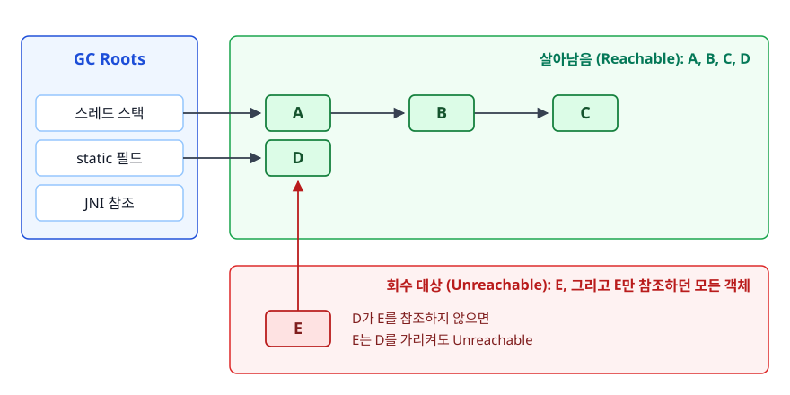
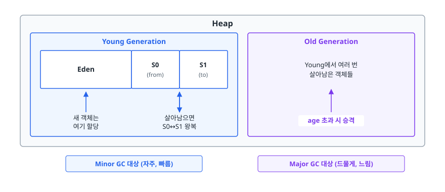
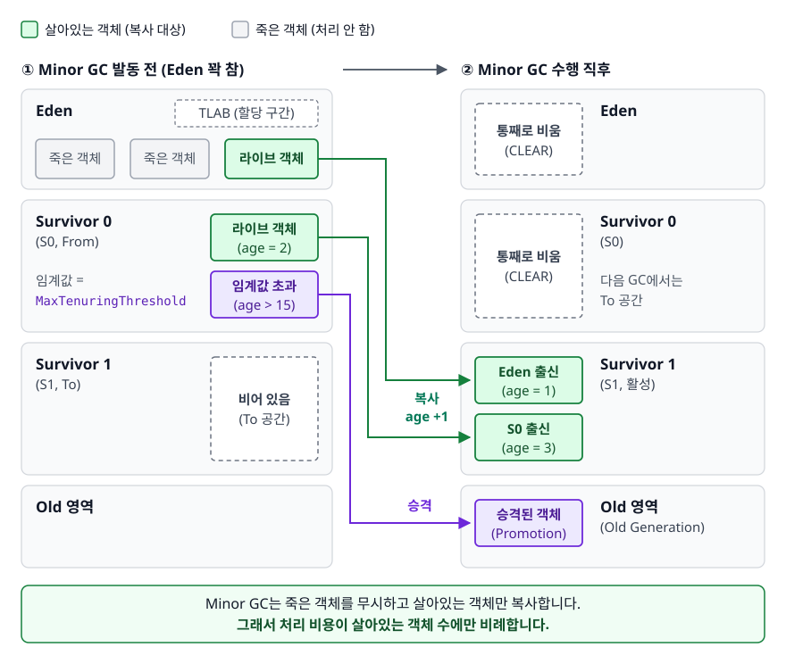
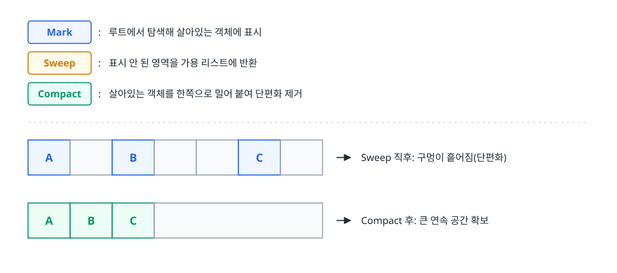
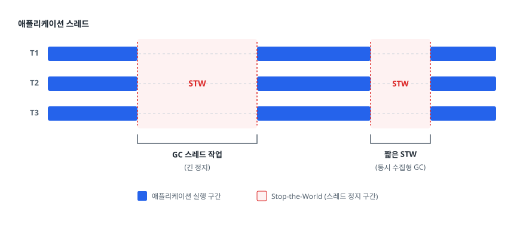
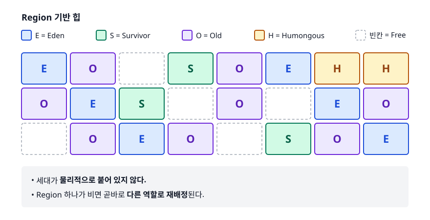

# 가비지 컬렉션 (Garbage Collection)

> GC는 무엇을 보고 객체를 "쓸모없다"고 판정할까요? 힙을 세대별로 나눠 수집하는 쪽이 왜 효율적이고, 상황마다 어떤 GC를 골라야 할까요? 메모리 누수를 어떻게 추적하는지까지 이 문서에서 다룹니다.

## 학습 목표

- [ ] Reachability와 GC Root로 "회수 대상"의 정의를 설명할 수 있다
- [ ] Young/Old 세대 구조와 Minor/Major GC의 흐름을 그림으로 그릴 수 있다
- [ ] Serial/Parallel/G1/ZGC를 처리량과 지연 시간 관점으로 비교해 고를 수 있다
- [ ] Stop-the-World가 왜 불가피한지, 어떻게 줄이는지 말할 수 있다
- [ ] GC가 있는데도 메모리 누수가 나는 대표 패턴 4가지를 진단할 수 있다

## 선행 지식

- [02-memory-model.md](./02-memory-model.md) - 힙이 무엇인지 알아야 이 문서가 읽힙니다

---

## 1. 왜 필요한가

C 시절 개발자는 `malloc`으로 얻은 메모리를 직접 `free` 해야 했습니다. 여기서 세 가지 버그가 끊이지 않았습니다.

- **메모리 누수**: `free`를 깜빡합니다. 서버가 며칠 만에 죽습니다.
- **댕글링 포인터(Dangling Pointer)**: 이미 `free`한 메모리를 계속 가리킵니다. 다른 데이터가 그 자리에 들어와 있어 값이 뒤죽박죽 됩니다.
- **이중 해제(Double Free)**: 같은 메모리를 두 번 `free` 합니다. 힙 구조가 깨져 프로그램이 예측 불가능하게 무너집니다.

더 큰 문제는 따로 있습니다. **누가 언제 해제할 책임을 지는지 정하는 일 자체가 설계 부담**입니다. 객체 하나를 여러 모듈이 공유하면 마지막 사용자가 누구인지 코드로 추적해야 합니다.

Java는 이 책임을 개발자에게서 걷어가 JVM에 넘겼습니다. 대신 **"내가 통제할 수 없는 타이밍에 애플리케이션이 잠깐 멈출 수 있다"** 는 대가가 생겼습니다. GC 학습은 이 대가를 얼마나 작게 만드느냐로 수렴합니다.

---

## 2. 무엇이 쓰레기인가 — Reachability

GC는 "안 쓰는 객체"를 지운다고 하는데, JVM은 개발자의 의도를 모릅니다. 대신 기준 하나만 봅니다.

> **GC Root에서 출발해 참조를 타고 갔을 때 닿을 수 있으면 살아있는 객체(Reachable), 닿을 수 없으면 쓰레기(Unreachable)입니다.**

### GC Root가 되는 것들

- 현재 실행 중인 모든 스레드의 **스택 프레임에 있는 지역 변수와 매개변수**
- **static 필드**가 참조하는 객체
- JNI로 만든 **네이티브 참조**
- 실행 중인 **스레드 객체 자체**
- `synchronized` 블록에서 **모니터 락을 잡고 있는 객체**

<!-- diagram:be-garbage-collection-1 -->


<!-- 위 그림이 대체한 원본 ASCII.
     내용을 고칠 때는 그림도 함께 갱신할 것.
```
     GC Roots
  ┌───────────────┐
  │ 스레드 스택     │──▶ [A] ──▶ [B] ──▶ [C]
  │ static 필드    │──▶ [D]
  │ JNI 참조       │        ▲
  └───────────────┘        │
                          [E]  ← D가 E를 참조하지 않으면
                                  E는 D를 가리켜도 Unreachable

  살아남음: A, B, C, D
  회수 대상: E, 그리고 E만 참조하던 모든 객체
```
-->

이 방식은 **순환 참조를 자동으로 처리합니다**. A와 B가 서로를 가리켜도 루트에서 못 닿으면 둘 다 쓰레기입니다. 참조 카운팅 방식(Python의 일부, 예전 COM)은 순환을 못 지웁니다. JVM은 루트 탐색이라 문제가 없습니다.

> **비유**: 도서관 사서가 폐기할 책을 고릅니다. 열람실 입구(GC Root)에서 시작해 대출 기록을 따라가며 손이 닿는 책을 전부 표시하고, 표시 안 된 책을 버립니다.
>
> **비유의 한계**: 사서는 "이 책 요즘 아무도 안 읽던데"를 판단합니다. GC는 그런 판단을 못 합니다. **논리적으로는 안 쓰는데 참조만 남아 있는 객체는 GC가 절대 못 지웁니다.** 뒤에서 다룰 메모리 누수가 여기서 나옵니다.

---

## 3. 세대별 수집 — 힙을 왜 나누는가

### 약한 세대 가설 (Weak Generational Hypothesis)

수많은 프로그램을 측정해보니 이런 경향이 관찰됐습니다.

1. **대부분의 객체는 만들어지자마자 금방 죽습니다.** (메서드 안에서 만든 임시 객체, DTO, 문자열)
2. **오래 살아남은 객체가 어린 객체를 참조하는 경우는 드뭅니다.**

그렇다면 힙 전체를 매번 뒤지는 건 낭비입니다. **새로 만든 객체들이 모인 좁은 영역만 자주 훑으면** 적은 비용으로 많은 쓰레기를 치울 수 있습니다. 이 아이디어가 세대별 수집입니다.

<!-- diagram:be-garbage-collection-2 -->


<!-- 위 그림이 대체한 원본 ASCII.
     내용을 고칠 때는 그림도 함께 갱신할 것.
```
                            Heap
┌──────────────────────────────────────┬─────────────────────────┐
│         Young Generation             │    Old Generation       │
│  ┌────────────┬───────┬───────┐      │                         │
│  │            │  S0   │  S1   │      │  Young에서 여러 번       │
│  │    Eden    │(from) │ (to)  │      │  살아남은 객체들          │
│  │            │       │       │      │                         │
│  └────────────┴───────┴───────┘      │                         │
│      ▲           ↕                    │           ▲             │
│   새 객체는    살아남으면              │           │             │
│   여기 할당    S0↔S1 왕복             │      age 초과 시 승격    │
└──────────────────────────────────────┴─────────────────────────┘
        Minor GC 대상 (자주, 빠름)           Major GC 대상 (드물게, 느림)
```
-->

### Minor GC 흐름

<!-- diagram:be-garbage-collection -->


1. 새 객체는 **Eden**에 할당됩니다. 실제로는 각 스레드가 Eden 안에 자기 몫의 구간(**TLAB**, Thread-Local Allocation Buffer)을 받아 락 없이 포인터만 밀어서 할당합니다. 그래서 Java의 객체 생성은 생각보다 매우 쌉니다.
2. Eden이 차면 Minor GC가 발동합니다. Eden과 사용 중인 Survivor(S0)에서 **살아있는 객체만** 비어 있는 Survivor(S1)로 복사합니다.
3. 복사된 객체의 **age(살아남은 횟수)** 를 1 증가시킵니다.
4. Eden과 S0을 통째로 비웁니다. 죽은 객체는 아무 처리도 하지 않습니다. 그래서 **비용이 살아있는 객체 수에만 비례**합니다.
5. age가 임계값(`-XX:MaxTenuringThreshold`, 기본 15이며 JVM이 동적으로 낮추기도 합니다)을 넘거나 Survivor가 꽉 차면 Old로 **승격(Promotion)** 됩니다.

Survivor가 두 개인 이유는 복사 방식이라 **"복사해 넣을 빈 공간"이 항상 하나 필요**하기 때문입니다. 복사 후 두 Survivor의 역할이 매번 뒤바뀝니다.

### Major GC와 Full GC

Old 영역이 차면 Old를 대상으로 수집합니다. 이것이 **Major GC**입니다. Old에는 오래 살아남은 객체가 모여 있어 죽는 비율이 낮고 영역 자체도 큽니다. 그래서 **Minor GC보다 훨씬 오래 걸립니다.**

**Full GC**는 여기서 한 단계 더 나아가 Young·Old·Metaspace를 **한 번에 전부** 수집합니다. 일상 대화에서는 두 용어를 섞어 쓰지만 대상 범위는 구분해두는 편이 좋습니다. 어느 쪽이든 정지 시간이 길기 때문에 GC 튜닝에서 "Full GC 빈도를 줄인다"가 첫 번째 목표가 됩니다.

Old 영역에서는 복사 대신 보통 **Mark-Sweep-Compact** 방식을 씁니다.

<!-- diagram:be-garbage-collection-3 -->


<!-- 위 그림이 대체한 원본 ASCII.
     내용을 고칠 때는 그림도 함께 갱신할 것.
```
Mark   : 루트에서 탐색해 살아있는 객체에 표시
Sweep  : 표시 안 된 영역을 가용 리스트에 반환
Compact: 살아있는 객체를 한쪽으로 밀어 붙여 단편화 제거

[A][ ][B][ ][ ][C][ ]   ← Sweep 직후: 구멍이 흩어짐(단편화)
[A][B][C][           ]  ← Compact 후: 큰 연속 공간 확보
```
-->

Compact를 하는 이유는 단편화 때문입니다. 빈 공간의 총합은 충분한데 연속된 공간이 없어 큰 배열 할당이 실패하는 상황을 막습니다.

---

## 4. Stop-the-World

GC가 객체 그래프를 훑는 동안 애플리케이션 스레드가 계속 참조를 바꾸면, 방금 살아있다고 표시한 객체가 다음 순간 죽거나 그 반대가 됩니다. 그래서 GC는 최소한 일부 구간에서 **모든 애플리케이션 스레드를 멈춥니다.** 이 정지 구간을 Stop-the-World(STW)라고 부릅니다.

<!-- diagram:be-garbage-collection-4 -->


<!-- 위 그림이 대체한 원본 ASCII.
     내용을 고칠 때는 그림도 함께 갱신할 것.
```
애플리케이션 스레드
  T1  ████████│        │████████████│    │██████
  T2  ████████│  STW   │████████████│STW │██████
  T3  ████████│        │████████████│    │██████
              └────────┘            └────┘
              GC 스레드 작업        짧은 STW
              (긴 정지)             (동시 수집형 GC)
```
-->

STW는 **없앨 수 없고 줄일 수만 있습니다.** 최신 GC들은 두 갈래 전략을 씁니다.

1. **동시 수집(Concurrent)**: 마킹처럼 오래 걸리는 작업을 애플리케이션과 동시에 수행하고, 정합성 확인 구간만 잠깐 멈춥니다.
2. **점진 수집(Incremental)**: 힙 전체를 한 번에 처리하지 않고 조각으로 나눠 조금씩 처리합니다.

STW가 문제되는 정도는 서비스 성격에 따라 다릅니다. 배치 작업이라면 1초 멈춰도 상관없고 오히려 처리량이 중요합니다. 반면 결제 API라면 200ms 정지도 타임아웃과 알람으로 이어집니다. **GC 선택은 "처리량(Throughput) vs 지연 시간(Latency)"의 트레이드오프**입니다.

---

## 5. GC 알고리즘 비교

| GC | 방식 | 강점 | 약점 | 이럴 때 쓴다 |
|----|------|------|------|-------------|
| **Serial** | 단일 스레드, 세대별 | 오버헤드 최소, 구현 단순 | 힙이 커질수록 STW가 선형 증가 | 힙 수백 MB 이하, CPU 1코어, 컨테이너 사이드카 |
| **Parallel** | 멀티 스레드, 세대별 | 총 처리량이 가장 높은 편 | STW가 길고 예측이 어려움 | 배치·데이터 처리처럼 지연보다 처리량이 중요할 때 |
| **G1** | Region 분할 + 동시 마킹 | 목표 정지 시간 지정 가능, 균형형 | 아주 짧은 지연에는 한계 | 힙 4GB 이상 일반 서버 애플리케이션 (Java 9+ 기본값) |
| **ZGC** | Region + 컬러 포인터 + 로드 배리어 | 힙 크기와 거의 무관하게 정지 시간이 짧음 | 처리량을 일부 희생, 메모리 오버헤드 | 대용량 힙 + 지연에 민감한 실시간성 서비스 |

`Shenandoah`도 ZGC와 비슷한 초저지연을 목표로 하며, 배포판에 따라 제공됩니다.

**한 줄 결론**: 특별한 이유가 없으면 Java 9 이후 기본값인 **G1**으로 시작하고, 측정 결과 정지 시간이 SLO를 못 맞출 때 ZGC를 검토합니다. 처음부터 GC를 바꾸는 건 대개 성급합니다.

### G1 GC가 동작하는 방식

G1은 힙을 **동일 크기의 Region**(보통 1MB~32MB, 힙 크기에 따라 자동 결정)으로 잘게 나눕니다. 각 Region은 Eden, Survivor, Old, Humongous 중 하나의 역할을 **동적으로** 맡습니다.

<!-- diagram:be-garbage-collection-5 -->


<!-- 위 그림이 대체한 원본 ASCII.
     내용을 고칠 때는 그림도 함께 갱신할 것.
```
Region 기반 힙 (E=Eden, S=Survivor, O=Old, H=Humongous, 빈칸=Free)

┌───┬───┬───┬───┬───┬───┬───┬───┐
│ E │ O │   │ S │ O │ E │ H │ H │
├───┼───┼───┼───┼───┼───┼───┼───┤
│ O │ E │ S │   │ O │   │ E │ O │
├───┼───┼───┼───┼───┼───┼───┼───┤
│   │ O │ E │ O │   │ S │ O │ E │
└───┴───┴───┴───┴───┴───┴───┴───┘

세대가 물리적으로 붙어 있지 않다.
Region 하나가 비면 곧바로 다른 역할로 재배정된다.
```
-->

이렇게 쪼개면 수집 전략에 이점이 생깁니다.

- **Garbage First**: 동시 마킹으로 각 Region의 쓰레기 비율을 미리 파악해두고 **쓰레기가 많은 Region부터** 수집합니다. 같은 시간에 가장 많은 공간을 회수합니다.
- **정지 시간 예측**: `-XX:MaxGCPauseMillis`(기본 200ms) 목표를 주면, G1이 과거 수집 통계로 "이번에 몇 개 Region까지 처리하면 목표 안에 들어오는지" 계산해 수집 대상을 정합니다.

Region 크기의 절반을 넘는 객체는 **Humongous Region**에 연속으로 할당됩니다. 큰 배열을 반복 생성하면 이 영역이 늘어나 Full GC를 유발할 수 있습니다.

**주의**: `MaxGCPauseMillis`를 무작정 낮추면 안 됩니다. 목표가 빡빡하면 G1이 한 번에 적은 Region만 수집합니다. 회수 속도가 할당 속도를 못 따라가면 결국 Full GC가 터집니다. 목표는 실제 측정한 값 주변에서 조금씩 조정합니다.

### ZGC

ZGC는 **컬러 포인터(Colored Pointer)** 와 **로드 배리어(Load Barrier)** 두 장치로 객체 재배치를 애플리케이션 실행 중에 처리합니다. 컬러 포인터는 참조 포인터의 사용하지 않는 비트에 GC 상태를 새기고, 로드 배리어는 참조를 읽을 때마다 개입합니다. 그 결과 정지 시간이 **힙 크기에 비례하지 않습니다.** 수십 GB에서 TB급 힙에서도 짧은 정지를 유지하는 게 설계 목표입니다.

대가로 로드 배리어 때문에 애플리케이션 코드의 참조 읽기 비용이 조금 늘어납니다. 즉 **처리량을 지연 시간과 맞바꾼 GC**입니다. JDK 21에서는 세대별 ZGC가 `-XX:+ZGenerational` 옵션으로 추가되어, 어린 객체를 따로 처리하면서 효율이 개선됐습니다. JDK 24부터는 비세대 모드가 제거되어 `-XX:+UseZGC`만 지정해도 세대별 ZGC로 동작하고, `-XX:+ZGenerational`은 폐기된 옵션이 됐습니다.

```bash
java -XX:+UseSerialGC   -jar app.jar
java -XX:+UseParallelGC -jar app.jar
java -XX:+UseG1GC       -XX:MaxGCPauseMillis=200 -jar app.jar
java -XX:+UseZGC        -jar app.jar
```

---

## 6. GC가 있는데 왜 메모리 누수가 나는가

앞서 말했듯 GC는 **참조가 남아 있으면 절대 지우지 않습니다.** "논리적으로 다 쓴 객체인데 참조가 안 끊긴" 상황이 Java의 메모리 누수입니다.

### 패턴 1 — static 컬렉션에 계속 담기

```java
// 안티패턴
public class SessionCache {
    private static final Map<String, UserSession> CACHE = new HashMap<>();

    public static void put(String id, UserSession s) { CACHE.put(id, s); }
    // remove가 없다
}
```

**왜 문제인가**: `static` 필드는 GC Root입니다. 여기 담긴 객체는 클래스가 언로드될 때까지 절대 회수되지 않습니다. 세션이 만료돼도 맵에는 그대로 남아 며칠이면 힙이 찹니다.

```java
// 개선 1 - 크기와 만료 시간이 있는 캐시를 쓴다 (Caffeine 등)
Cache<String, UserSession> cache = Caffeine.newBuilder()
        .maximumSize(10_000)
        .expireAfterAccess(Duration.ofMinutes(30))
        .build();

// 개선 2 - 키가 사라지면 엔트리도 사라지게
Map<String, UserSession> cache = new WeakHashMap<>();
```

`WeakHashMap`은 키를 약한 참조로 들고 있습니다. 그래서 그 키를 가리키는 다른 강한 참조가 없어지면 엔트리가 자동 제거됩니다. 다만 **값이 키를 참조하면 제거되지 않으므로** 만능은 아닙니다. 실무에서는 만료 정책이 있는 캐시 라이브러리가 더 안전합니다.

### 패턴 2 — 리스너·콜백 등록 후 해제 누락

```java
// 안티패턴
eventBus.register(this);   // 컴포넌트가 파괴돼도 eventBus가 계속 참조
```

**왜 문제인가**: 등록한 쪽은 사라졌는데 이벤트 버스가 강한 참조를 들고 있어 회수되지 않습니다. 등록/해제가 짝을 이루지 않으면 요청마다 누적됩니다.

```java
// 개선
try {
    eventBus.register(this);
    doWork();
} finally {
    eventBus.unregister(this);
}
```

### 패턴 3 — 스레드 풀 환경의 ThreadLocal

```java
// 안티패턴
private static final ThreadLocal<HeavyContext> CONTEXT = new ThreadLocal<>();

public void handle(Request req) {
    CONTEXT.set(new HeavyContext(req));
    process();
    // remove()를 안 했다
}
```

**왜 문제인가**: 톰캣 같은 서버는 스레드를 풀에서 재사용합니다. 요청이 끝나도 스레드는 살아 있으므로 `ThreadLocalMap`에 값이 계속 남습니다. 메모리가 새는 것에 더해 **다음 요청이 이전 요청의 데이터를 읽는 보안 사고**로도 이어집니다.

```java
// 개선
public void handle(Request req) {
    CONTEXT.set(new HeavyContext(req));
    try {
        process();
    } finally {
        CONTEXT.remove();   // 반드시 finally에서
    }
}
```

### 패턴 4 — 닫지 않은 자원

`InputStream`, `Connection`, `HttpClient` 응답 등은 힙 객체 외에 네이티브 자원과 파일 디스크립터를 붙들고 있습니다. 참조가 끊겨도 **반환 시점은 GC가 언제 도느냐에 달립니다.** JDK 일부 클래스는 `Cleaner`로 뒤늦게 정리해주기도 하지만 시점을 보장하지 않으므로, 파일 디스크립터나 커넥션이 먼저 고갈되는 편입니다.

```java
// 개선 - try-with-resources
try (var in = Files.newInputStream(path);
     var out = Files.newOutputStream(target)) {
    in.transferTo(out);
}   // 선언의 역순으로 자동 close
```

---

## 7. 진단하는 순서

증상만 보고 힙 크기를 올리는 건 임시방편입니다. 아래 순서로 원인을 좁힙니다.

**1단계 — 정말 누수인지 확인합니다.**

```bash
jstat -gcutil <pid> 1000 30
# 1초 간격 30회. 컬럼 의미:
#   S0/S1 : Survivor 사용률(%)   E : Eden 사용률(%)   O : Old 사용률(%)
#   M : Metaspace 사용률(%)
#   YGC/YGCT : Young GC 횟수/누적시간   FGC/FGCT : Full GC 횟수/누적시간
```

`-gcutil`은 사용률을 퍼센트로 보여줍니다. KB 단위 실제 값이 필요하면 `-gc`를 씁니다.
Full GC 직후에도 O(Old 사용률)가 계속 우상향하면 누수를 의심합니다. GC를 해도 안 줄어든다는 뜻입니다. 톱니 모양으로 오르내리기만 하면 정상입니다.

**2단계 — 무엇이 쌓였는지 봅니다.**

```bash
jmap -histo:live <pid> | head -20
```

`:live` 옵션은 Full GC를 유발한 뒤 살아있는 객체만 셉니다. 운영 중에는 정지가 생기므로 주의해서 씁니다.

**3단계 — 힙 덤프를 떠서 참조 경로를 추적합니다.**

```bash
jcmd <pid> GC.heap_dump /tmp/heap.hprof
```

Eclipse MAT나 VisualVM으로 엽니다. **Dominator Tree**로 메모리를 가장 많이 붙든 객체를 찾고, **Path to GC Roots**로 "누가 이걸 놓아주지 않는지"를 봅니다. 누수 분석은 사실상 이 두 기능으로 합니다. 운영 서버에는 `-XX:+HeapDumpOnOutOfMemoryError`를 미리 켜두어 사고 순간의 덤프를 확보합니다.

**4단계 — GC 로그로 시간 흐름을 봅니다.**

```bash
java -Xlog:gc*:file=/var/log/app/gc.log:time,uptime:filecount=5,filesize=10M -jar app.jar
```

Java 9 이후 통합 로깅 형식입니다. 정지 시간 분포, Full GC 발생 시점, 승격량을 확인합니다.

---

## 8. 실무에서는

### 하지 말아야 할 것

```java
System.gc();   // 안티패턴
```

**왜 문제인가**: `System.gc()`는 "GC를 해달라"는 힌트일 뿐 실행이 보장되지 않습니다. 그리고 실제로 실행되면 대개 **Full GC**라서 긴 STW를 스스로 불러오는 꼴입니다. 메모리가 부족하면 JVM이 알아서 GC를 돌립니다. 운영에서 이 호출을 막으려면 `-XX:+DisableExplicitGC`를 겁니다.

```java
@Override
protected void finalize() { ... }   // 안티패턴
```

**왜 문제인가**: `finalize()`는 호출 시점이 보장되지 않고, 실행 자체가 안 될 수도 있으며, 객체 회수를 최소 한 사이클 늦춥니다. Java 9에서 deprecated 됐고, 이후 제거 대상으로 표시됐습니다. 자원 정리는 `try-with-resources`와 `AutoCloseable`로, 정말 안전망이 필요하면 `java.lang.ref.Cleaner`(Java 9+)를 씁니다.

### 튜닝의 우선순위

GC 옵션을 만지기 전에 **애플리케이션 코드를 먼저 봅니다.** 대부분의 GC 문제는 과도한 객체 생성에서 시작합니다.

1. 한 번에 수십만 건을 조회하는 쿼리가 있는가 → 페이징
2. 응답 DTO를 만들며 불필요한 중간 컬렉션을 만드는가 → 스트림 한 번에 처리
3. 루프 안에서 박싱이 일어나는가 → 원시 타입, `IntStream`
4. 캐시에 만료 정책이 있는가 → 크기·TTL 지정

여기까지 하고도 정지 시간이 목표를 못 맞출 때 비로소 힙 크기와 GC 종류를 조정합니다. 그리고 **바꾸기 전후를 반드시 같은 부하로 측정**합니다. 측정 없는 튜닝은 미신입니다.

---

## 9. 면접 포인트

> 면접에서 이 주제가 나오면 이렇게 답한다

**Q. GC는 어떤 객체를 수집 대상으로 판단하나요?**

A. GC Root에서 참조를 따라가 도달할 수 없는 객체입니다. GC Root는 실행 중인 스레드의 스택 지역 변수, static 필드, JNI 참조 등입니다. 참조 카운팅이 아니라 루트 탐색 방식이라 서로를 가리키는 순환 참조도 함께 수집됩니다.
- 꼬리 질문: "그럼 왜 메모리 누수가 생기죠?" → "논리적으로는 다 썼는데 참조가 끊기지 않은 경우입니다. static 컬렉션, 스레드 풀에서 `remove()` 안 한 ThreadLocal, 해제 안 한 리스너가 대표적입니다."

**Q. 힙을 Young과 Old로 나누는 이유는?**

A. 대부분의 객체가 생성 직후 죽는다는 약한 세대 가설 때문입니다. 새 객체가 모인 좁은 영역만 자주 훑으면 적은 비용으로 많은 쓰레기를 회수할 수 있습니다. Young GC는 살아있는 객체만 복사하고 나머지를 통째로 비우므로, 비용이 죽은 객체 수가 아니라 살아있는 객체 수에 비례합니다.
- 꼬리 질문: "Survivor가 두 개인 이유는?" → "복사 방식이라 복사해 넣을 빈 공간이 항상 하나 필요합니다. 수집할 때마다 두 Survivor의 역할이 뒤바뀝니다."

**Q. G1과 Parallel GC 중 무엇을 선택하시겠어요?**

A. 서비스 성격에 따라 다릅니다. 응답 지연이 중요한 API 서버라면 목표 정지 시간을 지정할 수 있는 G1이 맞습니다. 야간 배치처럼 총 처리량이 중요하고 정지가 허용되면 Parallel이 더 나을 수 있습니다. Java 9 이후 기본값이 G1이라 특별한 이유가 없으면 G1으로 시작해 측정 후 판단합니다.
- 꼬리 질문: "`MaxGCPauseMillis`를 10ms로 주면 어떻게 되나요?" → "목표를 맞추려고 한 번에 적은 Region만 수집하다가 회수 속도가 할당 속도를 못 따라가 오히려 Full GC가 늘어날 수 있습니다."

**Q. `System.gc()`를 호출하면 GC가 실행되나요?**

A. 보장되지 않습니다. 힌트일 뿐이고 JVM이 무시할 수 있습니다. 오히려 실제로 실행되면 대개 Full GC라서 긴 Stop-the-World를 스스로 만드는 셈입니다. 그래서 운영 코드에는 넣지 않고, 필요하면 `-XX:+DisableExplicitGC`로 아예 막습니다.

**Q. OOM이 났을 때 어떻게 조사하시겠어요?**

A. 먼저 `jstat -gcutil`로 Full GC 이후에도 Old 사용률이 안 줄어드는지 확인해 누수 여부를 판단합니다. 누수로 보이면 힙 덤프를 떠서 MAT의 Dominator Tree로 메모리를 많이 붙든 객체를 찾고, Path to GC Roots로 참조를 놓지 않는 주체를 특정합니다. 운영 서버에는 `-XX:+HeapDumpOnOutOfMemoryError`를 미리 켜둡니다.

---

## 자주 하는 실수

| 실수 | 왜 틀렸나 | 올바른 이해 |
|------|----------|-----------|
| "GC가 있으니 메모리 누수는 없다" | 참조가 남아 있으면 GC는 손대지 않는다 | 논리적 종료와 참조 해제는 별개다 |
| `System.gc()`로 메모리를 확보하려 함 | 실행 보장이 없고 실행되면 Full GC | 호출하지 않는다. 코드에서 객체 생성을 줄인다 |
| Full GC = Old 영역만 수집 | Full GC는 Young·Old·Metaspace 전체가 대상 | Minor GC가 Young 대상, Full GC가 전체 |
| `finalize()`로 자원 정리 | 호출 시점 미보장, 회수 지연, deprecated | `try-with-resources` / `Cleaner` |
| STW를 없앨 수 있다고 생각 | 마킹 정합성 확인 구간은 정지가 필요 | 없애는 게 아니라 짧게 만드는 것 |
| 지연이 커서 바로 힙을 두 배로 늘림 | 힙이 크면 한 번의 Full GC가 더 길어질 수 있다 | 원인 파악 후 조정, 전후 측정 필수 |
| `WeakHashMap`이면 누수가 없다고 믿음 | 값이 키를 참조하면 엔트리가 안 지워진다 | 만료 정책이 있는 캐시 라이브러리 사용 |

---

## 한 줄 정리

GC는 **"GC Root에서 닿지 않는 객체"** 만 지우므로, 성능 문제는 대개 GC 설정이 아니라 **참조를 놓지 않는 코드와 과도한 객체 생성**에서 옵니다.

---

## 연관 개념

- [02-memory-model.md](./02-memory-model.md) - 힙과 Metaspace의 구조
- [04-call-by-value-reference.md](./04-call-by-value-reference.md) - 참조가 어떻게 전달되고 유지되는지
- [05-java21-virtual-threads.md](./05-java21-virtual-threads.md) - 가상 스레드가 힙에 만드는 부하
- [qna-java.md](./qna-java.md) - GC 알고리즘·튜닝 관련 면접 질문
- [../../01-computer-science-fundamentals/operating-system/02-memory-management.md](../../01-computer-science-fundamentals/operating-system/02-memory-management.md) - OS 메모리 할당과 단편화
