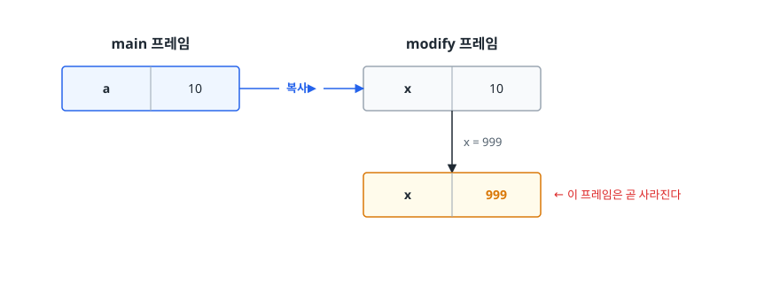
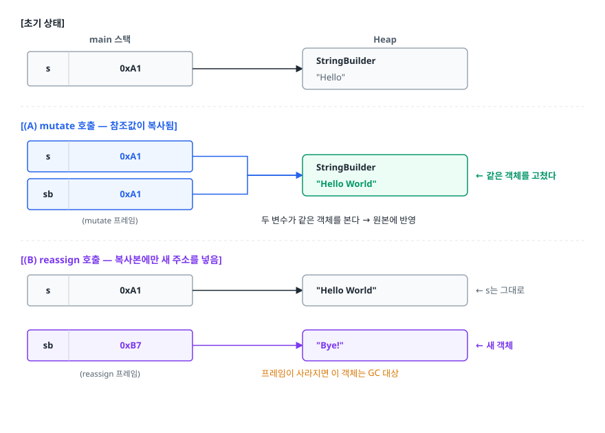

# Call by Value와 참조의 착시 (Call by Value in Java)

> Java에 Call by Reference가 존재하지 않는다는 사실을 코드로 증명하고 참조값 복사가 만드는 착시가 어떤 버그로 이어지는지, 불변 객체와 방어적 복사가 왜 해답인지 설명할 수 있게 됩니다.

## 학습 목표

- [ ] Java가 항상 Call by Value임을 `swap` 예제로 증명할 수 있다
- [ ] "객체가 바뀌었다"와 "변수가 다른 객체를 가리킨다"를 구분할 수 있다
- [ ] getter가 내부 컬렉션을 그대로 반환할 때 생기는 버그를 예측할 수 있다
- [ ] 방어적 복사(Defensive Copy)를 어디에 넣어야 하는지 안다
- [ ] 진짜 불변 객체를 만드는 조건 다섯 가지를 말할 수 있다

## 선행 지식

- [02-memory-model.md](./02-memory-model.md) - 스택에 참조가, 힙에 객체가 있다는 그림

---

## 1. 왜 헷갈리는가

이 코드를 보고 대부분 "Java는 참조를 넘기는구나"라고 생각합니다.

```java
void rename(User user) {
    user.setName("Kim");
}

User u = new User("Lee");
rename(u);
System.out.println(u.getName());   // Kim - 원본이 바뀌었다!
```

그런데 이 코드는 안 됩니다.

```java
void replace(User user) {
    user = new User("Park");
}

User u = new User("Lee");
replace(u);
System.out.println(u.getName());   // 여전히 Lee
```

같은 참조 타입인데 하나는 원본이 바뀌고 하나는 안 바뀝니다. 이 두 결과를 **하나의 규칙으로** 설명하지 못하면 이후에 나올 방어적 복사나 불변 객체 이야기가 전부 암기가 됩니다.

---

## 2. 용어부터 정확히

| 방식 | 매개변수에 담기는 것 | 매개변수에 새 값을 대입하면 |
|------|---------------------|--------------------------|
| **Call by Value** | 호출부 값의 **복사본** | 호출부는 영향 없음 |
| **Call by Reference** | 호출부 **변수 자체의 별칭** | 호출부 변수도 함께 바뀜 |

**"객체가 바뀌느냐"가 아니라 "호출부의 *변수*가 다른 것을 가리키게 되느냐"** 가 핵심입니다. 이 구분이 두 방식을 가르는 유일한 기준입니다.

C++에는 진짜 Call by Reference가 있습니다.

```cpp
// C++ — 참조자(&)를 쓰면 호출부 변수 자체가 넘어간다
void replace(User*& user) {
    user = new User("Park");
}
// 호출 후 호출부의 포인터 변수도 새 객체를 가리킨다
```

Java에는 이런 문법이 없습니다. **Java에서 메서드에 넘길 수 있는 것은 오직 값(원시 값 또는 참조값)의 복사본뿐입니다.**

> **비유**: 친구에게 집 주소가 적힌 쪽지를 복사해 줍니다. 친구가 그 주소로 찾아가 가구를 옮기면 내 집도 바뀝니다(객체 상태 변경). 하지만 친구가 자기 쪽지를 지우고 다른 주소를 적어도 내 쪽지는 그대로입니다(참조 재할당).
> **비유의 한계**: 쪽지의 "주소"는 사람이 읽을 수 있지만 Java의 참조값은 개발자가 볼 수도 연산할 수도 없습니다. 그래서 C의 포인터 산술 같은 건 불가능합니다.

---

## 3. 증명 1 — 원시 타입

```java
public class Proof1 {
    static void modify(int x) {
        x = 999;
        System.out.println("메서드 안: " + x);   // 999
    }

    public static void main(String[] args) {
        int a = 10;
        modify(a);
        System.out.println("메서드 밖: " + a);   // 10
    }
}
```

<!-- diagram:be-call-by-value-reference-1 -->


<!-- 위 그림이 대체한 원본 ASCII.
     내용을 고칠 때는 그림도 함께 갱신할 것.
```
     main 프레임              modify 프레임
   ┌──────────────┐         ┌──────────────┐
   │  a  │   10   │  복사▶  │  x  │   10   │
   └──────────────┘         └──────┬───────┘
                                   │ x = 999
                            ┌──────▼───────┐
                            │  x  │  999   │  ← 이 프레임은 곧 사라진다
                            └──────────────┘
```
-->

여기까지는 이견이 없습니다. 값이 복사됐습니다.

---

## 4. 증명 2 — 참조 타입에서 벌어지는 일

```java
public class Proof2 {
    static void mutate(StringBuilder sb) {
        sb.append(" World");       // (A) 가리키는 객체를 수정
    }

    static void reassign(StringBuilder sb) {
        sb = new StringBuilder("Bye");   // (B) 참조 복사본만 갈아끼움
        sb.append("!");
    }

    public static void main(String[] args) {
        StringBuilder s = new StringBuilder("Hello");

        mutate(s);
        System.out.println(s);   // Hello World

        reassign(s);
        System.out.println(s);   // Hello World  (Bye! 아님)
    }
}
```

<!-- diagram:be-call-by-value-reference-2 -->


<!-- 위 그림이 대체한 원본 ASCII.
     내용을 고칠 때는 그림도 함께 갱신할 것.
```
[초기 상태]
   main 스택                     Heap
 ┌──────────────┐        ┌────────────────────┐
 │ s │ 0xA1 ────┼───────▶│ StringBuilder      │
 └──────────────┘        │  "Hello"           │
                         └────────────────────┘

[(A) mutate 호출 — 참조값이 복사됨]
 ┌──────────────┐        ┌────────────────────┐
 │ s  │ 0xA1 ───┼───┐    │ StringBuilder      │
 └──────────────┘   ├───▶│  "Hello World"     │ ← 같은 객체를 고쳤다
 ┌──────────────┐   │    └────────────────────┘
 │ sb │ 0xA1 ───┼───┘
 └──────────────┘
   (mutate 프레임)     두 변수가 같은 객체를 본다 → 원본에 반영

[(B) reassign 호출 — 복사본에만 새 주소를 넣음]
 ┌──────────────┐        ┌────────────────────┐
 │ s  │ 0xA1 ───┼───────▶│ "Hello World"      │  ← s는 그대로
 └──────────────┘        └────────────────────┘
 ┌──────────────┐        ┌────────────────────┐
 │ sb │ 0xB7 ───┼───────▶│ "Bye!"             │  ← 새 객체
 └──────────────┘        └────────────────────┘
   (reassign 프레임)      프레임이 사라지면 이 객체는 GC 대상
```
-->

**두 결과를 하나의 규칙으로 설명하면**: 메서드가 받은 것은 참조값의 **복사본**입니다. 복사본으로 화살표를 따라가 객체를 고치면 원본에도 보입니다. 하지만 복사본에 새 주소를 넣는 것은 **내 프레임의 변수 하나를 바꾼 것**일 뿐 호출부 변수와 무관합니다.

---

## 5. 증명 3 — swap이 불가능하다는 결정적 증거

Call by Reference인 언어에서는 두 변수를 교환하는 메서드를 만들 수 있습니다. Java에서는 **어떤 수를 써도 만들 수 없습니다.**

```java
public class Proof3 {
    static <T> void swap(T a, T b) {
        T temp = a;
        a = b;
        b = temp;
    }

    public static void main(String[] args) {
        String x = "첫번째";
        String y = "두번째";

        swap(x, y);
        System.out.println(x + ", " + y);   // 첫번째, 두번째  — 그대로다
    }
}
```

`a`와 `b`는 `swap` 프레임 안의 지역 변수일 뿐입니다. 이들을 아무리 뒤바꿔도 `main`의 `x`, `y`에는 닿을 방법이 없습니다.

Java에서 교환 효과를 내려면 **교환할 대상을 담은 컨테이너를 넘겨서 그 컨테이너의 내용을 바꿔야** 합니다.

```java
static <T> void swap(T[] arr, int i, int j) {
    T temp = arr[i];
    arr[i] = arr[j];
    arr[j] = temp;
}
// 배열 객체 자체의 내부 상태를 바꾼 것이지, 변수를 교환한 게 아니다
```

**이것이 "Java는 항상 Call by Value"의 가장 명확한 증거입니다.** 면접에서 이 예제 하나면 설명이 끝납니다.

---

## 6. String과 배열이 헷갈리는 이유

```java
static void change(String s) {
    s = s + " World";   // 새 String 객체가 만들어져 s에 대입될 뿐
}

static void change(int[] arr) {
    arr[0] = 999;       // 배열 객체의 내부를 수정
}

String str = "Hello";
int[] nums = {1, 2, 3};

change(str);   // "Hello" 그대로
change(nums);  // {999, 2, 3} 으로 바뀜
```

둘 다 참조 타입인데 결과가 다릅니다. 규칙은 여전히 하나입니다.

- **String은 불변**이라 "내용을 수정하는 연산"이 존재하지 않습니다. `+`는 새 객체를 만듭니다. 그래서 참조 재할당(B 케이스)밖에 일어날 수 없고 원본은 절대 안 바뀝니다.
- **배열은 가변**이라 `arr[0] = 999`가 객체 내부 수정(A 케이스)입니다.

**불변이냐 가변이냐가 결과를 가릅니다.** Call by Value 여부가 아닙니다. 다음 절이 여기서 출발합니다.

---

## 7. 착시가 만드는 실제 버그 — 캡슐화가 뚫린다

### 안티패턴 — getter가 내부 컬렉션을 그대로 반환

```java
public class Order {
    private final List<OrderLine> lines = new ArrayList<>();
    private OrderStatus status = OrderStatus.DRAFT;

    public void addLine(OrderLine line) {
        if (status != OrderStatus.DRAFT) {
            throw new IllegalStateException("확정된 주문은 수정할 수 없습니다");
        }
        lines.add(line);
    }

    public List<OrderLine> getLines() {
        return lines;      // 내부 리스트를 그대로 넘긴다
    }
}
```

**왜 문제인가**: `addLine`에 애써 넣은 상태 검증이 무력화됩니다.

```java
Order order = ...;   // 이미 CONFIRMED 상태
order.addLine(newLine);          // IllegalStateException — 정상 동작
order.getLines().add(newLine);   // 통과해버린다!
```

`getLines()`가 돌려준 것은 리스트의 **복사본이 아니라 내부 리스트를 가리키는 참조값**입니다. 외부에서 이 참조로 `add()`를 호출하면 `Order`의 검증을 건너뛰고 내부 상태가 바뀝니다. 캡슐화가 완전히 뚫린 것입니다.

### 개선 — 방어적 복사

```java
public class Order {
    private final List<OrderLine> lines = new ArrayList<>();

    // 들어올 때도 복사한다
    public Order(List<OrderLine> initialLines) {
        this.lines.addAll(initialLines);   // 호출자가 준 리스트를 그대로 보관하지 않는다
    }

    // 나갈 때도 복사한다
    public List<OrderLine> getLines() {
        return List.copyOf(lines);         // 불변 복사본
    }
}
```

**생성자에서도 복사해야 하는 이유**를 놓치기 쉽습니다.

```java
List<OrderLine> input = new ArrayList<>();
input.add(lineA);
Order order = new Order(input);

input.add(lineB);   // 복사하지 않았다면 order 내부까지 바뀐다
```

**"경계를 넘나드는 가변 객체는 들어올 때와 나갈 때 모두 복사한다"** 가 원칙입니다.

### `unmodifiableList`와 `copyOf`의 차이

```java
List<String> internal = new ArrayList<>(List.of("a"));

List<String> view = Collections.unmodifiableList(internal);  // 읽기 전용 "뷰"
List<String> copy = List.copyOf(internal);                   // 진짜 복사본

internal.add("b");

System.out.println(view);   // [a, b]  ← 원본 변화가 그대로 보인다
System.out.println(copy);   // [a]     ← 영향 없음
```

`unmodifiableList`는 **수정만 막는 창문**이지 복사가 아닙니다. 원본이 바뀌면 뷰도 바뀝니다. 내부 리스트를 계속 변경하는 클래스에서 이걸 반환하면 여전히 외부에 내부 상태 변화가 노출됩니다. 확실히 끊으려면 `List.copyOf`(Java 10+) 또는 `new ArrayList<>(internal)`을 씁니다.

### 얕은 복사의 함정

```java
public List<OrderLine> getLines() {
    return List.copyOf(lines);   // 리스트는 복사됐지만...
}

order.getLines().get(0).setQuantity(999);   // 원소가 가변이면 뚫린다
```

리스트를 복사해도 **원소 객체는 같은 것을 공유**합니다(얕은 복사). 원소가 가변이면 여전히 내부 상태가 바뀝니다. 근본 해법은 **원소를 불변으로 만드는 것**입니다.

---

## 8. 불변 객체가 왜 안전한가

불변 객체는 만들어진 뒤 상태가 절대 바뀌지 않습니다. 그래서 아래 문제들이 **애초에 발생하지 않습니다.**

- **방어적 복사가 불필요**합니다. 넘겨줘도 상대가 바꿀 수 없습니다.
- **스레드 안전**합니다. 바뀌는 값이 없으니 경쟁 조건이 없고 락도 필요 없습니다.
- **HashMap 키로 안전**합니다. 키를 넣은 뒤 필드를 바꾸면 해시가 달라져 그 엔트리를 영영 못 찾는데, 불변이면 그런 일이 없습니다.
- **디버깅이 쉽습니다.** 값이 잘못됐으면 만든 곳 하나만 보면 됩니다.

### 불변 객체를 만드는 조건

```java
public final class Money {                      // 1. 클래스를 final로 (상속으로 깨지 못하게)
    private final long amount;                  // 2. 모든 필드 private final
    private final Currency currency;
    private final List<String> tags;

    public Money(long amount, Currency currency, List<String> tags) {
        this.amount = amount;
        this.currency = currency;
        this.tags = List.copyOf(tags);          // 3. 가변 인자는 복사해서 보관
    }

    public List<String> getTags() {
        return tags;                            // 4. 이미 불변이라 그대로 반환 가능
    }

    public Money plus(Money other) {            // 5. 변경 대신 새 객체 반환
        if (!currency.equals(other.currency)) {
            throw new IllegalArgumentException("통화가 다릅니다");
        }
        return new Money(amount + other.amount, currency, tags);
    }
}
```

정리하면 이렇습니다.

1. 클래스를 `final`로 (또는 생성자를 `private`으로) 만들어 하위 클래스가 가변성을 끼워 넣지 못하게 한다
2. 모든 필드를 `private final`로 선언한다
3. 가변 객체를 생성자로 받으면 **복사해서** 보관한다
4. 가변 객체를 반환할 때도 **복사해서** 내보낸다 (또는 불변 컬렉션으로 보관)
5. 상태를 바꾸는 메서드 대신 **새 인스턴스를 반환하는 메서드**를 만든다

### record는 어디까지 불변인가

Java 16의 `record`는 필드가 `final`이고 접근자가 자동 생성되지만 **참조하는 객체까지 불변으로 만들어주지는 않습니다.**

```java
// 겉보기엔 불변이지만 실제로는 아니다
public record Team(String name, List<String> members) { }

List<String> list = new ArrayList<>(List.of("kim"));
Team team = new Team("A", list);
list.add("lee");                 // team.members()도 바뀐다
team.members().add("park");      // 이것도 통과된다
```

```java
// compact 생성자에서 방어적 복사
public record Team(String name, List<String> members) {
    public Team {
        members = List.copyOf(members);   // 검증·정규화 지점
    }
}
```

`record`가 보장하는 것은 **"필드 참조가 다른 객체를 가리키도록 바뀌지 않는다"** 까지입니다. 그 너머는 직접 처리해야 합니다.

---

## 9. 실무에서는

- **JPA 엔티티의 컬렉션**: `getOrderLines()`가 Hibernate의 영속성 컬렉션을 그대로 반환하면 외부에서 `add()`한 것이 그대로 DB에 반영됩니다. 도메인 규칙을 강제하려면 컬렉션은 `Collections.unmodifiableList` 또는 복사본으로 내보내고 변경은 `addOrderLine()` 같은 의미 있는 메서드로만 하게 합니다.
- **DTO와 엔티티의 경계**: 컨트롤러가 엔티티를 그대로 반환하면 영속성 컨텍스트의 객체가 직렬화 계층까지 흘러갑니다. DTO로 변환하는 것은 화면 스펙 분리 목적도 있지만 **참조를 끊는 방어적 복사** 성격이 큽니다.
- **`java.time` vs 옛날 `Date`**: `java.util.Date`는 가변이라 필드로 보관하려면 매번 복사해야 했습니다. `LocalDate`, `LocalDateTime`, `Instant`는 불변이라 그럴 필요가 없습니다. 새 코드에서 `Date`를 쓰지 않는 실질적인 이유 중 하나입니다.
- **설정 객체**: 애플리케이션 기동 시 읽어 여러 스레드가 공유하는 설정은 불변으로 만들면 동기화가 통째로 사라집니다.

---

## 10. 면접 포인트

> 면접에서 이 주제가 나오면 이렇게 답한다

**Q. Java는 Call by Value인가요, Call by Reference인가요?**
A. 항상 Call by Value입니다. 참조 타입도 참조값의 복사본이 전달됩니다. 가장 명확한 증거는 `swap` 메서드를 만들 수 없다는 점입니다. 메서드 안에서 매개변수에 새 객체를 대입해도 호출부 변수는 그대로입니다. 반면 복사된 참조로 객체 내부를 수정하면 같은 객체를 보고 있으므로 원본에 반영됩니다. 이 두 결과가 "참조값이 복사된다"는 하나의 규칙으로 설명됩니다.
- 꼬리 질문: "그럼 왜 Call by Reference처럼 보이나요?" → "두 변수가 같은 객체를 가리키기 때문입니다. 하지만 Call by Reference라면 매개변수에 재할당했을 때 호출부 변수도 바뀌어야 하는데, Java는 그렇지 않습니다."

**Q. 방어적 복사가 왜 필요한가요? 어디에 넣나요?**
A. 가변 객체의 참조가 클래스 경계를 넘으면 외부에서 내부 상태를 검증 없이 바꿀 수 있기 때문입니다. 생성자에서 가변 객체를 받을 때와 getter로 내보낼 때 양쪽 모두 복사해야 합니다. 한쪽만 하면 다른 쪽으로 뚫립니다.
- 꼬리 질문: "`Collections.unmodifiableList`면 충분한가요?" → "부족합니다. 그건 원본을 감싼 읽기 전용 뷰라서 원본이 바뀌면 함께 바뀝니다. 완전히 끊으려면 `List.copyOf`처럼 복사본을 만들어야 합니다. 그리고 원소 자체가 가변이면 얕은 복사라 여전히 뚫립니다."

**Q. 불변 객체의 장점을 설명해주세요.**
A. 상태가 안 바뀌므로 여러 스레드가 락 없이 공유할 수 있습니다. 방어적 복사가 필요 없고 HashMap 키로 써도 해시가 변하지 않아 안전합니다. 값이 잘못됐을 때 생성 지점 한 곳만 보면 되므로 디버깅도 쉽습니다. 단점은 값이 바뀔 때마다 새 객체를 만들어 GC 부담이 늘 수 있다는 점입니다.
- 꼬리 질문: "`record`를 쓰면 자동으로 불변인가요?" → "필드 재할당이 막히는 것까지입니다. 필드가 `List` 같은 가변 객체를 가리키면 그 내부는 여전히 바뀝니다. compact 생성자에서 `List.copyOf`로 복사해야 진짜 불변이 됩니다."

---

## 자주 하는 실수

| 실수 | 왜 틀렸나 | 올바른 이해 |
|------|----------|-----------|
| "참조 타입은 Call by Reference" | 참조값의 복사본이 전달된다 | 재할당이 호출부에 반영되지 않으면 Call by Value |
| 메서드 안에서 매개변수에 `new`로 대입해 결과를 넘기려 함 | 내 프레임 변수만 바뀐다 | 반환값을 쓰거나 객체 내부를 수정한다 |
| getter로 내부 `List`를 그대로 반환 | 외부에서 검증 없이 내부 상태 변경 가능 | 복사본 또는 불변 컬렉션 반환 |
| 생성자에서 받은 컬렉션을 그대로 필드에 대입 | 호출자가 원본을 계속 들고 있어 나중에 수정 가능 | 생성자에서도 복사 |
| `unmodifiableList`를 복사본으로 착각 | 원본을 감싼 뷰라 원본 변경이 반영됨 | `List.copyOf` 또는 `new ArrayList<>(...)` |
| `record`면 완전 불변이라고 믿음 | 가변 필드의 내부는 여전히 변경 가능 | compact 생성자에서 방어적 복사 |
| 컬렉션만 복사하고 원소는 그대로 둠 | 얕은 복사라 원소 수정이 새어나감 | 원소를 불변 타입으로 만든다 |

---

## 한 줄 정리

Java에서 넘어가는 것은 언제나 **값의 복사본**입니다. 원본이 바뀐 것처럼 보이는 이유는 **복사된 참조가 같은 객체를 가리키기 때문**입니다. 이 착시를 막는 도구가 방어적 복사와 불변 객체입니다.

---

## 연관 개념

- [02-memory-model.md](./02-memory-model.md) - 스택의 참조와 힙의 객체가 놓이는 위치
- [01-oop-solid.md](./01-oop-solid.md) - 캡슐화가 방어적 복사 없이는 완성되지 않는 이유
- [03-garbage-collection.md](./03-garbage-collection.md) - 참조를 놓지 않으면 회수되지 않는다
- [qna-java.md](./qna-java.md) - Call by Value·불변 객체 면접 질문
- [../../01-computer-science-fundamentals/operating-system/04-deadlock-race-condition.md](../../01-computer-science-fundamentals/operating-system/04-deadlock-race-condition.md) - 불변 객체가 원천 차단하는 경쟁 조건
