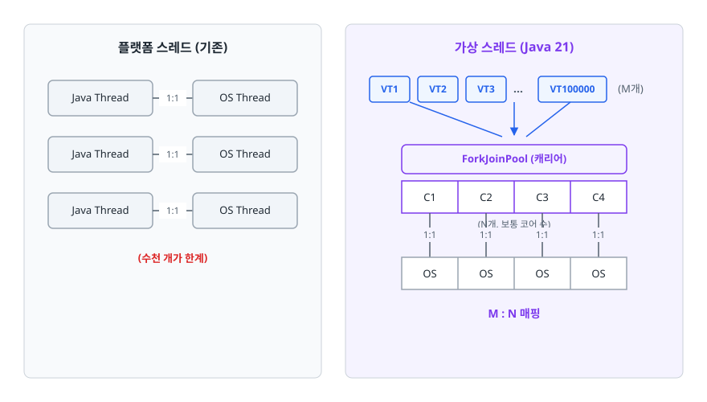
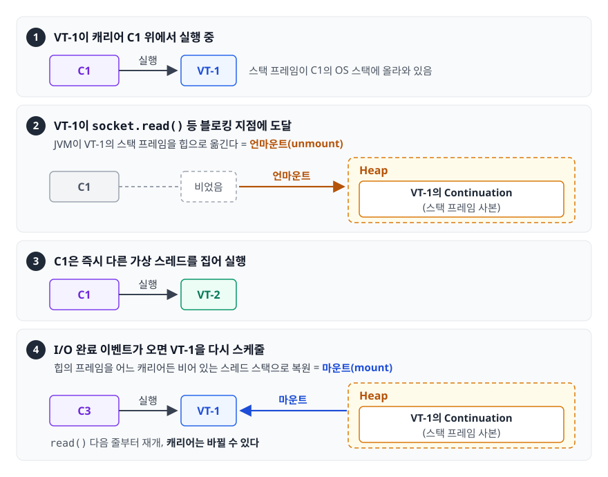

# 가상 스레드 (Virtual Threads, Java 21)

> 가상 스레드는 블로킹 코드를 그대로 두고 처리량을 얻는 대신, 쓸 수 없는 자리가 생기는 기술입니다. 플랫폼 스레드가 왜 동시성의 병목이 됐는지, 가상 스레드가 마운트/언마운트로 그것을 어떻게 우회하는지, 어떤 상황에서는 오히려 쓰면 안 되는지를 이 문서에서 따져 봅니다.

## 학습 목표

- [ ] thread-per-request 모델의 한계(C10K)를 스레드 비용 관점에서 설명할 수 있다
- [ ] 마운트/언마운트와 캐리어 스레드의 역할을 그림으로 그릴 수 있다
- [ ] 가상 스레드를 쓸 상황과 쓰면 안 되는 상황을 근거를 대고 구분할 수 있다
- [ ] 피닝(Pinning)이 무엇이고 어떻게 진단·회피하는지 안다
- [ ] 가상 스레드를 스레드 풀에 넣으면 안 되는 이유를 말할 수 있다

## 선행 지식

- [../../01-computer-science-fundamentals/operating-system/01-process-thread.md](../../01-computer-science-fundamentals/operating-system/01-process-thread.md) - 스레드와 컨텍스트 스위칭
- [02-memory-model.md](./02-memory-model.md) - 스택 프레임과 힙

---

## 1. 왜 필요한가 — C10K 문제

전형적인 Java 웹 애플리케이션은 **요청 하나에 스레드 하나(thread-per-request)** 를 배정합니다. 코드가 읽기 쉽고, 스택 트레이스가 온전하고, 디버거로 한 줄씩 따라갈 수 있습니다. 장점이 많은 모델입니다. 문제는 이 스레드가 **OS 스레드와 1:1로 묶여 있다**는 데 있습니다.

```java
// 이 메서드가 한 요청을 처리하는 동안 OS 스레드 하나를 통째로 점유한다
public OrderView getOrder(Long id) {
    Order order = orderRepository.findById(id);      // DB 왕복 20ms — 스레드는 그냥 대기
    User user = userClient.fetch(order.getUserId()); // 외부 API 80ms — 또 대기
    Coupon coupon = couponClient.fetch(id);          // 외부 API 50ms — 또 대기
    return OrderView.of(order, user, coupon);
}
```

실제 CPU를 쓰는 시간은 1ms도 안 되는데, **150ms 동안 OS 스레드를 붙들고 있습니다.** 스레드 풀이 200개라면 초당 처리 가능한 요청은 대략 `200 / 0.15초 ≈ 1,300건`에서 막힙니다. 트래픽이 늘어 풀이 고갈되면 요청은 큐에서 기다리다 타임아웃이 납니다.

그럼 스레드를 10만 개 만들면 되지 않을까요? 안 됩니다.

| 비용 항목 | 플랫폼 스레드 |
|-----------|--------------|
| 스택 메모리 | 스레드당 수백 KB~1MB 예약 (`-Xss` 기본값 수준) |
| 생성 비용 | 커널 진입 필요, 마이크로초 단위 |
| 컨텍스트 스위칭 | 커널이 수행, 스케줄러 부하가 스레드 수에 따라 증가 |
| 개수 한계 | OS 설정·메모리에 종속, 보통 수천 개 수준에서 현실적 한계 |

이것이 **C10K 문제**(동시 연결 1만 개를 어떻게 처리할 것인가)의 Java 버전입니다.

### 기존 해법과 그 대가

업계는 **비동기·논블로킹**으로 우회했습니다. `CompletableFuture`, Netty, Spring WebFlux가 그 결과물입니다. 스레드를 대기시키지 않고 콜백으로 이어 붙이면 적은 스레드로 많은 요청을 처리할 수 있습니다.

```java
// 리액티브 - 스레드는 대기하지 않지만 코드의 성격이 완전히 달라진다
public Mono<OrderView> getOrder(Long id) {
    return orderRepository.findById(id)
            .flatMap(order -> Mono.zip(
                    userClient.fetch(order.getUserId()),
                    couponClient.fetch(id))
                .map(tuple -> OrderView.of(order, tuple.getT1(), tuple.getT2())));
}
```

대가는 작지 않습니다.

- **스택 트레이스가 쓸모없어집니다.** 예외가 터진 지점이 이벤트 루프 스레드라 "어떤 요청의 어느 흐름에서 났는지"가 안 보입니다.
- **디버거의 스텝 실행이 의미를 잃습니다.** 한 줄씩 따라가면 파이프라인 조립 코드만 지나갑니다.
- **`ThreadLocal` 기반 도구가 깨집니다.** 트랜잭션 컨텍스트, MDC 로깅, 보안 컨텍스트가 스레드에 붙어 있는데 스레드가 계속 바뀝니다.
- **한 곳이라도 블로킹하면 전체가 무너집니다.** 이벤트 루프 스레드에서 JDBC를 호출하는 순간 수천 요청이 같이 멈춥니다.

**가상 스레드는 이 대가 없이 처리량만 가져오는 것을 목표로 합니다.** 코드는 예전 그대로 블로킹 스타일로 쓰고, 대기 처리는 JVM이 알아서 합니다.

> **비유**: 콜센터. 플랫폼 스레드는 상담원이 고객과 통화하다 "서류 떼고 오겠다"는 말을 들으면 수화기를 든 채로 같이 기다립니다. 가상 스레드는 그 통화를 잠시 내려놓고(언마운트) 다른 통화를 받다가, 고객이 돌아오면 다시 그 통화를 집습니다(마운트).
> **비유의 한계**: 상담원 수(= CPU 코어 수)는 그대로입니다. **모든 고객이 계산 문제를 물어보는 상황(CPU 바운드)에서는 아무 이득이 없습니다.**

---

## 2. 가상 스레드가 동작하는 방식

가상 스레드는 **JVM이 스케줄링하는 스레드**입니다. OS는 그 존재를 모릅니다. 실제로 코드를 실행할 때만 **캐리어 스레드(Carrier Thread)** 라 부르는 진짜 OS 스레드 위에 올라탑니다.

<!-- diagram:be-java21-virtual-threads-1 -->


<!-- 위 그림이 대체한 원본 ASCII.
     내용을 고칠 때는 그림도 함께 갱신할 것.
```
        플랫폼 스레드 (기존)                    가상 스레드 (Java 21)

  Java Thread ──1:1── OS Thread          VT1 VT2 VT3 ... VT100000
  Java Thread ──1:1── OS Thread              ╲  │  ╱   (M개)
  Java Thread ──1:1── OS Thread                 ▼
       (수천 개가 한계)                  ForkJoinPool (캐리어)
                                        ┌────┬────┬────┬────┐
                                        │ C1 │ C2 │ C3 │ C4 │  (N개, 보통 코어 수)
                                        └─┬──┴─┬──┴─┬──┴─┬─┘
                                          1:1  1:1  1:1  1:1
                                        ┌────┬────┬────┬────┐
                                        │ OS │ OS │ OS │ OS │
                                        └────┴────┴────┴────┘
                                              M : N 매핑
```
-->

### 마운트와 언마운트

**가상 스레드의 스택은 힙에 저장됩니다.**

<!-- diagram:be-java21-virtual-threads-2 -->


<!-- 위 그림이 대체한 원본 ASCII.
     내용을 고칠 때는 그림도 함께 갱신할 것.
```
[1] VT-1이 캐리어 C1 위에서 실행 중
    ┌──────────┐
    │   C1     │ ── 실행 ──▶ VT-1  (스택 프레임이 C1의 OS 스택에 올라와 있음)
    └──────────┘

[2] VT-1이 socket.read() 등 블로킹 지점에 도달
    JVM이 VT-1의 스택 프레임을 힙으로 옮긴다 = 언마운트(unmount)

    ┌──────────┐                    Heap
    │   C1     │ ── 비었음          ┌─────────────────────┐
    └──────────┘                    │ VT-1의 Continuation │
                                    │  (스택 프레임 사본)  │
                                    └─────────────────────┘

[3] C1은 즉시 다른 가상 스레드를 집어 실행
    ┌──────────┐
    │   C1     │ ── 실행 ──▶ VT-2
    └──────────┘

[4] I/O 완료 이벤트가 오면 VT-1을 다시 스케줄
    힙의 프레임을 어느 캐리어든 비어 있는 스레드 스택으로 복원 = 마운트(mount)
    ┌──────────┐
    │   C3     │ ── 실행 ──▶ VT-1  (read() 다음 줄부터 재개, 캐리어는 바뀔 수 있다)
    └──────────┘
```
-->

여기서 놓치면 안 되는 게 두 가지 있습니다.

1. **언마운트/마운트는 커널을 거치지 않습니다.** JVM 내부에서 힙 복사만 일어나므로 OS 컨텍스트 스위칭보다 훨씬 쌉니다.
2. **재개할 때 캐리어가 바뀔 수 있습니다.** 그래서 `Thread.currentThread()`를 키로 삼는 로직이나 캐리어 스레드에 붙은 상태는 신뢰할 수 없습니다.

캐리어 풀은 전용 `ForkJoinPool`이며 기본 병렬도는 사용 가능한 프로세서 수입니다. `jdk.virtualThreadScheduler.parallelism` 시스템 프로퍼티로 조정할 수 있지만, 대개 손댈 이유가 없습니다.

**JDK의 블로킹 API 상당수가 가상 스레드를 인식하도록 다시 구현됐습니다.** 소켓 입출력(`Socket`, `SocketChannel`), `HttpClient`, `Thread.sleep()`, `BlockingQueue`, `ReentrantLock` 등에서 블로킹이 일어나면 캐리어를 붙들지 않고 언마운트합니다. 그래서 **기존 블로킹 코드를 거의 그대로 두고도 이득을 볼 수 있습니다.**

다만 "모든 블로킹"은 아닙니다. Java 21 시점에 **파일 I/O(`FileInputStream`, `RandomAccessFile` 등)는 언마운트되지 않고** 캐리어 스레드를 그대로 붙잡습니다. 스케줄러가 캐리어를 임시로 늘려 보완하지만, 대량의 파일 I/O가 주된 워크로드라면 가상 스레드의 이득이 기대만큼 나오지 않습니다. 네트워크 I/O가 병목일 때가 가상 스레드에 가장 잘 맞습니다.

---

## 3. 코드로 보기

```java
// 1. 단발성 가상 스레드
Thread vt = Thread.ofVirtual()
        .name("order-worker")
        .start(() -> System.out.println("실행: " + Thread.currentThread()));
vt.join();

// 2. 더 짧게
Thread.startVirtualThread(() -> doWork());

// 3. 실무에서 가장 많이 쓰는 형태 - 작업마다 가상 스레드 하나
try (var executor = Executors.newVirtualThreadPerTaskExecutor()) {
    List<Future<String>> futures = ids.stream()
            .map(id -> executor.submit(() -> apiClient.fetch(id)))   // 블로킹 코드 그대로
            .toList();

    for (Future<String> f : futures) {
        System.out.println(f.get());
    }
}   // close()에서 모든 작업 완료를 기다린다
```

`newVirtualThreadPerTaskExecutor()`는 이름 그대로 **풀이 아닙니다.** 제출된 작업마다 새 가상 스레드를 만들고 끝나면 버립니다. 가상 스레드는 생성이 싸기 때문에 재사용할 이유가 없습니다.

Java 21에는 **구조적 동시성(Structured Concurrency)** 도 함께 들어왔습니다. 여러 하위 작업의 생명주기를 묶어 다루는 API인데, 아직 프리뷰라 릴리스마다 형태가 바뀌고 있습니다. 개념만 알아두고 **운영 코드에서는 확정된 API가 나온 뒤 도입**하는 편이 안전합니다.

### 가상 스레드의 제약

| 항목 | 동작 |
|------|------|
| 데몬 여부 | 항상 데몬 스레드. `setDaemon(false)` 불가 |
| 우선순위 | 항상 기본값. `setPriority()`는 효과 없음 |
| 스레드 그룹 | 지정 불가 |
| 스택 크기 | `-Xss`로 고정하지 않고 필요한 만큼 힙에서 사용 |

가상 스레드는 **모두 데몬**이므로, JVM은 가상 스레드가 남아 있어도 종료됩니다. `main`이 끝나기 전에 `join()`하거나 executor의 `close()`로 완료를 기다려야 합니다.

---

## 4. 언제 쓰고, 언제 쓰면 안 되는가

### 잘 맞는 경우 — I/O 바운드

한 요청이 대기에 쓰는 시간이 계산에 쓰는 시간을 압도할 때입니다. DB 조회, 외부 API 호출, 메시지 브로커 대기가 여기 해당합니다. 파일 I/O는 앞에서 본 것처럼 예외입니다. 대기 중인 가상 스레드는 캐리어를 점유하지 않으므로, 코어 수만큼의 스레드로 수만 건의 동시 요청을 감당할 수 있습니다.

### 안 맞는 경우 1 — CPU 바운드

```java
// 안티패턴 - 이미지 리사이징에 가상 스레드 1만 개
try (var executor = Executors.newVirtualThreadPerTaskExecutor()) {
    for (Image img : images) {
        executor.submit(() -> resize(img));   // 순수 계산
    }
}
```

**왜 문제인가**: 계산 작업은 언마운트할 지점이 없습니다. 가상 스레드 1만 개가 만들어져도 실제로 도는 것은 캐리어(코어 수)만큼이고, 나머지는 큐에서 대기합니다. 이득은 없고 **가상 스레드 객체와 힙 스택 때문에 메모리와 GC 부담만 늘어납니다.**

```java
// 개선 - CPU 바운드는 코어 수 기반 고정 풀이 정석
ExecutorService cpuPool = Executors.newFixedThreadPool(
        Runtime.getRuntime().availableProcessors());
```

### 안 맞는 경우 2 — 아주 긴 수명의 연결

WebSocket이나 SSE처럼 연결이 수십 분 유지되는 경우, 가상 스레드는 그 시간 내내 힙에 스택(Continuation)을 유지합니다. 연결이 수만 개면 힙 부담이 상당합니다. 이런 스트리밍 워크로드에는 이벤트 루프 모델(Netty·WebFlux)이 여전히 유리합니다. 연결을 스레드에 묶지 않기 때문입니다.

### 비교표

| 기준 | 플랫폼 스레드 풀 | 가상 스레드 | 리액티브(WebFlux) |
|------|-----------------|-----------|------------------|
| 코드 스타일 | 블로킹(동기) | 블로킹(동기) | 파이프라인 조립 |
| 동시 처리 한계 | 풀 크기 | 수십만 이상 | 매우 높음 |
| 스택 트레이스 | 온전함 | 온전함 | 끊김 |
| `ThreadLocal` 기반 도구 | 정상 동작 | 동작(단, 남용 주의) | 그대로는 깨짐, 별도 컨텍스트 전파 필요 |
| 학습·전환 비용 | 없음 | 낮음 | 높음 |
| CPU 바운드 | 적합 | 부적합 | 부적합 |
| 장기 연결 스트리밍 | 부적합 | 부담 큼 | 적합 |

**한 줄 결론**: 기존 블로킹 코드베이스에서 I/O 대기가 병목이면 가상 스레드입니다. 계산이 병목이면 고정 스레드 풀, 초장기 연결을 대량으로 다뤄야 하면 리액티브를 고릅니다.

---

## 5. 피닝 (Pinning) — 가장 중요한 함정

피닝은 가상 스레드가 블로킹됐는데도 **언마운트하지 못하고 캐리어를 붙들고 있는** 상태입니다. 피닝이 캐리어 수만큼 쌓이면 나머지 가상 스레드가 전부 멈춥니다. 최악의 경우 데드락처럼 보이는 정지가 생깁니다.

Java 21 기준으로 피닝이 발생하는 지점은 두 가지입니다.

1. **`synchronized` 블록/메서드 안에서 블로킹할 때**
2. **네이티브 프레임(JNI) 안에서 블로킹할 때**

```java
// 안티패턴 (Java 21 기준)
public class RateLimiter {
    public synchronized void acquire() {
        httpClient.send(request, ...);   // synchronized 안에서 블로킹 → 피닝
    }
}
```

**왜 문제인가**: `synchronized`의 모니터 락은 OS 스레드에 귀속된 구조라, 락을 잡은 채로 가상 스레드를 다른 캐리어로 옮길 수 없습니다. 그래서 JVM이 언마운트를 포기하고 캐리어를 그대로 붙잡습니다. 캐리어가 코어 수만큼밖에 없으므로 금방 고갈됩니다.

```java
// 개선 - ReentrantLock은 가상 스레드를 인식해 언마운트한다
public class RateLimiter {
    private final ReentrantLock lock = new ReentrantLock();

    public void acquire() {
        lock.lock();
        try {
            httpClient.send(request, ...);
        } finally {
            lock.unlock();
        }
    }
}
```

**더 나은 개선**은 락 구간에서 아예 블로킹 호출을 빼는 것입니다. 락은 짧은 상태 갱신에만 걸고, I/O는 락 밖에서 합니다.

### 피닝 진단

Java 21에서는 시스템 프로퍼티로 피닝 발생 시 스택 트레이스를 찍을 수 있습니다.

```bash
java -Djdk.tracePinnedThreads=full -jar app.jar
```

출력된 스택에서 `<== monitors:1` 같은 표시가 붙은 프레임이 범인입니다. JFR(Java Flight Recorder)의 `jdk.VirtualThreadPinned` 이벤트로도 확인할 수 있습니다.

**버전 참고**: `synchronized`로 인한 피닝은 이후 JDK에서 해소되는 방향으로 개선됐습니다(JDK 24, JEP 491). 다만 네이티브 프레임 안의 블로킹은 여전히 피닝을 유발합니다. **Java 21로 운영한다면 `synchronized` + 블로킹 조합은 반드시 점검 대상**입니다.

---

## 6. 흔한 안티패턴 세 가지

### 안티패턴 1 — 가상 스레드를 풀에 넣기

```java
// 절대 하지 말 것
ExecutorService pool = Executors.newFixedThreadPool(200, Thread.ofVirtual().factory());
```

**왜 문제인가**: 가상 스레드의 존재 이유는 "싸니까 아무 때나 만들고 버려도 된다"는 것입니다. 200개로 제한하는 순간 예전 스레드 풀의 동시성 한계를 그대로 다시 가져옵니다. 이득은 사라지고 복잡도만 늘어납니다.

```java
// 개선
try (var executor = Executors.newVirtualThreadPerTaskExecutor()) { ... }
```

### 안티패턴 2 — 진짜 병목을 못 보고 가상 스레드만 켜기

```java
// 커넥션 풀은 10개인데 가상 스레드로 1만 요청을 밀어 넣는다
try (var executor = Executors.newVirtualThreadPerTaskExecutor()) {
    for (int i = 0; i < 10_000; i++) {
        executor.submit(() -> jdbcTemplate.queryForObject(sql, ...));
    }
}
```

**왜 문제인가**: DB 커넥션 풀이 10개면 동시에 진행 가능한 쿼리는 10개입니다. 나머지 9,990개는 커넥션을 기다리다가, 대기 시간이 풀 타임아웃을 넘기면 **`SQLTransientConnectionException`이 대량 발생**합니다. 스레드를 없애도 **아래쪽 자원 한계는 그대로**입니다. 오히려 부하를 DB로 그대로 밀어 넣어 상황이 나빠질 수 있습니다.

```java
// 개선 - 다운스트림 자원에 맞춰 동시 요청 수를 명시적으로 제한
private final Semaphore dbLimiter = new Semaphore(20);

public Order find(Long id) throws InterruptedException {
    dbLimiter.acquire();
    try {
        return jdbcTemplate.queryForObject(sql, mapper, id);
    } finally {
        dbLimiter.release();
    }
}
```

가상 스레드 시대의 동시성 제어는 **"세마포어 등으로 자원별 상한을 걸어서"** 합니다. **"스레드 수를 줄여서"** 가 아닙니다. 스레드 풀 크기가 암묵적으로 하던 역할을 명시적으로 옮기는 셈입니다.

### 안티패턴 3 — `ThreadLocal`에 무거운 객체 담기

```java
private static final ThreadLocal<byte[]> BUFFER =
        ThreadLocal.withInitial(() -> new byte[1024 * 1024]);   // 1MB
```

**왜 문제인가**: 플랫폼 스레드 200개 시절에는 200MB였습니다. 가상 스레드가 10만 개면 **100GB를 요구하게 됩니다.** `ThreadLocal`은 원래 "스레드 수가 적고 재사용된다"는 전제로 캐시 용도로 쓰이던 도구인데, 그 전제가 깨집니다.

가상 스레드에서 `ThreadLocal`은 여전히 동작하지만 **재사용 캐시 용도로는 쓰지 않습니다.** 요청 스코프의 작은 값(추적 ID 등)만 담고, `finally`에서 `remove()`합니다. 값 전달 목적이라면 메서드 파라미터로 넘기는 게 가장 안전합니다.

---

## 7. 실무에서는

**Spring Boot 3.2 이상**에서는 설정 한 줄로 웹 요청 처리와 `@Async` 실행에 가상 스레드를 쓸 수 있습니다.

```properties
spring.threads.virtual.enabled=true
```

이 스위치를 켜기 전에 확인할 것.

1. **`synchronized` + 블로킹 조합**이 애플리케이션과 주요 라이브러리에 있는지 (Java 21이라면 특히)
2. **커넥션 풀·외부 API 클라이언트의 동시 요청 상한**이 적절한지. 스레드 풀이 하던 자연스러운 제한이 사라집니다
3. **`ThreadLocal` 사용처**가 무거운 객체를 캐시하고 있지 않은지
4. **모니터링 지표**의 의미가 달라집니다. "활성 스레드 수"는 더 이상 부하 지표가 아닙니다. 요청 지연 분포와 다운스트림 대기 시간을 봐야 합니다

전환 후에는 **부하 테스트로 전후를 비교**합니다. I/O 대기가 병목이 아니었다면 아무 차이가 없거나 오히려 나빠질 수 있습니다.

---

## 8. 면접 포인트

> 면접에서 이 주제가 나오면 이렇게 답한다

**Q. 가상 스레드가 왜 나왔나요?**
A. 기존 thread-per-request 모델은 요청 하나가 OS 스레드 하나를 점유합니다. 그런데 그 시간 대부분이 I/O 대기라 자원이 낭비됩니다. OS 스레드는 스택 메모리와 커널 스케줄링 비용 때문에 수천 개가 현실적 한계이고, 동시성이 여기서 막힙니다. 비동기·리액티브로 우회할 수는 있습니다. 대신 스택 트레이스가 끊기고 디버깅이 어려워지며 `ThreadLocal` 기반 도구가 깨집니다. 가상 스레드는 블로킹 코드 스타일을 유지한 채 JVM이 대기 시점에 스레드를 교체해 주는 방식으로 이 트레이드오프를 없애려는 시도입니다.
- 꼬리 질문: "그럼 리액티브는 필요 없어졌나요?" → "아닙니다. WebSocket이나 SSE처럼 연결 수명이 아주 긴 대량 스트리밍은 가상 스레드가 힙에 스택을 계속 유지해야 해서 부담이 큽니다. 그런 경우는 이벤트 루프 모델이 여전히 유리합니다."

**Q. 마운트와 언마운트를 설명해주세요.**
A. 가상 스레드는 실행할 때만 캐리어 스레드라는 실제 OS 스레드 위에 올라갑니다. I/O 등으로 블로킹되면 JVM이 그 시점의 스택 프레임을 힙에 옮기고 캐리어에서 내려옵니다. 이게 언마운트입니다. 캐리어는 즉시 다른 가상 스레드를 실행하고, I/O가 완료되면 힙의 프레임을 다시 어떤 캐리어의 스택으로 복원해 이어서 실행합니다. 이게 마운트입니다. 커널을 거치지 않아 OS 컨텍스트 스위칭보다 훨씬 쌉니다.
- 꼬리 질문: "재개할 때 같은 캐리어에 올라가나요?" → "보장되지 않습니다. 그래서 캐리어 스레드에 상태를 붙이거나 `Thread.currentThread()`를 키로 쓰는 로직은 안전하지 않습니다."

**Q. 가상 스레드를 쓰면 안 되는 경우는?**
A. 첫째, CPU 바운드 작업입니다. 언마운트할 지점이 없어서 실제 병렬도는 코어 수로 고정되고, 스레드 객체와 힙 스택 때문에 메모리·GC 부담만 늘어납니다. 코어 수 기반 고정 풀이 맞습니다. 둘째, 연결 수명이 아주 긴 스트리밍입니다. 스택이 힙에 오래 남습니다. 셋째, Java 21 기준으로 `synchronized` 안에서 블로킹하는 코드가 많다면 피닝 때문에 이득이 사라지므로 먼저 정리해야 합니다.

**Q. 피닝이 무엇이고 어떻게 해결하나요?**
A. 가상 스레드가 블로킹됐는데도 언마운트하지 못하고 캐리어 스레드를 붙들고 있는 상태입니다. Java 21에서는 `synchronized` 블록 안에서 블로킹할 때와 네이티브 프레임 안에서 블로킹할 때가 원인입니다. 캐리어는 코어 수만큼뿐이라 피닝이 쌓이면 전체가 멈춥니다. `synchronized`는 `ReentrantLock`으로 바꾸면 해결되고, 더 근본적으로는 락 구간에서 I/O를 빼야 합니다. 진단은 `-Djdk.tracePinnedThreads=full`이나 JFR 이벤트로 합니다.
- 꼬리 질문: "이후 JDK에서 개선됐나요?" → "네, `synchronized`로 인한 피닝을 없애는 개선이 JDK 24에 들어갔습니다. 다만 네이티브 프레임 안의 블로킹은 여전히 피닝을 유발합니다."

**Q. 가상 스레드를 쓰면 스레드 풀은 이제 필요 없나요?**
A. 스레드 개수를 아끼기 위한 풀은 필요 없어집니다. 하지만 풀이 암묵적으로 하던 **동시성 상한 제어**는 여전히 필요합니다. 커넥션 풀이 10개인데 가상 스레드로 1만 요청을 밀어 넣으면 대기가 폭증해 타임아웃이 납니다. 이제는 스레드 수 대신 세마포어 같은 도구로 자원별 상한을 명시적으로 거는 방식으로 옮겨가야 합니다.

---

## 자주 하는 실수

| 실수 | 왜 틀렸나 | 올바른 이해 |
|------|----------|-----------|
| 가상 스레드를 고정 크기 풀에 담음 | 싸게 만들고 버린다는 전제를 스스로 없앰 | `newVirtualThreadPerTaskExecutor()` |
| CPU 바운드 작업에 가상 스레드 사용 | 언마운트 지점이 없어 병렬도는 코어 수 그대로 | 코어 수 기반 고정 풀 |
| 가상 스레드로 바꾸면 무조건 빨라진다고 기대 | I/O 대기가 병목이 아니면 효과 없음 | 병목을 먼저 측정 |
| `synchronized` 안에서 블로킹 (Java 21) | 피닝으로 캐리어 고갈 | `ReentrantLock` 또는 락 밖에서 I/O |
| 스레드 수만 늘리고 커넥션 풀은 그대로 | 다운스트림 자원 한계는 그대로 남는다 | 세마포어로 자원별 상한 설정 |
| `ThreadLocal`에 큰 버퍼를 캐시 | 스레드 수가 수만 배로 늘어 메모리 폭증 | 파라미터 전달 또는 작은 값만, `finally`에서 `remove()` |
| "활성 스레드 수"로 부하를 판단 | 가상 스레드는 수만 개가 정상 | 지연 분포와 다운스트림 대기 시간을 본다 |

---

## 한 줄 정리

가상 스레드는 **블로킹 코드를 그대로 두고 I/O 대기 시간을 회수하는 기술**입니다. CPU 바운드 작업이나 다운스트림 자원 한계 앞에서는 아무것도 해결해 주지 않습니다.

---

## 연관 개념

- [02-memory-model.md](./02-memory-model.md) - 스택 프레임이 무엇이고 왜 힙에 저장할 수 있는지
- [03-garbage-collection.md](./03-garbage-collection.md) - 가상 스레드의 Continuation이 힙에 만드는 부하
- [01-oop-solid.md](./01-oop-solid.md) - 동시성 코드를 갈아끼울 수 있게 만드는 추상화 설계
- [qna-java.md](./qna-java.md) - Virtual Threads·동기/비동기·Thread-safe 면접 질문
- [../../01-computer-science-fundamentals/operating-system/01-process-thread.md](../../01-computer-science-fundamentals/operating-system/01-process-thread.md) - 프로세스와 스레드의 기본
- [../../01-computer-science-fundamentals/operating-system/03-context-switching.md](../../01-computer-science-fundamentals/operating-system/03-context-switching.md) - 커널 컨텍스트 스위칭 비용
- [../../01-computer-science-fundamentals/operating-system/04-deadlock-race-condition.md](../../01-computer-science-fundamentals/operating-system/04-deadlock-race-condition.md) - 락과 데드락
