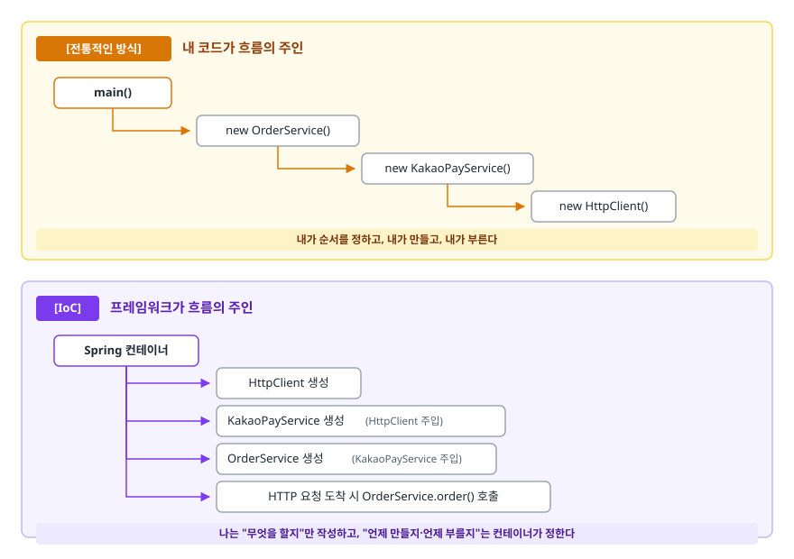
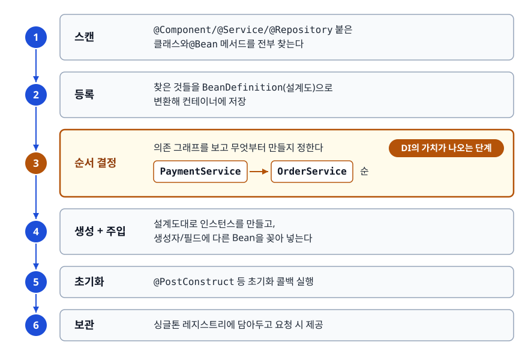
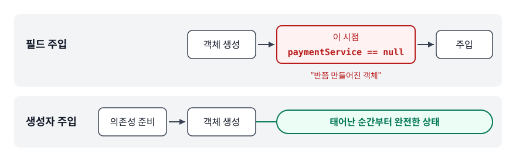

# IoC와 DI (Inversion of Control & Dependency Injection)

> `new` 한 줄이 왜 문제가 되고, 그 제어권을 컨테이너에 넘기면 무엇이 좋아질까요? 왜 하필 생성자 주입인지도 이 문서에서 차례로 설명합니다.

## 학습 목표

- [ ] `new`로 직접 객체를 만들 때 생기는 문제를 코드로 지적할 수 있다
- [ ] IoC가 "무엇의" 제어를 역전시키는지 정확히 말할 수 있다
- [ ] DI 세 가지 방식의 차이와 생성자 주입을 권장하는 근거를 각각 설명할 수 있다
- [ ] IoC 컨테이너가 Bean을 등록하고 주입하는 과정을 그릴 수 있다

## 선행 지식

- 자바의 인터페이스와 구현체 개념 (`implements`)
- 그 외에는 없음 — Spring을 처음 본다면 이 문서부터 시작해도 됩니다

---

## 1. 왜 필요한가

### `new` 한 줄이 만드는 결합

주문 서비스가 결제를 호출하는 아주 평범한 코드부터 보겠습니다.

```java
public class OrderService {
    private final KakaoPayService paymentService = new KakaoPayService();
    public void order(Long userId, int amount) {
        paymentService.pay(userId, amount);
    }
}
```

동작은 합니다. 다만 이 한 줄이 네 가지 부담을 동시에 떠안깁니다.

1. **교체 불가** — 결제사를 토스페이로 바꾸려면 `OrderService`의 소스 코드를 열어 고쳐야 합니다. 결제사를 바꾸는 일과 주문 로직은 아무 상관이 없는데도 그렇습니다.
2. **테스트 불가** — 단위 테스트를 돌리면 진짜 카카오페이 API를 호출합니다. 네트워크가 없으면 테스트가 깨지고, 있으면 결제가 일어납니다.
3. **생성 책임 전염** — `KakaoPayService`가 생성자에 API 키와 `HttpClient`를 요구하기 시작하면, `OrderService`가 그것들까지 알아야 합니다. 주문 로직이 결제사 인증 방식을 아는 코드가 됩니다.
4. **중복 생성** — 같은 결제 객체가 필요한 클래스가 열 개면 인스턴스가 열 개 생깁니다. 커넥션 풀처럼 무거운 자원을 들고 있다면 그대로 낭비입니다.

### 인터페이스만 뽑아도 해결되지 않는다

"그러면 인터페이스를 쓰면 되지 않나?"가 첫 반응인데, 절반만 맞습니다.

```java
public interface PaymentService {
    void pay(Long userId, int amount);
}

public class OrderService {
    // 타입은 인터페이스지만, 어떤 구현체를 쓸지는 여전히 여기서 결정한다
    private final PaymentService paymentService = new KakaoPayService();
}
```

타입만 인터페이스로 바뀌었을 뿐입니다. 어떤 구현체를 쓸지 고르는 결정권은 여전히 **`OrderService` 안에** 있습니다. 상위 정책(주문)이 하위 세부사항(카카오페이)에 의존하는 구조 — 의존 역전 원칙(DIP, Dependency Inversion Principle) 위반이 그대로 남아 있습니다.

### 결정권을 밖으로 빼면

```java
public class OrderService {
    private final PaymentService paymentService;
    public OrderService(PaymentService paymentService) {  // 밖에서 넣어준다
        this.paymentService = paymentService;
    }
}
```

이제 `OrderService`는 "결제를 시킨다"만 알고 "누가 결제하는지"는 모릅니다. 대신 **누군가는 그 "누구"를 정해서 넣어줘야 합니다.** 그 역할을 애플리케이션 전체 규모로 대신하는 것이 IoC 컨테이너입니다.

---

## 2. 제어의 역전(IoC)은 무엇을 뒤집는가

### 정의

IoC(Inversion of Control)는 **설계 원칙**입니다. 객체를 만들고, 의존 관계를 잇고, 생명주기를 관리하고, 언제 호출할지 정하는 제어권을 개발자 코드가 아닌 프레임워크가 쥡니다.

"역전"이라는 말이 헷갈리기 쉽습니다. 뒤집히는 쪽은 데이터 흐름이 아니라 **제어 흐름**입니다.

<!-- diagram:be-ioc-di-1 -->


<!-- 위 그림이 대체한 원본 ASCII.
     내용을 고칠 때는 그림도 함께 갱신할 것.
```
[전통적인 방식]  내 코드가 흐름의 주인

  main()
   └─> new OrderService()
        └─> new KakaoPayService()
             └─> new HttpClient()
   내가 순서를 정하고, 내가 만들고, 내가 부른다


[IoC]  프레임워크가 흐름의 주인

  Spring 컨테이너
   ├─> HttpClient 생성
   ├─> KakaoPayService 생성  (HttpClient 주입)
   ├─> OrderService 생성     (KakaoPayService 주입)
   └─> HTTP 요청 도착 시 OrderService.order() 호출
   나는 "무엇을 할지"만 작성하고, "언제 만들지·언제 부를지"는 컨테이너가 정한다
```
-->

이 원칙을 한 문장으로 압축한 표현이 할리우드 원칙(Hollywood Principle)입니다. "Don't call us, we'll call you" — 네가 우리를 부르지 마라, 필요하면 우리가 부르겠다.

### 비유: 레스토랑 주방

요리사가 직접 시장에 가서 재료를 사 오는 주방과, 구매팀이 손질된 재료를 조리대에 올려 두는 주방을 생각해 봅시다. 후자에서 요리사는 재료가 어느 농장에서 왔는지 모른 채 요리에만 집중합니다. 산지를 바꾸는 결정은 구매팀 몫입니다. 요리사의 레시피는 한 글자도 바뀌지 않습니다.

> **비유의 한계**: 컨테이너는 재료를 "사 오는" 데서 끝나지 않습니다. 직접 "만들기"까지 합니다. 또 실제 주방과 달리 재료(싱글톤 Bean)는 대개 한 번 준비되면 애플리케이션이 끝날 때까지 교체되지 않습니다.

### IoC를 구현하는 방법은 DI만이 아니다

면접에서 한 번씩 나오는 꼬리 질문입니다. IoC는 원칙이고, DI는 그 원칙을 실현하는 여러 방법 중 하나입니다.

| 구현 방법 | 무엇이 역전되나 | Spring 예 |
|-----------|----------------|-----------------|
| DI(의존성 주입) | 의존 객체를 만들고 연결할 권한 | `@Autowired`, 생성자 주입 |
| Service Locator | 객체 생성 권한 (조회 시점은 내가 결정) | `applicationContext.getBean()` |
| Template Method | 전체 알고리즘의 흐름 제어권 | `JdbcTemplate`, `RestTemplate` |
| Event / Callback | 메서드 호출 시점 | `@EventListener`, `HandlerInterceptor` |

`JdbcTemplate`을 예로 들면, 커넥션을 열고 닫고 예외를 변환하는 흐름은 Spring이 쥡니다. 개발자는 SQL과 결과 매핑만 채웁니다. `new`를 한 번도 안 썼는데도 IoC인 이유입니다.

> 표 요약: 네 방법 모두 "내 코드가 흐름을 제어하느냐 vs 프레임워크가 제어하느냐"의 답이 **후자**라는 공통점을 갖습니다. 다만 실무에서 압도적으로 많이 쓰는 것은 DI이므로, 면접에서는 DI를 중심으로 답하고 나머지는 "이런 것들도 IoC입니다"로 덧붙이면 됩니다.

---

## 3. DI: 컨테이너는 실제로 무엇을 하나

의존성 주입(Dependency Injection)은 객체가 필요로 하는 의존 객체를 스스로 만들지 않고 **외부에서 받는** 방식입니다. 컨테이너가 하는 일을 시간 순으로 펼치면 이렇습니다.

<!-- diagram:be-ioc-di-2 -->


<!-- 위 그림이 대체한 원본 ASCII.
     내용을 고칠 때는 그림도 함께 갱신할 것.
```
┌──────────────────────────────────────────────────────────┐
│ 1. 스캔        @Component/@Service/@Repository 붙은       │
│               클래스와 @Bean 메서드를 전부 찾는다          │
│                          ↓                                │
│ 2. 등록        찾은 것들을 BeanDefinition(설계도)으로      │
│               변환해 컨테이너에 저장                       │
│                          ↓                                │
│ 3. 순서 결정   의존 그래프를 보고 무엇부터 만들지 정한다   │
│               PaymentService → OrderService 순            │
│                          ↓                                │
│ 4. 생성 + 주입 설계도대로 인스턴스를 만들고,               │
│               생성자/필드에 다른 Bean을 꽂아 넣는다        │
│                          ↓                                │
│ 5. 초기화      @PostConstruct 등 초기화 콜백 실행          │
│                          ↓                                │
│ 6. 보관        싱글톤 레지스트리에 담아두고 요청 시 제공   │
└──────────────────────────────────────────────────────────┘
```
-->

이 중에서 DI의 가치는 **3번**(순서 결정)에서 나옵니다. 의존 관계가 수십 개로 얽힌 애플리케이션에서 "무엇을 먼저 만들어야 하는가"를 사람이 손으로 관리하는 것은 금방 한계에 부딪힙니다. 컨테이너는 그래프를 스스로 정렬해 순서를 잡습니다.

---

## 4. 주입 방식 세 가지

### 생성자 주입 (권장)

```java
@Service
public class OrderService {
    private final PaymentService paymentService;
    private final OrderRepository orderRepository;

    // 생성자가 하나뿐이면 @Autowired 생략 가능
    public OrderService(PaymentService paymentService, OrderRepository orderRepository) {
        this.paymentService = paymentService;
        this.orderRepository = orderRepository;
    }
}
```

Lombok의 `@RequiredArgsConstructor`를 클래스에 붙이면 `final` 필드를 모은 생성자를 컴파일 시점에 만들어 줍니다. 위 생성자 코드는 통째로 생략해도 됩니다.

### 필드 주입 (비권장)

```java
@Service
public class OrderService {
    @Autowired
    private PaymentService paymentService;  // final 불가
}
```

### Setter 주입 (선택적 의존성에 한정)

```java
@Service
public class OrderService {
    private NotificationService notificationService;  // 없어도 동작해야 하는 의존성

    @Autowired(required = false)
    public void setNotificationService(NotificationService notificationService) {
        this.notificationService = notificationService;
    }

    public void order() {
        if (notificationService != null) notificationService.notifyOrderCreated();
    }
}
```

### 비교

| 기준 | 생성자 주입 | 필드 주입 | Setter 주입 |
|------|------------|----------|------------|
| `final` 선언 | 가능 | 불가 | 불가 |
| 의존성 누락 감지 | 컨테이너 기동 시 실패 | 컨테이너 기동 시 실패(컨테이너 밖에서 `new`로 만들면 NPE) | 좌동 |
| 순환 참조 | 기동 시점에 예외로 실패 | 컨테이너가 우회해 그냥 뜬다(Boot 2.6+는 기본 금지) | 좌동 |
| 컨테이너 없는 단위 테스트 | `new`로 바로 가능 | 리플렉션 필요 | Setter 호출 필요 |
| 선택적 의존성 표현 | 어려움 | 어려움 | 자연스러움 |

> 결론: **기본은 생성자 주입.** 없어도 동작해야 하는 진짜 선택적 의존성에만 Setter 주입을 쓰고, 필드 주입은 프로덕션 코드에서 쓰지 않습니다.

---

## 5. 왜 생성자 주입인가 — 네 가지 근거

### 근거 1. 불변(Immutable) 보장

`final` 필드는 생성자에서 딱 한 번만 값이 정해집니다. 애플리케이션이 도는 동안 `paymentService`는 다른 객체로 바뀌지 않습니다. 싱글톤 Bean은 모든 요청 스레드가 공유하니, 참조가 도중에 바뀌면 어떤 요청은 A로, 어떤 요청은 B로 결제하는 재현 불가능한 버그가 생깁니다.

### 근거 2. 필수 의존성 보장 — "반쯤 만들어진 객체"가 존재할 수 없다

필드 주입에서는 이런 순간이 실제로 존재합니다.

<!-- diagram:be-ioc-di-3 -->


<!-- 위 그림이 대체한 원본 ASCII.
     내용을 고칠 때는 그림도 함께 갱신할 것.
```
필드 주입:  [객체 생성] ──> [이 시점 paymentService == null] ──> [주입]
생성자 주입: [의존성 준비] ──> [객체 생성] ── 태어난 순간부터 완전한 상태
```
-->

생성자 주입은 의존성 없이는 객체가 아예 만들어지지 않습니다. 즉 불완전한 상태의 객체가 코드 어디에도 흘러 다닐 수 없습니다.

### 근거 3. 순환 참조를 기동 시점에 잡는다

```java
@Service
@RequiredArgsConstructor
public class AService {
    private final BService bService;
}

@Service
@RequiredArgsConstructor
public class BService {
    private final AService aService;
}
```

A를 만들려면 B가, B를 만들려면 A가 필요합니다. 컨테이너는 이 교착을 감지하고 **기동 즉시** 예외를 던집니다.

```
BeanCurrentlyInCreationException:
  Error creating bean with name 'aService': Requested bean is currently in creation:
  Is there an unresolvable circular reference?
```

같은 코드를 필드 주입이나 Setter 주입으로 바꾸면 이야기가 달라집니다. 이때는 객체를 먼저 만들어두고 나중에 값을 채우므로, 컨테이너가 **아직 완성되지 않은 A의 참조를 B에게 미리 건네는 방식**으로 순환을 우회할 수 있습니다. 서버는 멀쩡히 뜨고, 구조가 잘못됐다는 신호는 어디에도 남지 않습니다.

그 우회가 늘 안전하지도 않습니다. 미리 건네진 것이 완성 전의 원본이라, 나중에 `@Async`처럼 조기 참조 단계에서 프록시를 만들지 못하는 후처리가 원본을 감싸면 생성 순서에 따라 결국 `BeanCurrentlyInCreationException`이 나기도 합니다. 조건이 맞아야 재현되니 원인을 찾기도 어렵습니다. 흔히 "필드 주입은 순환 참조가 런타임 `StackOverflowError`로 드러난다"고 설명하는데, 이건 정확하지 않습니다. `StackOverflowError`는 두 Bean이 실제로 서로를 무한히 호출할 때 나는 것이지 순환 **주입** 자체가 만드는 오류가 아닙니다. 차이는 기동 시점에 명시적으로 실패하느냐, 아무 말 없이 넘어가느냐입니다.

Spring Boot 2.6부터는 순환 참조 자체가 기본적으로 금지되어 필드 주입이라도 기동 시점에 실패합니다. 다만 `spring.main.allow-circular-references=true`로 되돌릴 수 있어 레거시 프로젝트에서는 여전히 위 우회 동작을 만납니다.

순환 참조는 주입 방식을 바꾼다고 풀리지 않습니다. 책임 분리가 잘못됐다는 신호로 읽고 공통 로직을 제3의 클래스로 빼거나 `ApplicationEventPublisher`로 간접 통신으로 바꾸는 것이 정석입니다. `@Lazy`는 증상만 가립니다.

### 근거 4. 테스트가 쉬워진다

```java
// 안티패턴 - 필드 주입된 서비스의 테스트
@Service
public class OrderService {
    @Autowired private PaymentService paymentService;
    @Autowired private OrderRepository orderRepository;
}

class OrderServiceTest {
    @Test
    void 주문_생성() {
        OrderService service = new OrderService();
        // paymentService, orderRepository 모두 null → 호출하는 순간 NPE
        ReflectionTestUtils.setField(service, "paymentService", mockPayment);
        ReflectionTestUtils.setField(service, "orderRepository", mockRepository);
        // 필드 이름을 문자열로 적었다. 이름을 바꾸면 컴파일은 통과하고 테스트만 깨진다
    }
}
```

**왜 문제인가**: 테스트가 문자열 기반 리플렉션에 묶입니다. 컴파일러가 검증해주지 못하는 영역입니다. 게다가 의존성이 하나 추가돼도 테스트 코드는 조용히 통과하다가 NPE로 터집니다.

```java
// 개선 - 생성자 주입
@Service
@RequiredArgsConstructor
public class OrderService {
    private final PaymentService paymentService;
    private final OrderRepository orderRepository;
}

class OrderServiceTest {
    @Test
    void 주문_생성() {
        OrderService service = new OrderService(mockPayment, mockRepository);
        // 의존성이 추가되면 이 줄이 컴파일 에러가 난다 → 테스트가 먼저 알려준다
    }
}
```

Spring 컨테이너를 띄우지 않으므로 테스트가 수십 배 빠른 것은 덤입니다. 또 생성자 주입은 **설계 냄새 탐지기** 역할도 합니다. 파라미터가 일곱 개, 여덟 개로 늘어나면 "이 클래스가 너무 많은 일을 한다"가 눈에 보입니다. 필드 주입은 `@Autowired` 한 줄만 더 붙이면 그만이라 이 신호가 묻힙니다.

---

## 6. IoC 컨테이너와 Bean

### Bean이란

컨테이너가 생성하고 관리하는 객체를 Bean이라고 부릅니다. `new`로 만든 객체는 아무리 `@Service`가 붙어 있어도 Bean이 아닙니다. 컨테이너를 거쳐 나온 것만 Bean이고, DI, AOP, 트랜잭션 같은 Spring 기능도 Bean에만 적용됩니다.

### 등록 경로

```java
@Service        // 경로 1. 컴포넌트 스캔. @Component의 특수화이며 @Repository, @Controller도 같다
public class OrderService { }

@Configuration
public class AppConfig {
    @Bean       // 경로 2. 외부 라이브러리처럼 어노테이션을 붙일 수 없는 클래스
    public ObjectMapper objectMapper() { return new ObjectMapper(); }
}
```

### 같은 타입 Bean이 여러 개일 때

`@Autowired`는 **타입**으로 찾습니다. 후보가 둘 이상이면 컨테이너는 고를 수 없어 `NoUniqueBeanDefinitionException`을 던집니다. 후보를 좁히는 규칙에는 정해진 우선순위가 있습니다.

1. 주입 지점에 `@Qualifier("beanName")`가 있으면 후보를 그것 하나로 걸러냅니다 — 가장 강합니다
2. 남은 후보 중 `@Primary`가 붙은 Bean이 있으면 그것으로 결정
3. 파라미터(필드) 이름과 Bean 이름이 일치하는 것을 고릅니다
4. 여기까지 정해지지 않으면 `@Priority` 값이 가장 작은(우선순위가 높은) Bean — 마지막 수단(Spring Framework 6.1 이하에서는 3과 4의 순서가 반대였습니다)

이름 매칭은 `@Primary`보다 뒤입니다. `@Primary`가 붙어 있으면 이름을 맞춰도 `@Primary` 쪽이 이깁니다.

```java
@Bean @Primary   // AppConfig 안
public PaymentService kakaoPayService() { ... }   // 대부분의 주입에서 기본값

@Bean
public PaymentService tossPayService() { ... }

@Service
public class RefundService {
    public RefundService(@Qualifier("tossPayService") PaymentService paymentService) { }
}
```

실무 패턴은 **"기본 구현에 `@Primary`, 예외 상황에만 `@Qualifier`"** 조합입니다.

### 싱글톤이라는 전제

Bean의 기본 스코프는 싱글톤입니다. 인스턴스 하나를 모든 요청 스레드가 공유한다는 뜻이므로, Bean에 가변 필드를 두면 그대로 동시성 버그가 됩니다.

```java
// 안티패턴
@Service
public class OrderService {
    private int orderCount = 0;      // 모든 요청이 공유하는 가변 상태

    public void order() {
        orderCount++;                // 스레드 A와 B가 동시에 진입하면 값이 유실된다
    }
}
```

**왜 문제인가**: `orderCount++`는 읽기·증가·쓰기 세 단계라 원자적이지 않습니다. 요청이 몰리면 카운트가 실제보다 작아집니다.

```java
// 개선 1 - 상태를 아예 두지 않는다(권장)
@Service
@RequiredArgsConstructor
public class OrderService {
    private final OrderRepository orderRepository;
    public void order(Long userId) {
        orderRepository.save(new Order(userId));   // 상태는 DB가 갖는다
    }
}

// 개선 2 - 꼭 인메모리 카운터가 필요하면 스레드 안전한 타입을 쓴다
private final AtomicLong orderCount = new AtomicLong();
```

싱글톤 Bean은 무상태로 설계합니다. Spring 애플리케이션 설계에서 가장 기본이 되는 규칙입니다.

---

## 7. 실무에서는

- **`@RequiredArgsConstructor`가 사실상 표준**입니다. 다만 Lombok이 만드는 생성자의 파라미터 순서는 `final` 필드 선언 순서를 그대로 따라갑니다. 같은 타입 필드가 둘 이상인 클래스에서 필드 순서를 바꾸면, 테스트에서 손으로 넘기던 인자 순서가 컴파일 에러 없이 조용히 어긋납니다. 이런 클래스는 생성자를 직접 적어두는 편이 안전합니다.
- **테스트 전략이 갈립니다.** 컨테이너 없이 `new`로 만드는 순수 단위 테스트(빠름)와 `@SpringBootTest`로 컨테이너를 띄우는 통합 테스트(느림)를 구분해서 쓰는데, 생성자 주입이어야 전자가 가능합니다. 반대로 테스트 클래스 자체는 직접 `new` 할 일이 없으므로 필드 주입을 써도 무방합니다.
- 라이브러리 코드에서 Spring 의존성을 피하고 싶으면 Spring 어노테이션 없이 생성자만 열어두면 됩니다. 생성자 주입은 특정 프레임워크에 종속되지 않는 순수 자바이므로, 나중에 Spring을 걷어내도 클래스는 그대로 쓸 수 있습니다.

---

## 8. 면접 포인트

> 면접에서 이 주제가 나오면 이렇게 답한다

**Q. IoC와 DI의 관계를 설명해주세요.**

A. IoC는 객체의 생성과 호출 시점에 대한 제어권을 개발자 코드가 아니라 프레임워크가 갖는다는 **설계 원칙**입니다. DI는 그 원칙을 구현하는 구체적인 패턴 중 하나로, 의존 객체를 스스로 `new` 하지 않고 외부에서 주입받는 방식입니다. IoC를 구현하는 방법에는 DI 외에도 Service Locator, Template Method, 이벤트 콜백이 있고, `JdbcTemplate`이 Template Method 방식의 예입니다.
- 꼬리 질문: "그럼 DI가 없으면 IoC가 아닌가요?" → 아닙니다. 제어권이 프레임워크로 넘어갔다면 방식과 무관하게 IoC입니다. 다만 Spring의 핵심은 DI 컨테이너입니다.

**Q. 왜 생성자 주입을 권장하나요?**

A. 네 가지입니다. `final`을 쓸 수 있어 불변이 보장되고, 의존성 없이는 객체가 만들어지지 않아 반쯤 초기화된 객체가 존재할 수 없습니다. 순환 참조는 애플리케이션 기동 시점에 `BeanCurrentlyInCreationException`으로 잡히고, 컨테이너 없이 `new`만으로 단위 테스트를 짤 수 있습니다. 특히 세 번째가 중요한데, 순환 참조가 허용된 환경(순수 Spring, Spring Boot 2.6 미만, 또는 `spring.main.allow-circular-references=true`)의 필드 주입에서는 컨테이너가 미완성 참조를 미리 건네 순환을 우회해 버려서 잘못된 구조가 아무 신호 없이 그대로 배포됩니다.
- 꼬리 질문: "생성자 파라미터가 너무 많아지면요?" → Lombok `@RequiredArgsConstructor`로 코드를 줄일 수 있지만, 애초에 파라미터가 많다는 것 자체가 단일 책임 위반 신호이므로 클래스 분리를 먼저 검토한다고 답합니다.

**Q. 싱글톤 Bean에 필드를 두면 왜 위험한가요?**

A. 싱글톤 Bean은 인스턴스가 하나뿐이라 모든 요청 스레드가 같은 필드를 공유합니다. 가변 필드를 두면 요청 A가 쓴 값을 요청 B가 읽는 경쟁 상태가 생기고, 트래픽이 몰릴 때만 재현되기 때문에 디버깅이 매우 어렵습니다. 그래서 Bean은 무상태로 설계하고, 요청별 데이터는 메서드 파라미터나 지역 변수로 다룹니다.
- 꼬리 질문: "요청별 상태가 꼭 필요하면요?" → `request` 스코프 Bean이나 `ThreadLocal`을 쓰되, 스레드 풀 재사용 때문에 `ThreadLocal`은 반드시 정리해야 한다고 답합니다.

**Q. 같은 타입의 Bean이 두 개면 어떻게 되나요?**

A. `@Autowired`는 타입으로 찾기 때문에 후보가 둘이면 `NoUniqueBeanDefinitionException`이 납니다. 해결 방법은 주입 지점에 `@Qualifier`로 명시하기, 기본 구현에 `@Primary`를 붙이기, 파라미터 이름을 Bean 이름과 맞추기가 있습니다. 우선순위는 이 순서 그대로여서 `@Qualifier`가 가장 강하고 이름 매칭이 가장 약합니다. 실무에서는 기본 구현에 `@Primary`를 두고 예외 상황에만 `@Qualifier`를 쓰는 조합을 많이 씁니다.
- 꼬리 질문: "이름을 Bean 이름과 똑같이 맞췄는데 다른 Bean이 주입됐습니다" → 다른 후보에 `@Primary`가 붙어 있는지 확인합니다. 이름 매칭은 `@Primary`보다 뒤에 적용되므로 `@Primary`에 밀립니다.

---

## 자주 하는 실수

| 실수 | 왜 틀렸나 | 올바른 이해 |
|------|----------|-----------|
| "생성자 주입은 의존성이 없으면 컴파일 에러가 난다" | 컴파일러는 Spring Bean의 존재 여부를 모릅니다. 컨테이너 기동 시점에 `NoSuchBeanDefinitionException`으로 실패합니다 | "런타임이지만 **기동 시점**에 실패한다"가 정확한 표현. 요청 처리 중이 아니라 배포 직후에 잡힌다 |
| "IoC = DI" | DI는 IoC의 여러 구현 중 하나 | IoC는 원칙, DI는 패턴. Template Method나 이벤트 콜백도 IoC다 |
| "`@Autowired`는 이름으로 주입한다" | 1순위는 타입 매칭입니다. 이름은 `@Qualifier`와 `@Primary`로도 안 좁혀졌을 때 쓰는 보조 수단 | 타입으로 후보를 모은 뒤 `@Qualifier` → `@Primary` → 이름 → `@Priority` 순으로 좁힌다(Spring Framework 6.2+) |
| "필드 주입은 순환 참조가 런타임 `StackOverflowError`로 드러난다" | 순환 주입 자체는 `StackOverflowError`를 내지 않습니다. 컨테이너가 미완성 참조를 미리 건네 우회합니다 | 아무 신호 없이 기동된다는 것이 문제다. `StackOverflowError`는 두 Bean이 실제로 서로를 무한 호출할 때 나는 별개의 현상이다 |
| "`new`로 만들어도 `@Transactional`이 걸린다" | 컨테이너를 거치지 않은 객체는 프록시가 아니므로 AOP가 적용되지 않는다 | Bean으로 주입받은 객체를 써야 한다 |
| "순환 참조는 `@Lazy`로 해결한다" | 주입 시점만 미룰 뿐 구조 문제는 그대로다 | 의존 방향을 단방향으로 재설계하거나 이벤트로 분리한다 |

---

## 한 줄 정리

IoC는 "무엇을 만들고 언제 부를지"의 결정권을 프레임워크에 넘기는 원칙입니다. DI는 그 결정을 생성자 파라미터로 흘려 넣는 구현입니다. 생성자 주입을 고르는 까닭은 **운영 전에** 불완전한 객체와 순환 참조를 잡아내는 데 있습니다.

---

## 연관 개념

- [02-aop-proxy.md](./02-aop-proxy.md) - 컨테이너가 Bean을 프록시로 감싸서 부가 기능을 붙이는 방법
- [04-bean-lifecycle.md](./04-bean-lifecycle.md) - 주입 이후 Bean이 초기화되고 소멸하기까지의 전 과정
- [05-spring-boot-auto-config.md](./05-spring-boot-auto-config.md) - 내가 등록하지 않은 Bean이 컨테이너에 들어와 있는 이유
- [qna-spring.md](./qna-spring.md) - IoC/DI 관련 면접 질문(Q1, Q9, Q15)
- [../java-fundamentals/qna-java.md](../java-fundamentals/qna-java.md) - 자바 객체 생성과 `final`의 의미
