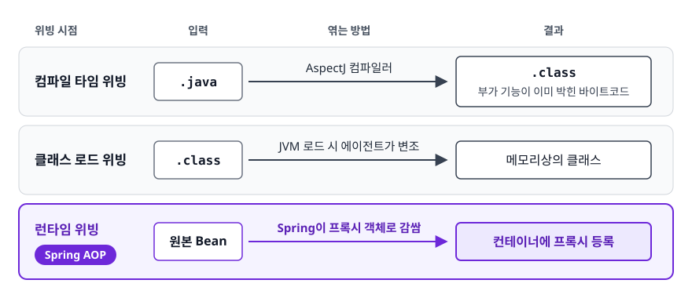
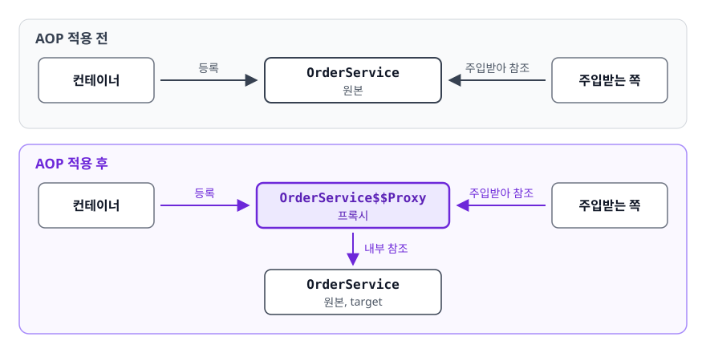
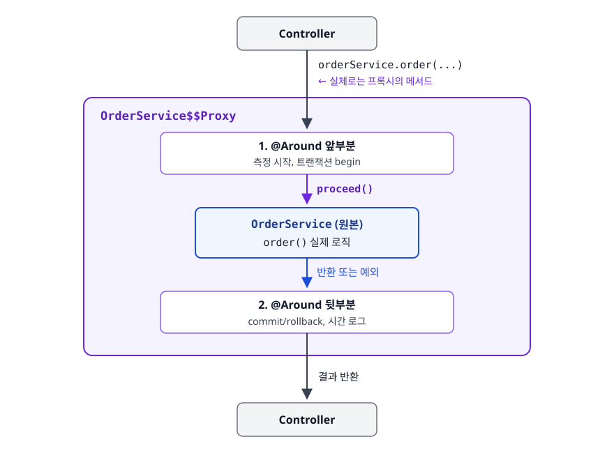
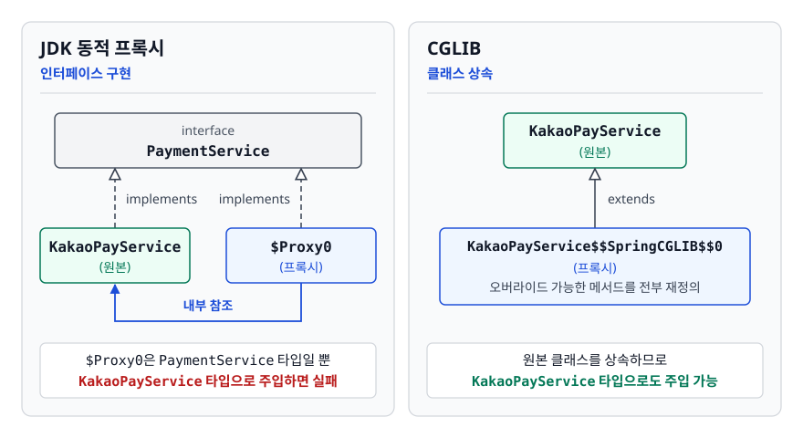
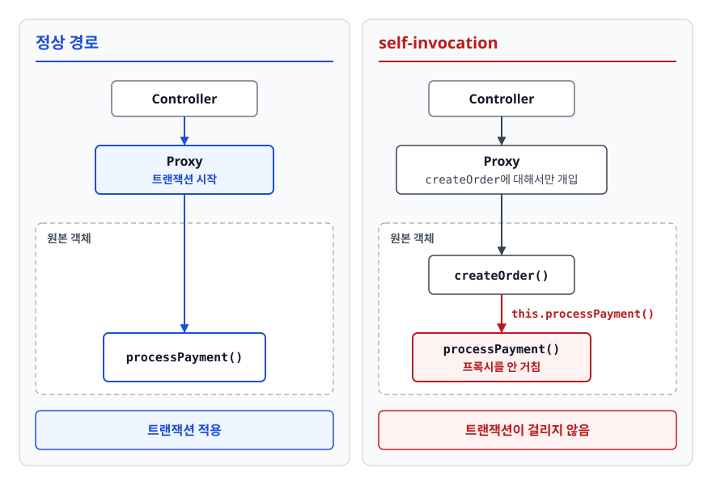

# AOP와 프록시 (Aspect-Oriented Programming & Proxy)

> 부가 기능은 메서드 안에서 도는 줄 알기 쉽습니다. 이 문서는 로깅·트랜잭션 코드가 왜 비즈니스 로직에 섞이면 안 되는지, Spring이 그것을 프록시로 어떻게 떼어내는지, 그 프록시 때문에 어떤 함정이 생기는지를 가려냅니다.

## 학습 목표

- [ ] 횡단 관심사(Cross-Cutting Concern)가 무엇이고 왜 문제인지 예시로 설명할 수 있다
- [ ] 프록시가 원본 Bean을 대신해 등록되는 과정을 그림으로 그릴 수 있다
- [ ] JDK 동적 프록시와 CGLIB의 차이, 각각의 제약을 말할 수 있다
- [ ] self-invocation이 AOP를 무력화하는 이유를 프록시 구조로 설명하고 해법을 제시할 수 있다

## 선행 지식

- [01-ioc-di.md](./01-ioc-di.md) - 컨테이너가 Bean을 만들고 주입하는 과정
- 자바의 인터페이스, 상속, 리플렉션의 존재 정도

---

## 1. 왜 필요한가

### 비즈니스 로직에 스며드는 코드들

주문 처리 메서드를 하나 만들었다고 해 봅시다. 처음에는 두 줄이었습니다.

```java
public void order(Long userId, int amount) {
    paymentService.pay(userId, amount);
    orderRepository.save(new Order(userId, amount));
}
```

그런데 운영을 시작하면 요구사항이 붙습니다. "느린 API를 찾아야 하니 실행 시간을 로그로 남겨주세요." "결제 중 예외가 나면 주문도 롤백돼야 합니다." "관리자만 호출할 수 있게 해주세요."

```java
public void order(Long userId, int amount) {
    long start = System.currentTimeMillis();          // 측정
    if (!securityContext.hasRole("ADMIN")) {          // 인가
        throw new AccessDeniedException();
    }
    TransactionStatus tx = txManager.getTransaction(definition);  // 트랜잭션
    try {
        paymentService.pay(userId, amount);           // ← 진짜 하고 싶었던 일
        orderRepository.save(new Order(userId, amount));  // ← 진짜 하고 싶었던 일
        txManager.commit(tx);
    } catch (RuntimeException e) {
        txManager.rollback(tx);
        throw e;
    } finally {
        log.info("order took {}ms", System.currentTimeMillis() - start);
    }
}
```

핵심 로직 2줄을 부가 코드 12줄이 감쌌습니다. 문제는 분량이 아닙니다. **이 12줄이 서비스 메서드 수백 개에 똑같이 복사된다**는 데 있습니다.

- 로그 포맷을 바꾸려면 수백 곳을 고쳐야 합니다
- 어느 한 곳에서 `rollback`을 빠뜨려도 컴파일은 통과합니다
- 코드 리뷰에서 진짜 봐야 할 두 줄이 파묻힙니다

이렇게 **여러 모듈에 가로질러 흩어지는 공통 관심사**를 횡단 관심사(Cross-Cutting Concern)라고 부릅니다. 로깅, 트랜잭션, 보안, 캐싱, 재시도, 성능 측정이 대표적입니다.

### 상속이나 유틸 메서드로는 안 되는 이유

"공통 부모 클래스를 만들면 되지 않나?" 자바는 단일 상속이라 이미 다른 클래스를 상속 중이면 못 씁니다. 게다가 `AbstractLoggingService`를 상속하는 순간 "이 클래스는 로깅을 한다"가 클래스 정의에 새겨져 로깅을 빼려면 상속 구조를 바꿔야 합니다. "유틸 메서드로 감싸면?" 결국 각 메서드마다 `LogUtil.wrap(() -> { ... })`를 손으로 적어야 하니 호출을 빠뜨리는 실수는 그대로 남습니다.

**비즈니스 코드는 한 글자도 건드리지 않고 밖에서 부가 기능만 끼워 넣는 방법**, 그것이 AOP입니다.

---

## 2. AOP의 용어

### 정의

AOP(Aspect-Oriented Programming, 관점 지향 프로그래밍)는 횡단 관심사를 별도 모듈로 분리해 원하는 지점에 자동으로 적용하는 프로그래밍 기법입니다.

용어가 많아 보이지만 문장 하나로 엮입니다.

> **어떤 지점(JoinPoint)** 중에서 **조건에 맞는 곳(Pointcut)** 에 **어떤 부가 기능(Advice)** 을 붙일지 묶어놓은 것이 **Aspect**이고, 실제로 붙이는 작업이 **Weaving**입니다.

| 용어 | 의미 | 코드에서 |
|------|------|---------|
| JoinPoint | Advice를 끼워 넣을 수 있는 후보 지점 | Spring AOP에서는 **메서드 실행 시점만** |
| Pointcut | 그중 실제로 적용할 지점을 고르는 필터 | `execution(* com.shop.service..*(..))` |
| Advice | 끼워 넣을 부가 기능 코드 | `@Around`, `@Before` 등이 붙은 메서드 |
| Aspect | Pointcut + Advice 묶음 | `@Aspect`가 붙은 클래스 |
| Target | 부가 기능이 적용될 원본 객체 | `OrderService` 실제 인스턴스 |
| Weaving | Aspect를 Target에 실제로 엮는 작업 | Spring은 런타임에 프록시로 수행 |

> 면접에서 헷갈리기 쉬운 짝은 **JoinPoint(가능한 모든 지점)와 Pointcut(그중 고른 지점)** 입니다. AspectJ는 필드 접근·객체 생성까지 JoinPoint로 잡습니다. 하지만 **Spring AOP는 메서드 실행 하나만** 지원한다는 점을 반드시 함께 말해야 합니다.

### Weaving 시점 세 가지

<!-- diagram:be-aop-proxy-5 -->


<!-- 위 그림이 대체한 원본 ASCII.
     내용을 고칠 때는 그림도 함께 갱신할 것.
```
컴파일 타임 위빙   .java ──[AspectJ 컴파일러]──> .class (부가 기능이 이미 박힌 바이트코드)
클래스 로드 위빙   .class ──[JVM 로드 시 에이전트가 변조]──> 메모리상의 클래스
런타임 위빙        원본 Bean ──[Spring이 프록시 객체로 감쌈]──> 컨테이너에 프록시 등록   ← Spring AOP
```
-->

Spring AOP가 런타임 위빙을 택한 이유는 **별도 컴파일러나 JVM 에이전트 없이 순수 자바만으로 동작**하기 때문입니다. 대신 프록시를 거치는 호출에만 부가 기능이 걸린다는 제약이 붙습니다. 이 제약 때문에 이 문서 후반의 함정 대부분이 생깁니다.

---

## 3. 프록시 기반 AOP는 어떻게 동작하나

### 비유: 사무실 대리 수신

팀장이 부재중일 때 걸려 온 전화를 비서가 먼저 받는다고 해 봅시다. 비서는 통화 시각을 기록하고, 스팸이면 차단하고, 정상이면 팀장에게 연결합니다. 전화 건 사람은 자기가 팀장과 통화했다고 생각합니다. 팀장은 자기 앞에 비서가 있다는 사실을 모른 채 원래 하던 일만 합니다.

> **비유의 한계**: 비서는 팀장이 부재중일 때만 전화를 받습니다. 하지만 실제 프록시는 부재중 여부와 무관하게 **모든 호출을 항상** 가로챕니다. 또 비서와 팀장은 별개의 사람이지만, 프록시는 원본과 같은 타입이어야만 합니다.

### 컨테이너에 등록되는 것은 원본이 아니다

<!-- diagram:be-aop-proxy-1 -->


<!-- 위 그림이 대체한 원본 ASCII.
     내용을 고칠 때는 그림도 함께 갱신할 것.
```
[AOP 적용 전]  컨테이너 ──> OrderService (원본)  <── 주입받는 쪽

[AOP 적용 후]  컨테이너 ──> OrderService$$Proxy  <── 주입받는 쪽
                                  │ 내부 참조
                                  ▼
                            OrderService (원본, target)
```
-->

**`@Autowired`로 주입받는 순간 손에 쥐는 객체는 프록시입니다.** 개발자가 눈치채지 못하는 이유는 프록시가 원본과 같은 타입이라 구분이 안 되기 때문입니다.

### 호출 한 번의 전체 경로

<!-- diagram:be-aop-proxy-2 -->


<!-- 위 그림이 대체한 원본 ASCII.
     내용을 고칠 때는 그림도 함께 갱신할 것.
```
Controller
    │ orderService.order(...)   ← 실제로는 프록시의 메서드
    ▼
┌──────────────────────────────────────────────────┐
│ OrderService$$Proxy                              │
│                                                  │
│   1. @Around 앞부분  (측정 시작, 트랜잭션 begin) │
│              │ proceed()                          │
│              ▼                                    │
│      ┌────────────────────────┐                  │
│      │ OrderService (원본)     │                 │
│      │   order() 실제 로직     │                 │
│      └───────────┬────────────┘                  │
│              │ 반환 또는 예외                     │
│              ▼                                    │
│   2. @Around 뒷부분  (commit/rollback, 시간 로그) │
└──────────────────────────────────────────────────┘
    │
    ▼ 결과 반환
Controller
```
-->

### 코드로 보기

```java
@Aspect
@Component
@Slf4j
public class ExecutionTimeAspect {
    // com.shop.service 패키지 이하의 메서드 실행을 전부 가로챈다
    @Around("execution(* com.shop.service..*(..))")
    public Object measure(ProceedingJoinPoint joinPoint) throws Throwable {
        long start = System.nanoTime();
        try {
            return joinPoint.proceed();   // 원본 메서드 호출. 이 줄이 없으면 원본이 실행되지 않는다
        } finally {
            long tookMs = (System.nanoTime() - start) / 1_000_000;
            log.info("{} took {}ms", joinPoint.getSignature().toShortString(), tookMs);
        }
    }
}
```

이제 `OrderService.order()`는 원래의 두 줄로 돌아갑니다. 측정 코드는 어디에도 없지만 로그는 남습니다.

### Advice 다섯 가지

| Advice | 실행 시점 | 원본 실행을 막을 수 있나 | 반환값을 바꿀 수 있나 |
|--------|----------|------------------------|---------------------|
| `@Before` | 메서드 실행 직전 | 아니오(예외를 던지면 중단은 됨) | 아니오 |
| `@AfterReturning` | 정상 반환 직후 | 아니오 | 아니오(값을 볼 수만 있음) |
| `@AfterThrowing` | 예외 발생 직후 | 아니오 | 아니오 |
| `@After` | 정상/예외 관계없이 항상 | 아니오 | 아니오 |
| `@Around` | 실행 전후 전부 | **예** (`proceed()`를 안 부르면 됨) | **예** |

트랜잭션·재시도·캐싱처럼 전후를 모두 제어해야 하는 기능은 `@Around`가 아니면 구현할 수 없습니다. 반대로 단순 로깅에 `@Around`를 쓰면 `proceed()` 호출을 빠뜨리기 쉬우니 `@Before`/`@AfterReturning`이 안전합니다.

한 Aspect 안에 여러 Advice를 몰아넣은 뒤 실행 순서에 기대는 코드는 쓰지 않는 것이 좋습니다. Spring 버전에 따라 세부 순서가 조정된 적이 있어 이식성이 떨어집니다. 여러 Aspect 사이의 순서가 중요하면 `@Order`를 명시합니다. 값이 작을수록 바깥쪽에서 감쌉니다.

### Pointcut 표현식

```java
// 패키지 기준
@Pointcut("execution(* com.shop.service..*(..))")
public void serviceLayer() {}

// 어노테이션 기준 - 실무에서 가장 많이 쓰는 형태
@Pointcut("@annotation(com.shop.common.LogExecutionTime)")
public void logAnnotated() {}

// 조합도 가능
@Around("serviceLayer() && logAnnotated()")
public Object advice(ProceedingJoinPoint pjp) throws Throwable { ... }
```

패키지 경로로 거는 방식은 리팩터링으로 패키지를 옮기는 순간 조용히 적용이 풀립니다. **커스텀 어노테이션을 만들어 `@annotation`으로 거는 방식**이 의도도 드러나고 안전합니다.

---

## 4. JDK 동적 프록시 vs CGLIB

프록시를 만드는 방법은 두 가지입니다. 둘의 차이는 "원본과 같은 타입"을 어떻게 만족시키느냐에서 갈립니다.

<!-- diagram:be-aop-proxy-3 -->


<!-- 위 그림이 대체한 원본 ASCII.
     내용을 고칠 때는 그림도 함께 갱신할 것.
```
[JDK 동적 프록시 - 인터페이스 구현]

   interface PaymentService
          △              △
          │ implements   │ implements
   KakaoPayService   $Proxy0 ──────> KakaoPayService
      (원본)          (프록시)          (내부 참조)

[CGLIB - 클래스 상속]

   KakaoPayService (원본)
          △
          │ extends
   KakaoPayService$$SpringCGLIB$$0
          (프록시, 오버라이드 가능한 메서드를 전부 재정의)
```
-->

생성되는 클래스 이름은 Spring 6.0을 기준으로 바뀌었습니다. 그 이전에는 `KakaoPayService$$EnhancerBySpringCGLIB$$...` 형태였고, 지금은 `$$SpringCGLIB$$`가 들어갑니다. 스택 트레이스에서 둘 중 어느 이름이 보이든 CGLIB 프록시라는 뜻입니다.

| 구분 | JDK 동적 프록시 | CGLIB |
|------|----------------|-------|
| 제공 주체 | JDK 표준 (`java.lang.reflect.Proxy`) | 바이트코드 라이브러리(Spring에 내장) |
| 방식 | 인터페이스 구현 + 리플렉션 | 클래스 상속 + 바이트코드 생성 |
| 필수 조건 | 대상이 **인터페이스를 구현**해야 함 | 대상 클래스가 `final`이 아니어야 함 |
| 적용 범위 | 인터페이스에 선언된 메서드만 | 클래스의 모든 오버라이드 가능한 메서드 |
| 적용 불가 | 인터페이스 없는 구체 클래스 | `final` 클래스, `final`/`private`/`static` 메서드 |

> 면접용 정리: **Spring Boot 2.0부터 `spring.aop.proxy-target-class=true`가 기본값이라 인터페이스 유무와 무관하게 CGLIB를 씁니다.** "예전에는 인터페이스가 있으면 JDK, 없으면 CGLIB였는데 지금은 일관성을 위해 CGLIB 고정"이라고 답하면 됩니다.

### 왜 CGLIB로 통일했나

JDK 동적 프록시가 만들어 낸 객체는 **인터페이스 타입일 뿐 구현 클래스 타입이 아닙니다.** 그래서 이런 코드가 터졌습니다.

```java
public interface PaymentService { void pay(); }

@Service
public class KakaoPayService implements PaymentService { ... }

@Service
@RequiredArgsConstructor
public class OrderService {
    private final KakaoPayService kakaoPayService;
    // JDK 프록시가 만들어졌다면 $Proxy0은 PaymentService일 뿐 KakaoPayService가 아니다
    // → 주입 자체가 실패하거나 ClassCastException
}
```

인터페이스를 하나 추가했을 뿐인데 멀쩡하던 주입이 깨집니다. 이 경험은 상당히 당황스럽습니다. CGLIB는 원본 클래스를 상속하므로 구체 타입으로도 받을 수 있습니다. Spring Boot가 CGLIB를 기본값으로 잡은 것도 이 일관성 때문입니다.

### CGLIB의 제약이 실제로 문제가 되는 순간

```java
// 안티패턴 - final이 붙은 서비스에 AOP를 기대
@Service
public final class ReportService {   // final 클래스
    @Transactional
    public void generate() { ... }
}
```

**왜 문제인가**: CGLIB는 상속으로 프록시를 만드는데 `final` 클래스는 상속할 수 없습니다. 메서드에 `final`이 붙은 경우는 더 고약합니다. 프록시 생성 자체는 성공하고 그 메서드만 오버라이드되지 않아 **부가 기능이 빠집니다.** 그 호출은 원본(target)으로 넘어가지 않고 필드가 초기화되지 않은 프록시 인스턴스에서 그대로 실행되므로, 메서드가 주입받은 필드를 쓰면 `NullPointerException`이 납니다. Spring이 관련 로그를 남기기는 하지만 Spring 6.x에서는 기본 로그 레벨에서 보이지 않는 경우가 대부분입니다(Spring Framework 7.0부터는 public `final` 메서드에 WARN 로그를 남깁니다). 트랜잭션이 걸린 줄 알았는데 안 걸린 채 운영에 나갑니다.

```java
// 개선 - final을 떼고, 진짜 상속을 막고 싶으면 별도 설계를 검토한다
@Service
public class ReportService {
    @Transactional
    public void generate() { ... }
}
```

Kotlin으로 Spring을 쓸 때 클래스가 기본 `final`이라 `kotlin-spring` 플러그인(`allopen`)이 사실상 필수인 것도 같은 이유입니다.

---

## 5. self-invocation — AOP가 조용히 사라지는 지점

### 무엇이 문제인가

```java
// 안티패턴
@Service
public class OrderService {

    public void createOrder(Long userId) {
        validate(userId);
        this.processPayment(userId);   // 같은 클래스 내부 호출
    }

    @Transactional
    public void processPayment(Long userId) {
        // 트랜잭션이 걸리지 않는다
    }
}
```

**왜 문제인가**: 앞에서 봤듯 부가 기능은 프록시에 있고 원본 객체에는 없습니다. `createOrder`가 실행되는 시점에는 이미 프록시를 통과해 **원본 객체 안**에 들어와 있습니다. 거기서 부르는 `this.processPayment()`는 원본의 메서드를 직접 호출합니다. 프록시를 다시 거치지 않으니 `@Transactional`이 개입할 틈이 없습니다.

<!-- diagram:be-aop-proxy-4 -->


<!-- 위 그림이 대체한 원본 ASCII.
     내용을 고칠 때는 그림도 함께 갱신할 것.
```
정상 경로                              self-invocation
─────────                              ───────────────
Controller                             Controller
   │                                      │
   ▼                                      ▼
[Proxy] ← 트랜잭션 시작                 [Proxy] ← createOrder에 대해서만 개입
   │                                      │
   ▼                                      ▼
[원본] processPayment()                 [원본] createOrder()
                                          │ this.processPayment()
                                          ▼
                                       [원본] processPayment()  ← 프록시를 안 거침
```
-->

컴파일 에러도, 런타임 예외도, 경고 로그도 없습니다. **아무 일도 일어나지 않는 것**이 이 버그의 가장 무서운 점입니다.

### 해결 방법 비교

```java
// 개선 1(권장) - 별도 클래스로 분리해 '외부 호출'로 만든다
@Service
@RequiredArgsConstructor
public class OrderService {
    private final PaymentProcessor paymentProcessor;

    public void createOrder(Long userId) {
        validate(userId);
        paymentProcessor.process(userId);   // 다른 Bean → 프록시 경유
    }
}

@Service
public class PaymentProcessor {
    @Transactional
    public void process(Long userId) { ... }
}
```

```java
// 개선 2 - 자기 자신을 주입받는다. @Lazy가 없으면 순환 참조로 기동에 실패할 수 있다
@Service
public class OrderService {
    private final OrderService self;

    public OrderService(@Lazy OrderService self) { this.self = self; }  // self는 프록시

    public void createOrder(Long userId) { self.processPayment(userId); }

    @Transactional
    public void processPayment(Long userId) { ... }
}
```

```java
// 개선 3 - 프록시를 코드에서 직접 꺼낸다. @EnableAspectJAutoProxy(exposeProxy = true) 필요
public void createOrder(Long userId) {
    ((OrderService) AopContext.currentProxy()).processPayment(userId);
}
```

| 방법 | 원리 | 권장도 |
|------|------|--------|
| 클래스 분리 | 호출이 Bean 경계를 넘으므로 자연스럽게 프록시 경유 | 권장 — 대개 책임 분리 관점에서도 옳다 |
| 자기 자신 주입 | `self`에 프록시가 들어오므로 경유 | 차선 — `@Lazy` 필요, 의도가 잘 안 드러남 |
| `AopContext` | 스레드에 노출된 프록시를 꺼내 씀 | 비권장 — 비즈니스 코드가 Spring AOP API에 묶인다 |

> self-invocation을 만나면 "이 두 메서드가 정말 같은 클래스에 있어야 하는가"부터 먼저 의심해 봐야 합니다. 대부분은 **분리하는 것이 정답**이고, 나머지 두 방법은 레거시를 당장 고쳐야 할 때의 임시책입니다.

---

## 6. 프록시 AOP가 적용되지 않는 경우 정리

| 상황 | 적용 여부 | 이유 |
|------|----------|------|
| 다른 Bean에서 public 메서드 호출 | 적용 | 정상 경로 |
| 같은 클래스 내부에서 `this.method()` | **미적용** | 프록시를 거치지 않음 |
| `private` 메서드 | **미적용** | 오버라이드 불가. 호출도 항상 내부 호출 |
| `final` 메서드 (CGLIB) | **미적용** | 오버라이드 불가. 호출이 원본으로 가지 않아 주입된 필드를 쓰면 NPE가 난다 |
| `static` 메서드 | **미적용** | 인스턴스 메서드가 아님 |
| `new`로 만든 객체 | **미적용** | 컨테이너를 거치지 않아 프록시가 아님 |
| 생성자 안에서 호출할 때 | **미적용** | 프록시가 만들어지기 전 |

> "부가 기능이 안 먹는다" 싶으면 이 표부터 확인해 보는 것이 좋습니다. 원인의 대부분이 여기 있습니다.

---

## 7. 실무에서는

- **Spring의 굵직한 기능 상당수가 이 프록시 위에 서 있습니다.** `@Transactional`(트랜잭션), `@Cacheable`(캐시), `@Async`(비동기), `@Retryable`(재시도), `@PreAuthorize`(인가)가 모두 같은 메커니즘입니다. 프록시 원리를 한 번 이해하면 이 어노테이션들의 함정도 한꺼번에 이해됩니다. `@Async` 메서드를 self-invocation으로 부르면 그냥 동기 실행되는 것도 같은 이유입니다.
- 실무에서 커스텀 AOP를 쓰는 대표적인 곳은 API 요청/응답 로깅, 실행 시간 측정, 메서드 파라미터 기반 권한 체크, 분산 락 획득 정도입니다. 직접 만드는 Aspect는 생각보다 적습니다.
- Spring Security는 서블릿 필터 체인으로 동작하고 `@PreAuthorize` 같은 메서드 보안만 AOP로 처리합니다. 두 층위를 구분해두면 인증이 어디서 걸렸는지 추적하기 쉽습니다. 참고로 프록시가 씌워졌는지는 디버거에서 객체 타입을 보면 됩니다. 이름에 `$$SpringCGLIB$$`나 `$Proxy`가 보이면 프록시입니다.

---

## 8. 면접 포인트

> 면접에서 이 주제가 나오면 이렇게 답한다

**Q. Spring AOP의 동작 원리를 설명해주세요.**

A. Spring AOP는 프록시 패턴 기반의 런타임 위빙입니다. 컨테이너가 Bean을 만들 때, Pointcut에 걸리는 대상이면 원본 대신 원본을 감싼 프록시 객체를 컨테이너에 등록합니다. 다른 Bean이 주입받는 것도 이 프록시입니다. 메서드가 호출되면 프록시가 먼저 Advice를 실행한 뒤 원본 메서드를 호출합니다. AspectJ와 달리 별도 컴파일러나 JVM 에이전트가 필요 없다는 게 장점입니다. 대신 메서드 실행 JoinPoint만 지원하고, 프록시를 거치는 호출에만 적용된다는 제약이 있습니다.
- 꼬리 질문: "AspectJ와 뭐가 다른가요?" → AspectJ는 컴파일/로드 타임에 바이트코드를 직접 변경해 필드 접근·생성자까지 잡을 수 있고 self-invocation 제약도 없습니다. 대신 빌드 설정이 복잡합니다.

**Q. JDK 동적 프록시와 CGLIB의 차이는 무엇인가요?**

A. JDK 동적 프록시는 대상이 구현한 인터페이스를 똑같이 구현한 프록시를 리플렉션으로 만듭니다. 그래서 인터페이스가 반드시 필요하고, 인터페이스에 선언된 메서드만 부가 기능을 붙일 수 있습니다. CGLIB는 대상 클래스를 상속한 하위 클래스를 바이트코드로 생성하므로 인터페이스가 없어도 되지만, `final` 클래스는 상속이 안 되고 `final` 메서드는 오버라이드가 안 돼 적용에서 빠집니다. Spring Boot 2.0부터는 타입 캐스팅 문제 등 일관성 때문에 인터페이스 유무와 관계없이 CGLIB가 기본입니다.
- 꼬리 질문: "`final` 메서드에 `@Transactional`을 붙이면 어떻게 되나요?" → 트랜잭션이 적용되지 않습니다. 호출이 원본이 아니라 필드가 비어 있는 프록시 인스턴스에서 실행되므로, 주입받은 필드를 쓰면 NPE가 납니다. 필드를 쓰지 않는 메서드라면 예외 없이 트랜잭션만 빠지는데, 조용히 실패하는 유형이라 더 위험합니다.

**Q. `@Transactional`을 붙였는데 롤백이 안 되는 상황을 겪어본 적 있나요?**

A. 같은 클래스 안에서 `this`로 호출한 경우가 가장 흔합니다. 부가 기능은 프록시에 있는데 내부 호출은 프록시를 거치지 않기 때문입니다. 저는 트랜잭션이 필요한 메서드를 별도 Bean으로 분리해서 외부 호출이 되도록 바꾸는 방식으로 해결합니다. 클래스가 분리되면 책임도 명확해져서 설계상으로도 나은 경우가 많았습니다.
- 꼬리 질문: "자기 자신을 주입하는 방법은 어떤가요?" → 동작은 하지만 `@Lazy`가 필요하고 의도가 코드에 드러나지 않아 차선책이라고 답합니다.

**Q. Pointcut을 패키지 경로로 거는 것과 어노테이션으로 거는 것 중 뭘 선호하나요?**

A. 어노테이션 방식을 선호합니다. 패키지 표현식은 리팩터링으로 클래스를 옮기면 조용히 적용이 풀립니다. 이때 아무 에러도 나지 않아 발견이 늦습니다. 커스텀 어노테이션을 만들어 `@annotation`으로 걸면 적용 대상이 코드에 명시적으로 드러나고, 클래스를 옮겨도 유지됩니다.

---

## 자주 하는 실수

| 실수 | 왜 틀렸나 | 올바른 이해 |
|------|----------|-----------|
| "AOP는 코드를 복사해 넣는 기술이다" | Spring AOP는 원본 바이트코드를 건드리지 않는다 | 원본을 감싼 프록시를 별도로 만들어 컨테이너에 등록한다 |
| "`@Autowired`로 받은 건 내가 만든 그 클래스다" | AOP 대상이면 프록시다 | 타입은 같지만 다른 객체다. 그래서 내부 호출 시 동작이 달라진다 |
| "인터페이스가 있으면 JDK 프록시가 쓰인다" | Spring Boot 2.0+ 기본값은 CGLIB | `spring.aop.proxy-target-class`를 `false`로 바꾸지 않는 한 CGLIB |
| "`private` 메서드에도 `@Transactional`을 붙일 수 있다" | 어노테이션은 붙지만 프록시가 개입할 수 없다 | 프록시 방식에서는 public 메서드에만 적용된다고 보는 것이 안전하다 |
| "Spring AOP로 필드 접근도 가로챌 수 있다" | JoinPoint가 메서드 실행뿐이다 | 필드 접근까지 필요하면 AspectJ 위빙을 써야 한다 |
| "`@Around`에서 `proceed()`를 안 불러도 원본은 실행된다" | `proceed()`가 원본 호출 그 자체다 | 안 부르면 원본이 실행되지 않는다. 반환값도 그대로 넘겨야 한다 |

---

## 한 줄 정리

Spring AOP는 원본 Bean 앞에 같은 타입의 프록시를 세워 부가 기능을 대신 실행시키는 구조입니다. 이 문서의 함정 대부분은 **"프록시를 거치지 않는 호출에는 아무 일도 일어나지 않는다"** 는 한 문장에서 나옵니다.

---

## 연관 개념

- [01-ioc-di.md](./01-ioc-di.md) - 컨테이너와 Bean, 프록시가 원본 대신 등록되는 무대
- [06-transactional-pitfalls.md](./06-transactional-pitfalls.md) - 이 문서의 프록시 원리가 실제로 사고를 일으키는 현장
- [03-spring-mvc-flow.md](./03-spring-mvc-flow.md) - Filter/Interceptor와 AOP의 적용 시점 차이
- [qna-spring.md](./qna-spring.md) - AOP와 프록시 면접 질문(Q2, Q3)
