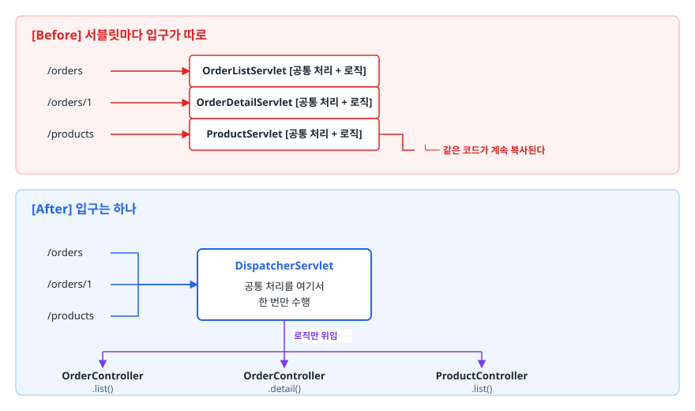
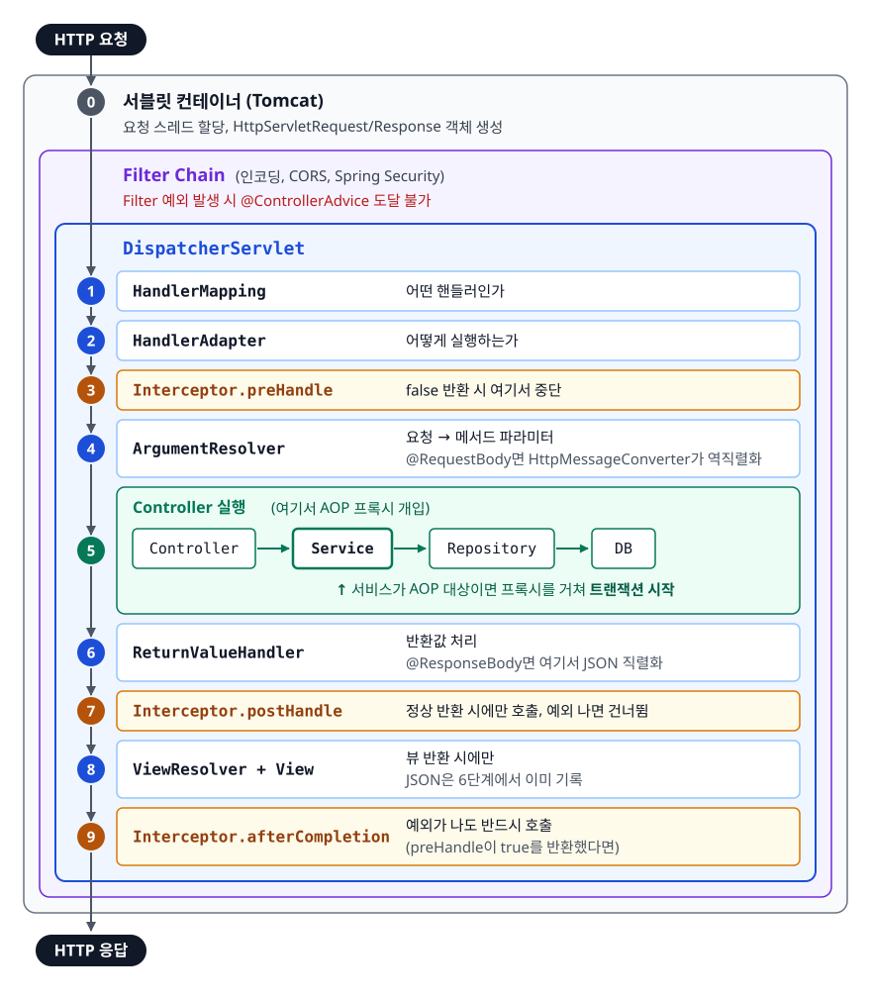
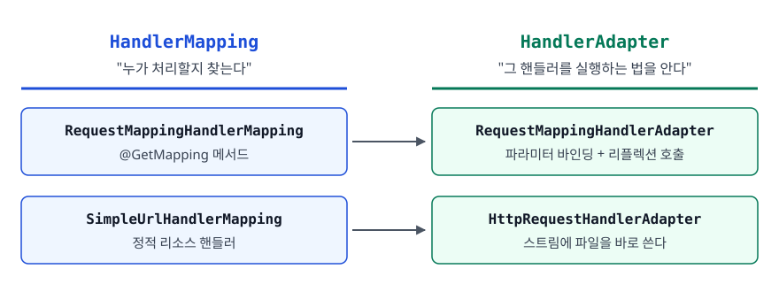
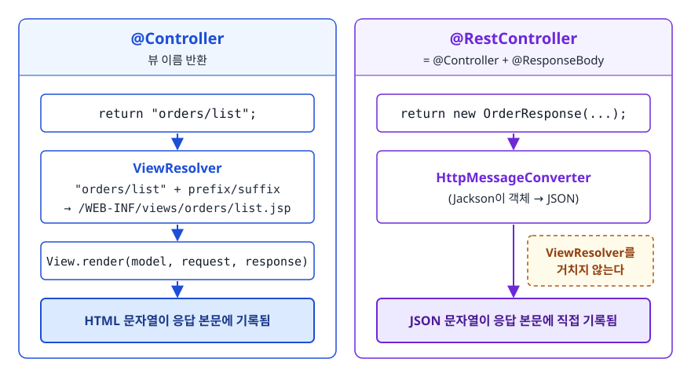
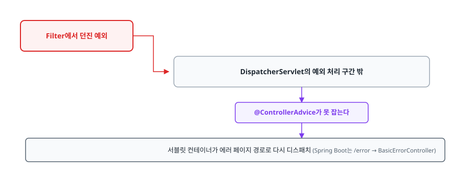
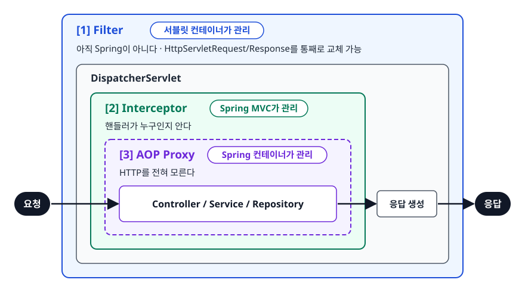

# Spring MVC 요청 처리 흐름 (Spring MVC Request Flow)

> Filter·Interceptor·AOP는 어느 층에 두느냐에 따라 할 수 있는 일과 못 하는 일이 갈립니다. HTTP 요청 한 건이 톰캣에 도착해서 응답이 나가기까지 지나는 객체와 순서를 따라가 보고, 셋 중 무엇을 언제 쓸지 가려냅니다.

## 학습 목표

- [ ] 프론트 컨트롤러 패턴이 어떤 중복을 없애려고 등장했는지 설명할 수 있다
- [ ] DispatcherServlet부터 응답까지의 경로를 화이트보드에 그릴 수 있다
- [ ] HandlerMapping과 HandlerAdapter가 왜 두 개로 나뉘어 있는지 말할 수 있다
- [ ] Filter, Interceptor, AOP의 적용 시점과 선택 기준을 근거와 함께 제시할 수 있다

## 선행 지식

- HTTP 요청/응답의 기본 구조 (메서드, 경로, 헤더, 바디)
- [01-ioc-di.md](./01-ioc-di.md) - HandlerMapping, ViewResolver 등이 모두 Bean이라는 전제

---

## 1. 왜 필요한가

### 서블릿만 있던 시절

Spring MVC 이전에는 URL 하나당 서블릿 클래스를 하나씩 만들었습니다.

```java
public class OrderListServlet extends HttpServlet {
    protected void doGet(HttpServletRequest req, HttpServletResponse resp) {
        req.setCharacterEncoding("UTF-8");                 // 매번
        if (req.getSession().getAttribute("user") == null) { // 매번
            resp.sendRedirect("/login");
            return;
        }
        log.info("{} 요청 시작", req.getRequestURI());       // 매번

        // ↓ 여기가 진짜 하고 싶은 일
        List<Order> orders = orderService.findAll();
        req.setAttribute("orders", orders);
        req.getRequestDispatcher("/WEB-INF/views/orders.jsp").forward(req, resp);
    }
}
```

그리고 `web.xml`에 서블릿마다 매핑을 등록했습니다.

```xml
<servlet><servlet-name>orderList</servlet-name>
  <servlet-class>com.shop.OrderListServlet</servlet-class></servlet>
<servlet-mapping><servlet-name>orderList</servlet-name>
  <url-pattern>/orders</url-pattern></servlet-mapping>
<!-- 화면이 100개면 이 블록이 100개 -->
```

여기서 문제가 두 가지 생깁니다.

1. **공통 처리가 모든 서블릿에 복사됩니다.** 인코딩, 로그인 확인, 로깅, 예외 처리. 하나만 빠뜨려도 그 URL만 한글이 깨집니다.
2. **응답 방식이 코드에 박혀 있습니다.** JSP로 포워드하는 코드가 서블릿 안에 있으니, 같은 데이터를 JSON으로도 주려면 서블릿을 하나 더 만들어야 합니다.

### 프론트 컨트롤러 패턴

**모든 요청을 하나의 입구로 모은 뒤, 거기서 공통 처리를 다 하고, 나머지만 각 컨트롤러에 나눠주면 됩니다.** 해법은 이만큼 단순합니다.

<!-- diagram:be-spring-mvc-flow-1 -->


<!-- 위 그림이 대체한 원본 ASCII.
     내용을 고칠 때는 그림도 함께 갱신할 것.
```
[Before] 서블릿마다 입구가 따로

  /orders   ──> OrderListServlet   [공통 처리 + 로직]
  /orders/1 ──> OrderDetailServlet [공통 처리 + 로직]
  /products ──> ProductServlet     [공통 처리 + 로직]
                                    └── 같은 코드가 계속 복사된다


[After] 입구는 하나

                       ┌─────────────────────┐
  /orders   ─┐         │  DispatcherServlet  │
  /orders/1  ├────────>│  공통 처리를 여기서 │
  /products ─┘         │  한 번만 수행       │
                       └──────────┬──────────┘
                                  │ 로직만 위임
                   ┌──────────────┼──────────────┐
                   ▼              ▼              ▼
            OrderController  OrderController  ProductController
              .list()          .detail()        .list()
```
-->

이 "하나뿐인 입구"가 **DispatcherServlet**입니다. Spring MVC의 거의 모든 구성 요소는 이 클래스 하나가 조율하는 부품이라고 봐도 됩니다.

> **비유**: 대형 병원의 접수 창구. 환자가 진료과를 직접 찾아다니는 대신 접수처가 증상을 보고 해당 과로 보냅니다. 접수처는 보험 확인, 진료기록 준비 같은 공통 절차를 한 번에 처리하고, 각 과는 진료에만 집중합니다.
>
> **비유의 한계**: 접수처는 환자를 보내고 나면 손을 뗍니다. DispatcherServlet은 다릅니다. 컨트롤러가 끝난 뒤에도 응답 변환과 예외 처리를 계속 책임집니다. 처음부터 끝까지 흐름의 주인은 DispatcherServlet입니다.

---

## 2. 요청 하나가 지나는 전 경로

### 전체 그림

<!-- diagram:be-spring-mvc-flow -->


<!-- 위 그림이 대체한 원본 ASCII.
     내용을 고칠 때는 그림도 함께 갱신할 것.
```
   HTTP 요청
      │
      ▼
┌───────────────────────────────────────────────────────────────┐
│ 서블릿 컨테이너 (Tomcat)                                       │
│   요청 스레드 할당, HttpServletRequest/Response 객체 생성      │
│      │                                                         │
│      ▼                                                         │
│  ┌──────────────────────────────────────────────────────────┐ │
│  │ Filter Chain   (인코딩, CORS, Spring Security)           │ │
│  │    │                                                      │ │
│  │    ▼                                                      │ │
│  │ ┌──────────────────────────────────────────────────────┐ │ │
│  │ │ DispatcherServlet                                    │ │ │
│  │ │  1. HandlerMapping    어떤 핸들러인가                │ │ │
│  │ │  2. HandlerAdapter    어떻게 실행하는가              │ │ │
│  │ │  3. Interceptor.preHandle                            │ │ │
│  │ │  4. ArgumentResolver  요청 → 메서드 파라미터         │ │ │
│  │ │       │                                              │ │ │
│  │ │       ▼   ┌──────────────────────────────────┐      │ │ │
│  │ │           │ Controller (여기서 AOP 프록시 개입)│     │ │ │
│  │ │           │   Service → Repository → DB       │      │ │ │
│  │ │           └──────────────────────────────────┘      │ │ │
│  │ │       │                                              │ │ │
│  │ │  6. ReturnValueHandler 반환값 처리                   │ │ │
│  │ │  7. Interceptor.postHandle                           │ │ │
│  │ │  8. ViewResolver + View  (뷰 반환 시에만)            │ │ │
│  │ │  9. Interceptor.afterCompletion                      │ │ │
│  │ └──────────────────────────────────────────────────────┘ │ │
│  └──────────────────────────────────────────────────────────┘ │
└───────────────────────────────────────────────────────────────┘
      │
      ▼
   HTTP 응답
```
-->

### 단계별로 무슨 일이 일어나나

**0단계 — 서블릿 컨테이너**
톰캣이 소켓에서 요청을 읽어 `HttpServletRequest`/`HttpServletResponse` 객체로 만들고, 스레드 풀에서 스레드 하나를 배정합니다. 이 스레드는 요청 처리가 끝날 때까지 붙어 있습니다. Spring Boot는 `DispatcherServlet`을 `/` 경로에 등록하므로 사실상 모든 요청이 이리로 옵니다.

**1단계 — HandlerMapping: 누가 처리할 것인가**
URL, HTTP 메서드, 헤더, 파라미터 조건을 종합해 요청을 처리할 핸들러를 찾습니다. `@RequestMapping` 계열을 처리하는 구현체는 `RequestMappingHandlerMapping`입니다. 결과로 나오는 `HandlerExecutionChain`에는 핸들러와 **적용될 인터셉터 목록**이 함께 담깁니다. 못 찾으면 404입니다.

**2단계 — HandlerAdapter: 어떻게 실행할 것인가**
찾은 핸들러를 실행할 수 있는 어댑터를 고릅니다. `@Controller`의 메서드는 `RequestMappingHandlerAdapter`가 맡습니다.

**3단계 — Interceptor.preHandle**
등록된 인터셉터들이 순서대로 실행됩니다. `false`를 반환하면 그 즉시 요청 처리가 중단되고 컨트롤러는 호출되지 않습니다.

**4단계 — ArgumentResolver**
요청을 자바 값으로 바꾸는 자리입니다. 컨트롤러 메서드가 `@RequestBody OrderRequest`, `@PathVariable Long id`, `@RequestParam int page` 같은 파라미터를 선언하면, 그것을 채우는 것이 `HandlerMethodArgumentResolver`들입니다. `@RequestBody`의 경우 이 단계에서 `HttpMessageConverter`가 JSON 본문을 객체로 역직렬화합니다.

**5단계 — Controller 실행**
비즈니스 로직이 돕니다. 서비스가 AOP 대상이라면 이 안에서 프록시를 거쳐 트랜잭션이 시작됩니다.

**6단계 — ReturnValueHandler**
반환값을 어떻게 처리할지는 반환 타입에 따라 갈립니다. 뷰 이름이면 뷰 렌더링 경로로, `@ResponseBody`가 붙어 있으면 응답 본문 직렬화 경로로 갑니다.

**7단계 — Interceptor.postHandle**
컨트롤러가 정상 반환했을 때만 호출됩니다. 예외가 나면 건너뜁니다.

**8단계 — 응답 생성**
뷰 방식이면 `ViewResolver`가 뷰 이름으로 실제 `View` 객체를 찾아 렌더링합니다. REST 방식은 이 단계에서 할 일이 없습니다. `HttpMessageConverter`가 이미 6단계(ReturnValueHandler)에서 반환 객체를 JSON으로 직렬화해 응답 본문에 써 두었기 때문입니다.

**9단계 — Interceptor.afterCompletion**
`preHandle`이 `true`를 반환했다면, 중간에 예외가 났더라도 반드시 호출됩니다. 자원 정리와 요청 단위 로그 마감에 적합한 자리입니다.

### HandlerMapping과 HandlerAdapter는 왜 둘인가

"찾아서 실행"이면 될 것을 왜 굳이 나눴을까요? **핸들러의 형태가 하나가 아니기 때문**입니다.

Spring MVC는 `@Controller` 메서드만 처리하지 않습니다. 정적 리소스를 내보내는 핸들러도 있고, 옛 방식인 `Controller` 인터페이스 구현체도 있습니다. 이들은 시그니처가 전혀 다릅니다.

<!-- diagram:be-spring-mvc-flow-5 -->


<!-- 위 그림이 대체한 원본 ASCII.
     내용을 고칠 때는 그림도 함께 갱신할 것.
```
        HandlerMapping                    HandlerAdapter
    "누가 처리할지 찾는다"            "그 핸들러를 실행하는 법을 안다"

  RequestMappingHandlerMapping  ──>  RequestMappingHandlerAdapter
       @GetMapping 메서드                파라미터 바인딩 + 리플렉션 호출

  SimpleUrlHandlerMapping       ──>  HttpRequestHandlerAdapter
       정적 리소스 핸들러                스트림에 파일을 바로 쓴다
```
-->

DispatcherServlet은 두 인터페이스만 알면 되니, 새로운 형태의 핸들러가 추가돼도 DispatcherServlet 코드는 그대로입니다. 어댑터 패턴을 교과서 그대로 쓴 셈입니다.

---

## 3. @Controller와 @RestController의 갈림길

두 방식은 **6단계 이후가 완전히 다릅니다.**

<!-- diagram:be-spring-mvc-flow-2 -->


<!-- 위 그림이 대체한 원본 ASCII.
     내용을 고칠 때는 그림도 함께 갱신할 것.
```
[@Controller + 뷰 이름 반환]

  return "orders/list";
        │
        ▼
   ViewResolver ─ "orders/list" + prefix/suffix ─> /WEB-INF/views/orders/list.jsp
        │
        ▼
   View.render(model, request, response)
        │
        ▼
   HTML 문자열이 응답 본문에 기록됨


[@RestController (= @Controller + @ResponseBody)]

  return new OrderResponse(...);
        │
        ▼
   HttpMessageConverter  (Jackson이 객체 → JSON)
        │
        ▼
   JSON 문자열이 응답 본문에 직접 기록됨   ← ViewResolver를 거치지 않는다
```
-->

```java
@Controller
public class OrderViewController {
    @GetMapping("/orders")
    public String list(Model model) {
        model.addAttribute("orders", orderService.findAll());
        return "orders/list";   // 뷰 이름
    }
}

@RestController
@RequestMapping("/api/orders")
public class OrderApiController {
    @GetMapping
    public List<OrderResponse> list() {
        return orderService.findAll();   // 그대로 JSON 직렬화
    }
}
```

`@Controller`에서 뷰가 아니라 데이터를 반환하고 싶으면 메서드에 `@ResponseBody`를 붙이면 됩니다. `@RestController`는 그것을 클래스 전체에 미리 붙여둔 것뿐입니다.

---

## 4. 예외는 어디서 처리되나

컨트롤러에서 예외가 터지면 `HandlerExceptionResolver`가 받습니다. 우리가 주로 쓰는 `@ExceptionHandler` / `@RestControllerAdvice`는 이 위에 올라간 구현입니다.

```java
@RestControllerAdvice
public class GlobalExceptionHandler {

    @ExceptionHandler(OrderNotFoundException.class)
    public ResponseEntity<ErrorResponse> handleNotFound(OrderNotFoundException e) {
        return ResponseEntity.status(HttpStatus.NOT_FOUND)
                .body(new ErrorResponse("ORDER_NOT_FOUND", e.getMessage()));
    }
}
```

여기서 **중요한 경계**가 하나 있습니다. `@ControllerAdvice`는 DispatcherServlet 안쪽에서 발생한 예외만 잡습니다.

<!-- diagram:be-spring-mvc-flow-3 -->


<!-- 위 그림이 대체한 원본 ASCII.
     내용을 고칠 때는 그림도 함께 갱신할 것.
```
Filter에서 던진 예외  ──> DispatcherServlet의 예외 처리 구간 밖
                          ──> @ControllerAdvice가 못 잡는다
                          ──> 서블릿 컨테이너가 에러 페이지 경로로 다시 디스패치
                              (Spring Boot는 /error → BasicErrorController)
```
-->

여기서 나오는 응답은 내가 만든 `@ExceptionHandler`가 아니라 Spring Boot의 기본 에러 응답입니다. `timestamp`, `status`, `error`, `path` 필드가 담긴 그 JSON이 바로 그것입니다.

JWT 검증을 Filter에서 하는 구조라면 `@ControllerAdvice`가 토큰 만료 예외를 잡지 못합니다. 이 경우 Filter 안에서 직접 응답 본문을 써주거나, Spring Security의 `AuthenticationEntryPoint` 같은 전용 지점을 써야 합니다. 실무에서 "JWT 만료 응답만 포맷이 다르다"는 현상의 원인이 대부분 이것입니다.

---

## 5. Filter vs Interceptor vs AOP

세 가지 모두 "공통 로직을 밖에서 끼워 넣는" 도구지만 사는 층이 다릅니다.

<!-- diagram:be-spring-mvc-flow-4 -->


<!-- 위 그림이 대체한 원본 ASCII.
     내용을 고칠 때는 그림도 함께 갱신할 것.
```
요청
 │
 ├─[1] Filter          ← 서블릿 컨테이너가 관리. 아직 Spring이 아니다
 │      │                 HttpServletRequest/Response를 통째로 교체 가능
 │      ▼
 │  DispatcherServlet
 │      │
 │      ├─[2] Interceptor  ← Spring MVC가 관리. 핸들러가 누구인지 안다
 │      │      │
 │      │      ▼
 │      │  ┌─[3] AOP Proxy   ← Spring 컨테이너가 관리. HTTP를 전혀 모른다
 │      │  │     Controller / Service / Repository
 │      │  └────
 │      ▼
 │  응답 생성
 ▼
응답
```
-->

| 구분 | Filter | Interceptor | AOP |
|------|--------|-------------|-----|
| 관리 주체 | 서블릿 컨테이너 | Spring MVC | Spring 컨테이너(프록시) |
| 적용 대상 | 모든 요청(정적 리소스 포함) | DispatcherServlet을 지나는 요청 | Bean의 메서드 호출 |
| 다룰 수 있는 것 | `ServletRequest`/`Response` 자체 | 요청 + **어떤 핸들러가 매핑됐는지** | 메서드 인자와 반환값 |
| 요청/응답 객체 교체 | 가능(`Wrapper`로 감싸기) | 불가 | 해당 없음 |
| 요청 중단 | `chain.doFilter()` 미호출 | `preHandle`에서 `false` 반환 | 예외를 던지거나 `proceed()` 미호출 |
| HTTP를 아는가 | 안다 | 안다 | 모른다 |
| 대표 용도 | 인코딩, CORS, 인증(Security), 요청 본문 캐싱 | 인증/인가, 핸들러 기준 로깅, 요청별 컨텍스트 | 트랜잭션, 캐시, 재시도, 메서드 단위 성능 측정 |

> 결론: **"HTTP 요청/응답 자체를 손봐야 하면 Filter, 어떤 컨트롤러가 걸렸는지 알아야 하면 Interceptor, HTTP와 무관한 메서드 단위 관심사면 AOP."** 이 한 문장이 선택 기준입니다.

### 선택이 갈리는 실전 예

**요청 본문 로깅을 Filter로 해야 하는 이유**
`HttpServletRequest`의 입력 스트림은 한 번만 읽을 수 있습니다. Interceptor에서 본문을 읽어버리면 그 뒤 `@RequestBody` 바인딩이 빈 본문을 만납니다. Filter라면 `ContentCachingRequestWrapper`로 요청 객체를 **감싸서 교체**할 수 있습니다. 이 래퍼는 `@RequestBody` 바인딩 등으로 본문이 읽히는 동안 그 내용을 캐싱해 두므로, `chain.doFilter()`가 끝난 뒤 `getContentAsByteArray()`로 본문을 다시 꺼내 로깅할 수 있습니다. 요청 객체를 갈아끼우는 것은 Filter만 할 수 있는 일입니다.

**권한 체크를 Interceptor로 하는 것이 편한 이유**
Interceptor의 `preHandle`은 세 번째 인자로 `Object handler`를 받습니다. 여기서 `HandlerMethod`로 캐스팅하면 **호출될 컨트롤러 메서드에 붙은 어노테이션**을 읽을 수 있습니다.

```java
@Component
public class AuthInterceptor implements HandlerInterceptor {
    @Override
    public boolean preHandle(HttpServletRequest request, HttpServletResponse response,
                             Object handler) {
        if (!(handler instanceof HandlerMethod handlerMethod)) {
            return true;   // 정적 리소스 등은 통과
        }
        if (handlerMethod.hasMethodAnnotation(AdminOnly.class) && !isAdmin(request)) {
            response.setStatus(HttpStatus.FORBIDDEN.value());
            return false;  // 컨트롤러를 호출하지 않고 종료
        }
        return true;
    }
}
```

Filter는 이 시점에 어떤 메서드가 호출될지 모릅니다. URL 패턴으로만 판단해야 합니다.

### postHandle의 함정

```java
// 안티패턴 - REST API에서 postHandle로 응답을 손보려는 시도
@Override
public void postHandle(HttpServletRequest req, HttpServletResponse res,
                       Object handler, ModelAndView mav) {
    mav.addObject("serverTime", LocalDateTime.now());   // NPE
}
```

**왜 문제인가**: `@ResponseBody` 계열 컨트롤러는 `ModelAndView`를 만들지 않으므로 `mav`가 `null`입니다. 이미 `HttpMessageConverter`가 응답 본문을 다 써버린 뒤라 지금 와서 바꿀 것도 없습니다. 게다가 컨트롤러가 예외를 던지면 `postHandle`은 아예 호출되지 않습니다.

```java
// 개선 1 - 응답 본문에 공통 필드를 추가하려면 ResponseBodyAdvice를 쓴다
@RestControllerAdvice
public class CommonResponseAdvice implements ResponseBodyAdvice<Object> { ... }

// 개선 2 - 성공/실패 무관하게 마무리 처리만 필요하면 afterCompletion을 쓴다
@Override
public void afterCompletion(HttpServletRequest req, HttpServletResponse res,
                            Object handler, Exception ex) {
    MDC.clear();   // 예외가 나도 반드시 실행된다
}
```

`postHandle`은 JSP처럼 뷰를 렌더링하는 애플리케이션에서 모델에 공통 값을 넣을 때 쓰는 자리입니다. REST API에서는 대부분 `afterCompletion` 아니면 `ResponseBodyAdvice`가 맞습니다.

---

## 6. 실무에서는

- **Spring Boot에서는 `web.xml`이 없습니다.** 내장 톰캣이 뜨면서 `DispatcherServlet`을 자동 등록하고 `/`에 매핑합니다. 예전에는 `ContextLoaderListener`가 만드는 루트 컨테이너와 `DispatcherServlet`이 만드는 서블릿용 컨테이너(Servlet WebApplicationContext)가 부모-자식으로 나뉘어 있었는데, Boot에서는 사실상 하나로 통합돼 신경 쓸 일이 없어졌습니다.
- **요청 추적 ID는 Filter + MDC 조합**이 표준적입니다. Filter 진입 시 UUID를 만들어 `MDC`에 넣고, 로그 패턴에 `%X{traceId}`를 넣으면 한 요청의 로그를 전부 묶어 볼 수 있습니다. 반드시 `finally`에서 `MDC.clear()`를 해야 합니다. 톰캣이 스레드를 재사용하기 때문에 정리하지 않으면 다음 요청에 이전 ID가 딸려갑니다.
- **인증은 Spring Security의 Filter 체인**이 사실상 표준입니다. Security가 붙으면 `DelegatingFilterProxy`를 거쳐 Spring Bean인 필터들이 서블릿 필터 체인에 끼어 들어옵니다. 인가되지 않은 요청은 DispatcherServlet에 닿기도 전에 차단됩니다.
- **404가 나는데 컨트롤러는 분명히 있다**면 HandlerMapping 단계에서 매칭에 실패한 것입니다. 경로 변수 패턴, HTTP 메서드, `produces`/`consumes` 조건을 순서대로 확인합니다. `RequestMappingHandlerMapping` 로거를 TRACE로 켜면 기동 로그에 매핑 목록이 출력되므로 거기서 비교하는 것이 빠릅니다(Spring Boot 2.1부터는 기본 로그 레벨에서 출력되지 않습니다).

---

## 7. 면접 포인트

> 면접에서 이 주제가 나오면 이렇게 답한다

**Q. Spring MVC의 요청 처리 흐름을 설명해주세요.**

A. 요청이 오면 서블릿 컨테이너가 Filter 체인을 거쳐 DispatcherServlet에 전달하고, DispatcherServlet은 HandlerMapping으로 요청을 처리할 핸들러와 인터셉터 목록을 찾은 뒤 HandlerAdapter로 그 핸들러를 실행합니다. 실행 전에 인터셉터 `preHandle`이 돌고, ArgumentResolver가 요청을 메서드 파라미터로 변환한 뒤 컨트롤러가 실행됩니다. 반환값이 뷰 이름이면 ViewResolver가 View를 찾아 렌더링하고, `@ResponseBody`면 HttpMessageConverter가 JSON으로 직렬화합니다. 마지막에 `afterCompletion`이 호출되고 응답이 나갑니다.
- 꼬리 질문: "프론트 컨트롤러 패턴의 장점이 뭔가요?" → 공통 처리를 한곳에 모아 중복을 없애고, 컨트롤러가 HTTP 세부사항에서 자유로워져 테스트하기 쉬워집니다.

**Q. HandlerMapping과 HandlerAdapter는 왜 분리돼 있나요?**

A. 핸들러의 형태가 하나가 아니기 때문입니다. `@RequestMapping` 메서드, 정적 리소스 핸들러, 구버전 `Controller` 인터페이스 구현체는 시그니처가 전부 다릅니다. 핸들러를 골라내는 책임과 고른 핸들러를 그 형태에 맞게 실행하는 책임을 나눠두면, 새로운 핸들러 유형이 생겨도 어댑터만 추가하면 되고 DispatcherServlet은 바뀌지 않습니다. 어댑터 패턴을 적용한 확장 포인트입니다.

**Q. Filter와 Interceptor 중 무엇을 언제 쓰나요?**

A. 요청/응답 객체 자체를 다뤄야 하면 Filter입니다. 예를 들어 요청 본문을 여러 번 읽어야 하는 로깅은 `ContentCachingRequestWrapper`로 요청을 감싸 교체해야 하는데, 이건 Filter만 할 수 있습니다. 반대로 어떤 컨트롤러 메서드가 매핑됐는지 알아야 하는 경우는 Interceptor입니다. `preHandle`이 `HandlerMethod`를 받기 때문에 메서드에 붙은 커스텀 어노테이션을 읽어 권한을 판단할 수 있습니다. Spring Bean 접근도 Interceptor가 자연스럽습니다.
- 꼬리 질문: "Filter에서 던진 예외는 `@ControllerAdvice`로 잡히나요?" → 잡히지 않습니다. 서블릿 컨테이너가 에러 경로로 다시 디스패치해 Spring Boot 기본 에러 응답(`/error`)이 나갑니다.

**Q. `@Controller`와 `@RestController`의 차이는 무엇인가요?**

A. `@RestController`는 `@Controller`에 `@ResponseBody`를 클래스 단위로 붙여둔 것입니다. `@Controller`의 String 반환값은 뷰 이름으로 해석돼 ViewResolver를 거치지만, `@ResponseBody`가 붙으면 ViewResolver를 건너뛰고 HttpMessageConverter가 반환 객체를 JSON 등으로 직렬화해 응답 본문에 바로 씁니다.
- 꼬리 질문: "`@RestController`에서 String을 반환하면요?" → 뷰 이름이 아니라 그 문자열 자체가 응답 본문이 됩니다.

---

## 자주 하는 실수

| 실수 | 왜 틀렸나 | 올바른 이해 |
|------|----------|-----------|
| "인터셉터가 필터보다 먼저 실행된다" | Filter는 DispatcherServlet 바깥, Interceptor는 안쪽이다 | Filter → DispatcherServlet → Interceptor 순 |
| "`postHandle`은 항상 호출된다" | 컨트롤러가 예외를 던지면 건너뛴다 | 항상 실행돼야 하는 정리 작업은 `afterCompletion`에 둔다 |
| "`@ControllerAdvice`가 모든 예외를 잡는다" | Filter 단계 예외는 DispatcherServlet의 예외 처리 구간 밖이다 | 필터 예외는 필터 안에서 처리하거나 Security 전용 지점을 쓴다. 그냥 두면 Boot 기본 에러 응답이 나간다 |
| "`@RestController`도 ViewResolver를 거친다" | `@ResponseBody` 경로는 View를 만들지 않는다 | HttpMessageConverter가 응답 본문을 직접 쓴다 |
| "Interceptor에서 요청 본문을 읽어도 된다" | 입력 스트림은 한 번만 읽을 수 있어 이후 바인딩이 깨진다 | 본문을 봐야 하면 Filter에서 캐싱 래퍼로 감싼다 |
| "DispatcherServlet은 요청을 넘기고 끝난다" | 응답 생성과 예외 처리까지 관장한다 | 요청 전 구간의 조율자다 |

---

## 한 줄 정리

Spring MVC는 모든 요청을 DispatcherServlet 하나로 모아 **"누가 처리할지(HandlerMapping) → 어떻게 실행할지(HandlerAdapter) → 결과를 어떻게 응답으로 바꿀지(ViewResolver 또는 HttpMessageConverter)"** 를 순서대로 결정하는 구조입니다. 공통 로직은 위치에 따라 Filter·Interceptor·AOP 중에서 고릅니다.

---

## 연관 개념

- [02-aop-proxy.md](./02-aop-proxy.md) - 컨트롤러 안쪽에서 동작하는 세 번째 층, AOP
- [05-spring-boot-auto-config.md](./05-spring-boot-auto-config.md) - DispatcherServlet과 내장 톰캣이 자동으로 등록되는 원리
- [01-ioc-di.md](./01-ioc-di.md) - MVC 구성 요소들도 결국 컨테이너가 관리하는 Bean
- [qna-spring.md](./qna-spring.md) - MVC 흐름과 Filter/Interceptor 면접 질문(Q4, Q10, Q11, Q13)
- [../authentication/qna-authentication.md](../authentication/qna-authentication.md) - Filter 체인에서 이뤄지는 인증/인가
- [../../01-computer-science-fundamentals/network/qna-network.md](../../01-computer-science-fundamentals/network/qna-network.md) - HTTP 요청/응답 기본기
