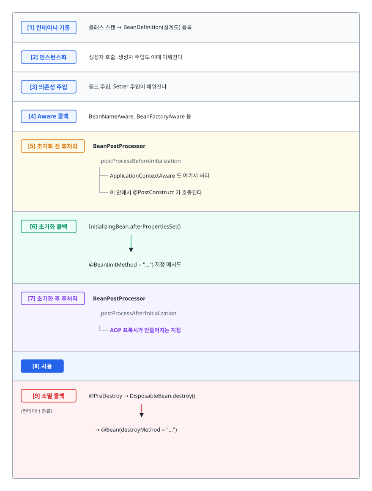
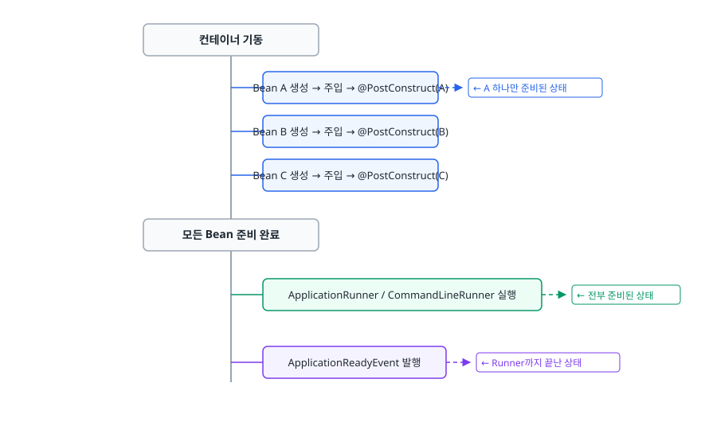
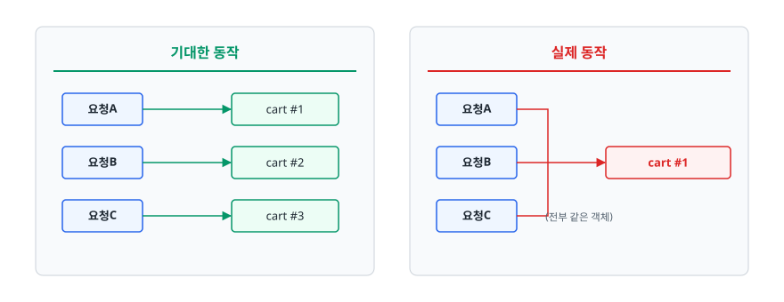

# Bean 생명주기와 스코프 (Bean Lifecycle & Scope)

> 컨테이너가 Bean을 만들고 초기화하고 없애기까지 정확히 어떤 순서로 무엇을 호출하는지, 그리고 스코프를 잘못 조합했을 때 왜 조용히 잘못 동작하는지 설명할 수 있게 됩니다.

## 학습 목표

- [ ] Bean 생성부터 소멸까지의 콜백 순서를 순서대로 나열할 수 있다
- [ ] 초기화 로직을 생성자가 아니라 `@PostConstruct`에 두는 이유를 설명할 수 있다
- [ ] Bean Scope 여섯 가지의 생명주기와 용도를 구분할 수 있다
- [ ] singleton에 prototype을 주입했을 때 생기는 문제와 세 가지 해법을 제시할 수 있다
- [ ] `@Component`와 `@Bean`을 언제 각각 쓰는지 판단할 수 있다

## 선행 지식

- [01-ioc-di.md](./01-ioc-di.md) - 컨테이너가 Bean을 등록하고 주입하는 과정
- [02-aop-proxy.md](./02-aop-proxy.md) - 프록시가 언제 만들어지는지가 생명주기와 얽힌다

---

## 1. 왜 필요한가

### 자원은 만들 때와 없앨 때가 정해져 있다

메시지 큐 컨슈머를 Bean으로 만든다고 하자. 이 객체는 태어나자마자 큐에 연결해야 하고, 애플리케이션이 내려갈 때는 연결을 끊고 처리 중인 메시지를 마무리해야 합니다.

정리하지 않으면 어떻게 되나. 커넥션 풀이 반환되지 않아 DB 쪽 세션이 쌓이고, 스레드 풀이 종료되지 않아 JVM이 안 죽고, 파일 핸들이 열린 채로 남습니다. 배포할 때마다 조금씩 새는 자원은 며칠 뒤 장애로 돌아옵니다.

그래서 컨테이너는 Bean에게 **"준비됐다"** 와 **"이제 없앤다"** 두 시점을 알려주는 약속된 지점을 제공합니다. 그것이 생명주기 콜백입니다.

### "그럼 생성자에서 하면 되지 않나"

가장 자연스러운 발상이지만 세 가지 이유로 막힙니다.

```java
// 안티패턴 - 생성자에서 초기화
@Service
public class CacheService {
    private final ProductRepository productRepository;
    private Map<Long, Product> cache;

    public CacheService(ProductRepository productRepository) {
        this.productRepository = productRepository;
        this.cache = loadAll();   // 여기서 DB를 읽는다
    }
}
```

**왜 문제인가**
1. **의존성이 아직 완전하지 않을 수 있다.** 필드 주입이나 Setter 주입을 함께 쓰는 클래스라면 생성자 실행 시점에 일부 필드가 `null`입니다.
2. **프록시가 아직 없다.** AOP 프록시는 초기화가 끝난 뒤에 씌워집니다. 생성자 안에서 자기 메서드를 불러봐야 트랜잭션도 캐시도 걸리지 않습니다.
3. **생성자는 객체를 만드는 일만 해야 한다.** DB 조회처럼 실패할 수 있고 오래 걸리는 작업을 생성자에 넣으면, 객체 생성이 실패하는 것인지 초기화가 실패하는 것인지 구분되지 않습니다.

```java
// 개선 - 초기화는 초기화 콜백에서
@Service
@RequiredArgsConstructor
public class CacheService {
    private final ProductRepository productRepository;
    private Map<Long, Product> cache;

    @PostConstruct
    void warmUp() {              // 의존성 주입이 끝난 뒤 호출된다
        this.cache = loadAll();
    }
}
```

**객체 생성**과 **사용 준비**는 별개의 단계입니다. 이 분리가 생명주기 콜백이 존재하는 이유입니다.

> 비유: 신입사원이 입사(생성)한 날 바로 실무에 투입되지는 않습니다. 사번을 받고 계정을 만들고 장비를 세팅하는 온보딩(초기화)을 거쳐야 일할 수 있고, 퇴사할 때는 계정을 회수하고 인수인계(소멸)를 합니다.
>
> **비유의 한계**: 사람은 온보딩 중에도 스스로 판단하지만, Bean은 컨테이너가 정해둔 순서대로 수동적으로 호출될 뿐입니다. 순서를 개발자가 임의로 바꿀 수 없습니다.

---

## 2. 생명주기 전 과정

<!-- diagram:be-bean-lifecycle-1 -->


<!-- 위 그림이 대체한 원본 ASCII.
     내용을 고칠 때는 그림도 함께 갱신할 것.
```
┌───────────────────────────────────────────────────────────────┐
│ [1] 컨테이너 기동    클래스 스캔 → BeanDefinition(설계도) 등록 │
├───────────────────────────────────────────────────────────────┤
│ [2] 인스턴스화       생성자 호출. 생성자 주입도 이때 이뤄진다  │
├───────────────────────────────────────────────────────────────┤
│ [3] 의존성 주입      필드 주입, Setter 주입이 채워진다         │
├───────────────────────────────────────────────────────────────┤
│ [4] Aware 콜백       BeanNameAware, BeanFactoryAware 등        │
├───────────────────────────────────────────────────────────────┤
│ [5] 초기화 전 후처리 BeanPostProcessor                         │
│                        .postProcessBeforeInitialization        │
│                      ├ ApplicationContextAware 도 여기서 처리  │
│                      └ 이 안에서 @PostConstruct 가 호출된다    │
├───────────────────────────────────────────────────────────────┤
│ [6] 초기화 콜백      InitializingBean.afterPropertiesSet()     │
│                         ↓                                      │
│                      @Bean(initMethod = "...") 지정 메서드     │
├───────────────────────────────────────────────────────────────┤
│ [7] 초기화 후 후처리 BeanPostProcessor                         │
│                        .postProcessAfterInitialization         │
│                      └ AOP 프록시가 만들어지는 지점            │
├───────────────────────────────────────────────────────────────┤
│ [8] 사용                                                       │
├───────────────────────────────────────────────────────────────┤
│ [9] 소멸 콜백        @PreDestroy → DisposableBean.destroy()    │
│     (컨테이너 종료)     → @Bean(destroyMethod = "...")         │
└───────────────────────────────────────────────────────────────┘
```
-->

### [7]번을 기억해야 하는 이유

**AOP 프록시는 초기화가 다 끝난 뒤에 씌워진다.** 여기서 실무에서 종종 만나는 함정이 나옵니다.

```java
// 안티패턴
@Service
public class DataInitializer {

    @PostConstruct
    @Transactional          // 이 트랜잭션은 동작하지 않는다
    public void init() {
        insertDefaultData();
    }
}
```

**왜 문제인가**: `@PostConstruct`는 [5]번 단계에서 **원본 객체**에 대해 호출됩니다. 프록시는 [7]번에서야 만들어지므로, 초기화 콜백이 실행되는 시점에는 트랜잭션을 걸어줄 프록시가 아직 존재하지 않습니다.

```java
// 개선 - 트랜잭션이 필요한 초기화는 기동 완료 후로 미루고, 다른 Bean을 통해 호출한다
@Component
@RequiredArgsConstructor
public class DataInitializer implements ApplicationRunner {
    private final DefaultDataService defaultDataService;

    @Override
    public void run(ApplicationArguments args) {
        defaultDataService.insertDefaultData();   // 다른 Bean 호출 → 프록시 경유
    }
}
```

---

## 3. 콜백을 지정하는 네 가지 방법

```java
@Component
public class ConnectionPoolBean implements InitializingBean, DisposableBean {

    @PostConstruct void init() { }        // 방법 1. 어노테이션 (권장)
    @PreDestroy    void cleanUp() { }

    @Override public void afterPropertiesSet() { }   // 방법 2. 인터페이스 구현
    @Override public void destroy() { }
}

@Configuration
public class PoolConfig {
    // 방법 3. @Bean 속성 - 소스를 고칠 수 없는 외부 라이브러리 클래스에 사용
    @Bean(initMethod = "start", destroyMethod = "stop")
    public ExternalPool externalPool() { return new ExternalPool(); }
}
```

| 방법 | 코드 침투 | 외부 라이브러리에 적용 | 비고 |
|------|----------|---------------------|------|
| `@PostConstruct` / `@PreDestroy` | 없음(자바 표준 어노테이션) | 불가(소스를 못 고침) | **기본 선택지** |
| `InitializingBean` / `DisposableBean` | Spring 인터페이스를 구현해야 함 | 불가 | 요즘은 거의 안 쓴다 |
| `@Bean(initMethod, destroyMethod)` | 없음 | **가능** | 외부 클래스용 |
| 생성자 | 해당 없음 | 해당 없음 | 초기화 용도로는 부적절 |

> 결론: **내가 작성한 클래스는 `@PostConstruct`, 남이 만든 클래스는 `@Bean`의 속성.** 인터페이스 방식은 Spring에 코드가 묶이고 메서드 이름도 바꿀 수 없어 선택할 이유가 거의 없습니다.

`@PostConstruct`의 패키지는 Spring Boot 3 이상에서 `jakarta.annotation.PostConstruct`, 그 이전 버전에서는 `javax.annotation.PostConstruct`다. 임포트가 안 잡히면 이 차이를 먼저 확인하자.

`@Bean`의 `destroyMethod`는 지정하지 않아도 `close`나 `shutdown`이라는 이름의 public 메서드가 있으면 Spring이 자동으로 찾아 호출합니다. 자동 호출을 원하지 않으면 `destroyMethod = ""`로 명시적으로 꺼야 합니다.

---

## 4. 언제 실행되는가 — 초기화 시점 네 가지 비교

"애플리케이션 시작할 때 이 코드를 돌리고 싶다"는 요구는 흔한데, 선택지가 여럿이라 헷갈립니다.

<!-- diagram:be-bean-lifecycle-2 -->


<!-- 위 그림이 대체한 원본 ASCII.
     내용을 고칠 때는 그림도 함께 갱신할 것.
```
컨테이너 기동
  │
  ├── Bean A 생성 → 주입 → @PostConstruct(A)        ← A 하나만 준비된 상태
  ├── Bean B 생성 → 주입 → @PostConstruct(B)
  ├── Bean C 생성 → 주입 → @PostConstruct(C)
  │
  ├── 모든 Bean 준비 완료
  │
  ├── ApplicationRunner / CommandLineRunner 실행     ← 전부 준비된 상태
  │
  └── ApplicationReadyEvent 발행                     ← Runner까지 끝난 상태
```
-->

| 시점 | 보장되는 것 | 적합한 작업 |
|------|-----------|-----------|
| `@PostConstruct` | 이 Bean의 의존성 주입 완료 | 그 Bean 내부의 준비 (내부 캐시 세팅, 검증) |
| `CommandLineRunner` | 모든 Bean 준비 완료. 인자를 `String[]`으로 받음 | 초기 데이터 적재, 외부 시스템 연결 확인 |
| `ApplicationRunner` | 위와 같음. 인자를 `ApplicationArguments`로 파싱해서 받음 | `--env=prod` 같은 옵션을 읽어야 할 때 |
| `ApplicationReadyEvent` | Runner까지 모두 끝남 | 기동 완료 알림, 헬스체크 등록 |

> 결론: **"이 Bean만 있으면 되는가, 다른 Bean도 필요한가"** 로 판단합니다. 다른 Bean을 호출해야 하면 `@PostConstruct`가 아니라 Runner를 씁니다. `CommandLineRunner`와 `ApplicationRunner`의 차이는 인자 파싱 편의뿐이라 옵션 인자를 안 쓰면 아무거나 써도 됩니다.

---

## 5. Bean Scope 여섯 가지

스코프는 **"이 Bean의 인스턴스가 몇 개 만들어지고 언제까지 사나"** 를 정합니다.

| Scope | 인스턴스 개수 | 수명 | 소멸 콜백 |
|-------|-------------|------|----------|
| `singleton` (기본) | 컨테이너당 1개 | 컨테이너와 동일 | 호출됨 |
| `prototype` | 요청할 때마다 새로 | 받는 쪽이 버릴 때까지 | **호출 안 됨** |
| `request` | HTTP 요청당 1개 | 요청 시작~응답 완료 | 호출됨 |
| `session` | HTTP 세션당 1개 | 세션 생성~만료 | 호출됨 |
| `application` | `ServletContext`당 1개 | 웹 애플리케이션 수명 | 호출됨 |
| `websocket` | WebSocket 세션당 1개 | 세션 연결~종료 | 호출됨 |

> 결론: 실무에서 쓰는 건 사실상 **singleton이 99%**, 요청별 컨텍스트가 필요할 때 `request`, 아주 가끔 `prototype`입니다. `application`은 singleton과 실질적으로 구분되지 않아 쓸 일이 거의 없습니다.

### prototype만 소멸 콜백이 없는 이유

prototype Bean에 대해 컨테이너는 **생성하고 주입한 뒤 손을 뗀다.** 몇 개가 만들어졌는지, 누가 들고 있는지 추적하지 않으므로 언제 없애야 할지 알 수 없습니다. 그래서 `@PreDestroy`가 호출되지 않습니다.

```java
@Component
@Scope("prototype")
public class ReportBuilder {
    @PreDestroy
    void close() { }   // 절대 호출되지 않는다
}
```

prototype Bean이 파일 핸들이나 커넥션 같은 자원을 들면, 받은 쪽이 직접 닫아야 합니다. 이런 이유로 자원을 쥐는 객체는 prototype으로 만들지 않는 편이 낫습니다.

### request/session 스코프에는 프록시가 필요하다

```java
// 안티패턴 - request 스코프를 그냥 주입
@Component
@Scope("request")
public class RequestContext { }

@Service
@RequiredArgsConstructor
public class OrderService {
    private final RequestContext requestContext;   // 기동 시점에 실패
}
```

**왜 문제인가**: singleton Bean은 컨테이너 기동 시점에 만들어집니다. 그런데 그때는 처리 중인 HTTP 요청이 없으므로 `request` 스코프 Bean을 만들 수 없습니다. 컨테이너는 "Scope 'request' is not active for the current thread"라는 메시지와 함께 기동에 실패합니다. 예외 타입은 Spring 5.3 이상이면 `ScopeNotActiveException`, 그 이전 버전이면 `BeanCreationException`입니다.

```java
// 개선 - 스코프 프록시를 씌운다
@Component
@Scope(value = "request", proxyMode = ScopedProxyMode.TARGET_CLASS)
public class RequestContext {
    private final String traceId = UUID.randomUUID().toString();
    public String getTraceId() { return traceId; }
}
```

`proxyMode`를 주면 컨테이너는 진짜 객체 대신 **껍데기 프록시**를 주입합니다. 이 프록시는 메서드가 호출되는 순간에야 "지금 이 스레드가 처리 중인 요청"에 해당하는 실제 객체를 찾아 위임합니다. singleton은 프록시 하나만 계속 들고 있고, 그 뒤에서 요청마다 다른 실체가 갈아 끼워집니다.

---

## 6. singleton에 prototype을 주입하면

이 조합은 컴파일도 되고 기동도 되지만 **의도한 대로 동작하지 않는다.** 조용히 틀리는 유형이라 면접 단골입니다.

```java
// 안티패턴
@Component
@Scope("prototype")
public class ShoppingCart {
    private final List<Item> items = new ArrayList<>();
    public void add(Item item) { items.add(item); }
}

@Service
@RequiredArgsConstructor
public class OrderService {          // singleton
    private final ShoppingCart cart;  // prototype

    public void addItem(Long userId, Item item) {
        cart.add(item);
    }
}
```

**왜 문제인가**: 주입은 `OrderService`가 **만들어질 때 딱 한 번** 일어납니다. 그 순간 `ShoppingCart` 하나가 생성되어 필드에 들어가고, 이후로는 영원히 그 인스턴스가 쓰입니다. prototype이라고 선언했지만 **실질적으로 singleton처럼 동작**합니다. 게다가 이 장바구니는 모든 사용자가 공유합니다.

<!-- diagram:be-bean-lifecycle-3 -->


<!-- 위 그림이 대체한 원본 ASCII.
     내용을 고칠 때는 그림도 함께 갱신할 것.
```
기대한 동작                          실제 동작
──────────                          ─────────
요청A → cart #1                     요청A ─┐
요청B → cart #2                     요청B ─┼─> cart #1 (전부 같은 객체)
요청C → cart #3                     요청C ─┘
```
-->

### 해법 세 가지

```java
// 개선 1 - ObjectProvider (Spring 제공, 가장 일반적)
@Service
@RequiredArgsConstructor
public class OrderService {
    private final ObjectProvider<ShoppingCart> cartProvider;

    public void addItem(Item item) {
        ShoppingCart cart = cartProvider.getObject();   // 호출할 때마다 새 인스턴스
        cart.add(item);
    }
}
```

```java
// 개선 2 - JSR-330 Provider (jakarta.inject 의존성 필요, Spring 비의존적)
//          타입만 다르고 사용법은 같다. getObject() 대신 get() 을 부른다
private final Provider<ShoppingCart> cartProvider;

// 개선 3 - 스코프 프록시 (주입받는 쪽 코드를 전혀 바꾸지 않아도 된다)
@Component
@Scope(value = "prototype", proxyMode = ScopedProxyMode.TARGET_CLASS)
public class ShoppingCart { ... }
```

| 방법 | 원리 | 특징 |
|------|------|------|
| `ObjectProvider` | 필요한 순간에 컨테이너에서 꺼낸다(Dependency Lookup) | 의도가 코드에 드러남. Spring API 사용 |
| JSR-330 `Provider` | 같음 | 자바 표준이라 Spring 의존이 없음. 별도 의존성 추가 필요 |
| 스코프 프록시 | 껍데기가 호출 시점에 실체를 찾아 위임 | 사용하는 쪽 코드가 깔끔. 대신 동작이 코드에 안 드러남 |

> 결론: **"새 인스턴스가 필요하다"는 사실을 코드에서 보이게 하고 싶으면 `ObjectProvider`**, 주입받는 쪽을 건드릴 수 없다면 스코프 프록시를 씁니다. 애초에 prototype이 정말 필요한지부터 의심해보는 것이 먼저입니다. 요청 단위 상태라면 `request` 스코프나 지역 변수가 더 적합한 경우가 많습니다.

---

## 7. @Component와 @Bean

둘 다 Bean을 등록하지만 쓰는 자리와 이유가 다릅니다.

| 구분 | `@Component` | `@Bean` |
|------|-------------|---------|
| 붙이는 곳 | 클래스 | `@Configuration` 클래스의 메서드 |
| 등록 방식 | 컴포넌트 스캔이 자동 발견 | 메서드 반환값을 수동 등록 |
| 생성 로직 제어 | 생성자에 맡김 | 메서드 안에서 자유롭게 조립 |
| 소스 수정 필요 | 필요(어노테이션을 붙여야 하므로) | 불필요 |
| Bean 이름 | 클래스명 첫 글자 소문자 | 메서드명 |

```java
// @Component - 내가 만든 클래스
@Service
@RequiredArgsConstructor
public class OrderService {
    private final OrderRepository orderRepository;
}

// @Bean - 남이 만든 클래스, 또는 생성 과정에 조립이 필요한 경우
@Configuration
public class AppConfig {
    @Bean
    public PaymentClient paymentClient(@Value("${payment.url}") String url) {
        return new PaymentClient(url, Duration.ofSeconds(3));
    }
}
```

> 결론: **소스를 고칠 수 있는 내 클래스는 `@Component` 계열, 외부 라이브러리 클래스나 생성 과정에 설정이 필요한 객체는 `@Bean`.**

### `@Configuration`이 붙은 클래스가 특별한 이유

```java
@Configuration
public class AppConfig {
    @Bean public A a() { return new A(b()); }
    @Bean public B b() { return new B(); }   // a()와 c()가 각각 부르면?
    @Bean public C c() { return new C(b()); }
}
```

평범한 자바라면 `b()`가 두 번 호출되어 서로 다른 인스턴스가 만들어져야 합니다. 그러면 싱글톤이 깨집니다. 그래서 Spring은 `@Configuration` 클래스를 CGLIB로 프록시해서, **이미 만든 Bean이 있으면 메서드를 실행하지 않고 컨테이너에 있는 것을 돌려준다.** `a()`와 `c()`가 받는 `B`는 같은 인스턴스입니다.

이 동작은 `@Configuration(proxyBeanMethods = false)`로 끌 수 있습니다. 프록시를 만들지 않으므로 기동이 조금 빨라지지만, 위처럼 `@Bean` 메서드끼리 호출하는 코드가 있으면 싱글톤이 깨집니다. **`@Bean` 메서드가 서로를 호출하지 않는 설정 클래스에만** 쓸 수 있는 최적화입니다.

`@Component`에 `@Bean` 메서드를 넣어도 등록은 되지만 이 프록시가 적용되지 않습니다. 설정 클래스에는 `@Configuration`을 쓰는 것이 안전합니다.

---

## 8. 실무에서는

- **`@PostConstruct`는 무겁게 쓰지 않는다.** 여기서 예외가 나면 애플리케이션이 아예 기동하지 않습니다. 외부 시스템 호출처럼 실패 가능성이 있는 작업은 Runner로 옮기거나 실패해도 기동은 되도록 예외를 잡아 로그만 남기는 편이 낫습니다.
- **소멸 콜백은 정상 종료에서만 보장된다.** `SIGKILL`이나 컨테이너 강제 종료에서는 실행되지 않습니다. 그래서 쿠버네티스 환경에서는 `preStop` 훅과 Graceful Shutdown 설정을 함께 씁니다.
- **`@Scope("request")`는 로그 추적에 요긴하다.** 요청 ID, 호출자 정보 같은 요청 단위 컨텍스트를 담기 좋습니다. 다만 비동기 스레드로 넘어가면 스코프가 따라가지 않으므로, `@Async` 메서드 안에서 request 스코프 Bean에 접근하면 실패합니다.
- **prototype을 실무에서 볼 일은 드물다.** 매번 새 객체가 필요하다면 대개는 그냥 `new`로 만드는 값 객체이지 Bean일 이유가 없습니다. Bean이어야 하는 이유(다른 Bean 주입이 필요하다 등)가 명확할 때만 씁니다.

---

## 9. 면접 포인트

> 면접에서 이 주제가 나오면 이렇게 답한다

**Q. Bean의 생명주기를 설명해주세요.**
A. 컨테이너가 기동하면 클래스를 스캔해 BeanDefinition을 등록하고, 그 설계도대로 인스턴스를 만들면서 생성자 주입을 수행합니다. 이어서 필드/Setter 주입과 Aware 콜백이 끝나면 `@PostConstruct`, `afterPropertiesSet()`, `initMethod` 순서로 초기화 콜백이 호출됩니다. 그 뒤 `BeanPostProcessor`의 후처리 단계에서 AOP 프록시가 만들어지고, 이때부터 사용 가능한 상태가 됩니다. 컨테이너가 종료되면 `@PreDestroy`, `destroy()`, `destroyMethod` 순으로 소멸 콜백이 실행됩니다.
- 꼬리 질문: "`@PostConstruct`에 `@Transactional`을 붙이면 어떻게 되나요?" → 초기화 콜백은 프록시가 씌워지기 전에 원본 객체에서 실행되므로 트랜잭션이 적용되지 않는다고 답합니다.

**Q. 초기화 로직을 생성자에 두면 안 되나요?**
A. 세 가지 이유로 권장되지 않습니다. 생성자 시점에는 필드 주입 같은 나머지 의존성이 아직 채워지지 않았을 수 있고, AOP 프록시도 만들어지기 전이라 부가 기능이 동작하지 않으며, 객체 생성 실패와 초기화 실패가 구분되지 않아 원인 파악이 어려워집니다. 생성자는 필드를 대입하는 정도로 가볍게 두고, 실패할 수 있는 준비 작업은 `@PostConstruct`로 분리하는 것이 안전합니다.

**Q. singleton 빈에 prototype 빈을 주입하면 어떻게 되나요?**
A. 주입은 singleton이 생성될 때 한 번만 일어나므로, prototype 빈도 그때 딱 하나 만들어져 계속 재사용됩니다. 결과적으로 prototype처럼 동작하지 않고 singleton처럼 동작합니다. 해결하려면 `ObjectProvider`나 JSR-330 `Provider`로 필요한 순간에 꺼내 쓰거나, prototype 빈에 `ScopedProxyMode.TARGET_CLASS`를 설정해 프록시가 매번 새 인스턴스를 찾아가게 해야 합니다.
- 꼬리 질문: "prototype 빈의 `@PreDestroy`는 언제 호출되나요?" → 호출되지 않습니다. 컨테이너가 생성과 주입까지만 관여하고 이후 생명주기를 추적하지 않기 때문입니다.

**Q. `@Component`와 `@Bean`은 어떻게 구분해서 쓰나요?**
A. 소스 코드를 제가 고칠 수 있는 클래스에는 `@Component` 계열을 붙여 컴포넌트 스캔으로 등록하고, `ObjectMapper`나 외부 SDK처럼 어노테이션을 붙일 수 없는 클래스는 `@Configuration` 클래스 안에서 `@Bean` 메서드로 등록합니다. 생성 과정에 설정값 주입이나 조립 로직이 필요한 경우도 `@Bean`이 적합합니다.
- 꼬리 질문: "`@Configuration` 대신 `@Component`에 `@Bean`을 써도 되나요?" → 등록은 되지만 CGLIB 프록시가 적용되지 않아 `@Bean` 메서드끼리 호출할 때 싱글톤이 깨집니다.

---

## 자주 하는 실수

| 실수 | 왜 틀렸나 | 올바른 이해 |
|------|----------|-----------|
| "`@PostConstruct`에서 다른 Bean을 마음껏 써도 된다" | 그 Bean의 초기화가 아직 안 끝났을 수 있다 | 여러 Bean이 필요한 작업은 `ApplicationRunner`로 미룬다 |
| "prototype 빈도 `@PreDestroy`가 호출된다" | 컨테이너가 prototype의 수명을 추적하지 않는다 | 받은 쪽이 직접 정리해야 한다 |
| "`@Scope("request")`만 붙이면 singleton에 주입된다" | 기동 시점에는 요청이 없어 실체를 만들 수 없다 | `proxyMode`로 프록시를 씌워야 한다 |
| "prototype으로 선언했으니 매번 새 객체다" | 주입은 한 번뿐이라 재사용된다 | `ObjectProvider`나 스코프 프록시가 필요하다 |
| "`InitializingBean`이 `@PostConstruct`보다 먼저다" | `@PostConstruct`가 먼저 호출된다 | 순서는 `@PostConstruct` → `afterPropertiesSet()` → `initMethod` |
| "소멸 콜백은 언제나 실행된다" | 프로세스가 강제 종료되면 실행되지 않는다 | 정상 종료 경로에서만 보장된다 |

---

## 한 줄 정리

Bean은 **생성 → 주입 → 초기화 콜백 → (프록시 생성) → 사용 → 소멸 콜백** 순서로 살아가며, 스코프는 그 Bean이 몇 개 만들어지고 얼마나 사는지를 정하는데 서로 다른 수명을 가진 Bean을 직접 주입하면 짧은 쪽이 긴 쪽에 갇혀버립니다.

---

## 연관 개념

- [01-ioc-di.md](./01-ioc-di.md) - Bean 등록과 의존성 주입의 기본
- [02-aop-proxy.md](./02-aop-proxy.md) - 생명주기 [7]단계에서 만들어지는 프록시
- [05-spring-boot-auto-config.md](./05-spring-boot-auto-config.md) - 자동 설정이 등록하는 Bean과 내가 만든 Bean의 우선순위
- [qna-spring.md](./qna-spring.md) - 생명주기와 스코프 면접 질문(Q6, Q7, Q8, Q14)
- [../../01-computer-science-fundamentals/operating-system/01-process-thread.md](../../01-computer-science-fundamentals/operating-system/01-process-thread.md) - singleton Bean 공유가 왜 동시성 문제인지의 배경
