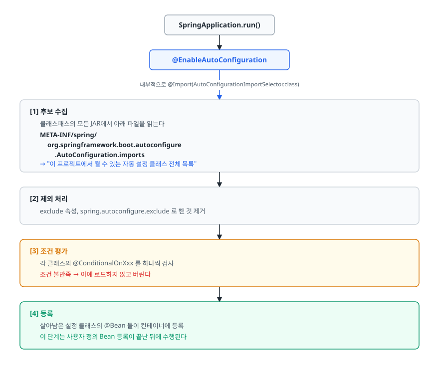
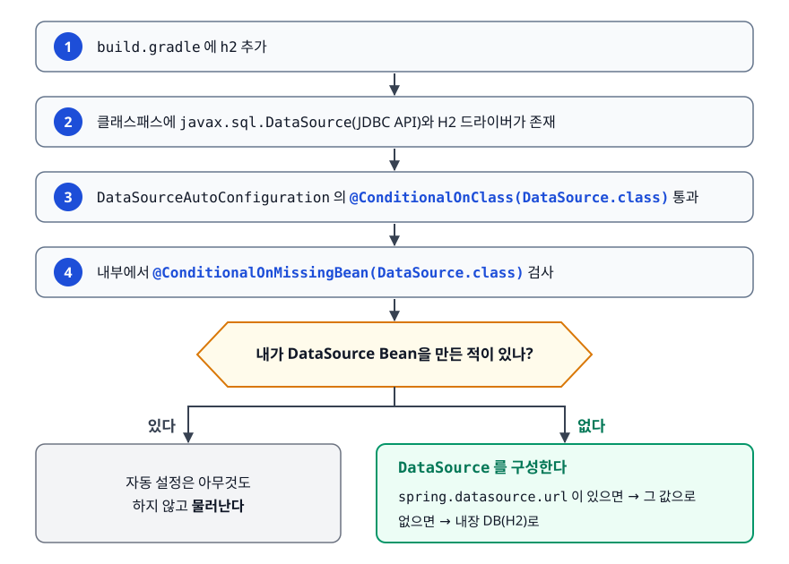
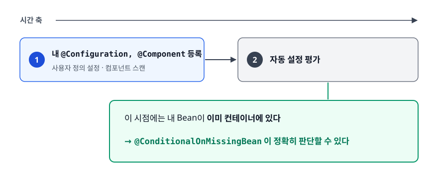
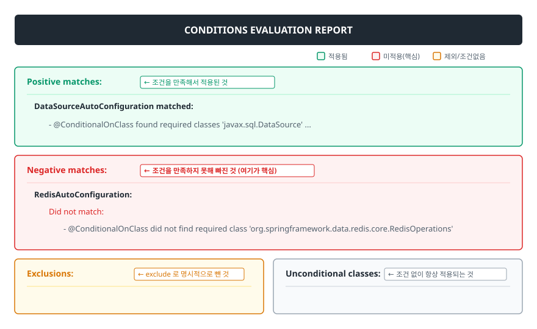

# Spring Boot 자동 설정 (Auto Configuration)

> `@SpringBootApplication` 한 줄이 실제로 무슨 일을 하는지, 내가 등록한 적 없는 Bean이 어떻게 컨테이너에 들어와 있는지, 그리고 그 자동 설정을 어떻게 덮어쓰고 어떻게 추적하는지 설명할 수 있게 됩니다.

## 학습 목표

- [ ] 자동 설정이 없던 시절의 XML 설정이 왜 유지보수 부담이었는지 말할 수 있다
- [ ] `@SpringBootApplication`을 세 개의 어노테이션으로 분해해 각각의 역할을 설명할 수 있다
- [ ] 자동 설정 클래스가 발견되고 조건에 따라 선별 적용되는 과정을 순서대로 설명할 수 있다
- [ ] 자동 설정을 덮어쓰는 세 가지 방법과 `--debug`로 디버깅하는 법을 안다

## 선행 지식

- [01-ioc-di.md](./01-ioc-di.md) - Bean 등록과 `@Configuration`
- [04-bean-lifecycle.md](./04-bean-lifecycle.md) - `@Bean` 메서드와 `@Configuration` 프록시

---

## 1. 왜 필요한가

### 설정 파일이 애플리케이션보다 길던 시절

Spring Boot 이전에 "DB에 연결하고 JPA를 쓰고 웹 요청을 받는" 최소 구성을 만들려면 XML이 이 정도 필요했습니다.

```xml
<!-- web.xml : 서블릿 컨테이너에게 Spring을 알려주는 파일 -->
<listener>
  <listener-class>org.springframework.web.context.ContextLoaderListener</listener-class>
</listener>
<context-param>
  <param-name>contextConfigLocation</param-name>
  <param-value>/WEB-INF/applicationContext.xml</param-value>
</context-param>
<servlet>
  <servlet-name>dispatcher</servlet-name>
  <servlet-class>org.springframework.web.servlet.DispatcherServlet</servlet-class>
</servlet>
<servlet-mapping>
  <servlet-name>dispatcher</servlet-name>
  <url-pattern>/</url-pattern>
</servlet-mapping>
<filter>
  <filter-name>encodingFilter</filter-name>
  <filter-class>org.springframework.web.filter.CharacterEncodingFilter</filter-class>
  <init-param><param-name>encoding</param-name><param-value>UTF-8</param-value></init-param>
</filter>
<!-- ... filter-mapping, 그리고 계속 -->
```

```xml
<!-- applicationContext.xml : DataSource, 트랜잭션, JPA -->
<bean id="dataSource" class="org.apache.commons.dbcp2.BasicDataSource">
  <property name="driverClassName" value="com.mysql.cj.jdbc.Driver"/>
  <property name="url" value="jdbc:mysql://localhost:3306/shop"/>
  <property name="username" value="root"/>
  <property name="password" value="1234"/>
  <property name="maxTotal" value="20"/>
</bean>

<bean id="entityManagerFactory"
      class="org.springframework.orm.jpa.LocalContainerEntityManagerFactoryBean">
  <property name="dataSource" ref="dataSource"/>
  <property name="packagesToScan" value="com.shop.domain"/>
  <property name="jpaVendorAdapter">
    <bean class="org.springframework.orm.jpa.vendor.HibernateJpaVendorAdapter"/>
  </property>
</bean>

<bean id="transactionManager" class="org.springframework.orm.jpa.JpaTransactionManager">
  <property name="entityManagerFactory" ref="entityManagerFactory"/>
</bean>
<tx:annotation-driven transaction-manager="transactionManager"/>
```

여기에 뷰 리졸버, 정적 리소스 핸들러, 메시지 컨버터 설정이 더 붙습니다. 그러고 나서야 첫 번째 컨트롤러를 쓸 수 있었습니다.

문제는 분량이 아니라 세 가지입니다.

1. **프로젝트마다 거의 똑같습니다.** 위 XML의 90%는 어느 회사 어느 프로젝트에서든 동일합니다. 그런데 매번 손으로 복사합니다.
2. **오타가 런타임에야 드러납니다.** `transactionManager`를 `transacionManager`로 적어도 컴파일은 통과합니다. 서버를 띄워봐야 압니다.
3. **버전 조합을 사람이 맞춰야 합니다.** Spring 5.3에 어떤 Hibernate 버전이 맞는지, Jackson은 몇 번대여야 하는지를 개발자가 직접 조사했습니다.

### Spring Boot의 답: 설정보다 관례

Spring Boot는 "어차피 90%가 똑같다면, 그 90%는 기본으로 깔아두고 나머지 10%만 개발자가 적게 하자"는 발상입니다. 이것이 설정보다 관례(Convention over Configuration)다.

```java
@SpringBootApplication
public class ShopApplication {
    public static void main(String[] args) {
        SpringApplication.run(ShopApplication.class, args);
    }
}
```

```yaml
# application.yml - 프로젝트마다 진짜 다른 것만 적는다
spring:
  datasource:
    url: jdbc:mysql://localhost:3306/shop
    username: root
    password: 1234
```

위의 XML 전부가 이 몇 줄로 대체됩니다. **중요한 것은 이게 마법이 아니라는 점입니다.** Spring Boot가 하는 일은 그 XML에 해당하는 `@Configuration` 클래스들을 미리 다 작성해두고, 조건에 맞을 때만 켜지도록 만든 것뿐입니다.

> 비유: 인테리어가 끝난 풀옵션 오피스텔. 냉장고, 세탁기, 에어컨이 이미 들어와 있어서 짐만 들고 오면 됩니다. 마음에 안 드는 가전은 내가 가져온 것으로 바꿔 넣을 수 있습니다.
>
> **비유의 한계**: 오피스텔 가전은 물리적으로 이미 놓여 있지만, 자동 설정은 **조건을 만족할 때만** 등록됩니다. 세탁기를 쓸 배관이 없으면 세탁기는 아예 들어오지 않습니다.

---

## 2. `@SpringBootApplication` 분해

이 어노테이션은 세 개를 합친 것입니다.

```java
@SpringBootConfiguration   // = @Configuration. 이 클래스 자체가 설정 클래스다
@EnableAutoConfiguration   // 자동 설정의 시작점
@ComponentScan             // 이 클래스가 속한 패키지 이하를 스캔한다
public @interface SpringBootApplication { }
```

| 구성 | 하는 일 | 빠지면 생기는 일 |
|------|--------|----------------|
| `@SpringBootConfiguration` | 메인 클래스를 설정 클래스로 만든다 | 여기 정의한 `@Bean`이 등록되지 않는다 |
| `@ComponentScan` | 메인 클래스의 패키지부터 하위를 전부 스캔 | 내가 만든 `@Service`가 Bean으로 안 잡힌다 |
| `@EnableAutoConfiguration` | 클래스패스를 보고 필요한 설정을 자동 등록 | DataSource, DispatcherServlet 등이 전부 사라진다 |

`@ComponentScan`이 **메인 클래스의 패키지를 기준으로 한다**는 점이 중요합니다. 메인 클래스를 `com.shop`에 두면 `com.shop.order`, `com.shop.member`가 모두 스캔되지만, `com.external`에 만든 클래스는 잡히지 않습니다. "분명히 `@Service`를 붙였는데 Bean이 없다"는 문제의 흔한 원인입니다.

---

## 3. 자동 설정은 어떻게 동작하나

### 전체 흐름

<!-- diagram:be-spring-boot-auto-config-1 -->


<!-- 위 그림이 대체한 원본 ASCII.
     내용을 고칠 때는 그림도 함께 갱신할 것.
```
SpringApplication.run()
       │
       ▼
 @EnableAutoConfiguration
       │  내부적으로 @Import(AutoConfigurationImportSelector.class)
       ▼
┌────────────────────────────────────────────────────────────┐
│ [1] 후보 수집                                               │
│   클래스패스의 모든 JAR에서 아래 파일을 읽는다              │
│   META-INF/spring/                                          │
│     org.springframework.boot.autoconfigure                  │
│       .AutoConfiguration.imports                            │
│   → "이 프로젝트에서 켤 수 있는 자동 설정 클래스 전체 목록" │
└──────────────────────────┬─────────────────────────────────┘
                           ▼
┌────────────────────────────────────────────────────────────┐
│ [2] 제외 처리                                               │
│   exclude 속성, spring.autoconfigure.exclude 로 뺀 것 제거   │
└──────────────────────────┬─────────────────────────────────┘
                           ▼
┌────────────────────────────────────────────────────────────┐
│ [3] 조건 평가                                               │
│   각 클래스의 @ConditionalOnXxx 를 하나씩 검사               │
│   조건 불만족 → 아예 로드하지 않고 버린다                    │
└──────────────────────────┬─────────────────────────────────┘
                           ▼
┌────────────────────────────────────────────────────────────┐
│ [4] 등록                                                    │
│   살아남은 설정 클래스의 @Bean 들이 컨테이너에 등록          │
│   이 단계는 사용자 정의 Bean 등록이 끝난 뒤에 수행된다       │
└────────────────────────────────────────────────────────────┘
```
-->

### [1] 후보 목록 파일

자동 설정 클래스 목록은 각 스타터 JAR 안에 텍스트 파일로 들어 있습니다. `spring-boot-autoconfigure` JAR을 열어보면 이런 내용입니다.

```
org.springframework.boot.autoconfigure.jdbc.DataSourceAutoConfiguration
org.springframework.boot.autoconfigure.orm.jpa.HibernateJpaAutoConfiguration
org.springframework.boot.autoconfigure.web.servlet.DispatcherServletAutoConfiguration
org.springframework.boot.autoconfigure.jackson.JacksonAutoConfiguration
...
```

이 파일의 위치는 Spring Boot 버전에 따라 다릅니다.

| 버전 | 파일 경로 |
|------|----------|
| Spring Boot 2.6 이하 | `META-INF/spring.factories` (키: `EnableAutoConfiguration`) |
| Spring Boot 2.7 | 새 방식(`AutoConfiguration.imports`) 도입, 기존 방식도 동작 |
| Spring Boot 3.x | `META-INF/spring/org.springframework.boot.autoconfigure.AutoConfiguration.imports` 만 사용 |

> 결론: 면접에서는 "예전에는 `spring.factories`, 지금은 `AutoConfiguration.imports`"로 답하면 됩니다. 직접 스타터를 만드는 경우가 아니면 이 파일을 건드릴 일은 없습니다.

### [3] 조건 평가 — `@Conditional` 계열

각 자동 설정 클래스는 "언제 켜져야 하는가"를 어노테이션으로 선언합니다.

| 어노테이션 | 조건 |
|-----------|------|
| `@ConditionalOnClass` | 지정한 클래스가 클래스패스에 있을 때 |
| `@ConditionalOnMissingClass` | 없을 때 |
| `@ConditionalOnBean` | 지정한 타입의 Bean이 이미 등록돼 있을 때 |
| `@ConditionalOnMissingBean` | 등록돼 있지 **않을** 때 |
| `@ConditionalOnProperty` | 설정 프로퍼티 값이 조건에 맞을 때 |
| `@ConditionalOnWebApplication` | 웹 애플리케이션일 때 |
| `@ConditionalOnResource` | 지정한 리소스 파일이 있을 때 |
| `@ConditionalOnExpression` | SpEL 표현식이 true일 때 |

> 결론: 자동 설정의 두 축은 **`@ConditionalOnClass`(라이브러리를 넣었는가)** 와 **`@ConditionalOnMissingBean`(개발자가 직접 만들었는가)** 입니다. 나머지는 세부 조정입니다.

### 실제 사례: H2를 의존성에 넣으면 인메모리 DB가 뜨는 이유

<!-- diagram:be-spring-boot-auto-config-2 -->


<!-- 위 그림이 대체한 원본 ASCII.
     내용을 고칠 때는 그림도 함께 갱신할 것.
```
1. build.gradle 에 h2 추가
        ↓
2. 클래스패스에 javax.sql.DataSource(JDBC API)와 H2 드라이버가 존재
        ↓
3. DataSourceAutoConfiguration 의 @ConditionalOnClass(DataSource.class) 통과
        ↓
4. 내부에서 @ConditionalOnMissingBean(DataSource.class) 검사
        ↓
   내가 DataSource Bean을 만든 적이 있나?
        │
        ├─ 있다 → 자동 설정은 아무것도 하지 않고 물러난다
        │
        └─ 없다 → spring.datasource.url 이 있으면 그 값으로,
                  없으면 내장 DB(H2)로 DataSource 를 구성한다
```
-->

`@ConditionalOnClass`가 신기해 보이지만 원리는 단순합니다. 클래스를 실제로 로드해서 확인하는 게 아니라 **바이트코드 메타데이터만 읽어서** 존재를 판단합니다. 그래서 조건에 적힌 클래스가 없어도 `ClassNotFoundException`이 나지 않습니다.

---

## 4. 자동 설정을 덮어쓰는 법

### 왜 덮어쓰기가 항상 이기나

핵심은 **[4]번 단계의 순서**입니다. `AutoConfigurationImportSelector`는 `DeferredImportSelector`라서, **사용자가 정의한 `@Configuration`과 컴포넌트 스캔이 전부 끝난 뒤에** 처리됩니다.

<!-- diagram:be-spring-boot-auto-config-3 -->


<!-- 위 그림이 대체한 원본 ASCII.
     내용을 고칠 때는 그림도 함께 갱신할 것.
```
시간 축 ─────────────────────────────────────────────>

  [내 @Configuration, @Component 등록]  →  [자동 설정 평가]
                                              │
                                              └─ 이 시점에는 내 Bean이
                                                 이미 컨테이너에 있다
                                                 → @ConditionalOnMissingBean 이
                                                   정확히 판단할 수 있다
```
-->

즉 자동 설정은 **"개발자가 안 만든 것만 채워 넣는 보조자"** 로 설계되어 있습니다. 우선권은 언제나 개발자에게 있습니다.

### 방법 1. 프로퍼티로 조정 (가장 흔함)

```yaml
spring:
  datasource:
    hikari:
      maximum-pool-size: 30
  jpa:
    hibernate:
      ddl-auto: validate
server:
  port: 8081
```

대부분의 조정은 이 선에서 끝납니다. 자동 설정 클래스들이 `@ConfigurationProperties`로 값을 받도록 만들어져 있기 때문입니다.

### 방법 2. Bean을 직접 등록해 대체

```java
@Configuration
public class DataSourceConfig {

    @Bean
    public DataSource dataSource() {
        HikariConfig config = new HikariConfig();
        config.setJdbcUrl("jdbc:mysql://localhost:3306/shop");
        config.setMaximumPoolSize(30);
        return new HikariDataSource(config);
    }
}
```

이 Bean이 등록되는 순간 `DataSourceAutoConfiguration`의 `@ConditionalOnMissingBean`이 실패하고, 자동 설정은 손을 뗍니다.

### 방법 3. 자동 설정 자체를 제외

```java
@SpringBootApplication(exclude = DataSourceAutoConfiguration.class)
public class ShopApplication { }
```

```yaml
spring:
  autoconfigure:
    exclude: org.springframework.boot.autoconfigure.jdbc.DataSourceAutoConfiguration
```

DB 없이 배치 애플리케이션만 띄우고 싶은데 `spring-boot-starter-data-jpa`가 딸려 들어와 기동이 실패하는 경우 같은, 예외적인 상황에서 씁니다.

| 방법 | 적용 범위 | 언제 쓰나 |
|------|----------|----------|
| 프로퍼티 | 자동 설정이 열어둔 값만 | 90%의 경우. 첫 번째 선택지 |
| Bean 직접 등록 | 그 Bean 하나 | 자동 설정이 지원하지 않는 조립이 필요할 때 |
| `exclude` | 자동 설정 클래스 전체 | 그 기능 자체가 필요 없을 때 |

> 결론: **프로퍼티 → Bean 등록 → exclude 순으로 시도합니다.** `exclude`는 그 클래스가 등록하던 다른 Bean들까지 같이 사라지므로 부작용을 확인해야 합니다.

### 안티패턴: 왜 안 먹히는지 모른 채 설정을 늘리는 것

```java
// 안티패턴
@Configuration
public class WebConfig implements WebMvcConfigurer {
    // Jackson 설정이 안 먹혀서 여기저기 시도한 흔적
    @Bean
    public ObjectMapper objectMapper() { ... }

    @Override
    public void configureMessageConverters(List<HttpMessageConverter<?>> converters) {
        converters.add(new MappingJackson2HttpMessageConverter(objectMapper()));
    }
}
```

**왜 문제인가**: `configureMessageConverters`는 기본 컨버터 목록을 **통째로 대체**합니다. 여기에 하나만 추가하면 문자열 컨버터, 리소스 컨버터 등 나머지가 전부 사라져 예상치 못한 곳이 깨집니다. 게다가 `ObjectMapper` Bean을 등록한 것만으로 이미 자동 설정이 그 인스턴스를 쓰도록 되어 있어 두 번째 코드는 애초에 불필요합니다.

```java
// 개선 - 자동 설정이 제공하는 커스터마이저 훅을 쓴다
@Configuration
public class JacksonConfig {

    @Bean
    public Jackson2ObjectMapperBuilderCustomizer customizer() {
        return builder -> builder
                .featuresToDisable(SerializationFeature.WRITE_DATES_AS_TIMESTAMPS)
                .serializationInclusion(JsonInclude.Include.NON_NULL);
    }
}
```

Spring Boot는 자동 설정 곳곳에 `Customizer` 인터페이스를 열어둡니다. 전체를 갈아엎는 대신 **필요한 부분만 손대는 훅이 있는지 먼저 찾아보는 것**이 원칙입니다.

---

## 5. 디버깅 — 무엇이 켜졌고 무엇이 꺼졌나

자동 설정의 가장 큰 불만은 "왜 이게 동작하는지/안 하는지 모르겠다"입니다. Spring Boot는 이 질문에 답하는 리포트를 내장하고 있습니다.

```bash
# 실행 시 --debug 를 붙이면 조건 평가 리포트가 출력된다
java -jar shop.jar --debug

# Gradle 로 실행할 때
./gradlew bootRun --args='--debug'
```

출력은 이런 구조입니다.

<!-- diagram:be-spring-boot-auto-config-4 -->


<!-- 위 그림이 대체한 원본 ASCII.
     내용을 고칠 때는 그림도 함께 갱신할 것.
```
============================
CONDITIONS EVALUATION REPORT
============================

Positive matches:            ← 조건을 만족해서 적용된 것
-----------------
   DataSourceAutoConfiguration matched:
      - @ConditionalOnClass found required classes 'javax.sql.DataSource' ...

Negative matches:            ← 조건을 만족하지 못해 빠진 것 (여기가 핵심)
-----------------
   RedisAutoConfiguration:
      Did not match:
         - @ConditionalOnClass did not find required class
           'org.springframework.data.redis.core.RedisOperations'

Exclusions:                  ← exclude 로 명시적으로 뺀 것
Unconditional classes:       ← 조건 없이 항상 적용되는 것
```
-->

`--debug`는 로그 레벨 전체를 DEBUG로 바꾸는 것이 아니라 **이 리포트를 켜는 스위치**입니다. 문제 해결 순서는 이렇습니다.

1. 기대한 Bean이 없다 → **Negative matches**에서 해당 자동 설정 클래스를 찾아 "왜 매칭되지 않았는지" 사유를 읽는다
2. 예상치 못한 Bean이 있다 → **Positive matches**에서 어떤 자동 설정이 등록했는지 역추적한다
3. Actuator를 쓴다면 애플리케이션을 재시작하지 않고 `/actuator/conditions` 엔드포인트에서 같은 정보를 JSON으로 볼 수 있다

---

## 6. 실무에서는

- **Starter는 의존성 묶음일 뿐**입니다. `spring-boot-starter-web`은 그 자체로 코드가 거의 없고, Spring MVC·내장 톰캣·Jackson을 함께 끌어오는 역할을 합니다. 실제 설정은 `spring-boot-autoconfigure`에 들어 있습니다.
- **버전 관리는 부모 BOM이 합니다.** `spring-boot-dependencies`가 수백 개 라이브러리의 검증된 버전 조합을 고정하기 때문에, 개발자가 버전을 적지 않아도 서로 호환되는 조합이 들어옵니다. 이 부분이 자동 설정만큼이나 실무 시간을 아껴줍니다.
- **회사 공통 모듈을 스타터로 만드는 경우**가 있습니다. 사내 인증 클라이언트나 로깅 규격을 자동 설정 클래스로 만들고 `AutoConfiguration.imports`에 등록하면, 다른 팀은 의존성만 추가하고 프로퍼티 몇 줄만 적으면 됩니다.
- **기동이 느려졌다면 자동 설정 개수를 먼저 봅니다.** 쓰지 않는 스타터가 딸려 들어와 불필요한 자동 설정이 켜져 있는 경우가 흔합니다. `--debug` 리포트의 Positive matches 길이가 좋은 단서입니다.

---

## 7. 면접 포인트

> 면접에서 이 주제가 나오면 이렇게 답한다

**Q. Spring Boot의 자동 설정 동작 원리를 설명해주세요.**
A. `@SpringBootApplication` 안의 `@EnableAutoConfiguration`이 시작점입니다. 이 어노테이션이 `AutoConfigurationImportSelector`를 가져오고, 셀렉터가 클래스패스의 모든 JAR에서 자동 설정 클래스 목록 파일을 읽습니다. Spring Boot 3 기준으로는 `META-INF/spring/org.springframework.boot.autoconfigure.AutoConfiguration.imports`이고 예전에는 `spring.factories`였습니다. 그다음 각 클래스에 붙은 `@ConditionalOnClass`, `@ConditionalOnMissingBean` 같은 조건을 평가해서 만족하는 것만 등록합니다. 결국 자동 설정은 조건부로 켜지는 `@Configuration` 클래스 모음일 뿐이고, 마법은 없습니다.

**Q. H2 의존성만 추가했는데 인메모리 DB가 뜨는 원리는요?**
A. H2를 추가하면 클래스패스에 JDBC `DataSource` 관련 클래스와 H2 드라이버가 들어옵니다. `DataSourceAutoConfiguration`에 걸린 `@ConditionalOnClass(DataSource.class)`가 통과하고, 이어서 `@ConditionalOnMissingBean(DataSource.class)`를 검사해 개발자가 직접 만든 `DataSource`가 없으면 그때 내장 DB용 DataSource를 구성합니다. 즉 라이브러리 존재 여부와 개발자 정의 Bean 존재 여부 두 조건의 조합입니다.
- 꼬리 질문: "제가 `DataSource` Bean을 만들면 어떻게 되나요?" → `@ConditionalOnMissingBean`이 실패해 자동 설정이 물러납니다. 개발자 정의가 항상 우선합니다.

**Q. 자동 설정보다 내가 만든 Bean이 우선되는 이유가 뭔가요?**
A. 등록 순서 때문입니다. `AutoConfigurationImportSelector`는 `DeferredImportSelector`로 구현돼 있어서, 사용자 정의 설정 클래스와 컴포넌트 스캔이 모두 끝난 뒤 마지막에 처리됩니다. 그래서 자동 설정이 조건을 평가하는 시점에는 개발자가 만든 Bean이 이미 컨테이너에 있고, `@ConditionalOnMissingBean`이 그것을 정확히 감지할 수 있습니다. 이 순서가 보장되지 않으면 조건부 등록 자체가 성립하지 않습니다.

**Q. 자동 설정이 왜 적용됐는지/안 됐는지 어떻게 확인하나요?**
A. 실행 인자에 `--debug`를 붙이면 CONDITIONS EVALUATION REPORT가 출력됩니다. Positive matches에는 적용된 자동 설정과 그 근거가, Negative matches에는 빠진 자동 설정과 어떤 조건에서 탈락했는지가 나옵니다. 기대한 Bean이 없을 때는 Negative matches에서 사유를 확인하는 게 가장 빠릅니다. Actuator가 붙어 있으면 `/actuator/conditions`로 같은 정보를 조회할 수도 있습니다.

---

## 자주 하는 실수

| 실수 | 왜 틀렸나 | 올바른 이해 |
|------|----------|-----------|
| "자동 설정은 리플렉션으로 알아서 판단하는 마법이다" | 미리 작성된 `@Configuration` 클래스에 조건이 붙어 있을 뿐이다 | 코드가 다 열려 있고 `--debug`로 근거까지 볼 수 있다 |
| "Starter가 설정을 해준다" | Starter는 의존성 묶음이고 설정은 autoconfigure 모듈이 한다 | 둘은 별개의 JAR이다 |
| "자동 설정이 내 Bean을 덮어쓴다" | 자동 설정이 나중에 평가되고 `@ConditionalOnMissingBean`으로 비켜준다 | 개발자 정의가 항상 우선이다 |
| "메인 클래스 위치는 아무데나 상관없다" | `@ComponentScan`의 기준점이 메인 클래스 패키지다 | 최상위 패키지에 두어야 하위가 전부 스캔된다 |
| "`--debug`는 로그를 전부 DEBUG로 바꾼다" | 조건 평가 리포트를 켜는 스위치다 | 로그 레벨은 `logging.level`로 따로 조정한다 |
| "내 설정 클래스에도 `@ConditionalOnMissingBean`을 쓰면 좋다" | 사용자 설정끼리는 평가 순서가 보장되지 않아 결과가 불안정하다 | 이 조건들은 자동 설정용으로 설계된 것이다 |

---

## 한 줄 정리

자동 설정은 **"클래스패스에 무엇이 있는지"** 와 **"개발자가 직접 만든 Bean이 있는지"** 두 가지 조건으로 미리 작성된 설정 클래스를 켜고 끄는 장치이며, 언제나 개발자가 만든 것이 우선하고 그 판단 과정은 `--debug` 리포트로 전부 들여다볼 수 있습니다.

---

## 연관 개념

- [01-ioc-di.md](./01-ioc-di.md) - 자동 설정이 결국 등록하는 것도 Bean이다
- [04-bean-lifecycle.md](./04-bean-lifecycle.md) - `@Configuration`과 `@Bean` 메서드의 동작
- [03-spring-mvc-flow.md](./03-spring-mvc-flow.md) - DispatcherServlet과 내장 톰캣이 자동 등록되는 대상
- [06-transactional-pitfalls.md](./06-transactional-pitfalls.md) - `TransactionManager`도 자동 설정이 등록해준다
- [qna-spring.md](./qna-spring.md) - Spring vs Spring Boot, 자동 설정 면접 질문(Q5)
