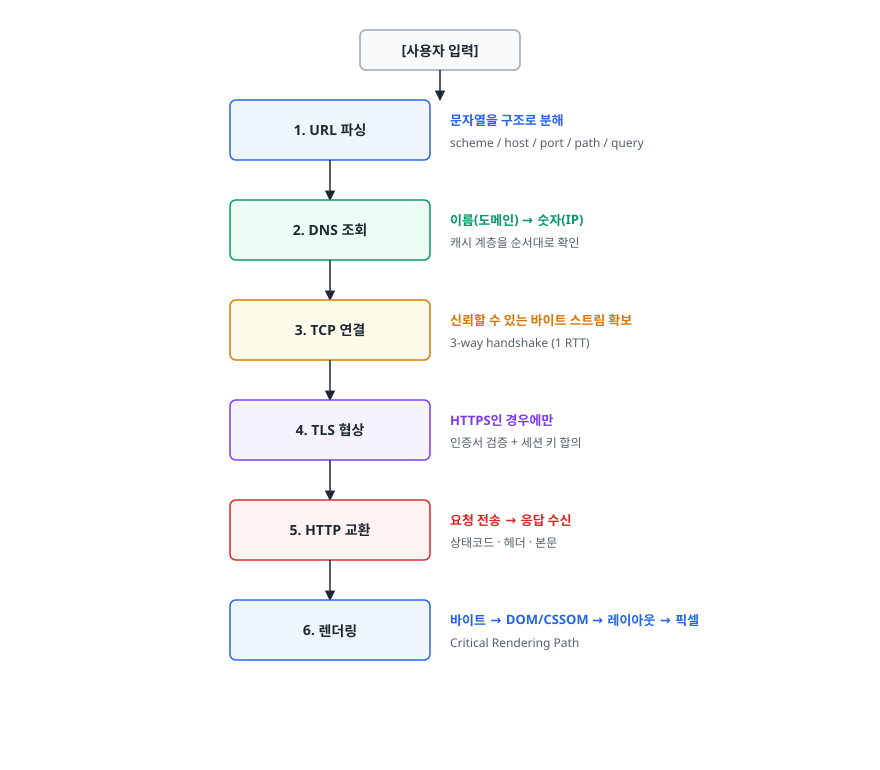
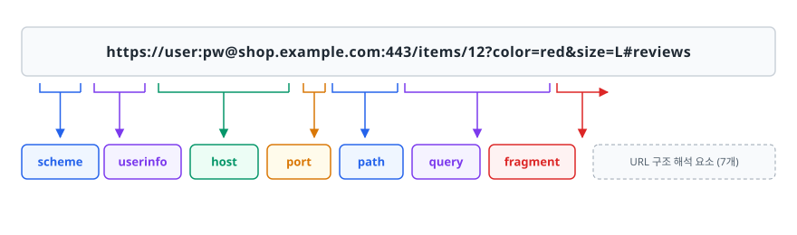
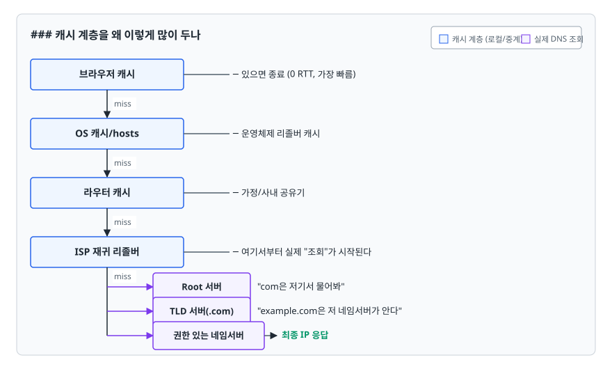
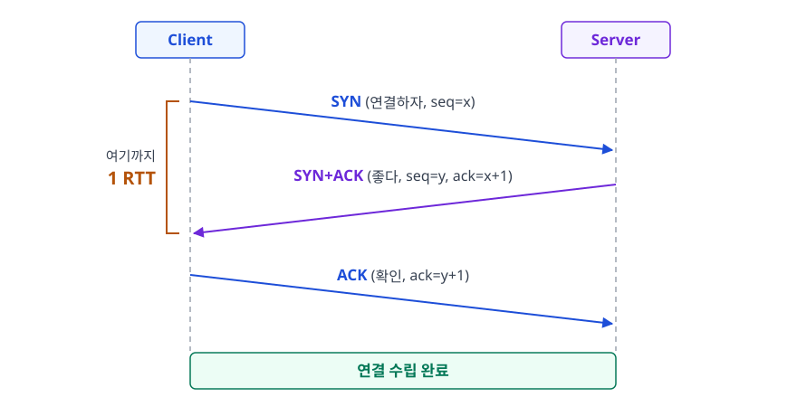
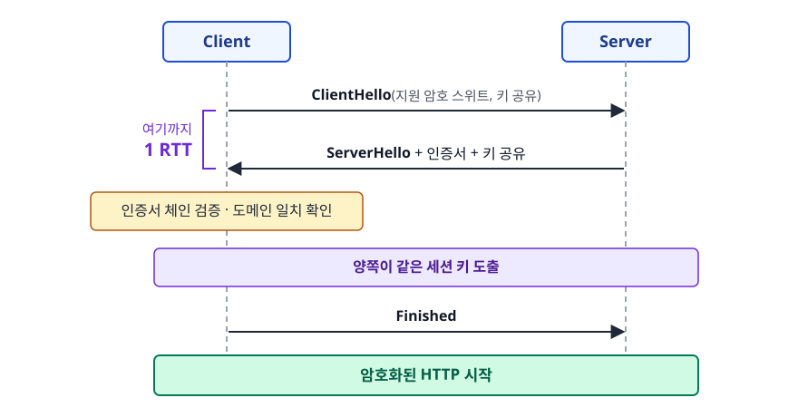
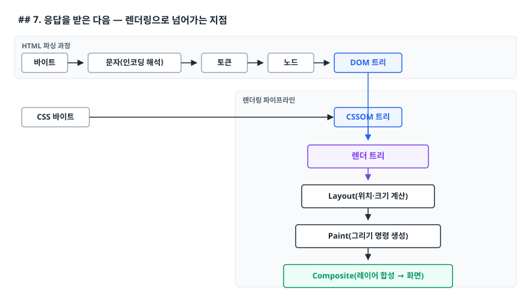
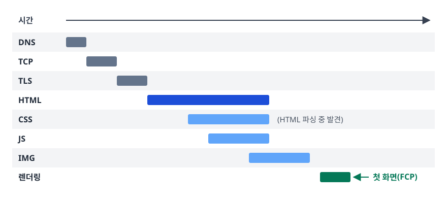

# URL 입력부터 화면 렌더링까지 (From URL to Rendered Pixels)

> 주소창에 주소를 치고 Enter를 누른 순간부터 첫 픽셀이 찍히기까지, 브라우저가 어떤 순서로 무엇을 하는지 단계별로 설명할 수 있게 됩니다.

## 학습 목표

- [ ] URL 파싱 → DNS → TCP → TLS → HTTP → 렌더링의 순서와 각 단계의 목적을 설명할 수 있다
- [ ] DNS가 여러 계층에 캐시되는 이유를 지연(latency) 관점에서 설명할 수 있다
- [ ] HTTPS가 추가로 치르는 비용과 그 대가로 얻는 것을 구분해서 말할 수 있다
- [ ] HTML 응답이 도착한 뒤 화면에 픽셀이 찍히기까지의 흐름을 이어서 설명할 수 있다

## 선행 지식

- 없음 — 이 문서부터 시작해도 됩니다.
- 네트워크 계층을 더 깊게 보고 싶다면 [DNS 동작 원리](../../01-computer-science-fundamentals/network/04-dns-resolution.md),
  [TCP vs UDP](../../01-computer-science-fundamentals/network/03-tcp-udp.md),
  [SSL/TLS 핸드셰이크](../../01-computer-science-fundamentals/network/05-ssl-tls-handshake.md)를 함께 봅니다.

---

## 1. 왜 이 질문이 단골인가

"주소창에 URL을 입력하면 무슨 일이 일어나나요?"는 프론트엔드·백엔드를 가리지 않고 나오는 질문입니다.
답을 외웠는지 보려는 게 아닙니다. 이 질문 하나에 **DNS·TCP·TLS·HTTP·브라우저 렌더링**이 전부 걸려 있어서,
지원자가 어느 계층까지 이해하고 있는지 한 번에 드러나기 때문입니다.

그래서 "DNS 조회하고 TCP 연결하고 HTML 받아서 그립니다"로 끝내면 감점입니다.
각 단계가 **어떤 문제를 풀려고 존재하는지**까지 말할 수 있어야 합니다. 이 문서는 그 흐름을 따라갑니다.

### 전체 지도

<!-- diagram:fe-url-to-render-1 -->


<!-- 위 그림이 대체한 원본 ASCII.
     내용을 고칠 때는 그림도 함께 갱신할 것.
```
[사용자 입력]
     │
     ▼
┌──────────────┐   문자열을 구조로 분해
│ 1. URL 파싱  │   scheme / host / port / path / query
└──────┬───────┘
       ▼
┌──────────────┐   이름(도메인) → 숫자(IP)
│ 2. DNS 조회  │   캐시 계층을 순서대로 확인
└──────┬───────┘
       ▼
┌──────────────┐   신뢰할 수 있는 바이트 스트림 확보
│ 3. TCP 연결  │   3-way handshake (1 RTT)
└──────┬───────┘
       ▼
┌──────────────┐   HTTPS인 경우에만
│ 4. TLS 협상  │   인증서 검증 + 세션 키 합의
└──────┬───────┘
       ▼
┌──────────────┐   요청 전송 → 응답 수신
│ 5. HTTP 교환 │   상태코드 · 헤더 · 본문
└──────┬───────┘
       ▼
┌──────────────┐   바이트 → DOM/CSSOM → 레이아웃 → 픽셀
│ 6. 렌더링    │   Critical Rendering Path
└──────────────┘
```
-->

**비유**: 국제 택배와 비슷합니다. 받는 사람 이름(도메인)만으로는 배송이 안 되니 주소록에서 실제 주소(IP)를 찾고,
배송 경로를 확보하고(TCP), 내용물이 새지 않게 봉인하고(TLS), 물건을 주고받은 뒤(HTTP), 받은 부품으로 조립한다(렌더링).
**비유의 한계**: 택배는 한 번에 하나를 배송하지만, 브라우저는 HTML을 받는 즉시 그 안의 CSS·JS·이미지를 **병렬로** 다시 요청합니다.
1~5단계는 리소스 하나마다 반복되며, 6단계와도 겹쳐서 진행됩니다.

---

## 2. URL 파싱 — 문자열을 구조로 바꾸는 일

### 무엇을 하나

주소창에 들어온 문자열은 아직 아무 의미가 없는 텍스트입니다. 브라우저는 이걸 규격에 맞춰 조각냅니다.

<!-- diagram:fe-url-to-render-2 -->


<!-- 위 그림이 대체한 원본 ASCII.
     내용을 고칠 때는 그림도 함께 갱신할 것.
```
https://user:pw@shop.example.com:443/items/12?color=red&size=L#reviews
└─┬─┘   └──┬──┘ └──────┬───────┘ └┬┘└───┬───┘ └──────┬───────┘ └──┬──┘
scheme userinfo      host       port  path         query      fragment
```
-->

| 조각 | 역할 | 서버로 전송되나 |
|------|------|----------------|
| scheme | 어떤 프로토콜로 말할지 결정 (`https`, `http`, `file`) | - |
| host | DNS 조회 대상 | Host 헤더로 전송 |
| port | 생략 시 scheme 기본값 (http 80, https 443) | 기본 포트가 아니면 `Host: example.com:8080`처럼 함께 전송 |
| path | 서버 내 리소스 위치 | 전송 |
| query | 서버에 넘기는 파라미터 | 전송 |
| fragment | 문서 내 위치 지정 | **전송 안 됨** |

표의 마지막 줄이 실무에서 자주 걸리는 지점입니다. `#reviews` 같은 프래그먼트는 **브라우저 안에서만** 쓰입니다.
그래서 SPA에서 해시 라우팅을 쓰면 서버 로그에 어떤 화면을 봤는지 남지 않고, 액세스 토큰을 프래그먼트로 넘기는
OAuth 암묵적 흐름은 "서버 로그에 토큰이 남지 않는다"는 성질을 이용한 설계였습니다.

### 파싱 전에 일어나는 일들

- **검색어 판별**: `날씨`처럼 URL로 해석되지 않으면 기본 검색 엔진 질의로 넘깁니다.
- **정규화**: 대소문자 정리, 퍼센트 인코딩, 한글 도메인의 퓨니코드(Punycode) 변환.
- **HSTS 확인**: 해당 도메인이 HSTS 목록에 있으면 `http://`로 입력해도 브라우저가 요청을 보내기 **전에**
  `https://`로 바꿉니다. 평문 요청 자체가 나가지 않는 것이 핵심입니다.

---

## 3. DNS 조회 — 이름을 숫자로

### 왜 필요한가

인터넷 통신의 실제 목적지는 `93.184.x.x` 같은 IP 주소입니다. 하지만 사람은 숫자를 못 외우고,
서버가 이사하면 IP가 바뀝니다. 이름과 주소를 분리해 두면 **서버를 옮겨도 사용자는 같은 이름을 계속 쓸 수 있습니다.**
DNS는 이 이름-주소 대응을 관리하는 전 지구적 분산 데이터베이스입니다.

### 캐시 계층을 왜 이렇게 많이 두나

도메인 하나 볼 때마다 루트 서버까지 물어보면 왕복 시간이 쌓이고 루트 서버는 터집니다.
그래서 **가까운 곳부터 순서대로 확인**하고, 어디서든 답이 나오면 즉시 반환합니다.

<!-- diagram:fe-url-to-render-3 -->


<!-- 위 그림이 대체한 원본 ASCII.
     내용을 고칠 때는 그림도 함께 갱신할 것.
```
브라우저 캐시  ─ 있으면 종료 (0 RTT, 가장 빠름)
     │ miss
     ▼
OS 캐시/hosts  ─ 운영체제 리졸버 캐시
     │ miss
     ▼
라우터 캐시    ─ 가정/사내 공유기
     │ miss
     ▼
ISP 재귀 리졸버 ─ 여기서부터 실제 "조회"가 시작된다
     │ miss
     ├──────► Root 서버      "com은 저기서 물어봐"
     ├──────► TLD 서버(.com) "example.com은 저 네임서버가 안다"
     └──────► 권한 있는 네임서버 → 최종 IP 응답
```
-->

각 응답에는 **TTL(Time To Live)**이 붙습니다. TTL 동안은 캐시된 값을 그대로 씁니다.
그래서 서버 IP를 바꾸면 즉시 반영되지 않고, "TTL만큼 기다려야 한다"는 말이 나옵니다.
배포 직전에 TTL을 짧게 줄여 두는 것이 실무의 정석입니다.

**비유**: 전화번호부. 자주 거는 번호는 휴대폰에 저장(브라우저 캐시)하고, 없으면 회사 내선표(라우터), 그래도 없으면 114(재귀 리졸버)에 묻습니다.
**비유의 한계**: 저장된 번호는 지우기 전까지 유효하지만 DNS 캐시는 TTL이 지나면 스스로 만료됩니다. "한 번 찾으면 영원히"가 아닙니다.

---

## 4. TCP 연결 — 대화가 가능한 상태 만들기

IP는 패킷을 목적지로 보내주긴 하지만 **도착 보장도, 순서 보장도 없습니다.**
HTML 파일을 받는데 중간 조각이 빠지거나 순서가 뒤바뀌면 문서가 깨집니다.
TCP는 그 위에서 손실 재전송·순서 재조립·흐름 제어를 담당해 **신뢰할 수 있는 바이트 스트림**을 만듭니다.

<!-- diagram:fe-url-to-render-4 -->


<!-- 위 그림이 대체한 원본 ASCII.
     내용을 고칠 때는 그림도 함께 갱신할 것.
```
Client                                Server
   │                                     │
   │──── SYN (연결하자, seq=x) ─────────►│
   │                                     │
   │◄─── SYN+ACK (좋다, seq=y, ack=x+1)──│   ← 여기까지 1 RTT
   │                                     │
   │──── ACK (확인, ack=y+1) ───────────►│
   │                                     │
   │        [연결 수립 완료]              │
```
-->

3번 왕복이 아니라 **1.5 왕복(약 1 RTT)** 입니다. 세 번째 ACK는 클라이언트가 보내는 방향이라 데이터 전송과 붙어 나갈 수 있습니다.
서울↔미국 서버의 RTT가 150ms라면 이 악수 한 번에만 150ms가 듭니다. CDN이 "사용자와 가까운 곳"에 있어야 하는 첫 번째 이유입니다.

---

## 5. TLS 핸드셰이크 — HTTPS가 추가로 하는 일

HTTP는 평문입니다. 같은 와이파이에 붙은 사람이 패킷을 들여다보면 로그인 정보가 그대로 보이고,
중간 장비가 응답에 광고 스크립트를 끼워 넣어도 브라우저는 알 수 없습니다. TLS는 이 셋을 막습니다.

| 보장 | 무엇을 막나 | 어떻게 |
|------|------------|--------|
| 기밀성(Confidentiality) | 도청 | 세션 키로 대칭키 암호화 |
| 무결성(Integrity) | 변조 | 메시지 인증 태그 검증 |
| 인증(Authentication) | 위장 | CA가 서명한 인증서 체인 검증 |

셋 중 **인증**이 가장 자주 빠지는 답입니다. 암호화만 하고 상대가 누군지 확인하지 않으면
중간자와 안전하게 암호 통신하는 꼴이 됩니다.

<!-- diagram:fe-url-to-render-5 -->


<!-- 위 그림이 대체한 원본 ASCII.
     내용을 고칠 때는 그림도 함께 갱신할 것.
```
Client                                     Server
   │── ClientHello (지원 암호 스위트, 키 공유) ──►│
   │                                             │
   │◄─ ServerHello + 인증서 + 키 공유 ───────────│   ← 여기까지 1 RTT
   │                                             │
   │   [인증서 체인 검증 · 도메인 일치 확인]      │
   │   [양쪽이 같은 세션 키 도출]                 │
   │                                             │
   │── Finished ────────────────────────────────►│
   │        [암호화된 HTTP 시작]                  │
```
-->

세부 메시지 순서는 TLS 버전마다 다릅니다. 골자는 **"암호 스위트와 키 재료를 주고받고, 인증서로 상대를 확인하고,
양쪽이 같은 세션 키를 만든다"**는 것입니다.

핸드셰이크만큼 왕복이 추가되므로 HTTPS는 첫 연결이 HTTP보다 느립니다.
TLS 1.3은 이 왕복 수를 1 RTT로 줄였고, 이전에 접속한 적 있는 서버라면 세션 재개로 더 줄입니다.
"HTTPS는 느리다"는 인식이 지금은 거의 통하지 않는 이유입니다. 게다가 HTTP/2·HTTP/3은 사실상 TLS 위에서만 쓰이므로,
HTTPS를 쓰지 않으면 최신 프로토콜의 성능 이득도 못 받습니다.

---

## 6. HTTP 요청과 응답

연결이 뚫리면 그제서야 실제 요청이 나갑니다.

```http
GET /items/12?color=red HTTP/1.1
Host: shop.example.com
Accept: text/html,application/xhtml+xml
Accept-Encoding: gzip, br
If-None-Match: "a1b2c3"
Cookie: session=...
```

`Host` 헤더 덕분에 IP 하나에 여러 도메인을 올릴 수 있다(가상 호스팅).
`If-None-Match`가 붙었다는 건 브라우저가 이미 캐시본을 갖고 있다는 뜻이고,
서버는 내용이 그대로면 본문 없이 `304 Not Modified`만 돌려줍니다. 이게 가장 저렴한 응답입니다.

응답에서 브라우저가 가장 먼저 보는 건 **`Content-Type`**입니다.
`text/html`이면 파싱해서 렌더링하고, `application/octet-stream`이면 다운로드 창을 띄웁니다.
확장자가 아니라 헤더가 결정한다는 점이 중요합니다.

### 프로토콜 버전에 따른 차이

| 버전 | 전송 계층 | 핵심 개선 | 남은 한계 |
|------|----------|-----------|----------|
| HTTP/1.1 | TCP | 연결 재사용(keep-alive) | 연결당 요청 1개씩 순차 처리 → HOL 블로킹, 그래서 브라우저가 도메인당 연결을 여러 개 연다 |
| HTTP/2 | TCP | 하나의 연결에서 스트림 다중화, 헤더 압축(HPACK) | TCP 레벨 패킷 손실이 모든 스트림을 멈추게 함 |
| HTTP/3 | QUIC(UDP) | 스트림별 독립 손실 복구, 연결 수립과 TLS 협상 통합 | UDP를 막는 네트워크에서 폴백 필요 |

**언제 뭘 쓰나**: 선택의 문제가 아니라 서버/CDN이 지원하면 브라우저가 알아서 최신 버전을 협상합니다.
개발자가 할 일은 HTTP/2 이상에서는 **파일을 잘게 쪼개 스프라이트로 합치던 옛 최적화가 오히려 손해**라는 걸 아는 것입니다.
참고로 HTTP/2 서버 푸시는 기대만큼 효과가 없어 사실상 폐기됐고, 대신 `preload`를 씁니다.

---

## 7. 응답을 받은 다음 — 렌더링으로 넘어가는 지점

HTML 첫 바이트가 도착하면 브라우저는 **전체를 다 받을 때까지 기다리지 않고** 즉시 파싱을 시작합니다.

<!-- diagram:fe-url-to-render-6 -->


<!-- 위 그림이 대체한 원본 ASCII.
     내용을 고칠 때는 그림도 함께 갱신할 것.
```
바이트 → 문자(인코딩 해석) → 토큰 → 노드 → DOM 트리
                                              │
CSS 바이트 ──────────────────────────► CSSOM 트리
                                              │
                                              ▼
                                        렌더 트리
                                              │
                                    Layout(위치·크기 계산)
                                              │
                                      Paint(그리기 명령 생성)
                                              │
                                    Composite(레이어 합성 → 화면)
```
-->

파싱 도중 `<link rel="stylesheet">`, `<script src>`, ``를 만나면 그때마다 새 리소스 요청이 나갑니다.
그 요청 각각이 다시 2~6단계를 거칩니다. 그래서 실제 타임라인은 다음처럼 겹쳐서 흐릅니다.

<!-- diagram:fe-url-to-render-7 -->


<!-- 위 그림이 대체한 원본 ASCII.
     내용을 고칠 때는 그림도 함께 갱신할 것.
```
시간 ──────────────────────────────────────────────►
DNS ██
TCP  ███
TLS     ███
HTML       ████████████
CSS            ████████            (HTML 파싱 중 발견)
JS               ██████
IMG                  ██████
렌더링                      ███ ← 첫 화면(FCP)
```
-->

이 그림에서 얻을 교훈은 두 가지입니다.
첫째, **첫 화면이 늦는 원인은 대개 네트워크 왕복 횟수**입니다. 파일을 아무리 최적화해도 왕복이 많으면 느립니다.
둘째, **HTML 안에서 리소스가 늦게 발견될수록 요청도 늦게 나갑니다.** 그래서 중요한 리소스는 `<head>` 위쪽에 두거나 `preload`로 미리 알립니다.

여기서부터 뒤 이야기는 [Critical Rendering Path 문서](./02-critical-rendering-path.md)에서 이어집니다.

---

## 8. 실무에서는

- **CDN**: 정적 파일을 사용자와 가까운 엣지 서버에 두면 DNS가 가리키는 IP 자체가 가까워집니다. 2~5단계의 RTT가 통째로 줄어듭니다.
- **`preconnect` / `dns-prefetch`**: 곧 쓸 도메인의 DNS·TCP·TLS를 미리 끝내 둡니다.
  ```html
  <link rel="preconnect" href="https://cdn.example.com" crossorigin>
  <link rel="dns-prefetch" href="https://analytics.example.com">
  ```
  `preconnect`는 연결까지, `dns-prefetch`는 이름 조회까지만 미리 합니다. 연결은 자원을 쓰므로 정말 쓸 도메인에만 겁니다.
- **압축**: `Accept-Encoding: gzip, br`에 맞춰 서버가 압축해 보내면 전송 바이트가 크게 줄어듭니다. 텍스트 리소스(HTML/CSS/JS)에서 효과가 큽니다.
- **HSTS**: `Strict-Transport-Security` 헤더로 이후 접속을 강제 HTTPS로 만듭니다. http→https 리다이렉트 왕복 한 번도 아낍니다.
- **DNS TTL 관리**: 도메인 이전이나 장애 조치(failover) 전에는 TTL을 미리 낮춰 둬야 전환이 빠릅니다.

---

## 9. 면접 포인트

> 면접에서 이 주제가 나오면 이렇게 답한다

**Q. 주소창에 URL을 입력하면 어떤 일이 일어나나요?**
A. 크게 네트워크 단계와 렌더링 단계로 나뉩니다. 네트워크 단계에서는 URL을 파싱해 호스트를 뽑고, DNS로 IP를 얻고,
TCP 3-way handshake로 연결한 뒤 HTTPS라면 TLS 핸드셰이크로 인증서를 검증하고 세션 키를 만듭니다.
그다음 HTTP 요청을 보내 HTML을 받습니다. 렌더링 단계에서는 HTML을 파싱해 DOM을, CSS를 파싱해 CSSOM을 만들고,
둘을 합쳐 렌더 트리를 만든 뒤 레이아웃·페인트·합성을 거쳐 화면에 픽셀이 찍힙니다.
- 꼬리 질문: "그 과정에서 가장 오래 걸리는 부분은?" → 대개 네트워크 왕복. 특히 첫 연결의 DNS+TCP+TLS 구간과,
  HTML 안에서 렌더링 차단 리소스를 발견해 추가로 왕복하는 구간이 병목이라고 답합니다.

**Q. DNS 조회가 왜 여러 계층을 거치나요?**
A. 매번 루트 서버까지 질의하면 지연이 크고 상위 서버에 부하가 집중되기 때문입니다.
브라우저 → OS → 라우터 → ISP 리졸버 순으로 가까운 캐시부터 확인해 가장 빠른 지점에서 답을 얻습니다.
각 레코드는 TTL 동안만 캐시되므로 최신성과 속도의 균형을 맞춥니다.
- 꼬리 질문: "서버 IP를 바꿨는데 일부 사용자만 옛 서버로 붙는 이유는?" → 캐시된 레코드가 TTL이 만료되기 전이라서.
  전환 전에 TTL을 미리 낮춰 두는 것이 대응책입니다.

**Q. HTTPS를 쓰면 무엇이 추가로 필요하고 무엇을 얻나요?**
A. TCP 연결 후 TLS 핸드셰이크가 추가돼 왕복이 늘어납니다. 대신 도청을 막는 기밀성, 변조를 막는 무결성,
상대 서버가 진짜인지 확인하는 인증을 얻습니다. TLS 1.3과 세션 재개로 왕복 비용은 많이 줄었고,
HTTP/2·HTTP/3이 사실상 TLS 위에서만 동작하므로 성능 면에서도 HTTPS가 유리합니다.
- 꼬리 질문: "인증서 검증은 정확히 뭘 하나요?" → 인증서 체인이 신뢰하는 루트 CA까지 이어지는지, 서명이 유효한지,
  만료되지 않았는지, 그리고 인증서의 도메인이 접속한 호스트와 일치하는지를 확인합니다.

**Q. HTML을 다 받은 뒤에 파싱을 시작하나요?**
A. 아닙니다. 브라우저는 스트리밍으로 받은 조각부터 즉시 파싱해 DOM을 만들어 나갑니다.
그래서 서버가 HTML을 한 번에 다 만들어 보내는 것보다 조금씩 흘려보내는 편이 첫 화면에 유리할 수 있습니다.
- 꼬리 질문: "그런데도 화면이 안 보이는 이유는?" → CSSOM이 완성되지 않으면 렌더 트리를 만들 수 없어서.
  CSS가 렌더링 차단 리소스라는 이야기로 이어갑니다.

---

## 자주 하는 실수

| 실수 | 왜 틀렸나 | 올바른 이해 |
|------|----------|-----------|
| "3-way handshake라서 왕복이 3번" | 패킷이 3개일 뿐 왕복은 약 1 RTT | SYN → SYN+ACK가 1 RTT, 마지막 ACK는 데이터와 함께 나갈 수 있다 |
| "TLS는 암호화만 한다" | 인증이 빠지면 중간자와 안전하게 통신하는 꼴 | 기밀성 + 무결성 + **인증** 세 가지를 모두 제공한다 |
| "fragment(`#`)도 서버로 간다" | 프래그먼트는 브라우저 내부용 | 서버 로그·라우팅에 안 남습니다. 서버가 알아야 하면 query로 넘긴다 |
| "DNS는 브라우저가 직접 루트까지 조회" | 브라우저는 OS 리졸버에 위임하고, 재귀 조회는 리졸버가 수행 | 브라우저/OS는 캐시 확인만, 실제 재귀 질의는 ISP 등 리졸버가 한다 |
| "HTTP/2를 쓰니 파일을 합칠수록 좋다" | 다중화 덕에 요청 수 페널티가 크게 줄었다 | 오히려 잘게 나눠야 캐시 무효화 범위가 줄어 유리한 경우가 많다 |
| "HTML을 다 받아야 화면이 나온다" | 파싱은 스트리밍으로 진행된다 | 다만 렌더링 차단 리소스 때문에 화면 표시가 지연될 수는 있다 |

---

## 한 줄 정리

URL 입력부터 화면까지는 **이름을 주소로 바꾸고(DNS) → 연결을 만들고(TCP/TLS) → 문서를 받아(HTTP) → 픽셀로 바꾸는(렌더링)** 네 가지 일의 연속이며,
느린 페이지의 원인은 대개 이 중 "왕복 횟수"에 있습니다.

---

## 연관 개념

- [02-critical-rendering-path.md](./02-critical-rendering-path.md) - 응답 이후 픽셀까지의 과정을 자세히
- [03-dom-cssom.md](./03-dom-cssom.md) - DOM/CSSOM 트리가 어떻게 만들어지는가
- [04-reflow-repaint.md](./04-reflow-repaint.md) - 렌더링 이후 화면이 갱신되는 비용
- [05-compositing-gpu.md](./05-compositing-gpu.md) - 마지막 합성 단계와 GPU
- [qna-browser.md](./qna-browser.md) - 이 주제 면접 질문
- [DNS 동작 원리](../../01-computer-science-fundamentals/network/04-dns-resolution.md) - 이름 조회 과정을 네트워크 관점에서
- [SSL/TLS 핸드셰이크](../../01-computer-science-fundamentals/network/05-ssl-tls-handshake.md) - 인증서 검증과 세션 키 도출 상세
- [HTTP/HTTPS](../../01-computer-science-fundamentals/network/02-http-https.md) - 메서드·상태코드·헤더와 버전별 차이
- [네트워크 QnA](../../01-computer-science-fundamentals/network/qna-network.md) - TCP/HTTP/DNS 면접 질문
