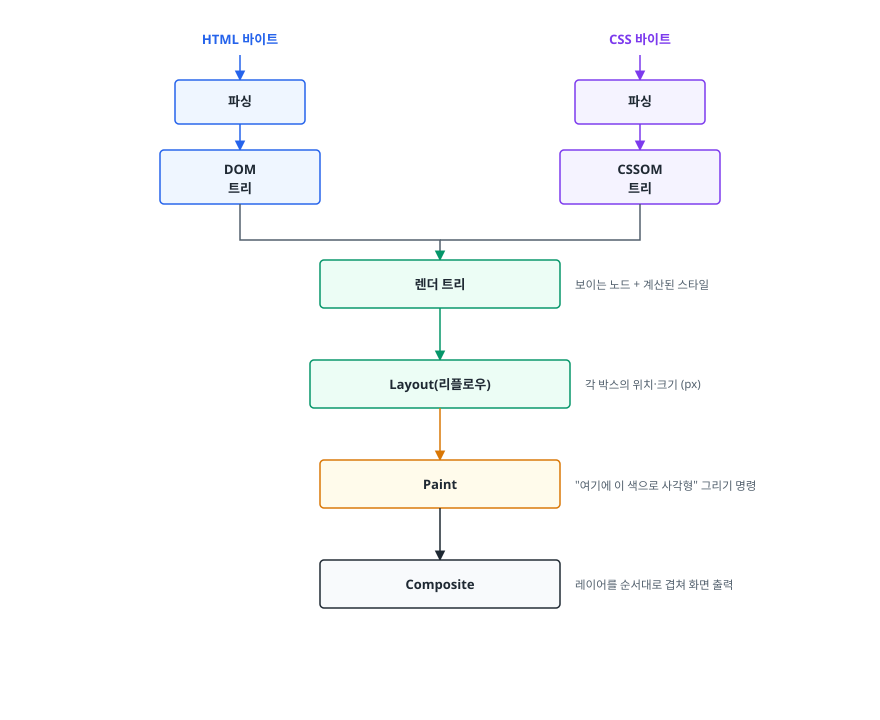
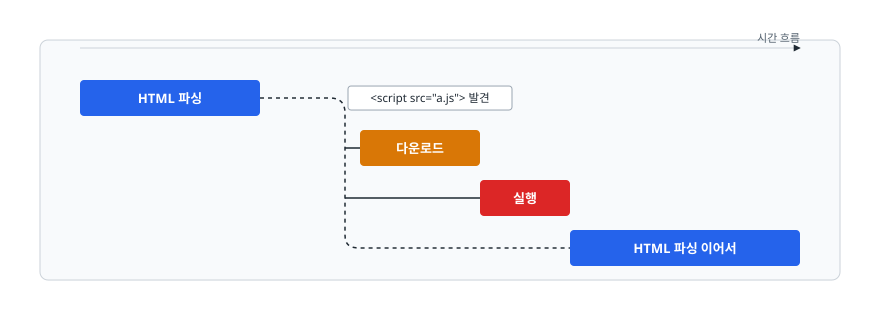
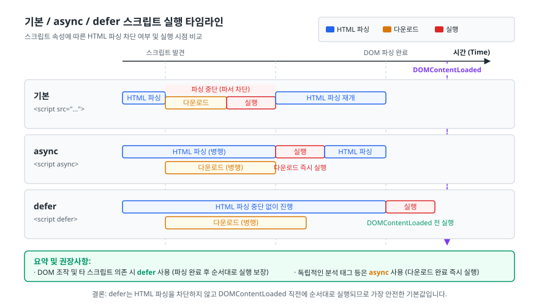
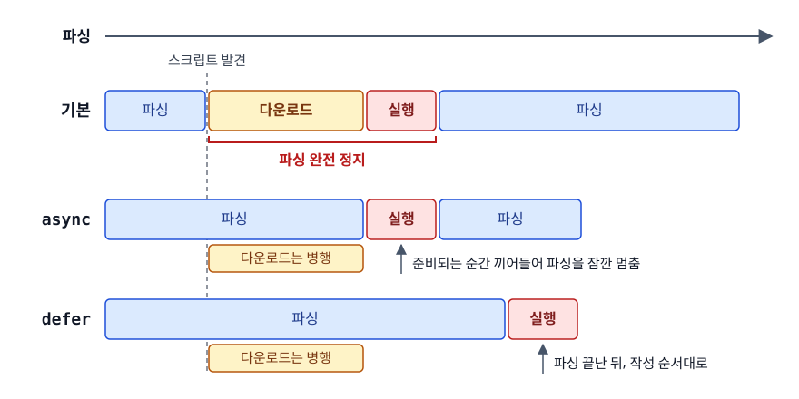

# 크리티컬 렌더링 패스 (Critical Rendering Path)

> HTML이 도착한 순간부터 첫 화면이 그려지기까지, 브라우저는 CSS와 JS를 기다리느라 멈춰 서기도 합니다. 무엇이 병목이 되는지, 어떤 리소스가 왜 렌더링을 막는지를 설명합니다.

## 학습 목표

- [ ] CRP의 단계를 순서대로 말하고 각 단계가 무엇을 산출하는지 설명할 수 있다
- [ ] CSS가 렌더링 차단(render-blocking) 리소스인 이유를 근거와 함께 설명할 수 있다
- [ ] 일반 `<script>`가 파서를 막는 이유와 `async`/`defer`의 동작 차이를 구분할 수 있다
- [ ] 첫 화면을 앞당기는 최적화 기법을 이유와 함께 고를 수 있다

## 선행 지식

- [01-url-to-render.md](./01-url-to-render.md) - HTML이 브라우저에 도착하기까지의 과정

---

## 1. 왜 필요한가

HTML을 받았다고 화면이 나오는 게 아닙니다. 브라우저는 받은 텍스트를 여러 단계에 걸쳐 픽셀로 바꾸는데, 이 경로 위에 **하나라도 준비 안 된 게 있으면 화면이 비어 있습니다.**

사용자가 체감하는 "빠른 사이트"는 전체 리소스가 빨리 오는 사이트가 아니라 **첫 픽셀이 빨리 찍히는 사이트**입니다. 그러니 최적화의 목표는 "다 빨리 받기"가 아니라 "**첫 화면에 꼭 필요한 것만 골라 먼저 처리하기**"가 됩니다. 그 "꼭 필요한 경로"를 가리켜 크리티컬 렌더링 패스(Critical Rendering Path, CRP)라 부릅니다.

> **비유**: 조립 가구를 만든다고 해 봅시다. 부품(HTML)과 조립 설명서(CSS)가 둘 다 있어야 조립을 시작할 수 있습니다. 설명서가 아직 배송 중이면 부품이 다 와 있어도 아무것도 못 만듭니다. 그래서 브라우저는 CSS를 기다립니다.
>
> **비유의 한계**: 실제 브라우저는 설명서를 기다리는 동안 손을 놓고 있지 않습니다. 부품 목록 정리(DOM 구축)와 다른 부품 주문(리소스 다운로드)은 병행합니다. 멈추는 건 "조립 결과를 화면에 보여주는 것"뿐입니다.

---

## 2. CRP 다섯 단계

<!-- diagram:fe-critical-rendering-path-1 -->


<!-- 위 그림이 대체한 원본 ASCII.
     내용을 고칠 때는 그림도 함께 갱신할 것.
```
   HTML 바이트                        CSS 바이트
        │                                  │
   ┌────▼────┐                       ┌─────▼────┐
   │  파싱   │                       │   파싱   │
   └────┬────┘                       └─────┬────┘
        ▼                                  ▼
   ┌─────────┐                       ┌──────────┐
   │  DOM    │                       │  CSSOM   │
   │  트리   │                       │   트리   │
   └────┬────┘                       └─────┬────┘
        │                                  │
        └──────────────┬───────────────────┘
                       ▼
              ┌─────────────────┐
              │   렌더 트리     │  보이는 노드 + 계산된 스타일
              └────────┬────────┘
                       ▼
              ┌─────────────────┐
              │  Layout(리플로우)│  각 박스의 위치·크기 (px)
              └────────┬────────┘
                       ▼
              ┌─────────────────┐
              │      Paint      │  "여기에 이 색으로 사각형" 그리기 명령
              └────────┬────────┘
                       ▼
              ┌─────────────────┐
              │    Composite    │  레이어를 순서대로 겹쳐 화면 출력
              └─────────────────┘
```
-->

| 단계 | 입력 | 출력 | 이 단계가 답하는 질문 |
|------|------|------|---------------------|
| DOM 구축 | HTML 바이트 | 노드 트리 | "문서에 어떤 요소가 어떤 계층으로 있나" |
| CSSOM 구축 | CSS 바이트 | 스타일 규칙 트리 | "각 요소에 어떤 스타일이 적용되나" |
| 렌더 트리 | DOM + CSSOM | 화면에 나올 노드만 모은 트리 | "실제로 그려야 할 게 뭔가" |
| Layout | 렌더 트리 + 뷰포트 크기 | 박스별 좌표와 크기 | "어디에 얼마만 한 크기로 놓이나" |
| Paint / Composite | 레이아웃 결과 | 픽셀 | "무슨 색으로 어떤 순서로 겹쳐 그리나" |

**요점**: 앞 단계가 끝나야 뒷 단계를 시작할 수 있습니다. 그래서 앞쪽(DOM/CSSOM)에서 막히면 뒤가 전부 밀립니다.

---

## 3. CSS가 렌더링을 막는 이유

### 정의

브라우저는 CSSOM이 완성될 때까지 **렌더 트리를 만들지 않습니다.** 그래서 CSS는 렌더링 차단 리소스입니다.

### 왜 그렇게 설계했나

CSS는 나중에 선언된 규칙이 앞을 덮어쓸 수 있습니다. 파일 마지막 줄에 `body { display: none }`이 있을 수도 있습니다. 즉 **CSS를 끝까지 읽기 전에는 어떤 요소가 어떤 모습인지 확정할 수 없습니다.** 그런데도 미리 그려버리면 CSS가 도착한 뒤 화면이 통째로 바뀌는 깜빡임(FOUC, Flash of Unstyled Content)이 생깁니다. 브라우저는 깜빡이느니 잠깐 흰 화면을 보여주는 쪽을 택했습니다.

### 차단 범위를 줄이는 법

```html
<!-- 항상 차단: 모든 화면에 적용되는 CSS -->
<link rel="stylesheet" href="main.css">

<!-- 인쇄용: 화면 렌더링을 막지 않는다 -->
<link rel="stylesheet" href="print.css" media="print">

<!-- 조건이 안 맞으면 차단하지 않는다 -->
<link rel="stylesheet" href="wide.css" media="(min-width: 1024px)">
```

`media` 조건이 현재 맞지 않는 스타일시트도 **다운로드는 됩니다.** 다만 낮은 우선순위로 받고 렌더링을 막지 않습니다. "안 받는다"가 아니라 "안 막는다"가 정확한 표현입니다.

### 안티패턴: `@import`로 CSS 체인 만들기

```css
/* main.css */
@import url("reset.css");
@import url("theme.css");
```

**왜 문제인가**: `main.css`를 **다 받아 파싱해야** 안에 `@import`가 있다는 걸 압니다. 그때부터 `reset.css`를 새로 요청하니 왕복이 직렬로 쌓입니다. HTML의 `<link>`는 파서가 초반에 발견해 병렬로 받을 수 있는데, `@import`는 그 이점을 통째로 버립니다.

```html
<!-- 개선: HTML에서 병렬로 요청되게 한다 -->
<link rel="stylesheet" href="reset.css">
<link rel="stylesheet" href="theme.css">
<link rel="stylesheet" href="main.css">
```

빌드 도구를 쓴다면 번들 단계에서 `@import`를 하나로 합쳐 버리는 것이 더 낫습니다. 런타임에 남기지 않는 게 핵심입니다.

---

## 4. JavaScript가 파서를 막는 이유

### 왜 멈추나

스크립트는 `document.write()`로 문서 자체를 바꿀 수 있고, 지금까지 만들어진 DOM을 읽고 조작할 수도 있습니다. 브라우저는 "이 스크립트가 문서를 어떻게 바꿀지" 미리 알 방법이 없습니다. 그러니 안전한 선택은 하나뿐입니다. **파싱을 멈추고 스크립트를 끝까지 실행한 뒤 이어서 파싱하는 것**입니다.

<!-- diagram:fe-critical-rendering-path-2 -->


<!-- 위 그림이 대체한 원본 ASCII.
     내용을 고칠 때는 그림도 함께 갱신할 것.
```
HTML 파싱 ████████──┐
                     │ <script src="a.js"> 발견
                     ├─ 다운로드 ████
                     ├─ 실행 ███
HTML 파싱 이어서 ────┘ ████████████
```
-->

여기에 한 가지가 더 얹힙니다. **스크립트 실행 전에 CSSOM이 완성되어야 합니다.** 스크립트가 `getComputedStyle()`로 스타일을 물어볼 수 있기 때문입니다. 그래서 "CSS 로딩 → CSSOM → JS 실행 → 파싱 재개" 순으로 지연이 연쇄됩니다. `<head>`에 무거운 CSS와 동기 스크립트가 함께 있으면 첫 화면이 크게 늦어집니다.

### async와 defer

<!-- diagram:crp-async-defer -->


```html
<script src="app.js"></script>              <!-- 기본: 파서 차단 -->
<script async src="analytics.js"></script>  <!-- 받는 즉시 실행 -->
<script defer src="app.js"></script>        <!-- 파싱 끝나고 순서대로 실행 -->
<script type="module" src="main.js"></script> <!-- 기본이 defer와 같은 동작 -->
```

<!-- diagram:fe-critical-rendering-path-3 -->


<!-- 위 그림이 대체한 원본 ASCII.
     내용을 고칠 때는 그림도 함께 갱신할 것.
```
       파싱 ─────────────────────────────────────►

기본    ████──[다운로드]──[실행]──████████████
              ↑ 파싱 완전 정지

async   ████████████──[실행]──██████████████
        └[다운로드는 병행]┘   ↑ 준비되는 순간 끼어들어 파싱을 잠깐 멈춤

defer   ████████████████████████──[실행]──
        └[다운로드는 병행]────────┘  ↑ 파싱 끝난 뒤, 작성 순서대로
```
-->

| 속성 | 다운로드 | 실행 시점 | 실행 순서 보장 | DOM 완성 보장 | 적합한 용도 |
|------|----------|-----------|---------------|--------------|------------|
| (없음) | 파싱 중단 후(*) | 즉시 | O | X (앞부분만 존재) | 문서 상단에서 즉시 필요한 극소수 코드 |
| `async` | 파싱과 병행 | 다운로드 완료 즉시 | **X (먼저 받은 순)** | X | 다른 코드와 무관한 독립 스크립트(분석 태그 등) |
| `defer` | 파싱과 병행 | DOM 파싱 완료 후 | O | O | 앱 코드 대부분 |

**언제 뭘 쓰나**: 다른 스크립트나 DOM에 의존하면 `defer`, 아무것도 의존하지 않고 순서가 상관없으면 `async`. 헷갈리면 `defer`가 안전한 기본값입니다.

(*) 표의 "파싱 중단 후"는 **실행 기준**입니다. 다운로드 자체는 뒤에 설명할 프리로드 스캐너 덕분에 파서가 멈추기 전에 이미 시작됐을 수 있습니다. 막히는 것은 DOM 구축이고 네트워크는 그동안에도 돕니다.

주의할 점 두 가지.
- `async`/`defer`는 **외부 파일(`src`)에만** 유효합니다. 일반 인라인 `<script>`에 붙여도 무시됩니다. (예외로 인라인 `type="module"` 스크립트에는 `async`가 적용됩니다. 인라인 모듈은 원래 defer처럼 미뤄지는데, `async`를 붙이면 준비되는 대로 먼저 실행됩니다.)
- `defer` 스크립트는 `DOMContentLoaded` 이벤트가 발생하기 **전에** 실행됩니다. 그래서 `defer` 스크립트 안에서 DOM을 바로 만져도 안전하고 굳이 `DOMContentLoaded`를 기다릴 필요가 없습니다.

### 안티패턴: `</body>` 직전 스크립트를 만능으로 여기기

```html
<body>
  <div id="app"></div>
  <script src="app.js"></script>  <!-- "맨 아래 두면 안전하다" -->
</body>
```

**왜 문제인가**: 파싱을 막지 않는 건 맞습니다. 하지만 **파서가 문서 끝에 도달해야 이 스크립트를 발견**하므로 다운로드 시작 자체가 늦습니다. HTML이 크면 그만큼 늦어집니다.

```html
<head>
  <script defer src="app.js"></script>  <!-- 일찍 발견 → 일찍 다운로드 → 파싱 후 실행 -->
</head>
```

`defer`는 "일찍 받고 늦게 실행"이라 두 마리를 다 잡습니다. 오늘날 `</body>` 직전 배치는 레거시 관행에 가깝습니다.

---

## 5. 프리로드 스캐너 — 브라우저의 선행 최적화

파서가 스크립트에서 멈춰 있는 동안 네트워크가 놀면 낭비입니다. 그래서 브라우저에는 **프리로드 스캐너**(preload scanner)라는 보조 파서가 있습니다. 메인 파서가 막혀 있어도 남은 HTML 텍스트를 가볍게 훑어 ``, `<link href>`, `<script src>` 같은 URL을 미리 찾아 다운로드를 시작합니다. 이게 성능을 크게 좌우합니다.

```html
<!-- 스캐너가 찾을 수 있다: 즉시 다운로드 시작 -->


<!-- 스캐너가 못 찾는다: JS가 실행돼야 URL이 생긴다 -->
<div id="hero"></div>
<script>
  document.getElementById('hero').innerHTML = '';
</script>
```

CSS `background-image`도 마찬가지입니다. CSSOM이 만들어지고 해당 요소에 스타일이 매칭돼야 URL을 알 수 있으니 ``보다 늦게 요청됩니다. **첫 화면의 큰 이미지(LCP 후보)는 ``로 마크업에 노출하는 것**이 정석인 이유입니다.

---

## 6. 최적화 기법

### 크리티컬 CSS 인라인

첫 화면(above the fold)에 필요한 스타일만 뽑아 `<style>`로 문서에 박아 넣고 나머지는 나중에 불러오면 CSS 왕복 한 번을 통째로 없앨 수 있습니다.

```html
<head>
  <style>
    /* 첫 화면에 보이는 헤더·히어로 영역 스타일만 */
    header { height: 64px; background: #111; }
    .hero  { min-height: 480px; }
  </style>

  <!-- 나머지는 렌더링을 막지 않게 불러온다 -->
  <link rel="preload" href="/full.css" as="style" onload="this.rel='stylesheet'">
  <noscript><link rel="stylesheet" href="/full.css"></noscript>
</head>
```

이 패턴은 손으로 관리하기 어렵습니다. 스타일이 바뀔 때마다 인라인 부분도 같이 바뀌어야 하므로
**빌드 단계에서 자동 추출**하는 도구와 함께 쓰는 것이 전제입니다. 규모가 작지 않다면 도입 전에 유지비를 따져 봐야 합니다.

### 리소스 힌트: preload / prefetch

| 힌트 | 의미 | 우선순위 | 쓰는 상황 |
|------|------|---------|----------|
| `preload` | **이 페이지에서 곧 확실히 쓴다** | 높음 | 늦게 발견되는 폰트, LCP 이미지, 핵심 CSS/JS |
| `prefetch` | **다음 페이지에서 쓸 수도 있다** | 매우 낮음(유휴 시간) | 다음 단계 라우트 번들 |
| `preconnect` | 이 도메인에 곧 연결한다 | - | 외부 CDN·API 도메인 |

```html
<!-- CSS 안에서만 참조되어 발견이 늦는 폰트를 미리 -->
<link rel="preload" href="/fonts/pretendard.woff2" as="font" type="font/woff2" crossorigin>

<!-- 사용자가 다음에 갈 확률이 높은 화면 -->
<link rel="prefetch" href="/checkout.js">
```

폰트 `preload`에 `crossorigin`이 빠지면 브라우저가 **같은 파일을 두 번 받습니다.** 폰트는 익명 CORS 모드로 요청되기 때문에 힌트도 같은 모드여야 캐시가 재사용됩니다. 실무에서 가장 흔한 실수입니다.

### 안티패턴: 전부 preload 하기

```html
<link rel="preload" href="/a.js" as="script">
<link rel="preload" href="/b.js" as="script">
<link rel="preload" href="/c.js" as="script">
<link rel="preload" href="/d.css" as="style">
<!-- ... 20개 -->
```

**왜 문제인가**: `preload`는 "우선순위를 높이는" 도구입니다. 전부 높이면 아무것도 안 높인 것과 같고 오히려 진짜 급한 리소스(첫 화면 CSS)가 대역폭을 나눠 쓰게 돼 느려집니다.
**개선**: 첫 화면에 필요하면서 **HTML만 봐서는 발견이 늦는** 리소스로 한정합니다. 보통 2~4개면 충분합니다.

### 코드 분할

첫 화면에 필요 없는 JS는 나눠서 나중에 받습니다.

```js
// 모달을 열 때 비로소 번들을 받아온다
button.addEventListener('click', async () => {
  const { openEditor } = await import('./editor.js');
  openEditor();
});
```

동적 `import()`는 표준 문법이고 번들러가 이 지점을 기준으로 청크를 쪼갭니다. "기능은 그대로, 초기 번들만 줄이는" 가장 확실한 방법입니다.

---

## 7. 실무에서는

- **Lighthouse / PageSpeed Insights**: "렌더링 차단 리소스 제거" 항목이 바로 이 문서의 내용입니다. 차단 리소스 목록과 예상 절감 시간을 그대로 보여줍니다.
- **DevTools Network 패널의 Waterfall**: 어떤 리소스가 언제 발견되어 언제 요청됐는지 볼 수 있습니다. 막대가 오른쪽으로 계단처럼 밀려 있으면 직렬 의존(예: `@import` 체인, JS가 만든 URL)을 의심합니다.
- **DevTools Performance 패널**: 파싱·스타일 계산·레이아웃·페인트가 시간축에 나옵니다. 첫 화면이 늦을 때 네트워크 문제인지 메인 스레드 문제인지 여기서 갈립니다.
- **번들러(Vite, webpack 등)**: 코드 분할, CSS 추출, `@import` 인라이닝을 빌드 시점에 처리합니다. 런타임 최적화보다 빌드 설정으로 푸는 편이 유지보수에 낫습니다.
- **폰트**: `font-display: swap`을 함께 쓰면 폰트가 늦어도 대체 폰트로 텍스트를 먼저 보여줍니다. 글자가 안 보이는 구간(FOIT)을 없애는 표준적인 처방입니다.

---

## 8. 면접 포인트

> 면접에서 이 주제가 나오면 이렇게 답한다

**Q. CSS가 렌더링 차단 리소스인 이유는?**

A. 렌더 트리는 DOM과 CSSOM을 합쳐 만드는데, CSS는 뒤에 오는 규칙이 앞을 덮어쓸 수 있어 끝까지 파싱하기 전에는 최종 스타일을 확정할 수 없습니다. 확정 전에 그리면 스타일 없는 화면이 잠깐 보였다가 바뀌는 깜빡임이 생기므로, 브라우저는 CSSOM이 완성될 때까지 렌더링을 미룹니다.
- 꼬리 질문: "그럼 모든 CSS가 차단하나요?" → `media` 조건이 현재 맞지 않는 스타일시트는 다운로드는 되지만 렌더링을 막지 않습니다.

**Q. `async`와 `defer`의 차이는?**

A. 둘 다 다운로드는 파싱과 병행합니다. `async`는 다운로드가 끝나는 즉시 실행해 파싱을 잠깐 멈추고 먼저 받은 순서로 실행되므로 순서가 보장되지 않습니다. `defer`는 HTML 파싱이 모두 끝난 뒤 문서에 작성된 순서대로 실행됩니다. 그래서 DOM이나 다른 스크립트에 의존하는 코드는 `defer`, 독립적인 분석 스크립트 같은 건 `async`가 맞습니다.
- 꼬리 질문: "`type=module`은?" → 기본 동작이 `defer`와 같고 `async`를 붙이면 `async`처럼 동작합니다.

**Q. 첫 화면을 앞당기려면 무엇부터 보겠습니까?**

A. 먼저 첫 화면에 정말 필요한 리소스가 무엇인지 구분합니다. 그다음 렌더링 차단 CSS의 크기를 줄이거나 크리티컬 CSS를 인라인합니다. 동기 스크립트는 `defer`로 바꾸고 첫 화면과 무관한 JS는 코드 분할로 미룹니다. 늦게 발견되는 폰트나 LCP 이미지에는 `preload`를 겁니다. 순서는 항상 측정 → 병목 확인 → 적용입니다.
- 꼬리 질문: "LCP 이미지를 CSS 배경으로 넣으면?" → 프리로드 스캐너가 URL을 못 찾아 요청이 늦어집니다. ``로 노출하는 편이 낫습니다.

**Q. `</body>` 바로 위에 스크립트를 두는 것과 `defer`의 차이는?**

A. 둘 다 파싱을 막지 않는 점은 같습니다. 하지만 문서 끝의 스크립트는 파서가 거기 도달해야 발견되므로 다운로드 시작이 늦습니다. `<head>`의 `defer`는 일찍 발견해서 병행 다운로드하고 실행만 뒤로 미루므로 같은 안전성에 더 빠릅니다.

---

## 자주 하는 실수

| 실수 | 왜 틀렸나 | 올바른 이해 |
|------|----------|-----------|
| "JS는 항상 파싱을 막는다" | `async`/`defer`/`module`은 다르다 | 기본 `<script>`만 파서를 차단한다 |
| "`async`가 `defer`보다 빠르니 더 좋다" | 실행 순서가 보장되지 않아 의존 코드가 깨진다 | 앱 코드엔 `defer`, 독립 스크립트엔 `async` |
| "`media` 안 맞는 CSS는 안 받는다" | 다운로드는 한다 | 낮은 우선순위로 받되 렌더링을 막지 않는다 |
| "`preload`는 많이 걸수록 좋다" | 전부 우선이면 우선순위가 사라진다 | 발견이 늦은 소수 핵심 리소스에만 |
| "인라인 스크립트에 `defer`를 붙였다" | `src` 없는 스크립트에는 무시된다 | 외부 파일에만 유효하다 |
| "`defer` 코드는 `DOMContentLoaded`를 기다려야 한다" | `defer`는 그 이벤트 전에 이미 실행된다 | DOM이 완성된 상태이므로 바로 조작해도 된다 |
| "`@import`나 `<link>`나 똑같다" | `@import`는 부모 CSS를 받은 뒤에야 발견된다 | 왕복이 직렬로 늘어나므로 `<link>`나 빌드 병합을 쓴다 |

---

## 한 줄 정리

CRP는 **DOM과 CSSOM이 모여 렌더 트리를 만들고 레이아웃·페인트·합성을 거쳐 픽셀이 되는 경로**이며, 최적화란 이 경로 위에 놓인 차단 리소스를 줄이고 필요한 것만 먼저 보내는 일입니다.

---

## 연관 개념

- [01-url-to-render.md](./01-url-to-render.md) - HTML이 도착하기까지의 네트워크 단계
- [03-dom-cssom.md](./03-dom-cssom.md) - DOM/CSSOM과 렌더 트리의 관계
- [04-reflow-repaint.md](./04-reflow-repaint.md) - 첫 렌더링 이후의 갱신 비용
- [05-compositing-gpu.md](./05-compositing-gpu.md) - CRP의 마지막 단계인 합성
- [qna-browser.md](./qna-browser.md) - 이 주제 면접 질문
- [빌드 도구 QnA](../build-tools/qna-build-tools.md) - 코드 분할과 번들 최적화
