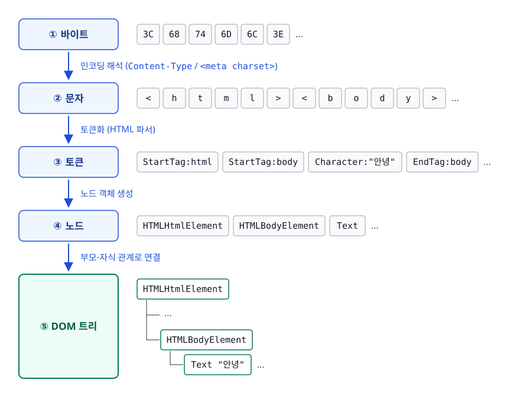
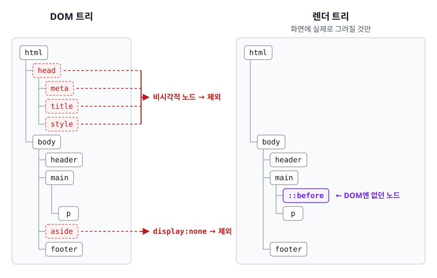
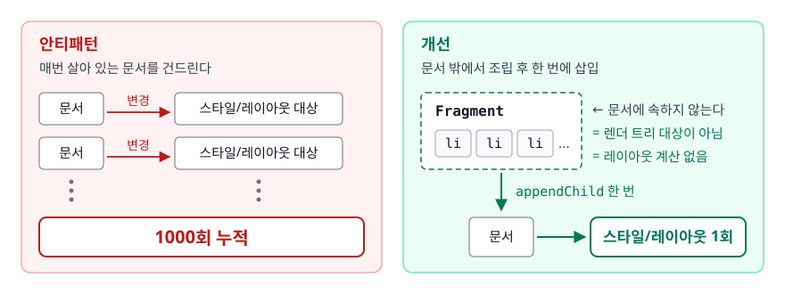

# DOM과 CSSOM (DOM & CSSOM)

> HTML과 CSS는 각각 어떤 트리로 바뀔까요? 그 둘을 합친 렌더 트리는 왜 DOM과 다르고, DOM 조작은 왜 비쌀까요? 이 문서가 그 답을 짚습니다.

## 학습 목표

- [ ] HTML 바이트가 DOM 트리가 되기까지의 단계를 설명할 수 있다
- [ ] 렌더 트리가 DOM과 어떻게 다른지 구체적인 예로 설명할 수 있다
- [ ] `display:none`과 `visibility:hidden`의 차이를 렌더 트리 관점에서 설명할 수 있다
- [ ] CSS 명시도와 상속이 최종 스타일을 어떻게 결정하는지 설명할 수 있다
- [ ] DOM 조작 비용이 어디서 생기는지 알고 `DocumentFragment` 같은 도구로 줄일 수 있다

## 선행 지식

- [02-critical-rendering-path.md](./02-critical-rendering-path.md) - 이 트리들이 렌더링 파이프라인 어디에 놓이는지

---

## 1. 왜 필요한가

HTML은 그냥 텍스트입니다. `<div>안녕</div>`이라는 문자열을 화면에 그리려면
"div라는 요소가 있고, 그 안에 '안녕'이라는 텍스트가 있다"는 **구조화된 표현**이 필요합니다.
게다가 JS가 나중에 `document.querySelector('div').textContent = '반가워'`처럼 문서를 바꿀 수 있어야 하니,
그 표현은 **읽고 쓸 수 있는 객체 모델**이어야 합니다. 그게 DOM(Document Object Model)입니다.

CSS도 같은 이유로 CSSOM(CSS Object Model)이 됩니다. 그리고 브라우저는 이 둘을 합쳐
"실제로 화면에 그릴 것들"만 골라낸 렌더 트리를 만듭니다. 이 문서의 핵심은 세 트리가 각각 무엇을 담는지 구분하는 데 있습니다.

**비유**: DOM은 건물의 **평면도**(어떤 방이 어떤 위치에 있나), CSSOM은 **인테리어 사양서**(각 방을 어떤 색·크기로 마감하나),
렌더 트리는 **실제 시공 대상 목록**입니다. 창고로 안 쓰기로 한 방은 사양서에 "시공 제외"로 표시되고 시공 목록에서 빠집니다.
**비유의 한계**: 평면도의 방과 시공 목록의 항목은 1:1로 대응하지 않습니다. 렌더 트리에는 평면도에 없던 항목이 생기기도 하는데, `::before` 같은 가상 요소가 그렇습니다.

---

## 2. DOM 트리는 어떻게 만들어지나

<!-- diagram:fe-dom-cssom-1 -->


<!-- 위 그림이 대체한 원본 ASCII.
     내용을 고칠 때는 그림도 함께 갱신할 것.
```
 [바이트]      3C 68 74 6D 6C 3E ...
     │  인코딩 해석 (Content-Type / <meta charset>)
     ▼
 [문자]        < h t m l > < b o d y > ...
     │  토큰화 (HTML 파서)
     ▼
 [토큰]        StartTag:html, StartTag:body, Character:"안녕", EndTag:body ...
     │  노드 객체 생성
     ▼
 [노드]        HTMLHtmlElement, HTMLBodyElement, Text ...
     │  부모-자식 관계로 연결
     ▼
 [DOM 트리]
```
-->

### 인코딩이 먼저인 이유

파서는 바이트를 문자로 바꿔야 태그를 알아봅니다. 그래서 `<meta charset="UTF-8">`은
**`<head>` 최상단**에 와야 합니다. 뒤에 두면 브라우저가 인코딩을 추측하다가 뒤늦게 정정합니다.
이때 이미 만든 파싱 결과를 버리고 다시 시작할 수 있습니다. 한글이 깨지는 고전적 원인입니다.

### 파싱은 스트리밍이다

브라우저는 HTML이 다 도착하길 기다리지 않습니다. 오는 대로 토큰화하고 노드를 붙여 나갑니다.
그래서 서버가 HTML을 조금씩 흘려보내면, 사용자는 더 빨리 무언가를 볼 수 있습니다.

### 관대한 파서

HTML 파서는 잘못된 마크업을 만나도 멈추지 않고 **알아서 고칩니다.**

```html
<p>첫 문단
<p>둘째 문단
```

닫는 태그가 없어도 파서는 `<p>`가 다른 `<p>`를 포함할 수 없다는 규칙에 따라 앞 문단을 자동으로 닫습니다.
편리하지만 함정도 있습니다. 셀(`<td>`) 안이 아니라 `<table>` 바로 아래에 `<div>`를 넣으면
파서가 그 `<div>`를 테이블 **바깥으로 옮겨** 버립니다(foster parenting).
"분명 이렇게 썼는데 DevTools에서 보면 구조가 다르다"면 파서의 교정 규칙을 의심해야 합니다.
**DevTools의 Elements 패널은 소스가 아니라 DOM을 보여준다**는 점을 기억해야 합니다.

---

## 3. CSSOM과 최종 스타일 결정

DOM이 만들어지는 동안 CSS도 파싱되어 규칙 집합이 됩니다. 그다음 브라우저는 DOM 노드마다
"이 노드에 적용될 최종 값은 무엇인가"를 계산합니다. 이 계산에 관여하는 것은 세 가지입니다.

### 3-1. 캐스케이드와 명시도(Specificity)

한 요소에 여러 규칙이 붙으면 우선순위를 따집니다.

```
!important  >  인라인 style  >  명시도 점수  >  나중에 선언된 것
```

명시도 점수는 (ID, 클래스·속성·의사클래스, 타입·의사요소) 세 자리로 셉니다.

| 선택자 | ID | 클래스 등 | 타입 등 | 읽는 법 |
|--------|:--:|:--------:|:------:|--------|
| `*` | 0 | 0 | 0 | 아무 힘 없음 |
| `p` | 0 | 0 | 1 | 타입 1개 |
| `.card` | 0 | 1 | 0 | 클래스 1개 |
| `a:hover` | 0 | 1 | 1 | 타입 1 + 의사클래스 1 |
| `.card p.title` | 0 | 2 | 1 | 클래스 2 + 타입 1 |
| `#main .card` | 1 | 1 | 0 | ID가 있으면 클래스 몇 개로도 못 이긴다 |

앞자리가 크면 뒷자리는 아무리 커도 집니다. `#a`(1,0,0)는 클래스를 10개 붙인 선택자(0,10,0)를 이깁니다.
자릿수 올림이 없는, 사전식 비교입니다.

**같은 점수면 나중에 선언된 규칙이 이깁니다.** 그래서 CSS 파일을 불러오는 순서가 결과를 바꿉니다.

### 3-2. 상속(Inheritance)

모든 속성이 자식에게 내려가는 게 아닙니다.

| 상속되는 속성 | 상속되지 않는 속성 |
|--------------|------------------|
| `color`, `font-family`, `font-size`, `line-height` | `margin`, `padding`, `border` |
| `text-align`, `letter-spacing`, `word-break` | `width`, `height`, `background` |
| `visibility`, `cursor` | `display`, `position`, `overflow` |

기준은 단순합니다. **텍스트 표현에 관한 것은 대체로 상속되고 박스 자체의 기하나 배경은 상속되지 않습니다.**
자식이 부모 margin을 물려받으면 레이아웃이 걷잡을 수 없어지기 때문입니다.

값이 필요하면 명시적으로 물려받게 할 수 있습니다.

```css
button {
  font: inherit;        /* 폼 요소는 기본 폰트가 따로라 자주 쓴다 */
  color: inherit;
}
.reset { all: unset; }  /* 상속되는 건 상속값으로, 나머지는 초기값으로 */
```

### 3-3. 선택자는 오른쪽에서 왼쪽으로 매칭된다

```css
#sidebar ul li a { color: red; }
```

사람은 "사이드바 안의 ul 안의 li 안의 a"로 읽지만, 브라우저는 **`a`를 먼저 찾고** 조상을 거슬러 올라가며 확인합니다.
왼쪽부터 내려가면 매칭에 실패할 후보를 잔뜩 탐색하게 됩니다. 오른쪽에서 시작하면 대부분의 요소를 첫 검사에서 탈락시킬 수 있습니다.

여기서 나온 실무 지침이 **"가장 오른쪽 선택자(key selector)를 구체적으로 쓰라"**입니다.
`div * { }` 같은 규칙은 모든 요소를 후보로 만들어 최악입니다.
다만 현대 브라우저의 스타일 매칭은 충분히 빨라서, 선택자 성능이 병목이 되는 경우는 드뭅니다.
선택자를 단순하게 쓰는 진짜 이유는 성능보다 **명시도 관리와 가독성**에 가깝습니다.

---

## 4. 렌더 트리 — DOM과 왜 다른가

렌더 트리(Blink에서는 레이아웃 트리)는 **화면에 실제로 그려질 것들만** 담습니다.

<!-- diagram:fe-dom-cssom-2 -->


<!-- 위 그림이 대체한 원본 ASCII.
     내용을 고칠 때는 그림도 함께 갱신할 것.
```
        DOM 트리                          렌더 트리
   ┌──────────────────┐            ┌──────────────────┐
   │ html             │            │ html             │
   │ ├─ head          │  제외 →    │ └─ body          │
   │ │  ├─ meta       │  제외      │    ├─ header     │
   │ │  ├─ title      │  제외      │    ├─ main       │
   │ │  └─ style      │  제외      │    │  ├─ ::before│ ← DOM엔 없던 노드
   │ └─ body          │            │    │  └─ p       │
   │    ├─ header     │            │    └─ footer     │
   │    ├─ main       │            └──────────────────┘
   │    │  └─ p       │
   │    ├─ aside      │  display:none → 제외
   │    └─ footer     │
   └──────────────────┘
```
-->

다른 점은 이렇습니다.

- `<head>`, `<meta>`, `<script>`, `<title>` 같은 **비시각적 노드는 렌더 트리에 없습니다.**
- `display: none`인 노드와 **그 자손 전체**가 빠집니다.
- `::before` / `::after` 같은 **가상 요소는 DOM에 없지만 렌더 트리에는 있습니다.** 그래서 `querySelector`로 잡히지 않고
  이벤트 리스너도 붙일 수 없습니다. 스타일 값만 `getComputedStyle(el, '::before')`로 읽을 수 있습니다.
- 인라인 요소와 블록 요소가 섞이면 브라우저가 **익명 박스(anonymous box)**를 끼워 넣기도 합니다. DOM에는 대응하는 노드가 없습니다.

### display:none vs visibility:hidden vs opacity:0

| 속성 | 렌더 트리 | 공간 차지 | 페인트 | 클릭 이벤트 | 스크린 리더 | 전환(transition) |
|------|----------|----------|--------|------------|-----------|-----------------|
| `display: none` | **제외** | X | X | X | 무시 | 불가 |
| `visibility: hidden` | 포함 | O | X | X | 무시 | 가능(불연속) |
| `opacity: 0` | 포함 | O | **O(투명하게)** | **O(클릭됨)** | **읽힘** | 가능(부드러움) |

**언제 뭘 쓰나**: 완전히 없애려면 `display:none`, 자리를 유지한 채 숨기려면 `visibility:hidden`,
페이드 애니메이션에는 `opacity`를 쓰되 끝나고 `visibility:hidden`을 함께 걸어 클릭·스크린 리더 노출을 막습니다.

`opacity: 0`만 쓴 요소가 여전히 클릭된다는 점은 실제 버그로 자주 나옵니다.
"안 보이는데 버튼이 눌린다"는 제보의 단골 원인입니다.

### 흔한 오해

"`display:none`인 요소는 DOM에도 없다"는 말은 틀립니다. **DOM에는 그대로 있습니다.**
그래서 `document.querySelector()`로 찾을 수 있고 `textContent`도 읽힙니다.
다만 렌더 트리에 없으니 `offsetWidth`나 `getBoundingClientRect()`는 전부 0을 돌려줍니다.
숨겨진 요소의 크기를 재려다 0이 나오는 문제가 여기서 비롯됩니다.

---

## 5. DOM 조작 비용

### 비용은 어디서 생기나

`element.textContent = 'x'` 한 줄이 비싼 게 아닙니다. 비용은 그 변경이 **파이프라인의 어느 단계부터 다시 돌게 만드느냐**에서 옵니다.

```
DOM 변경 ─► 스타일 재계산 ─► 레이아웃 ─► 페인트 ─► 합성
              (어떤 규칙이     (위치·크기   (그리기)   (겹치기)
               적용되나)        재계산)
```

브라우저는 똑똑해서 한 프레임 안의 변경을 모아 마지막에 한 번만 처리합니다.
그 배칭을 개발자가 깨뜨릴 때 문제가 생깁니다(자세한 내용은 [04-reflow-repaint.md](./04-reflow-repaint.md)).

### 안티패턴 1: 루프 안에서 innerHTML 누적

```js
// 안티패턴
for (let i = 0; i < 1000; i++) {
  list.innerHTML += `<li>${i}</li>`;
}
```

**왜 문제인가**: `innerHTML +=`는 세 가지 일을 합니다. ① 현재 자식 전체를 문자열로 직렬화하고,
② 문자열을 이어 붙인 뒤, ③ **기존 노드를 전부 버리고 처음부터 다시 파싱해 만듭니다.**
1000번 반복하면 이 파괴-재생성이 1000번 일어납니다.
게다가 기존 노드에 걸어 둔 이벤트 리스너와 입력값 같은 상태가 **매번 날아갑니다.**

```js
// 개선 1: 문자열을 다 만든 뒤 한 번만 주입
const html = Array.from({ length: 1000 }, (_, i) => `<li>${i}</li>`).join('');
list.innerHTML = html;
```

문자열 조립은 빠르지만, 값이 사용자 입력에서 온다면 HTML로 해석되어 XSS 위험이 있습니다.
그래서 신뢰할 수 없는 데이터라면 노드를 직접 만드는 쪽이 안전합니다.

```js
// 개선 2: DocumentFragment에 모아서 한 번에 붙이기
const frag = document.createDocumentFragment();
for (let i = 0; i < 1000; i++) {
  const li = document.createElement('li');
  li.textContent = String(i);   // 텍스트로 넣으므로 HTML로 해석되지 않는다
  frag.appendChild(li);
}
list.appendChild(frag);         // 실제 문서 변경은 이 한 번
```

### DocumentFragment가 왜 싼가

<!-- diagram:fe-dom-cssom-3 -->


<!-- 위 그림이 대체한 원본 ASCII.
     내용을 고칠 때는 그림도 함께 갱신할 것.
```
[안티패턴] 매번 살아 있는 문서를 건드린다
   문서 ──변경──► 스타일/레이아웃 대상    (1000회 누적)
   문서 ──변경──► 스타일/레이아웃 대상
   ...

[개선] 문서 밖에서 조립 후 한 번에 삽입
   ┌──────────────┐
   │ Fragment     │  ← 문서에 속하지 않는다
   │  li li li …  │     = 렌더 트리 대상이 아님 = 레이아웃 계산 없음
   └──────┬───────┘
          │ appendChild 한 번
          ▼
        문서 ──► 스타일/레이아웃 1회
```
-->

`DocumentFragment`는 문서 트리에 속하지 않는 임시 컨테이너입니다. 여기에 노드를 아무리 넣어도
렌더링 파이프라인이 돌지 않습니다. 그리고 fragment를 `appendChild`하면 **fragment 자체가 아니라 그 자식들이 옮겨집니다.**
삽입 후 fragment는 빈 상태가 되고 문서에는 `<li>`들만 들어갑니다. 껍데기가 남지 않는 것이 `<div>`로 감싸는 방식과 다른 점입니다.

### 안티패턴 2: 반복문 안에서 live collection의 length 읽기

```js
// 안티패턴
const items = document.getElementsByClassName('item');  // 살아 있는 컬렉션
for (let i = 0; i < items.length; i++) {
  items[i].classList.remove('item');   // 지우는 순간 컬렉션이 줄어든다
}
```

**왜 문제인가**: `getElementsByClassName`·`getElementsByTagName`이 반환하는 `HTMLCollection`은
**live collection**이라 문서가 바뀌면 내용도 실시간으로 바뀝니다. 위 코드는 요소를 제거하는 동시에
길이가 줄어들어 절반만 처리됩니다. 게다가 `length`를 읽을 때마다 문서를 다시 훑는 비용도 듭니다.

```js
// 개선: 정적 스냅샷을 쓴다
const items = document.querySelectorAll('.item');  // 정적 NodeList
items.forEach(el => el.classList.remove('item'));
```

| API | 반환 타입 | 문서 변경 반영 | forEach |
|-----|----------|--------------|---------|
| `getElementsByClassName` / `getElementsByTagName` | `HTMLCollection` | **실시간(live)** | 없음(배열 변환 필요) |
| `querySelectorAll` | `NodeList` | **정적(snapshot)** | 있음 |

**언제 뭘 쓰나**: 특별한 이유가 없으면 `querySelectorAll`을 씁니다. live collection은 "지금 이 순간 조건을 만족하는 요소"를
계속 추적해야 하는 드문 경우에만 의미가 있습니다.

---

## 6. 실무에서는

- **프레임워크의 역할**: React·Vue는 상태가 바뀔 때마다 DOM을 직접 만지지 않고 메모리에서 이전/다음 구조를 비교해
  **바뀐 부분만 모아 한 번에** 적용합니다. 이 문서에서 말한 "모았다가 한 번에"를 프레임워크가 대신 해 주는 셈입니다.
  다만 diffing 자체에도 비용이 있어 항상 직접 조작보다 빠른 것은 아닙니다. 진짜 가치는 속도보다 선언적 모델에 있습니다.
- **`<template>` 요소**: 내용이 파싱은 되지만 렌더링되지 않는 표준 요소입니다. `content`가 `DocumentFragment`이므로
  반복 렌더링의 원본으로 쓰기 좋습니다.
- **`:where()`로 명시도 낮추기**: 라이브러리 기본 스타일처럼 "사용자가 쉽게 덮어쓰길 바라는" 규칙에 유용합니다.
  `:where(...)`는 명시도가 0으로 계산되므로 사용자의 단순한 클래스 선택자로도 덮을 수 있습니다.
- **CSS Modules / CSS-in-JS**: 클래스명을 고유하게 만들어 명시도 경쟁 자체를 없앱니다.
  `!important` 남발이 시작되는 지점을 구조적으로 차단하는 접근입니다.
- **DevTools Computed 탭**: 어떤 규칙이 이겼고 무엇이 취소선으로 밀렸는지 그대로 보여줍니다. 명시도 문제는 추측하지 말고 여기서 확인합니다.

---

## 7. 면접 포인트

> 면접에서 이 주제가 나오면 이렇게 답한다

**Q. 렌더 트리는 DOM 트리와 어떻게 다른가요?**
A. 렌더 트리는 실제로 화면에 그려질 노드만 담습니다. `<head>`나 `<script>` 같은 비시각적 노드,
`display:none`인 요소와 그 자손이 빠집니다. 반대로 `::before` 같은 가상 요소는 DOM에는 없지만 렌더 트리에는 존재합니다.
그래서 DOM 노드와 렌더 트리 노드는 1:1 대응이 아닙니다.
- 꼬리 질문: "`visibility:hidden`은 어떻게 되나요?" → 렌더 트리에 남아 공간을 차지하되 그려지지만 않습니다.
  그래서 숨기고 나타낼 때 레이아웃이 다시 계산되지 않는 이점이 있습니다.

**Q. `display:none`인 요소의 크기를 JS로 재면 어떻게 되나요?**
A. 전부 0이 나옵니다. 렌더 트리에 없으니 레이아웃 계산 대상이 아니기 때문입니다.
크기를 재야 한다면 `visibility:hidden`으로 숨기거나, 화면 밖으로 위치를 옮기는 방식으로 렌더 트리에는 남겨 둬야 합니다.

**Q. CSS 명시도는 어떻게 계산되나요?**
A. ID 개수, 클래스·속성·의사클래스 개수, 타입·의사요소 개수를 세 자리로 비교합니다.
앞자리가 크면 뒷자리와 무관하게 이깁니다. 같으면 나중에 선언된 규칙이 적용됩니다.
인라인 스타일은 그보다 위, `!important`는 그 위입니다. `!important`를 남용하면 이 체계가 무너져서,
덮어쓰려면 또 `!important`가 필요해집니다. 그러면 유지보수가 급격히 나빠집니다.
- 꼬리 질문: "명시도 경쟁을 구조적으로 없애려면?" → 클래스 기반 단일 계층 설계, CSS Modules 같은 스코프 격리, `:where()` 활용.

**Q. DOM 조작이 비싸다고 하는데 정확히 무엇이 비싼가요?**
A. 노드를 만드는 것 자체보다, 변경이 스타일 재계산과 레이아웃을 다시 돌게 만드는 것이 비쌉니다.
브라우저는 한 프레임의 변경을 모아 처리하므로, 변경을 나눠 자주 하는 대신 모아서 한 번에 반영하면 됩니다.
`DocumentFragment`처럼 문서 밖에서 조립한 뒤 한 번만 삽입하는 패턴이 대표적입니다.
- 꼬리 질문: "`innerHTML +=`가 왜 특히 나쁜가요?" → 기존 자식을 전부 직렬화하고 다시 파싱해 재생성하므로
  이벤트 리스너와 입력 상태가 매번 사라지고 작업량도 누적됩니다.

---

## 자주 하는 실수

| 실수 | 왜 틀렸나 | 올바른 이해 |
|------|----------|-----------|
| "렌더 트리 = DOM 트리에 스타일 붙인 것" | 노드 구성 자체가 다르다 | 비시각 노드·`display:none` 제외, 가상 요소·익명 박스 추가 |
| "`display:none`이면 DOM에서도 사라진다" | DOM에는 그대로 있다 | 선택도 되고 값도 읽히지만 크기는 0으로 나온다 |
| "`opacity:0`이면 안 보이니 클릭도 안 된다" | 렌더 트리에 있고 히트 테스트 대상이다 | 클릭·포커스가 그대로 되고 스크린 리더도 읽는다 |
| "클래스를 여러 개 붙이면 ID를 이길 수 있다" | 명시도는 자릿수 올림이 없다 | ID 1개가 클래스 100개보다 강하다 |
| "모든 CSS 속성은 상속된다" | 박스 기하·배경은 상속되지 않는다 | 텍스트 관련 속성 위주로만 상속된다 |
| "선택자를 짧게 쓰면 성능이 크게 좋아진다" | 현대 엔진에서 병목이 되는 일은 드물다 | 짧게 쓰는 진짜 이유는 명시도 관리와 가독성 |
| "`getElementsByClassName`과 `querySelectorAll`은 같다" | 전자는 live, 후자는 정적 | 순회 중 문서를 바꾸면 결과가 달라진다 |

---

## 한 줄 정리

DOM은 문서의 구조, CSSOM은 스타일 규칙, 렌더 트리는 **그중 실제로 그릴 것만 추린 결과**이며,
DOM 조작의 비용은 노드 생성이 아니라 그 변경이 되돌리는 파이프라인의 길이에서 나옵니다.

---

## 연관 개념

- [02-critical-rendering-path.md](./02-critical-rendering-path.md) - 이 트리들이 만들어지는 시점과 차단 리소스
- [04-reflow-repaint.md](./04-reflow-repaint.md) - 렌더 트리가 만들어진 뒤의 재계산 비용
- [05-compositing-gpu.md](./05-compositing-gpu.md) - 레이어와 합성 단계
- [qna-browser.md](./qna-browser.md) - 이 주제 면접 질문
- [HTML/CSS QnA](../html-css/qna-html-css.md) - 명시도·박스 모델·display 관련 질문
