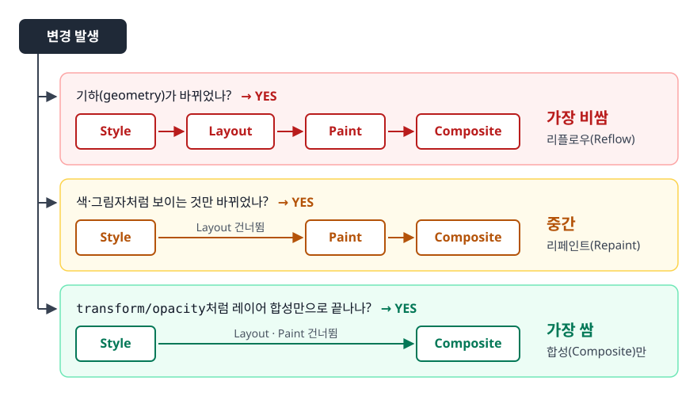
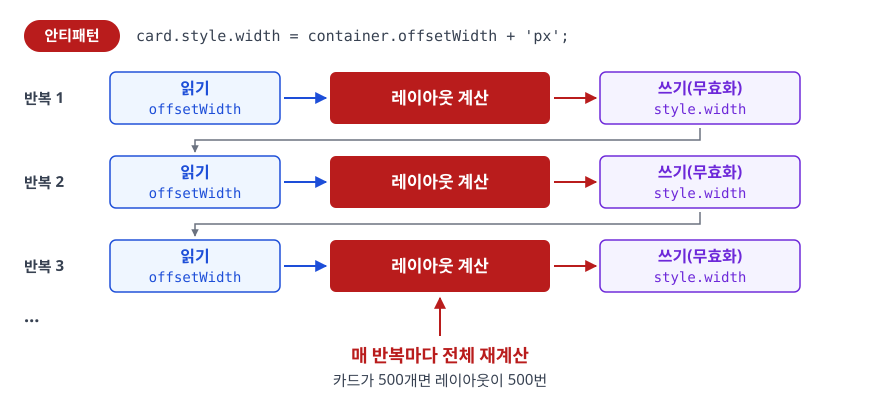
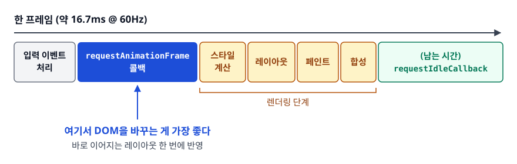

# 리플로우와 리페인트 (Reflow & Repaint)

> 화면이 갱신될 때 브라우저가 무엇을 다시 계산하는지 알고, 강제 동기 레이아웃을 코드에서 찾아내 고칠 수 있게 됩니다.

## 학습 목표

- [ ] 레이아웃(리플로우)과 페인트가 각각 무엇을 다시 계산하는지 구분할 수 있다
- [ ] 어떤 CSS 속성과 JS API가 리플로우를 유발하는지 설명할 수 있다
- [ ] 강제 동기 레이아웃(layout thrashing)이 생기는 코드를 알아보고 고칠 수 있다
- [ ] `requestAnimationFrame`으로 읽기·쓰기를 프레임 단위로 정리할 수 있다

## 선행 지식

- [03-dom-cssom.md](./03-dom-cssom.md) - 렌더 트리가 무엇이고 어떻게 만들어지는지

---

## 1. 왜 필요한가

첫 화면이 그려졌다고 끝이 아닙니다. 스크롤하고, 버튼을 누르고, 데이터가 들어오면 화면은 계속 바뀝니다.
문제는 **바뀔 때마다 파이프라인을 어디서부터 다시 도느냐**가 변경 종류에 따라 다르다는 것입니다.

부드러운 화면은 갱신 주기를 놓치지 않는다는 뜻입니다. 흔한 60Hz 화면이라면 프레임 하나에 쓸 수 있는 시간이 약 16.7ms다.
브라우저 자체 작업을 빼면 실제로 우리 코드에 허용되는 시간은 그보다 짧습니다.
버튼 하나 누를 때마다 전체 레이아웃을 다시 계산하면 이 예산은 순식간에 넘어가고, 화면은 끊깁니다.

**비유**: 사무실 가구 배치를 바꾼다고 하자. 벽 색만 새로 칠하는 건 다른 가구에 영향이 없다(페인트).
그런데 책상 하나를 크게 바꾸면 옆 책상, 통로 폭, 의자 위치까지 다시 재야 한다(리플로우).
**비유의 한계**: 실제 브라우저는 "옆 책상만"으로 끝나지 않는 경우가 많습니다. 문서 흐름 특성상 한 요소의 크기 변화가
뒤따르는 형제와 조상까지 번지면, 사실상 문서 전체를 다시 재는 결과가 되기도 합니다.

---

## 2. 파이프라인의 어디서부터 다시 도는가

<!-- diagram:fe-reflow-repaint-1 -->


<!-- 위 그림이 대체한 원본 ASCII.
     내용을 고칠 때는 그림도 함께 갱신할 것.
```
변경 발생
   │
   ├─ 기하(geometry)가 바뀌었나?
   │     YES ─► Style ─► Layout ─► Paint ─► Composite   (가장 비쌈)
   │
   ├─ 색·그림자처럼 보이는 것만 바뀌었나?
   │     YES ─► Style ─────────► Paint ─► Composite   (중간)
   │
   └─ transform/opacity처럼 레이어 합성만으로 끝나나?
         YES ─► Style ───────────────────► Composite   (가장 쌈)
```
-->

| 구분 | 다시 계산하는 것 | 비용 | 대표 속성 |
|------|----------------|------|----------|
| Layout(리플로우) | 모든 대상 박스의 **위치와 크기(px)** | 높음 — 형제·조상으로 번짐 | `width`, `height`, `margin`, `padding`, `border`, `top`/`left`, `display`, `float`, `font-size`, `line-height` |
| Paint(리페인트) | 픽셀을 어떻게 칠할지에 대한 **그리기 명령** | 중간 — 해당 영역 한정 | `color`, `background-color`, `background-image`, `box-shadow`, `border-radius`, `outline`, `visibility` |
| Composite | 레이어를 **어떤 위치·투명도로 겹칠지** | 낮음 | `transform`, `opacity` |

**요점**: 리플로우가 일어나면 그 결과를 다시 그려야 하니 페인트도 따라옵니다.
반대는 성립하지 않습니다. 색만 바꾸면 레이아웃은 건드리지 않습니다.
그래서 최적화의 1순위는 **"리플로우를 줄이거나 아예 건너뛰기"**다.

### 레이아웃 계산이 왜 번지나

```html
<div class="container">
  <div class="a">A</div>
  <div class="b">B</div>
  <div class="c">C</div>
</div>
```

`.a`의 `height`를 바꾸면 어떻게 될까. 일반 문서 흐름에서 `.b`와 `.c`는 `.a` 아래에 쌓이므로
둘의 y좌표가 전부 밀립니다. `.container`의 높이도 바뀌고, 그러면 컨테이너의 형제도 밀립니다.
즉 **한 요소의 변경이 문서 위쪽으로도 아래쪽으로도 전파**됩니다.

반대로 `position: absolute`나 `fixed`인 요소는 일반 흐름에서 빠져 있어서, 그 요소를 바꿔도
형제들의 위치에 영향을 주지 않습니다. 애니메이션 대상 요소를 흐름에서 빼내는 것이 성능에 유리한 이유입니다.

---

## 3. 리플로우를 유발하는 것들

### CSS 속성

기하에 영향을 주는 것은 전부 리플로우입니다.

```css
/* 크기 */      width, height, min-width, max-height, padding, margin, border-width
/* 위치 */      top, right, bottom, left, position, float, clear
/* 흐름 */      display, overflow, box-sizing
/* 텍스트 */    font-size, font-family, font-weight, line-height, letter-spacing,
                text-align, white-space, vertical-align
```

`font-family` 교체가 리플로우인 게 의외일 수 있는데, 글꼴이 바뀌면 글자 폭이 달라져 줄바꿈 위치가 전부 바뀝니다.
웹폰트가 늦게 도착했을 때 화면이 출렁이는(레이아웃 시프트) 원인이 이것입니다.

### JS API — "읽기"가 레이아웃을 강제한다

여기가 진짜 함정입니다. 다음 값들을 읽으면 브라우저는 **최신 레이아웃 결과를 즉시 알아야** 하므로,
대기 중인 변경이 있으면 그 자리에서 레이아웃을 돌립니다.

```js
// 크기·위치 관련
el.offsetTop, el.offsetLeft, el.offsetWidth, el.offsetHeight
el.clientTop, el.clientLeft, el.clientWidth, el.clientHeight
el.scrollTop, el.scrollLeft, el.scrollWidth, el.scrollHeight
el.getBoundingClientRect()
el.getClientRects()

// 계산된 스타일
window.getComputedStyle(el)      // 값에 따라 레이아웃이 필요할 수 있다

// 스크롤·포커스 동작
el.scrollIntoView(), el.scrollTo(), el.focus()

// 창 크기
window.innerWidth, window.innerHeight, window.scrollY
```

이걸 **강제 동기 레이아웃(forced synchronous layout)**이라 부릅니다.
"쓰기는 미뤄도 되지만, 읽기는 미룰 수 없다"가 핵심 원리입니다.

---

## 4. 레이아웃 스래싱 — 안티패턴과 개선

### 안티패턴: 읽기와 쓰기를 번갈아 반복

```js
// 안티패턴: 모든 카드를 컨테이너 너비에 맞춘다
const cards = document.querySelectorAll('.card');
for (const card of cards) {
  card.style.width = container.offsetWidth + 'px';  // 읽기 → 쓰기 → 읽기 → 쓰기 …
}
```

**왜 문제인가**: 첫 반복에서 `offsetWidth`를 읽으면 레이아웃이 계산됩니다. 그다음 `style.width`를 쓰면
그 레이아웃 결과가 무효(dirty)가 됩니다. 두 번째 반복에서 다시 `offsetWidth`를 읽는 순간
브라우저는 **또 레이아웃을 처음부터 돌려야 한다.** 카드가 500개면 레이아웃이 500번 돕니다.

<!-- diagram:fe-reflow-repaint-2 -->


<!-- 위 그림이 대체한 원본 ASCII.
     내용을 고칠 때는 그림도 함께 갱신할 것.
```
[안티패턴]
읽기 ─► [레이아웃 계산] ─► 쓰기(무효화)
읽기 ─► [레이아웃 계산] ─► 쓰기(무효화)
읽기 ─► [레이아웃 계산] ─► 쓰기(무효화)
        ↑ 매 반복마다 전체 재계산
```
-->

### 개선 1: 읽기를 밖으로 빼기

```js
const cards = document.querySelectorAll('.card');
const width = container.offsetWidth + 'px';   // 읽기 1회
for (const card of cards) {
  card.style.width = width;                   // 쓰기만
}
```

```
[개선]
읽기 ─► [레이아웃 계산 1회]
쓰기 쓰기 쓰기 쓰기 …
                        ─► [프레임 끝에 레이아웃 1회]
```

이 코드에서는 읽는 값이 하나뿐이라 간단했습니다. 실제로는 요소마다 다른 값을 읽어야 하는 경우가 많습니다.

### 개선 2: 읽기 전부 → 쓰기 전부 (배칭)

```js
// querySelectorAll이 주는 NodeList에는 map이 없다. 배열로 바꿔 두고 쓴다.
const items = [...document.querySelectorAll('.item')];

// 안티패턴: 요소마다 읽고 바로 쓴다
items.forEach(el => {
  el.style.height = el.offsetWidth + 'px';   // 정사각형으로 만들기
});

// 개선: 두 단계로 나눈다
const widths = items.map(el => el.offsetWidth);        // 1) 읽기만 — 레이아웃 1회
items.forEach((el, i) => {                             // 2) 쓰기만
  el.style.height = widths[i] + 'px';
});
```

읽기 단계에서 레이아웃이 한 번 계산되면 그 결과가 유효한 동안 나머지 읽기는 캐시된 값을 씁니다.
쓰기는 어차피 프레임 끝에 몰아서 처리됩니다. **"읽기 → 쓰기" 순서를 지키는 것**만으로 N번이 1번이 됩니다.

### 개선 3: 스타일 값은 CSS에 두고 JS는 클래스만 토글

```js
// 안티패턴: 상태가 바뀔 때마다 속성을 하나씩 손댄다
panel.style.paddingTop = '24px';
panel.style.borderBottomWidth = '2px';
panel.style.fontSize = '18px';
```

```css
/* 개선: 상태를 클래스 하나로 표현하고 값은 CSS에 둔다 */
.panel.is-expanded {
  padding-top: 24px;
  border-bottom-width: 2px;
  font-size: 18px;
}
```

```js
panel.classList.toggle('is-expanded', expanded);
```

여기서 오해를 하나 풀고 가자. 위 안티패턴이 리플로우를 세 번 일으키는 건 **아니다.**
쓰기와 쓰기 사이에 읽기가 없으면 브라우저가 알아서 모아 프레임 끝에 한 번만 처리합니다.
그런데도 클래스 토글을 권하는 이유는 성능이 아니라 **스타일 값이 JS 코드에 흩어지지 않는다**는 데 있습니다.
값이 CSS 한곳에 모여 있으면 미디어 쿼리나 테마 변수로 확장하기도 쉽습니다.
"인라인 스타일을 한 줄로 합치면 빨라진다"는 식의 조언은 오늘날 근거가 약합니다.

### 개선 4: 문서에서 떼어내고 작업하기

큰 리스트를 통째로 갈아엎을 때는 아예 렌더 트리에서 빼놓고 작업한 뒤 되돌리는 방법도 있습니다.

```js
const parent = list.parentNode;
const next = list.nextSibling;
parent.removeChild(list);          // 문서에서 분리 — 이 동안의 변경은 레이아웃 대상이 아니다

// ... list에 대해 대량 변경 ...

parent.insertBefore(list, next);   // 되돌리기
```

`display:none`으로 숨겼다가 되돌리는 방법도 같은 원리지만, 숨기고 되살릴 때 각각 리플로우가 한 번씩 듭니다.
변경량이 충분히 클 때만 이득이므로 항상 측정하고 씁니다.

---

## 5. requestAnimationFrame — 쓰기 타이밍 맞추기

### 프레임 안에서 rAF의 위치

<!-- diagram:fe-reflow-repaint-3 -->


<!-- 위 그림이 대체한 원본 ASCII.
     내용을 고칠 때는 그림도 함께 갱신할 것.
```
── 한 프레임 (약 16.7ms @ 60Hz) ────────────────────────────►

 입력 이벤트 처리
      │
      ▼
 requestAnimationFrame 콜백   ← 여기서 DOM을 바꾸는 게 가장 좋다
      │
      ▼
 스타일 계산 → 레이아웃 → 페인트 → 합성
      │
      ▼
 (남는 시간) requestIdleCallback
```
-->

`rAF` 콜백은 **레이아웃이 시작되기 직전**에 실행됩니다. 여기서 DOM을 바꾸면 바로 이어지는 레이아웃 한 번에 반영됩니다.
반면 `setTimeout`은 화면 갱신 주기와 무관하게 발화하므로, 프레임 중간에 변경이 들어가 한 프레임을 놓치거나
같은 프레임에 두 번 그리는 낭비가 생길 수 있습니다.

### 안티패턴: 스크롤 핸들러에서 바로 읽고 쓰기

```js
// 안티패턴
window.addEventListener('scroll', () => {
  const rect = header.getBoundingClientRect();   // 읽기(레이아웃 강제)
  header.style.opacity = rect.top < -100 ? '0.5' : '1';  // 쓰기
});
```

**왜 문제인가**: 스크롤 이벤트는 한 프레임에 여러 번 발화할 수 있습니다.
그때마다 레이아웃을 강제하니 스크롤이 뚝뚝 끊깁니다.

```js
// 개선: 프레임당 한 번만 처리하도록 묶는다
let scheduled = false;

window.addEventListener('scroll', () => {
  if (scheduled) return;
  scheduled = true;

  requestAnimationFrame(() => {
    const rect = header.getBoundingClientRect();          // 읽기
    header.style.opacity = rect.top < -100 ? '0.5' : '1'; // 쓰기
    scheduled = false;
  });
}, { passive: true });
```

`{ passive: true }`도 중요합니다. 이 옵션은 "이 핸들러는 `preventDefault()`를 호출하지 않는다"는 약속이라,
브라우저가 핸들러 실행을 기다리지 않고 스크롤을 먼저 진행할 수 있습니다.

### 더 나은 대안: 관찰자 API

"어떤 요소가 화면에 보이는가"를 알고 싶은 것뿐이라면 스크롤 위치를 직접 재지 않는 편이 낫습니다.

```js
// 요소가 뷰포트에 들어왔는지 — 레이아웃을 강제하지 않는다
const io = new IntersectionObserver(entries => {
  entries.forEach(entry => {
    entry.target.classList.toggle('visible', entry.isIntersecting);
  });
});
document.querySelectorAll('.lazy').forEach(el => io.observe(el));
```

```js
// 요소 크기 변화 감지 — resize 이벤트 + offsetWidth 폴링을 대체한다
const ro = new ResizeObserver(entries => {
  for (const entry of entries) {
    const { width } = entry.contentRect;   // 이미 계산된 값을 받는다
    entry.target.dataset.size = width > 600 ? 'wide' : 'narrow';
  }
});
ro.observe(container);
```

두 API 모두 브라우저가 자신의 렌더링 주기에 맞춰 결과를 전달합니다.
개발자가 레이아웃 값을 직접 캐물을 필요가 없어지므로 강제 동기 레이아웃이 원천적으로 사라집니다.

---

## 6. 실무에서는

- **DevTools Performance 패널**: 기록 후 타임라인에서 보라색 `Layout` 막대를 봅니다.
  같은 프레임 안에 `Layout`이 여러 번 반복되면 스래싱입니다. 경고 삼각형이 붙은 항목은
  "Forced reflow"로 표시되고, 클릭하면 원인이 된 JS 줄로 이동합니다.
- **Rendering 탭**: `Paint flashing`을 켜면 다시 그려지는 영역이 초록색으로 번쩍입니다.
  스크롤만 했는데 화면 전체가 번쩍이면 페인트 범위가 과한 것입니다.
- **레이아웃 시프트(CLS)**: 이미지에 `width`/`height`(또는 `aspect-ratio`)를 지정하지 않으면
  이미지가 도착하는 순간 뒤 콘텐츠가 밀립니다. 사용자가 누르려던 버튼이 도망가는 그 현상입니다.
  자리를 미리 잡아 두는 것이 유일한 해법입니다.
- **`contain` 속성**: `contain: layout`을 주면 그 요소 내부의 레이아웃 변경이 바깥으로 전파되지 않는다고
  브라우저에 알려, 재계산 범위를 가둘 수 있습니다. 독립적인 카드·위젯 컨테이너에 어울립니다.
- **가상 스크롤(virtual scroll)**: 수천 개 행을 전부 DOM에 넣으면 레이아웃 대상 자체가 커집니다.
  화면에 보이는 만큼만 DOM에 유지하는 것이 근본 해결책입니다.

---

## 7. 면접 포인트

> 면접에서 이 주제가 나오면 이렇게 답한다

**Q. 리플로우와 리페인트의 차이는?**
A. 리플로우는 요소의 크기·위치 같은 기하 정보를 다시 계산하는 단계라, 변경이 형제와 조상으로 번져 비용이 큽니다.
리페인트는 색이나 그림자처럼 보이는 것만 바뀌어 그리기 명령을 다시 만드는 단계로 상대적으로 쌉니다.
리플로우가 나면 페인트도 따라오지만, 페인트만 단독으로 나는 변경도 있습니다.
그래서 최적화는 리플로우를 줄이는 데 초점을 둡니다.
- 꼬리 질문: "리플로우도 페인트도 없는 변경이 있나요?" → `transform`과 `opacity`는 합성 단계만으로 처리될 수 있습니다.

**Q. 강제 동기 레이아웃(layout thrashing)이란?**
A. 브라우저는 스타일 변경을 모아 프레임 끝에 한 번 처리하는데, `offsetWidth`나 `getBoundingClientRect()`처럼
최신 레이아웃 값을 요구하는 읽기를 만나면 그 자리에서 즉시 레이아웃을 계산해야 합니다.
쓰기와 읽기를 번갈아 반복하면 매 반복마다 레이아웃이 강제되어 성능이 급격히 떨어집니다.
해결책은 읽기를 모두 먼저 하고 쓰기를 나중에 하는 배칭입니다.
- 꼬리 질문: "왜 쓰기는 미룰 수 있는데 읽기는 못 미루나요?" → 쓰기는 최종 상태만 맞으면 되지만,
  읽기는 그 시점의 정확한 값을 반환해야 하므로 미룰 수 없습니다.

**Q. 스크롤 이벤트에서 성능이 나빠지는 흔한 원인은?**
A. 스크롤은 한 프레임에도 여러 번 발화하는데, 핸들러 안에서 레이아웃 값을 읽고 바로 스타일을 쓰면
그때마다 강제 레이아웃이 일어납니다. `requestAnimationFrame`으로 프레임당 한 번만 처리하도록 묶고,
`passive: true`를 붙여 스크롤을 막지 않게 합니다. 화면 진입 여부만 알면 되는 경우라면
`IntersectionObserver`로 바꾸는 것이 더 낫습니다.

**Q. `setTimeout` 대신 `requestAnimationFrame`을 쓰는 이유는?**
A. `rAF` 콜백은 브라우저가 다음 프레임을 그리기 직전에 실행되어, 여기서 한 DOM 변경이 바로 이어지는
레이아웃·페인트에 정확히 한 번 반영됩니다. `setTimeout`은 화면 갱신 주기와 무관하게 발화해
프레임을 놓치거나 불필요하게 두 번 그리는 낭비가 생길 수 있습니다.
또 탭이 백그라운드로 가면 `rAF`는 호출되지 않아 자원도 아낍니다.

---

## 자주 하는 실수

| 실수 | 왜 틀렸나 | 올바른 이해 |
|------|----------|-----------|
| "리페인트가 리플로우보다 항상 훨씬 싸다" | 페인트 영역이 넓으면 페인트도 무겁다 | 상대적으로 쌀 뿐, 큰 그림자·필터가 걸린 넓은 영역의 페인트는 비싸다 |
| "스타일을 쓸 때마다 리플로우가 난다" | 브라우저가 프레임 단위로 모아 처리한다 | 진짜 문제는 쓰기 사이에 끼어드는 **읽기** |
| "`getBoundingClientRect()`는 그냥 조회" | 대기 중인 변경이 있으면 레이아웃을 강제한다 | 읽기 API가 성능 문제의 방아쇠다 |
| "`cssText`가 무조건 더 빠르다" | 연속 쓰기는 어차피 배칭된다 | 유지보수 이점이 주된 이유. 성능 차이는 상황에 따라 미미하다 |
| "`display:none`으로 숨겼다 켜면 항상 이득" | 숨김·복원 각각에 리플로우가 든다 | 변경량이 클 때만 이득. 측정 후 판단한다 |
| "`visibility:hidden`은 `display:none`과 비용이 같다" | 전자는 렌더 트리에 남아 레이아웃이 유지된다 | 자주 토글한다면 `visibility` 쪽이 레이아웃 재계산을 피할 수 있다 |
| "스크롤 핸들러는 `throttle`만 걸면 된다" | 시간 기준 스로틀은 프레임과 어긋날 수 있다 | 화면 갱신에 맞추려면 `rAF` 기반으로 묶는 편이 정확하다 |

---

## 한 줄 정리

리플로우는 **위치와 크기를 다시 재는 일**, 리페인트는 **다시 칠하는 일**이며,
성능 문제의 대부분은 쓰기 사이에 끼어든 읽기가 만드는 강제 동기 레이아웃에서 나옵니다.

---

## 연관 개념

- [03-dom-cssom.md](./03-dom-cssom.md) - 렌더 트리와 DOM 조작 비용
- [05-compositing-gpu.md](./05-compositing-gpu.md) - 리플로우·리페인트를 아예 건너뛰는 방법
- [02-critical-rendering-path.md](./02-critical-rendering-path.md) - 첫 렌더링까지의 경로
- [qna-browser.md](./qna-browser.md) - 이 주제 면접 질문
- [HTML/CSS QnA](../html-css/qna-html-css.md) - display/visibility/opacity 비교
