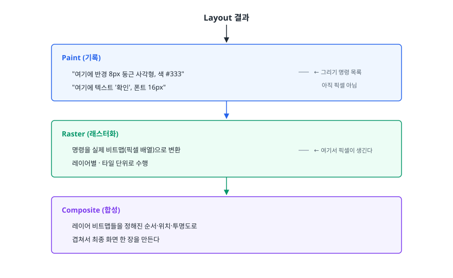
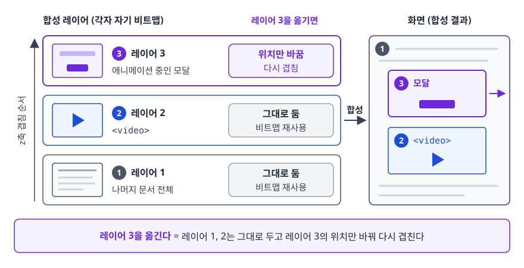
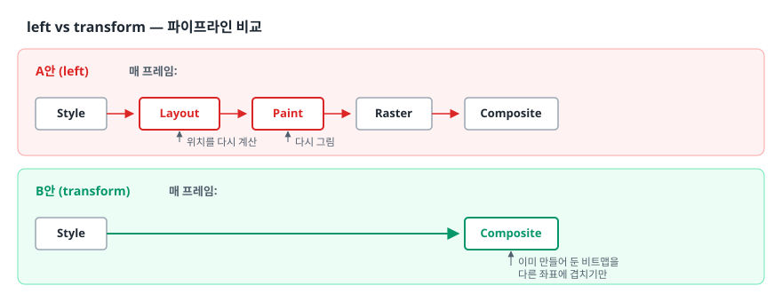
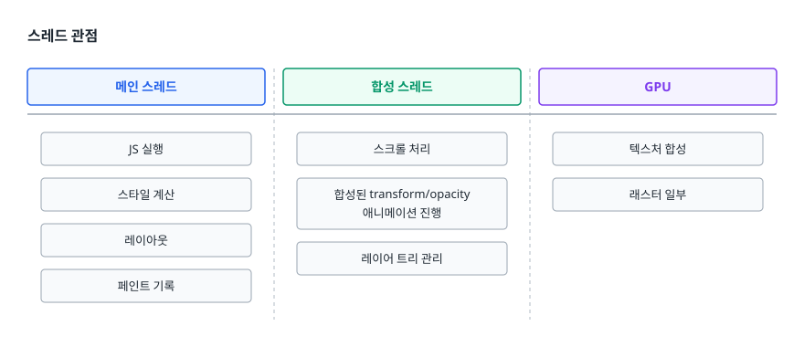
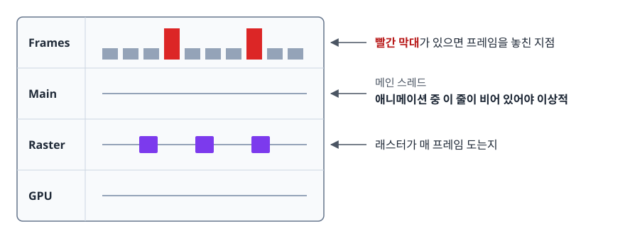

# 합성과 GPU 가속 (Compositing & GPU Acceleration)

> 렌더링 파이프라인의 마지막 단계인 합성이 무엇인지 알고, `transform`/`opacity` 애니메이션이 왜 싼지, `will-change`를 언제 쓰고 언제 쓰면 안 되는지 판단할 수 있게 됩니다.

## 학습 목표

- [ ] 합성(compositing) 단계가 무엇을 하는지, 레이어가 무엇인지 설명할 수 있다
- [ ] `left` 애니메이션과 `transform` 애니메이션의 파이프라인 차이를 설명할 수 있다
- [ ] "GPU 가속"이 실제로 무엇을 의미하는지 구체적으로 말할 수 있다
- [ ] `will-change`의 효과와 남용 시 부작용을 설명할 수 있다
- [ ] DevTools로 레이어와 프레임 성능을 확인할 수 있다

## 선행 지식

- [04-reflow-repaint.md](./04-reflow-repaint.md) - 레이아웃과 페인트가 각각 무엇을 다시 계산하는지

---

## 1. 왜 필요한가

[리플로우와 리페인트](./04-reflow-repaint.md)에서 "레이아웃을 줄여라"까지 왔습니다.
그런데 애니메이션은 화면 갱신 주기마다 그림을 바꿔야 합니다. 흔한 60Hz 화면이라면 초당 60번,
프레임 하나에 허용된 시간은 약 16.7ms다. 아무리 레이아웃을 줄여도 매 프레임 페인트까지 다시 하면
이 예산을 지키기 어렵습니다.

그래서 브라우저는 다른 접근을 택했습니다. **화면을 여러 장의 그림으로 나눠 미리 그려 두고,
움직일 때는 그림 자체를 다시 그리는 대신 위치만 바꿔 겹친다.** 이게 합성입니다.

**비유**: 옛날 셀 애니메이션이 딱 이 방식입니다. 배경은 한 장 그려 놓고, 캐릭터만 투명 필름에 그려
프레임마다 필름을 조금씩 옮깁니다. 배경을 매번 다시 그리지 않으니 작업량이 확 줍니다.
**비유의 한계**: 필름은 종이 몇 장 값이지만, 브라우저 레이어는 **GPU 메모리**를 먹습니다.
필름을 무한정 늘리면 오히려 느려진다는 게 이 비유가 놓치는 부분입니다.

---

## 2. 페인트와 래스터, 그리고 합성

"Paint 단계에서 픽셀이 만들어진다"는 설명은 조금 거칩니다. 실제로는 두 단계로 나뉩니다.

<!-- diagram:fe-compositing-gpu-1 -->


<!-- 위 그림이 대체한 원본 ASCII.
     내용을 고칠 때는 그림도 함께 갱신할 것.
```
Layout 결과
    │
    ▼
┌─────────────────────────────────────────────┐
│ Paint (기록)                                │
│  "여기에 반경 8px 둥근 사각형, 색 #333"      │  ← 그리기 명령 목록
│  "여기에 텍스트 '확인', 폰트 16px"           │     아직 픽셀 아님
└──────────────────┬──────────────────────────┘
                   ▼
┌─────────────────────────────────────────────┐
│ Raster (래스터화)                            │
│  명령을 실제 비트맵(픽셀 배열)으로 변환       │  ← 여기서 픽셀이 생긴다
│  레이어별 · 타일 단위로 수행                  │
└──────────────────┬──────────────────────────┘
                   ▼
┌─────────────────────────────────────────────┐
│ Composite (합성)                             │
│  레이어 비트맵들을 정해진 순서·위치·투명도로  │
│  겹쳐서 최종 화면 한 장을 만든다              │
└─────────────────────────────────────────────┘
```
-->

### 레이어란

<!-- diagram:fe-compositing-gpu -->


브라우저는 페이지 전체를 한 장으로만 다루지 않습니다. 특정 조건을 만족하는 요소는
**독립된 합성 레이어(compositing layer)**로 분리되어 자기만의 비트맵을 갖습니다.

```
        화면(합성 결과)
   ┌─────────────────────┐
   │  ┌───────────────┐  │  ← 레이어 3: 애니메이션 중인 모달
   │  │               │  │
   │  └───────────────┘  │
   │  ┌───────────────┐  │  ← 레이어 2: <video>
   │  │               │  │
   │  └───────────────┘  │
   │ ─────────────────── │  ← 레이어 1: 나머지 문서 전체
   └─────────────────────┘

레이어 3을 옮긴다 = 레이어 1, 2는 그대로 두고
                    레이어 3의 위치만 바꿔 다시 겹친다
```

레이어가 분리되어 있으면 **한 레이어의 변화가 다른 레이어를 다시 그리게 만들지 않는다.**
이게 합성의 핵심 이득입니다.

---

## 3. left vs transform — 파이프라인 비교

```css
/* A안 */
.box { position: absolute; left: 0; transition: left 300ms; }
.box.move { left: 300px; }

/* B안 */
.box { transition: transform 300ms; }
.box.move { transform: translateX(300px); }
```

두 코드는 눈에 보이는 결과가 같지만, 매 프레임 하는 일이 다릅니다.

<!-- diagram:fe-compositing-gpu-2 -->


<!-- 위 그림이 대체한 원본 ASCII.
     내용을 고칠 때는 그림도 함께 갱신할 것.
```
A안 (left)      매 프레임:
                Style ─► Layout ─► Paint ─► Raster ─► Composite
                         ↑ 위치를 다시 계산  ↑ 다시 그림

B안 (transform) 매 프레임:
                Style ────────────────────────────► Composite
                                                    ↑ 이미 만들어 둔 비트맵을
                                                      다른 좌표에 겹치기만
```
-->

| 항목 | `left` 애니메이션 | `transform` 애니메이션 |
|------|------------------|----------------------|
| 매 프레임 Layout | O | X |
| 매 프레임 Paint/Raster | O | X (레이어가 분리된 경우) |
| 형제 요소 영향 | 흐름에 있으면 밀림 | 없음 (레이아웃에 영향 주지 않음) |
| 메인 스레드 필요 | 매 프레임 필요 | 합성 스레드에서 처리 가능 |
| 확대·축소 시 선명도 | 매 프레임 새로 그리므로 항상 선명 | 래스터된 비트맵을 늘리는 것이라 중간에 흐려 보일 수 있음 |

**언제 뭘 쓰나**: 움직임·크기 변화·투명도 변화를 애니메이션할 때는 `transform`과 `opacity`만 씁니다.
`left`/`top`/`width`/`height`/`margin`은 애니메이션 대상으로 삼지 않습니다.

### 흔한 오해: "transform은 무조건 공짜"

아닙니다. 두 가지 조건이 붙습니다.

첫째, 그 요소가 **독립 레이어로 승격되어 있어야** 페인트를 건너뜁니다.
레이어가 아니면 `transform`을 바꿔도 자신이 속한 레이어를 다시 그려야 합니다.
다만 브라우저는 `transform`/`opacity`를 애니메이션하는 요소를 대체로 알아서 승격시킵니다.

둘째, `transform`의 **어떤 값**을 바꾸느냐가 아니라 **어떻게 바꾸느냐**가 스레드를 가릅니다.

```css
/* CSS 애니메이션/트랜지션 → 합성 스레드에서 실행 가능
   메인 스레드가 무거운 JS로 막혀 있어도 계속 부드럽다 */
.box { transition: transform 300ms; }
```

```js
// JS로 매 프레임 직접 바꾸기 → 메인 스레드가 매 프레임 관여한다
function step() {
  box.style.transform = `translateX(${x++}px)`;
  requestAnimationFrame(step);
}
```

JS 방식도 레이아웃과 페인트는 건너뛰지만, 메인 스레드가 다른 작업으로 막히면 프레임을 놓칩니다.
**"CSS로 표현할 수 있는 애니메이션은 CSS로"**가 권장되는 진짜 이유가 이것입니다.

---

## 4. "GPU 가속"이 실제로 의미하는 것

이 표현은 오해를 많이 낳습니다. GPU가 CSS를 해석하거나 레이아웃을 계산하는 게 아닙니다.
실제로 일어나는 일은 이렇습니다.

1. 레이어의 비트맵을 **GPU 텍스처로 업로드**합니다.
2. 화면을 만들 때 GPU가 텍스처들을 **변환 행렬과 알파 값에 따라 합성**합니다.
3. `transform`이 바뀌면 텍스처는 그대로 두고 **행렬만 바꿔** 다시 합성합니다.

즉 GPU가 잘하는 건 **"이미 만들어진 이미지를 옮기고, 돌리고, 확대하고, 투명하게 겹치는 일"**입니다.
이건 GPU 하드웨어가 원래 하던 작업(텍스처 매핑)이라 대량으로 병렬 처리됩니다.
반대로 "이 텍스트를 이 폰트로 그려라" 같은 작업은 여전히 래스터 단계의 몫입니다.

역할을 갈라 보면 이렇습니다.

- GPU가 대신 해 주는 것: 레이어 **합성**, 그리고 상당 부분의 **래스터화**
- GPU가 대신 해 주지 않는 것: 스타일 계산, 레이아웃, 어떤 그림을 그릴지 결정하는 페인트 기록

`transform`과 `opacity`가 특별한 이유도 여기서 나옵니다. 이 둘은 **텍스처 내용을 바꾸지 않고**
합성 파라미터(행렬, 알파)만 바꾸는 속성이라, 3번 단계만으로 끝납니다.
`background-color`는 텍스처 내용 자체가 달라지므로 래스터를 다시 해야 합니다.

### 스레드 관점

<!-- diagram:fe-compositing-gpu-3 -->


<!-- 위 그림이 대체한 원본 ASCII.
     내용을 고칠 때는 그림도 함께 갱신할 것.
```
메인 스레드          │ 합성 스레드              │ GPU
─────────────────────┼──────────────────────────┼──────────────
JS 실행              │ 스크롤 처리              │ 텍스처 합성
스타일 계산          │ 합성된 transform/opacity │ 래스터 일부
레이아웃             │  애니메이션 진행         │
페인트 기록          │ 레이어 트리 관리         │
```
-->

메인 스레드가 무거운 JS로 1초 동안 멈춰도, **합성 스레드가 담당하는 스크롤과 합성 애니메이션은 계속 동작한다.**
"페이지는 멈췄는데 스크롤은 되더라" 하는 경험이 여기서 나옵니다.
반대로 말하면, 애니메이션을 합성 스레드로 넘기는 것은 단순한 속도 향상이 아니라
**메인 스레드 지연에 대한 내성**을 얻는 일입니다.

---

## 5. 레이어는 언제 생기나

브라우저가 레이어를 만드는 대표적인 이유(compositing reasons)다.

```
- 3D transform (translate3d, translateZ, rotate3d 등)
- <video>, <canvas>, WebGL 컨텍스트
- transform 또는 opacity를 애니메이션 중인 요소
- will-change: transform / opacity / filter
- backdrop-filter를 사용하는 요소
- 위 요소들 위에 겹쳐지는 요소 (겹침으로 인한 승격)
```

마지막 항목이 사고를 많이 냅니다. 합성 레이어 위에 다른 요소가 겹치면,
겹침 순서를 지키기 위해 **그 요소도 레이어로 승격**될 수 있습니다. 레이어 하나를 만들었더니
연쇄적으로 수십 개가 생기는 현상을 **레이어 폭발(layer explosion)**이라 부릅니다.

---

## 6. will-change — 쓰는 법과 안티패턴

### 무엇을 하는가

```css
.modal { will-change: transform; }
```

"이 요소의 `transform`이 곧 바뀔 예정"이라고 브라우저에 미리 알려, **애니메이션이 시작되기 전에**
레이어를 준비하게 하는 힌트입니다. 레이어 승격에는 텍스처 생성 비용이 드는데,
그 비용을 애니메이션 첫 프레임에 치르면 시작이 뚝 끊깁니다. `will-change`는 그 비용을 앞당깁니다.

### 안티패턴 1: 전역에 걸기

```css
/* 안티패턴 */
* { will-change: transform; }
.card { will-change: transform, opacity, left, top; }
```

**왜 문제인가**: 모든 요소가 레이어가 되면 GPU 메모리가 폭증합니다.
레이어 하나의 비트맵은 대략 `가로 × 세로 × 픽셀당 4바이트`이고, 고해상도 화면에서는 배율만큼 더 커집니다.
전체 화면 크기의 레이어 몇 장이면 수십 MB가 우습게 나가고, 메모리가 부족한 기기에서는
오히려 프레임이 떨어지거나 탭이 죽습니다.
또 `will-change`에 여러 속성을 나열하면 브라우저가 최적화 대상을 좁힐 수 없어 힌트의 의미가 사라집니다.

```css
/* 개선: 정말 애니메이션할 요소에, 정말 바뀔 속성만 */
.modal { will-change: transform; }
```

### 안티패턴 2: 걸어 놓고 안 치우기

```css
/* 안티패턴: 페이지에 있는 내내 레이어를 붙들고 있다 */
.drawer { will-change: transform; }
```

**왜 문제인가**: `will-change`는 "곧"이라는 뜻인데, 항상 켜 두면 브라우저는 언제 해제해야 할지 모른 채
레이어를 계속 유지합니다. 애니메이션이 끝났는데도 메모리를 붙잡고 있는 셈입니다.

```css
/* 개선 A: 상호작용 직전에만 켠다 — 호버 시점이면 애니메이션 시작보다 충분히 이르다 */
.drawer-trigger:hover ~ .drawer,
.drawer-trigger:focus ~ .drawer {
  will-change: transform;
}
.drawer { transition: transform 250ms; }
```

```js
// 개선 B: JS로 켜고, 끝나면 반드시 끈다
function openDrawer(el) {
  el.style.willChange = 'transform';
  el.classList.add('open');
  el.addEventListener('transitionend', () => {
    el.style.willChange = 'auto';   // 해제
  }, { once: true });
}
```

### 안티패턴 3: 레이어를 만들 목적으로 transform 해킹 쓰기

```css
/* 안티패턴: 옛날 방식 */
.box { transform: translateZ(0); }
```

**왜 문제인가**: 이 값은 "3D 변환이니 레이어를 만들라"는 부수 효과를 노린 것이지, 의도를 표현하지 않습니다.
코드를 읽는 사람은 왜 이게 있는지 알 수 없고, 브라우저도 "곧 바뀔 것"이라는 정보를 받지 못해
`will-change`만큼 똑똑하게 대응하지 못합니다.

```css
/* 개선: 의도를 그대로 적는다 */
.box { will-change: transform; }
```

### 부작용 하나 더: 컨테이닝 블록이 바뀐다

`will-change: transform`은 `transform`을 실제로 지정한 것과 같은 부수 효과를 일부 가집니다.
그중 실무에서 걸리는 것이 **`position: fixed`인 자손의 기준이 뷰포트가 아니라 이 요소가 되는 것**입니다.

```html
<div class="panel">        <!-- will-change: transform -->
  <div class="tooltip"></div>  <!-- position: fixed 인데 뷰포트 기준이 아니게 된다 -->
</div>
```

"툴팁이 갑자기 엉뚱한 데 붙는다"는 버그의 흔한 원인입니다. 새 쌓임 맥락(stacking context)도 만들어지므로
`z-index` 계산도 달라집니다. 성능 힌트라고 생각하고 붙였다가 레이아웃이 깨지는 일이 실제로 생깁니다.

---

## 7. 애니메이션 성능 디버깅

### DevTools Rendering 탭

`Ctrl/Cmd + Shift + P` → "Show Rendering"으로 엽니다.

| 옵션 | 보이는 것 | 어떻게 읽나 |
|------|----------|-----------|
| Paint flashing | 다시 그려지는 영역이 초록색으로 번쩍 | 애니메이션 중 번쩍이면 페인트를 건너뛰지 못하고 있다는 뜻 |
| Layer borders | 합성 레이어 경계선 | 의도하지 않은 레이어가 잔뜩 보이면 레이어 폭발 |
| Frame rendering stats | 실시간 FPS와 GPU 메모리 | 애니메이션 중 FPS가 떨어지는 지점을 즉시 확인 |

**진단의 출발점은 Paint flashing이다.** `transform` 애니메이션을 걸었는데 요소가 계속 초록색으로 번쩍이면
합성만으로 처리되지 않고 있다는 뜻이므로, 원인(레이어 미승격, 다른 속성 동시 변경 등)을 찾아야 합니다.

### Layers 패널

Chrome DevTools의 Layers 패널은 페이지의 레이어를 3D로 펼쳐 보여주고,
각 레이어를 클릭하면 **크기, 메모리 추정치, 그리고 이 레이어가 만들어진 이유(compositing reason)**를 알려줍니다.
"왜 이 요소가 레이어가 됐지?"에 대한 답을 추측하지 않고 확인할 수 있는 곳입니다.

### Performance 패널

기록 후 다음을 봅니다.

<!-- diagram:fe-compositing-gpu-4 -->


<!-- 위 그림이 대체한 원본 ASCII.
     내용을 고칠 때는 그림도 함께 갱신할 것.
```
Frames  ▁▁▁█▁▁▁█▁▁  ← 빨간 막대가 있으면 프레임을 놓친 지점
Main    ────────────  ← 메인 스레드. 애니메이션 중 이 줄이 비어 있어야 이상적
Raster  ──█──█──█──   ← 래스터가 매 프레임 도는지
GPU     ────────────
```
-->

이상적인 합성 애니메이션은 **Main 스레드 줄이 거의 비어 있다.**
애니메이션 구간에서 Main 줄에 `Layout`이나 `Paint`가 반복해서 찍힌다면 합성 최적화가 실패한 것입니다.

---

## 8. 실무에서는

- **모달·드로어·토스트**: 등장/퇴장 애니메이션은 `transform: translateY()` + `opacity`로만 구성합니다.
  `height`를 0에서 늘리는 방식은 매 프레임 레이아웃이라 반드시 끊깁니다.
- **스크롤 연동 효과**: 스크롤 이벤트에서 `top`을 바꾸는 대신, `transform`을 바꾸거나
  `position: sticky` 같은 선언적 수단을 먼저 검토합니다. 브라우저가 합성 스레드에서 처리할 여지가 커집니다.
- **긴 리스트**: 항목 수천 개를 DOM에 두면 합성 이전에 레이아웃·페인트 대상 자체가 커집니다.
  화면에 보이는 만큼만 유지하는 가상 스크롤이 먼저입니다. 합성 최적화는 그다음입니다.
- **텍스트 품질**: 합성 레이어로 승격된 요소는 배경이 투명할 경우 텍스트 안티에일리어싱 품질이 떨어져
  글자가 살짝 흐릿해 보일 수 있습니다. 애니메이션이 끝나면 `will-change`를 해제하는 편이 시각적으로도 낫습니다.
- **모바일**: GPU 메모리가 데스크톱보다 훨씬 적습니다. 데스크톱에서 멀쩡하던 레이어 수십 개가
  저사양 기기에서는 그대로 프레임 드랍이 됩니다. 성능 확인은 반드시 실제 기기나 CPU 스로틀링을 켜고 합니다.

---

## 9. 면접 포인트

> 면접에서 이 주제가 나오면 이렇게 답한다

**Q. 합성(compositing)이 무엇인가요?**
A. 페이지를 여러 레이어로 나눠 각각 비트맵으로 만들어 두고, 그 비트맵들을 정해진 순서와 위치·투명도로
겹쳐 최종 화면을 만드는 단계입니다. 레이어가 분리되어 있으면 한 레이어가 움직여도
다른 레이어를 다시 그릴 필요가 없어서, 매 프레임 해야 할 일이 크게 줄어듭니다.

**Q. 애니메이션에 `left` 대신 `transform`을 쓰는 이유는?**
A. `left`는 기하 속성이라 매 프레임 레이아웃과 페인트가 다시 돌고, 형제 요소 위치까지 영향을 줍니다.
`transform`은 이미 래스터화된 레이어를 어떤 행렬로 겹칠지만 바꾸므로 레이아웃과 페인트를 건너뛰고
합성만으로 끝납니다. 게다가 CSS 트랜지션/애니메이션으로 지정하면 합성 스레드에서 실행될 수 있어
메인 스레드가 바빠도 애니메이션이 끊기지 않습니다.
- 꼬리 질문: "`transform`이면 항상 페인트가 없나요?" → 아닙니다. 해당 요소가 독립 레이어로 승격돼 있어야 합니다.
  승격되지 않았다면 속한 레이어를 다시 그려야 합니다.

**Q. GPU 가속이라는 말이 정확히 뜻하는 게 뭔가요?**
A. GPU가 CSS를 해석하거나 레이아웃을 계산하는 게 아니라, 레이어 비트맵을 텍스처로 올려 두고
그것들을 변환 행렬과 알파 값으로 합성하는 작업을 GPU가 처리한다는 뜻입니다.
그래서 텍스처 내용을 바꾸지 않는 `transform`과 `opacity`만 이 경로의 이득을 온전히 받습니다.
스타일 계산·레이아웃·페인트 기록은 여전히 메인 스레드가 합니다.

**Q. `will-change`는 왜 남용하면 안 되나요?**
A. `will-change`는 레이어를 미리 만들라는 힌트인데, 레이어마다 GPU 메모리를 차지합니다.
전역이나 다수 요소에 걸면 메모리가 급증해 오히려 느려지고, 특히 모바일에서 문제가 큽니다.
또 `will-change: transform`은 새 쌓임 맥락과 컨테이닝 블록을 만들어 `position: fixed` 자손의 기준을 바꾸므로
레이아웃이 깨질 수 있습니다. 필요한 요소에만, 애니메이션 직전에 걸고 끝나면 해제하는 것이 원칙입니다.

**Q. 애니메이션이 끊길 때 어떻게 진단하시겠습니까?**
A. 먼저 DevTools Rendering에서 Paint flashing을 켜서 매 프레임 다시 그려지고 있는지 봅니다.
번쩍인다면 합성만으로 처리되지 못하는 것이므로 Performance 패널을 기록해 Main 스레드에
`Layout`이나 `Paint`가 반복되는지 확인합니다. `Layout`이 보이면 기하 속성을 애니메이션하고 있는 것이므로
`transform`/`opacity`로 바꿉니다. Layers 패널에서 레이어 수와 승격 이유도 함께 확인합니다.

---

## 자주 하는 실수

| 실수 | 왜 틀렸나 | 올바른 이해 |
|------|----------|-----------|
| "`transform`을 쓰면 무조건 GPU가 처리한다" | 레이어로 승격돼 있어야 페인트를 건너뛴다 | 승격 여부를 Layers 패널에서 확인해야 한다 |
| "GPU 가속이면 GPU가 CSS를 계산한다" | 스타일·레이아웃·페인트 기록은 메인 스레드 몫 | GPU는 텍스처 합성과 래스터 일부를 담당한다 |
| "`will-change`는 성능 향상 스위치" | 힌트일 뿐이고 메모리 비용이 있다 | 필요한 곳에만, 쓰고 나면 `auto`로 해제 |
| "`translateZ(0)` 해킹이 표준적인 방법" | 부수 효과에 기댄 관용구다 | 의도를 드러내는 `will-change`를 쓴다 |
| "레이어가 많을수록 빠르다" | 레이어마다 메모리·관리 비용이 든다 | 레이어 폭발은 성능을 떨어뜨린다 |
| "`will-change`는 시각적으로 아무 영향 없다" | 쌓임 맥락과 컨테이닝 블록을 만든다 | `z-index`·`position:fixed` 자손 위치가 달라질 수 있다 |
| "JS로 `transform`을 바꾸면 CSS와 똑같이 빠르다" | JS는 매 프레임 메인 스레드를 거친다 | 레이아웃·페인트는 피해도 메인 스레드 지연에는 취약하다 |

---

## 한 줄 정리

합성은 **미리 그려 둔 레이어를 겹쳐 화면을 만드는 단계**이며,
`transform`과 `opacity`만 이 단계만으로 처리되기 때문에 애니메이션의 기본 도구가 됩니다.
단, 레이어는 공짜가 아니므로 `will-change`는 필요한 곳에만 걸고 끝나면 해제합니다.

---

## 연관 개념

- [04-reflow-repaint.md](./04-reflow-repaint.md) - 합성 이전 단계인 레이아웃과 페인트
- [03-dom-cssom.md](./03-dom-cssom.md) - 렌더 트리와 스타일 결정
- [02-critical-rendering-path.md](./02-critical-rendering-path.md) - 합성이 놓인 전체 파이프라인
- [01-url-to-render.md](./01-url-to-render.md) - 픽셀이 찍히기까지의 전체 흐름
- [qna-browser.md](./qna-browser.md) - 이 주제 면접 질문
- [HTML/CSS QnA](../html-css/qna-html-css.md) - transform·opacity·display 관련 질문
