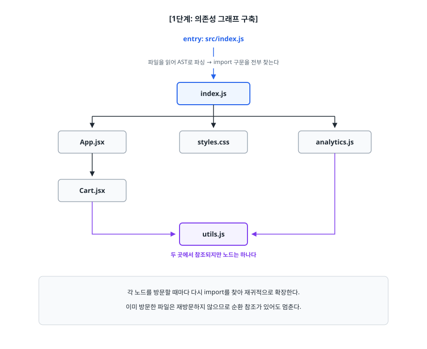

# 모듈 시스템과 번들링 (Module System & Bundling)

> `<script>` 태그를 순서대로 나열하던 시절에 무엇이 문제였는지, 모듈 시스템이 그 문제를 어떻게 나눠서 풀었는지를 먼저 짚어 봅니다. 그다음 번들러가 의존성 그래프를 만들어 파일을 쪼개고 합치는 과정까지 설명할 수 있게 됩니다.

## 학습 목표

- [ ] 스크립트 태그 나열 방식의 세 가지 문제를 코드로 지적할 수 있다
- [ ] CommonJS와 ES Modules의 차이를 "정적 분석 가능 여부"를 중심으로 설명할 수 있다
- [ ] 번들러가 의존성 그래프를 만들어 하나의 파일로 합치는 과정을 그릴 수 있다
- [ ] 코드 스플리팅이 필요한 시점을 판단하고 동적 `import()`로 구현할 수 있다
- [ ] 청크를 나누는 기준과 과하게 나눴을 때의 부작용을 설명할 수 있다

## 선행 지식

- 자바스크립트 함수 스코프와 클로저 개념 — [../javascript-deep-dive/03-closure.md](../javascript-deep-dive/03-closure.md)
- 그 외에는 없습니다. 빌드 도구를 처음 본다면 이 문서부터 시작해도 됩니다

---

## 1. 왜 필요한가

### 스크립트 태그를 나열하던 시절

번들러가 없던 시절의 HTML은 이렇게 생겼습니다.

```html
<script src="jquery.js"></script>
<script src="utils.js"></script>
<script src="user.js"></script>
<script src="cart.js"></script>
<script src="app.js"></script>
```

브라우저는 이 파일들을 위에서부터 순서대로 내려받아 실행합니다. 그리고 **각 파일의 최상위 스코프는 전부 같은 전역 스코프**입니다. 여기서 세 가지 문제가 동시에 터집니다.

**문제 1. 전역 오염(Global Namespace Pollution)**

```js
// utils.js
var config = { apiUrl: '/api/v1' };
function formatDate(d) { /* ... */ }

// cart.js — 다른 개발자가 작성
var config = { currency: 'KRW' };   // 조용히 덮어쓴다
```

`utils.js`의 `config`는 흔적도 없이 사라집니다. 에러도 경고도 없습니다. 나중에 `formatDate`가 `config.apiUrl`을 읽는 순간 `undefined`가 나오는데, 원인이 완전히 다른 파일에 있어서 추적이 어렵습니다. 파일이 50개쯤 되면 이름 충돌은 사고가 아니라 일상이 됩니다.

**문제 2. 의존성 순서를 사람이 관리한다**

`app.js`가 `utils.js`의 함수를 쓴다면, `utils.js`가 반드시 먼저 로드돼야 합니다. 이 순서를 지켜주는 것은 오직 HTML에 적힌 태그의 물리적 순서뿐입니다. 파일이 늘어나면 순서 규칙이 머릿속에만 존재하는 암묵지가 되고, 누군가 태그 한 줄을 옮기는 순간 `undefined is not a function`이 납니다. 더 큰 문제는 **어떤 파일이 어떤 파일을 필요로 하는지가 코드 어디에도 적혀 있지 않다**는 데 있습니다.

**문제 3. 요청 수**

HTTP/1.1 환경에서 브라우저는 같은 호스트에 동시에 열 수 있는 연결 수가 제한됩니다(관행적으로 6개 안팎). 파일이 100개면 6개씩 줄을 서서 내려받아야 하고, 파일마다 헤더·왕복 지연이 붙습니다. 코드 총량은 같은데 로딩만 느려집니다.

### 초기의 임시방편: IIFE와 네임스페이스

전역 오염만이라도 막아보려고 나온 것이 즉시 실행 함수(IIFE, Immediately Invoked Function Expression) 패턴입니다.

```js
var App = App || {};
App.utils = (function () {
  var config = { apiUrl: '/api/v1' };   // 함수 스코프 안에 갇힌다
  function formatDate(d) { /* ... */ }
  return { formatDate: formatDate };    // 공개할 것만 반환
})();
```

전역에 `App` 하나만 남기니 충돌은 줄었습니다. 하지만 **의존성 순서 문제와 요청 수 문제는 그대로**입니다. `App.utils`가 있는지 없는지는 실행해봐야 알고, 파일 수는 여전히 100개입니다. 이 두 문제를 근본적으로 풀려면 "이 파일은 저 파일이 필요하다"를 **코드 안에 문법으로 적을 수 있어야** 합니다. 그래서 모듈 시스템이 나왔습니다.

---

## 2. 모듈 시스템: CommonJS와 ES Modules

### CommonJS — 서버에서 먼저 자리 잡은 방식

Node.js가 채택하면서 사실상 표준이 된 방식입니다.

```js
// utils.js
function formatDate(d) { /* ... */ }
module.exports = { formatDate };

// app.js
const { formatDate } = require('./utils');
```

`require`는 **함수 호출**입니다. 이 사실이 모든 특성을 결정합니다. 함수이므로 어디서든 부를 수 있고, 조건문 안에서도 부를 수 있고, 인자를 변수로 넘길 수도 있습니다.

```js
let logger;
if (process.env.NODE_ENV === 'production') {
  logger = require('./prod-logger');     // 실행해봐야 무엇이 로드되는지 안다
}
const mod = require('./plugins/' + pluginName);  // 경로가 런타임에 결정된다
```

서버에서는 이게 장점입니다. 파일은 로컬 디스크에 있으니 동기적으로 읽어도 빠르고, 유연하게 분기할 수 있습니다. 문제는 **빌드 도구가 코드를 실행하지 않고는 무엇이 로드될지 알 수 없다**는 데 있습니다.

### ES Modules — 언어 표준으로 들어온 방식

ES2015에서 자바스크립트 언어 자체에 들어온 모듈 문법입니다.

```js
// utils.js
export function formatDate(d) { /* ... */ }
export const VERSION = '1.0';

// app.js
import { formatDate } from './utils.js';
```

`import`는 함수가 아니라 **문법 구조**(declaration)입니다. 그래서 제약이 있습니다.

```js
if (isProd) {
  import { logger } from './prod-logger.js';   // SyntaxError — 블록 안에 쓸 수 없다
}
import { x } from './a' + suffix;              // SyntaxError — 경로는 문자열 리터럴만
```

불편해 보이는 이 제약이 핵심입니다. `import`/`export`는 반드시 모듈 최상위에만 올 수 있고 경로는 리터럴이어야 하므로, **코드를 실행하지 않고 파싱만 해도 의존 관계 전체를 확정할 수 있습니다.** 이것을 정적 분석(static analysis)이라 부르고, 트리 셰이킹과 코드 스플리팅이 전부 여기서 출발합니다.

### 두 방식의 실제 동작 차이

정적/동적 말고도 값을 넘기는 방식이 다릅니다. 면접에서 한 번씩 나옵니다.

```js
// counter.cjs (CommonJS)
let count = 0;
function increment() { count++; }
module.exports = { count, increment };

// main.cjs
const { count, increment } = require('./counter.cjs');
increment();
console.log(count);   // 0 — 내보내는 순간의 값이 복사됐다
```

```js
// counter.mjs (ESM)
export let count = 0;
export function increment() { count++; }

// main.mjs
import { count, increment } from './counter.mjs';
increment();
console.log(count);   // 1 — 원본 바인딩을 참조한다
```

ESM의 `import`는 값의 복사본이 아닙니다. **원본 변수에 대한 살아 있는 참조**(live binding)입니다. 그래서 모듈 안에서 값이 바뀌면 가져다 쓰는 쪽에도 반영됩니다.

### 비교

| 기준 | CommonJS | ES Modules |
|------|----------|-----------|
| 문법 | `require` / `module.exports` | `import` / `export` |
| 정체 | 함수 호출 | 언어 문법 구조 |
| 위치 제약 | 없음 (조건문·함수 안 가능) | 모듈 최상위만 |
| 경로 | 런타임 계산 가능 | 문자열 리터럴만 |
| 로딩 | 동기 | 비동기 (파싱 단계에서 그래프 확정) |
| 내보내는 값 | 값 복사 | 살아 있는 바인딩 |
| 정적 분석 | 어렵다 | 가능 |
| 트리 셰이킹 | 사실상 불가 | 가능 |
| 주 사용처 | Node.js 서버, 레거시 빌드 설정 | 브라우저, 최신 라이브러리 |

> 결론: **새로 쓰는 애플리케이션 코드는 무조건 ESM.** CommonJS는 `webpack.config.js` 같은 빌드 설정 파일이나 오래된 npm 패키지를 다룰 때만 마주치게 됩니다. 라이브러리를 배포한다면 `package.json`의 `exports` 필드로 ESM과 CommonJS 두 형식을 함께 제공하는 것이 관행입니다.

브라우저에서 ESM을 쓰려면 `type="module"`을 붙입니다. 이때 스크립트는 자동으로 지연 실행(defer)되고 자체 스코프를 갖습니다.

```html
<script type="module" src="./app.js"></script>
```

---

## 3. 번들러가 실제로 하는 일

### 비유: 이사 짐 싸기

물건을 하나씩 손에 들고 옮기면 왕복 횟수가 곧 시간이 됩니다(요청 수 문제). 박스에 담아 한 번에 옮기면 빠릅니다(번들링). 그런데 박스를 딱 하나만 쓰면, 칫솔 하나 꺼내려고 이삿짐 전체를 풀어야 합니다(초기 번들이 비대해지는 문제). 그래서 "주방용품 박스", "당장 쓸 물건 박스"처럼 **용도별로 나눠 담습니다**(코드 스플리팅).

> **비유의 한계**: 번들러는 담기만 하지 않습니다. 안 쓰는 물건은 아예 버리고(트리 셰이킹), TypeScript나 SCSS 같은 것은 형태를 바꿔서 담습니다(로더). 짐을 싼 사람이 물건을 가공까지 하는 셈입니다.

### 의존성 그래프 만들기

번들러의 작업은 크게 두 단계입니다. 먼저 **그래프를 만들고**, 그다음 **그 그래프를 하나의 파일로 직렬화합니다**.

<!-- diagram:fe-module-bundling-1 -->


<!-- 위 그림이 대체한 원본 ASCII.
     내용을 고칠 때는 그림도 함께 갱신할 것.
```
[1단계: 의존성 그래프 구축]

  entry: src/index.js
     │  파일을 읽어 AST로 파싱 → import 구문을 전부 찾는다
     ↓
  ┌──────────────┐
  │  index.js    │
  └──────┬───────┘
         ├───────────────┬──────────────────┐
         ↓               ↓                  ↓
  ┌────────────┐  ┌────────────┐   ┌──────────────┐
  │  App.jsx   │  │ styles.css │   │ analytics.js │
  └─────┬──────┘  └────────────┘   └──────┬───────┘
        ↓                                 │
  ┌────────────┐                          │
  │  Cart.jsx  │                          │
  └─────┬──────┘                          │
        │        ┌────────────┐           │
        └───────►│  utils.js  │◄──────────┘
                 └────────────┘
                 두 곳에서 참조되지만 노드는 하나다

  각 노드를 방문할 때마다 다시 import를 찾아 재귀적으로 확장한다.
  이미 방문한 파일은 재방문하지 않으므로 순환 참조가 있어도 멈춘다.
```
-->

이 그래프가 있으면 **의존성 순서 문제가 자동으로 풀립니다.** 사람이 HTML 태그 순서를 관리할 필요가 없습니다. 무엇이 무엇을 필요로 하는지가 코드에 문법으로 적혀 있고, 번들러가 그것을 읽어 순서를 계산하기 때문입니다.

### 하나의 파일로 합치기

합칠 때 그냥 파일 내용을 이어 붙이면 1번에서 봤던 전역 오염 문제가 그대로 돌아옵니다. 그래서 번들러는 **각 모듈을 함수로 감싸서 스코프를 격리한 뒤, 아주 작은 런타임을 함께 넣습니다.**

```js
// 실제 번들 출력을 크게 단순화한 형태 (개념 이해용)
(function (modules) {
  const cache = {};

  function __require__(id) {
    if (cache[id]) return cache[id].exports;      // 이미 실행했으면 결과 재사용
    const module = (cache[id] = { exports: {} });
    modules[id](module, module.exports, __require__);
    return module.exports;
  }

  __require__(0);   // entry 모듈부터 실행
})({
  0: function (module, exports, __require__) {
    const { formatDate } = __require__(1);        // import 구문이 이렇게 치환됐다
    console.log(formatDate(new Date()));
  },
  1: function (module, exports, __require__) {
    exports.formatDate = function (d) { /* ... */ };
  },
});
```

두 가지를 확인할 수 있습니다. 첫째, 각 모듈이 함수 안에 들어 있으므로 **모듈 안의 `const config`는 다른 모듈에서 보이지 않습니다** — 전역 오염 문제가 풀립니다. 둘째, `cache` 덕분에 같은 모듈을 열 곳에서 import해도 **실행은 딱 한 번**이고 이후로는 같은 객체를 돌려줍니다. 그래서 모듈은 싱글톤처럼 동작합니다.

---

## 4. 코드 스플리팅과 동적 import

### 하나로 합치면 생기는 새로운 문제

번들링으로 요청 수를 줄였더니 이번엔 파일 하나가 거대해집니다. 사용자가 로그인 페이지만 보려고 들어왔는데, 관리자 대시보드와 PDF 뷰어와 차트 라이브러리까지 전부 내려받고 파싱해야 한다면 초기 로딩이 느려집니다. 특히 자바스크립트는 **내려받는 시간뿐 아니라 파싱·실행 시간도 비용**이라 크기가 그대로 체감 성능에 반영됩니다.

### 안티패턴: 무거운 모듈을 최상단에서 정적 import

```jsx
// 안티패턴
import ChartView from './ChartView';   // 내부에서 chart.js를 import한다
import { jsPDF } from 'jspdf';

function Dashboard() {
  const [showChart, setShowChart] = useState(false);
  // 차트는 사용자가 버튼을 눌러야 보이는데...
  return showChart ? <ChartView /> : <button onClick={() => setShowChart(true)}>차트 보기</button>;
}

function exportPdf() {   // 거의 아무도 안 누르는 버튼
  new jsPDF().save('report.pdf');
}
```

**왜 문제인가**: 정적 `import`는 모듈 최상위에 있으므로 번들러가 무조건 초기 번들에 포함합니다. 차트도 PDF 라이브러리도 **한 번도 안 쓰는 사용자까지 전부 내려받습니다.** 트리 셰이킹도 도움이 안 됩니다. 코드가 실제로 쓰이고 있으므로 "안 쓰는 코드"가 아니기 때문입니다.

```jsx
// 개선 — 필요한 순간에 가져온다
function Dashboard() {
  const [ChartView, setChartView] = useState(null);

  async function handleClick() {
    const mod = await import('./ChartView');   // Promise를 반환한다
    setChartView(() => mod.default);
  }

  return ChartView ? <ChartView /> : <button onClick={handleClick}>차트 보기</button>;
}

async function exportPdf() {
  const { jsPDF } = await import('jspdf');     // 버튼을 누른 사람만 내려받는다
  new jsPDF().save('report.pdf');
}
```

동적 `import()`는 정적 `import`와 이름만 비슷할 뿐 성격이 다릅니다. **함수처럼 호출하며 Promise를 반환**하고, 조건문·이벤트 핸들러 안 어디서든 쓸 수 있습니다. 번들러는 `import()`를 발견하면 그 지점을 경계로 삼아 **별도 청크(chunk) 파일**을 만들고, 런타임에 필요한 순간 `<script>`를 삽입해 가져옵니다.

React를 쓴다면 위 패턴을 감싼 API가 이미 있습니다.

```jsx
import { lazy, Suspense } from 'react';

const ChartView = lazy(() => import('./ChartView'));

function Dashboard() {
  return (
    <Suspense fallback={<div>불러오는 중…</div>}>
      <ChartView />
    </Suspense>
  );
}
```

### 안티패턴: 스플리팅을 잘게 남발하기

```js
// 안티패턴 — 컴포넌트마다 전부 lazy
const Button = lazy(() => import('./Button'));
const Input = lazy(() => import('./Input'));
const Label = lazy(() => import('./Label'));
```

**왜 문제인가**: 버튼 하나가 몇 KB짜리 별도 파일이 됩니다. 파일이 나뉘면 (1) 각각 네트워크 왕복이 생기고, (2) 코드가 잘게 쪼개질수록 gzip/brotli 압축 효율이 떨어지며, (3) 로딩 중 `fallback`이 깜빡이면서 화면이 흔들립니다. 1번에서 봤던 "요청 수" 문제로 되돌아가는 셈입니다.

**기준**: 스플리팅은 **경계가 뚜렷하고 덩치가 큰 단위**에만 적용합니다. 라우트(페이지) 단위, 모달·에디터·차트처럼 조건부로 열리는 무거운 UI, 특정 기능에서만 쓰는 대형 라이브러리 — 이 셋이 대부분입니다.

---

## 5. 청크 전략

번들을 어떻게 나눌지는 결국 **캐시 적중률을 얼마나 높이느냐**의 문제입니다.

```
[전략 A: 전부 하나로]                [전략 B: 성격별로 분리]

  bundle.js (900KB)                   vendor.js   (700KB) — react, lodash 등
                                      app.js      (150KB) — 내 코드
  내 코드 한 줄만 고쳐도               home.js     ( 30KB) — 라우트별 청크
  900KB 전체를 다시 내려받는다          admin.js    ( 20KB)
                                      runtime.js  (  2KB) — 번들러 런타임

                                      내 코드를 고치면 app.js만 바뀐다.
                                      vendor.js는 브라우저 캐시에서 그대로 재사용.
```

전략 B에서 청크를 나누는 축은 보통 세 가지입니다.

| 청크 종류 | 기준 | 왜 나누나 |
|-----------|------|----------|
| vendor(외부 의존성) | `node_modules` 경로 | 내 코드보다 훨씬 덜 바뀐다 → 캐시 수명이 길다 |
| 라우트 청크 | 동적 `import()` 경계 | 지금 안 보는 페이지 코드를 안 보낸다 |
| 공통(shared) 청크 | 여러 청크가 함께 쓰는 모듈 | 같은 코드가 여러 청크에 중복 포함되는 것을 막는다 |

Webpack에서는 `optimization.splitChunks`로 설정합니다. 기본값은 동적으로 불러온 청크만 대상으로 하므로, vendor를 따로 빼려면 명시적으로 지정합니다.

```js
// webpack.config.js
module.exports = {
  optimization: {
    splitChunks: {
      chunks: 'all',            // 정적 import까지 분리 대상에 포함
      cacheGroups: {
        vendor: {
          test: /[\\/]node_modules[\\/]/,
          name: 'vendor',
          chunks: 'all',
        },
      },
    },
    runtimeChunk: 'single',     // 번들러 런타임을 별도 파일로
  },
};
```

`runtimeChunk`를 분리하는 이유가 조금 덜 직관적입니다. 번들러 런타임에는 "어떤 청크가 어떤 해시 파일명을 갖는가" 하는 매핑 표가 들어 있는데, 기본값에서는 이 런타임이 **엔트리 청크(`app.js`) 안에 함께 들어갑니다.** 그래서 라우트 청크 하나만 고쳐도 매핑 표가 달라지고, 정작 `app.js`의 코드는 한 줄도 안 바뀌었는데 `app.js`의 `contenthash`가 바뀌어 다시 내려받게 됩니다. 런타임을 별도 파일로 빼두면 그 2KB짜리 파일만 갱신되고 나머지 청크의 캐시는 살아남습니다.

한편 vendor를 하나로 크게 묶는 것도 만능은 아닙니다. 의존성 하나만 버전을 올려도 700KB 전체가 무효화되기 때문입니다. 규모가 커지면 자주 바뀌지 않는 프레임워크 계열(react, react-dom)과 나머지를 다시 나누기도 합니다. 정답은 없고, **번들 분석 결과와 실제 배포 주기를 보고 정하는 것**이 원칙입니다.

---

## 6. 실무에서는

- **번들러를 직접 설정하는 일이 줄었습니다.** Next.js, Vite, Create React App 계열 도구가 위 설정을 기본으로 깔고 시작합니다. 그래도 개념을 알아야 하는 이유는, 번들이 커졌을 때 "무엇을 어떻게 나눌지" 판단하는 건 결국 사람이기 때문입니다.
- **Next.js는 라우트 단위 코드 스플리팅이 기본**입니다. `app/` 또는 `pages/` 디렉터리의 각 라우트가 자동으로 별도 청크가 됩니다. 그래서 Next.js에서 직접 `import()`를 쓰는 건 주로 모달·에디터처럼 라우트 안에서 조건부로 열리는 무거운 컴포넌트입니다.
- **HTTP/2가 요청 수 문제를 줄였지만 없애지는 못했습니다.** 멀티플렉싱으로 동시 연결 제한은 완화됐지만, 파일마다 요청 오버헤드는 남고 잘게 쪼갠 파일은 압축률이 떨어집니다. "HTTP/2니까 번들링이 필요 없다"는 결론은 성립하지 않습니다.
- **모노레포에서 CommonJS와 ESM이 섞이면 골치가 아픕니다.** 어떤 패키지는 CommonJS만 제공하고, 어떤 패키지는 ESM만 제공합니다. 번들러가 중간에서 변환해주지만, 이 지점에서 트리 셰이킹이 깨지는 경우가 많습니다.

---

## 7. 면접 포인트

> 면접에서 이 주제가 나오면 이렇게 답한다

**Q. 모듈 번들링이 왜 필요한가요?**

A. 세 가지 문제를 동시에 풉니다. 첫째, 스크립트 태그를 나열하면 모든 파일이 전역 스코프를 공유해 이름 충돌이 나는데, 번들러는 각 모듈을 함수로 감싸 스코프를 격리합니다. 둘째, 파일 간 의존 순서를 사람이 HTML 태그 순서로 관리해야 했는데, 번들러가 `import` 구문을 읽어 의존성 그래프를 만들고 순서를 자동으로 계산합니다. 셋째, 파일 수만큼 발생하던 HTTP 요청을 소수의 번들로 줄입니다. 여기에 트리 셰이킹·미니파이 같은 최적화가 얹히는 구조입니다.
- 꼬리 질문: "HTTP/2를 쓰면 번들링이 필요 없지 않나요?" → 요청 수 문제는 완화되지만 나머지 두 문제와 최적화 이점은 그대로입니다. 오히려 파일을 잘게 쪼개면 압축 효율이 떨어진다고 답합니다.

**Q. CommonJS와 ES Modules의 차이는 무엇인가요?**

A. 가장 중요한 차이는 **정적 분석 가능 여부**입니다. CommonJS의 `require`는 함수 호출이라 조건문 안에서도 부를 수 있고 경로를 런타임에 조립할 수도 있어서, 빌드 도구가 코드를 실행하지 않고는 무엇이 로드될지 알 수 없습니다. ESM의 `import`는 문법 구조라서 모듈 최상위에만 올 수 있고 경로도 리터럴이어야 하므로, 파싱만으로 의존 그래프가 확정됩니다. 이 성질 덕분에 트리 셰이킹이 가능합니다. 부수적으로 CommonJS는 값을 복사해서 내보내고 ESM은 살아 있는 바인딩을 내보낸다는 차이도 있습니다.
- 꼬리 질문: "그럼 ESM에서는 조건부 로딩을 못 하나요?" → 동적 `import()`가 그 용도입니다. Promise를 반환하는 함수 형태라 어디서든 쓸 수 있고, 번들러는 이 지점을 청크 경계로 인식합니다.

**Q. 코드 스플리팅과 트리 셰이킹은 어떻게 다른가요?**

A. 목표는 같지만 방식이 반대입니다. 트리 셰이킹은 **안 쓰는 코드를 빌드 결과물에서 아예 지우는 것**이라 전체 번들 크기가 줄어듭니다. 코드 스플리팅은 **쓰는 코드지만 지금 당장은 필요 없는 것을 별도 파일로 미루는 것**이라, 총량은 그대로고 초기 로딩에 필요한 양만 줄어듭니다. 그래서 초기 로딩만 놓고 보면 스플리팅이, 전체 전송량으로 보면 트리 셰이킹이 효과가 있고 보통 둘 다 씁니다.
- 꼬리 질문: "그럼 다 쪼개면 되나요?" → 아닙니다. 청크가 늘면 요청 오버헤드와 압축률 손해가 생기고 로딩 중 화면 깜빡임이 발생합니다. 라우트·모달·대형 라이브러리 같은 뚜렷한 경계에만 적용합니다.

**Q. 번들러는 순환 참조를 어떻게 처리하나요?**

A. 그래프를 만들 때 이미 방문한 모듈은 다시 들어가지 않으므로 무한 루프에 빠지지는 않습니다. 런타임에도 모듈 캐시에 "실행 중" 상태가 먼저 등록되기 때문에, 순환 지점에서는 **아직 평가가 끝나지 않은 모듈을 받게 됩니다.** 그래서 빌드는 조용히 통과하고 실행 중에 에러가 나는 형태로 드러납니다. 근본 해법은 공통 부분을 제3의 모듈로 빼서 의존 방향을 단방향으로 만드는 것입니다.
- 꼬리 질문: "그 시점에 실제로 무엇이 들어 있나요?" → 모듈 형식에 따라 다릅니다. CommonJS는 아직 채워지지 않은 `exports` 객체를 받아 값이 `undefined`가 되고, ESM은 초기화 전 바인딩에 접근하면 TDZ에 걸려 `ReferenceError`가 납니다. 다만 함수 선언은 호이스팅되므로 순환 참조가 있어도 우연히 동작하는 경우가 있어 발견이 더 늦어집니다.

---

## 자주 하는 실수

| 실수 | 왜 틀렸나 | 올바른 이해 |
|------|----------|-----------|
| "번들링의 목적은 파일 합치기다" | 합치기는 수단 중 하나입니다. 스코프 격리와 의존성 순서 자동화가 더 근본적인 가치입니다 | 의존성 그래프를 만들어 순서·스코프·최적화를 한 번에 해결하는 것이 목적 |
| "`import`와 `import()`는 같은 것" | 전자는 문법 구조라 최상위에만 올 수 있고, 후자는 Promise를 반환하는 호출식이다 | `import()`만 청크 경계가 되고 조건부 로딩이 가능하다 |
| "동적 `import`를 쓰면 코드가 줄어든다" | 총량은 같습니다. 지금 안 보내고 나중에 보낼 뿐입니다 | 초기 번들 크기가 줄고 전체 전송량은 그대로 |
| "ESM은 CommonJS보다 빠르다" | 실행 속도의 문제가 아니다 | 빌드 타임 정적 분석이 가능해 최적화 여지가 크다는 뜻 |
| "청크는 많이 나눌수록 좋다" | 요청 오버헤드가 늘고 압축 효율이 떨어진다 | 캐시 수명이 다른 것끼리, 뚜렷한 경계에서만 나눈다 |
| "vendor를 하나로 묶으면 캐시가 잘 된다" | 의존성 하나만 올려도 전체가 무효화된다 | 규모가 크면 프레임워크 계열과 나머지를 다시 나눈다 |

---

## 한 줄 정리

번들링은 흩어진 파일을 합치는 작업이 아닙니다. `import` 구문으로 선언된 의존 관계를 그래프로 만들어 스코프 격리·로드 순서·전송 단위를 한 번에 계산해내는 작업이고, 그 그래프를 어디서 끊을지 정하는 것이 코드 스플리팅입니다.

---

## 연관 개념

- [02-webpack-babel.md](./02-webpack-babel.md) - 그 그래프를 실제로 만드는 도구(Webpack)의 설정과 Babel의 역할
- [03-tree-shaking-optimization.md](./03-tree-shaking-optimization.md) - 그래프에서 안 쓰는 노드를 제거하고 번들을 더 줄이는 방법
- [qna-build-tools.md](./qna-build-tools.md) - 모듈·번들링 관련 면접 질문(Q1, Q2)
- [../javascript-deep-dive/03-closure.md](../javascript-deep-dive/03-closure.md) - 모듈을 함수로 감싸 스코프를 격리하는 원리
- [../javascript-deep-dive/06-promise-async-await.md](../javascript-deep-dive/06-promise-async-await.md) - 동적 `import()`가 반환하는 Promise 다루기
- [../browser-fundamentals/02-critical-rendering-path.md](../browser-fundamentals/02-critical-rendering-path.md) - 번들 크기가 초기 렌더링에 미치는 영향
