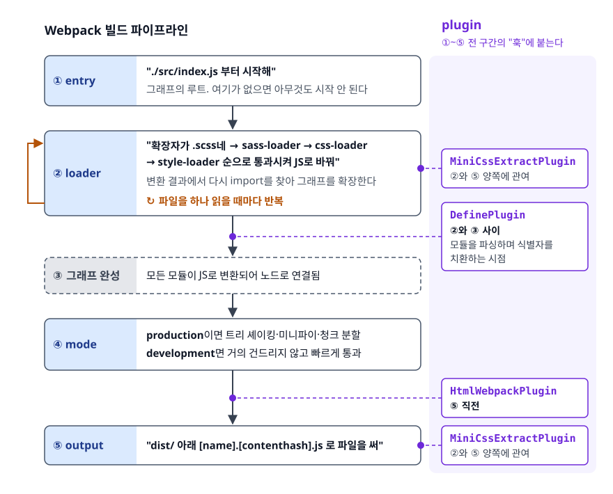
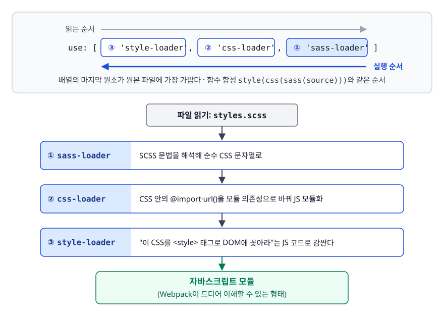
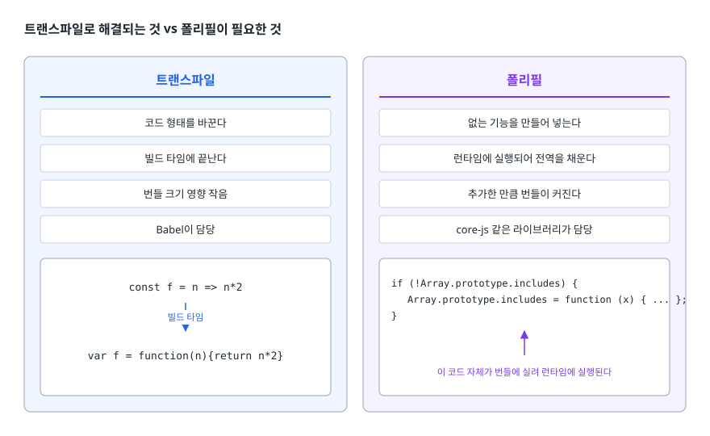

# Webpack과 Babel (Webpack & Babel)

> Webpack 설정 파일의 다섯 덩어리가 빌드 파이프라인의 어느 시점에 관여하는지, loader와 plugin이 왜 별개의 개념인지, 그리고 Babel이 문법은 바꿔주지만 폴리필은 왜 따로 챙겨야 하는지 설명할 수 있게 된다.

## 학습 목표

- [ ] entry / output / loader / plugin / mode가 빌드 과정의 어느 단계에서 동작하는지 순서대로 말할 수 있다
- [ ] loader와 plugin의 역할 차이를 근거와 함께 구분할 수 있다
- [ ] loader 체인의 실행 순서를 읽고 잘못된 순서를 지적할 수 있다
- [ ] 트랜스파일로 해결되는 것과 폴리필이 필요한 것을 구분할 수 있다
- [ ] browserslist가 어떤 도구들에 공유되는지 설명할 수 있다
- [ ] 개발용 소스맵과 프로덕션용 소스맵을 다르게 골라야 하는 이유를 안다

## 선행 지식

- [01-module-bundling.md](./01-module-bundling.md) — 의존성 그래프와 번들링의 개념

---

## 1. 왜 설정이 필요한가

번들러가 의존성 그래프를 만들어 파일을 합친다는 것까지는 앞 문서에서 봤다. 그런데 현실의 프로젝트에는 그래프에 그대로 넣을 수 없는 것들이 섞여 있다.

```js
import App from './App.tsx';        // Webpack은 TypeScript를 모른다
import './styles.scss';             // SCSS도 모른다
import logo from './logo.png';      // 이미지는 자바스크립트가 아니다
```

Webpack이 기본적으로 이해하는 것은 자바스크립트와 JSON뿐이다. 나머지는 **"이 확장자를 만나면 이 도구로 자바스크립트가 이해할 수 있는 형태로 바꿔라"**를 사람이 알려줘야 한다. 그것이 loader다.

빌드 결과물에도 요구사항이 붙는다. HTML에 번들 스크립트 태그를 자동으로 넣어달라, 이전 산출물을 지워달라, CSS는 JS에 넣지 말고 별도 파일로 뽑아달라. 이건 파일 하나를 변환하는 일이 아니라 **빌드 전체 흐름에 끼어드는 일**이라 plugin이 맡는다. `webpack.config.js`는 이 요구사항들을 적어두는 명세서다.

---

## 2. 다섯 덩어리와 각각의 타이밍

빌드가 진행되는 순서 위에 다섯 개념을 얹어보면 관계가 한눈에 들어온다.

<!-- diagram:fe-webpack-babel-1 -->


<!-- 위 그림이 대체한 원본 ASCII.
     내용을 고칠 때는 그림도 함께 갱신할 것.
```
┌────────────────────── Webpack 빌드 파이프라인 ──────────────────────┐
│                                                                     │
│  ① entry     "./src/index.js 부터 시작해"                           │
│              그래프의 루트. 여기가 없으면 아무것도 시작 안 된다      │
│                    ↓                                                │
│  ② loader    "확장자가 .scss네 → sass-loader → css-loader           │
│               → style-loader 순으로 통과시켜 JS로 바꿔"              │
│              변환 결과에서 다시 import를 찾아 그래프를 확장한다      │
│              ← 파일을 하나 읽을 때마다 반복 ─────────────────┐       │
│                    ↓                                        │       │
│  ③ 그래프 완성 — 모든 모듈이 JS로 변환되어 노드로 연결됨 ────┘       │
│                    ↓                                                │
│  ④ mode      production이면 트리 쉐이킹·미니파이·청크 분할          │
│              development면 거의 건드리지 않고 빠르게 통과            │
│                    ↓                                                │
│  ⑤ output    "dist/ 아래 [name].[contenthash].js 로 파일을 써"      │
│                                                                     │
└─────────────────────────────────────────────────────────────────────┘

  ★ plugin은 ①~⑤ 전 구간의 "훅"에 붙는다.
    HtmlWebpackPlugin은 ⑤ 직전에,
    DefinePlugin은 ②와 ③ 사이(모듈을 파싱하며 식별자를 치환하는 시점)에,
    MiniCssExtractPlugin은 ②와 ⑤ 양쪽에 관여한다.
```
-->

### entry와 output — 그래프의 시작과 끝

```js
entry: {                                 // 진입점이 둘이면 산출물도 둘로 나뉜다
  main: './src/index.js',
  admin: './src/admin.js',
},
output: {
  path: path.resolve(__dirname, 'dist'), // 절대 경로여야 한다
  filename: '[name].[contenthash].js',   // 캐싱을 위한 해시
  publicPath: '/static/',                // 런타임에 청크를 요청할 때의 URL 접두사
  clean: true,                           // 빌드 전에 dist 비우기
},
```

다중 진입점은 서로 완전히 독립적인 페이지가 있을 때 쓰고, 요즘 SPA에서는 진입점 하나에 동적 `import()`로 나누는 쪽이 일반적이다. `[contenthash]`는 파일 내용이 바뀔 때만 값이 바뀌는 해시로 캐싱 전략의 핵심이라 [03번 문서](./03-tree-shaking-optimization.md)에서 다룬다. `publicPath`는 동적 청크를 어느 URL에서 가져올지 결정하므로, CDN을 쓰거나 앱이 서브 경로에 배포될 때 반드시 맞춰줘야 한다.

### mode — 한 줄로 수십 개 설정이 바뀐다

```js
mode: 'production',   // 'development' | 'production' | 'none'
```

`mode`는 단순한 라벨이 아니라 **여러 기본값을 한꺼번에 갈아끼우는 스위치**다.

| | `development` | `production` |
|---|---|---|
| 코드 압축 | 하지 않음 | Terser로 공백 제거·변수명 축약 |
| 트리 쉐이킹 | 사실상 비활성 | 활성 |
| `process.env.NODE_ENV` | `'development'`로 치환 | `'production'`으로 치환 |
| 모듈 ID | 사람이 읽을 수 있는 경로 기반 | 짧고 결정적인 값 |
| 기본 소스맵 | `eval` | 없음 |
| 빌드 속도 | 빠름 | 느림 |

> 결론: **개발 중엔 `development`, 배포용 빌드만 `production`.** 로컬에서 프로덕션 빌드를 돌리면 매번 압축까지 하느라 개발 리듬이 깨지고, 배포에 `development`가 섞이면 번들이 몇 배로 커진다.

세 번째 행이 특히 중요하다. React를 포함한 많은 라이브러리가 `if (process.env.NODE_ENV !== 'production') { 개발용 경고 }` 형태로 작성돼 있다. 이 값이 문자열 `'production'`으로 치환되면 조건이 항상 거짓이 되고, 미니파이 단계에서 그 블록이 통째로 제거된다.

---

## 3. loader와 plugin은 왜 별개인가

### 비유: 공장 라인

loader는 컨베이어 벨트 위의 **가공 기계**다. 부품이 하나 지나갈 때마다 깎고, 도색하고, 다음 기계로 넘긴다. 기계는 자기 앞에 놓인 부품 하나만 본다. plugin은 **공장 관리자**다. "오늘 생산분 전체를 검수해라", "완성품을 포장 상자에 넣어라", "라인을 돌리기 전에 어제 잔여물을 치워라" 같은, 개별 부품이 아니라 공정 전체에 대한 지시를 내린다.

> **비유의 한계**: 경계가 칼같지는 않다. loader도 부가 파일을 만들어낼 수 있는 API를 갖고 있고, plugin도 특정 모듈 하나만 건드릴 수 있다. "loader는 파일 단위 변환기, plugin은 빌드 전체에 개입"이라는 것은 **가장 자연스러운 사용법**이지 물리적 제약이 아니다.

### 코드로 보는 차이

loader는 문자열을 받아 문자열을 돌려주는 함수다.

```js
// my-loader.js — 개념 확인용 최소 loader
module.exports = function (source) {   // source: 이 파일의 원본 내용(문자열)
  return source.replace(/__BUILD_TIME__/g, JSON.stringify(new Date().toISOString()));
};                                     // 반환값: 다음 loader에게 넘길 내용
```

plugin은 `apply(compiler)` 메서드를 가진 객체다. 컴파일러가 제공하는 훅에 콜백을 등록한다.

```js
// my-plugin.js — 개념 확인용 최소 plugin (Webpack 5 기준)
class BuildReportPlugin {
  apply(compiler) {
    const { RawSource } = compiler.webpack.sources;   // Webpack 5가 직접 제공한다
    compiler.hooks.emit.tap('BuildReportPlugin', (compilation) => {
      const report = Object.keys(compilation.assets).join('\n');  // 산출물 전체
      compilation.emitAsset('build-report.txt', new RawSource(report));
    });
  }
}
```

loader는 자기가 맡은 파일 하나만 알지만, plugin은 `compilation`을 통해 **이번 빌드의 모든 모듈과 산출물**에 접근한다. 이것이 둘을 나눈 진짜 이유다.

### loader 체인은 오른쪽에서 왼쪽으로

```js
{ test: /\.scss$/, use: ['style-loader', 'css-loader', 'sass-loader'] }
```

읽는 순서와 실행 순서가 반대라 처음엔 헷갈린다.

<!-- diagram:fe-webpack-babel-2 -->


<!-- 위 그림이 대체한 원본 ASCII.
     내용을 고칠 때는 그림도 함께 갱신할 것.
```
파일 읽기: styles.scss
   ↓  sass-loader     SCSS 문법을 해석해 순수 CSS 문자열로
   ↓  css-loader      CSS 안의 @import·url()을 모듈 의존성으로 바꿔 JS 모듈화
   ↓  style-loader    "이 CSS를 <style> 태그로 DOM에 꽂아라"는 JS 코드로 감싼다
   ↓
자바스크립트 모듈 (Webpack이 드디어 이해할 수 있는 형태)
```
-->

배열의 **마지막 원소가 원본 파일에 가장 가깝다**고 기억하면 된다. 함수 합성 `style(css(sass(source)))`와 같은 순서다.

### 안티패턴: 체인 순서를 뒤집기

```js
// 안티패턴
{ test: /\.css$/, use: ['css-loader', 'style-loader'] }
```

**왜 문제인가**: `style-loader`가 먼저 실행되어 아직 CSS 문자열인 것을 "DOM에 주입하는 JS 코드"로 감싼다. 그다음 `css-loader`가 그 자바스크립트를 CSS인 줄 알고 파싱하려다 문법 오류를 낸다. 흔히 `Unexpected token` 계열의 에러 메시지가 원본 CSS와 아무 상관 없는 위치를 가리켜 원인 파악이 헷갈린다.

```js
// 개선 — 원본에 가까운 쪽을 오른쪽에
{ test: /\.css$/, use: ['style-loader', 'css-loader'] }
```

### 안티패턴: `node_modules`를 트랜스파일 대상에 포함

```js
// 안티패턴
{
  test: /\.jsx?$/,
  use: 'babel-loader',
}
```

**왜 문제인가**: `exclude`가 없으니 `node_modules` 안의 수만 개 파일까지 전부 Babel을 통과한다. 대부분의 npm 패키지는 이미 배포 전에 트랜스파일을 마친 상태라 다시 변환할 이유가 없다. 빌드 시간이 몇 배로 늘어난다.

```js
// 개선
{
  test: /\.jsx?$/,
  exclude: /node_modules/,
  use: {
    loader: 'babel-loader',
    options: { cacheDirectory: true },   // 변환 결과를 캐시해 재빌드를 앞당긴다
  },
}
```

단, 특정 패키지가 최신 문법을 그대로 배포해 구형 브라우저에서 깨진다면 그 패키지만 예외로 통과시켜야 한다. `exclude` 정규식에서 해당 경로를 빼거나, `include`에 `src`와 그 패키지 경로를 함께 나열하는 방식을 쓴다.

---

## 4. 설정 파일 읽어보기

```js
// webpack.config.js
const path = require('path');
const HtmlWebpackPlugin = require('html-webpack-plugin');
const MiniCssExtractPlugin = require('mini-css-extract-plugin');

const isProd = process.env.NODE_ENV === 'production';

module.exports = {
  mode: isProd ? 'production' : 'development',
  entry: './src/index.js',

  output: {
    path: path.resolve(__dirname, 'dist'),
    filename: isProd ? '[name].[contenthash].js' : '[name].js',
    clean: true,
  },

  resolve: {
    extensions: ['.js', '.jsx', '.ts', '.tsx'],   // import 시 확장자 생략 허용
    alias: { '@': path.resolve(__dirname, 'src') },  // import x from '@/utils'
  },

  module: {
    rules: [
      { test: /\.[jt]sx?$/, exclude: /node_modules/,
        use: { loader: 'babel-loader', options: { cacheDirectory: true } } },
      // 개발은 style-loader로 HMR을 살리고, 배포는 별도 CSS 파일로 뽑는다
      { test: /\.css$/,
        use: [isProd ? MiniCssExtractPlugin.loader : 'style-loader', 'css-loader'] },
      // type: 'asset'은 Webpack 5 내장. file-loader/url-loader가 필요 없다
      { test: /\.(png|jpe?g|gif|svg|woff2?)$/, type: 'asset' },
    ],
  },

  plugins: [
    new HtmlWebpackPlugin({ template: './public/index.html' }),
    ...(isProd ? [new MiniCssExtractPlugin({ filename: '[name].[contenthash].css' })] : []),
  ],

  devtool: isProd ? 'source-map' : 'eval-source-map',
};
```

몇 군데를 짚어두자.

- `resolve.extensions`는 `import App from './App'`처럼 확장자를 생략했을 때 시도할 목록이고 순서가 곧 우선순위다. 무한정 늘리면 파일을 찾는 시도가 늘어 빌드가 느려진다. `type: 'asset'`은 Webpack 5의 에셋 모듈로, 파일 크기에 따라 Base64 인라인(`asset/inline`)과 별도 파일 복사(`asset/resource`)를 자동으로 고른다.
- CSS 처리가 모드에 따라 갈리는 이유는 목적이 다르기 때문이다. 개발 중에는 `style-loader`가 JS로 스타일을 주입해야 HMR로 CSS만 즉시 교체할 수 있다. 배포에서는 CSS가 JS 안에 들어 있으면 JS를 다 파싱해야 스타일이 적용되어 화면이 늦게 그려지므로, 별도 `.css` 파일로 뽑아 `<link>`로 병렬 로드한다.

---

## 5. Babel: 문법을 바꾸는 것과 없는 기능을 채우는 것

### 왜 필요한가

```js
const users = data?.result?.users ?? [];
```

옵셔널 체이닝과 널 병합 연산자다. 이 문법을 모르는 구형 엔진에 그대로 보내면 **파싱 단계에서 통째로 실패한다.** 한 줄 때문에 페이지 전체가 하얗게 뜬다. Babel은 이 코드를 오래된 문법만 써서 같은 동작을 하는 코드로 바꿔준다.

이렇게 **한 소스 코드를 비슷한 추상화 수준의 다른 소스 코드로 바꾸는 것**을 트랜스파일(transpile)이라 한다. `javac`가 자바 소스를 바이트코드라는 더 낮은 추상화 수준으로 내리는 컴파일과는 결과물의 성격이 다르다. Babel의 출력은 여전히 사람이 읽을 수 있는 자바스크립트다.

### 트랜스파일로 해결되는 것 vs 폴리필이 필요한 것

여기가 실무에서 가장 많이 헷갈리는 지점이다.

```js
// (A) 문법(syntax)  — 트랜스파일로 해결된다
const double = (n) => n * 2;              // 화살표 함수
const { a, ...rest } = obj;               // 구조 분해, 나머지 프로퍼티
class Foo extends Bar {}                  // 클래스
const x = data?.value ?? 0;               // 옵셔널 체이닝, 널 병합

// (B) 런타임 API   — 트랜스파일로 만들 수 없다
new Promise((resolve) => resolve());      // Promise 객체 자체가 없는 엔진
[1, 2, 3].includes(2);                    // Array.prototype.includes
Object.entries(obj);                      // Object.entries
new Map(); new Set(); fetch('/api');
```

(A)는 **문법 규칙**이므로 파서가 읽어서 다른 형태로 다시 쓸 수 있다. 화살표 함수를 `function` 표현식으로 바꾸면 끝이다.

(B)는 **엔진이 미리 만들어둔 객체와 메서드**다. 코드 형태를 아무리 바꿔도 없는 `Promise` 생성자가 생겨나지는 않는다. 이건 **직접 구현한 코드를 실행 시점에 전역에 심어주는 수밖에 없고**, 그 코드를 폴리필(polyfill)이라 부른다. 자바스크립트로 작성된 폴리필 모음이 `core-js`다.

<!-- diagram:fe-webpack-babel-3 -->


<!-- 위 그림이 대체한 원본 ASCII.
     내용을 고칠 때는 그림도 함께 갱신할 것.
```
  트랜스파일                      폴리필
  ─────────────                   ────────────
  코드 형태를 바꾼다               없는 기능을 만들어 넣는다
  빌드 타임에 끝난다               런타임에 실행되어 전역을 채운다
  번들 크기 영향 작음              추가한 만큼 번들이 커진다
  Babel이 담당                    core-js 같은 라이브러리가 담당

  const f = n => n*2               if (!Array.prototype.includes) {
        ↓ 빌드 타임                     Array.prototype.includes = function (x) { ... };
  var f = function(n){return n*2}  }
                                   ↑ 이 코드 자체가 번들에 실려 런타임에 실행된다
```
-->

### preset-env와 targets

Babel의 변환 규칙 하나하나는 플러그인이다. 필요한 플러그인을 수십 개 나열하는 대신 묶음으로 제공하는 것이 프리셋이다.

| 프리셋 | 하는 일 |
|--------|---------|
| `@babel/preset-env` | 지정한 브라우저 범위에 맞춰 필요한 문법 변환만 골라 적용 |
| `@babel/preset-react` | JSX를 함수 호출로 변환 |
| `@babel/preset-typescript` | 타입 표기를 제거. **타입 검사는 하지 않는다** |

`preset-env`의 핵심은 "필요한 변환만"이다. 지원 대상 브라우저가 이미 화살표 함수를 이해한다면 굳이 `function`으로 되돌릴 이유가 없다. 그 판단 기준을 `targets`로 준다.

```json
// babel.config.json
{
  "presets": [
    ["@babel/preset-env", {
      "targets": "> 0.5%, last 2 versions, not dead",
      "useBuiltIns": "usage",
      "corejs": 3
    }],
    ["@babel/preset-react", { "runtime": "automatic" }]
  ]
}
```

`useBuiltIns: "usage"`가 폴리필 문제의 답이다. Babel이 각 파일을 훑어서 **실제로 쓰인 API 중 targets에 없는 것만** `core-js` import를 자동으로 넣어준다. `Promise`를 쓴 파일에만 Promise 폴리필이 들어가는 식이다. 이 옵션을 쓰려면 `core-js`가 의존성으로 설치돼 있어야 한다.

### 안티패턴: 폴리필을 통째로 import

```js
// 안티패턴 — src/index.js 맨 위
import 'core-js';
import 'regenerator-runtime/runtime';
```

**왜 문제인가**: `useBuiltIns`를 지정하지 않은 기본 상태(`false`)에서 이 import는 `core-js` 전체를 통째로 끌어온다. 최신 브라우저만 쓰는 사용자에게도 필요 없는 폴리필까지 전부 전달되고, 번들은 커지는데 그 코드 대부분은 한 번도 실행되지 않는다. `targets`를 좁게 잡아도 import 자체는 줄어들지 않는다.

```json
// 개선 — 설정에 맡긴다
{
  "presets": [
    ["@babel/preset-env", { "useBuiltIns": "usage", "corejs": 3 }]
  ]
}
```

`useBuiltIns`에는 `"entry"`라는 중간 선택지도 있다. 이 값을 주면 Babel이 위의 `import 'core-js'` 한 줄을 targets에 없는 폴리필 import 목록으로 바꿔준다. 다만 기준이 "이 브라우저에 없는 것 전부"라서, "코드에서 실제로 쓴 것만" 넣는 `usage`보다 결과가 크다. 애플리케이션은 대개 `usage`가 낫고, 폴리필 진입 지점을 한 파일로 명시하고 싶을 때 `entry`를 고른다.

라이브러리를 만들어 배포하는 경우라면 이야기가 또 다르다. `useBuiltIns: "usage"`는 전역 객체를 수정하는 폴리필을 심으므로, 라이브러리가 사용자의 전역 환경을 오염시키게 된다. 이럴 땐 `@babel/plugin-transform-runtime`을 써서 전역을 건드리지 않는 격리된 형태로 헬퍼와 폴리필을 참조하게 만든다.

### browserslist — 여러 도구가 공유하는 하나의 기준

`targets`를 Babel 설정에만 적어두면, CSS 벤더 프리픽스를 붙이는 Autoprefixer는 그 정보를 모른다. 그래서 브라우저 지원 범위를 **한 곳에 적고 여러 도구가 같이 읽는** 규약이 생겼다.

```json
// package.json
{
  "browserslist": ["> 0.5%", "last 2 versions", "not dead"]
}
```

또는 프로젝트 루트에 `.browserslistrc` 파일로 둔다. 이 값을 `@babel/preset-env`, Autoprefixer, postcss-preset-env 등이 함께 읽는다. Babel 설정에 `targets`가 따로 있으면 그쪽이 우선하므로, **특별한 이유가 없으면 `targets`를 지우고 browserslist 하나로 통일**하는 편이 관리하기 쉽다.

지원 범위를 넓게 잡을수록 변환과 폴리필이 늘어 번들이 커진다. 실제 서비스의 사용자 브라우저 통계를 확인하고 정하는 것이지, 관행적으로 복사해 쓸 값이 아니다.

### Babel vs tsc vs esbuild/SWC

| | 문법 변환 | 타입 검사 | 폴리필 주입 | 속도 |
|---|---|---|---|---|
| Babel | 가능 | 하지 않음 | `preset-env`가 자동 주입 | 보통 |
| `tsc` | 가능 | **한다** | 하지 않음 | 느림 |
| esbuild / SWC | 가능 | 하지 않음 | esbuild는 없음. SWC는 core-js 연동 옵션 제공 | 매우 빠름 |

> 결론: **타입 검사와 코드 변환을 분리하는 것**이 요즘 표준 조합이다. 빌드 파이프라인에서는 esbuild나 SWC로 타입만 떼어내고 빠르게 변환하고, 타입 검사는 `tsc --noEmit`을 별도 스크립트나 CI 단계에서 돌린다. 이렇게 하면 개발 중 빌드는 빠르면서 타입 안전성은 유지된다. 다만 폴리필이 필요한 구형 브라우저를 지원해야 한다면 Babel + core-js 조합이 여전히 필요하다.

---

## 6. 소스맵 — 압축된 코드에서 원본을 찾아가기

프로덕션 번들은 미니파이를 거쳐 변수명이 `a`, `b`로 바뀌고 줄바꿈도 사라진다. 이 상태에서 에러가 나면 스택 트레이스가 `bundle.js:1:24815`를 가리킨다. 아무 정보가 없다.

소스맵(source map)은 **변환된 코드의 위치와 원본 코드의 위치를 대응시킨 별도 파일**이다. 번들 끝에 `//# sourceMappingURL=bundle.js.map` 주석이 붙어 있으면, 브라우저 개발자 도구가 그 파일을 읽어 원본 파일과 줄 번호를 복원해 보여준다.

Webpack에서는 `devtool` 한 줄로 고른다. 조합이 많은데, 실무에서 쓰는 것은 몇 개뿐이다.

| 값 | 언제 | 특징 |
|---|---|---|
| `eval-source-map` | 개발 | 원본 그대로 복원. 초기 빌드는 느리지만 재빌드가 빠르다 |
| `eval-cheap-module-source-map` | 개발(대형 프로젝트) | 열 정보를 생략해 더 빠르다. 줄 단위까지만 정확 |
| `source-map` | 배포 | 완전한 별도 `.map` 파일 생성 |
| `hidden-source-map` | 배포 | `.map`은 만들되 **참조 주석을 넣지 않는다** |

`hidden-source-map`이 왜 있는지가 포인트다. 프로덕션에 `source-map`을 그대로 올리면 누구나 개발자 도구를 열어 **원본 소스 전체를 읽을 수 있다.** 내부 API 구조나 주석까지 노출된다. 그래서 소스맵 파일 자체는 만들되 공개 서버에는 올리지 않고 Sentry 같은 에러 추적 서비스에만 업로드하는 방식을 쓴다. 그러면 배포된 번들에는 참조 주석이 없어 사용자는 볼 수 없고, 에러 리포트에서는 원본 위치로 복원된다.

---

## 7. 실무에서는

- **설정 파일을 직접 쓰는 일이 많이 줄었다.** Next.js는 Webpack 설정을 감싸두고 필요한 부분만 열어주며, Vite는 Rollup 설정을 추상화한다. 그래도 개념을 알아야 하는 이유는, 빌드가 깨졌을 때 에러 메시지가 여전히 loader와 plugin의 언어로 나오기 때문이다.
- **`babel-loader` 대신 `swc-loader`나 `esbuild-loader`로 갈아타는 사례가 흔하다.** 문법 변환만 필요하다면 체감할 만큼 빨라진다. 다만 `preset-env`의 `useBuiltIns` 같은 폴리필 자동 주입은 그대로 대체되지 않으므로 구형 브라우저 지원 범위를 먼저 확인해야 한다.
- **`@babel/preset-typescript`가 타입 검사를 하지 않는 탓에 사고가 난다.** 빌드는 멀쩡히 통과하는데 타입 에러가 런타임 버그로 드러난다. CI에 `tsc --noEmit`을 별도 단계로 반드시 넣는다. 배포 번들이 예상보다 크다면 `mode: 'production'`이 제대로 적용됐는지부터 확인하는 것이 순서다.

---

## 8. 면접 포인트

> 면접에서 이 주제가 나오면 이렇게 답한다

**Q. loader와 plugin의 차이를 설명해주세요.**
A. loader는 **모듈 하나를 변환하는 함수**입니다. 파일 내용을 문자열로 받아 변환된 문자열을 반환하고, Webpack이 이해하지 못하는 SCSS·TypeScript·이미지를 자바스크립트 모듈로 바꾸는 데 씁니다. 여러 개를 배열로 지정하면 오른쪽에서 왼쪽으로 체이닝됩니다. plugin은 **빌드 과정 전체의 훅에 붙는 객체**입니다. `apply(compiler)`로 훅을 등록하고 `compilation`을 통해 이번 빌드의 모든 산출물에 접근할 수 있어서, HTML 생성이나 CSS 추출처럼 개별 파일 변환으로는 불가능한 일을 합니다.
- 꼬리 질문: "`MiniCssExtractPlugin`은 왜 plugin이면서 loader도 제공하나요?" → CSS를 모으는 것은 파일 단위 작업이라 loader가, 모은 것을 별도 `.css` 파일로 내보내는 것은 산출물 전체를 다루는 작업이라 plugin이 맡기 때문이라고 답한다.

**Q. Babel만 쓰면 구형 브라우저 지원이 끝나나요?**
A. 아닙니다. Babel이 해결하는 것은 **문법**입니다. 화살표 함수나 옵셔널 체이닝처럼 파서가 못 읽는 것을 다른 형태로 다시 써주는 거죠. 반면 `Promise`, `Array.prototype.includes`, `Map` 같은 **런타임 API**는 코드 형태를 바꿔서 만들어낼 수 없으므로, 직접 구현한 코드를 전역에 심는 폴리필이 따로 필요합니다. `core-js`가 그 역할을 하고, `@babel/preset-env`의 `useBuiltIns: "usage"` 옵션을 켜면 실제로 쓰인 API만 골라 자동으로 주입해줍니다.
- 꼬리 질문: "폴리필을 전부 import하면 안 되나요?" → 동작은 하지만 쓰지 않는 폴리필까지 전부 번들에 실린다. `usage`로 필요한 것만 넣는 것이 정석이고, 라이브러리라면 전역 오염을 피하려고 `plugin-transform-runtime`을 쓴다.

**Q. `mode: 'production'`을 설정하면 무엇이 달라지나요?**
A. 여러 기본값이 한 번에 바뀝니다. Terser로 코드가 압축되고, 트리 쉐이킹이 활성화되고, 모듈 ID가 짧고 결정적인 값으로 바뀝니다. 그중에서도 실무 영향이 큰 것은 `process.env.NODE_ENV`가 문자열 `'production'`으로 치환되는 부분입니다. React처럼 개발용 경고를 `NODE_ENV` 조건문으로 감싼 라이브러리가 많은데, 치환된 뒤 미니파이 단계에서 그 블록이 통째로 제거되면서 번들이 눈에 띄게 줄어듭니다.

**Q. 프로덕션에 소스맵을 올려도 되나요?**
A. `source-map`을 그대로 배포하면 누구나 개발자 도구에서 원본 소스 전체를 읽을 수 있어서, 내부 로직과 주석이 노출됩니다. 그래서 `hidden-source-map`을 씁니다. 소스맵 파일은 생성하되 번들에 참조 주석을 넣지 않아 브라우저는 찾지 못하고, 그 파일은 Sentry 같은 에러 추적 서비스에만 따로 업로드해서 스택 트레이스를 원본 위치로 복원합니다.

---

## 자주 하는 실수

| 실수 | 왜 틀렸나 | 올바른 이해 |
|------|----------|-----------|
| "loader 배열은 왼쪽부터 실행된다" | 함수 합성처럼 오른쪽(마지막 원소)이 먼저 원본을 받는다 | `['style-loader', 'css-loader']`는 `css-loader`가 먼저 |
| "Babel이 `Promise`도 만들어준다" | 문법 변환으로 없는 전역 객체를 만들 수는 없다 | 런타임 API는 core-js 같은 폴리필의 영역 |
| "`@babel/preset-typescript`가 타입을 검사한다" | 타입 표기를 제거만 한다 | 검사는 `tsc --noEmit`으로 따로 돌려야 한다 |
| "`mode`는 로그 상세도를 정하는 옵션" | 압축·트리 쉐이킹·모듈 ID·`NODE_ENV` 치환을 한꺼번에 바꾼다 | 빌드 결과물 자체가 달라지는 스위치 |
| "browserslist는 Babel 전용 설정" | Autoprefixer 등 여러 도구가 함께 읽는 공용 규약이다 | 한 곳에 적고 도구들이 공유하게 두는 것이 목적 |
| "소스맵은 개발 편의 기능이라 배포엔 불필요" | 프로덕션 에러 추적에 필수다 | 노출이 걱정되면 `hidden-source-map`으로 분리 배포 |

---

## 한 줄 정리

Webpack 설정의 다섯 덩어리는 "어디서 시작해(entry) → 파일마다 무엇으로 바꿔(loader) → 전 과정에 무엇을 끼워 넣고(plugin) → 얼마나 최적화해서(mode) → 어디에 쓸지(output)"의 순서이고, Babel은 그 파이프라인 안에서 문법만 책임지므로 런타임 API는 폴리필로 따로 채워야 한다.

---

## 연관 개념

- [01-module-bundling.md](./01-module-bundling.md) - Webpack이 만드는 의존성 그래프와 코드 스플리팅의 원리
- [03-tree-shaking-optimization.md](./03-tree-shaking-optimization.md) - `mode: 'production'`이 켜는 최적화의 내부 동작
- [qna-build-tools.md](./qna-build-tools.md) - Webpack·Babel 관련 면접 질문(Q2, Q3, Q4)
- [../typescript/qna-typescript.md](../typescript/qna-typescript.md) - `tsc`의 타입 검사와 Babel의 타입 제거가 갈리는 지점
- [../react-architecture/01-virtual-dom.md](../react-architecture/01-virtual-dom.md) - `preset-react`가 JSX를 무엇으로 변환하는지
