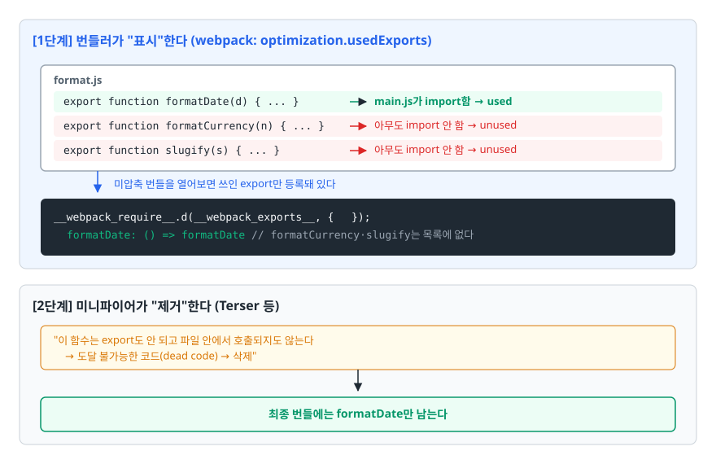
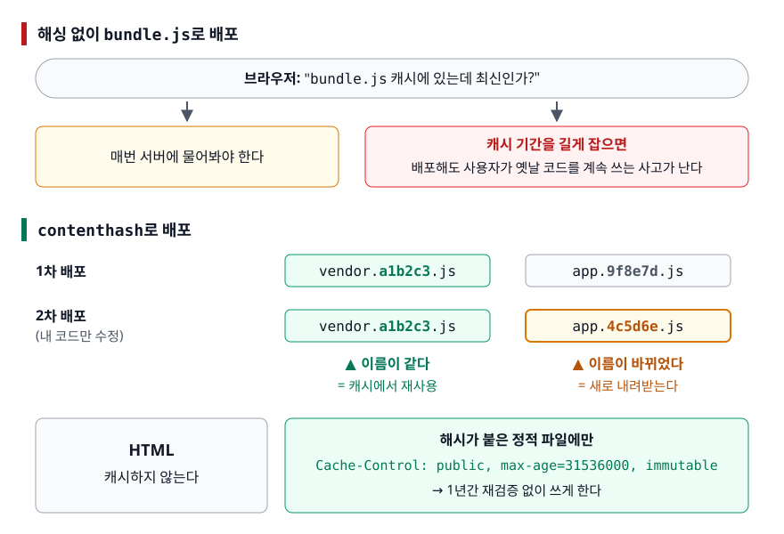
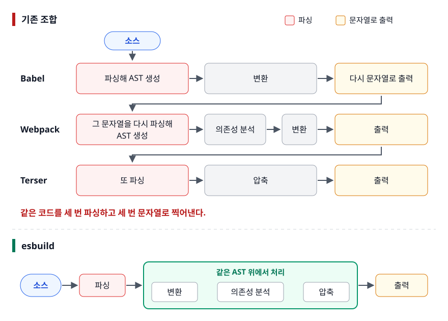
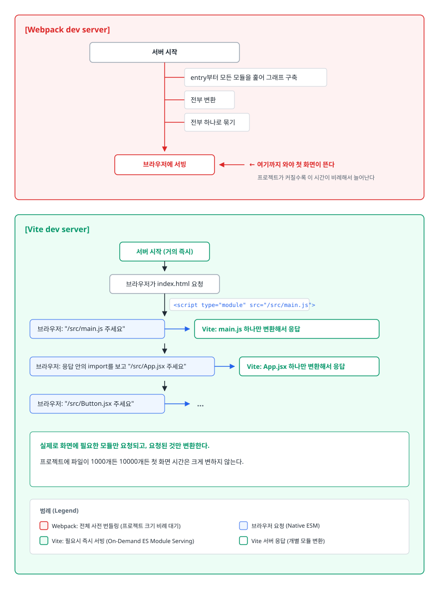

# 트리 셰이킹과 번들 최적화 (Tree Shaking & Bundle Optimization)

> ESM만 쓰면 트리 셰이킹이 알아서 될까요? 번들이 왜 커졌는지는 어떻게 재고, esbuild·SWC 기반 도구는 무엇 때문에 빠를까요? 이 문서가 트리 셰이킹의 성립 조건, 번들 크기 측정법, 그 도구들이 빠른 이유를 차례로 다룹니다.

## 학습 목표

- [ ] 트리 셰이킹이 "표시"와 "제거" 두 단계로 나뉜다는 것을 설명할 수 있다
- [ ] 트리 셰이킹이 안 되는 흔한 원인 네 가지를 코드로 지적할 수 있다
- [ ] `sideEffects` 플래그를 잘못 설정했을 때 생기는 버그를 예측할 수 있다
- [ ] 번들이 커진 원인을 분석 도구로 추적하는 절차를 안다
- [ ] 미니파이·압축·해싱·청크 분리가 각각 어느 층위의 최적화인지 구분할 수 있다
- [ ] Vite의 개발 서버 전략이 기존 번들러와 무엇이 다른지 그림으로 설명할 수 있다

## 선행 지식

- [01-module-bundling.md](./01-module-bundling.md) - ESM의 정적 구조와 의존성 그래프
- [02-webpack-babel.md](./02-webpack-babel.md) - `mode`, `output.filename`, loader 설정

---

## 1. 왜 필요한가

번들 크기가 문제인 이유는 단순히 "다운로드가 느려서"가 아닙니다. 자바스크립트는 내려받은 뒤에도 **파싱하고 컴파일하고 실행하는 시간**이 듭니다. 이미지 1MB와 자바스크립트 1MB는 전송 시간은 비슷해도 사용자가 체감하는 지연은 다릅니다. 이미지는 늦게 뜨면 그냥 늦게 보이지만, 자바스크립트는 메인 스레드를 붙잡고 있어 그동안 화면이 아예 반응하지 않습니다.

그런데 번들에 들어간 코드 전부가 실제로 필요한 것도 아닙니다. 유틸리티 라이브러리에서 함수 하나만 쓰는데 라이브러리 전체가 실려 있고, 지원할 필요 없는 브라우저용 폴리필이 들어 있고, 같은 패키지가 버전이 달라 두 벌 들어 있기도 합니다. **쓰지 않는 코드를 찾아 지우는 것**이 최적화의 출발점이고, 그것이 트리 셰이킹입니다.

---

## 2. 트리 셰이킹은 두 단계로 일어난다

이름은 의존성 그래프를 나무로 보고, 줄기를 흔들어 붙어 있지 않은 잎을 털어낸다는 이미지에서 왔습니다. 흔히 "번들러가 안 쓰는 코드를 지운다"고 뭉뚱그려 설명하는데, 실제로는 **역할이 다른 두 도구가 나눠서** 합니다.

<!-- diagram:fe-tree-shaking-optimization-1 -->


<!-- 위 그림이 대체한 원본 ASCII.
     내용을 고칠 때는 그림도 함께 갱신할 것.
```
[1단계] 번들러가 "표시"한다 (webpack: optimization.usedExports)

  format.js
  ┌────────────────────────────────────────────┐
  │ export function formatDate(d)     { ... }  │ ← main.js가 import함 → used
  │ export function formatCurrency(n) { ... }  │ ← 아무도 import 안 함 → unused
  │ export function slugify(s)        { ... }  │ ← 아무도 import 안 함 → unused
  └────────────────────────────────────────────┘
         ↓  미압축 번들을 열어보면 쓰인 export만 등록돼 있다
     __webpack_require__.d(__webpack_exports__, {
       formatDate: () => formatDate       // formatCurrency·slugify는 목록에 없다
     });

[2단계] 미니파이어가 "제거"한다 (Terser 등)

  "이 함수는 export도 안 되고 파일 안에서 호출되지도 않는다
   → 도달 불가능한 코드(dead code) → 삭제"
         ↓
  최종 번들에는 formatDate만 남는다
```
-->

이 구분이 왜 중요하냐면, **`mode: 'development'`에서는 트리 셰이킹이 안 되는 것처럼 보이는 이유**가 여기 있기 때문입니다. 개발 모드에서는 `optimization.usedExports`가 기본으로 꺼져 있어 1단계 표시부터 일어나지 않고, 설령 켜더라도 미니파이어가 돌지 않으니 코드가 그대로 남습니다. "트리 셰이킹이 왜 안 되죠?"라고 묻기 전에 프로덕션 빌드로 확인하는 것이 먼저입니다.

### 전제 1: ESM의 정적 구조

1단계 표시가 가능한 이유는 ESM의 `import`/`export`가 문법 구조라 **코드를 실행하지 않고 파싱만으로 사용 관계를 확정할 수 있기 때문**입니다. CommonJS의 `require`는 함수 호출이라 조건에 따라 무엇이 로드될지 달라질 수 있고, `module.exports` 객체는 런타임에 프로퍼티가 추가될 수도 있습니다. 번들러는 "안 쓰는 것 같지만 확신할 수 없다"고 판단해 보수적으로 전부 남깁니다.

### 전제 2: 부수 효과가 없다는 확신

```js
// analytics.js
console.log('analytics 모듈이 로드되었습니다');   // 부수 효과
window.__tracker = createTracker();               // 부수 효과
export function trackClick() { /* ... */ }

// main.js
import './analytics.js';   // export를 하나도 안 가져온다
```

`main.js`가 `analytics.js`에서 아무것도 가져오지 않으니 지워도 될까? 지우면 트래커 초기화가 사라집니다. **모듈을 불러오는 행위 자체가 목적**인 경우가 있기 때문에, 번들러는 임의로 모듈을 통째로 날리지 못합니다. 이 판단을 도와주는 것이 `sideEffects` 플래그입니다.

---

## 3. 트리 셰이킹이 안 되는 흔한 이유

### 원인 1: 패키지가 CommonJS다

```js
// 안티패턴
import { debounce } from 'lodash';
```

**왜 문제인가**: `lodash` 패키지의 기본 진입점은 CommonJS입니다. 번들러는 정적 분석이 안 되니 라이브러리 전체를 번들에 넣습니다. `debounce` 함수 하나 쓰려고 수백 개의 유틸리티가 따라 들어옵니다. 문법이 `import`라고 해서 트리 셰이킹이 되는 게 아닙니다. **가져오는 대상이 ESM이어야** 합니다.

```js
// 개선 1 — ESM으로 배포된 별도 패키지를 쓴다
import { debounce } from 'lodash-es';

// 개선 2 — 필요한 모듈 파일만 직접 지정한다
import debounce from 'lodash/debounce';
```

새 프로젝트라면 애초에 ESM을 제공하는 라이브러리를 고르는 것이 낫습니다. 그래서 라이브러리 선택 기준에 "ESM 지원 여부"를 넣어야 합니다.

### 원인 2: Babel이 ESM을 CommonJS로 바꿔버린다

```json
// 안티패턴 — babel.config.json
{ "presets": [["@babel/preset-env", { "modules": "commonjs" }]] }
```

**왜 문제인가**: 이 설정은 Babel에게 "`import`/`export`를 `require`/`module.exports`로 바꿔라"라고 시킵니다. 번들러가 코드를 받아볼 때는 이미 CommonJS라서, 아무리 소스를 ESM으로 썼어도 정적 분석이 불가능해집니다. 트리 셰이킹이 통째로 무력화됩니다.

`@babel/preset-env`의 `modules` 기본값은 `"auto"`이고, `babel-loader`로 호출되면 "이 호출자는 ESM을 처리할 수 있다"는 신호를 받아 ESM을 그대로 둡니다. 즉 **가만히 두면 문제가 없는데, 누군가 명시적으로 `"commonjs"`를 적어 넣으면서 깨집니다.** 보통 Jest 같은 테스트 러너가 CommonJS를 요구해서 손을 대다가 발생합니다.

```json
// 개선 — 환경별로 분리한다
{
  "presets": [["@babel/preset-env", { "modules": false }]],
  "env": {
    "test": { "presets": [["@babel/preset-env", { "modules": "commonjs" }]] }
  }
}
```

### 원인 3: 배럴 파일(barrel file)

```js
// 안티패턴 — src/components/index.js
export * from './Button';
export * from './Modal';
export * from './RichTextEditor';   // 무거운 에디터 라이브러리에 의존
export * from './ChartPanel';       // 차트 라이브러리에 의존

// 사용하는 쪽
import { Button } from '@/components';
```

**왜 문제인가**: 버튼 하나를 가져왔을 뿐인데, 번들러는 `index.js` 모듈 전체를 평가해야 합니다. `sideEffects` 설정이 없으면 번들러는 "`RichTextEditor` 모듈을 건너뛰어도 안전한가?"를 확신하지 못하고, 안전한 쪽을 택해 전부 그래프에 포함시킵니다. 그 결과 에디터와 차트 라이브러리까지 번들에 들어옵니다.

```js
// 개선 1 — 배럴을 거치지 않고 직접 import
import { Button } from '@/components/Button';

// 개선 2 — 배럴을 유지해야 한다면 package.json에 sideEffects를 명시해
//         번들러가 안전하게 건너뛸 수 있게 해준다
```

배럴 파일은 import 문을 짧게 만들어주지만, 그 대가로 번들 크기와 빌드 시간을 지불합니다. 공용 디자인 시스템처럼 정말 필요한 곳에만 두고 나머지는 직접 경로를 쓰는 편이 안전합니다.

### 원인 4: `sideEffects`가 설정되지 않았다

`package.json`에 `sideEffects` 필드가 없으면 번들러는 **모든 파일이 부수 효과를 가질 수 있다**고 가정합니다. 위 배럴 파일 문제도 결국 여기서 나옵니다.

```json
// package.json
{ "sideEffects": false }
```

"이 패키지의 어떤 파일도 import만으로 부수 효과를 내지 않는다"는 선언입니다. 번들러는 이 약속을 믿고 사용되지 않는 모듈을 그래프에서 통째로 제외합니다.

### 정리

| 원인 | 증상 | 확인 방법 | 해결 |
|------|------|----------|------|
| CommonJS 패키지 | 라이브러리 전체가 번들에 포함 | 패키지의 `package.json`에 `"module"`/`"exports"` 필드가 있는지 확인 | ESM 빌드 사용 또는 서브 경로 import |
| Babel이 CJS로 변환 | 트리 셰이킹이 전혀 안 됨 | Babel 설정의 `modules` 값 확인 | `modules: false` 또는 기본값 유지 |
| 배럴 파일 | 안 쓰는 컴포넌트의 의존성이 딸려옴 | 번들 분석기에서 예상 밖 패키지 발견 | 직접 경로 import 또는 `sideEffects` 명시 |
| `sideEffects` 미설정 | 모듈 단위 제거가 안 됨 | `package.json` 확인 | `false` 또는 예외 배열 지정 |
| 개발 모드로 확인 | "안 지워지는데요?" | `mode` 값 확인 | 프로덕션 빌드로 측정 |

> 결론: **원인의 절반 이상이 "번들러가 아니라 그 앞단"에 있습니다.** 트리 셰이킹이 안 될 때 webpack 설정부터 뒤지지 말고, 소스가 번들러에 도달하는 시점에 여전히 ESM인지부터 확인하는 것이 순서입니다.

---

## 4. `sideEffects`를 잘못 설정하면

`"sideEffects": false`는 강력한 만큼 위험합니다. 약속을 어긴 파일이 하나라도 있으면 조용히 사라집니다.

```js
// 안티패턴 — package.json에 "sideEffects": false로 두고
// src/index.js
import './styles/global.css';      // 전역 스타일
import './polyfills';              // 폴리필 등록
import { App } from './App';
```

**왜 문제인가**: 두 import는 아무 값도 가져오지 않습니다. 번들러는 `sideEffects: false` 선언을 믿고 "쓰이지 않는 import"라고 판단해 모듈을 그래프에서 통째로 뺍니다. 이 모듈 단위 제거는 미니파이어가 아니라 번들러가 직접 하는 일이고, `optimization.sideEffects`는 **프로덕션 모드에서만 기본으로 켜집니다.** 그래서 **개발 서버에서는 스타일이 멀쩡히 보이다가 배포 빌드에서만 전역 CSS가 날아가고 폴리필이 빠집니다.** 재현 조건이 배포 빌드뿐이라 발견이 늦습니다.

```json
// 개선 — 부수 효과가 있는 파일을 예외로 지정한다
{ "sideEffects": ["*.css", "*.scss", "./src/polyfills.js"] }
```

배열에 적힌 패턴에 해당하는 파일은 "부수 효과가 있으니 함부로 지우지 마라"는 뜻이 됩니다. 나머지 파일은 여전히 적극적으로 제거합니다.

---

## 5. 번들이 왜 커졌는지 측정하기

추측으로 최적화하면 안 됩니다. 실제로 무엇이 자리를 차지하는지 먼저 봅니다.

```bash
npm install -D webpack-bundle-analyzer     # Webpack — 트리맵 시각화
npm install -D rollup-plugin-visualizer    # Vite / Rollup
npx source-map-explorer 'dist/**/*.js'     # 번들러 무관, 소스맵만 있으면 동작
```

```js
// webpack.config.js
const { BundleAnalyzerPlugin } = require('webpack-bundle-analyzer');

module.exports = {
  plugins: [...(process.env.ANALYZE ? [new BundleAnalyzerPlugin()] : [])],
};
```

트리맵이 열리면 **면적이 큰 블록부터** 봅니다. 보통 이런 것들이 잡힙니다.

- **중복 설치된 패키지**: 같은 라이브러리가 버전이 달라 두 벌 들어 있는 경우. `npm ls <패키지명>`으로 어느 의존성이 각각 무슨 버전을 요구하는지 확인합니다.
- **예상 밖의 대형 의존성**: 작은 유틸리티인 줄 알았는데 안에서 무거운 패키지를 끌어오는 경우. 대체재를 찾거나 동적 `import()`로 미룹니다.
- **폴리필 덩어리**: browserslist 범위가 필요 이상으로 넓으면 `core-js`가 크게 잡힙니다. 실제 사용자 브라우저 통계를 보고 범위를 좁힙니다.
- **잘라내지 못한 라이브러리**: 3장의 네 가지 원인 중 하나에 해당하는지 확인합니다.

측정 없이 손댈 때 나오는 대표적 실수가 "코드 스플리팅을 더 잘게 하면 되겠지"입니다. 실제 원인이 중복 설치된 패키지 두 벌이었다면 아무 효과가 없습니다.

---

## 6. 최적화 기법은 층위가 다르다

번들 크기를 줄이는 수단들은 서로 다른 층에서 동작합니다. 하나가 다른 하나를 대체하지 않습니다.

| 층위 | 기법 | 하는 일 | 크기 영향 |
|------|------|---------|----------|
| 코드 | 트리 셰이킹 | 안 쓰는 코드 제거 | 원본 크기 감소 |
| 코드 | 미니파이 | 공백·주석 제거, 변수명 축약, 상수 접기 | 원본 크기 감소 |
| 전송 | gzip / brotli | 전송 구간에서만 압축 | 전송량 감소, 원본은 그대로 |
| 분할 | 코드 스플리팅 | 지금 필요 없는 것을 별도 파일로 | 초기 전송량 감소, 총량 동일 |
| 재방문 | 파일명 해싱 | 안 바뀐 파일은 다시 안 받게 | 재방문 시 전송량 0 |

> 결론: **네 층은 곱셈처럼 겹쳐집니다.** 트리 셰이킹으로 지우고, 남은 것을 미니파이로 줄이고, 그걸 brotli로 압축해 보내고, 그중 안 바뀐 파일은 캐시에서 재사용하게 만듭니다. 하나만 해서는 효과가 제한적입니다.

### 미니파이와 압축은 다른 것

혼동이 잦습니다. 미니파이는 **빌드 타임에 소스 코드 자체를 짧게 고쳐 쓰는 것**입니다. `function calculateTotalPrice(itemList)`가 `function a(b)`가 됩니다. 결과물은 여전히 유효한 자바스크립트입니다.

압축(gzip/brotli)은 **전송 구간에서만 바이트를 줄이는 것**입니다. 서버가 `Content-Encoding: br` 헤더와 함께 압축된 바이트를 보내면 브라우저가 풀어서 원래 자바스크립트로 되돌립니다. 디스크와 메모리에서는 원래 크기 그대로입니다.

둘 다 해야 합니다. 미니파이로 변수명이 짧아지면 반복 패턴이 늘어 압축률도 함께 좋아집니다.

### 파일명 해싱과 캐싱

```js
output: {
  filename: '[name].[contenthash].js',
}
```

`[contenthash]`는 **그 파일의 내용에서 계산된 해시**입니다. 내용이 바뀌면 파일명이 바뀌고, 안 바뀌면 그대로입니다.

<!-- diagram:fe-tree-shaking-optimization-2 -->


<!-- 위 그림이 대체한 원본 ASCII.
     내용을 고칠 때는 그림도 함께 갱신할 것.
```
[해싱 없이 bundle.js로 배포]

  브라우저: "bundle.js 캐시에 있는데 최신인가?"
  → 매번 서버에 물어봐야 한다. 캐시 기간을 길게 잡으면
    배포해도 사용자가 옛날 코드를 계속 쓰는 사고가 난다.


[contenthash로 배포]

  1차 배포:  vendor.a1b2c3.js   app.9f8e7d.js
  2차 배포 (내 코드만 수정):
             vendor.a1b2c3.js   app.4c5d6e.js
             ▲ 이름이 같다        ▲ 이름이 바뀌었다
             = 캐시에서 재사용     = 새로 내려받는다

  HTML은 캐시하지 않고, 해시가 붙은 정적 파일에만
  Cache-Control: public, max-age=31536000, immutable
  을 걸어 1년간 재검증 없이 쓰게 한다.
```
-->

핵심은 **HTML은 캐시하지 않고 정적 자산은 영구 캐시한다**는 조합입니다. HTML이 항상 최신이므로 그 안의 스크립트 태그가 새 해시 파일명을 가리키고, 브라우저는 이름이 다른 새 파일이니 자연히 내려받습니다. 캐시 무효화를 위해 별도 작업을 할 필요가 없습니다.

### 안티패턴: `[fullhash]`를 쓰기

```js
output: { filename: '[name].[fullhash].js' }     // 안티패턴
```

**왜 문제인가**: `[fullhash]`는 **빌드 전체에 대해 하나의 해시**를 계산해 모든 산출물에 같은 값을 붙입니다. 파일 하나만 고쳐도 `vendor`, `app`, `runtime` 파일명이 전부 바뀝니다. 사용자는 매 배포마다 안 바뀐 라이브러리 코드까지 전부 다시 내려받습니다. 청크를 나눠 캐시 수명을 분리하려던 노력이 통째로 무의미해집니다.

```js
output: { filename: '[name].[contenthash].js' }  // 개선
```

여기에 [01번 문서](./01-module-bundling.md)에서 본 `runtimeChunk: 'single'`을 함께 씁니다. 청크 이름 매핑 표를 별도 파일로 빼두지 않으면 라우트 청크 하나가 바뀔 때 그 표를 품고 있는 파일의 `contenthash`까지 덩달아 바뀌기 때문입니다.

---

## 7. Vite / esbuild / SWC는 왜 빠른가

### 이유 1: 언어가 다르다

esbuild는 Go, SWC는 Rust로 작성됐습니다. Webpack과 Babel은 자바스크립트입니다. 차이는 단순히 "네이티브 코드가 빠르다"에 그치지 않습니다.

- **병렬 처리**: Go와 Rust는 CPU 코어 수만큼 스레드를 자연스럽게 씁니다. Node.js는 기본적으로 단일 스레드라, 파일 수백 개를 파싱하는 작업을 워커 프로세스로 나누려면 프로세스 간 데이터 직렬화 비용이 듭니다.
- **메모리 표현**: 자바스크립트로 AST를 다루면 노드 하나하나가 힙에 흩어진 객체가 되고 GC 부담이 커집니다. 네이티브 언어는 메모리 배치를 직접 제어해 캐시 효율이 좋습니다.

### 이유 2: 파이프라인 왕복이 없다

<!-- diagram:fe-tree-shaking-optimization-3 -->


<!-- 위 그림이 대체한 원본 ASCII.
     내용을 고칠 때는 그림도 함께 갱신할 것.
```
[기존 조합]
  소스 → Babel이 파싱해 AST 생성 → 변환 → 다시 문자열로 출력
       → Webpack이 그 문자열을 다시 파싱해 AST 생성 → 의존성 분석
       → 변환 → 출력 → Terser가 또 파싱 → 압축 → 출력

  같은 코드를 세 번 파싱하고 세 번 문자열로 찍어낸다.

[esbuild]
  소스 → 파싱 → (변환 · 의존성 분석 · 압축을 같은 AST 위에서 처리) → 출력
```
-->

도구를 갈아끼우기 쉬운 구조를 위해 각 도구가 "문자열을 받아 문자열을 내놓는" 방식으로 연결돼 있는데, 그 유연함의 대가가 반복 파싱입니다. esbuild는 이 단계들을 하나의 프로그램 안에서 처리해 왕복을 없앴습니다.

### 이유 3(개발 서버): 처음부터 번들링을 하지 않는다

이게 Vite의 진짜 차별점입니다.

<!-- diagram:fe-tree-shaking-optimization-4 -->


<!-- 위 그림이 대체한 원본 ASCII.
     내용을 고칠 때는 그림도 함께 갱신할 것.
```
[Webpack dev server]

  서버 시작
     │
     ├─ entry부터 모든 모듈을 훑어 그래프 구축
     ├─ 전부 변환
     ├─ 전부 하나로 묶기
     ↓
  브라우저에 서빙  ← 여기까지 와야 첫 화면이 뜬다
                     프로젝트가 커질수록 이 시간이 비례해서 늘어난다


[Vite dev server]

  서버 시작 (거의 즉시)
     ↓
  브라우저가 index.html 요청
     ↓  <script type="module" src="/src/main.js">
  브라우저: "/src/main.js 주세요"
     ↓  Vite: main.js 하나만 변환해서 응답
  브라우저: 응답 안의 import를 보고 "/src/App.jsx 주세요"
     ↓  Vite: App.jsx 하나만 변환해서 응답
  브라우저: "/src/Button.jsx 주세요"
     ↓  ...

  실제로 화면에 필요한 모듈만 요청되고, 요청된 것만 변환한다.
  프로젝트에 파일이 1000개든 10000개든 첫 화면 시간은 크게 변하지 않는다.
```
-->

브라우저가 `type="module"`을 이해하기 때문에 가능한 전략입니다. 번들러가 모듈 그래프를 따라가며 하던 일을 **브라우저가 대신 하게 만든 것**입니다.

HMR도 같은 이유로 빨라집니다. 파일 하나가 바뀌면 그 모듈만 무효화하고 다시 보내면 됩니다. 번들 기반 서버는 바뀐 모듈이 포함된 번들을 다시 만들어야 하므로 프로젝트 크기의 영향을 받습니다.

### 비유: 도서관에서 책 꺼내기

번들 기반 개발 서버는 **도서관 장서 전체를 복사해 내 책상에 쌓아둔 다음** 읽기 시작하는 방식입니다. 준비가 끝나면 뭐든 즉시 볼 수 있지만, 시작하기까지가 오래 걸립니다. Vite는 **필요한 책을 그때그때 서가에서 꺼내 오는** 방식입니다. 바로 읽기 시작할 수 있습니다.

> **비유의 한계**: Vite도 전부 그때그때 꺼내 오지는 않습니다. `node_modules` 안의 외부 의존성은 서버 시작 전에 esbuild로 미리 묶어 둡니다(의존성 사전 번들링). 자주 빌려 보는 책은 미리 책상에 갖다 놓는 셈입니다.

### 의존성 사전 번들링이 필요한 이유

두 가지 문제를 동시에 풉니다.

1. **형식 통일**: npm 패키지 중에는 아직 CommonJS/UMD로만 배포되는 것이 많습니다. 브라우저는 CommonJS를 이해하지 못하므로 ESM으로 변환해둬야 합니다.
2. **요청 수 폭발 방지**: 어떤 패키지는 내부적으로 수백 개의 작은 모듈로 쪼개져 있습니다. 그대로 브라우저에 맡기면 패키지 하나 때문에 수백 개의 HTTP 요청이 나갑니다. 미리 하나로 묶어두면 요청 하나로 끝납니다.

애플리케이션 소스는 자주 바뀌니 그때그때 변환하고, 외부 의존성은 거의 안 바뀌니 미리 묶어 캐시해둡니다. 변경 빈도에 따라 전략을 나눈 것입니다.

### 프로덕션은 왜 여전히 번들링하는가

개발 서버에서 통하던 "번들 없이 네이티브 ESM" 전략을 그대로 배포하면 안 됩니다. 모듈 하나당 요청 하나가 나가므로 [01번 문서](./01-module-bundling.md) 1장의 요청 수 문제로 그대로 되돌아갑니다. 게다가 모듈 경계를 넘나드는 최적화(트리 셰이킹, 청크 분할)도 할 수 없습니다. 그래서 Vite는 프로덕션 빌드에서 Rollup으로 번들링합니다.

---

## 8. 언제 번들러를 바꿔야 하나

| 상황 | 권할 만한 선택 |
|------|---------------|
| 개발 서버 시작과 HMR이 느린 게 주된 불만 | Vite로 전환 |
| Webpack 설정 자산은 지키고 변환 속도만 올리고 싶다 | `babel-loader` → `swc-loader` / `esbuild-loader` 교체 |
| 라이브러리를 npm에 배포한다 | Rollup 계열. 애플리케이션 번들러와 목적이 다르다 |
| Next.js를 쓰고 있다 | 프레임워크가 관리하는 빌드 파이프라인을 따른다 |
| 구형 브라우저 지원 범위가 넓다 | Babel + core-js 조합이 여전히 필요하다 |

> 결론: **번들러 교체는 "빌드가 느리다"만으로 정당화되지 않습니다.** 커스텀 Webpack 플러그인에 크게 의존하고 있거나, 특정 loader가 대체재 없이 프로젝트 핵심을 담당하고 있다면 이전 비용이 이득을 넘어섭니다. 먼저 캐시 설정(`babel-loader`의 `cacheDirectory`, Webpack의 영속 캐시)을 켜보고, 그래도 부족할 때 이전을 검토하는 순서가 안전합니다.

Vite 진영에서도 프로덕션 번들러를 Rust로 작성된 Rolldown으로 교체하는 작업이 진행되고 있어, 이 영역의 지형은 계속 바뀝니다. 도구 이름을 외우기보다 "네이티브 언어 + 반복 파싱 제거 + 개발 시 네이티브 ESM"이라는 세 가지 축을 이해해두는 편이 오래 갑니다.

---

## 9. 실무에서는

- **번들 크기 예산을 CI에 겁니다.** 특정 청크가 기준치를 넘으면 빌드를 실패시키는 방식입니다. Webpack의 `performance.hints`나 별도 도구를 씁니다. 사람이 매번 확인하는 방식은 반드시 무너집니다.
- **`sideEffects` 설정은 라이브러리 쪽 책임이 큽니다.** 내가 만든 패키지를 남이 트리 셰이킹할 수 있게 하려면, ESM 빌드를 제공하고 `sideEffects`를 정확히 선언해야 합니다. 이 두 가지가 요즘 라이브러리 품질의 기본 요건입니다.
- **정적 자산 캐시 헤더는 CDN이나 호스팅 설정에서 관리합니다.** 번들러가 해시 파일명을 만들어줘도 서버가 `Cache-Control`을 안 보내면 효과가 없습니다. 해싱과 캐시 헤더는 세트입니다.
- **분석 도구는 배포 전 일회성으로 돌리는 것이 아니라 습관으로 만듭니다.** 의존성을 추가할 때마다 번들에 얼마나 더해지는지 확인하는 팀이 결국 가벼운 번들을 유지합니다.

---

## 10. 면접 포인트

> 면접에서 이 주제가 나오면 이렇게 답한다

**Q. 트리 셰이킹이 동작하려면 어떤 조건이 필요한가요?**

A. 세 가지로 나뉩니다. 첫째, 코드가 **번들러에 도달하는 시점까지 ESM이어야** 합니다. Babel이 `modules: "commonjs"`로 변환해버리면 소스를 ESM으로 썼어도 소용없습니다. 둘째, 프로덕션 빌드여야 합니다. 트리 셰이킹은 번들러가 미사용 export를 표시하는 단계와 미니파이어가 실제로 제거하는 단계로 나뉘는데, 개발 모드에서는 표시를 담당하는 `usedExports`가 꺼져 있고 미니파이어도 돌지 않습니다. 셋째, `package.json`의 `sideEffects` 설정이 필요합니다. 이게 없으면 번들러는 모든 모듈이 부수 효과를 가질 수 있다고 보고 모듈 단위 제거를 포기합니다.
- 꼬리 질문: "ESM으로 import했는데도 라이브러리 전체가 들어왔습니다" → 그 라이브러리가 CommonJS로 배포됐을 가능성이 높습니다. `import` 문법을 쓴 것과 대상이 ESM인 것은 별개입니다.

**Q. `sideEffects: false`를 설정했더니 스타일이 깨졌습니다. 왜일까요?**

A. `import './global.css'`처럼 **값을 가져오지 않고 불러오기만 하는 import**는 번들러 입장에서 "사용되지 않는 import"로 보입니다. `sideEffects: false`는 "그런 import를 지워도 안전하다"는 선언이라, 번들러가 전역 CSS를 제거한 겁니다. 폴리필도 같은 이유로 사라집니다. 해결은 `sideEffects`를 배열로 바꿔 `"*.css"`처럼 부수 효과가 있는 파일 패턴을 예외로 지정하는 것입니다.
- 꼬리 질문: "왜 개발 중에는 멀쩡했나요?" → 모듈 단위 제거를 담당하는 `optimization.sideEffects`가 프로덕션 모드에서만 기본으로 켜지기 때문이라고 답합니다. 개발 서버에서는 그 최적화 자체가 돌지 않습니다.

**Q. Vite가 Webpack보다 개발 서버가 빠른 이유는?**

A. 개발 시 **번들링을 하지 않기 때문**입니다. Webpack dev server는 서버를 띄울 때 entry부터 전체 그래프를 훑어 번들을 만든 뒤 서빙하므로 프로젝트 크기에 비례해 시작 시간이 늘어납니다. Vite는 브라우저의 네이티브 ESM을 활용해서, 브라우저가 `import`를 따라가며 요청하는 모듈만 그때그때 변환해 응답합니다. 그래서 첫 화면에 필요한 모듈만 처리하면 되고 프로젝트 크기의 영향을 거의 안 받습니다. 다만 `node_modules`의 외부 의존성은 CommonJS 변환과 요청 수 문제 때문에 esbuild로 미리 번들링해둡니다.
- 꼬리 질문: "그럼 프로덕션도 번들링 없이 배포하면 되지 않나요?" → 모듈마다 요청이 나가서 요청 수 문제가 되살아나고, 트리 셰이킹·청크 분할 같은 모듈 간 최적화도 못 합니다. 그래서 배포 빌드는 Rollup으로 번들링합니다.

**Q. 미니파이와 gzip 압축의 차이는 무엇인가요?**

A. 층위가 다릅니다. 미니파이는 **빌드 타임에 소스 코드 자체를 짧게 다시 쓰는 것**입니다. 변수명을 줄이고 공백과 주석을 없애며, 결과물은 여전히 실행 가능한 자바스크립트입니다. gzip이나 brotli는 **전송 구간에서만 바이트를 줄이는 것**이라, 브라우저가 받아서 압축을 풀면 원래 코드로 돌아옵니다. 둘은 서로 대체 관계가 아니라 겹쳐 쓰는 관계이고, 미니파이로 반복 패턴이 늘면 압축률도 함께 좋아집니다.

---

## 자주 하는 실수

| 실수 | 왜 틀렸나 | 올바른 이해 |
|------|----------|-----------|
| "ESM 문법으로 import하면 트리 셰이킹이 된다" | 가져오는 **대상**이 ESM이어야 한다 | `import { debounce } from 'lodash'`는 대상이 CommonJS라 전체가 들어온다 |
| "트리 셰이킹은 번들러가 지운다" | export 단위는 번들러가 표시만 하고 실제 삭제는 미니파이어가 한다 | 모듈 단위 제거(`sideEffects`)만 번들러가 직접 하고, 둘 다 프로덕션 빌드에서만 켜진다 |
| "`sideEffects: false`는 켜두면 좋은 최적화 옵션" | 지키지 못할 약속이면 코드가 사라진다 | CSS·폴리필처럼 import 자체가 목적인 파일은 배열로 예외 지정 |
| "`[hash]`든 `[contenthash]`든 캐시 무효화는 된다" | `[fullhash]`는 빌드마다 모든 파일명이 바뀐다 | 파일별로 독립적인 `[contenthash]`를 써야 청크 분리가 의미를 갖는다 |
| "미니파이하면 gzip은 안 해도 된다" | 전혀 다른 층위의 최적화다 | 둘 다 하면 효과가 곱해진다 |
| "esbuild가 빠르니 Babel을 전부 대체할 수 있다" | 폴리필 자동 주입 같은 기능이 그대로 대체되지 않는다 | 구형 브라우저 지원 범위를 먼저 확인해야 한다 |
| "Vite는 번들링을 안 한다" | 개발 서버에서만 안 한다 | 프로덕션 빌드는 Rollup으로 번들링한다 |

---

## 한 줄 정리

트리 셰이킹은 "ESM으로 쓰면 되는 것"이 아닙니다. 번들러에 도달할 때까지 ESM이 유지되고, `sideEffects`가 정확히 선언되고, 미니파이어가 도는 세 조건이 모두 맞아야 성립합니다. 번들 최적화는 코드·전송·분할·캐시라는 서로 다른 네 층을 겹쳐 쌓는 작업입니다.

---

## 연관 개념

- [01-module-bundling.md](./01-module-bundling.md) - 트리 셰이킹의 전제인 ESM 정적 구조와 청크 전략
- [02-webpack-babel.md](./02-webpack-babel.md) - `mode: 'production'`이 켜는 최적화와 Babel의 `modules` 옵션
- [qna-build-tools.md](./qna-build-tools.md) - 트리 셰이킹·최적화 관련 면접 질문(Q5)
- [../browser-fundamentals/02-critical-rendering-path.md](../browser-fundamentals/02-critical-rendering-path.md) - 번들 크기가 첫 화면 렌더링에 미치는 영향
- [../nextjs-rendering/01-csr-ssr-ssg-isr.md](../nextjs-rendering/01-csr-ssr-ssg-isr.md) - 렌더링 전략에 따라 초기 번들 부담이 달라지는 이유
