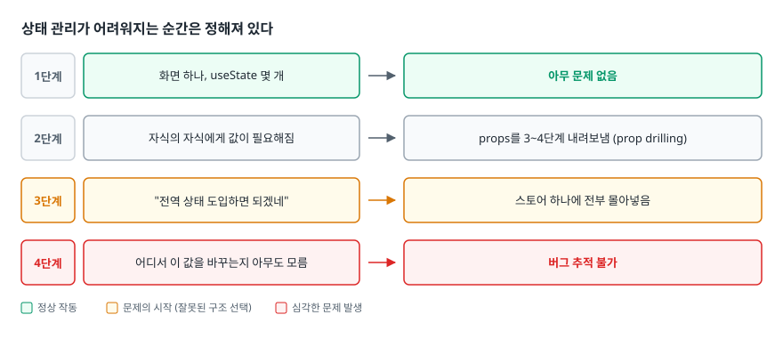
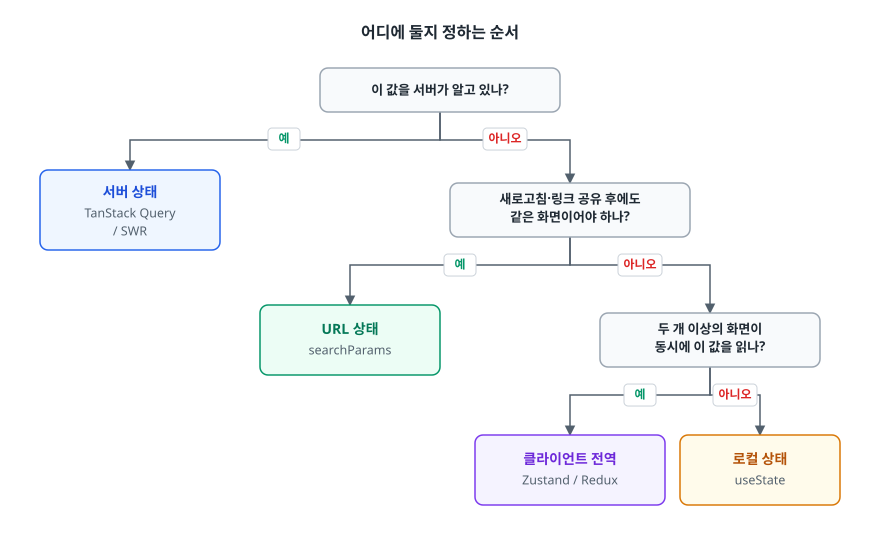
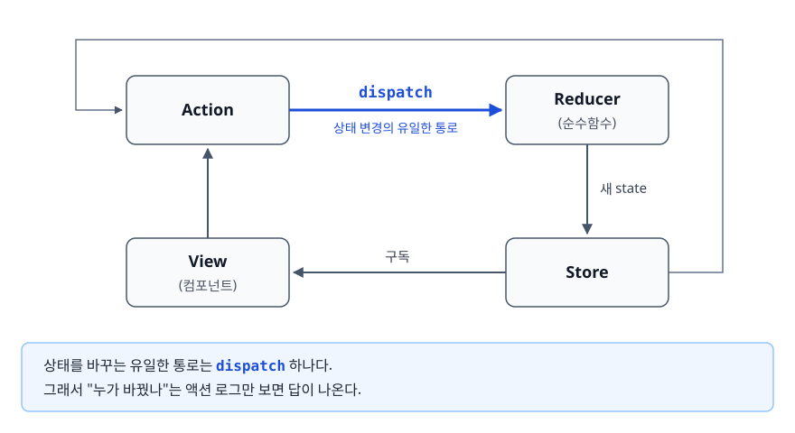

# 상태 관리 전략 (State Management)

> 성격으로 나누면 분류하는 수고가 들고, 도구로 나누면 나중에 대가를 치릅니다. 이 문서는 왜 성격으로 나눠야 하는지, 서버 상태를 전역 스토어에 넣으면 무엇이 무너지는지, 전역 상태는 언제 쓰는지를 설명합니다.

## 학습 목표

- [ ] 상태를 서버/전역 클라이언트/로컬/URL 네 갈래로 분류하고 각각의 판별 기준을 말할 수 있다
- [ ] 서버 상태를 Redux나 Zustand에 저장했을 때 직접 떠안게 되는 일을 나열할 수 있다
- [ ] Redux의 FLUX 단방향 흐름이 무엇을 해결하려고 나왔는지 설명할 수 있다
- [ ] Zustand·Jotai가 Redux의 어떤 부분을 덜어냈는지 구분할 수 있다
- [ ] 전역 상태 남용이 만드는 리렌더 문제와 생명주기 문제를 코드로 지적할 수 있다

## 선행 지식

- React의 `useState`, `useEffect`, `useContext` 사용 경험. [04-hooks-internals.md](../react-architecture/04-hooks-internals.md)로 훅이 렌더링마다 같은 값을 기억하는 구조를 먼저 봐 두면 좋지만, 읽지 않아도 이 문서는 따라올 수 있습니다

---

## 1. 왜 필요한가

### 상태 관리가 어려워지는 순간은 정해져 있다

처음에는 `useState` 하나로 충분합니다. 어려움은 늘 같은 순서로 찾아옵니다.

<!-- diagram:fe-state-management-1 -->


<!-- 위 그림이 대체한 원본 ASCII.
     내용을 고칠 때는 그림도 함께 갱신할 것.
```
1단계  화면 하나, useState 몇 개              → 아무 문제 없음
2단계  자식의 자식에게 값이 필요해짐          → props를 3~4단계 내려보냄 (prop drilling)
3단계  "전역 상태 도입하면 되겠네"            → 스토어 하나에 전부 몰아넣음
4단계  어디서 이 값을 바꾸는지 아무도 모름     → 버그 추적 불가
```
-->

3단계에서 대부분의 프로젝트가 잘못된 선택을 합니다. prop drilling이 불편하다는 이유만으로 전역 스토어를 도입하고, 그 뒤로는 모든 상태를 그 스토어에 넣습니다. 그러면 목록 데이터도, 로그인 정보도, 모달 열림 여부도 한 곳에 쌓입니다.

### 진짜 질문은 "전역이냐 지역이냐"가 아니다

상태를 다룰 때는 범위보다 원본이 어디에 있느냐를 먼저 물어야 합니다.

`user.name`을 화면에 그리고 있다고 해 봅시다. 이 값의 원본은 서버 데이터베이스에 있습니다. 브라우저가 들고 있는 것은 몇 초 전에 복사해 온 사본, 즉 **캐시**입니다. 반면 "다크 모드를 켰는가"의 원본은 브라우저에만 있습니다. 서버는 그 값을 모릅니다. 이 둘은 성격이 완전히 다릅니다.

| 질문 | 서버에서 온 사용자 목록 | 다크 모드 켜짐 여부 |
|------|------------------------|-------------------|
| 원본 소유자 | 서버 DB | 브라우저 |
| 내가 모르는 사이 낡을 수 있나 | 있다 (다른 사람이 수정) | 없다 |
| 로딩·에러 상태가 필요한가 | 필요하다 | 필요 없다 |
| 여러 탭에서 서로 다를 수 있나 | 있으면 안 된다 | 있어도 된다 |
| 다시 가져올 수 있나 | 언제든 다시 fetch | 다시 가져올 곳이 없다 |

> 표 요약: 원본이 남의 것(서버)이면 "동기화" 문제이고 내 것(브라우저)이면 "공유" 문제입니다. 해법이 다르니 같은 도구로 다루면 반드시 어느 한쪽이 어색해집니다.

### 비유: 도서관 장서와 내 책상 메모

서버 상태는 도서관 책을 빌려 와 책상에 둔 것입니다. 원본은 도서관에 있고, 내가 빌린 사이 사서가 개정판으로 바꿔 놨을 수 있으니 가끔 확인해야 합니다. 클라이언트 전역 상태는 내가 쓴 메모입니다. 원본이 내 책상에만 있으니 낡을 일이 없고, 대신 다른 사람과 공유하려면 잘 보이는 곳에 붙여 둬야 합니다.

> **비유의 한계**: 도서관 책은 반납해야 하는 물건입니다. 하지만 서버 상태 캐시는 버려도 그만입니다. 언제든 다시 요청하면 됩니다. "잃어버리면 안 되는 데이터"처럼 소중히 보관하려는 태도 자체가 잘못된 출발점입니다.

---

## 2. 상태를 네 갈래로 나눈다

### 분류

| 분류 | 원본 위치 | 예시 | 도구 |
|------|----------|------|------|
| 서버 상태 (Server State) | 서버 | 상품 목록, 주문 내역, 내 프로필 | TanStack Query(React Query), SWR |
| 클라이언트 전역 상태 (Global Client State) | 브라우저, 앱 전체 공유 | 로그인 토큰, 테마, 언어, 사이드바 접힘 | Zustand, Redux Toolkit, Jotai |
| 로컬 상태 (Local State) | 브라우저, 컴포넌트 안 | 입력값, 모달 열림, 아코디언 펼침 | `useState`, `useReducer` |
| URL 상태 (URL State) | 주소창 | 검색어, 필터, 페이지 번호, 정렬 | 라우터 (`useSearchParams` 등) |

### 어디에 둘지 정하는 순서

분류를 외우는 것보다 **순서대로 물어보는 것**이 실전에서 훨씬 쓸모 있습니다.

<!-- diagram:fe-state-management-2 -->


<!-- 위 그림이 대체한 원본 ASCII.
     내용을 고칠 때는 그림도 함께 갱신할 것.
```
                   이 값을 서버가 알고 있나?
                              │
              ┌───── 예 ──────┴────── 아니오 ─────┐
              ▼                                   ▼
    ┌──────────────────┐            새로고침·링크 공유 후에도
    │   서버 상태      │            같은 화면이어야 하나?
    │ TanStack Query   │                          │
    │      / SWR       │            ┌─── 예 ──────┴──── 아니오 ───┐
    └──────────────────┘            ▼                             ▼
                            ┌──────────────┐          두 개 이상의 화면이
                            │  URL 상태    │          동시에 이 값을 읽나?
                            │ searchParams │                      │
                            └──────────────┘        ┌─ 예 ────────┴─── 아니오 ─┐
                                                    ▼                          ▼
                                          ┌──────────────────┐      ┌────────────────┐
                                          │ 클라이언트 전역  │      │   로컬 상태    │
                                          │ Zustand / Redux  │      │   useState     │
                                          └──────────────────┘      └────────────────┘
```
-->

가장 좁은 곳에서 시작해 필요할 때만 넓히면 됩니다. 반대 방향(전역에서 시작해 좁혀 나가기)은 거의 일어나지 않습니다. 한번 전역에 올라간 상태는 누가 쓰는지 알 수 없어서 아무도 내리지 못합니다.

---

## 3. 서버 상태를 전역 스토어에 넣으면 안 되는 이유

### 안티패턴

가장 흔한 코드입니다. 스토어에 목록을 담고, 컴포넌트가 마운트될 때 채웁니다.

```ts
// 안티패턴 — 서버 데이터를 전역 스토어가 "소유"한다
import { create } from 'zustand';
const useUserStore = create((set) => ({
  users: [],
  isLoading: false,
  error: null,
  fetchUsers: async () => {
    set({ isLoading: true, error: null });
    try {
      const res = await fetch('/api/users');
      set({ users: await res.json(), isLoading: false });
    } catch (e) { set({ error: e, isLoading: false }); }
  },
}));

function UserList() {
  const { users, isLoading, fetchUsers } = useUserStore();
  useEffect(() => { fetchUsers(); }, [fetchUsers]);
  // ...
}
```

### 왜 문제인가

동작은 합니다. 다만 이 코드가 눈에 보이지 않는 여섯 가지 책임을 방금 떠안았습니다.

1. **중복 요청** — `UserList`와 `UserPicker`가 같은 화면에 있으면 `/api/users`를 두 번 호출합니다. 막으려면 "이미 요청 중인가" 플래그를 직접 관리해야 합니다.
2. **무효화 시점** — 사용자를 추가한 뒤 목록을 갱신하려면 추가하는 쪽이 `fetchUsers()`를 다시 부를 책임을 집니다. 목록을 쓰는 화면이 늘어날수록 "여기서도 갱신해야 하나"를 매번 판단해야 합니다.
3. **낡은 데이터** — 탭을 30분 방치했다가 돌아와도 스토어에는 30분 전 데이터가 그대로 있습니다. 다시 가져오려면 포커스 이벤트를 직접 붙여야 합니다.
4. **로딩·에러 상태 수동 관리** — 위 코드의 `isLoading`, `error`가 그것입니다. 요청 종류가 열 개면 이 세 줄이 열 번 반복됩니다.
5. **메모리 정리 없음** — 화면을 떠나도 `users`는 스토어에 남습니다. 목록이 스무 개면 스무 개가 전부 남습니다.
6. **경쟁 상태(race condition)** — 검색어를 빠르게 바꾸면 늦게 출발한 요청이 먼저 도착할 수 있습니다. 응답 순서를 직접 검사해야 합니다.

여섯 개 전부 캐시가 원래 풀어야 하는 문제입니다. 서버 상태 라이브러리는 이걸 대신 하려고 만들어졌습니다.

### 개선

```tsx
// 개선 — 서버 상태는 캐시로 다룬다
import { useQuery, useMutation, useQueryClient } from '@tanstack/react-query';

function useUsers() {
  return useQuery({
    queryKey: ['users'],
    queryFn: async () => {
      const res = await fetch('/api/users');
      // fetch는 404·500에도 reject하지 않는다. 직접 던져야 error 상태로 잡힌다
      if (!res.ok) throw new Error(`사용자 목록 조회 실패: ${res.status}`);
      return res.json();
    },
    staleTime: 60_000, // 1분 안에는 다시 요청하지 않는다
  });
}

// 목록을 바꾸는 쪽은 "이 키가 낡았다"고만 알린다
function useAddUser() {
  const queryClient = useQueryClient();
  return useMutation({
    // 객체를 body에 그대로 넘기면 "[object Object]"가 전송된다. 직렬화는 내 몫이다
    mutationFn: (body: NewUser) =>
      fetch('/api/users', { method: 'POST', body: JSON.stringify(body),
        headers: { 'Content-Type': 'application/json' } }),
    onSuccess: () => queryClient.invalidateQueries({ queryKey: ['users'] }),
  });
}
```

코드 길이는 별로 줄지 않았습니다. 대신 책임의 위치가 옮겨갔습니다. 화면은 더 이상 "언제 가져올지"를 모르고, `useAddUser`도 목록을 누가 쓰는지 모른 채 `['users']`가 낡았다는 사실만 선언합니다. 그 키를 구독하던 화면은 전부 알아서 갱신됩니다.

### queryKey는 캐시 키다

`queryKey`를 단순한 이름표로 오해하기 쉽습니다. 사실상 캐시 테이블의 기본키입니다. 값이 달라지면 다른 캐시 항목이 됩니다.

```ts
useQuery({ queryKey: ['users', { role: 'admin' }], queryFn: () => fetchUsers('admin') }); // 캐시 A
useQuery({ queryKey: ['users', { role: 'guest' }], queryFn: () => fetchUsers('guest') }); // 캐시 B
```

그러니 필터나 페이지 번호처럼 **응답을 바꾸는 값은 전부 키에 들어가야** 합니다. 키에 넣지 않으면 필터를 바꿔도 이전 결과가 그대로 보입니다. 참고로 키 비교는 참조가 아니라 내용 기준이고, 객체 속성 순서도 무시합니다. 그래서 객체를 매 렌더마다 새로 만들어 키에 넣어도 캐시가 계속 새로 생기지는 않습니다.

### 캐시의 수명

캐시 항목은 `staleTime` 동안 **fresh**로 취급돼 새 요청을 보내지 않고, 그 시간이 지나면 **stale**이 됩니다. stale이 됐다고 값이 사라지거나 그 즉시 요청이 나가지는 않습니다.

재요청은 정해진 계기가 있을 때만 일어납니다. 컴포넌트가 마운트될 때, 창에 다시 포커스가 갈 때, 네트워크가 재연결될 때가 기본 계기입니다. 그 순간 화면에는 캐시에 있던 낡은 값을 먼저 보여 주고, 뒤에서 새 값을 받아 교체합니다. 이 stale-while-revalidate 전략은 HTTP 캐시(RFC 5861)에서 온 개념으로, 사용자는 스피너를 보지 않으면서도 결국 최신 데이터를 보게 됩니다.

그 항목을 쓰던 컴포넌트가 전부 사라지면 inactive 상태가 되고, 일정 시간이 더 지나면 메모리에서 제거됩니다. 이 시간을 정하는 옵션 이름은 v5에서 `gcTime`, v4까지는 `cacheTime`이었습니다. 이름만 바뀌었고 역할은 같습니다. `staleTime`은 기본값이 0이라 화면에 들어올 때마다 재검증하고, 크게 잡으면 요청이 줄지만 낡은 값을 오래 봅니다. 알림 개수처럼 실시간성이 중요한 값은 짧게, 카테고리 목록처럼 거의 안 바뀌는 값은 길게 잡습니다. 데이터마다 다르게 정하면 됩니다.

### SWR과의 차이

| 항목 | TanStack Query | SWR |
|------|---------------|-----|
| 크기·API 표면 | 큽니다. 옵션이 많습니다 | 작습니다. `useSWR(key, fetcher)` 중심 |
| 변경(mutation) 지원 | `useMutation` 훅으로 일원화 | `mutate`로 캐시를 직접 갱신하거나, 2.0부터는 `useSWRMutation` 훅 |
| 개발 도구 | 공식 Devtools 패키지 제공 | 공식 제공 없음 (서드파티 존재) |
| 어울리는 상황 | 목록·상세·수정이 얽힌 대시보드, 관리자 화면 | 읽기 위주의 콘텐츠 사이트 |

> 결론: 둘 중 무엇을 쓰든 "서버 상태를 캐시로 다룬다"는 이득의 대부분을 가져갑니다. 낙관적 업데이트와 롤백은 양쪽 다 지원하고, SWR도 2.0부터 `useSWRMutation`으로 쓰기 흐름을 훅으로 다룹니다. 그러니 기능 유무로는 갈리지 않습니다. 차이는 API 표면의 크기와 도구 지원에서 납니다. TanStack Query는 옵션이 많고 공식 Devtools도 붙어서 목록·상세·수정이 얽힌 화면에서 손이 덜 갑니다. 읽기 위주라면 배우고 기억할 것이 적은 SWR로 충분합니다.

---

## 4. 클라이언트 전역 상태 — FLUX와 그 이후

### Redux는 무엇을 풀려고 나왔나

Redux가 따른 FLUX는 페이스북이 MVC 구조에서 겪은 문제에서 출발했습니다. 뷰가 모델을 바꾸고, 그 모델이 다른 모델을 바꾸고, 그 연쇄가 다시 뷰로 돌아옵니다. 이런 구조에서는 화면이 스무 개쯤 되면 "이 값이 왜 바뀌었는지"를 역추적할 수 없게 됩니다. 변경 지점이 코드 곳곳에 흩어져 있기 때문입니다.

FLUX는 이 문제를 **흐름을 한 방향으로 강제**해서 풀었습니다.

<!-- diagram:fe-state-management-3 -->


<!-- 위 그림이 대체한 원본 ASCII.
     내용을 고칠 때는 그림도 함께 갱신할 것.
```
   ┌─────────────────────────────────────────────────┐
   │                                                 │
   │   ┌────────┐   dispatch   ┌──────────┐          │
   └──>│ Action │ ───────────> │ Reducer  │          │
       └────────┘              │ (순수함수)│          │
            ▲                  └────┬─────┘          │
            │                       │ 새 state       │
            │                       ▼                │
       ┌────┴─────┐            ┌──────────┐          │
       │   View   │ <───────── │  Store   │ ─────────┘
       │ (컴포넌트)│  구독      └──────────┘
       └──────────┘

   상태를 바꾸는 유일한 통로는 dispatch 하나다.
   그래서 "누가 바꿨나"는 액션 로그만 보면 답이 나온다.
```
-->

이 구조는 편의성 대신 추적 가능성을 줍니다. Redux DevTools에서 액션 목록을 되감아 시점별 상태를 볼 수 있는 것도 상태 변경이 반드시 액션을 거치기 때문입니다.

```ts
// Redux Toolkit — 오늘날의 Redux 표준 작성법
import { createSlice, configureStore } from '@reduxjs/toolkit';

const themeSlice = createSlice({
  name: 'theme',
  initialState: { mode: 'light' },
  reducers: {
    // Immer가 감싸주므로 겉보기엔 직접 수정해도 실제로는 새 객체가 만들어진다
    toggled: (state) => { state.mode = state.mode === 'light' ? 'dark' : 'light'; },
  },
});

export const { toggled } = themeSlice.actions;
export const store = configureStore({ reducer: { theme: themeSlice.reducer } });
```

### Zustand는 무엇을 덜어냈나

Redux의 규율은 대가를 요구합니다. 값 하나를 추가하려면 액션 타입, 액션 생성자, 리듀서, 셀렉터를 건드려야 합니다. Redux Toolkit이 이 중 상당 부분을 줄였지만 여전히 "액션을 거쳐야 한다"는 간접 계층은 남습니다.

Zustand는 액션과 리듀서라는 중간 단계를 없애고 스토어가 곧 훅이 되게 했습니다.

```ts
import { create } from 'zustand';

const useThemeStore = create((set) => ({
  mode: 'light',
  toggle: () => set((s) => ({ mode: s.mode === 'light' ? 'dark' : 'light' })),
}));

// 사용하는 쪽 — Provider도 connect도 필요 없다
function ThemeButton() {
  const mode = useThemeStore((s) => s.mode);        // 셀렉터로 필요한 것만 구독
  const toggle = useThemeStore((s) => s.toggle);
  return <button onClick={toggle}>{mode}</button>;
}
```

덜어낸 만큼 잃는 것도 있습니다. 상태를 바꾸는 통로가 하나가 아니어서 "이 값을 누가 바꿨나"의 추적이 Redux만큼 자동으로 되지 않습니다. 규모가 커지고 변경 지점이 많아지면 이 차이가 드러납니다.

### Jotai는 방향이 다르다

Redux와 Zustand는 "큰 상태 하나를 만들고 필요한 조각을 골라 쓰는" 하향식입니다. Jotai는 반대로 작은 상태 조각(atom)에서 출발해 조합하는 상향식입니다.

```tsx
import { atom, useAtom, useAtomValue } from 'jotai';

const countAtom = atom(0);
const doubledAtom = atom((get) => get(countAtom) * 2); // countAtom에서 파생된 읽기 전용 atom

function Counter() {                             // 훅이므로 컴포넌트 안에서만 호출한다
  const [count, setCount] = useAtom(countAtom);
  const doubled = useAtomValue(doubledAtom);     // countAtom이 바뀔 때만 다시 계산된다
  return <button onClick={() => setCount(count + 1)}>{count} / {doubled}</button>;
}
```

구독 단위가 atom이므로 리렌더 범위가 자연스럽게 좁고, 파생 값을 선언적으로 표현할 수 있습니다. 대신 atom이 수백 개가 되면 의존 관계가 코드에 흩어져 전체 그림을 보기 어려워집니다.

### 비교

| 기준 | Redux Toolkit | Zustand | Jotai |
|------|--------------|---------|-------|
| 상태 구성 방향 | 하향식 (하나의 큰 트리) | 하향식 (스토어 단위) | 상향식 (atom 조합) |
| 변경 추적 | 액션 로그로 완전 추적 | 별도 미들웨어 필요 | 개별 atom 단위 |
| 보일러플레이트 | 중간 | 적음 | 적음 |
| Provider 필요 | 필요 | 불필요 | 선택 (스코프 분리 시) |
| 기본 구독 단위 | 셀렉터 | 셀렉터 | atom |
| 강점이 드러나는 상황 | 변경 이력 추적·복잡한 업무 규칙 | 소수의 전역 값·빠른 도입 | 값끼리 파생 관계가 많은 화면 |

> 결론: 전역 상태의 양이 적고 팀이 작으면 Zustand가 실용적입니다. 주문·정산처럼 상태 변경을 되짚어야 하는 복잡한 도메인에서는 Redux의 강제된 흐름이 여전히 값을 합니다. 무엇보다 세 도구 모두 서버 상태를 대신하지는 못합니다.

---

## 5. 전역 상태 남용이 만드는 문제

### 안티패턴

```ts
// 안티패턴 — 모달 열림 여부를 전역으로
const useUIStore = create((set) => ({
  isDeleteModalOpen: false,
  openDeleteModal: () => set({ isDeleteModalOpen: true }),
  closeDeleteModal: () => set({ isDeleteModalOpen: false }),
}));
```

### 왜 문제인가

1. **생명주기 불일치** — 모달을 열어둔 채 다른 페이지로 이동하면 컴포넌트는 사라져도 `isDeleteModalOpen: true`는 남습니다. 다시 그 페이지에 들어오면 모달이 열린 채 나타납니다. 이걸 막으려면 언마운트마다 `closeDeleteModal()`을 불러야 합니다. 그 정리 코드는 사람이 기억해야 합니다.
2. **인스턴스를 하나로 못 박음** — 목록의 각 행에 삭제 모달이 있어야 하는 순간, 전역 불리언 하나로는 표현할 수 없습니다. `openModalId: string | null`로 바꾸는 리팩터링이 필요해집니다.
3. **소유자 불명** — `isDeleteModalOpen`을 누가 열고 누가 닫는지는 프로젝트 전체를 검색해야 알 수 있습니다. 로컬 `useState`였다면 그 컴포넌트 안에서 끝났습니다.
4. **리렌더 범위 확대** — 스토어를 통째로 구독한 컴포넌트는 관계없는 값이 바뀌어도 다시 그려집니다.

### 개선

```tsx
// 개선 — 모달 상태는 그것을 여는 컴포넌트가 소유한다
function UserRow({ user }) {
  const [isDeleteOpen, setDeleteOpen] = useState(false);
  return (
    <li>
      {user.name}
      <button onClick={() => setDeleteOpen(true)}>삭제</button>
      {isDeleteOpen && <DeleteModal user={user} onClose={() => setDeleteOpen(false)} />}
    </li>
  );
}
```

행이 사라지면 상태도 함께 사라지고, 행이 백 개면 백 개가 각자의 상태를 갖습니다. 정리 코드도 필요 없습니다.

### 전역이 정말 필요하다면 구독을 좁혀라

Zustand는 셀렉터 결과를 기본적으로 `Object.is`로 비교합니다. 그래서 셀렉터가 객체를 새로 만들어 반환하면 내용이 같아도 참조가 매번 달라지고, 구독을 좁힌 효과가 사라집니다.

```ts
import { useShallow } from 'zustand/react/shallow';

const whole = useUIStore();                                            // 안티패턴 — 스토어 전체 구독
const pair = useUIStore((s) => ({ a: s.a, b: s.b }));                  // 함정 — 매 렌더 새 객체라 항상 리렌더
const sidebarOpen = useUIStore((s) => s.sidebarOpen);                  // 해법 1 — 원시값 단위로 구독
const { a, b } = useUIStore(useShallow((s) => ({ a: s.a, b: s.b })));  // 해법 2 — 얕은 비교
```

---

## 6. URL 상태 — 가장 자주 잊히는 분류

검색어와 필터를 `useState`로 관리하면 세 가지가 동시에 깨집니다. 새로고침하면 초기화되고, 링크를 복사해 보내도 상대는 다른 화면을 보고, 브라우저 뒤로 가기가 필터 변경을 되돌리지 못합니다.

주소창은 그 자체로 앱 전체에서 공유되는 저장소입니다. 화면을 특정하는 값이라면 여기에 두는 것이 맞습니다.

```tsx
import { useSearchParams } from 'react-router-dom';

function ProductList() {
  const [searchParams, setSearchParams] = useSearchParams();
  const category = searchParams.get('category') ?? 'all';
  const page = Number(searchParams.get('page') ?? '1');

  const { data } = useQuery({
    queryKey: ['products', category, page],   // 서버 상태의 캐시 키에 URL 값을 그대로 넣는다
    queryFn: () => fetchProducts({ category, page }),
  });

  const changeCategory = (next: string) => setSearchParams({ category: next, page: '1' });
  return <Grid items={data ?? []} onCategoryChange={changeCategory} />;
}
```

URL 상태와 서버 상태가 자연스럽게 이어지는 것을 눈여겨볼 만합니다. URL이 바뀌면 `queryKey`가 바뀌고, 키가 바뀌면 새 데이터를 가져옵니다. 별도의 `useEffect`로 "필터가 바뀌면 다시 fetch"를 적을 필요가 없습니다.

다음 한 가지만 물으면 됩니다. **이 값을 포함한 링크를 다른 사람에게 보냈을 때 같은 화면이 나와야 하는가.** 그렇다면 URL입니다. 비밀번호 입력값이나 스크롤 위치는 공유돼선 안 되거나 공유할 의미가 없으므로 URL에 두지 않습니다.

---

## 7. 실무에서는

- **전역 스토어에는 생각보다 적게 남습니다.** 서버 상태를 TanStack Query로, 화면을 특정하는 값을 URL로 옮기고 나면 전역에는 인증 정보, 테마, 언어, 토스트 큐 정도만 남습니다. 이 정도 규모에서는 Zustand 스토어 두세 개나 Context로 충분하고, Redux를 새로 도입할 이유를 찾기 어렵습니다.
- **인증 토큰은 예외적으로 다룹니다.** 전역 상태이면서 동시에 HTTP 클라이언트 인터셉터에서도 읽어야 하므로 훅 밖에서 접근할 방법이 필요합니다. Zustand는 `useAuthStore.getState().token`으로 React 밖에서도 읽을 수 있어 이 요구를 자연스럽게 만족합니다.
- **Next.js App Router에서는 분류가 한 겹 더 늘어납니다.** 서버 컴포넌트에서 가져온 데이터는 애초에 클라이언트 상태가 아니므로 클라이언트에서 다시 캐싱할 필요가 있는지부터 따져야 합니다. 자세한 내용은 [../nextjs-rendering/03-server-components.md](../nextjs-rendering/03-server-components.md)를 참고할 만합니다.
- **폼은 별도로 취급하는 경우가 많습니다.** 입력값을 하나씩 `useState`로 두면 타이핑마다 폼 전체가 리렌더됩니다. React Hook Form 같은 라이브러리가 비제어 방식으로 이 문제를 피합니다. [02-component-design.md](./02-component-design.md)의 제어/비제어 이야기와 이어집니다.

---

## 8. 면접 포인트

> 면접에서 이 주제가 나오면 이렇게 답합니다

**Q. 상태 관리 라이브러리를 어떤 기준으로 고르나요?**
A. 라이브러리를 먼저 고르지 않고 상태를 먼저 분류합니다. 원본이 서버에 있는 데이터는 소유가 아니라 캐시이므로 TanStack Query 같은 서버 상태 도구에 맡기고, 화면을 특정하는 값은 URL에 두고, 앱 전체가 공유하는 클라이언트 값만 전역 스토어에 남깁니다. 이렇게 걸러내면 전역에 남는 것은 인증·테마 정도라 Zustand로 충분한 경우가 많습니다. 변경 이력 추적이 중요한 도메인이라면 Redux의 단방향 흐름이 값을 합니다.
- 꼬리 질문: "그럼 Redux는 이제 안 쓰나요?" → 새 프로젝트에서 기본 선택지는 아니지만 복잡한 업무 화면에서 액션 로그로 상태 변경을 되짚어야 한다면 강제된 흐름이 여전히 유효하다고 답합니다.

**Q. 서버에서 받은 목록을 Redux에 저장하면 뭐가 문제인가요?**
A. 캐시가 풀어야 할 문제를 전부 직접 떠안게 됩니다. 같은 데이터를 두 컴포넌트가 요청하면 중복 호출이 나갑니다. 수정한 뒤 어떤 목록을 갱신할지는 호출하는 쪽이 알아야 합니다. 오래 열어 둔 탭의 낡은 데이터를 다시 가져올 장치도 없고, 요청마다 로딩·에러 상태를 손으로 만들어야 합니다. 검색어를 빠르게 바꿀 때의 응답 역전도 직접 막아야 합니다. 서버 상태 도구는 이걸 캐시 키 기반으로 규격화해서 해결합니다.
- 꼬리 질문: "그럼 서버 데이터를 전역에서 읽어야 할 때는요?" → TanStack Query의 캐시 자체가 이미 전역이라고 답합니다. 같은 `queryKey`로 조회하면 어느 컴포넌트에서든 같은 캐시를 봅니다.

**Q. Context API로 전역 상태를 관리하면 안 되나요?**
A. 됩니다. 다만 Context는 값이 바뀌면 그 Context를 구독하는 컴포넌트가 전부 리렌더되고, 구독 단위를 값 일부로 좁힐 수단이 없습니다. 자주 바뀌지 않는 테마나 로케일에는 적합하지만 초당 여러 번 바뀌는 값이나 여러 값이 섞인 하나의 큰 Context에는 맞지 않습니다. 상태 라이브러리들은 셀렉터로 구독 범위를 좁히는 기능을 제공해서 이 지점이 다릅니다.
- 꼬리 질문: "Context를 나누면 해결되나요?" → 상당 부분 해결됩니다. 다만 Provider 중첩이 깊어지고 어떤 Context가 어디까지 감싸는지 파악이 어려워지는 비용이 생깁니다.

**Q. Redux의 단방향 데이터 흐름이 왜 좋은가요?**
A. 상태를 바꾸는 통로가 dispatch 하나로 제한되기 때문입니다. 뷰가 모델을 직접 고칠 수 있는 구조에서는 값이 바뀐 원인을 코드 전체에서 찾아야 하는데, 단방향에서는 액션 로그만 보면 됩니다. Redux DevTools로 시점을 되감아 볼 수 있는 것도 모든 변경이 액션을 거치기 때문입니다. 대가는 보일러플레이트이고, Redux Toolkit이 그 부담을 줄인 결과물입니다.
- 꼬리 질문: "Zustand는 단방향이 아닌가요?" → 데이터가 스토어에서 뷰로 흐르는 것은 같지만, 상태 변경 통로가 하나로 강제되지 않아 추적성이 Redux만큼 자동으로 보장되지는 않는다고 답합니다.

---

## 자주 하는 실수

| 실수 | 왜 틀렸나 | 올바른 이해 |
|------|----------|-----------|
| "전역 상태 = 상태 관리 라이브러리" | 서버 상태·URL 상태를 걸러내면 전역에 남는 것은 얼마 안 된다 | 분류가 먼저입니다. 도구 선택은 그 다음 문제입니다 |
| "React Query는 데이터 페칭 라이브러리다" | fetch 자체는 여전히 내가 짠 `queryFn`이 한다 | **비동기 상태를 캐시로 관리하는** 도구다 |
| "전역 상태로 올리면 prop drilling이 사라진다" | 사라지지 않고 암묵적 의존으로 바뀝니다. 어떤 컴포넌트가 무엇에 의존하는지 시그니처에서 사라집니다 | 2~3단계 drilling은 오히려 명시적이라 나을 때가 많습니다. 합성으로 없앨 수 있는지 먼저 봅니다 |
| "`staleTime`은 캐시 삭제 시간이다" | 삭제 시점은 `gcTime`이 정한다 | `staleTime`은 "재검증 없이 신선하다고 믿는 기간"이다 |
| "필터를 `queryKey`에 안 넣어도 `refetch()`로 갱신하면 된다" | 키가 같으면 결과가 같은 캐시 항목을 덮어써서 필터별 캐시가 사라진다 | 응답을 바꾸는 모든 입력은 키에 포함한다 |
| "모달·드롭다운 열림 여부는 UI 전역 상태다" | 컴포넌트 생명주기와 어긋나 유령 상태가 남고 인스턴스가 여러 개면 표현조차 불가능하다 | 여는 컴포넌트가 `useState`로 소유한다 |

---

## 한 줄 정리

상태 관리는 라이브러리 고르기가 아닙니다. 각 값의 원본이 어디에 있는지 판정하는 일입니다. 서버에 원본이 있는 값을 캐시로 다루고, 화면을 특정하는 값을 URL로 옮기고 나면 전역 스토어가 맡을 몫은 놀랄 만큼 작아집니다.

---

## 연관 개념

- [02-component-design.md](./02-component-design.md) - 상태를 어느 컴포넌트가 소유할지 정하는 문제와 이어집니다
- [03-project-structure.md](./03-project-structure.md) - 상태와 API 호출 코드를 어느 레이어에 둘 것인가
- [qna-frontend-architecture.md](./qna-frontend-architecture.md) - 상태 분류 관련 면접 질문(Q3)
- [../react-architecture/04-hooks-internals.md](../react-architecture/04-hooks-internals.md) - `useState`가 렌더링 사이에 값을 기억하는 구조
- [../react-architecture/02-reconciliation.md](../react-architecture/02-reconciliation.md) - 상태가 바뀌었을 때 리렌더 범위가 정해지는 원리
- [../nextjs-rendering/03-server-components.md](../nextjs-rendering/03-server-components.md) - 서버 컴포넌트에서 데이터를 가져올 때 클라이언트 상태와의 경계
