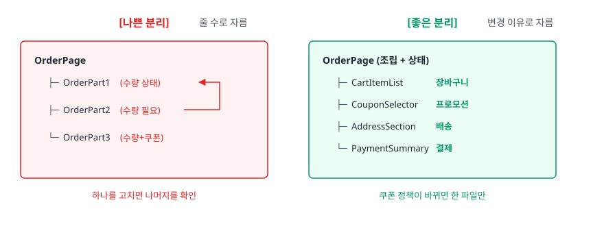
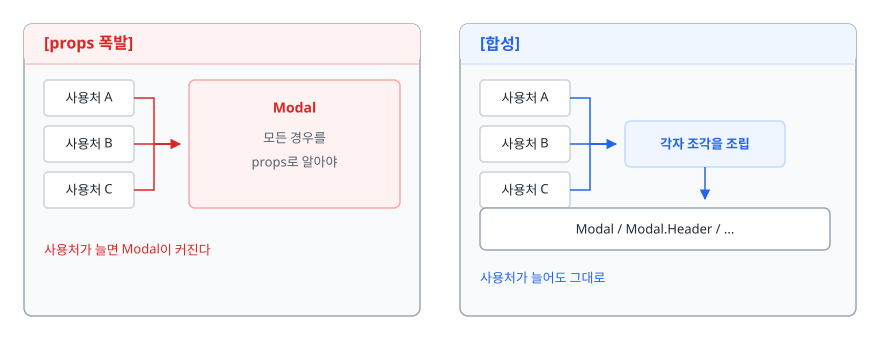
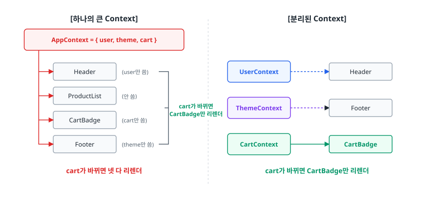

# 컴포넌트 설계 (Component Design)

> 컴포넌트를 언제 나누고 언제 나누지 말아야 하는지, props가 늘어나는 컴포넌트를 합성으로 어떻게 되돌리는지, Context를 어디까지 써야 하는지 설명할 수 있게 됩니다.

## 학습 목표

- [ ] 성급한 추상화가 왜 중복보다 비싼지 코드로 설명할 수 있다
- [ ] 컴포넌트를 나누는 기준이 "줄 수"가 아니라 "변경 이유"임을 근거와 함께 말할 수 있다
- [ ] props가 늘어나는 컴포넌트를 합성(composition)으로 바꿀 수 있다
- [ ] 제어 컴포넌트와 비제어 컴포넌트의 차이와 선택 기준을 안다
- [ ] prop drilling을 Context 없이 없애는 방법을 하나 이상 안다

## 선행 지식

- React 컴포넌트와 props, `useState` 사용 경험. [01-state-management.md](./01-state-management.md)를 먼저 읽으면 좋지만 필수는 아니다

---

## 1. 왜 필요한가

### 컴포넌트 설계의 목적은 재사용이 아니다

"컴포넌트로 나누면 재사용할 수 있다"는 설명은 절반만 맞습니다. 실제 프로젝트에서 재사용되는 컴포넌트는 버튼, 입력창, 모달 정도이고 나머지 대부분은 **한 곳에서만 쓰입니다.** 그런데도 우리는 계속 컴포넌트를 나눕니다. 이유는 다른 데 있습니다. **변경 비용을 낮추기 위해서**입니다.

600줄짜리 주문 페이지에서 배송지 표시 형식을 바꿔야 한다고 하자. 600줄을 읽으며 관련 코드를 찾아야 하고, 고친 뒤에는 상품 목록이나 결제 요약에 영향이 갔는지 확인해야 합니다. `AddressSection`이 따로 있었다면 40줄만 읽고 40줄만 확인하면 됩니다. **컴포넌트를 나눈다는 것은 "여기까지가 한 덩어리다"라고 선을 긋는 일**이고, 그 선이 잘 그어져 있으면 변경할 때 읽어야 할 코드가 줄어듭니다.

그런데 나누는 것은 쉽지만, 잘못 나눈 것을 합치는 일은 훨씬 어렵습니다. 이미 여러 곳에서 쓰이고 있고 각 사용처가 조금씩 다른 기대를 하고 있기 때문입니다. 그래서 컴포넌트 설계의 첫 번째 규칙은 "잘 나누는 법"이 아니라 **"성급하게 나누지 않는 법"**입니다.

### 비유: 방을 가르는 벽

컴포넌트 경계는 집 안에 세우는 벽입니다. 벽이 있으면 한 방을 새로 칠할 때 옆방에 페인트가 튀지 않습니다. 대신 벽을 잘못 세우면, 이를테면 싱크대와 가스레인지 사이에 벽이 지나가면 요리할 때마다 문을 드나들어야 합니다. 그리고 한번 세운 벽은 허무는 것보다 세우는 게 훨씬 쌉니다.

> **비유의 한계**: 벽은 물리적 공간을 실제로 막지만 컴포넌트 경계는 그렇지 않습니다. props와 Context, 전역 스토어를 통해 값이 경계를 자유롭게 넘나들 수 있어서, **파일을 나눴다고 관심사가 나뉘었다고 믿는 것**이 이 주제에서 가장 흔한 착각입니다.

---

## 2. 재사용의 함정 — 성급한 추상화

### 안티패턴

관리자 화면과 사용자 화면에 비슷하게 생긴 카드가 있습니다. "코드가 거의 같으니 합치자"는 생각이 자연스럽게 듭니다.

```tsx
// 안티패턴 — 겉모습이 비슷하다는 이유로 합친 컴포넌트
function UserCard({ user, isAdmin, showEmail, compact, onDelete, onApprove }) {
  return (
    <div className={compact ? 'card card--compact' : 'card'}>
      
      <h3>{user.name}</h3>
      {showEmail && <p>{user.email}</p>}
      {isAdmin && <span className="badge">관리자</span>}
      {isAdmin && onDelete && <button onClick={onDelete}>삭제</button>}
      {isAdmin && !user.approved && <button onClick={onApprove}>승인</button>}
      {!isAdmin && <button>팔로우</button>}
    </div>
  );
}
```

### 왜 문제인가

1. **우연한 중복이었습니다.** 두 카드가 비슷했던 이유는 지금 요구사항이 우연히 겹쳤기 때문이지 같은 개념이어서가 아닙니다. 관리자 화면과 사용자 화면은 서로 다른 이유로, 서로 다른 시점에 바뀝니다. 하나로 묶으면 한쪽이 바뀔 때마다 다른 쪽을 검증해야 합니다.
2. **플래그가 기하급수로 늘어납니다.** 불리언 props가 4개면 가능한 조합이 16가지고 실제로 쓰이는 것은 2~3가지입니다. 나머지 13가지는 아무도 테스트하지 않은 채 코드에 남습니다.
3. **읽는 사람이 조립해야 합니다.** 이 컴포넌트가 실제로 어떻게 보이는지 알려면 `isAdmin`과 `compact` 값을 머릿속에서 대입해가며 JSX를 따라가야 합니다.
4. **되돌리기 어렵습니다.** 관리자 카드에만 필요한 기능이 생겨도 이미 여러 곳에서 쓰이므로 분리가 큰 작업이 됩니다.

Sandi Metz의 표현을 빌리면 **"중복은 잘못된 추상화보다 훨씬 싸다(duplication is far cheaper than the wrong abstraction)."**

### 개선

```tsx
// 개선 — 진짜 공통인 표현만 남기고 나머지는 각자 조립한다
const Card = ({ children, compact = false }) => <div className={compact ? 'card card--compact' : 'card'}>{children}</div>;
const UserAvatar = ({ user }) => <><h3>{user.name}</h3></>;

function AdminUserCard({ user, onDelete, onApprove }) {   // 관리자 화면
  return (
    <Card>
      <UserAvatar user={user} />
      <p>{user.email}</p>
      <span className="badge">관리자</span>
      <button onClick={onDelete}>삭제</button>
      {!user.approved && <button onClick={onApprove}>승인</button>}
    </Card>
  );
}

function PublicUserCard({ user }) {                        // 사용자 화면
  return <Card compact><UserAvatar user={user} /><button>팔로우</button></Card>;
}
```

`Card`와 `UserAvatar`는 **어떤 화면에서 쓰이든 똑같이 동작하는 것**만 담았습니다. 화면마다 다른 부분은 각 화면이 직접 조립합니다. 코드 줄 수는 늘었지만, 두 화면이 서로에게 영향을 주지 않습니다.

경험적 규칙이 두 가지 있습니다. 같은 코드가 **세 번째** 나타났을 때 추출하는 Rule of Three, 그리고 실제로 두 번째 호출부가 생겼을 때 추출하는 "두 번째 사용처" 원칙입니다. 무엇을 따르든 핵심은 같습니다. **미래를 예측해서 추상화하지 않습니다.** 예측이 빗나가면 잘못된 추상화가 남고, 그 비용은 중복보다 큽니다.

---

## 3. 무엇을 기준으로 나누는가

### 기준은 줄 수가 아니라 "변경 이유"다

"컴포넌트는 100줄을 넘기지 말자" 같은 규칙은 다루기 쉬워 보이지만 잘못된 분리를 유도합니다. 300줄짜리 컴포넌트를 줄 수만 맞춰 세 개로 쪼개면, 서로 상태를 주고받느라 props가 얽힌 세 개의 컴포넌트가 생깁니다. 읽어야 할 코드는 오히려 늘어납니다.

단일 책임 원칙(SRP, Single Responsibility Principle)은 흔히 "하나의 일만 한다"로 옮겨지지만 원문에 더 가까운 표현은 **"변경할 이유가 하나뿐이어야 한다"**입니다. 컴포넌트에 적용하면 이렇게 됩니다.

<!-- diagram:fe-component-design-1 -->


<!-- 위 그림이 대체한 원본 ASCII.
     내용을 고칠 때는 그림도 함께 갱신할 것.
```
[나쁜 분리]  줄 수로 자름          [좋은 분리]  변경 이유로 자름

┌────────────────────────────┐    ┌────────────────────────────┐
│ OrderPage                  │    │ OrderPage (조립 + 상태)    │
│  ├─ OrderPart1 (수량 상태) │◄─┐ │  ├─ CartItemList  장바구니 │
│  ├─ OrderPart2 (수량 필요) ┼──┘ │  ├─ CouponSelector 프로모션│
│  └─ OrderPart3 (수량+쿠폰) │    │  ├─ AddressSection 배송    │
└────────────────────────────┘    │  └─ PaymentSummary 결제    │
 하나를 고치면 나머지를 확인       └────────────────────────────┘
                                   쿠폰 정책이 바뀌면 한 파일만
```
-->

오른쪽 구조에서 각 컴포넌트는 서로 다른 담당자가, 서로 다른 이유로 고칩니다. 이것이 좋은 경계의 신호입니다.

### 실전에서 쓰는 세 가지 신호

**JSX에 구역 주석을 달고 있다면** — `{/* 배송지 영역 */}` 같은 주석을 달았다면 이미 그 자리가 경계입니다. 주석 대신 컴포넌트 이름을 붙이면 됩니다. **조건부 렌더링 블록이 통째로 다르다면** — `if (isEditing)` 위아래가 완전히 다른 화면이라면 두 컴포넌트입니다. **리렌더 단위가 다르다면** — 매초 갱신되는 타이머와 거의 안 바뀌는 상품 정보가 한 컴포넌트에 있으면 상품 정보도 매초 다시 그려집니다. 성능 문제로 드러나기 전에 분리 신호로 읽는 편이 낫습니다.

---

## 4. 컨테이너/프레젠테이션 패턴과 훅 시대의 변화

### 원래 무엇을 풀려던 패턴인가

클래스 컴포넌트 시절에는 **상태 로직을 재사용할 방법이 마땅치 않았습니다.** 데이터 페칭 로직을 여러 컴포넌트에서 쓰려면 고차 컴포넌트(HOC)나 render props를 써야 했고, 둘 다 중첩이 깊어지면 읽기 어려웠습니다. 그래서 나온 타협이 **데이터를 다루는 컨테이너와 렌더링만 하는 프레젠테이션을 분리**하는 것이었습니다. 로직 재사용은 어렵더라도 최소한 렌더링 부분은 재사용하고 테스트할 수 있게 하자는 발상입니다.

### 훅이 바꾼 것

`useState`와 `useEffect`가 나오면서 **상태 로직 자체를 함수로 뽑아 재사용**할 수 있게 됐습니다. 커스텀 훅이 컨테이너의 역할을 대신하게 된 것입니다.

```tsx
// 컨테이너/프레젠테이션 — 데이터를 다루는 쪽과 렌더링만 하는 쪽을 컴포넌트 단위로 갈라둔다
function UserListContainer() {
  const { data = [], isLoading } = useUsers();
  return isLoading ? <Spinner /> : <UserListView users={data} />;
}
const UserListView = ({ users }) => <ul>{users.map((u) => <li key={u.id}>{u.name}</li>)}</ul>;

// 훅으로 합친 형태 — 로직은 커스텀 훅이 담당하므로 컴포넌트를 둘로 나눌 이유가 줄었다
function UserList() {
  const { data = [], isLoading } = useUsers();  // 이 훅이 곧 컨테이너다
  if (isLoading) return <Spinner />;
  return <ul>{data.map((u) => <li key={u.id}>{u.name}</li>)}</ul>;
}
```

### 그럼 이 패턴은 죽었나

"파일을 `containers/`와 `components/`로 나눈다"는 형태의 강제는 사실상 사라졌습니다. 이 패턴을 널리 알린 Dan Abramov 본인도 원 글에 훅 이후로는 더 이상 권하지 않는다는 주석을 달았습니다.

다만 **한 가지 가치는 남았습니다. props만 받아 렌더링하는 컴포넌트는 테스트와 스토리북이 압도적으로 쉽습니다.** 데이터를 가져오는 컴포넌트를 테스트하려면 네트워크를 흉내 내야 하지만, props만 받는 컴포넌트는 값을 넘기면 끝입니다. 그래서 실무의 균형점은 **폴더로 강제하지는 않되, 재사용하거나 여러 상태(로딩·빈 목록·에러)를 눈으로 확인해야 하는 UI는 props만 받는 순수한 형태로 만들어두는 것**입니다.

---

## 5. 합성 vs props 폭발

모달을 하나 만들고 요구사항이 올 때마다 props를 하나씩 늘리면 이렇게 됩니다.

```tsx
// 안티패턴 — 사용처가 늘어날 때마다 props가 늘어난다
<Modal
  title="주문 취소" subtitle="취소 후에는 되돌릴 수 없습니다" icon="warning"
  body="정말 취소하시겠어요?" showCloseButton confirmText="취소하기" cancelText="닫기"
  confirmVariant="danger" onConfirm={handleCancel} onCancel={close}
  footerAlign="right" hideFooterDivider
/>
```

### 왜 문제인가

**의존 방향이 뒤집혔습니다.** 원래는 사용처가 `Modal`을 알면 되는데, 이제 `Modal`이 모든 사용처의 요구를 알아야 합니다. 새로운 화면에서 푸터에 체크박스를 넣고 싶으면 `Modal`을 고쳐야 하고, 그 수정이 기존 열 곳에 영향을 줍니다. 부수적으로 `Modal` 내부는 `{icon && ...}` 같은 조건문으로 가득 차고, `footerAlign`과 `hideFooterDivider`가 동시에 켜졌을 때의 모양은 아무도 확인한 적 없는 상태로 남습니다.

### 개선 1 — children과 슬롯

```tsx
// 개선 — 무엇을 넣을지는 사용처가 정한다
function Modal({ children, onClose }) {
  return (
    <div className="modal-backdrop" onClick={onClose}>
      <div className="modal" onClick={(e) => e.stopPropagation()}>{children}</div>
    </div>
  );
}
Modal.Header = ({ children }) => <header className="modal__header">{children}</header>;
// Modal.Body, Modal.Footer도 같은 방식으로 정의한다

// 사용처가 필요한 조각만 골라 조립한다
<Modal onClose={close}>
  <Modal.Header><WarningIcon /><h2>주문 취소</h2></Modal.Header>
  <Modal.Body>정말 취소하시겠어요?</Modal.Body>
  <Modal.Footer>
    <Button onClick={close}>닫기</Button>
    <Button tone="danger" onClick={handleCancel}>취소하기</Button>
  </Modal.Footer>
</Modal>
```

`Modal`은 이제 "배경을 덮고, 바깥을 누르면 닫는다"만 압니다. 아이콘도 부제목도 모릅니다. 새 요구사항이 와도 `Modal`은 그대로입니다.

<!-- diagram:fe-component-design-2 -->


<!-- 위 그림이 대체한 원본 ASCII.
     내용을 고칠 때는 그림도 함께 갱신할 것.
```
[props 폭발]                       [합성]
 사용처 A ─┐                        사용처 A ─┐
 사용처 B ─┼─> Modal                사용처 B ─┼─> 각자 조각을 조립
 사용처 C ─┘   모든 경우를          사용처 C ─┘        │
               props로 알아야                         ▼
 사용처가 늘면 Modal이 커진다         Modal / Modal.Header / ...
                                     사용처가 늘어도 그대로
```
-->

### 개선 2 — 합성 컴포넌트(Compound Component)

조각들이 부모의 상태를 알아야 할 때가 있습니다. 탭이 대표적입니다. 각 탭 버튼은 "지금 어느 탭이 선택됐는지"를 알아야 합니다. 이때 Context를 **그 컴포넌트 내부 통신 용도로만** 씁니다.

```tsx
const TabsContext = createContext(null);

function Tabs({ defaultValue, children }) {
  const [value, setValue] = useState(defaultValue);
  return <TabsContext.Provider value={{ value, setValue }}>{children}</TabsContext.Provider>;
}
Tabs.List = ({ children }) => <div role="tablist">{children}</div>;
Tabs.Tab = ({ value: own, children }) => {
  const { value, setValue } = useContext(TabsContext);
  // aria-selected는 role="tab"과 짝일 때만 의미가 있다. 하나만 붙이면 무효한 마크업이다
  return <button role="tab" aria-selected={value === own} onClick={() => setValue(own)}>{children}</button>;
};
Tabs.Panel = ({ value: own, children }) => {
  const { value } = useContext(TabsContext);
  return value === own ? <div role="tabpanel">{children}</div> : null;
};

// 사용처는 배치를 자유롭게 정하면서도 선택 상태 연결은 신경 쓰지 않는다
<Tabs defaultValue="info">
  <Tabs.List>
    <Tabs.Tab value="info">정보</Tabs.Tab>
    <Tabs.Tab value="review">리뷰</Tabs.Tab>
  </Tabs.List>
  <Tabs.Panel value="info"><ProductInfo /></Tabs.Panel>
  <Tabs.Panel value="review"><ProductReview /></Tabs.Panel>
</Tabs>
```

Context의 범위가 `Tabs` 안쪽으로 제한된다는 점이 중요합니다. 탭을 바꾸면 Provider의 value가 새 객체가 되어 `Tabs.Tab`과 `Tabs.Panel`이 함께 리렌더되지만, **경계가 컴포넌트 트리로 그어져 있어 그 여파가 `Tabs` 하위를 벗어나지 않습니다.** 다음에 볼 전역 Context의 리렌더 문제와 갈리는 지점이 여기입니다.

---

## 6. 제어 컴포넌트와 비제어 컴포넌트

| 구분 | 제어 컴포넌트(Controlled) | 비제어 컴포넌트(Uncontrolled) |
|------|--------------------------|------------------------------|
| 값의 원본 | React state | DOM 노드 |
| 코드 형태 | `value` + `onChange` | `defaultValue` + `ref` |
| 타이핑 시 리렌더 | 매 글자마다 발생 | 발생하지 않음 |
| 입력 중 값 검증·변환 | 쉽다 | 어렵다 (이벤트를 따로 붙여야) |
| 다른 UI와 값 연동 | 쉽다 | 어렵다 |
| 파일 입력(`<input type="file">`) | 불가 (읽기 전용) | 이 방식만 가능 |

```tsx
// 제어 — React가 값을 소유한다. 입력 즉시 대문자로 바꾸는 개입이 가능하다
function ControlledInput() {
  const [code, setCode] = useState('');
  return <input value={code} onChange={(e) => setCode(e.target.value.toUpperCase())} />;
}

// 비제어 — DOM이 값을 소유한다. 제출 시점에만 읽으므로 타이핑 중 리렌더가 없다
function UncontrolledForm() {
  const inputRef = useRef(null);
  // 필요한 순간에만 DOM에서 직접 읽는다
  const handleSubmit = (e) => { e.preventDefault(); console.log(inputRef.current.value); };
  return <form onSubmit={handleSubmit}><input ref={inputRef} /><button>제출</button></form>;
}
```

> 결론: **입력하는 동안 무언가를 해야 하면 제어, 제출할 때만 값이 필요하면 비제어.** 필드가 수십 개인 폼에서 비제어 방식을 쓰는 이유는 타이핑마다 폼 전체가 리렌더되는 것을 피하기 위해서입니다. React Hook Form이 기본적으로 비제어 방식을 택한 것도 같은 이유입니다.

### 재사용 컴포넌트는 둘 다 지원한다

라이브러리 성격의 컴포넌트를 만들 때는 사용처가 어느 쪽을 원할지 모릅니다. 표준 `<input>`이 쓰는 방식 — `value`가 오면 제어, `defaultValue`만 오면 비제어 — 을 그대로 따르면 됩니다.

```tsx
function Toggle({ checked, defaultChecked = false, onChange }) {
  const isControlled = checked !== undefined;
  const [internal, setInternal] = useState(defaultChecked);
  const value = isControlled ? checked : internal;
  const handleClick = () => {
    if (!isControlled) setInternal(!value);   // 비제어일 때만 내부 상태를 갱신
    onChange?.(!value);
  };
  return <button role="switch" aria-checked={value} onClick={handleClick} />;
}
```

---

## 7. prop drilling과 Context의 사정거리

### drilling이 항상 나쁜 건 아니다

props를 두세 단계 내려보내는 것은 **의존 관계가 시그니처에 그대로 드러난다는 장점**이 있습니다. 어떤 컴포넌트가 무엇을 필요로 하는지 함수 선언만 봐도 압니다. Context나 전역 스토어로 옮기면 이 정보가 사라집니다. 문제가 되는 것은 **중간 컴포넌트들이 쓰지도 않는 값을 그저 아래로 전달만 하는 경우**, 그것도 다섯 단계쯤 이어질 때입니다.

### Context를 꺼내기 전에 — 합성으로 없앨 수 있는지 본다

```tsx
// 안티패턴 — user를 쓰지 않는 Layout과 Sidebar가 전달만 한다
function App() { const user = useUser(); return <Layout user={user} />; }
function Layout({ user })  { return <div><Sidebar user={user} /></div>; }  // 안 씀
function Sidebar({ user }) { return <nav><Profile user={user} /></nav>; }  // 안 씀
function Profile({ user }) { return <span>{user.name}</span>; }            // 여기서만 씀

// 개선 — 완성된 엘리먼트를 슬롯으로 내려보내면 중간 단계가 user를 몰라도 된다
function App() { const user = useUser(); return <Layout sidebar={<Sidebar profile={<Profile user={user} />} />} />; }
function Layout({ sidebar })  { return <div>{sidebar}</div>; }
function Sidebar({ profile }) { return <nav>{profile}</nav>; }
```

`Layout`과 `Sidebar`는 이제 `user`라는 개념 자체를 모릅니다. **JSX 엘리먼트도 값이라서 props로 넘길 수 있다**는 점을 이용한 것으로, drilling의 상당수는 이 방법으로 사라집니다.

### Context가 맞는 경우와 안 맞는 경우

Context의 결정적 제약은 **값이 바뀌면 구독하는 모든 컴포넌트가 리렌더된다**는 것입니다. 값의 일부만 구독하는 방법이 없습니다.

<!-- diagram:fe-component-design-3 -->


<!-- 위 그림이 대체한 원본 ASCII.
     내용을 고칠 때는 그림도 함께 갱신할 것.
```
[하나의 큰 Context]                    [분리된 Context]
 AppContext = { user, theme, cart }     UserContext  ──> Header
       │                                ThemeContext ──> Footer
       ├─> Header      (user만 씀)  ─┐  CartContext  ──> CartBadge
       ├─> ProductList (안 씀)       ├─
       ├─> CartBadge   (cart만 씀)   ├─  cart가 바뀌면
       └─> Footer      (theme만 씀) ─┘   CartBadge만 리렌더
   cart가 바뀌면 넷 다 리렌더
```
-->

판단 기준은 **"얼마나 자주 바뀌는가"**입니다.

| 상황 | Context 적합도 | 이유 |
|------|--------------|------|
| 테마, 로케일, 인증된 사용자 정보 | 적합 | 거의 안 바뀝니다. 바뀌면 어차피 화면 전체가 바뀌어야 한다 |
| 합성 컴포넌트 내부 통신 (Tabs, Accordion) | 적합 | 범위가 그 컴포넌트 안으로 제한된다 |
| 장바구니, 실시간 알림 수 | 부적합 | 자주 바뀌는데 구독 범위를 좁힐 수 없다 |
| 서버에서 가져온 목록 데이터 | 부적합 | 캐시 무효화·로딩 처리를 직접 해야 한다 |

> 결론: **Context는 "값 전달 수단"이지 "상태 관리 도구"가 아닙니다.** 자주 바뀌는 값을 공유해야 한다면 셀렉터로 구독을 좁힐 수 있는 상태 라이브러리를 쓰는 편이 낫습니다. 자세한 내용은 [01-state-management.md](./01-state-management.md)를 참고할 만합니다.

---

## 8. 디자인 시스템 관점의 컴포넌트 API

디자인 시스템의 컴포넌트는 수십 곳에서 쓰입니다. **API를 한 번 잘못 열면 되돌리는 비용이 일반 컴포넌트와 비교가 안 됩니다.**

### 첫째, 외부 라이브러리 props를 그대로 열지 않는다

```tsx
// 안티패턴 — MUI props를 전부 통과시킨다
export const Button = (props: MuiButtonProps) => <MuiButton {...props} />;
```

**왜 문제인가**: 래핑한 의미가 사라집니다. 호출부가 `color="secondary"` 같은 MUI 고유 props를 직접 쓰기 시작하면, 나중에 다른 라이브러리로 바꿀 때 호출부 수백 곳을 전부 고쳐야 합니다. 결합을 한 곳에 가두려고 래핑했는데 결합이 그대로 새어 나간 것입니다.

```tsx
// 개선 — 인터페이스를 우리 언어로 직접 선언하고, MUI 어휘로의 번역은 안쪽에 가둔다
type Tone = 'primary' | 'secondary' | 'danger';
type ButtonProps = { tone?: Tone; size?: 'sm' | 'md'; disabled?: boolean;
                     onClick?: () => void; children: ReactNode };

// 우리 어휘 → MUI 어휘 대응표. 라이브러리를 교체할 때 바뀌는 곳은 여기뿐이다
const TONE_MAP: Record<Tone, Pick<MuiButtonProps, 'variant' | 'color'>> = {
  primary:   { variant: 'contained', color: 'primary' },
  secondary: { variant: 'outlined',  color: 'primary' },
  danger:    { variant: 'contained', color: 'error' },
};

export function Button({ tone = 'primary', size = 'md', ...rest }: ButtonProps) {
  return <MuiButton {...TONE_MAP[tone]} size={size === 'sm' ? 'small' : 'medium'} {...rest} />;
}
```

`primary`, `danger`는 **디자인 시스템의 용어**지 MUI의 용어가 아닙니다. 라이브러리를 교체해도 호출부의 이 이름은 그대로 남고, 고칠 곳은 `TONE_MAP` 하나입니다. 반대로 앞의 안티패턴처럼 `MuiButtonProps`를 그대로 노출하면 호출부가 `contained`나 `error` 같은 MUI 어휘를 직접 쓰기 시작하고, 그 순간 대응표를 둘 자리가 사라집니다.

### 둘째, 탈출구를 어디까지 열 것인가

`className`이나 `style`을 열어두면 급할 때 편하지만 디자인 시스템을 우회하는 코드가 쌓입니다. 실무의 절충안은 여백처럼 **화면마다 다를 수밖에 없는 것**은 열어두고, 색·타이포그래피처럼 **일관성이 핵심인 것**은 닫아두는 것입니다. 열어둔 탈출구로 같은 우회가 세 번 나오면 정식 옵션으로 승격시킵니다. 위 예제라면 `Tone`에 값을 하나 추가하는 식입니다.

**props 개수 자체보다 props의 성격이 중요합니다.** `tone`, `size`처럼 의미를 담은 props는 값이 늘어도 대응표 한 곳에서 관리되지만, `hideBorder`, `footerAlign` 같은 표현 기반 불리언은 서너 개만 넘어도 조합을 감당할 수 없게 됩니다.

---

## 9. 실무에서는

- **스토리북(Storybook)이 설계 압력으로 작동합니다.** 컴포넌트를 스토리로 만들려면 props만으로 모든 상태를 재현할 수 있어야 하는데, 내부에서 데이터를 가져오는 컴포넌트는 이게 안 됩니다. 스토리를 쓰기 힘든 컴포넌트는 대개 책임이 섞여 있다는 신호입니다.
- **shadcn/ui 계열의 접근이 늘고 있습니다.** 라이브러리를 의존성으로 설치하는 대신 컴포넌트 소스를 프로젝트에 복사해 두고 직접 고치는 방식으로, props를 무한히 열어 모든 요구를 수용하려는 시도를 포기하고 "필요하면 소스를 고쳐라"로 방향을 튼 것으로 볼 수 있습니다.
- **접근성이 API 설계를 좌우합니다.** 위 `Toggle` 예제의 `role="switch"`, `aria-checked`처럼 재사용 컴포넌트는 ARIA 속성을 내부에서 처리해야 합니다. 호출부마다 이걸 기억하게 만들면 반드시 누락됩니다. Radix UI나 React Aria 같은 헤드리스 라이브러리는 동작과 접근성만 제공하고 스타일을 비워두는 방식으로 이 문제를 다룹니다.

---

## 10. 면접 포인트

> 면접에서 이 주제가 나오면 이렇게 답한다

**Q. 컴포넌트를 어떤 기준으로 분리하나요?**
A. 줄 수가 아니라 변경 이유를 기준으로 나눕니다. 같은 이유로 함께 바뀌는 코드는 한 컴포넌트에 두고, 서로 다른 이유로 바뀌는 코드는 분리합니다. 실전에서는 JSX에 구역 주석을 달고 있거나, 조건부 렌더링 블록이 통째로 다르거나, 리렌더 주기가 다른 지점을 경계로 봅니다. 반대로 재사용될 것 같다는 예측만으로는 나누지 않고 실제 두 번째 사용처가 생겼을 때 추출합니다.
- 꼬리 질문: "한 컴포넌트가 500줄이면 무조건 나눠야 하나요?" → 하나의 이유로만 바뀌는 폼이라면 나누는 게 오히려 손해일 수 있다고 답합니다. 다만 대개는 그 안에 여러 관심사가 섞여 있습니다.

**Q. 재사용 가능한 컴포넌트를 만들 때 가장 주의할 점은?**
A. 성급하게 추상화하지 않는 것입니다. 겉모습이 비슷하다는 이유로 두 컴포넌트를 합치면 우연한 중복을 진짜 공통점으로 착각하게 되고, 이후 한쪽 요구사항이 바뀔 때마다 불리언 props가 하나씩 늘어납니다. props 네 개면 조합이 열여섯 가지인데 실제로 쓰는 건 두세 가지죠. 잘못된 추상화를 되돌리는 비용이 중복을 유지하는 비용보다 크기 때문에 세 번째 사용처가 나올 때까지 기다리는 편이 안전합니다.
- 꼬리 질문: "이미 props가 많아진 컴포넌트는 어떻게 하나요?" → children과 슬롯을 이용한 합성으로 바꾼다고 답합니다. 무엇을 넣을지 결정하는 책임을 사용처로 되돌리는 방향입니다.

**Q. 제어 컴포넌트와 비제어 컴포넌트 중 무엇을 쓰나요?**
A. 값의 원본을 React가 갖느냐 DOM이 갖느냐의 차이인데, 입력하는 도중에 개입할 일이 있으면 제어, 제출 시점에만 값이 필요하면 비제어를 씁니다. 실시간 유효성 검사나 입력값 변환은 제어가 편하고, 필드가 수십 개인 폼은 타이핑마다 전체가 리렌더되므로 비제어가 유리합니다. React Hook Form이 비제어를 기본으로 택한 것도 이 때문입니다.
- 꼬리 질문: "재사용 컴포넌트는 어느 쪽으로 만들어야 하나요?" → 표준 `<input>`처럼 `value`가 오면 제어, `defaultValue`만 오면 비제어로 동작하도록 둘 다 지원한다고 답합니다.

**Q. prop drilling이 생기면 바로 Context를 쓰면 되나요?**
A. 먼저 합성으로 없앨 수 있는지 봅니다. JSX 엘리먼트도 props로 넘길 수 있으므로, 완성된 엘리먼트를 슬롯으로 내려보내면 중간 컴포넌트가 그 값을 몰라도 됩니다. Context를 쓰더라도 값이 바뀌면 구독 컴포넌트 전체가 리렌더되므로 테마나 로케일처럼 거의 안 바뀌는 값에 한정하는 게 안전합니다. 자주 바뀌는 값이라면 셀렉터로 구독을 좁힐 수 있는 상태 라이브러리를 씁니다.
- 꼬리 질문: "Context를 여러 개로 나누면 해결되나요?" → 리렌더 범위 문제는 상당히 해결되지만 Provider 중첩이 깊어진다고 답합니다. Tabs 같은 합성 컴포넌트 내부 통신은 범위가 좁아 Context가 잘 맞는 사례입니다.

---

## 자주 하는 실수

| 실수 | 왜 틀렸나 | 올바른 이해 |
|------|----------|-----------|
| "코드가 중복이면 무조건 합친다" | 겉모습이 같아도 변경 이유가 다르면 서로 다른 개념이다 | 세 번째 등장까지 기다립니다. 중복은 잘못된 추상화보다 싸다 |
| "컴포넌트는 짧을수록 좋다" | 줄 수 기준으로 자르면 상태가 얽힌 조각들이 생겨 읽을 코드가 늘어난다 | 기준은 변경 이유다 |
| "컨테이너/프레젠테이션은 지금도 지켜야 할 패턴이다" | 훅이 로직 재사용 문제를 풀면서 폴더로 강제하는 형태는 사실상 폐기됐다 | "props만 받는 컴포넌트는 테스트가 쉽다"는 가치만 남았다 |
| "Context는 상태 관리 도구다" | 값 전달 수단일 뿐, 구독 범위를 좁힐 수단이 없다 | 자주 바뀌는 값에는 셀렉터가 있는 라이브러리를 쓴다 |
| "래핑 컴포넌트는 원본 props를 다 열어야 유연하다" | 그러면 호출부가 원본 라이브러리에 직접 결합돼 래핑 의미가 사라진다 | 디자인 시스템 용어로 인터페이스를 정의하고 내부에서 매핑한다 |
| "비제어 컴포넌트는 옛날 방식이다" | 파일 입력은 비제어만 가능하고, 대형 폼에서는 성능상 유리하다 | 값의 원본을 누가 갖느냐의 선택이지 신구의 문제가 아니다 |

---

## 한 줄 정리

컴포넌트 설계는 재사용을 늘리는 일이 아니라 **변경할 때 읽어야 할 코드를 줄이는 일**이고, 그래서 잘 나누는 것보다 성급하게 나누지 않는 것이 먼저이며, props가 늘어나기 시작했다면 조립 책임을 사용처로 되돌릴 때입니다.

---

## 연관 개념

- [01-state-management.md](./01-state-management.md) - 컴포넌트가 소유할 상태와 전역으로 올릴 상태의 경계
- [03-project-structure.md](./03-project-structure.md) - 컴포넌트를 어느 폴더에 둘지, 공통으로 올리는 기준
- [qna-frontend-architecture.md](./qna-frontend-architecture.md) - 공통 컴포넌트 래핑과 관심사 분리 면접 질문(Q5, Q6, Q8)
- [../react-architecture/02-reconciliation.md](../react-architecture/02-reconciliation.md) - 컴포넌트 경계가 리렌더 범위를 결정하는 원리
- [../react-architecture/04-hooks-internals.md](../react-architecture/04-hooks-internals.md) - 커스텀 훅이 로직 재사용을 가능하게 한 구조
- [../react-architecture/qna-react.md](../react-architecture/qna-react.md) - React 컴포넌트 설계 관련 면접 질문
