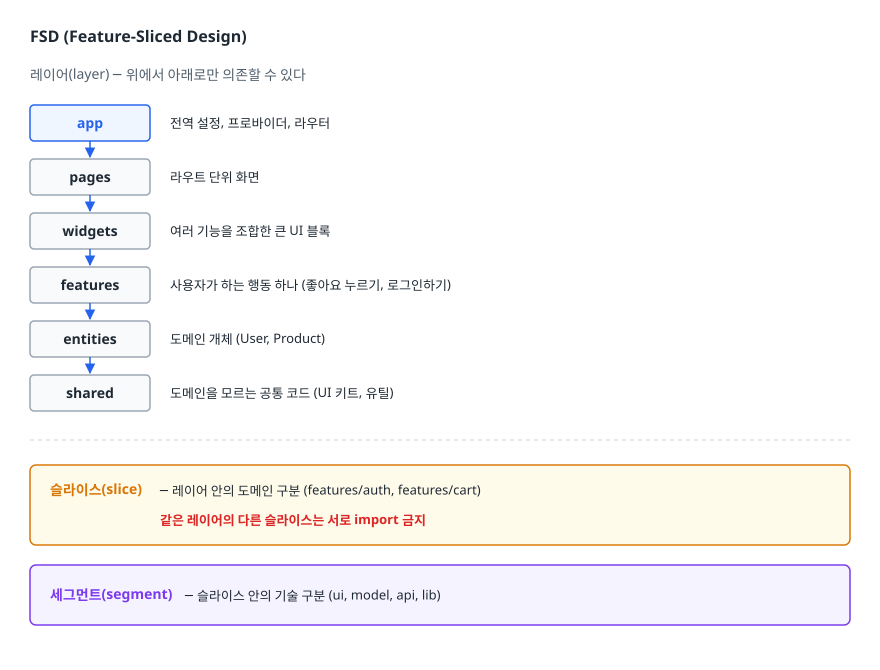
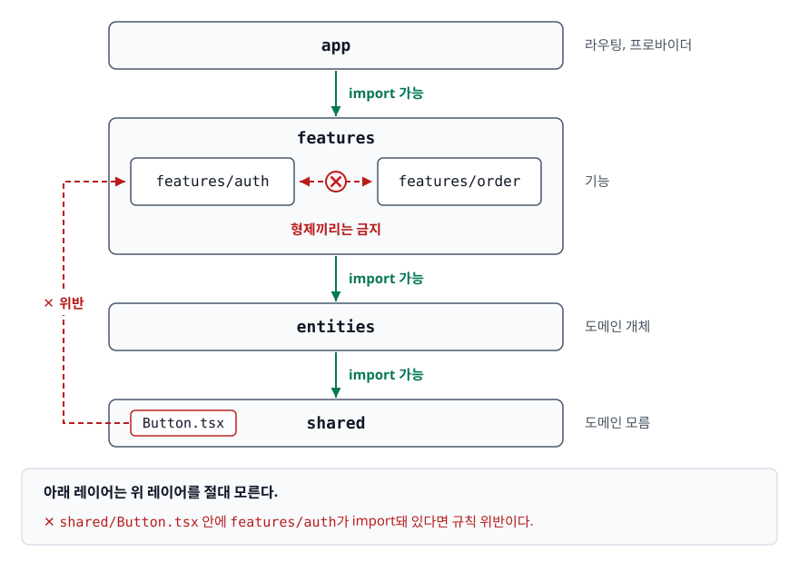
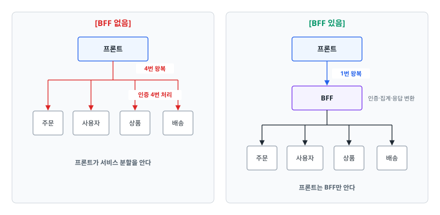

# 프로젝트 구조와 경계 (Project Structure & Boundaries)

> 폴더 구조가 규모에 따라 깨지는 지점, 기능별 구조가 기술별 구조를 이기는 이유, 의존성 방향을 도구로 강제하는 방법, 그리고 마이크로 프론트엔드를 도입해도 되는 조건을 설명할 수 있게 됩니다.

## 학습 목표

- [ ] 기술별 구조가 어느 규모에서 왜 무너지는지 구체적으로 설명할 수 있다
- [ ] 기능(feature)별 구조로 나눌 때 `/shared`로 올리는 기준을 말할 수 있다
- [ ] 아토믹 디자인과 FSD의 요점과 과설계 위험을 판단할 수 있다
- [ ] 의존성 방향 규칙을 lint 설정으로 강제하는 방법을 안다
- [ ] 마이크로 프론트엔드가 필요한 조건과 그 비용을 나열할 수 있다

## 선행 지식

- [02-component-design.md](./02-component-design.md) — 컴포넌트를 나누는 기준 (권장)
- 없어도 읽을 수 있습니다. 폴더를 만들어본 경험이면 충분하다

---

## 1. 왜 필요한가

### 파일 30개까지는 무엇을 해도 된다

프로젝트를 시작할 때는 어떤 구조를 써도 잘 굴러갑니다. 파일이 서른 개면 전부 기억할 수 있고, 어디에 무엇이 있는지 찾는 데 몇 초면 됩니다. 그래서 구조 논의는 대개 **이미 늦은 시점에** 시작됩니다.

깨지기 시작하는 증상은 매번 비슷합니다.

```
증상 1  components/ 폴더에 파일이 80개 있고, 이름만 봐서는 어느 화면 것인지 모른다
증상 2  기능 하나를 삭제하는데 어디까지 지워야 할지 몰라서 결국 안 지운다
증상 3  import 경로가 ../../../shared/utils/format 처럼 길어진다
증상 4  파일 하나를 고쳤는데 관계없어 보이는 화면이 깨진다
증상 5  새로 들어온 사람이 "이 파일 어디에 만들어야 하나요"를 매번 묻는다
```

이 다섯 개는 전부 같은 원인에서 나옵니다. **폴더가 나뉘어 있는 단위와 실제로 코드를 변경하는 단위가 어긋나 있습니다.**

### 구조의 목적은 "찾기 쉬움"이 아니다

폴더 구조를 파일 검색 문제로 생각하면 답이 안 나옵니다. 요즘 에디터는 파일명 일부만 입력해도 찾아줍니다. 진짜 목적은 **변경 범위를 예측 가능하게** 하고(이 기능을 고치면 어디까지 영향이 가는지 폴더만 봐도 알 수 있게), **삭제를 가능하게** 하고(기능을 통째로 지울 수 있어야 코드베이스가 늙지 않습니다), **의존을 통제 가능하게** 하는 것입니다. 아무 곳에서 아무 곳이나 import할 수 있으면 구조는 문서상으로만 존재합니다.

### 비유: 부엌 정리

조리 도구를 "재질별"로 정리한 부엌을 상상해보자. 금속 서랍, 플라스틱 서랍, 나무 서랍. 찾기는 명확합니다. 그런데 커피를 내리려면 세 서랍을 다 열어야 합니다. 반면 "커피 코너, 베이킹 코너"로 나누면 한 코너만 열면 됩니다. 대신 계량컵처럼 여러 코너에서 쓰는 물건을 어디에 둘지 고민이 생깁니다.

> **비유의 한계**: 부엌 도구는 하나뿐이라 한 곳에만 둘 수 있지만, 코드는 복사할 수 있습니다. 공유할지 복제할지가 선택 가능하다는 점이 코드 구조 논의를 더 어렵게 만듭니다.

---

## 2. 기술별 구조 vs 기능별 구조

### 두 구조

```
[기술별(layer-first)]                  [기능별(feature-first)]

src/                                   src/
├── components/                        ├── features/
│   ├── LoginForm.tsx                   │   ├── auth/
│   ├── SignupForm.tsx                  │   │   ├── components/LoginForm.tsx
│   ├── ProductCard.tsx                 │   │   ├── hooks/useLogin.ts
│   ├── ProductFilter.tsx               │   │   ├── api/authApi.ts
│   └── ... 76개 더                     │   │   └── types.ts
├── hooks/                              │   └── product/
│   ├── useLogin.ts                     │       ├── components/ProductCard.tsx
│   ├── useProducts.ts                  │       ├── hooks/useProducts.ts
│   └── ...                             │       └── api/productApi.ts
├── api/                                ├── shared/
│   ├── authApi.ts                      │   ├── ui/Button.tsx
│   └── productApi.ts                   │   └── lib/formatDate.ts
└── types/                              └── app/
    └── index.ts                            └── routes.tsx

로그인 폼을 고치려면 4개 폴더를 오간다     로그인 폼을 고치려면 auth/ 하나만 연다
auth 기능을 지우려면 4곳을 뒤진다          auth 기능을 지우려면 auth/를 지운다
```

### 왜 기술별 구조가 먼저 무너지나

기술별 구조가 잘못된 것은 아닙니다. **작을 때는 오히려 명확합니다.** 문제는 이 구조가 "파일의 종류"로 나뉘어 있는데, 우리가 실제로 하는 작업은 "기능"단위라는 데 있습니다.

기획자가 "로그인에 소셜 로그인을 추가해달라"고 하면 손대야 할 곳은 컴포넌트, 훅, API 함수, 타입입니다. 기술별 구조에서는 이 네 개가 서로 다른 폴더에 흩어져 있고, 각 폴더에는 관계없는 파일이 수십 개 함께 있습니다. **변경의 단위와 폴더의 단위가 다릅니다.**

더 나쁜 것은 삭제입니다. `components/` 안의 `ProductFilter.tsx`를 지워도 되는지 알려면 프로젝트 전체를 검색해야 합니다. 확신이 안 서니 안 지웁니다. 이렇게 죽은 코드가 쌓입니다.

### 비교

| 기준 | 기술별 구조 | 기능별 구조 |
|------|-----------|-----------|
| 파일 위치 규칙 | 명확하다 (종류만 보면 됨) | 판단이 필요하다 (어느 기능인가) |
| 기능 하나를 고칠 때 | 여러 폴더를 오간다 | 한 폴더에서 끝난다 |
| 기능 삭제 | 흩어진 파일을 추적해야 한다 | 폴더 하나를 지운다 |
| 공통 코드 | 자연스럽게 모인다 | `/shared` 추출 시점을 판단해야 한다 |
| 신규 인원 온보딩 | 전체를 훑어야 감이 온다 | 담당 기능 폴더만 봐도 시작 가능 |
| 유리한 규모 | 파일 수십 개, 한두 화면 | 화면 여러 개, 팀 여러 명 |

> 결론: **화면이 서너 개를 넘고 사람이 둘 이상이면 기능별로 갑니다.** 다만 현실적인 답은 혼합형입니다. 최상위를 기능으로 나누고, 기능 폴더 **안쪽**을 기술별(`components/`, `hooks/`, `api/`)로 나누면 두 구조의 장점을 함께 가져갑니다. 이때 안쪽 기술별 폴더는 파일 수가 적어서 기술별 구조의 단점이 드러나지 않습니다.

### `/shared`로 올리는 기준

기능별 구조에서 유일하게 어려운 판단입니다. 두 가지 질문으로 대부분 정리됩니다.

1. **둘 이상의 기능에서 실제로 쓰이고 있는가** — "쓰일 것 같다"는 안 됩니다. 실제 두 번째 사용처가 나타난 뒤 올립니다.
2. **도메인 지식이 들어 있는가** — `formatDate`는 도메인을 모르니 `/shared`가 맞습니다. `formatOrderStatus`는 주문 도메인을 알므로 `features/order`에 남습니다.

두 번째 조건이 더 중요합니다. **도메인 지식이 담긴 코드를 `/shared`에 올리면 `/shared`가 모든 도메인을 아는 거대한 덩어리가 됩니다.** 그러면 어떤 기능을 고쳐도 `/shared`를 건드리게 되고, `/shared`를 건드리면 모든 기능을 확인해야 합니다. 처음 피하려던 문제가 그대로 돌아옵니다.

---

## 3. 방법론 — 아토믹 디자인과 FSD

### 아토믹 디자인 (Atomic Design)

Brad Frost가 제안한 UI 구성 방법론으로, 화학의 원자·분자 비유를 빌려 컴포넌트를 다섯 단계로 나눕니다. `atoms`(Button, Input처럼 더 쪼갤 수 없는 최소 단위) → `molecules`(SearchBar처럼 atom 몇 개의 조합) → `organisms`(Header처럼 독립적으로 의미 있는 영역) → `templates`(데이터 없는 레이아웃) → `pages`(실제 데이터가 들어간 화면) 순입니다.

**얻는 것**: 디자이너와 개발자가 같은 어휘로 이야기할 수 있고 재사용 단위가 명시적입니다. 디자인 시스템을 만들 때 특히 유용합니다.

**실무에서 자주 깨지는 지점**: molecule과 organism의 경계가 주관적입니다. `SearchBar`에 자동완성 드롭다운이 붙으면 molecule인가 organism인가. 이 논쟁에 쓰는 시간이 구조에서 얻는 이득보다 클 때가 많습니다. 그래서 요즘은 다섯 단계를 다 쓰기보다 **`ui`(원자 수준의 공통 컴포넌트)와 기능별 컴포넌트 두 층으로 단순화**하는 경우가 흔합니다.

### FSD (Feature-Sliced Design)

기능별 구조를 규칙으로 정형화한 방법론입니다. 세 축으로 코드를 나눕니다.

<!-- diagram:fe-project-structure-1 -->


<!-- 위 그림이 대체한 원본 ASCII.
     내용을 고칠 때는 그림도 함께 갱신할 것.
```
레이어(layer)  ─ 위에서 아래로만 의존할 수 있다

  app       전역 설정, 프로바이더, 라우터
   │
  pages     라우트 단위 화면
   │
  widgets   여러 기능을 조합한 큰 UI 블록
   │
  features  사용자가 하는 행동 하나 (좋아요 누르기, 로그인하기)
   │
  entities  도메인 개체 (User, Product)
   │
  shared    도메인을 모르는 공통 코드 (UI 키트, 유틸)

슬라이스(slice)  ─ 레이어 안의 도메인 구분 (features/auth, features/cart)
                   같은 레이어의 다른 슬라이스는 서로 import 금지

세그먼트(segment) ─ 슬라이스 안의 기술 구분 (ui, model, api, lib)
```
-->

핵심 규칙 두 개만 기억하면 됩니다. **위 레이어는 아래 레이어만 import합니다. 같은 레이어의 형제 슬라이스끼리는 import하지 않습니다.** 두 규칙을 지키면 레이어와 슬라이스 사이에는 순환이 생길 수 없습니다. 슬라이스 하나 안에서 파일끼리 순환하는 것까지 막아주지는 않으므로, 뒤에서 볼 `import/no-cycle`은 여전히 필요합니다.

**과설계 위험**: 화면이 다섯 개인 프로젝트에 FSD를 그대로 적용하면 `features/auth/ui/LoginForm/index.ts`처럼 경로가 깊어지고, 파일 하나 만들 때마다 "이건 feature인가 entity인가"를 판단해야 합니다. 폴더 수가 실제 코드보다 빨리 늘어납니다.

### 언제 무엇을 쓰나

| 상황 | 권장 | 이유 |
|------|------|------|
| 화면 3~5개, 개인 프로젝트 | 단순 기능별 구조 (`features/`, `shared/`) | 규칙이 적을수록 빠르다 |
| 화면 10개 이상, 팀 3명 이상 | 기능별 + 레이어 규칙 (FSD의 핵심 규칙만) | 경계가 필요해지는 시점 |
| 디자인 시스템 패키지 | 아토믹 디자인 어휘 일부 차용 | 재사용 단위 소통에 유리 |
| 여러 팀이 각자 배포 | 구조를 넘어 빌드 분리 검토 | 이 문서 7절 참고 |

> 결론: **방법론은 규칙 모음이지 목표가 아닙니다.** FSD를 도입한다면 폴더 이름을 전부 따라 하기보다 "레이어 단방향 의존, 형제 슬라이스 간 import 금지" 두 규칙부터 lint로 강제하는 편이 실질적인 이득을 줍니다.

---

## 4. 의존성 방향과 경계 강제

### 순환 의존이 만드는 것

`features/order`가 `features/user`를 import하고 `features/user`도 `features/order`를 import하면 순환이 생깁니다. 폴더는 나뉘어 있지만 실제로는 하나의 덩어리입니다. 구체적으로는 어느 쪽도 혼자 **삭제할 수 없고**, 코드 스플리팅으로 나누려 해도 서로를 끌어당겨 **한 청크가 되며**, 모듈 평가 시점에 따라 한쪽이 `undefined`로 보이는 **간헐적 버그**가 생깁니다. 한쪽만 테스트하려 해도 다른 쪽까지 전부 로드됩니다.

### 단방향 규칙

<!-- diagram:fe-project-structure-2 -->


<!-- 위 그림이 대체한 원본 ASCII.
     내용을 고칠 때는 그림도 함께 갱신할 것.
```
        ┌───────────────────────────────────────────┐
        │                  app                      │  라우팅, 프로바이더
        └────────────────────┬──────────────────────┘
                             │ import 가능
        ┌────────────────────▼──────────────────────┐
        │        features/auth   features/order      │  기능
        │              │              │              │
        │              └──── X ───────┘              │  형제끼리는 금지
        └────────────────────┬──────────────────────┘
                             │ import 가능
        ┌────────────────────▼──────────────────────┐
        │                 entities                  │  도메인 개체
        └────────────────────┬──────────────────────┘
                             │ import 가능
        ┌────────────────────▼──────────────────────┐
        │                  shared                   │  도메인 모름
        └───────────────────────────────────────────┘

  아래 레이어는 위 레이어를 절대 모른다.
  shared/Button.tsx 안에 features/auth가 import돼 있다면 규칙 위반이다.
```
-->

형제 기능끼리 import를 금지하는 것이 처음엔 답답하게 느껴집니다. 주문 화면에서 사용자 정보가 필요한 상황은 흔하기 때문입니다. 해법은 두 가지입니다.

- 공통으로 필요한 개념을 **아래 레이어(entities)로 내린다** — `User` 타입과 조회 로직은 양쪽이 다 쓰므로 entities에 있는 게 맞다
- 조합은 **위 레이어에서 한다** — 주문 페이지가 `features/order`와 `features/user`를 각각 가져와 붙인다

### 규칙은 문서가 아니라 도구로 강제한다

README에 "features끼리 import하지 마세요"라고 적어두면 3개월 안에 반드시 깨집니다. 리뷰에서 매번 잡기도 어렵습니다. lint로 막아야 합니다.

```js
// eslint.config.js — 레이어 경계 강제 (plugins에 eslint-plugin-import 등록은 생략)
{
  rules: {
    // 1) 순환 의존 자체를 금지한다
    'import/no-cycle': 'error',

    // 2) 레이어별 import 방향을 지정한다
    'import/no-restricted-paths': ['error', {
      zones: [
        // shared는 어떤 상위 레이어도 몰라야 한다
        { target: './src/shared', from: './src/features',
          message: 'shared는 features를 알 수 없습니다. 필요한 값은 인자로 받으세요.' },
        { target: './src/shared', from: './src/app' },
        // entities는 features를 몰라야 한다
        { target: './src/entities', from: './src/features' },
      ],
    }],
  },
}
```

`import/no-restricted-paths`는 `eslint-plugin-import`가 제공하는 규칙으로, `target` 폴더 안에서 `from` 폴더를 import하면 에러를 냅니다. 형제 슬라이스 간 금지처럼 규칙이 많아지면 `eslint-plugin-boundaries`나 `dependency-cruiser` 같은 전용 도구가 설정을 더 간결하게 표현해줍니다.

상대 경로가 길어지는 문제는 별개로 alias를 잡아 해결합니다. `tsconfig.json`에 `"baseUrl": "."`과 `"paths": { "@/*": ["src/*"] }`를 두면 `../../../shared/lib/formatDate`가 `@/shared/lib/formatDate`가 됩니다. 다만 `tsconfig`의 `paths`는 타입 검사기가 모듈을 찾는 방식만 정할 뿐이라, 번들러가 같은 매핑을 모르면 타입 검사는 통과하는데 실행이 깨집니다. Vite와 webpack 모두 각자의 `resolve.alias`에 같은 매핑을 적어주거나, `vite-tsconfig-paths`처럼 `tsconfig`를 대신 읽어주는 플러그인을 붙여야 합니다. Next.js처럼 프레임워크가 `tsconfig`의 `paths`를 직접 읽어주는 환경도 있으니, 쓰는 도구가 어느 쪽인지 먼저 확인하는 편이 빠릅니다.

### 각 기능의 공개 API를 정한다

폴더 경계를 진짜 경계로 만들려면, **밖에서 접근 가능한 것을 명시**해야 합니다. 각 기능 폴더 루트에 `index.ts`를 두고 그것만 import하도록 규칙을 정하는 방식이 널리 쓰입니다.

```ts
// src/features/auth/index.ts — 이 기능이 밖에 공개하는 전부
export { LoginForm } from './components/LoginForm';
export { useAuth } from './hooks/useAuth';
// authApi, 내부 유틸, 내부 타입은 공개하지 않는다
```

```js
// 내부 경로 직접 접근을 금지한다
'no-restricted-imports': ['error', {
  patterns: [{
    // 기능 폴더 안쪽 경로를 전부 막는다. '@/features/auth'(루트)는 통과한다
    group: ['@/features/*/**'],
    message: 'features는 폴더 루트(index.ts)를 통해서만 import하세요.',
  }],
}],
```

이렇게 하면 `features/auth` 내부 구조를 마음대로 리팩터링해도 밖이 안 깨집니다. 자바에서 `public`과 `private`을 구분하는 것과 같은 발상입니다.

---

## 5. 관심사 분리 — API 응답이 컴포넌트까지 새어 나오지 않게

### 안티패턴

```tsx
// 안티패턴 — 컴포넌트가 HTTP와 백엔드 응답 형태를 직접 안다
function UserProfile({ id }) {
  const [user, setUser] = useState(null);
  useEffect(() => {
    axios.get(`/api/v1/users/${id}`).then((res) => setUser(res.data.data));
  }, [id]);

  return (
    <div>
      <h1>{user?.user_name}</h1>
      <p>가입일: {new Date(user?.created_at * 1000).toLocaleDateString()}</p>
    </div>
  );
}
```

### 왜 문제인가

1. **백엔드 변경이 UI까지 번진다** — 응답이 `data.data`에서 `data.result`로 바뀌거나 `user_name`이 `name`으로 바뀌면 이 필드를 쓰는 컴포넌트를 전부 찾아 고쳐야 합니다.
2. **백엔드 사정이 프론트 코드에 새어 들어온다** — `snake_case`, 유닉스 타임스탬프, 응답 봉투(`data.data`)는 전부 백엔드 규약이지 프론트의 도메인 모델이 아닙니다.
3. **테스트가 무거워지고 재사용이 막힌다** — 이 컴포넌트를 테스트하려면 HTTP를 흉내 내야 하고, 같은 사용자 정보가 다른 화면에서도 필요하면 이 `useEffect`를 복사하게 됩니다.

### 개선

```ts
// src/entities/user/api.ts — 데이터 접근 계층
interface UserResponse { user_name: string; created_at: number; }  // 백엔드가 주는 모양
export interface User { name: string; joinedAt: Date; }            // 우리가 쓰는 모양

const toUser = (res: UserResponse): User => ({
  name: res.user_name,
  joinedAt: new Date(res.created_at * 1000),
});

export async function fetchUser(id: string): Promise<User> {
  const { data } = await http.get<{ data: UserResponse }>(`/api/v1/users/${id}`);
  return toUser(data.data);
}
```

```ts
// src/entities/user/model.ts — 비즈니스 로직 계층
export function useUser(id: string) {
  return useQuery({ queryKey: ['user', id], queryFn: () => fetchUser(id) });
}
```

```tsx
// src/features/profile/ui/UserProfile.tsx — UI 계층. HTTP도 응답 형태도 모른다
function UserProfile({ id }: { id: string }) {
  const { data: user } = useUser(id);
  if (!user) return <Spinner />;
  return <div><h1>{user.name}</h1><p>{user.joinedAt.toLocaleDateString()}</p></div>;
}
```

**백엔드가 필드명을 바꿔도 고칠 곳은 `toUser` 한 함수**입니다. 백엔드의 Entity를 그대로 노출하지 않고 DTO로 변환해 내보내는 것과 정확히 같은 사고이며, 방향만 반대입니다.

---

## 6. Monolithic, MSA, BFF가 프론트에 미치는 영향

백엔드 아키텍처는 프론트엔드의 데이터 접근 계층 모양을 직접 결정합니다.

**모놀리식 백엔드**에서는 서버 하나가 화면에 필요한 데이터를 대체로 한 번에 줍니다. 프론트의 API 계층은 단순합니다.

**MSA**로 나뉘면 이야기가 달라집니다. 주문 상세 화면 하나를 그리려고 주문·사용자·상품·배송 서비스를 각각 호출하고 프론트에서 합쳐야 합니다. 그러면 세 가지 문제가 생깁니다. 요청 왕복이 늘어 느려지고, 인증 처리가 서비스마다 반복되고, **프론트가 백엔드 내부 분할 구조를 알게 됩니다.** 서비스를 하나 더 쪼개면 프론트도 따라 고쳐야 합니다.

**BFF(Backend For Frontend)**는 그 앞에 클라이언트 전용 서버를 하나 두는 방식입니다.

<!-- diagram:fe-project-structure-3 -->


<!-- 위 그림이 대체한 원본 ASCII.
     내용을 고칠 때는 그림도 함께 갱신할 것.
```
[BFF 없음]                             [BFF 있음]

  ┌──────────┐                          ┌──────────┐
  │ 프론트   │                          │ 프론트   │
  └────┬─────┘                          └────┬─────┘
   ┌───┼───┬────┐  4번 왕복                  │ 1번 왕복
   ▼   ▼   ▼    ▼  인증 4번 처리        ┌────▼─────┐
 주문 사용자 상품 배송                   │   BFF    │ 인증·집계·응답 변환
                                        └────┬─────┘
  프론트가 서비스 분할을 안다          ┌───┼───┬────┐
                                       ▼   ▼   ▼    ▼
                                     주문 사용자 상품 배송

                                     프론트는 BFF만 안다
```
-->

BFF는 공짜가 아닙니다. **BFF가 죽으면 프론트 전체가 멈춥니다(SPOF, 단일 장애점).** 완화 수단은 백엔드 쪽 관례를 그대로 따릅니다. 인스턴스를 여러 개 띄우고 로드 밸런서를 앞에 두기, health check로 비정상 인스턴스를 빼기, 배포 중 요청 유실을 막는 graceful shutdown, 하위 서비스 장애가 번지지 않도록 타임아웃·서킷 브레이커·폴백을 두기, 그리고 웹용·모바일용 BFF를 나눠 장애를 격리하기입니다.

Next.js의 Route Handler나 서버 컴포넌트가 사실상 경량 BFF 역할을 하는 경우도 많습니다. 프론트 팀이 별도 서버 없이 집계 계층을 가질 수 있다는 점이 이 방식의 매력입니다.

---

## 7. 마이크로 프론트엔드가 실제로 필요한 조건

### 무엇인가

한 화면을 **여러 팀이 각자 빌드·배포한 조각으로 조립**하는 방식입니다. Webpack Module Federation처럼 런타임에 다른 번들의 모듈을 불러오는 기술이 대표적이고, iframe이나 라우트 단위 분리처럼 더 단순한 방법도 있습니다.

### 비용부터 본다

도입하면 다음 항목이 전부 팀의 일이 됩니다.

- **중복 번들** — 각 조각이 React를 따로 들고 오지 않게 공유 설정을 맞춰야 한다
- **버전 스큐(skew)** — A팀이 React를 올리고 B팀이 안 올리면 한 페이지에 두 버전이 공존한다
- **디자인 일관성** — 공통 디자인 시스템을 별도 패키지로 배포하고 버전을 관리해야 한다
- **통합 테스트** — 조각 각각은 통과하는데 합치면 깨지는 상황을 잡을 방법이 필요하다
- **라우팅·인증 공유** — 어느 조각이 라우터를 소유하고, 토큰을 어떻게 나눌지 정해야 한다
- **디버깅 난이도** — 에러 스택이 여러 배포 산출물에 걸친다

### 필요 조건

아래를 **전부** 만족할 때만 이득이 비용을 넘습니다.

1. **조직 경계가 이미 나뉘어 있다** — 코드가 커서가 아니라, 팀이 여럿이고 각자 오너십이 있다
2. **배포 주기가 실제로 다르다** — A팀은 하루 세 번, B팀은 2주에 한 번 배포하고, 서로를 기다리는 것이 실제 병목이다
3. **화면 경계가 팀 경계와 일치한다** — 한 화면 안에서 두 팀이 같은 컴포넌트를 고쳐야 한다면 조각을 나눠도 조율 비용은 그대로다
4. **점진적 마이그레이션이 필요하다** — 레거시를 한 번에 못 걷어내고 화면 단위로 새 스택으로 옮겨야 하는 상황. 마이크로 프론트엔드를 도입하는 가장 설득력 있는 이유다

### 그렇지 않다면

단일 팀이 "코드베이스가 커서" 도입하는 것은 거의 항상 손해입니다. 그 문제는 **모노레포와 패키지 경계, lint로 강제한 의존성 규칙**으로 대부분 해결됩니다. 빌드가 하나로 유지되므로 버전 스큐도 중복 번들도 없습니다.

바꿔 말하면 마이크로 프론트엔드는 **기술 문제의 해법이 아니라 조직 문제의 해법**입니다. 조직이 나뉘지 않았는데 도입하면 조직 문제 없이 분산 시스템 비용만 치르게 됩니다. MSA에 대해 백엔드에서 하는 이야기와 정확히 같습니다.

---

## 8. 실무에서는

- **구조는 처음부터 완성하지 않습니다.** 화면 두세 개일 때 FSD 폴더를 전부 만들어두면 빈 폴더만 늘어납니다. `features/`와 `shared/` 둘로 시작해서, 실제로 아픈 지점이 생겼을 때 규칙을 추가하는 순서가 현실적입니다.
- **경계를 새로 정하는 것보다 지키게 만드는 것이 어렵습니다.** 새 규칙을 도입할 때는 lint를 `error`가 아니라 `warn`으로 켜고 기존 위반을 목록화한 뒤, 새로 추가되는 코드부터 막는 방식이 마찰이 적습니다.
- **모노레포는 구조 문제의 흔한 다음 단계입니다.** pnpm workspace나 Turborepo로 디자인 시스템·유틸을 별도 패키지로 떼어내면, 폴더 규칙이 아니라 `package.json`의 의존성으로 경계가 강제됩니다. 어기면 lint가 아니라 빌드가 실패합니다.
- **Next.js App Router는 라우팅을 파일 구조에 묶습니다.** `app/` 폴더가 라우트를 결정하므로 기능별 구조와 충돌하는 것처럼 보이는데, 실무에서는 `app/`을 얇은 진입점으로 두고 실제 구현을 `features/`나 `src/`의 기능 폴더에 두는 방식이 많이 쓰입니다. 라우팅 방식은 [../nextjs-rendering/01-csr-ssr-ssg-isr.md](../nextjs-rendering/01-csr-ssr-ssg-isr.md)를 함께 보면 이해가 빠릅니다.

---

## 9. 면접 포인트

> 면접에서 이 주제가 나오면 이렇게 답한다

**Q. 프론트엔드 폴더 구조를 어떻게 설계하나요?**
A. 최상위를 기능(도메인)으로 나누고 기능 폴더 안쪽만 기술별로 나눕니다. 기술별로만 나누면 `components/`에 파일이 수십 개 쌓이고, 기능 하나를 고치려고 네 폴더를 오가야 하고, 무엇보다 기능을 통째로 삭제할 수 없게 됩니다. 기능별로 나누면 변경과 삭제가 폴더 단위로 떨어집니다. 공통 코드는 `/shared`로 올리되 실제 두 번째 사용처가 생겼을 때, 그리고 도메인 지식이 없는 것만 올립니다.
- 꼬리 질문: "도메인 지식이 있는 공통 코드는요?" → 두 기능이 같은 도메인 개체를 다룬다면 그건 공통 유틸이 아니라 별도 도메인 계층(entities)으로 내려야 할 신호라고 답합니다.

**Q. 의존성 방향을 어떻게 관리하나요?**
A. 상위 레이어가 하위 레이어만 import하고 하위는 상위를 모르게 하는 단방향 규칙을 두고, 같은 레이어의 형제 기능끼리도 직접 import를 막습니다. 중요한 건 이 규칙을 문서가 아니라 도구로 강제하는 겁니다. `eslint-plugin-import`의 `no-restricted-paths`로 방향을 지정하고 `no-cycle`로 순환을 막습니다. 각 기능 폴더에 `index.ts`를 두고 내부 경로 직접 접근을 금지하면 폴더가 공개 API를 가진 모듈처럼 동작합니다.
- 꼬리 질문: "순환 의존이 왜 위험한가요?" → 코드 스플리팅이 안 되고, 모듈 평가 순서에 따라 한쪽이 `undefined`로 보이는 간헐적 버그가 생기며, 어느 쪽도 혼자 삭제할 수 없게 된다고 답합니다.

**Q. FSD나 아토믹 디자인 같은 방법론을 도입해야 하나요?**
A. 규모에 따라 다릅니다. 방법론이 주는 진짜 가치는 폴더 이름이 아니라 규칙인데, FSD의 경우 "레이어 단방향, 형제 슬라이스 간 import 금지" 두 가지가 핵심입니다. 화면이 다섯 개인 프로젝트에 전체 레이어를 다 만들면 폴더가 코드보다 빨리 늘고, 파일 하나 만들 때마다 feature인지 entity인지 판단하는 비용이 생깁니다. 저는 단순한 기능별 구조로 시작해서 경계 위반이 실제로 문제를 일으킬 때 규칙을 lint로 추가하는 쪽을 택합니다.
- 꼬리 질문: "아토믹 디자인의 단점은?" → molecule과 organism의 경계가 주관적이라 논쟁 비용이 크다고 답합니다. 디자인 시스템의 공통 어휘로는 유용하지만 애플리케이션 폴더 구조로 그대로 쓰기에는 애매합니다.

**Q. 마이크로 프론트엔드를 도입하는 기준은 뭔가요?**
A. 코드베이스 크기가 아니라 조직 구조가 기준입니다. 팀이 여럿이고 각자 오너십이 있고 배포 주기가 실제로 다르며, 서로를 기다리는 것이 병목일 때 의미가 있습니다. 레거시를 화면 단위로 점진 마이그레이션해야 하는 경우도 설득력 있는 이유입니다. 반대로 단일 팀에서 코드가 크다는 이유로 도입하면 버전 스큐, 중복 번들, 통합 테스트 부담만 떠안습니다. 그 문제는 모노레포와 lint로 강제한 의존성 경계로 해결하는 편이 낫습니다.
- 꼬리 질문: "MSA와 같은 논리인가요?" → 그렇다고 답합니다. 둘 다 조직 문제의 해법이지 기술 문제의 해법이 아니고, 조직이 안 나뉘었는데 도입하면 분산 시스템 비용만 남습니다.

---

## 자주 하는 실수

| 실수 | 왜 틀렸나 | 올바른 이해 |
|------|----------|-----------|
| "좋은 폴더 구조는 파일을 빨리 찾기 위한 것" | 파일 찾기는 에디터가 해준다 | 변경 범위 예측, 삭제 가능성, 의존 통제가 목적이다 |
| "공통일 것 같으면 미리 `/shared`에 둔다" | 사용처가 하나뿐인데 공유 폴더에 있으면 아무도 못 지운다 | 두 번째 사용처가 실제로 생겼을 때 올린다 |
| "`/shared`에는 자주 쓰는 걸 다 넣는다" | 도메인 지식이 담긴 코드가 들어가면 `/shared`가 모든 도메인을 아는 덩어리가 된다 | 도메인을 모르는 코드만 올린다 |
| "구조 규칙은 README에 적어두면 된다" | 리뷰로 매번 잡을 수 없어 몇 달 안에 깨진다 | lint 규칙과 alias, 폴더별 `index.ts`로 강제한다 |
| "FSD를 쓰면 구조가 좋아진다" | 폴더 이름을 따라 하는 것과 규칙을 지키는 것은 다르다 | 레이어 단방향과 슬라이스 격리 규칙이 본질이다 |
| "코드베이스가 커지면 마이크로 프론트엔드로 나눈다" | 조직이 안 나뉘었으면 분산 비용만 늘어난다 | 배포 주기가 다른 여러 팀이 있을 때 의미가 있다 |
| "BFF를 두면 무조건 좋아진다" | BFF 자체가 단일 장애점이 되고 배포 대상이 하나 늘어난다 | 다중 인스턴스·health check·서킷 브레이커까지 함께 설계해야 한다 |

---

## 한 줄 정리

프로젝트 구조의 목적은 **변경과 삭제의 단위를 폴더 단위와 일치시키는 것**이고, 기능별로 나누는 것이 그 출발점이며, 정해둔 의존성 방향을 lint로 강제하지 않으면 어떤 구조도 몇 달 안에 문서상으로만 남습니다.

---

## 연관 개념

- [01-state-management.md](./01-state-management.md) - 상태와 API 호출 코드를 어느 계층에 둘 것인가
- [02-component-design.md](./02-component-design.md) - 폴더에 넣기 전에 컴포넌트를 어떻게 나눌 것인가
- [qna-frontend-architecture.md](./qna-frontend-architecture.md) - 폴더 구조·의존성 방향·MSA/BFF 면접 질문(Q1, Q2, Q4, Q7)
- [../nextjs-rendering/01-csr-ssr-ssg-isr.md](../nextjs-rendering/01-csr-ssr-ssg-isr.md) - 라우팅 방식이 폴더 구조에 주는 제약
- [../nextjs-rendering/03-server-components.md](../nextjs-rendering/03-server-components.md) - 서버 컴포넌트가 데이터 접근 계층의 위치를 바꾸는 지점
- [../typescript/qna-typescript.md](../typescript/qna-typescript.md) - API 응답 타입과 도메인 타입을 분리해 선언하는 방법
