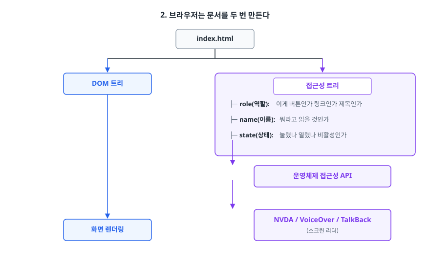
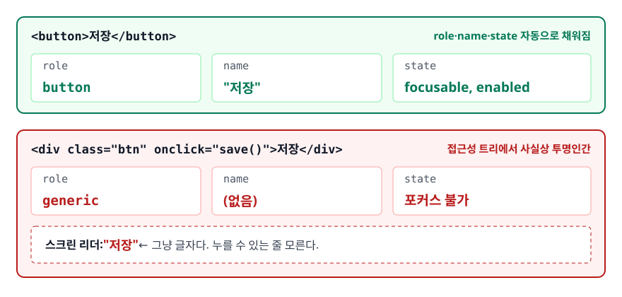
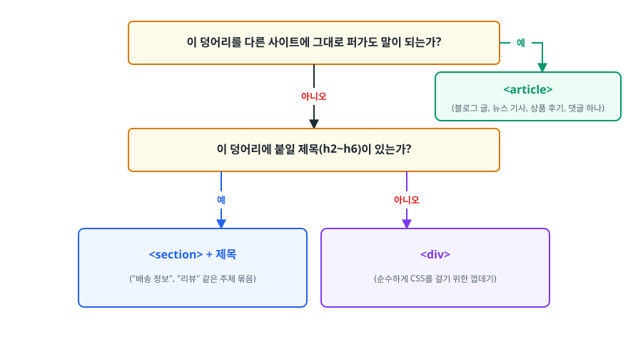
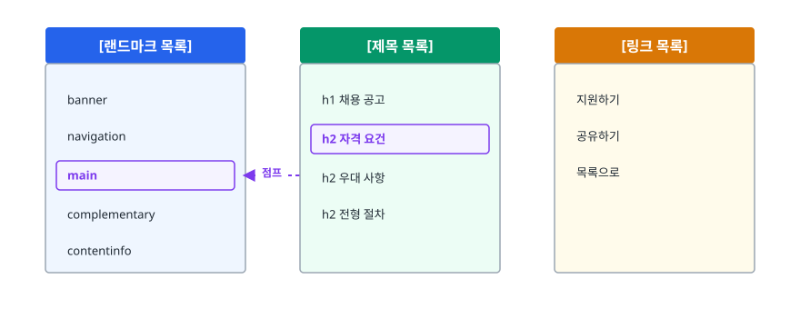

# 시맨틱 HTML과 웹 접근성 (Semantic HTML & Web Accessibility)

> `<div>`로도 화면은 똑같이 나오는데 왜 `<button>`을 써야 하는지, 스크린 리더가 실제로 무엇을 읽는지, ARIA를 "안 쓰는 것"이 왜 최선인지를 다룹니다. 이 문서가 따지는 것은 화면 모양이 아니라 마크업이 전하는 정보입니다.

## 학습 목표

- [ ] div 수프가 만드는 문제를 코드로 지적하고 시맨틱 태그로 고칠 수 있다
- [ ] DOCTYPE, `lang`, `meta charset`이 각각 브라우저의 어떤 동작을 바꾸는지 말할 수 있다
- [ ] 접근성 트리(accessibility tree)가 DOM과 어떻게 다른지 설명할 수 있다
- [ ] ARIA를 써야 할 때와 쓰면 안 되는 때를 구분할 수 있다
- [ ] 시맨틱 마크업이 SEO에 기여하는 범위를 과장 없이 말할 수 있다

## 선행 지식

- HTML 태그를 열고 닫는 기본 문법
- 그 외에는 없음 — 프론트엔드가 처음이어도 이 문서부터 시작해도 됩니다

---

## 1. 왜 필요한가

### div 수프

실무에서 가장 흔히 보는 마크업은 이런 모양입니다.

```html
<div class="header">
  <div class="nav">
    <div class="nav-item" onclick="go('/about')">소개</div>
  </div>
</div>
<div class="content">
  <div class="title">2026년 상반기 채용 공고</div>
  <div class="post">...</div>
</div>
<div class="footer">...</div>
```

CSS만 붙이면 화면은 완벽하게 나옵니다. 그래서 문제가 없어 보이지만, 진짜 문제는 **화면을 눈으로 보지 않는 이용자**에게 드러납니다. 이 마크업을 읽는 주체는 사람의 눈만이 아닙니다.

1. **스크린 리더** — 시각장애 이용자가 쓰는 보조기술. `<div>`는 "아무 의미 없는 상자"라서 읽을 것이 텍스트밖에 없습니다. "소개"라는 글자는 읽히지만 그게 **누를 수 있는 것인지** 알 방법이 없습니다.
2. **키보드** — 마우스를 못 쓰거나 안 쓰는 이용자. `<div>`는 Tab 키로 포커스가 가지 않습니다. 위 코드에서 "소개"는 마우스로만 클릭 가능합니다.
3. **검색 엔진 크롤러** — 어느 글자가 제목이고 어디부터가 본문인지 구조로 판단합니다. `class="title"`은 개발자만 아는 이름이라 크롤러에게 아무 의미가 없습니다.
4. **브라우저 기능** — Safari 리더 모드, 번역기, 나중에 붙일 수도 있는 AI 에이전트까지 전부 태그 이름으로 본문 영역을 추정합니다.

### 라벨 없는 이삿짐 박스

이사할 때 똑같이 생긴 박스 100개에 아무 라벨도 안 붙이면, 짐을 싼 본인은 대충 기억하지만 도와주러 온 사람은 전부 열어봐야 합니다. 시맨틱 태그는 라벨입니다. 박스마다 "주방", "옷", "책"이라고 써 붙이는 일입니다.

> **비유의 한계**: 라벨은 내용물을 그대로 둡니다. 시맨틱 태그는 다릅니다. **브라우저의 기본 동작까지 바꿉니다.** `<button>`으로 쓰는 순간 Tab 포커스, Enter/Space 키 실행, 눌린 상태 표현이 공짜로 따라옵니다. 라벨보다 훨씬 강력합니다.

### 고친 코드

```html
<header>
  <nav aria-label="주요 메뉴">
    <a href="/about">소개</a>
  </nav>
</header>
<main>
  <h1>2026년 상반기 채용 공고</h1>
  <article>...</article>
</main>
<footer>...</footer>
```

바뀐 것은 태그 이름뿐인데, 얻은 것은 이렇습니다. `<a href>`는 Tab으로 포커스가 가고, Enter로 이동하며, 스크린 리더가 "링크, 소개"라고 읽어 줍니다. `<main>` 덕분에 스크린 리더 이용자는 단축키 한 번으로 메뉴를 건너뛰고 본문으로 점프할 수 있습니다. `<h1>`은 크롤러에게 "이 페이지의 주제"로 읽힙니다. **JavaScript 한 줄, CSS 한 줄 없이 얻은 결과입니다.**

---

## 2. 브라우저는 문서를 두 번 만든다

HTML을 파싱한 브라우저는 DOM 트리만 만드는 게 아닙니다. 그 옆에 **접근성 트리(accessibility tree)** 를 하나 더 만들어 운영체제의 접근성 API에 노출합니다. 스크린 리더가 읽는 것은 DOM이 아니라 이 트리입니다.

<!-- diagram:fe-semantic-html-a11y-1 -->


<!-- 위 그림이 대체한 원본 ASCII.
     내용을 고칠 때는 그림도 함께 갱신할 것.
```
       index.html
           │
     ┌─────┴─────┐
     ↓           ↓
  DOM 트리   접근성 트리
     │           │
     │           ├─ role(역할):  이게 버튼인가 링크인가 제목인가
     │           ├─ name(이름):  뭐라고 읽을 것인가
     │           ├─ state(상태): 눌렸나 열렸나 비활성인가
     │           ↓
     │      운영체제 접근성 API
     │           ↓
     ↓      NVDA / VoiceOver / TalkBack
  화면 렌더링        (스크린 리더)
```
-->

시맨틱 태그를 쓰면 `role`, `name`, `state`가 **자동으로** 채워집니다. `<div>`를 쓰면 role이 `generic`이 되고, 이 트리에서 사실상 투명인간이 됩니다.

<!-- diagram:fe-semantic-html-a11y-2 -->


<!-- 위 그림이 대체한 원본 ASCII.
     내용을 고칠 때는 그림도 함께 갱신할 것.
```
<button>저장</button>
  → role=button, name="저장", state=(focusable, enabled)

<div class="btn" onclick="save()">저장</div>
  → role=generic, name=(없음), state=(포커스 불가)
     스크린 리더: "저장"  ← 그냥 글자다. 누를 수 있는 줄 모른다.
```
-->

---

## 3. 문서의 뼈대: DOCTYPE과 meta

### DOCTYPE은 버전 표시가 아니라 스위치다

`<!DOCTYPE html>` 한 줄이 하는 일은 "이 문서는 HTML5입니다"라는 선언이 아닙니다. **브라우저의 렌더링 모드를 고르는 스위치**입니다.

| | 표준 모드(Standards) | 쿼크 모드(Quirks) |
|---|---|---|
| 조건 | DOCTYPE 있음 | DOCTYPE 없음/잘못됨 |
| `width` 계산 | content 영역만 | 일반 요소는 같음(padding·border 포함은 옛 IE 방식이고, 현대 브라우저는 텍스트 입력 요소 정도만 해당) |
| 그 외 | 스펙대로 | 90년대 호환을 위한 예외 규칙 다수 |

> 결론: DOCTYPE을 빼먹으면 **줄 높이·% 높이·표 계산 같은 규칙이 옛 방식으로 바뀌어** 레이아웃이 무너집니다. 서버가 HTML을 조립해 내려주는 환경(Thymeleaf, JSP, Next.js 등)에서도 최종 응답 HTML의 첫 줄에 반드시 있어야 합니다.

### `lang`은 장식이 아니다

```html
<html lang="ko">
```

이 속성이 없으면 스크린 리더는 자기 기본 언어(대개 영어) 발음 엔진으로 한국어를 읽습니다. 실제로 들어보면 알아들을 수 없는 소리가 납니다. 브라우저 번역 기능과 검색 엔진의 언어 판별에도 쓰입니다. **한 글자 고쳐서 얻는 접근성 개선 중 가장 효율이 좋습니다.**

### `meta charset`은 왜 맨 위에 있어야 하나

```html
<meta charset="UTF-8">
```

브라우저는 인코딩을 알기 전까지 바이트를 글자로 바꿀 수 없습니다. 그래서 본격적인 파싱에 앞서 문서 앞부분의 바이트를 먼저 훑어 `charset` 선언을 찾습니다. 이 사전 검사 범위가 문서 시작 1024바이트이고, HTML 스펙도 인코딩 선언이 그 안에 들어가야 한다고 정하고 있습니다. 선언을 그 뒤로 밀어두면 브라우저는 추측한 인코딩으로 파싱을 시작했다가 뒤늦게 선언을 만나 **문서를 처음부터 다시 파싱합니다**. `<head>`의 첫 줄에 두는 관행은 여기서 나왔습니다.

### 그 밖에 실제로 값을 하는 meta

```html
<meta name="viewport" content="width=device-width, initial-scale=1">
<meta name="description" content="검색 결과 스니펫에 그대로 노출되는 설명">
<meta property="og:title" content="SNS 공유 시 카드에 뜨는 제목">
```

`viewport`는 반응형의 전제 조건이라 [03-responsive-specificity.md](./03-responsive-specificity.md)에서 따로 다룹니다. `description`은 랭킹 요소는 아니지만 검색 결과에 보이는 문구라 클릭률에 직접 영향을 줍니다. 반면 `<meta name="keywords">`는 오래전부터 주요 검색 엔진이 무시합니다. 아직도 SEO 팁으로 돌아다니지만 넣어봐야 얻는 것이 없습니다.

---

## 4. 시맨틱 태그 지도

| 태그 | 암묵적 역할 | 이렇게 쓴다 | 흔한 오용 |
|------|------------|------------|----------|
| `<header>` | banner | 페이지/섹션 머리말 | 페이지마다 여러 개 두고 전부 사이트 헤더로 취급 |
| `<nav>` | navigation | 주요 탐색 링크 묶음 | 링크만 보이면 다 감싸기(푸터 링크 몇 개까지 `<nav>`) |
| `<main>` | main | 본문. **문서당 하나** | 두 개 이상 두거나 아예 안 씀 |
| `<article>` | article | 떼어내도 말이 되는 콘텐츠 | 그냥 카드 UI 껍데기로 씀 |
| `<section>` | region(이름 있을 때) | 제목을 가진 주제 묶음 | 제목 없이 `<div>` 대용으로 씀 |
| `<aside>` | complementary | 본문과 분리 가능한 부가 정보 | 단순히 "오른쪽에 있어서" 씀 |
| `<footer>` | contentinfo | 페이지/섹션 꼬리말 | — |
| `<button>` | button | **동작을 실행**한다 | `<div onclick>`으로 대체 |
| `<a href>` | link | **다른 곳으로 이동**한다 | `href` 없이 `<a onclick>` |

> 표 요약: 표의 "암묵적 역할"은 **그 태그가 `<article>`, `<aside>`, `<main>`, `<nav>`, `<section>` 같은 구획 요소 안에 중첩되지 않았을 때** 기준입니다. 중첩되면 `<header>`와 `<footer>`는 banner·contentinfo 대신 `generic`이 되고, `<aside>`는 `<main>` 안에서는 그대로 complementary지만, 다른 구획 요소 안에서는 `aria-label` 같은 이름이 따로 붙어 있지 않으면 `generic`으로 내려갑니다. 뒤집어 말하면 카드 컴포넌트 안의 `<header>`가 자동으로 사이트 헤더가 되는 일은 없으니 겁내지 말고 써도 됩니다.

### section인가 article인가 div인가

가장 많이 헷갈리는 지점이라 판별 순서를 정해두면 편합니다.

<!-- diagram:fe-semantic-html-a11y-3 -->


<!-- 위 그림이 대체한 원본 ASCII.
     내용을 고칠 때는 그림도 함께 갱신할 것.
```
이 덩어리를 다른 사이트에 그대로 퍼가도 말이 되는가?
   │
   ├─ 예 ──────────────────→ <article>
   │                          (블로그 글, 뉴스 기사, 상품 후기, 댓글 하나)
   │
   └─ 아니오
        │
        이 덩어리에 붙일 제목(h2~h6)이 있는가?
           │
           ├─ 예 ─────────→ <section> + 제목
           │                 ("배송 정보", "리뷰" 같은 주제 묶음)
           │
           └─ 아니오 ──────→ <div>
                             (순수하게 CSS를 걸기 위한 껍데기)
```
-->

**`<div>`를 쓰는 게 정답인 경우가 분명히 있습니다.** flex 컨테이너가 하나 더 필요해서 감싸는 껍데기에 억지로 `<section>`을 붙이면, 스크린 리더의 랜드마크 목록만 의미 없이 길어집니다. 시맨틱 마크업은 "div를 없애는 일"이 아니라 "의미가 있는 곳에만 의미를 붙이는 일"입니다.

### 안티패턴 1 — 클릭되는 div

```html
<!-- 안티패턴 -->
<div class="btn" onclick="submitForm()">제출</div>
```

**왜 문제인가**: Tab으로 도달할 수 없습니다. Enter/Space로 실행되지 않고, 스크린 리더가 버튼으로 알리지도 않고, `disabled`도 못 씁니다. 이걸 `<div>`로 흉내 내려면 `tabindex="0"`, `role="button"`, keydown 핸들러, `aria-disabled`를 전부 직접 붙여야 합니다. 네 줄로 될 일을 스무 줄로 만드는 셈입니다.

```html
<!-- 개선 -->
<button type="submit">제출</button>
```

`<form>` 안의 `<button>`은 `type`을 안 적으면 기본값이 `submit`이라, 단순 토글 버튼에서 의도치 않게 폼이 전송되는 사고가 자주 납니다. **폼 안의 버튼에는 `type`을 항상 명시하는 습관**을 들이는 게 좋습니다.

### 안티패턴 2 — 글자 크기 때문에 고른 heading

```html
<!-- 안티패턴 -->
<h1>회사 소개</h1>
<h4>연혁</h4>          <!-- h2가 너무 커 보여서 h4로 -->
<div class="big-text">비전</div>  <!-- 제목인데 크기 맞추려고 div -->
```

**왜 문제인가**: heading은 문서의 **목차**입니다. 스크린 리더 이용자는 heading만 훑어서 페이지 구조를 파악하고 원하는 곳으로 점프하는데, 레벨이 튀면 목차가 어그러집니다. `h1` 다음에 `h4`가 오면 "중간에 뭔가 놓쳤나?" 하고 되돌아가게 됩니다.

```html
<!-- 개선: 레벨은 구조로 정하고, 크기는 CSS로 맞춘다 -->
<h1>회사 소개</h1>
<h2>연혁</h2>
<h2>비전</h2>
```

```css
h2 { font-size: 1.25rem; }
```

레벨은 의미, 크기는 표현. 이 둘을 분리하는 것이 웹 표준이 말하는 "구조와 표현의 분리"의 가장 구체적인 사례입니다.

---

## 5. 스크린 리더는 어떻게 읽는가

스크린 리더 이용자가 페이지를 위에서 아래로 한 줄씩 다 듣는다고 생각하기 쉬운데, 실제로는 **훑어 읽습니다.** 눈으로 페이지를 스캔하는 것과 같은 일을 단축키로 합니다.

<!-- diagram:fe-semantic-html-a11y-4 -->


<!-- 위 그림이 대체한 원본 ASCII.
     내용을 고칠 때는 그림도 함께 갱신할 것.
```
[랜드마크 목록]              [제목 목록]                [링크 목록]
 banner                       h1 채용 공고               지원하기
 navigation                    h2 자격 요건              공유하기
 main            ←점프          h2 우대 사항              목록으로
 complementary                 h2 전형 절차
 contentinfo
```
-->

이 세 목록은 전부 **마크업에서 자동 생성됩니다.** `<div>`만 쓴 페이지는 세 목록이 모두 비어 있어서, 이용자는 처음부터 끝까지 순서대로 듣는 수밖에 없습니다. 광고와 메뉴를 20초쯤 듣고서야 본문에 도착하는 경험이라고 생각하면 됩니다.

### alt 텍스트: 없는 것과 빈 것은 다르다

```html

           <!-- 장식 이미지: 일부러 비운다 -->
                     <!-- 안티패턴: alt 자체가 없다 -->
```

**왜 문제인가**: `alt` 속성이 아예 없으면 스크린 리더는 대신 읽을 게 없어 파일명("로고 점 피엔지")을 읽어버리는 경우가 많습니다. 반대로 `alt=""`는 "이 이미지는 정보가 없으니 건너뛰라"는 **명시적인 지시**라 조용히 무시됩니다. 장식 이미지에는 반드시 `alt=""`를 적습니다.

`alt`에 "이미지", "사진" 같은 단어를 넣는 것도 불필요합니다. 스크린 리더가 이미 "그래픽"이라고 알려준 뒤에 내용을 읽기 때문에 "그래픽, 매출 그래프 이미지"처럼 중복됩니다.

### 폼: label을 붙이는 두 가지 방법

```html
<!-- 방법 1: for와 id 연결 -->
<label for="email">이메일</label>
<input type="email" id="email" name="email">

<!-- 방법 2: 감싸기 (id가 필요 없다) -->
<label>이메일 <input type="email" name="email"></label>
```

`placeholder`는 label의 대체재가 아닙니다. 입력을 시작하면 사라지므로 "내가 지금 뭘 입력하는 중이었지?"를 확인할 방법이 없고, 회색 저대비 텍스트라 읽기도 어렵습니다. **placeholder는 예시(`010-0000-0000`)를 보여주는 용도로만 씁니다.**

### 포커스 링을 지우지 마라

```css
/* 안티패턴 */
*:focus { outline: none; }
```

**왜 문제인가**: 키보드 이용자에게 outline은 "지금 내가 어디 있는지" 알려주는 유일한 단서입니다. 이걸 지우면 마우스 커서를 지운 채로 컴퓨터를 쓰라는 것과 같습니다. 디자이너가 "테두리가 보기 싫다"고 하는 건 대개 **마우스로 클릭했을 때도 링이 뜨는 것**이 거슬려서입니다.

```css
/* 개선: 마우스 클릭에는 안 뜨고, 키보드 탐색에만 뜬다 */
:focus-visible {
  outline: 2px solid #0b5fff;
  outline-offset: 2px;
}
```

`:focus-visible`은 브라우저가 입력 방식을 판단해 키보드 포커스일 때만 매칭시켜 줍니다. 지우는 대신 **디자인에 맞게 다시 그리는 것**이 정답입니다.

### 눈에는 안 보이지만 읽히게 하기

```css
.sr-only {
  position: absolute;
  width: 1px; height: 1px;
  padding: 0; margin: -1px;
  overflow: hidden;
  clip: rect(0, 0, 0, 0);
  white-space: nowrap;
  border: 0;
}
```

`display: none`이나 `visibility: hidden`은 접근성 트리에서도 제거되므로 스크린 리더가 읽지 않습니다. 시각적으로만 감추고 싶을 때는 위 유틸리티를 씁니다. 아이콘만 있는 버튼에 텍스트를 넣을 때나 "본문 바로가기" 링크를 숨길 때가 그런 경우입니다.

---

## 6. ARIA: 안 쓰는 게 제일 좋다

HTML만으로 표현할 수 없는 역할·상태를 접근성 트리에 덧붙이는 속성 모음이 ARIA(Accessible Rich Internet Applications)입니다. 그런데 ARIA 명세의 첫 번째 규칙은 이렇습니다.

> 필요한 의미와 동작을 이미 갖춘 네이티브 HTML 요소가 있다면, 다른 요소에 ARIA를 붙여 흉내 내지 말고 **그 요소를 쓰십시오.**

```html
<!-- 안티패턴: ARIA로 버튼 흉내 -->
<div role="button" tabindex="0" aria-pressed="false"
     onclick="toggle()" onkeydown="if(event.key==='Enter'||event.key===' ')toggle()">
  알림 켜기
</div>
```

**왜 문제인가**: `role="button"`은 스크린 리더에게 "버튼입니다"라고 **말만 할 뿐, 실제 동작을 만들어주지 않습니다.** 키보드 핸들러도 포커스 관리도 직접 짜야 하고, Space 키 스크롤 방지 같은 세부 사항을 빠뜨리기 쉽습니다. ARIA는 접착제이지 부품이 아닙니다.

```html
<!-- 개선 -->
<button type="button" aria-pressed="false" onclick="toggle()">알림 켜기</button>
```

### 그럼 ARIA는 언제 쓰나

네이티브 태그로 표현할 방법이 **정말로 없을 때**만 씁니다. 실전에서 자주 정당화되는 경우는 이 정도입니다.

```html
<!-- 1. 아이콘만 있는 버튼에 이름 붙이기 -->
<button aria-label="검색"><svg aria-hidden="true">...</svg></button>

<!-- 2. 같은 종류의 랜드마크가 여러 개일 때 구분 -->
<nav aria-label="주요 메뉴">...</nav>
<nav aria-label="푸터 메뉴">...</nav>

<!-- 3. 펼침 상태처럼 HTML에 없는 상태 -->
<button aria-expanded="false" aria-controls="menu">메뉴</button>
<ul id="menu" hidden>...</ul>

<!-- 4. 현재 위치 -->
<a href="/about" aria-current="page">소개</a>

<!-- 5. 동적으로 나타나는 알림 (검색 결과 개수, 저장 완료 토스트) -->
<div role="status" aria-live="polite">3건이 검색되었습니다</div>
```

5번이 특히 중요합니다. JavaScript로 DOM을 바꿔도 스크린 리더는 그 변화를 자동으로 알려주지 않습니다. `aria-live` 영역 안의 텍스트가 바뀌어야 비로소 읽어줍니다. SPA에서 접근성이 어려운 근본 이유가 여기 있습니다.

### 잘못 쓴 ARIA는 안 쓴 것보다 나쁘다

```html
<!-- 안티패턴 -->
<div aria-hidden="true">
  <button>닫기</button>
</div>
```

**왜 문제인가**: `aria-hidden="true"`는 접근성 트리에서만 지울 뿐 **화면에서 감추지도, 포커스를 막지도 않습니다.** 버튼은 여전히 눈에 보이고 Tab을 누르면 포커스도 그리로 이동하는데, 스크린 리더는 읽을 것이 없어 침묵합니다. 스크린 리더 이용자 입장에서는 포커스가 허공으로 사라진 것처럼 느껴집니다.

```html
<!-- 개선: 정말 감출 거면 포커스도 같이 막는다 -->
<div hidden>
  <button>닫기</button>
</div>
```

`role`을 덮어쓰는 실수도 잦습니다. `<button role="link">`처럼 쓰면 스크린 리더는 "링크"라고 읽지만 실제 동작은 버튼이라, 이용자의 기대(Enter로 페이지 이동)와 어긋납니다. **role을 바꾸는 순간 그 역할이 요구하는 키보드 동작을 전부 직접 구현할 책임이 생깁니다.**

---

## 7. SEO와의 연결 — 과장하지 않기

시맨틱 태그를 쓰면 검색 순위가 올라간다는 설명이 흔한데, 조금 부정확합니다. `<section>`을 `<div>`로 바꿨다고 순위가 떨어지지는 않습니다. 정확히는 이렇습니다.

- **크롤러가 확실히 읽는 것**: `<title>`, `<meta name="description">`, heading 계층, `<a>`의 앵커 텍스트, ``, 구조화 데이터(JSON-LD)
- **간접적으로 도움이 되는 것**: `<main>`/`<article>` 같은 구조 — 본문 영역과 부가 영역을 구분하는 신호로 쓰입니다
- **관계없는 것**: `<meta name="keywords">`, 시맨틱 태그를 몇 개 썼는지 같은 개수 지표

결국 시맨틱 마크업의 SEO 효과는 "태그를 썼으니 점수를 준다"가 아니라 **"기계가 이 페이지의 구조를 정확히 이해할 수 있게 된다"** 는 쪽에서 나옵니다. 접근성과 SEO가 같은 방향을 보는 것도 이 때문입니다. 스크린 리더와 크롤러는 둘 다 눈 없이 마크업만으로 문서를 이해해야 하는 독자입니다.

CSR 전용 SPA에서 SEO가 어려운 것도 같은 맥락입니다. 초기 HTML이 `<div id="root"></div>` 하나뿐이면 아무리 시맨틱하게 컴포넌트를 짜도 크롤러가 받는 문서에는 그 구조가 없습니다. 해결책은 [../nextjs-rendering/01-csr-ssr-ssg-isr.md](../nextjs-rendering/01-csr-ssr-ssg-isr.md)에서 다룹니다.

---

## 8. 실무에서는

- **자동 검사 도구는 절반짜리입니다.** Lighthouse나 axe DevTools는 `alt` 누락, 대비 부족, 중복 `id` 같은 기계적으로 판정 가능한 항목만 잡습니다. "alt 텍스트가 내용을 제대로 설명하는가", "포커스 순서가 논리적인가"는 사람만 판단할 수 있습니다. Lighthouse 접근성 100점은 시작선이지 결승선이 아닙니다.
- **가장 값싼 검증은 마우스를 치우는 것입니다.** Tab만으로 페이지를 끝까지 이동해 보면 포커스가 어디 있는지 안 보이는 곳, 모달을 열었는데 포커스가 뒤쪽 배경으로 새는 곳, Tab으로 도달할 수 없는 버튼이 5분 안에 다 드러납니다.
- **국내 공공·금융 서비스는 접근성이 법적 요구사항입니다.** 장애인차별금지법이 정보 접근에 대한 정당한 편의 제공을 의무화하고 있고, 실무 기준으로는 한국형 웹 콘텐츠 접근성 지침(KWCAG)을 씁니다. KWCAG는 국제 표준인 WCAG를 기반으로 하므로, WCAG를 익혀두면 대부분 그대로 통합니다.
- **컴포넌트 라이브러리를 쓸 때도 검증이 필요합니다.** 헤드리스 UI 라이브러리(Radix, Headless UI 등)는 포커스 트랩과 ARIA를 대신 처리해주지만, 그 위에 감싸는 래퍼에서 `aria-label`을 빠뜨리면 결국 이름 없는 버튼이 됩니다.

---

## 9. 면접 포인트

> 면접에서 이 주제가 나오면 이렇게 답한다

**Q. 시맨틱 태그를 쓰면 뭐가 좋은가요?**

A. 브라우저가 DOM 옆에 접근성 트리를 만드는데, 시맨틱 태그를 쓰면 각 요소의 역할·이름·상태가 자동으로 채워집니다. 그 결과 스크린 리더 이용자가 랜드마크나 제목 목록으로 페이지를 훑고 원하는 곳으로 점프할 수 있고, `<button>`이나 `<a>` 같은 경우엔 키보드 포커스와 Enter 실행 같은 동작까지 공짜로 따라옵니다. 검색 엔진도 같은 마크업으로 본문 영역과 제목 계층을 판단하므로 SEO에 도움이 됩니다.
- 꼬리 질문: "그럼 div는 쓰면 안 되나요?" → 아닙니다. 순수하게 CSS를 걸기 위한 껍데기에는 `<div>`가 정답입니다. 의미 없는 곳에 `<section>`을 붙이면 랜드마크 목록만 지저분해집니다.

**Q. section과 article은 어떻게 구분하나요?**

A. 기준은 독립성입니다. 그 덩어리만 떼어 다른 곳에 옮겨도 말이 되면 `<article>`입니다. 블로그 글, 뉴스 기사, 댓글 하나가 여기 해당합니다. `<section>`은 문서 안에서 주제별로 묶는 단위라 보통 제목을 동반하고, 제목을 붙일 수 없다면 그냥 `<div>`가 맞습니다.
- 꼬리 질문: "article 안에 section이 들어가도 되나요?" → 됩니다. 긴 기사를 "도입/본론/결론"으로 나누는 경우가 그렇고, 반대로 section 안에 여러 article이 들어가는 것도 자연스럽습니다.

**Q. ARIA를 쓸 때 주의할 점은 무엇인가요?**

A. ARIA의 첫 번째 규칙이 "쓰지 않을 수 있으면 쓰지 마라"입니다. `role="button"`은 스크린 리더에게 버튼이라고 알릴 뿐 키보드 동작을 만들어주지 않아서, `<div role="button">`을 제대로 만들려면 tabindex와 키 이벤트를 직접 다 붙여야 합니다. 잘못 쓴 ARIA는 안 쓴 것보다 나쁜데, 대표적으로 `aria-hidden="true"` 안에 포커스 가능한 요소가 있으면 Tab으로 갈 수는 있는데 스크린 리더는 침묵하는 상태가 됩니다.
- 꼬리 질문: "그럼 ARIA가 꼭 필요한 경우는?" → 아이콘 버튼의 `aria-label`, 같은 랜드마크가 여러 개일 때의 구분, `aria-expanded` 같은 HTML에 없는 상태, 그리고 동적 변경을 알리는 `aria-live`.

**Q. 웹 접근성이 개발자 책임인 이유는 무엇인가요?**

A. 접근성은 디자인 단계에서 색 대비 정도만 결정되고, 나머지는 전부 마크업과 동작에서 갈립니다. 어떤 태그를 쓸지, 포커스 순서를 어떻게 둘지, 동적 변경을 어떻게 알릴지는 코드를 쓰는 사람만 정할 수 있습니다. 게다가 국내 공공·금융 서비스는 장애인차별금지법에 따른 법적 요구사항이기도 해서, 나중에 붙이는 기능이 아니라 처음부터 반영해야 비용이 적게 듭니다.
- 꼬리 질문: "Lighthouse 접근성 점수 100점이면 충분한가요?" → 아닙니다. 자동 검사는 alt 누락이나 대비처럼 기계 판정이 가능한 항목만 잡습니다. alt 문구가 적절한지, 포커스 순서가 논리적인지는 키보드로 직접 써봐야 압니다.

---

## 자주 하는 실수

| 실수 | 왜 틀렸나 | 올바른 이해 |
|------|----------|-----------|
| "시맨틱 태그를 많이 쓸수록 좋다" | 의미 없는 곳의 `<section>`은 랜드마크 목록만 어지럽힌다 | 제목을 붙일 수 있는 묶음에만 씁니다. 껍데기는 `<div>`가 맞습니다 |
| "`alt`는 생략해도 된다" | 스크린 리더가 파일명을 읽어버린다 | 정보가 있으면 설명을, 장식이면 `alt=""`를 **명시적으로** 쓴다 |
| "`role="button"`을 붙이면 버튼이 된다" | role은 이름표일 뿐 동작을 만들지 않는다 | 포커스·키보드·상태를 전부 직접 구현해야 합니다. `<button>`을 써라 |
| "`aria-hidden`으로 요소를 감춘다" | 접근성 트리에서만 지워지고 포커스는 남는다 | 진짜 감추려면 `hidden`이나 `display:none`을 쓴다 |
| "`outline: none`은 디자인 정리다" | 키보드 이용자가 현재 위치를 잃는다 | 지우지 말고 `:focus-visible`로 다시 그린다 |
| "`placeholder`가 label 역할을 한다" | 입력을 시작하면 사라지고 대비도 낮다 | `<label>`을 쓰고 placeholder는 입력 예시로만 쓴다 |
| "`meta keywords`를 넣으면 SEO에 좋다" | 주요 검색 엔진이 오래전부터 무시한다 | `title`, `description`, heading 계층, `alt`에 집중한다 |
| "heading 레벨은 글자 크기로 고른다" | heading은 문서의 목차다 | 레벨은 구조로 정하고 크기는 CSS로 맞춘다 |

---

## 한 줄 정리

시맨틱 HTML은 브라우저가 만드는 접근성 트리에 역할·이름·상태를 공짜로 채워 넣는 일이고, 그래서 스크린 리더·키보드·검색 엔진이 동시에 이득을 봅니다. ARIA는 그 트리에서 네이티브 태그로 도저히 표현되지 않는 칸만 메우는 최후 수단입니다.

---

## 연관 개념

- [02-css-layout.md](./02-css-layout.md) - 의미를 담은 마크업 위에 레이아웃을 얹는 방법
- [03-responsive-specificity.md](./03-responsive-specificity.md) - viewport meta와 단위 선택이 접근성에 미치는 영향
- [qna-html-css.md](./qna-html-css.md) - DOCTYPE·meta·시맨틱·접근성·SEO 면접 질문(Q1~Q6)
- [../browser-fundamentals/03-dom-cssom.md](../browser-fundamentals/03-dom-cssom.md) - HTML이 DOM 트리로 바뀌는 과정
- [../nextjs-rendering/01-csr-ssr-ssg-isr.md](../nextjs-rendering/01-csr-ssr-ssg-isr.md) - CSR에서 크롤러가 빈 HTML을 받는 문제와 해법
