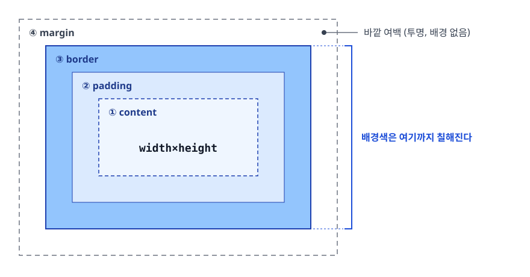
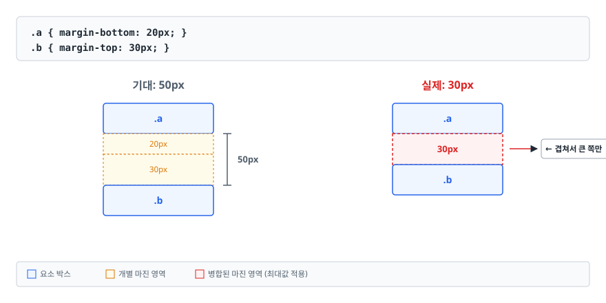
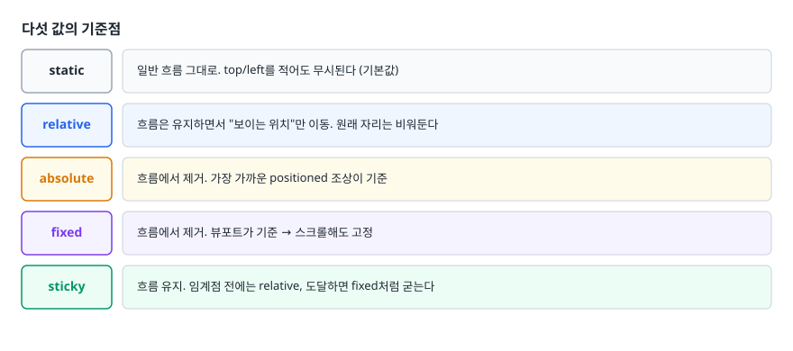
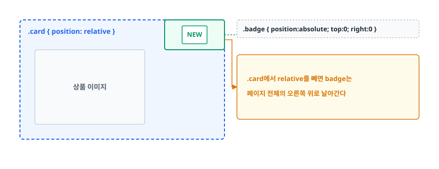
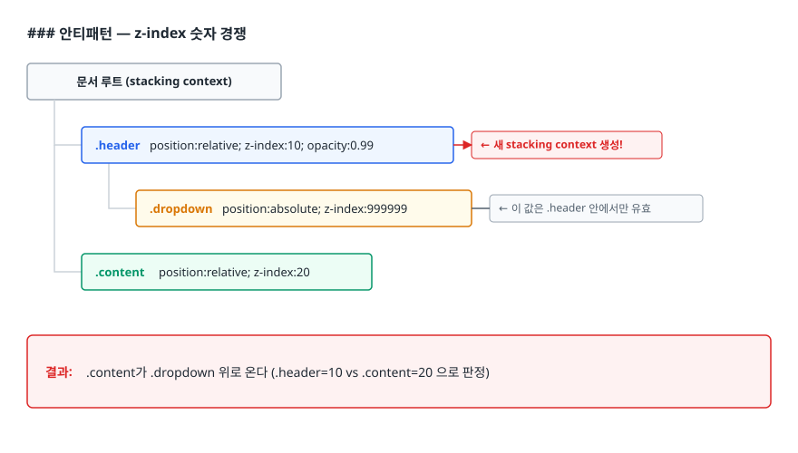
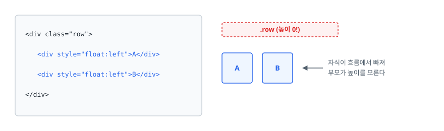
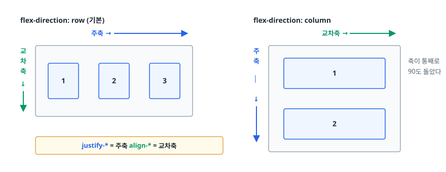

# CSS 레이아웃 (Box Model, Position, Flexbox, Grid)

> `position: absolute`가 무엇을 기준으로 움직이는지, 내가 적은 숫자와 요소의 실제 크기가 왜 어긋나는지, Flexbox와 Grid 중 무엇을 언제 꺼내야 하는지를 이 문서에서 차례로 풀고 나면 설명할 수 있게 됩니다.

## 학습 목표

- [ ] 박스 모델 4영역과 `box-sizing` 두 값의 계산 차이를 숫자로 설명할 수 있다
- [ ] `display` 값에 따라 어떤 박스가 만들어지는지 구분할 수 있다
- [ ] `position` 5종의 기준점과 흐름 제거 여부를 각각 말할 수 있다
- [ ] z-index가 안 먹는 상황을 stacking context로 설명할 수 있다
- [ ] Flexbox의 주축·교차축을 그리고, Grid와의 역할 분담 기준을 세울 수 있다

## 선행 지식

- CSS 선택자와 속성을 적을 줄 아는 정도
- [01-semantic-html-a11y.md](./01-semantic-html-a11y.md) — 레이아웃을 얹을 마크업의 구조

---

## 1. 왜 필요한가

HTML은 논문을 공유하려고 만든 문서 포맷입니다. 기본 배치 규칙인 **일반 흐름(normal flow)** 은 단순합니다. 블록 요소는 위에서 아래로 한 줄씩 쌓이고, 인라인 요소는 왼쪽에서 오른쪽으로 이어지다 줄이 차면 넘어갑니다. 그게 전부였습니다.

그런데 사람들은 신문 같은 다단 레이아웃을 원했습니다. 없는 도구를 만들어내는 역사가 그때부터 시작됩니다.

```
1990년대  <table>로 레이아웃   표가 아닌 걸 표로 그림. 마크업이 의미를 잃음
2000년대  float + clear       원래 "텍스트가 이미지를 감싸는" 기능을 전용
2010년대  Flexbox             정렬을 위해 만들어진 첫 도구 (1차원)
2017년~   Grid                행과 열을 동시에 다루는 도구 (2차원)
```

여기서 얻을 교훈은 하나입니다. **float 기반 레이아웃은 이제 실무 기술이 아니라 역사 지식입니다.** 다만 면접에서 "왜 float를 안 쓰게 됐나"를 묻기 때문에, 무엇이 불편해서 대체되었는지는 알아야 합니다.

---

## 2. 박스 모델: 적은 숫자와 실제 크기가 다른 이유

### 네 겹의 영역

모든 요소는 안쪽부터 **content → padding → border → margin** 네 겹의 사각형으로 그려집니다.

<!-- diagram:fe-css-layout-1 -->


<!-- 위 그림이 대체한 원본 ASCII.
     내용을 고칠 때는 그림도 함께 갱신할 것.
```
   ┌───────────── margin ─────────────┐   바깥 여백 (투명, 배경 없음)
   │  ┌────────── border ──────────┐  │
   │  │  ┌─────── padding ──────┐  │  │   배경색은 여기까지 칠해진다
   │  │  │  ┌──── content ───┐  │  │  │
   │  │  │  │  width×height  │  │  │  │
   │  │  │  └────────────────┘  │  │  │
   │  │  └──────────────────────┘  │  │
   │  └────────────────────────────┘  │
   └──────────────────────────────────┘
```
-->

액자에 든 사진으로 생각하면 편합니다. 사진이 content, 사진과 액자테 사이 흰 여백(매트)이 padding, 액자테가 border, 옆 액자와의 벽 간격이 margin입니다.

> **비유의 한계**: 액자 속 사진은 크기가 고정입니다. CSS 박스는 content가 늘면 같이 늘어납니다. 또 CSS의 margin은 옆 요소의 margin과 **합쳐질 수 있습니다**(뒤에 나올 마진 병합). 실제 액자에서는 그런 일이 없습니다.

### 안티패턴 — `width: 100%`에 padding 얹기

```css
/* 안티패턴 */
.input { width: 100%; padding: 12px; border: 1px solid #ddd; }
```

**왜 문제인가**: 기본값 `content-box`에서 `width`는 content 영역만 가리킵니다. 부모 폭이 400px이면 이 input의 실제 폭은 `400 + 12×2 + 1×2 = 426px`가 되어 부모를 26px 삐져나옵니다. 가로 스크롤이 생기거나 옆 요소를 밀어냅니다. `calc(100% - 26px)`로 때우기 시작하면 padding을 바꿀 때마다 계산식도 같이 고쳐야 합니다.

```css
/* 개선: 프로젝트 시작할 때 한 번만 깔고 잊는다 */
*, *::before, *::after { box-sizing: border-box; }
```

`border-box`에서는 padding과 border가 `width` **안쪽으로** 들어갑니다. 위 예시라면 폭은 400px 그대로고 content 영역이 374px로 줄어듭니다. 내가 적은 숫자가 곧 화면 폭이 되므로 계산이 직관적입니다. 가상 요소도 별도 박스를 만들기 때문에 `::before`, `::after`까지 포함시킵니다.

### 마진 병합(margin collapsing)

세로로 맞닿은 두 블록 요소의 margin은 각자 제 몫을 차지하지 않습니다. **둘 중 큰 값 하나만 남고 나머지는 그 안으로 삼켜집니다.**

<!-- diagram:fe-css-layout-2 -->


<!-- 위 그림이 대체한 원본 ASCII.
     내용을 고칠 때는 그림도 함께 갱신할 것.
```
  .a { margin-bottom: 20px; }        기대: 50px          실제: 30px
  .b { margin-top: 30px; }
                                     ┌──.a──┐          ┌──.a──┐
                                     └──────┘  20px    └──────┘
                                               30px       30px   ← 겹쳐서 큰 쪽만
                                     ┌──.b──┐          ┌──.b──┐
                                     └──────┘          └──────┘
```
-->

병합은 세 상황에서 일어납니다. 인접한 형제 사이, 부모와 첫/마지막 자식 사이(그 경계에 border·padding이 없고 부모가 BFC를 만들지 않을 때), 내용이 빈 블록의 위아래 margin 사이입니다. 특히 두 번째가 사고를 많이 냅니다. 자식에게 준 `margin-top`이 부모 밖으로 튀어나가 **부모 전체가 아래로 밀리는** 현상입니다.

```css
.parent { display: flow-root; }                          /* BFC 생성, 부작용 없음 */
.parent { display: flex; flex-direction: column; gap: 20px; }  /* 더 현대적인 해법 */
```

**flex와 grid 컨테이너의 자식 사이에서는 마진 병합이 아예 일어나지 않습니다.** 요즘 이 현상을 덜 만나게 된 이유가 이것입니다.

---

## 3. display: 어떤 박스를 만들 것인가

| 값 | 줄바꿈 | 기본 너비 | width/height | 상하 margin | 대표 태그 |
|----|--------|----------|:------------:|:-----------:|----------|
| `block` | 함 | 부모 가득 | 적용 | 적용 | `div`, `p`, `h1` |
| `inline` | 안 함 | 콘텐츠만큼 | **무시** | **레이아웃에 반영 안 됨** | `span`, `a`, `em` |
| `inline-block` | 안 함 | 콘텐츠만큼 | 적용 | 적용 | `button`, `input` |
| `flex` / `grid` | 함 | 부모 가득 | 적용 | 적용 | — |
| `none` | — | — | — | — | 렌더링 자체를 안 함 |

> 표 요약: **`inline`에 `width`가 안 먹는다**는 걸 모르면 `<span>`에 크기를 주려다 30분을 날립니다. 크기를 줘야 하면 `inline-block`으로 바꾸거나, 애초에 flex 아이템으로 만들면 됩니다(flex 아이템은 자기 `display` 값과 무관하게 블록처럼 취급됩니다). 다만 ``, `<video>`처럼 바깥에서 내용을 끌어오는 **대체 요소(replaced element)** 는 기본값이 `inline`인데도 `width`/`height`가 그대로 적용됩니다. 이건 예외로 외워두는 편이 빠릅니다.

### 안티패턴 — inline-block 사이의 유령 공백

```html
<span class="chip">A</span>
<span class="chip">B</span>
```

두 chip 사이에 요청하지 않은 4~5px 간격이 생깁니다. **왜 문제인가**: 태그 사이의 줄바꿈과 들여쓰기가 HTML에서 공백 문자 하나로 취급되고, 인라인 맥락에서 공백은 실제 띄어쓰기로 렌더링되기 때문입니다. 태그를 붙여 쓰거나 부모에 `font-size: 0`을 주는 옛 편법은 둘 다 코드를 읽기 어렵게 만듭니다.

```css
/* 개선: 부모를 flex로 만들면 공백 노드가 레이아웃에서 제외된다 */
.chip-list { display: flex; gap: 8px; }
```

---

## 4. position과 stacking context

### 다섯 값의 기준점

<!-- diagram:fe-css-layout-3 -->


<!-- 위 그림이 대체한 원본 ASCII.
     내용을 고칠 때는 그림도 함께 갱신할 것.
```
static     일반 흐름 그대로. top/left를 적어도 무시된다 (기본값)
relative   흐름은 유지하면서 "보이는 위치"만 이동. 원래 자리는 비워둔다
absolute   흐름에서 제거. 가장 가까운 positioned 조상이 기준
fixed      흐름에서 제거. 뷰포트가 기준 → 스크롤해도 고정
sticky     흐름 유지. 임계점 전에는 relative, 도달하면 fixed처럼 굳는다
```
-->

**positioned 조상**이란 `position`이 `static`이 아닌 조상입니다. 그런 조상이 하나도 없으면 문서 최상단(초기 컨테이닝 블록)이 기준이 됩니다.

`fixed`가 "언제나 뷰포트 기준"인 것도 아닙니다. 조상 중에 `transform`, `filter`, `perspective`가 `none`이 아닌 요소가 있으면 **그 조상이 기준**으로 바뀌어, 고정되어 있어야 할 요소가 스크롤을 따라 움직입니다. 애니메이션을 넣은 래퍼 안에서 고정 헤더가 갑자기 안 붙는다면 여기부터 의심합니다.

<!-- diagram:fe-css-layout-4 -->


<!-- 위 그림이 대체한 원본 ASCII.
     내용을 고칠 때는 그림도 함께 갱신할 것.
```
  ┌─ .card { position: relative } ──┐   .badge { position:absolute; top:0; right:0 }
  │                          ┌────┐ │
  │                          │NEW │ │   .card에서 relative를 빼면 badge는
  │  상품 이미지                └────┘ │   페이지 전체의 오른쪽 위로 날아간다
  └─────────────────────────────────┘
```
-->

`position: relative`는 좌표 이동보다 **자식 absolute의 기준점을 만드는 용도**로 훨씬 많이 쓰입니다.

`position: sticky`가 안 붙는다면 세 가지를 확인합니다. `top`/`bottom` 같은 임계점을 안 줬거나(하나는 반드시 필요합니다), 조상 중에 `overflow: hidden`(또는 `auto`, `scroll`)이 있어 그쪽이 스크롤 컨테이너가 되어버렸거나, 직계 부모 높이가 sticky 요소와 같아 굳을 공간이 없는 경우입니다.

### 안티패턴 — z-index 숫자 경쟁

```css
.modal    { position: fixed;    z-index: 9999; }
.tooltip  { position: absolute; z-index: 99999; }
.dropdown { position: absolute; z-index: 999999; }
```

**왜 문제인가**: z-index는 **같은 stacking context 안에서만** 비교됩니다. 부모가 새 stacking context를 만들었다면 자식의 z-index가 백만이어도 그 부모 통째로가 다른 형제 뒤에 깔립니다.

<!-- diagram:fe-css-layout-5 -->


<!-- 위 그림이 대체한 원본 ASCII.
     내용을 고칠 때는 그림도 함께 갱신할 것.
```
  문서 루트 (stacking context)
  ├─ .header    position:relative; z-index:10; opacity:0.99  ← 새 stacking context 생성!
  │   └─ .dropdown  position:absolute; z-index:999999        ← 이 값은 .header 안에서만 유효
  └─ .content   position:relative; z-index:20

  결과: .content가 .dropdown 위로 온다 (.header=10 vs .content=20 으로 판정)
```
-->

새 stacking context를 만드는 대표적인 조건은 이렇습니다.

- `position: relative/absolute` + `z-index`가 `auto`가 아님
- `position: fixed` 또는 `sticky` (z-index와 무관하게 항상)
- `opacity`가 1 미만, `transform`·`filter`·`clip-path`가 `none`이 아님
- flex/grid 아이템에 `z-index` 지정, `isolation: isolate`, `contain: paint`

성능 최적화 의도로 넣은 `transform: translateZ(0)`이 레이어 순서를 뒤집는 일이 실제로 자주 일어납니다.

```css
/* 개선: 레이어 순서를 한 곳에서 관리하고, 모달은 아예 body 최상단으로 옮긴다 */
:root { --z-dropdown: 100; --z-header: 200; --z-modal: 300; --z-toast: 400; }
.modal { z-index: var(--z-modal); }
```

React Portal 등으로 모달을 `body` 직속으로 렌더링하면 부모의 stacking context 영향에서 아예 벗어납니다. 근본 해법은 숫자가 아니라 구조입니다.

---

## 5. float와 clearfix — 왜 역사인가

`float`의 원래 목적은 **텍스트가 이미지를 감싸게 하는 것**입니다. float된 요소는 일반 흐름에서 **절반만** 빠집니다. 박스로서는 빠지지만 주변 인라인 콘텐츠는 여전히 그 자리를 피해갑니다. `position: absolute`와 다른 지점이 여기입니다.

문제는 이걸 다단 레이아웃에 전용하면서 시작됐습니다.

<!-- diagram:fe-css-layout-6 -->


<!-- 위 그림이 대체한 원본 ASCII.
     내용을 고칠 때는 그림도 함께 갱신할 것.
```
  <div class="row">                    ┌ .row (높이 0!) ──────┐
    <div style="float:left">A</div>    └─────────────────────┘
    <div style="float:left">B</div>     ┌────┐ ┌────┐
  </div>                                │ A  │ │ B  │  ← 자식이 흐름에서 빠져
                                        └────┘ └────┘     부모가 높이를 모른다
```
-->

배경색과 테두리가 안 보이고 아래 요소가 A, B 위로 겹쳐 올라옵니다. 이 "높이 붕괴"를 막으려고 나온 것이 clearfix입니다.

```css
.clearfix::after { content: ''; display: block; clear: both; }   /* 2010년대 관용구 */
```

가상 요소를 float 아래로 밀어내면 부모가 그 높이까지 인식합니다. `overflow: hidden`도 같은 효과를 내지만 **콘텐츠가 잘립니다.** 드롭다운과 box-shadow가 잘려나가고 안쪽의 `position: sticky`가 깨집니다. 지금은 부작용 없는 대안이 있습니다.

```css
.row { display: flow-root; }   /* BFC만 만들고 다른 부작용 없음 */
.row { display: flex; gap: 16px; }   /* 오늘 새 코드를 쓴다면 애초에 이쪽 */
```

float가 지금도 최선인 자리는 원래 목적, 즉 텍스트가 이미지·인용구를 감싸는 배치뿐입니다.

---

## 6. Flexbox: 한 방향으로 늘어놓고 정렬하기

### 주축과 교차축

Flexbox가 헷갈리는 이유는 대부분 하나입니다. **`justify-content`와 `align-items`가 가로/세로 중 무엇을 담당하는지 외우려 하기 때문입니다.** 외울 필요가 없습니다. 축은 `flex-direction`이 정합니다.

<!-- diagram:fe-css-layout-7 -->


<!-- 위 그림이 대체한 원본 ASCII.
     내용을 고칠 때는 그림도 함께 갱신할 것.
```
  flex-direction: row (기본)              flex-direction: column
                주축 →                            교차축 →
  교 ┌──────────────────────┐          주 ┌──────────────┐
  차 │ ┌──┐ ┌──┐ ┌──┐       │          축 │  ┌────────┐  │   축이 통째로
  축 │ │1 │ │2 │ │3 │       │          │  │  │   1    │  │   90도 돌았다
  ↓  │ └──┘ └──┘ └──┘       │          │  │  └────────┘  │
     └──────────────────────┘          ↓  │  ┌────────┐  │
                                          │  │   2    │  │
   justify-* = 주축   align-* = 교차축      │  └────────┘  │
                                          └──────────────┘
```
-->

`justify-*`는 언제나 주축, `align-*`는 언제나 교차축. 이 한 문장이면 `flex-direction`이 뭐든 헷갈리지 않습니다.

### flex 단축 속성이 실제로 하는 일

```css
.item { flex: 1; }        /* = flex: 1 1 0%   */
.item { flex: auto; }     /* = flex: 1 1 auto */
.item { flex: none; }     /* = flex: 0 0 auto */
```

`flex-grow`는 남는 공간을 나눠 갖는 비율, `flex-shrink`는 모자랄 때 줄어드는 비율, `flex-basis`는 그 계산을 시작하는 출발 크기입니다.

`flex: 1`과 `flex: auto`의 차이가 실전에서 자주 문제가 됩니다. `flex: 1`은 basis가 `0`이라 **콘텐츠 길이를 무시하고 모든 아이템의 폭이 똑같아집니다.** `flex: auto`는 basis가 콘텐츠 크기라 **글자가 긴 아이템이 더 넓어집니다.** 탭 메뉴를 균등 분할하려면 `flex: 1`, 콘텐츠 비율을 살리려면 `flex: auto`가 맞습니다. 단 `flex: 1`의 균등 분할에도 조건이 하나 붙습니다. 어떤 아이템의 콘텐츠가 지나치게 길면 바로 다음 절에서 볼 자동 최소 크기에 걸려 그 칸만 넓어집니다.

### 안티패턴 — 긴 텍스트가 flex 아이템을 뚫고 나간다

```css
/* 안티패턴 - 말줄임이 안 나오고 컨테이너가 밀려난다 */
.row { display: flex; }
.title { flex: 1; white-space: nowrap; overflow: hidden; text-overflow: ellipsis; }
```

**왜 문제인가**: flex 아이템의 `min-width` 기본값은 `0`이 아니라 `auto`입니다. 즉 **자기 콘텐츠보다 작아지기를 거부합니다.** `flex: 1`로 줄어들라고 지시해도 이 하한선에 막힙니다.

```css
/* 개선 */
.title {
  flex: 1;
  min-width: 0;          /* 하한선 해제 — 이 한 줄이 핵심 */
  white-space: nowrap; overflow: hidden; text-overflow: ellipsis;
}
```

`flex-direction: column`에서 같은 문제가 생기면 `min-height: 0`을 씁니다. 안쪽 스크롤 영역이 안 생기고 부모를 뚫는 현상의 원인도 대개 이것입니다.

---

## 7. Grid: 행과 열을 동시에 잡기

Flexbox가 옷걸이 봉 하나에 옷을 거는 것이라면, Grid는 서랍장 칸을 먼저 그려두고 물건을 넣는 것입니다.

```css
.gallery {
  display: grid;
  grid-template-columns: repeat(auto-fit, minmax(220px, 1fr));
  gap: 16px;
}
```

`fr`은 grid 전용 단위입니다. **남은 공간의 비율**을 뜻하고, `%`와 달리 `gap`을 뺀 나머지를 기준으로 계산하므로 "3등분했더니 gap 때문에 넘친다"는 문제가 없습니다. 위 선언은 "칸 하나가 최소 220px은 되어야 하고, 들어갈 수 있는 만큼 넣어라"는 뜻입니다. 그래서 **미디어 쿼리 없이도** 화면 폭에 따라 열 개수가 알아서 바뀝니다. `auto-fit`은 빈 칸을 접어 아이템을 늘리고, `auto-fill`은 빈 칸을 그대로 남깁니다.

### Flexbox와 Grid, 무엇을 언제 쓰나

| 기준 | Flexbox | Grid |
|------|---------|------|
| 차원 | 1차원 (한 줄 안에서 배치) | 2차원 (행·열 동시) |
| 크기 결정 주체 | **콘텐츠**가 정하고 컨테이너가 조정 | **컨테이너**가 칸을 먼저 정함 |
| 잘 맞는 것 | 내비게이션, 버튼 그룹, 카드 안쪽 정렬 | 페이지 골격, 갤러리, 대시보드 |
| 줄바꿈 시 | 마지막 줄이 들쭉날쭉해도 되는 경우 | 열이 딱 맞아떨어져야 하는 경우 |

> 결론: **칸을 내가 정하고 싶으면 Grid, 콘텐츠가 정하게 두고 싶으면 Flexbox.** 실무에서는 Grid로 페이지 골격을 잡고 각 영역 안쪽 정렬을 Flexbox로 하는 조합이 표준입니다. 둘은 경쟁 관계가 아닙니다.

---

## 8. 실전 레이아웃 레시피

### 완벽한 중앙 정렬

```css
.parent { display: grid; place-items: center; min-height: 100vh; }   /* 가장 짧다 */
.parent { display: flex; justify-content: center; align-items: center; }  /* 동일 결과 */

/* 부모 크기를 못 건드릴 때의 마지막 수단 */
.parent { position: relative; }
.child  { position: absolute; top: 50%; left: 50%; transform: translate(-50%, -50%); }
```

세 번째 방식이 `margin-top: -50px` 같은 하드코딩과 갈리는 지점은 `transform`의 `%`가 **자기 자신의 크기 기준**이라는 데 있습니다. 그래서 자식 크기를 몰라도 됩니다.

### 홀리 그레일 레이아웃

헤더·푸터는 가로 전체, 가운데는 좌우 사이드바 + 본문, 화면 높이가 남으면 본문이 늘어나 푸터가 바닥에 붙는 배치. float 시절 악명 높던 난제인데 Grid로는 선언 한 번이면 끝납니다.

```css
.layout {
  display: grid;
  min-height: 100vh;
  grid-template-columns: 200px 1fr 240px;
  grid-template-rows: auto 1fr auto;
  grid-template-areas:
    "header header header"
    "nav    main   aside"
    "footer footer footer";
}
.layout > header { grid-area: header; }
.layout > nav    { grid-area: nav; }
.layout > main   { grid-area: main; }
.layout > aside  { grid-area: aside; }
.layout > footer { grid-area: footer; }

@media (max-width: 768px) {
  .layout {
    grid-template-columns: 1fr;
    grid-template-areas: "header" "nav" "main" "aside" "footer";
  }
}
```

`grid-template-areas`의 진짜 강점은 **CSS만 봐도 레이아웃이 눈에 그려진다**는 것입니다. 모바일 대응도 HTML을 건드리지 않고 area 배치만 다시 적으면 됩니다.

> 단, 화면 순서와 DOM 순서가 어긋나면 키보드 Tab 순서는 DOM을 따라가므로 시각 순서와 달라집니다. 순서를 크게 뒤집을 때는 마크업 순서 자체를 손보는 편이 안전합니다.

---

## 9. 실무에서는

- **`gap`이 margin을 대체했습니다.** 예전에는 `.item + .item { margin-left: 8px }` 같은 인접 선택자로 마지막 요소의 여백을 뺐습니다. flex와 grid 모두 `gap`을 지원하는 지금은 컨테이너에 한 줄이면 끝납니다.
- **레이아웃 디버깅은 개발자 도구로 합니다.** Chrome/Firefox의 Elements 패널에서 `grid`, `flex` 배지를 누르면 트랙 번호와 축이 화면에 오버레이됩니다. 머리로 상상하는 것보다 훨씬 빠릅니다.
- **레이아웃을 바꾸는 속성은 비쌉니다.** `width`, `top`, `margin`을 애니메이션하면 매 프레임 레이아웃을 다시 계산합니다. 이동·확대는 `transform`, 투명도는 `opacity`가 원칙입니다. 자세한 내용은 [../browser-fundamentals/04-reflow-repaint.md](../browser-fundamentals/04-reflow-repaint.md)에 있습니다.
- **이미지에는 `width`/`height` 속성을 적습니다.** 값이 없으면 이미지가 로드되는 순간 아래 콘텐츠가 밀려 레이아웃이 튑니다(CLS). HTML 속성으로 크기를 적어두면 브라우저가 비율을 미리 계산해 자리를 잡아둡니다.

---

## 10. 면접 포인트

> 면접에서 이 주제가 나오면 이렇게 답한다

**Q. `box-sizing: border-box`를 전역으로 설정하는 이유는?**
A. 기본값 `content-box`에서는 `width`가 content 영역만 가리켜서, padding이나 border를 주면 실제 박스가 그만큼 커집니다. `width: 100%`에 padding을 얹으면 부모를 삐져나가 가로 스크롤이 생깁니다. `border-box`는 padding과 border를 `width` 안쪽에 포함시켜 내가 적은 숫자가 곧 화면 폭이 되므로 계산이 직관적입니다. `::before`, `::after`까지 포함해 전역으로 깔아두는 게 관행입니다.
- 꼬리 질문: "쿼크 모드와 관련이 있나요?" → DOCTYPE이 없어 쿼크 모드가 되면 표준 모드와 달리 옛 IE 방식, 즉 border-box에 가까운 계산을 합니다. DOCTYPE 누락이 레이아웃을 통째로 어긋나게 하는 이유입니다.

**Q. z-index를 아주 크게 줬는데도 요소가 뒤에 깔립니다. 왜 그럴까요?**
A. z-index는 같은 stacking context 안에서만 비교되기 때문입니다. 조상 중 하나가 `opacity`가 1 미만이거나 `transform`, `filter`가 걸려 있으면 그 지점에서 새 context가 생기고, 그 안의 자식은 z-index가 아무리 커도 조상의 순서를 넘어설 수 없습니다. 숫자를 올리는 대신 어느 조상이 context를 만들었는지 먼저 찾아야 하고, 모달 같은 건 Portal로 body 최상단에 렌더링해 문제를 원천 차단합니다.
- 꼬리 질문: "`position: static`에 z-index를 주면요?" → 무시됩니다. z-index는 positioned 요소이거나 flex/grid 아이템일 때만 동작합니다.

**Q. Flexbox와 Grid는 어떤 기준으로 선택하나요?**
A. 배치를 한 방향으로만 통제하면 되는지, 행과 열을 동시에 잡아야 하는지가 1차 기준입니다. 더 실용적인 기준은 크기를 누가 정하느냐인데, 콘텐츠 길이에 따라 자연스럽게 늘어나야 하면 Flexbox, 칸 크기를 내가 먼저 정하고 콘텐츠를 맞춰 넣어야 하면 Grid입니다. 실무에서는 Grid로 페이지 골격을 잡고 각 영역 내부 정렬은 Flexbox로 처리합니다.
- 꼬리 질문: "미디어 쿼리 없이 반응형 갤러리를 만들려면?" → `grid-template-columns: repeat(auto-fit, minmax(220px, 1fr))`을 쓰면 화면 폭에 따라 열 개수가 자동으로 바뀝니다.

**Q. float가 부모 높이를 무너뜨리는 이유와 해결법은?**
A. float된 요소는 일반 흐름에서 빠지기 때문에 부모가 자식 높이를 계산에 넣지 않습니다. 자식이 전부 float면 부모 높이가 0이 되어 배경이 안 보이거나 아래 요소가 겹칩니다. 고전 해법은 `::after`에 `clear: both`를 주는 clearfix이고, `overflow: hidden`도 BFC를 만들어 같은 효과를 내지만 콘텐츠가 잘리는 부작용이 있습니다. 지금은 `display: flow-root`가 부작용 없는 정석이고, 애초에 레이아웃을 Flexbox나 Grid로 짜면 이 문제를 만나지 않습니다.
- 꼬리 질문: "BFC가 뭔가요?" → 내부 박스들이 독립적으로 배치되는 영역입니다. BFC 안에서는 float가 부모 밖으로 새지 않고 마진 병합도 경계를 넘지 못합니다.

---

## 자주 하는 실수

| 실수 | 왜 틀렸나 | 올바른 이해 |
|------|----------|-----------|
| "`width: 100%`면 부모에 딱 맞는다" | `content-box`에서는 padding·border가 밖으로 더해진다 | `border-box`를 전역으로 깔거나 계산을 감안한다 |
| "인접 margin은 더해진다" | 세로 방향은 큰 값 하나로 병합된다 | flex/grid의 `gap`을 쓰면 병합 자체가 없다 |
| "`position: absolute`는 부모 기준이다" | 기준은 **positioned 조상**이다 | 부모가 `static`이면 더 위로 올라가고, 없으면 문서 기준이 된다 |
| "z-index 숫자가 크면 위로 온다" | 같은 stacking context 안에서만 비교된다 | 조상이 새 context를 만들었는지 먼저 확인한다 |
| "`justify-content`는 가로 정렬이다" | 주축 정렬입니다. `column`이면 세로가 된다 | `justify-*`=주축, `align-*`=교차축으로 외운다 |
| "`flex: 1`이면 콘텐츠 비율대로 나뉜다" | basis가 `0`이라 콘텐츠를 무시하고 균등 분할된다 | 콘텐츠 비율을 살리려면 `flex: auto` |
| "`overflow: hidden`은 안전한 clearfix다" | 드롭다운·그림자가 잘리고 내부 `sticky`가 깨진다 | `display: flow-root` 또는 flex/grid로 대체 |

---

## 한 줄 정리

CSS 레이아웃은 "박스가 얼마나 큰가(box-sizing)", "흐름에 남아 있는가(position/float)", "어느 축으로 정렬하는가(flex/grid)" 세 질문의 조합입니다. 오늘 새로 짜는 레이아웃의 답은 대부분 `border-box` + Grid 골격 + Flexbox 내부 정렬입니다.

---

## 연관 개념

- [01-semantic-html-a11y.md](./01-semantic-html-a11y.md) - 레이아웃을 얹기 전에 정리해야 할 문서 구조
- [03-responsive-specificity.md](./03-responsive-specificity.md) - 이 레이아웃을 화면 크기에 맞춰 바꾸는 방법
- [qna-html-css.md](./qna-html-css.md) - display·position·float·Flexbox/Grid·박스 모델 면접 질문(Q9~Q12, Q18, Q20)
- [../browser-fundamentals/04-reflow-repaint.md](../browser-fundamentals/04-reflow-repaint.md) - 레이아웃 변경이 비싼 이유와 `transform`을 쓰는 근거
- [../browser-fundamentals/05-compositing-gpu.md](../browser-fundamentals/05-compositing-gpu.md) - stacking context가 실제 합성 레이어와 만나는 지점
