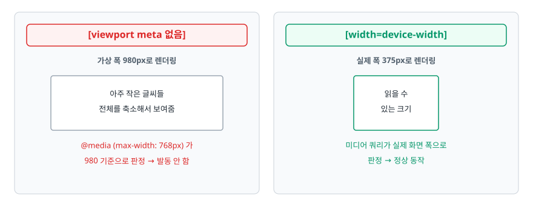
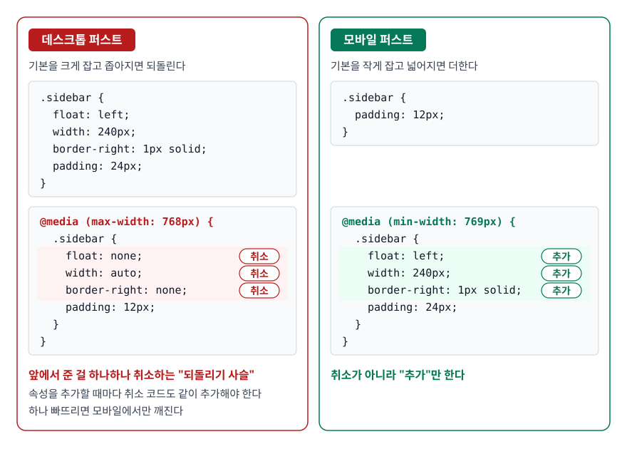
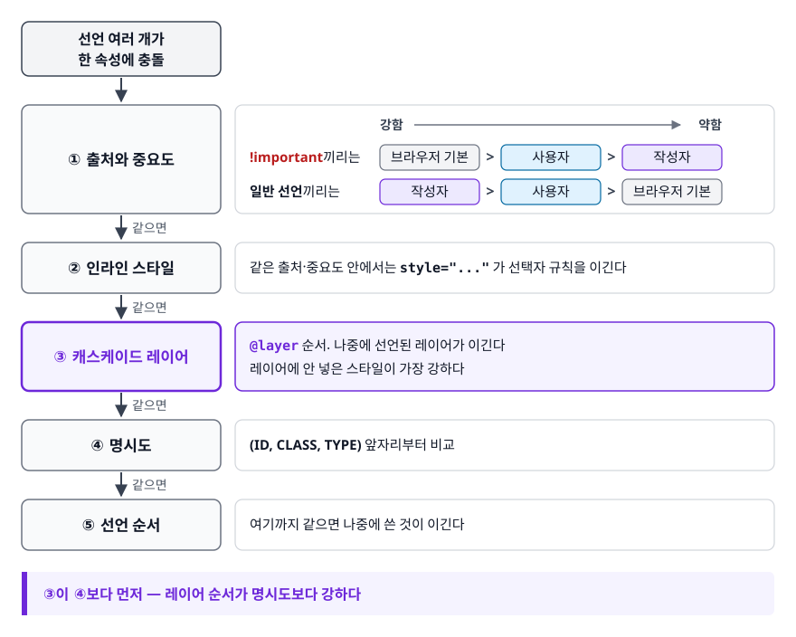

# 반응형 웹과 CSS 캐스케이드 (Responsive Design, Units & Specificity)

> 화면 크기를 모르는 상태로 레이아웃을 짜는 방법과, 스타일시트가 커져도 "왜 이 스타일이 안 먹지"에 빠지지 않는 방법을 설명할 수 있게 된다.

## 학습 목표

- [ ] 반응형과 적응형의 차이를 구현 방식 수준에서 비교하고 선택 근거를 댈 수 있다
- [ ] 모바일 퍼스트로 미디어 쿼리를 쓰는 이유를 캐스케이드로 설명할 수 있다
- [ ] px/em/rem/%/vw를 언제 무엇으로 쓸지 기준을 세울 수 있다
- [ ] 명시도를 직접 계산하고 `!important` 없이 충돌을 해결할 수 있다
- [ ] 전처리기·CSS Modules·CSS-in-JS를 동작 시점과 스코프로 구분할 수 있다

## 선행 지식

- [02-css-layout.md](./02-css-layout.md) — 반응형은 결국 레이아웃을 조건부로 바꾸는 일이다

---

## 1. 왜 필요한가

CSS를 쓰다 보면 성격이 다른 두 가지 통제 불능 상황을 만난다.

**첫째, 화면 크기를 알 수 없다.** 인쇄물은 A4가 A4고 신문 판형이 정해져 있다. 웹은 아니다. 같은 페이지를 320px 폴더블 커버 화면에서도 보고 34인치 울트라와이드에서도 본다. 브라우저 창을 반으로 줄여 놓고 쓰는 사람도 있다. 폭이 정해진 디자인을 그대로 옮기면 어느 한쪽에서 반드시 깨진다.

**둘째, 스타일시트는 반드시 커지고 서로 부딪친다.** CSS는 전역 네임스페이스다. 어제 다른 팀이 추가한 `.title { color: red }` 한 줄이 내 컴포넌트 제목 색을 바꿔놓는다. 그럴 때 `!important`를 붙이면 당장은 해결되지만, 6개월 뒤에는 `!important`끼리 싸우는 파일이 된다.

앞의 문제는 미디어 쿼리와 상대 단위로, 뒤의 문제는 캐스케이드 규칙을 이해하는 것으로 푼다. 둘 다 "내가 정확히 통제할 수 없는 환경을 규칙으로 다룬다"는 점에서 같은 결의 문제다.

---

## 2. 반응형과 적응형

| 기준 | 반응형(Responsive) | 적응형(Adaptive) |
|------|-------------------|-----------------|
| HTML | 하나 | 화면/기기별로 여러 벌 |
| 분기 지점 | 브라우저(CSS 미디어 쿼리) | 서버 또는 진입 시점(기기 감지) |
| 변화 방식 | 폭에 따라 연속적으로 유동 | 미리 만든 몇 개 버전 중 선택 |
| 최적화 여지 | 중간 — 공통 자산을 다 내려받음 | 높음 — 기기별로 필요한 것만 전송 |
| 개발·유지보수 비용 | 낮음 | 높음(코드베이스가 갈라짐) |
| URL | 하나 | 분리되기도 함(`m.example.com`) |

> 결론: **기본값은 반응형이다.** 한 벌만 만들고 유지하면 되고 URL이 하나라 SEO에도 유리하다. 적응형이 정당화되는 경우는 모바일과 데스크톱의 기능·사용 흐름이 아예 다를 때(주문 앱 vs 관리자 콘솔)나, 저사양 기기에 무거운 자산을 절대 보내면 안 될 때 정도다.

적응형은 서버가 `User-Agent`를 보고 다른 응답을 주는 형태로도 구현된다. 이 경우 CDN 캐시가 기기별로 갈라져야 하므로 `Vary: User-Agent` 헤더가 필요해지고, 캐시 적중률이 떨어진다. 프론트엔드만의 결정이 아니라는 뜻이다.

---

## 3. viewport meta와 미디어 쿼리

### viewport meta가 없으면 반응형은 시작도 안 된다

```html
<meta name="viewport" content="width=device-width, initial-scale=1">
```

스마트폰이 처음 나왔을 때 웹은 전부 데스크톱용이었다. 폭 375px짜리 화면에 데스크톱 페이지를 그대로 그리면 아무것도 못 읽으니, 모바일 브라우저는 **"일단 데스크톱 폭(대략 980px 안팎)이라고 가정하고 그린 뒤 화면에 맞게 축소"** 하는 절충안을 택했다.

<!-- diagram:fe-responsive-specificity-1 -->


<!-- 위 그림이 대체한 원본 ASCII.
     내용을 고칠 때는 그림도 함께 갱신할 것.
```
[viewport meta 없음]                   [width=device-width]

 가상 폭 980px로 렌더링                   실제 폭 375px로 렌더링
 ┌────────────────────────┐             ┌──────────┐
 │  아주  작은  글씨들      │             │  읽을 수  │
 │  전체를 축소해서 보여줌   │             │  있는 크기 │
 └────────────────────────┘             └──────────┘
 @media (max-width: 768px) 가            미디어 쿼리가 실제 화면 폭으로
 980 기준으로 판정 → 발동 안 함            판정 → 정상 동작
```
-->

`width=device-width`는 "가상 폭 쓰지 말고 실제 기기 폭을 그대로 써라"는 지시다. **이게 없으면 미디어 쿼리를 아무리 잘 짜도 무력화된다.**

### 안티패턴 — 확대를 막는 viewport

```html
<!-- 안티패턴 -->
<meta name="viewport" content="width=device-width, initial-scale=1,
      maximum-scale=1, user-scalable=no">
```

**왜 문제인가**: 저시력 이용자가 핀치 줌으로 글자를 키우는 길을 막는다. WCAG 1.4.4(텍스트 크기 조정)를 만족시키지 못하는 대표적인 마크업으로 꼽히고, iOS Safari는 10 버전부터 아예 이 설정을 무시한다. "레이아웃이 확대되면 깨져서"가 이유라면 깨지는 레이아웃을 고치는 게 맞다.

```html
<!-- 개선 -->
<meta name="viewport" content="width=device-width, initial-scale=1">
```

### 모바일 퍼스트가 유리한 진짜 이유

두 방식은 같은 결과를 만들 수 있다. 차이는 **덮어쓰기의 양**이다.

<!-- diagram:fe-responsive-specificity-2 -->


<!-- 위 그림이 대체한 원본 ASCII.
     내용을 고칠 때는 그림도 함께 갱신할 것.
```
[데스크톱 퍼스트]  기본을 크게 잡고 좁아지면 되돌린다

  .sidebar { float: left; width: 240px; border-right: 1px solid; padding: 24px; }

  @media (max-width: 768px) {
    .sidebar { float: none; width: auto; border-right: none; padding: 12px; }
  }                ↑ 앞에서 준 걸 하나하나 취소하는 "되돌리기 사슬"
                     속성을 추가할 때마다 취소 코드도 같이 추가해야 한다
                     하나 빠뜨리면 모바일에서만 깨진다


[모바일 퍼스트]  기본을 작게 잡고 넓어지면 더한다

  .sidebar { padding: 12px; }

  @media (min-width: 769px) {
    .sidebar { float: left; width: 240px; border-right: 1px solid; padding: 24px; }
  }                ↑ 취소가 아니라 "추가"만 한다
```
-->

되돌리기 사슬이 없다는 것이 핵심이다. 취소해야 할 속성을 빠뜨려서 생기는 버그가 원천적으로 사라진다.

한편 "모바일 퍼스트가 성능에 유리하다"는 설명은 절반만 맞다. 하나의 CSS 파일 안에 있는 `@media` 블록은 **조건에 맞지 않아도 전부 다운로드되고 파싱된다.** 작성 순서를 바꾼다고 전송량이 줄지 않는다. 진짜 이득은 캐스케이드가 단순해진다는 것이고, 여기에 더해 "작은 화면에서 무엇이 정말 필요한가"를 먼저 결정하게 만드는 설계상의 이점이 있다.

### 브레이크포인트는 기기 이름이 아니라 콘텐츠로 정한다

`768px = 태블릿`, `1024px = 노트북` 같은 표는 이제 잘 맞지 않는다. 기기 종류가 너무 다양해졌다. 실무에서 통하는 기준은 **레이아웃이 실제로 보기 싫어지는 지점**이다. 창을 조금씩 줄이다가 카드가 어색하게 찌그러지는 순간, 거기가 브레이크포인트다.

경계 처리도 주의할 부분이다. `max-width: 768px`와 `min-width: 768px`를 함께 쓰면 정확히 768px에서 둘 다 적용되고, 767px과 768px로 나누면 브라우저 확대 등으로 생기는 767.5px 같은 소수점 폭이 틈새로 빠진다. **`min-width`만 쓰고 값이 커지는 순서로 배열하면** 경계 문제 자체가 사라진다.

### 화면 크기 말고도 물어볼 수 있다

```css
/* 어두운 테마를 쓰는 이용자 */
@media (prefers-color-scheme: dark) {
  :root { --bg: #111; --fg: #eee; }
}

/* 애니메이션을 줄여달라고 설정한 이용자 — 전정기관 장애 대응 */
@media (prefers-reduced-motion: reduce) {
  *, *::before, *::after {
    animation-duration: 0.01ms !important;
    transition-duration: 0.01ms !important;
  }
}
```

`prefers-reduced-motion`은 접근성에서 자주 놓치는 항목이다. 화려한 패럴랙스 애니메이션이 어떤 사람에게는 실제로 어지럼증을 유발한다. 여기서의 `!important`는 개별 컴포넌트 스타일을 확실히 무력화해야 하는 몇 안 되는 정당한 용례다.

최근 브라우저에서는 **컨테이너 쿼리**(`container-type: inline-size` + `@container`)도 쓸 수 있다. 화면 폭이 아니라 **부모 요소의 폭**을 기준으로 분기하므로, 같은 카드가 넓은 본문에서는 가로형이 되고 좁은 사이드바에서는 세로형이 된다. 미디어 쿼리로는 표현할 수 없던 문제라 컴포넌트 기반 개발과 잘 맞는다. 다만 지원 여부를 확인하고 쓰는 편이 안전하다.

---

## 4. 단위: 무엇을 기준으로 삼을 것인가

| 단위 | 기준 | 사용자 폰트 설정 반영 | 주로 쓰는 곳 |
|------|------|:-------------------:|-------------|
| `px` | 절대(CSS 픽셀) | 안 됨 | border 두께, 그림자, 1px 단위 미세 조정 |
| `rem` | 루트(`html`) font-size | **됨** | 폰트 크기, 간격, 브레이크포인트 |
| `em` | **자기 요소**의 font-size | 됨 | 컴포넌트 내부의 비례 관계(padding, 아이콘) |
| `%` | 부모(컨테이닝 블록) 크기 | — | 유동 폭 |
| `vw`/`vh` | 뷰포트 폭/높이의 1% | 안 됨 | 히어로 영역, 전체 화면 요소 |

> 결론: **폰트와 간격은 `rem`, 컴포넌트 내부 비례는 `em`, 테두리처럼 진짜 고정이어야 하는 값은 `px`.** 이 세 줄이 실무 기준의 90%를 커버한다.

### 안티패턴 — 폰트 크기 px 하드코딩

```css
/* 안티패턴 */
body { font-size: 14px; }
h1   { font-size: 32px; }
```

**왜 문제인가**: 브라우저 설정에서 기본 글자 크기를 키운 이용자에게 이 값들은 **아무 반응도 하지 않는다.** 눈이 나빠서 기본 폰트를 20px로 올려둔 사람이 이 사이트에서만 14px 글씨를 보게 된다. 저시력 이용자가 가장 먼저 시도하는 대처를 개발자가 코드로 막아버린 셈이다.

```css
/* 개선 */
body { font-size: 1rem; }     /* 사용자 기본값을 그대로 존중 (보통 16px) */
h1   { font-size: 2rem; }     /* 기본값의 2배 — 설정을 바꾸면 같이 커진다 */
```

`em`은 **부모가 아니라 자기 자신의 `font-size`** 를 기준으로 한다는 점이 흔한 오해다. `font-size` 속성 자체에 `em`을 쓸 때만 부모 값을 기준으로 계산되고, `padding: 1em`은 그 요소에 적용된 폰트 크기를 따른다. 그래서 버튼처럼 "글자가 커지면 안쪽 여백도 같이 커져야 하는" 컴포넌트에 잘 맞는다.

```css
.btn {
  font-size: 1rem;        /* 바깥 기준: 루트 */
  padding: 0.5em 1em;     /* 안쪽 기준: 자기 폰트 크기 → 항상 비례 유지 */
}
.btn--large { font-size: 1.25rem; }   /* padding을 다시 안 적어도 같이 커진다 */
```

계산이 번거로워 `html { font-size: 62.5% }`로 `1rem = 10px`을 만드는 관행이 있는데, 이건 px 하드코딩과 다르다. `62.5%`는 **사용자 기본값의 62.5%** 라서 이용자가 기본 폰트를 20px로 바꾸면 루트도 12.5px가 되고 모든 `rem` 값이 함께 커진다. 접근성은 유지된다. 단점은 새로 합류한 사람이 `1rem = 16px`이라는 통념과 어긋나 혼란을 겪는다는 것뿐이다.

### 뷰포트 단위의 함정

```css
/* 안티패턴 1 */
.hero { width: 100vw; }
```

**왜 문제인가**: `100vw`는 세로 스크롤바 폭을 포함하는 경우가 있다. 스크롤바가 있는 데스크톱 브라우저에서 이 요소만 십수 px 넘쳐 가로 스크롤이 생긴다. 가로 전체를 채우고 싶다면 블록 요소의 기본값(`width: auto`)이나 `100%`로 충분하다.

```css
/* 안티패턴 2 */
h1 { font-size: 5vw; }
```

**왜 문제인가**: 화면 폭에만 반응하고 **이용자의 글자 크기 설정에는 반응하지 않는다.** 게다가 하한이 없어 좁은 화면에서 읽을 수 없을 만큼 작아진다.

```css
/* 개선: 하한·상한을 두고 rem을 섞는다 */
h1 { font-size: clamp(1.75rem, 1rem + 3vw, 3.5rem); }
```

`clamp(최솟값, 선호값, 최댓값)`은 선호값을 쓰되 범위를 벗어나면 경계에서 멈춘다. 가운데 항에 `rem`을 섞어두면 사용자 폰트 설정에도 반응한다.

`100vh`도 모바일에서 유명한 문제를 낳는다. 주소창이 보일 때와 숨을 때 실제 보이는 높이가 다른데 `vh`는 주소창이 숨은 상태 기준이라, 화면을 꽉 채우려던 요소의 아래쪽이 잘린다. 최신 브라우저에서는 동적으로 변하는 높이를 뜻하는 `dvh`를 쓸 수 있다.

한 가지 더. **`padding`과 `margin`의 `%`는 세로 방향이라도 부모의 "폭"을 기준으로 계산된다.** `padding-top: 56.25%`로 16:9 비율 박스를 만들던 옛 기법이 여기서 나왔다. 지금은 `aspect-ratio: 16 / 9`로 훨씬 직관적으로 쓸 수 있다.

---

## 5. 명시도: 규칙이 충돌할 때 누가 이기나

### 세 자리 점수

명시도(Specificity)는 선택자마다 계산되는 **(ID, CLASS, TYPE)** 세 자리 숫자다.

- **ID 자리** — `#header`
- **CLASS 자리** — `.nav`, `[type="text"]`, `:hover`, `:nth-child()`
- **TYPE 자리** — `div`, `a`, `::before`
- 어디에도 안 세는 것 — `*`, 그리고 `>`, `+`, `~`, 공백 같은 결합자

| 선택자 | (ID, CLASS, TYPE) |
|--------|------------------|
| `a` | (0, 0, 1) |
| `.nav a` | (0, 1, 1) |
| `a.link.active` | (0, 2, 1) |
| `#sidebar .nav li a:hover` | (1, 2, 2) |
| `:where(#sidebar) .nav a` | (0, 1, 1) |
| `:is(#sidebar, .side) a` | (1, 0, 1) |

`:where()`는 **안에 무엇을 넣든 명시도가 0**이다. 반대로 `:is()`와 `:not()`은 인자 중 가장 명시도가 높은 것을 따라간다. 이 차이가 라이브러리 기본 스타일을 만들 때 요긴하다. `:where()`로 감싸두면 쓰는 쪽에서 클래스 하나로 손쉽게 덮어쓸 수 있다.

### 자릿수는 절대 올림되지 않는다

여기가 가장 많이 틀리는 지점이다.

```css
.a.b.c.d.e.f.g.h.i.j.k { color: blue; }   /* (0, 11, 0) */
#x                     { color: red;  }   /* (1,  0, 0) */
```

클래스를 11개 겹쳐도 ID 하나를 못 이긴다. 10진수처럼 자리올림이 일어난다면 (0,11,0)이 (1,1,0)이 되어 이겨야 하지만, 명시도는 그렇게 계산하지 않는다. **앞자리부터 차례로 비교해서 큰 쪽이 즉시 이긴다.**

올림픽 메달 집계와 같다. 금메달 1개인 나라가 은메달 50개인 나라보다 위다. 은메달을 아무리 모아도 금메달로 바뀌지 않는다.

> **비유의 한계**: 메달 집계 방식은 나라·매체마다 다르지만 명시도는 스펙으로 못 박혀 있다. 그리고 인라인 스타일과 `!important`는 메달 경쟁 바깥, 즉 **다른 심사 단계**에서 처리된다. 다음 절이 그 이야기다.

### 안티패턴 — !important 사슬

```css
/* 월요일 */
.btn { background: blue; }
/* 화요일 - 왜인지 안 먹어서 */
.card .btn { background: green !important; }
/* 수요일 - 위 규칙 때문에 또 안 먹어서 */
#page .card .btn { background: red !important; }
```

**왜 문제인가**: `!important`는 명시도 비교 자체를 건너뛴다. 한 번 쓰는 순간 그걸 덮으려면 또 `!important`가 필요해지고, 그다음엔 더 긴 선택자에 `!important`가 필요해진다. 3개월이면 어떤 규칙이 실제로 적용되는지 아무도 모르는 파일이 된다.

해결의 시작은 **왜 안 먹었는지를 개발자 도구에서 확인하는 것**이다. Chrome 개발자 도구 Styles 패널은 무시된 선언에 취소선을 긋고, 이긴 규칙을 위쪽에 보여준다. 원인이 명시도라면 대개 답은 셋 중 하나다.

```css
/* 1. 선택자를 짧고 평평하게 유지한다 — 애초에 싸우지 않는 게 최선 */
.btn--danger { background: red; }

/* 2. 정말 순서로만 결정하고 싶다면 명시도를 맞추고 뒤에 둔다 */
.btn.btn--danger { background: red; }

/* 3. 레이어로 우선순위를 구조화한다 (다음 절) */
```

`!important`가 정당한 경우는 사실상 두 가지다. 인라인 스타일을 덮어야 할 때(서드파티 위젯 등), 그리고 앞서 본 `prefers-reduced-motion`처럼 접근성을 위해 무조건 이겨야 하는 유틸리티다.

---

## 6. 캐스케이드 전체 순서와 @layer

명시도는 **여러 판정 단계 중 하나**일 뿐이다. 브라우저가 실제로 승자를 고르는 순서는 이렇다.

<!-- diagram:fe-responsive-specificity-3 -->


<!-- 위 그림이 대체한 원본 ASCII.
     내용을 고칠 때는 그림도 함께 갱신할 것.
```
  선언 여러 개가 한 속성에 충돌
            ↓
 ① 출처와 중요도    !important끼리는  브라우저 기본 > 사용자 > 작성자 순으로 강하고
            ↓        일반 선언끼리는  작성자 > 사용자 > 브라우저 기본 순으로 강하다
 ② 인라인 스타일    같은 출처·중요도 안에서는 style="..." 가 선택자 규칙을 이긴다
            ↓
 ③ 캐스케이드 레이어  @layer 순서. 나중에 선언된 레이어가 이긴다
            ↓        레이어에 안 넣은 스타일이 가장 강하다
 ④ 명시도          (ID, CLASS, TYPE) 앞자리부터 비교
            ↓
 ⑤ 선언 순서       여기까지 같으면 나중에 쓴 것이 이긴다
```
-->

중요한 사실 하나. **③이 ④보다 먼저다.** 레이어 순서가 명시도보다 강하다는 뜻이라, 레이어를 쓰면 `#id`로 쓴 규칙을 클래스 하나로 덮을 수 있다.

```css
@layer reset, framework, components, utilities;

@layer framework {
  #app .button { background: gray; }   /* 명시도 (1,1,1) */
}

@layer utilities {
  .bg-red { background: red; }         /* 명시도 (0,1,0) 인데도 이긴다 */
}
```

레이어 이름을 파일 맨 위에서 한 번 나열해두면, 실제 CSS를 어느 파일에서 어떤 순서로 불러오든 우선순위는 그 선언 순서로 고정된다. `@import` 순서에 따라 스타일이 뒤바뀌던 고질적인 문제가 사라진다. 서드파티 CSS를 낮은 레이어에 가둬 두고 내 스타일을 항상 위에 두는 용도로도 쓴다.

주의할 점은 `!important`가 붙으면 **레이어 순서가 거꾸로 뒤집힌다**는 것이다. 먼저 선언한 레이어의 `!important`가 이긴다. 브라우저 기본 스타일과 사용자 스타일의 `!important` 처리 방향이 뒤집히는 것과 같은 원리인데, 실무에서는 "레이어를 쓸 거면 `!important`를 섞지 말자" 정도로 정리하면 된다.

---

## 7. 전역 CSS의 한계를 푸는 세 갈래

CSS가 전역 네임스페이스라는 문제를 도구로 푸는 방법은 크게 셋이다.

| | CSS 전처리기(Sass) | CSS Modules | CSS-in-JS |
|---|---|---|---|
| 스타일 생성 시점 | 빌드 타임 | 빌드 타임 | 주로 런타임(빌드 타임 추출형도 있음) |
| 스코프 분리 | **없음** (BEM 등 규칙으로 직접) | 클래스명 해싱으로 자동 | 컴포넌트 단위 자동 |
| 동적 스타일 | 불가(컴파일 시 확정) | CSS 변수로 우회 | props로 직접 |
| 런타임 비용 | 없음 | 없음 | 스타일 주입 비용 발생 |
| 대표 도구 | Sass/SCSS, Less | `*.module.css` | styled-components, Emotion |

> 결론: **스코프 자동 분리가 필요하면 CSS Modules 이상**, props에 따라 스타일이 실시간으로 바뀌는 컴포넌트가 많으면 CSS-in-JS, 순수한 스타일 조직화만 필요하면 전처리기나 유틸리티 우선 도구(Tailwind)로 충분하다.

### 전처리기가 명시도를 망치는 방식

```scss
// 안티패턴
.card {
  .header {
    .title {
      a { color: blue; }        // 컴파일 결과: .card .header .title a  → (0,3,1)
    }
  }
}
```

**왜 문제인가**: 중첩이 HTML 구조를 그대로 베끼면 선택자가 길어지고 명시도가 치솟는다. 나중에 `.title--muted` 같은 수정자 클래스로 색을 바꾸려 하면 (0,1,0)이라 절대 못 이기고, 결국 `!important`를 부른다. 게다가 HTML 구조를 바꾸는 순간 CSS도 같이 깨진다.

```scss
// 개선: 중첩은 상태·수정자에만 쓰고 구조는 평평하게
.card__title {
  color: blue;
  &:hover { color: navy; }
  &--muted { color: gray; }     // .card__title--muted → (0,1,0)
}
```

중첩 깊이를 2단계 이하로 제한한다는 규칙 하나만 지켜도 명시도 문제의 대부분이 사라진다.

### CSS 변수와 전처리기 변수는 다른 물건이다

```scss
$primary: #0b5fff;        // Sass 변수 - 컴파일하면 사라진다
```

```css
:root { --primary: #0b5fff; }   /* CSS 변수 - 브라우저에 남아 상속된다 */
.btn  { background: var(--primary); }
```

Sass 변수는 컴파일 타임에 값으로 치환되고 끝난다. 반면 CSS 변수(custom properties)는 **런타임에 살아 있고 상속되며 JavaScript로 읽고 쓸 수 있다.**

```js
document.documentElement.style.setProperty('--primary', '#e11d48');
```

이 한 줄로 페이지 전체 테마 색이 즉시 바뀐다. Sass 변수로는 불가능한 일이다. 다크 모드나 테마 전환을 CSS 변수로 구현하는 이유가 이것이다.

---

## 8. 실무에서는

- **디자인 토큰을 CSS 변수로 두고 나머지를 그 위에 얹는 구성이 흔하다.** 색·간격·폰트 크기를 `:root`에 변수로 정의하고, 컴포넌트 스타일은 CSS Modules나 Tailwind로 작성한다. 테마 전환은 `:root[data-theme="dark"]`에서 변수만 갈아끼우면 끝난다.
- **CSS-in-JS는 SSR에서 손이 더 간다.** 서버에서 만든 스타일을 클라이언트와 일치시키는 추출·주입 설정이 필요하고, 런타임 오버헤드도 있다. 이 때문에 빌드 타임에 CSS 파일로 뽑아내는 zero-runtime 계열(vanilla-extract, Linaria)이 대안으로 쓰인다.
- **개발자 도구 Styles 패널이 가장 빠른 명시도 디버거다.** 무시된 선언에 취소선이 그어지고, 어느 파일 몇 번째 줄의 규칙이 이겼는지 바로 보인다. 추측으로 `!important`를 붙이기 전에 여기부터 본다.
- **반응형 검증은 기기 프리셋이 아니라 창을 직접 줄이면서 한다.** 개발자 도구의 기기 목록은 몇 개 지점만 확인시켜 줄 뿐이다. 폭을 연속적으로 줄여보면 아무 프리셋에도 없는 어중간한 폭에서 깨지는 지점이 드러난다.

---

## 9. 면접 포인트

> 면접에서 이 주제가 나오면 이렇게 답한다

**Q. 미디어 쿼리를 모바일 퍼스트로 쓰는 이유는?**
A. 데스크톱 퍼스트는 큰 화면 기준으로 준 스타일을 좁은 화면에서 하나하나 취소하는 구조가 됩니다. 속성을 추가할 때마다 취소 코드도 같이 추가해야 하고, 하나만 빠뜨려도 모바일에서만 깨지죠. 모바일 퍼스트는 `min-width`로 필요한 것만 더해가는 방식이라 되돌리기 사슬이 없습니다. 흔히 성능 이점을 말하는데, 같은 파일 안의 미디어 쿼리는 조건과 무관하게 전부 다운로드·파싱되므로 실제 이득은 성능보다 캐스케이드 단순화입니다.
- 꼬리 질문: "브레이크포인트는 어떻게 정하나요?" → 기기 이름이 아니라 콘텐츠 기준으로 정한다. 창을 줄이다가 레이아웃이 어색해지는 지점을 찾는다.

**Q. 폰트 크기에 rem을 권장하는 이유는?**
A. 브라우저 설정에서 기본 글자 크기를 키운 이용자에게 `px`은 아무 반응도 하지 않습니다. 저시력 이용자가 가장 먼저 시도하는 대처를 코드로 막는 셈이죠. `rem`은 루트 폰트 크기를 기준으로 하니 사용자 설정을 그대로 반영합니다. `em`도 반영은 되지만 자기 요소의 폰트 크기를 기준으로 삼아 중첩되면 값이 누적되므로, 전역 크기 체계에는 `rem`, 버튼 안쪽 여백처럼 폰트에 비례해야 하는 값에는 `em`을 씁니다.
- 꼬리 질문: "`vw`로 폰트 크기를 주면 안 되나요?" → 화면 폭에만 반응하고 사용자 설정을 무시하며 하한도 없다. 쓰려면 `clamp()`로 상하한을 두고 가운데 항에 `rem`을 섞는다.

**Q. 명시도를 계산해 보세요. `#nav .list li a:hover`**
A. (1, 2, 2)입니다. ID가 `#nav` 하나, CLASS 자리에 `.list`와 `:hover` 둘, TYPE 자리에 `li`와 `a` 둘입니다. 여기서 중요한 건 자리올림이 없다는 점인데, 클래스를 11개 겹쳐도 (0,11,0)이라 ID 하나짜리 (1,0,0)을 못 이깁니다. 앞자리부터 비교해서 큰 쪽이 바로 이기는 구조입니다.
- 꼬리 질문: "`:where()`와 `:is()`의 차이는?" → `:where()`는 명시도가 0이고, `:is()`는 인자 중 가장 높은 것을 따른다. 덮어쓰기 쉬운 기본 스타일을 만들 때 `:where()`를 쓴다.

**Q. `!important` 없이 스타일 충돌을 해결하려면?**
A. 먼저 개발자 도구에서 어떤 규칙이 이겼는지 확인합니다. 원인이 명시도라면 선택자를 짧고 평평하게 유지하는 게 근본 해법이고, 전처리기 중첩을 HTML 구조대로 깊게 파는 습관이 원인인 경우가 많습니다. 구조적으로 우선순위를 통제해야 하면 캐스케이드 레이어를 씁니다. `@layer`는 명시도보다 먼저 판정되기 때문에 서드파티 CSS를 낮은 레이어에 가둬 두면 내 스타일이 항상 이깁니다.
- 꼬리 질문: "`!important`가 정당한 경우도 있나요?" → 인라인 스타일을 덮어야 할 때, 그리고 `prefers-reduced-motion`처럼 접근성상 반드시 이겨야 하는 유틸리티 정도다.

---

## 자주 하는 실수

| 실수 | 왜 틀렸나 | 올바른 이해 |
|------|----------|-----------|
| "미디어 쿼리만 쓰면 반응형이 된다" | viewport meta가 없으면 판정 기준이 가상 폭(약 980px)이 된다 | `width=device-width`가 먼저다 |
| "클래스를 많이 겹치면 id를 이긴다" | 명시도는 자리올림이 없다 | 앞자리부터 비교해 큰 쪽이 바로 이긴다 |
| "인라인 스타일도 명시도 점수에 들어간다" | 스펙상 인라인은 명시도가 아니라 캐스케이드의 별도 단계다 | (인라인, id, class, tag) 4자리는 편의상의 축약 표현이다 |
| "`em`은 부모의 폰트 크기 기준이다" | 자기 요소에 적용된 폰트 크기가 기준이다 | `font-size`에 `em`을 쓸 때만 부모 값이 기준이 된다 |
| "`62.5%` 트릭은 px 하드코딩과 같다" | 사용자 기본값의 62.5%라 설정 변경이 그대로 반영된다 | 접근성은 유지된다. 단점은 팀 내 혼란 |
| "`100vw`는 화면 폭과 같다" | 스크롤바 폭이 포함되어 가로 스크롤을 만들 수 있다 | 블록 요소의 기본 폭이나 `100%`를 쓴다 |
| "모바일 퍼스트는 전송량이 줄어 빠르다" | 같은 파일의 미디어 쿼리는 전부 다운로드·파싱된다 | 이점은 성능이 아니라 캐스케이드 단순화 |
| "Sass 변수와 CSS 변수는 같은 것" | Sass 변수는 컴파일 후 사라진다 | CSS 변수만 런타임에 살아 있고 JS로 조작 가능하다 |
| "`user-scalable=no`로 확대를 막아도 된다" | 저시력 이용자의 대처 수단을 차단한다 | WCAG 위반이고 iOS Safari는 무시한다 |

---

## 한 줄 정리

반응형은 "화면 폭을 모른다"는 전제를 viewport meta·모바일 퍼스트 미디어 쿼리·상대 단위로 다루는 일이고, 캐스케이드는 "스타일이 반드시 충돌한다"는 전제를 명시도와 레이어로 다루는 일이며, 두 영역 모두에서 `!important`와 `px` 하드코딩은 통제를 포기하는 선택이다.

---

## 연관 개념

- [01-semantic-html-a11y.md](./01-semantic-html-a11y.md) - viewport 설정과 단위 선택이 접근성으로 이어지는 지점
- [02-css-layout.md](./02-css-layout.md) - 미디어 쿼리로 바꾸게 될 레이아웃 자체
- [qna-html-css.md](./qna-html-css.md) - 반응형·단위·명시도·CSS-in-JS 면접 질문(Q13~Q17, Q19)
- [../browser-fundamentals/02-critical-rendering-path.md](../browser-fundamentals/02-critical-rendering-path.md) - CSS가 렌더링을 막는 이유와 로딩 전략
- [../build-tools/qna-build-tools.md](../build-tools/qna-build-tools.md) - 전처리기·번들러가 CSS를 처리하는 빌드 파이프라인
