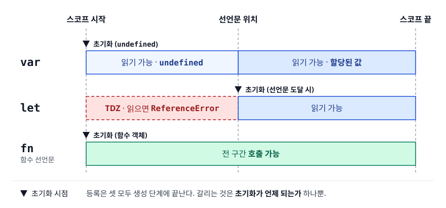

# 호이스팅과 TDZ (Hoisting & Temporal Dead Zone)

> "선언이 위로 끌어올려진다"는 설명은 결과만 맞고 원리는 틀렸습니다. 이 문서를 읽으면 호이스팅을 **등록과 초기화의 시점 차이**로 설명하고, TDZ가 왜 언어 설계상 필요했는지 근거를 댈 수 있습니다.

## 학습 목표

- [ ] 호이스팅이 코드 이동이 아니라 생성 단계의 선언 등록임을 설명할 수 있다
- [ ] `var` / `let` / `const`의 차이를 "초기화 시점"이라는 하나의 축으로 정리할 수 있다
- [ ] TDZ가 없던 시절의 버그를 예로 들며 TDZ의 존재 이유를 말할 수 있다
- [ ] 함수 선언문과 함수 표현식이 만드는 에러 종류(`TypeError` vs `ReferenceError`)를 구분할 수 있다

## 선행 지식

- [01-execution-context.md](./01-execution-context.md) - 생성 단계/실행 단계 구분을 알고 있어야 한다

---

## 1. 왜 이 개념이 생겼나

호이스팅은 누가 "만들자"고 설계한 기능이 아닙니다. **실행 컨텍스트가 두 단계로 동작한 결과 자연스럽게 드러난 현상**입니다.

엔진은 코드를 실행하기 전에 스코프 전체를 한 번 훑습니다. 왜냐하면 실행 도중에 처음 보는 이름이 튀어나올 때마다 "이게 지역 변수인가 전역 변수인가"를 다시 판정하는 건 비효율적이고, 서로를 호출하는 두 함수(상호 재귀)를 정의할 방법도 없어지기 때문입니다.

```js
// 이 코드가 동작하려면, isEven이 정의되기 전에 isOdd가 isEven을 알아야 한다
function isEven(n) { return n === 0 ? true : isOdd(n - 1); }
function isOdd(n)  { return n === 0 ? false : isEven(n - 1); }
console.log(isEven(10)); // true
```

즉 **선언을 먼저 수집하는 것 자체는 합리적인 설계입니다. 문제는 초기 JavaScript가 여기서 한 발 더 나가 "값도 `undefined`로 미리 채워두자"고 결정한 것이었습니다. 그 결정이 만든 부작용을 20년 뒤에 바로잡은 것이 TDZ다.

> **비유**: 회의 시작 전에 참석자 명패를 미리 책상에 깔아두는 것. `var`는 명패에 "미정"이라고 적어두고, `let`/`const`는 명패는 놓되 **비닐을 씌워** 본인이 도착하기 전에는 못 읽게 합니다.
>
> **비유의 한계**: 명패는 그냥 종이지만 환경 레코드의 바인딩은 값의 저장 위치 그 자체입니다. 그리고 "비닐"은 물리적 가림막이 아니라, 초기화 여부를 나타내는 내부 상태입니다.

---

## 2. 호이스팅의 실체 — 등록과 초기화

생성 단계에서 엔진이 하는 일은 두 가지로 쪼갤 수 있습니다.

| 단계 | 하는 일 |
|------|--------|
| **등록(binding 생성)** | 환경 레코드에 식별자 자리를 만든다 |
| **초기화(initialization)** | 그 자리에 최초 값을 넣어 "읽을 수 있는 상태"로 만든다 |

선언 종류별로 이 두 가지가 언제 일어나는지만 보면 모든 차이가 정리됩니다.

| 선언 | 등록 시점 | 초기화 시점 | 초기값 | 선언 전 접근 |
|------|----------|------------|--------|-------------|
| `var` | 생성 단계 | **생성 단계(즉시)** | `undefined` | `undefined` 반환 |
| `let` | 생성 단계 | 실행 단계, 선언문 도달 시 | 할당값(없으면 `undefined`) | `ReferenceError` |
| `const` | 생성 단계 | 실행 단계, 선언문 도달 시 | 할당값(필수) | `ReferenceError` |
| 함수 선언문 | 생성 단계 | **생성 단계(즉시)** | 함수 객체 | 정상 호출 |
| `class` | 생성 단계 | 실행 단계, 선언문 도달 시 | 클래스 | `ReferenceError` |

**표의 결론**: 호이스팅되지 않는 선언은 없습니다. 전부 생성 단계에 등록됩니다. 갈리는 것은 **초기화가 언제 되는가** 하나뿐입니다.

<!-- diagram:fe-hoisting-tdz-1 -->


<!-- 위 그림이 대체한 원본 ASCII.
     내용을 고칠 때는 그림도 함께 갱신할 것.
```
스코프 시작                    선언문 위치                 스코프 끝
    │                              │                          │
var │████████████████████████████████████████████████████████ │  전 구간 읽기 가능(undefined→값)
    │                              │                          │
let │░░░░░░░░░░░░░░░░░░░░░░░░░░░░░░│██████████████████████████ │  ░ = TDZ (읽으면 ReferenceError)
    │                              │                          │
fn  │████████████████████████████████████████████████████████ │  전 구간 호출 가능
```
-->

---

## 3. var — "조용한 undefined"가 만든 문제

```js
console.log(count); // undefined  ← 에러가 아니다
var count = 10;
console.log(count); // 10
```

에러가 나지 않는 것이 왜 문제인가? **버그가 에러가 아니라 잘못된 값으로 나타나기 때문**입니다.

```js
function getDiscount(user, price) {
  if (user.isVip) {
    var rate = 0.2;
  }
  return price * rate;   // 일반 회원이면 rate가 undefined → 결과는 NaN
}

getDiscount({ isVip: false }, 10000); // NaN
```

`rate`가 선언되지 않았다면 `ReferenceError`가 나서 즉시 알아챘을 것입니다. 그런데 `var` 덕분에 `undefined`가 반환되고, `price * undefined`는 `NaN`이 되어 화면 어딘가에 "NaN원"으로 조용히 흘러갑니다. **에러 위치와 증상 위치가 멀어지는 것**이 디버깅을 가장 어렵게 만듭니다.

여기에 `var`의 나머지 특성이 겹칩니다.

```js
var user = 'A';
var user = 'B';        // 재선언 허용 — 오타로 덮어써도 경고 없음
console.log(user);     // 'B'

if (true) { var leaked = 1; }
console.log(leaked);   // 1 — 블록을 뚫고 나온다

var g = 1;
console.log(globalThis.g); // 1 — 전역 객체 프로퍼티가 된다 (전역 스코프에서 선언 시)
```

마지막 항목은 특히 위험합니다. 전역 `var`는 `globalThis`의 프로퍼티가 되므로 다른 스크립트·라이브러리와 이름이 충돌할 수 있고, 전역 객체가 살아 있는 한 GC되지 않습니다. `let`/`const`는 전역 스코프에서 선언해도 별도의 선언적 환경 레코드에 들어가 전역 객체를 오염시키지 않습니다.

---

## 4. TDZ — 왜 굳이 에러를 내는가

`let`/`const`는 등록만 되고 초기화되지 않은 상태로 남습니다. 이 "스코프 시작 ~ 선언문 도달 직전" 구간이 **TDZ(Temporal Dead Zone, 일시적 사각지대)** 다.

```js
{
  // TDZ 시작
  // console.log(msg);        ReferenceError: Cannot access 'msg' before initialization
  // console.log(typeof msg); ReferenceError — typeof조차 막힌다
  const msg = 'hi';           // 초기화, TDZ 종료
  console.log(msg);           // 'hi'
}
```

`typeof`까지 막는 게 과해 보이지만 의도적입니다. 선언되지 않은 변수는 `typeof`가 `'undefined'`를 반환하는데, TDZ 변수도 똑같이 `'undefined'`를 반환한다면 **"선언 안 함"과 "아직 초기화 안 됨"을 구분할 수 없습니다. 두 상황은 원인도 해결책도 다르므로 구분해서 알려주는 편이 낫습니다.

```js
console.log(typeof neverDeclared); // 'undefined'  — 선언 자체가 없음
console.log(typeof tdzVar);        // ReferenceError — 선언은 있는데 아직 못 씀
let tdzVar = 1;
```

### TDZ가 실제로 잡아주는 버그

```js
let step = 'A';
function process() {
  console.log(step);   // 개발자 의도: 바깥의 'A'
  let step = 'B';      // 그런데 아래에 같은 이름을 선언했다
}
process();             // ReferenceError
```

`var`였다면 `undefined`가 찍히고 조용히 지나갔을 코드입니다. TDZ 덕분에 "이 스코프에 `step`을 새로 선언했으니 위쪽에서 바깥 `step`을 쓰는 건 실수 아니냐"고 즉시 알려줍니다. **TDZ의 목적은 불편함이 아니라, 실수를 값이 아니라 에러로 드러내는 것**입니다.

### 덜 알려진 TDZ 사례

```js
// 1) 매개변수 기본값도 왼쪽에서 오른쪽으로 초기화된다
function f(a = b, b = 2) { return [a, b]; }
// f();  ReferenceError: Cannot access 'b' before initialization
function g(a = 1, b = a) { return [a, b]; }
g();      // [1, 1] — 순서를 지키면 정상

// 2) class도 TDZ를 가진다
// new Item(); ReferenceError
class Item {}

// 3) 자기 자신을 참조하는 초기화
// let n = n + 1;  ReferenceError — 오른쪽 n을 평가하는 시점엔 아직 TDZ
```

---

## 5. 함수 선언문 vs 함수 표현식

같은 "함수를 만든다"인데 호이스팅 결과가 다르고, **에러 종류까지 다릅니다. 이 차이는 면접 단골입니다.

```js
declared();   // 'ok' — 함수 객체가 생성 단계에 통째로 초기화됨
function declared() { console.log('ok'); }

expressed();  // TypeError: expressed is not a function
var expressed = function () { console.log('ok'); };

arrowFn();    // ReferenceError: Cannot access 'arrowFn' before initialization
const arrowFn = () => console.log('ok');
```

```
함수 선언문        [등록 + 함수 객체 초기화] ──────────────► 언제든 호출 가능
                    생성 단계

함수 표현식(var)   [등록 + undefined 초기화] ─── 할당 ────► 할당 전 호출 = TypeError
                    생성 단계              실행 단계

함수 표현식(const) [등록만 / TDZ] ─────────── 할당 ──────► 할당 전 접근 = ReferenceError
                    생성 단계              실행 단계
```

에러 메시지가 다른 이유를 정확히 말할 수 있어야 합니다.

- `var expressed`는 이름을 읽는 데는 성공합니다. 다만 그 값이 `undefined`라 **호출이 실패**한다 → `TypeError`
- `const arrowFn`은 **이름을 읽는 것 자체가 실패**한다 → `ReferenceError`

### 이름이 겹치면 누가 이기나

```js
console.log(typeof dup); // 'function'  ← 함수 선언문이 우선
var dup = 1;
function dup() {}
console.log(typeof dup); // 'number'    ← 실행 단계에서 1이 할당됨
```

생성 단계에서는 함수 선언문의 초기화가 `var`의 `undefined`를 덮어씁니다. 그리고 실행 단계에서 대입문이 실행되면 다시 값이 바뀝니다. 이런 코드는 읽는 사람을 혼란시키므로 **이름 충돌 자체를 만들지 않는 것**이 정답입니다.

### 블록 안 함수 선언문은 피하자

```js
// 권장하지 않음 — 모드(strict/sloppy)에 따라 스코프 동작이 달라진다
if (cond) {
  function handler() {}
}

// 권장 — 스코프가 명확하다
const handler = cond
  ? (e) => submit(e)
  : (e) => e.preventDefault();
```

블록 레벨 함수 선언문은 과거 웹 호환성 때문에 규칙이 복잡합니다. 조건부로 함수를 만들어야 한다면 **함수 표현식과 `const`** 를 쓰면 고민할 일이 없습니다.

---

## 6. 안티패턴과 개선

### 안티패턴 1 — 호이스팅에 의존해 선언보다 먼저 호출

```js
// 안티패턴
init();
setupRoutes();
startServer();

function init() { /* ... */ }
function setupRoutes() { /* ... */ }
function startServer() { /* ... */ }
```

**왜 문제인가**: 지금은 동작합니다. 하지만 나중에 누군가 `function init()`을 `const init = () => {}`로 리팩터링하는 순간 전체가 `ReferenceError`로 죽습니다. 문법 스타일 변경이 런타임 크래시를 만드는 코드는 깨지기 쉽습니다. 또한 읽는 사람은 "이 함수가 어디서 오는지" 아래로 스크롤해야 합니다.

```js
// 개선 — 선언을 먼저, 호출을 나중에
function init() { /* ... */ }
function setupRoutes() { /* ... */ }
function startServer() { /* ... */ }

init();
setupRoutes();
startServer();
```

ESLint의 `no-use-before-define` 규칙으로 강제할 수 있습니다.

### 안티패턴 2 — 루프 카운터를 var로 선언

```js
// 안티패턴
for (var i = 0; i < 3; i++) {
  setTimeout(() => console.log(i), 0);
}
// 3, 3, 3
```

**왜 문제인가**: `var i`는 루프가 아니라 **함수 스코프에 단 하나만** 등록됩니다. 세 콜백이 전부 같은 바인딩을 참조하고, 콜백이 실행될 때쯤 `i`는 이미 종료값 `3`입니다. "각 반복마다 i의 복사본이 생긴다"는 직관이 틀린 것입니다.

```js
// 개선
for (let i = 0; i < 3; i++) {
  setTimeout(() => console.log(i), 0);
}
// 0, 1, 2
```

`let`을 쓰면 **반복마다 새 바인딩**이 만들어지고 직전 값이 복사되므로, 각 콜백이 서로 다른 `i`를 붙잡습니다. 이 동작의 원리와 다른 해법은 [03-closure.md](./03-closure.md)에서 자세히 다룹니다.

### 안티패턴 3 — const를 "불변"으로 오해

```js
// 안티패턴
const config = { retry: 3 };
config.retry = 99;          // 막힐 거라 기대했지만 통과한다
```

**왜 문제인가**: `const`는 **바인딩의 재할당**을 막을 뿐, 그 바인딩이 가리키는 객체 내부는 건드릴 수 있습니다. `const`를 붙였으니 안전하다고 믿고 객체를 여기저기 넘기면, 어딘가에서 몰래 수정된 값 때문에 추적이 어려운 버그가 생깁니다.

```js
// 개선 1 — 얕은 동결
const config = Object.freeze({ retry: 3 });
// config.retry = 99;  strict 모드에서 TypeError, 아니면 무시됨

// 개선 2 — 수정 대신 새 객체 생성
const nextConfig = { ...config, retry: 5 };
```

`Object.freeze`는 **1단계만** 얼린다는 점도 기억해야 합니다. 중첩 객체까지 막으려면 재귀적으로 동결하거나, 애초에 값을 복사해 새로 만드는 방식을 택합니다.

---

## 7. 실무에서는

**린트로 강제한다**: 대부분의 팀은 ESLint `no-var`, `prefer-const`, `no-use-before-define`을 켭니다. 규칙을 외우게 하는 대신 도구가 잡아주게 만드는 편이 안전합니다.

**빌드 도구와의 관계**: 트랜스파일러가 `let`을 `var`로 낮출 때(구형 브라우저 타깃) 이름이 겹치면 변수명을 바꾸고, 반복마다 새 바인딩이 필요한 자리는 함수로 감싸 블록 스코프 의미를 보존합니다. 그래서 소스에서 `let`을 쓰는 것과 손으로 `var`를 쓰는 것은 결과물이 다릅니다. "어차피 var로 바뀌니까 상관없다"는 말은 틀렸습니다.

**모듈 환경**: ES Module은 자동으로 strict 모드이고, 최상위 `var`도 전역 객체의 프로퍼티가 되지 않습니다. 모듈을 쓰는 것만으로 전역 오염 문제의 상당 부분이 사라집니다.

**TypeScript**: 타입 시스템이 있어도 TDZ는 런타임 개념이라 그대로 남습니다. 다만 대부분의 선언 전 사용은 컴파일 단계에서 `Block-scoped variable used before its declaration` 오류로 먼저 걸러집니다.

---

## 8. 면접 포인트

> 면접에서 이 주제가 나오면 이렇게 답한다

**Q. 호이스팅을 설명해주세요.**

A. 변수와 함수 선언이 스코프 최상단으로 끌어올려진 것처럼 동작하는 현상입니다. 실제로 코드가 이동하는 것은 아니고, 실행 컨텍스트 생성 단계에서 스코프 내 선언을 먼저 환경 레코드에 등록하기 때문에 나타납니다. 중요한 건 모든 선언이 등록된다는 점이고, 차이가 나는 부분은 초기화 시점입니다.

- 꼬리 질문: "`let`은 호이스팅이 안 되는 거 아닌가요?" → 등록은 됩니다. 등록이 안 된다면 바깥 스코프의 같은 이름을 찾아 올라갔을 텐데, 실제로는 `ReferenceError`가 납니다. 이것이 `let`도 호이스팅된다는 증거입니다.

**Q. TDZ는 왜 존재하나요?**

A. `var` 시절 선언 전 접근이 조용히 `undefined`를 반환해, 버그가 에러가 아니라 잘못된 값으로 흘러가는 문제가 있었습니다. TDZ는 선언 전 접근을 즉시 `ReferenceError`로 만들어 실수를 발생 지점에서 드러냅니다. `const`가 반드시 초기값을 요구하는 설계와도 일관됩니다.

- 꼬리 질문: "TDZ에서 `typeof`도 에러가 나는 이유는?" → 미선언 변수와 구분하기 위해서. 둘 다 `'undefined'`를 반환하면 원인 파악이 불가능해집니다.

**Q. 함수 선언문과 함수 표현식의 호이스팅 차이는?**

A. 함수 선언문은 생성 단계에서 함수 객체까지 초기화되어 선언 이전에도 호출할 수 있습니다. 함수 표현식은 변수 선언만 처리되므로, `var`면 `undefined` 상태에서 호출해 `TypeError`, `let`/`const`면 TDZ에 걸려 `ReferenceError`가 납니다.

- 꼬리 질문: "에러 종류가 다른 이유를 설명해보세요." → `var`는 이름 읽기에 성공하고 호출에 실패, `const`는 이름 읽기 자체에 실패하기 때문.

**Q. `var`를 쓰면 안 되는 이유를 세 가지 이상 들어보세요.**

A. 첫째, 함수 스코프라 블록을 뚫고 나가 의도치 않은 범위에서 살아남습니다. 둘째, 재선언이 허용되어 오타나 중복 선언이 조용히 값을 덮어씁니다. 셋째, 전역 선언 시 전역 객체의 프로퍼티가 되어 이름 충돌과 메모리 유지 문제를 만듭니다. 넷째, 선언 전 접근이 `undefined`가 되어 버그를 늦게 발견하게 만듭니다.

---

## 자주 하는 실수

| 실수 | 왜 틀렸나 | 올바른 이해 |
|------|----------|-----------|
| "`let`/`const`는 호이스팅되지 않는다" | 등록은 된다 | 등록은 되고 **초기화만 지연**된다 |
| "호이스팅은 선언과 할당이 같이 올라간다" | 할당은 실행 단계에 남는다 | 올라가는 건 **선언(등록)** 뿐 |
| "TDZ는 `let`만 해당" | `const`, `class`, 매개변수 기본값도 해당 | 초기화가 지연되는 모든 선언에 존재 |
| "`const`면 값이 안 바뀐다" | 재할당만 금지 | 객체 내부는 변경 가능, 필요하면 `Object.freeze` |
| "`typeof`는 어떤 경우에도 에러가 안 난다" | TDZ 변수엔 에러 | TDZ 구간의 `typeof`는 `ReferenceError` |
| "전역 `let`은 `window`에 붙는다" | `var`만 붙는다 | `let`/`const`는 별도 선언적 레코드에 저장 |

---

## 한 줄 정리

호이스팅은 코드 이동이 아니라 생성 단계의 선언 등록이며, `var`는 등록과 동시에 `undefined`로 초기화되지만 `let`/`const`/`class`는 선언문에 도달해야 초기화되기에 그 사이 구간(TDZ)에서 접근하면 `ReferenceError`로 실수를 즉시 알려줍니다.

---

## 연관 개념

- [01-execution-context.md](./01-execution-context.md) - 생성 단계와 실행 단계가 나뉘는 이유
- [03-closure.md](./03-closure.md) - `let`이 반복마다 새 바인딩을 만드는 동작의 응용
- [qna-javascript.md](./qna-javascript.md) - 호이스팅, `var`/`let`/`const` 면접 질문 모음
- [../typescript/qna-typescript.md](../typescript/qna-typescript.md) - 타입 시스템이 선언 전 사용을 잡아주는 방식
