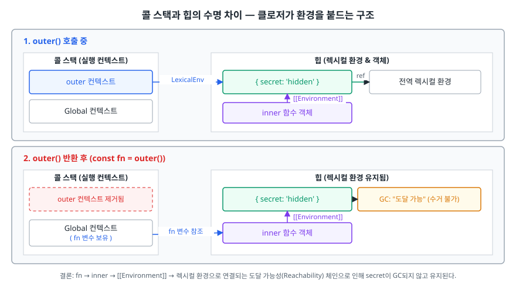
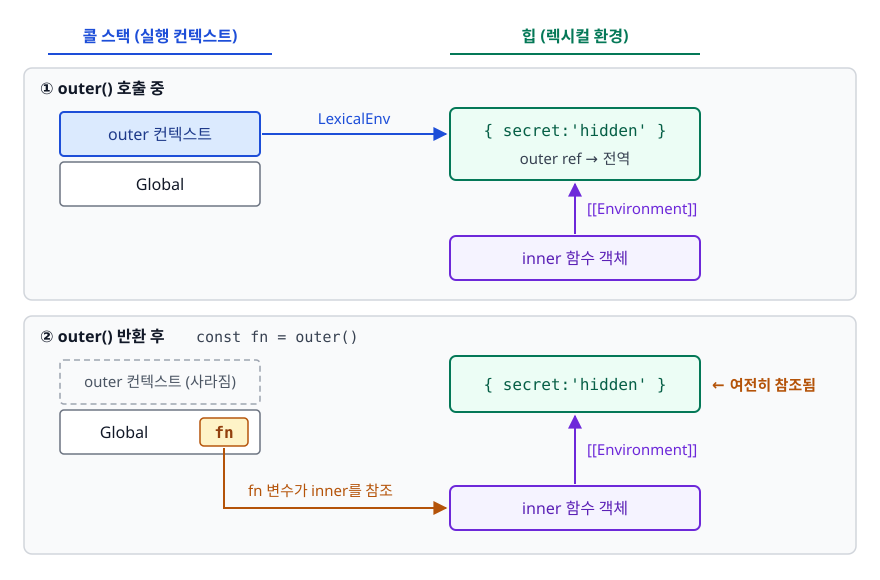
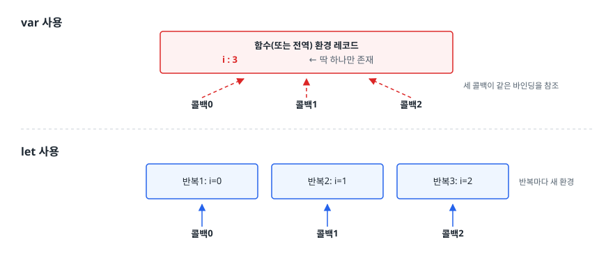

# 클로저 (Closure)

> 함수가 태어난 자리의 기억을 들고 다니는 현상. 이 문서를 읽으면 클로저를 "함수 + 렉시컬 환경"으로 정의하고, 은닉·팩토리·이벤트 핸들러 같은 실전 패턴이 왜 클로저 없이는 성립하지 않는지 설명할 수 있습니다.

## 학습 목표

- [ ] 클로저를 스코프 체인과 `[[Environment]]`로 설명할 수 있다
- [ ] 클로저가 값이 아니라 **바인딩**을 캡처한다는 사실을 코드로 증명할 수 있다
- [ ] 데이터 은닉, 모듈 패턴, 커링, 이벤트 핸들러에 클로저를 적용할 수 있다
- [ ] 반복문 + `var` 문제를 세 가지 방법으로 고칠 수 있다
- [ ] 클로저가 메모리 누수로 이어지는 조건과 해제 방법을 안다

## 선행 지식

- [01-execution-context.md](./01-execution-context.md) - 렉시컬 환경과 외부 참조
- [02-hoisting-tdz.md](./02-hoisting-tdz.md) - `var`와 `let`의 스코프 차이

---

## 1. 왜 필요한가

"호출될 때마다 1씩 증가하는 카운터"를 만들어보자. 클로저를 모른다면 선택지는 둘뿐입니다.

```js
// 방법 1 — 전역 변수
let total = 0;
function increment() { return ++total; }
// 문제: 누구나 total = 9999 로 바꿀 수 있다. 이름 충돌도 위험하다.

// 방법 2 — 매번 인자로 넘기기
function incrementFrom(prev) { return prev + 1; }
// 문제: 상태 관리 책임이 전부 호출하는 쪽으로 떠넘겨진다.
```

필요한 건 **"함수만 접근할 수 있고, 호출 사이에 살아남는 저장 공간"** 입니다. 다른 언어라면 클래스의 `private` 필드나 정적 변수로 해결합니다. JavaScript는 클래스 문법이 없던 시절부터 이 문제를 **함수의 스코프**로 풀었습니다. 그 결과가 클로저입니다.

```js
function createCounter() {
  let count = 0;                    // 바깥에서 접근 불가
  return () => ++count;             // 이 함수만 count를 안다
}

const next = createCounter();
console.log(next(), next(), next()); // 1 2 3
console.log(typeof count);           // 'undefined' — 외부에 노출되지 않음
```

> **비유**: 배낭을 멘 여행자. 함수가 태어난 방에서 필요한 물건(변수)을 배낭에 담아 나오면, 그 방이 헐린 뒤에도 물건을 꺼내 쓸 수 있습니다.
>
> **비유의 한계**: 배낭에는 물건의 **복사본**이 들어가지만 클로저가 담는 건 **원본 서랍 자체입니다. 같은 방에서 나온 여행자 둘은 같은 서랍을 공유합니다. 이 차이가 뒤에 나올 반복문 문제의 핵심입니다.

---

## 2. 정의와 동작 원리

### 정의

> 클로저는 **함수와, 그 함수가 선언된 렉시컬 환경의 조합**입니다.

거창해 보이지만 JavaScript에서는 모든 함수가 이 조건을 만족합니다. 함수 객체가 만들어질 때 엔진은 **자신이 정의된 렉시컬 환경을 `[[Environment]]` 내부 슬롯에 저장**합니다. 그래서 엄밀히 말하면 "모든 함수는 클로저"이며, 우리가 클로저라고 부를 때는 보통 **외부 함수가 종료된 뒤에도 그 변수를 계속 참조하는 경우**를 가리킵니다.

### 왜 종료된 함수의 변수가 살아남나

<!-- diagram:fe-closure -->


```js
function outer() {
  const secret = 'hidden';
  return function inner() { return secret; };
}
const fn = outer();   // outer 실행 컨텍스트는 콜 스택에서 사라졌다
console.log(fn());    // 'hidden' — 그런데도 secret은 살아 있다
```

핵심은 **실행 컨텍스트와 렉시컬 환경의 수명이 다르다**는 점입니다.

<!-- diagram:fe-closure-1 -->


<!-- 위 그림이 대체한 원본 ASCII.
     내용을 고칠 때는 그림도 함께 갱신할 것.
```
[ 콜 스택 (실행 컨텍스트) ]              [ 힙 (렉시컬 환경) ]

outer() 호출 중
┌──────────────┐                        ┌────────────────────┐
│ outer 컨텍스트│ ──── LexicalEnv ─────► │ { secret:'hidden' } │
└──────────────┘                        │  outer ref ──► 전역 │
┌──────────────┐                        └────────────────────┘
│ Global       │                                  ▲
└──────────────┘                                  │
                                          [[Environment]]
                                                  │
                                        ┌────────────────────┐
                                        │ inner 함수 객체     │
                                        └────────────────────┘

outer() 반환 후
┌──────────────┐                        ┌────────────────────┐
│ Global       │                        │ { secret:'hidden' } │ ← 여전히 참조됨
└──────────────┘                        └────────────────────┘
   ▲                                              ▲
   └── fn 변수가 inner를 참조 ──────────────────────┘
```
-->

컨텍스트는 스택에서 걷혔지만, **`fn`이 `inner`를 참조하고 `inner`가 `[[Environment]]`로 환경 레코드를 참조**하므로 가비지 컬렉터 입장에서 `secret`은 아직 "도달 가능한" 객체입니다. 그래서 수거되지 않습니다. 클로저는 GC 규칙을 어기는 예외가 아니라, **도달 가능성 규칙을 그대로 따른 결과입니다.

### 클로저는 값이 아니라 바인딩을 캡처한다

가장 많이 틀리는 지점입니다. 클로저는 함수가 만들어진 순간의 **값을 복사해두는 것이 아닙니다. 변수 자리(바인딩) 자체를 공유합니다.

```js
function make() {
  let v = 1;
  const read = () => v;
  const write = (nv) => { v = nv; };
  return { read, write };
}

const { read, write } = make();
console.log(read()); // 1
write(42);
console.log(read()); // 42  ← 값 복사였다면 여전히 1이었을 것
```

`read`와 `write`는 **같은 환경 레코드의 같은 `v`** 를 봅니다. 이 성질 덕분에 은닉된 상태를 여러 메서드가 조작할 수 있고, 동시에 이 성질 때문에 반복문 문제가 생깁니다.

---

## 3. 실전 활용

### 3-1. 데이터 은닉 — private 상태

```js
function createAccount(initial) {
  let balance = initial;                      // 외부 접근 불가

  return {
    deposit(amount) {
      if (amount <= 0) throw new Error('금액은 양수여야 합니다');
      balance += amount;
      return balance;
    },
    getBalance() { return balance; },
  };
}

const acc = createAccount(1000);
acc.deposit(500);
console.log(acc.getBalance()); // 1500
console.log(acc.balance);      // undefined — 직접 조작 불가
```

핵심은 은닉 자체가 아니라 **불변식(invariant)을 지킬 수 있다는 것**입니다. `balance`를 직접 못 바꾸므로 "잔액은 음수가 될 수 없다" 같은 규칙을 `deposit` 안에서 강제할 수 있습니다. 요즘은 클래스의 `#private` 필드로도 같은 목적을 달성합니다.

### 3-2. 모듈 패턴

ES Module이 없던 시절, 전역 오염 없이 코드를 묶는 유일한 방법이었습니다.

```js
const Logger = (function () {
  let level = 'info';                          // 모듈 내부 상태
  const levels = ['debug', 'info', 'warn'];

  function shouldLog(target) {
    return levels.indexOf(target) >= levels.indexOf(level);
  }

  return {
    setLevel(next) { if (levels.includes(next)) level = next; },
    warn(msg) { if (shouldLog('warn')) console.warn(msg); },
  };
})();

Logger.setLevel('warn');
Logger.warn('디스크 공간 부족');
```

즉시 실행 함수(IIFE)로 스코프를 만들고, 밖에 보여줄 것만 객체로 반환합니다. `levels`, `shouldLog`는 외부에서 볼 수 없습니다. 지금은 ESM의 `export`가 같은 역할을 하므로 신규 코드에서 이 패턴을 쓸 일은 거의 없지만, **레거시 코드를 읽을 때 반드시 만나는 형태입니다.

### 3-3. 함수 팩토리와 커링

```js
// 팩토리 — 인자를 캡처해 특화된 함수를 찍어낸다
const withPrefix = (prefix) => (msg) => `[${prefix}] ${msg}`;
const apiLog = withPrefix('API');
console.log(apiLog('요청 실패')); // '[API] 요청 실패'

// 커링 — 인자를 나눠 받는다
const between = (min) => (max) => (v) => v >= min && v <= max;
const isValidAge = between(0)(150);
console.log(isValidAge(30));  // true
console.log(isValidAge(200)); // false
```

`apiLog`가 `prefix`를 기억하는 이유가 클로저입니다. 설정값을 미리 고정한 "부분 적용된 함수"를 만들 수 있어, 반복되는 인자를 매번 넘기지 않아도 됩니다.

### 3-4. 한 번만 실행 / 메모이제이션

```js
function once(fn) {
  let called = false;
  let result;
  return function (...args) {
    if (!called) {
      called = true;
      result = fn.apply(this, args);
    }
    return result;
  };
}

const initAnalytics = once(() => {
  console.log('초기화');
  return { ready: true };
});

initAnalytics(); // '초기화' 출력
initAnalytics(); // 출력 없음, 같은 결과 반환
```

```js
function memoize(fn) {
  const cache = new Map();                 // 클로저에 캐시를 숨긴다
  return (n) => {
    if (cache.has(n)) return cache.get(n);
    const value = fn(n);
    cache.set(n, value);
    return value;
  };
}
```

`called`와 `cache`를 전역에 두지 않고도 호출 사이에 유지할 수 있다는 점이 핵심입니다.

### 3-5. 이벤트 핸들러와 디바운스

```js
function debounce(fn, delay) {
  let timerId = null;                       // 호출 사이에 살아남는 상태
  return function (...args) {
    clearTimeout(timerId);
    timerId = setTimeout(() => fn.apply(this, args), delay);
  };
}

const onSearch = debounce((e) => console.log('검색:', e.target.value), 300);
// input.addEventListener('input', onSearch);
```

디바운스·쓰로틀·재시도 카운터처럼 "이전 호출의 흔적을 기억해야 하는" 유틸리티는 전부 클로저 위에 세워집니다.

---

## 4. 반복문 + var 고전 문제

```js
for (var i = 0; i < 3; i++) {
  setTimeout(() => console.log(i), 0);
}
// 기대: 0 1 2 / 실제: 3 3 3
```

### 왜 이렇게 되나

<!-- diagram:fe-closure-2 -->


<!-- 위 그림이 대체한 원본 ASCII.
     내용을 고칠 때는 그림도 함께 갱신할 것.
```
var 사용
┌───────────────────────────────┐
│ 함수(또는 전역) 환경 레코드     │
│   i : 3   ← 딱 하나만 존재     │
└───────────────────────────────┘
      ▲        ▲        ▲
      │        │        │        세 콜백이 같은 바인딩을 참조
   콜백0     콜백1     콜백2

let 사용
┌──────────┐ ┌──────────┐ ┌──────────┐
│ 반복1: i=0│ │ 반복2: i=1│ │ 반복3: i=2│  반복마다 새 환경
└──────────┘ └──────────┘ └──────────┘
      ▲            ▲            ▲
   콜백0        콜백1        콜백2
```
-->

`var i`는 함수 스코프에 **바인딩 하나**만 만듭니다. 세 콜백은 전부 그 하나를 참조하고, 콜백이 실행되는 시점(동기 코드가 전부 끝난 뒤)에 `i`는 이미 종료 조건을 만족한 `3`입니다. 클로저가 값이 아니라 바인딩을 캡처한다는 성질이 그대로 드러난 사례입니다.

### 해법 1 — let (권장)

```js
for (let i = 0; i < 3; i++) {
  setTimeout(() => console.log(i), 0);
}
// 0 1 2
```

`let`으로 선언한 `for` 루프는 **반복마다 새 렉시컬 환경을 만들고 직전 반복의 값을 복사해 넣습니다. 각 콜백이 서로 다른 바인딩을 붙잡으므로 의도대로 동작합니다. 코드 변경이 한 글자뿐이라 실무에서는 사실상 이 방법만 씁니다.

### 해법 2 — IIFE로 스코프를 직접 만들기

```js
for (var i = 0; i < 3; i++) {
  (function (captured) {
    setTimeout(() => console.log(captured), 0);
  })(i);
}
// 0 1 2
```

즉시 실행 함수를 호출하면 그때마다 새 실행 컨텍스트가 생기고, 매개변수 `captured`는 그 반복의 값을 받은 **독립된 바인딩**이 됩니다. `let`이 없던 ES5 시절의 표준 해법입니다.

### 해법 3 — 값을 콜백 밖에서 고정

```js
for (var i = 0; i < 3; i++) {
  setTimeout(console.log, 0, i);   // 세 번째 인자부터는 콜백에 전달된다
}
// 0 1 2
```

`setTimeout`의 세 번째 이후 인자는 콜백 호출 시 그대로 전달됩니다. 이 값은 `setTimeout`을 **호출하는 순간** 평가되므로 당시의 `i` 값이 넘어갑니다. 클로저를 아예 쓰지 않고 문제를 우회하는 방식입니다.

| 해법 | 코드 변경량 | 언제 쓰나 |
|------|-----------|----------|
| `let` | 한 글자 | 신규 코드는 무조건 이것 |
| IIFE | 래핑 필요 | ES5만 지원해야 하는 레거시 |
| 인자 전달 | 시그니처 의존 | `setTimeout` 등 인자 전달을 지원하는 API 한정 |

**결론**: `let`을 쓰면 끝납니다. 나머지 둘은 "왜 `let`이 통하는지"를 이해하기 위한 대조군으로 알아두면 됩니다.

---

## 5. 메모리 관점 — 언제 문제가 되나

클로저가 유지하는 환경은 **참조가 끊길 때까지 GC 대상이 아닙니다. 대부분은 의도된 동작이지만, 두 경우에 누수가 됩니다.

### 경우 1 — 큰 데이터를 붙들고 있는 클로저

```js
// 안티패턴
function createHandler() {
  const hugeBuffer = new Array(1_000_000).fill('x'); // 큰 데이터
  const summary = hugeBuffer.length;                  // 실제로 필요한 건 이 값뿐

  return () => console.log(hugeBuffer.length);        // 배열 전체를 붙잡는다
}
const handler = createHandler(); // handler가 살아 있는 동안 배열도 살아 있다
```

**왜 문제인가**: 반환된 함수가 `hugeBuffer`를 참조하므로, 화면에서 사라진 컴포넌트의 핸들러 하나가 수 MB를 붙들 수 있습니다. 필요한 값은 숫자 하나인데 원본 배열 전체가 남습니다.

```js
// 개선 — 필요한 값만 캡처한다
function createHandler() {
  const hugeBuffer = new Array(1_000_000).fill('x');
  const size = hugeBuffer.length;          // 원시값만 뽑아둔다
  return () => console.log(size);          // hugeBuffer는 참조되지 않음 → GC 가능
}
```

주의할 점이 하나 더 있습니다. 같은 외부 함수 안에서 만들어진 여러 클로저는 **환경을 공유**합니다. 그래서 형제 함수 중 하나라도 큰 변수를 참조하면, 그 변수는 엔진 구현에 따라 다른 클로저가 살아 있는 동안에도 유지될 수 있습니다. 큰 데이터는 아예 그 스코프에 두지 않는 편이 안전합니다.

### 경우 2 — 정리하지 않은 리스너·타이머

```js
// 안티패턴
function mount(node) {
  const state = { records: fetchHugeList() };
  node.addEventListener('click', () => render(state));
  // 노드를 제거해도 리스너 참조가 남으면 state도 남는다
}
```

```js
// 개선 — 해제 함수를 반환해 수명을 명시적으로 관리
function mount(node) {
  const state = { records: fetchHugeList() };
  const onClick = () => render(state);
  node.addEventListener('click', onClick);
  return () => node.removeEventListener('click', onClick);
}

const unmount = mount(el);
// 컴포넌트가 사라질 때
unmount();
```

`setInterval`도 마찬가지입니다. `clearInterval`을 호출하지 않으면 콜백과 그 클로저가 영원히 살아남습니다. **"등록했으면 해제한다"** 는 규칙 하나로 클로저 누수의 대부분을 막을 수 있습니다.

객체에 부가 데이터를 매달아야 한다면 `WeakMap`을 쓰는 것도 방법입니다. 키 객체가 수거되면 값도 함께 정리됩니다.

---

## 6. 실무에서는

**React**: 함수 컴포넌트는 렌더될 때마다 새로 호출되고, 그 안에서 만들어진 핸들러는 **그 렌더 시점의 props/state를 캡처**합니다. 그래서 `useEffect`의 의존성 배열을 빼먹으면, 이펙트 안 함수가 첫 렌더의 값을 계속 붙잡는 **stale closure(오래된 클로저)** 버그가 생깁니다. "이상하게 값이 안 바뀐다"의 상당수가 이 문제이며, 해결책은 의존성을 정확히 적거나 최신 값을 참조하는 형태(함수형 업데이트, ref)로 바꾸는 것입니다.

**번들 크기와 성능**: 클로저는 힙에 환경 객체를 만듭니다. 초당 수만 번 호출되는 경로에서 매번 새 클로저를 생성하면 GC 압력이 생깁니다. 다만 이는 측정 후에 다룰 문제이며, 가독성을 먼저 희생할 이유는 없습니다.

**보안 오해**: 클로저 은닉은 "다른 코드가 실수로 건드리는 것"을 막는 캡슐화 장치입니다. 브라우저 개발자 도구에서 디버거로 멈추면 스코프 내용이 그대로 보입니다. **비밀 키를 클로저에 넣는 것은 보안이 아니다.**

---

## 7. 면접 포인트

> 면접에서 이 주제가 나오면 이렇게 답한다

**Q. 클로저란 무엇인가요?**

A. 함수 객체가 자기가 정의된 자리의 렉시컬 환경을 `[[Environment]]`에 붙들고 다니는 성질, 그리고 그 결과로 생기는 현상을 함께 가리킵니다. 이 참조 때문에 외부 함수의 실행 컨텍스트가 콜 스택에서 제거된 뒤에도 그 환경 레코드는 도달 가능한 상태로 남고, 내부 함수는 종료된 스코프의 변수를 계속 읽고 쓸 수 있습니다.

- 꼬리 질문: "그럼 모든 함수가 클로저인가요?" → 명세상으로는 그렇습니다. 다만 실무에서 클로저라고 부를 때는 외부 스코프 변수를 실제로 참조해 그 환경을 살려두는 경우를 가리킵니다.

**Q. 클로저는 값을 복사하나요, 참조하나요?**

A. 바인딩을 참조합니다. 같은 스코프에서 만들어진 여러 클로저는 같은 변수를 공유하므로, 한쪽에서 값을 바꾸면 다른 쪽에서도 바뀐 값이 보입니다. 반복문에서 `var`를 쓰면 콜백들이 모두 같은 카운터 바인딩을 보게 되어 마지막 값만 출력되는 것도 같은 이유입니다.

- 꼬리 질문: "`let`은 왜 다른가요?" → `for (let ...)`은 반복마다 새 환경을 만들고 직전 값을 복사해 넣기 때문에 각 콜백이 서로 다른 바인딩을 캡처합니다.

**Q. 클로저의 단점과 대응 방법은?**

A. 참조되는 변수가 GC 대상에서 제외되므로 큰 데이터를 붙들면 메모리를 계속 점유합니다. 필요한 값만 원시값으로 뽑아 캡처하고, 이벤트 리스너나 타이머는 등록한 만큼 반드시 해제하며, 객체에 부가 데이터를 매달 때는 `WeakMap`을 쓰는 식으로 대응합니다.

- 꼬리 질문: "메모리 누수를 어떻게 확인하나요?" → DevTools Memory 패널에서 힙 스냅샷을 비교해 해제되지 않은 객체와 그 retainer 경로를 추적합니다.

**Q. 클로저를 실무에서 어디에 쓰나요?**

A. 상태를 은닉한 카운터·캐시, 설정을 고정한 함수 팩토리와 커링, 디바운스·쓰로틀처럼 호출 사이에 타이머 ID를 유지해야 하는 유틸리티, 그리고 React 함수 컴포넌트의 이벤트 핸들러가 대표적입니다. 공통점은 "전역을 쓰지 않고 호출 사이에 상태를 유지"해야 한다는 점입니다.

---

## 자주 하는 실수

| 실수 | 왜 틀렸나 | 올바른 이해 |
|------|----------|-----------|
| "클로저는 값을 복사해 기억한다" | 바인딩을 공유한다 | 값이 바뀌면 클로저가 보는 값도 바뀐다 |
| "클로저는 반환된 함수에만 생긴다" | 반환은 조건이 아니다 | 콜백으로 넘기거나 변수에 담아도 성립 |
| "외부 함수가 끝나면 변수는 사라진다" | 도달 가능하면 남는다 | 컨텍스트는 사라져도 환경 레코드는 힙에 유지 |
| "클로저 = 메모리 누수" | 대부분은 정상 동작 | 정리하지 않은 참조가 남을 때만 누수 |
| "클로저로 감추면 안전하다" | 디버거로 다 보인다 | 캡슐화 수단이지 보안 수단이 아니다 |
| "`for (var i...)` + `setTimeout`은 순서 문제" | 순서가 아니라 바인딩 문제 | 콜백 세 개가 같은 `i` 하나를 본다 |

---

## 한 줄 정리

클로저는 함수가 `[[Environment]]`로 붙잡은 렉시컬 환경 덕분에 외부 함수 종료 후에도 그 **바인딩**에 접근하는 현상이며, 상태 은닉과 함수 팩토리를 가능하게 하는 대신 참조를 놓지 않으면 메모리를 계속 붙듭니다.

---

## 연관 개념

- [01-execution-context.md](./01-execution-context.md) - `[[Environment]]`와 스코프 체인이 만들어지는 원리
- [02-hoisting-tdz.md](./02-hoisting-tdz.md) - `var`와 `let`의 바인딩 생성 단위 차이
- [04-event-loop.md](./04-event-loop.md) - 콜백이 나중에 실행되기 때문에 클로저 문제가 드러나는 이유
- [qna-javascript.md](./qna-javascript.md) - 클로저·스코프 면접 질문 모음
- [../react-architecture/qna-react.md](../react-architecture/qna-react.md) - Hook에서 발생하는 stale closure 문제
